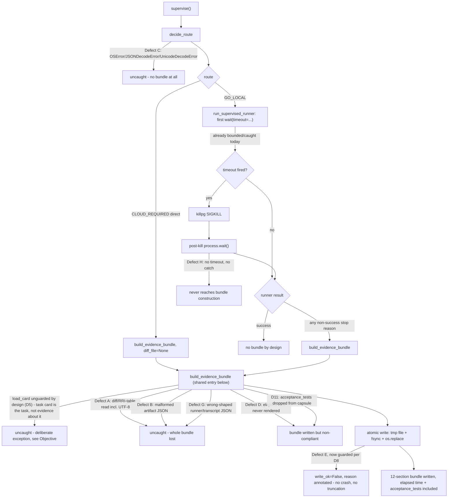

# Plan: ADR-038 Evidence Bundle Loss on Non-Success Routes

> **Status:** Complete — surfaced 2026-07-26, rewritten 2026-07-26 after five
> rounds of peer review, implemented and closed 2026-07-26 (see
> `docs/tasks/med-high-escalation-bundle-crash.md` T5 closure evidence)
> **Tasks ledger:** `docs/tasks/med-high-escalation-bundle-crash.md`
> **Discovered by:** `agent-session-preflight-gate` T4a1 closure evidence
> **Peer review:** Codex `gpt-5.6-sol`. Revision 1 REJECT (13 findings).
> Revision 2 REJECT (B7 blocking: routing exception was a rationalization;
> B11 blocking: objective unachievable as scoped). Revision 3 REJECT (bundle
> still incomplete on the legitimate route; atomic-write failure had no
> reporting channel; `process.wait()` fix targeted the wrong exception;
> `acceptance_tests` rendering was unimplementable as specified; a second
> wrong-shaped-JSON path was missed). Revision 4 REJECT (`UnicodeDecodeError`
> conflated with shape validation and left unfixed; ADR-036 CLI `.get()` crash
> not actually prevented; inserting a shared section silently amended ADR-036's
> normative seven-field contract; call-site count wrong at 3 instead of 4;
> fixture "pre-change" baseline kept moving instead of being resolved; the
> top-level Objective was never narrowed to match D8's honest contract).
> Revision 5 REJECT (a second, undocumented `load_card` crash path on the
> direct `CLOUD_REQUIRED` route was found — the Objective's "only Defect E
> carries a caveat" claim was false; the control-flow diagram had
> `decide_route` and the runner launch in the wrong order; fixture storage
> location was unspecified, leaving the RRI file surface unverifiable; the
> shape-check fix still lost the failure reason and mis-described section 7's
> rendering; a stale ledger paragraph still described the rejected
> shared-`build_packet` design; `T4b` was missing `T4` as a dependency; `T5`
> never actually required the `final_*` fixture evidence it promised). This
> revision closes all of the above. See "Peer review disposition".

## Objective

ADR-038 section 5 states:

> "Every non-successful local route emits a handoff bundle containing the
> immutable task capsule, refinement artifact, primary receipt, effective
> limits, transcript or last checkpoint, partial diff, commands/tests, stop
> reason, hashes, model identity, and elapsed time."
> — `docs/adr/ADR-038-med-high-architect-refined-single-attempt.md:101-106`

Today several independent unguarded paths can raise or silently drop fields
instead, and the escalation evidence is destroyed at exactly the moment the
local band fails. This plan closes every such path this analysis found.

**The literal contract above is not, and cannot be, made unconditionally
true** — review 4 (finding 13, confirmed) correctly caught that earlier
revisions kept this literal wording in the Objective while D8 already
conceded a narrower, honest version further down. Stated precisely, so the
two do not contradict each other: **every non-successful local route
attempts to emit a complete handoff bundle**, subject to exactly two
named, deliberate exceptions — not one:

1. **The bundle write itself (Defect E, D8).** If the write fails (full
   disk, revoked permission on the parent directory), that failure is
   reported structurally in `SupervisorResult` rather than silently losing
   or truncating the bundle — but a storage-layer failure cannot be
   converted into a successful write by any amount of application-level
   guarding.
2. **The task card read (`load_card`, D5) — including on the direct
   `CLOUD_REQUIRED` route.** Review 5 (Part B, confirmed, blocking) found
   the previous revision's "only Defect E carries a caveat" claim was false:
   `build_evidence_bundle` calls `escalation_packet.load_card(card_path)`
   unguarded as its first statement (`run_med_high_task.py:192`), including
   on the direct `CLOUD_REQUIRED` route (`:295-307`) where no local session
   has even run yet. A missing, unreadable, or malformed task card at that
   point crashes before the atomic write in D8 is ever reached, exactly as
   Defects A/B/C/F/G did before this plan's fixes — but this one is left
   unfixed by design, for the same reason `load_card` and the transcript
   `load_json` are already exempted in D5: **the task card is not evidence
   *about* the task, it is the definition of the task.** If it cannot be
   read, there is no well-formed task to escalate to cloud in the first
   place, and no bundle — however complete — would give a cloud continuation
   anything to act on. This is qualitatively different from a missing diff,
   artifact, or runner output, where the task itself remains well-defined
   and only some evidence about *what happened while attempting it* is
   absent. Recording this explicitly, rather than letting it hide inside a
   general fail-loud policy, is what review 5 required.

Every crash-based evidence-loss path this analysis identified — Defects A,
B, C, F, G, H, and the required-input reads already covered by D5 — is
closed for every input this plan classifies as genuinely optional. The two
exceptions above are the only inputs this plan leaves capable of preventing
bundle emission, and both are named, load-bearing design decisions, not
oversights.

## Context

During `T4a1` of `docs/tasks/agent-session-preflight-gate.md` the bounded
implementer session ended `status: budget_exhausted` having written no code and
therefore no diff file. No escalation bundle was produced. The failure had to be
diagnosed by hand from the worktree and the raw transcript. The owed follow-up
was recorded as prose inside that task's closure evidence and never filed.

The first revision of this plan scoped the work to the missing diff alone. Peer
review demonstrated that the diff is one of three defects in the same class, and
that fixing only the diff would leave the section-5 contract false. The scope
below is the contract, not the symptom.

## Defect inventory

### Defect A — Unguarded optional diff read (the originally reported symptom)

`escalation_packet.read_text_file` returns `None` for a falsy path but performs
an unguarded `open()` for any non-empty path:

```python
def read_text_file(path):                     # escalation_packet.py:27-31
    if not path:
        return None
    with open(path, encoding="utf-8") as f:   # no guard
        return f.read()
```

Two callers pass an **optional** path into it:

| Caller | Line | Path |
|---|---|---|
| `build_evidence_bundle` | `run_med_high_task.py:194` | ADR-038 bundle |
| `escalation_packet.main` | `escalation_packet.py:208` | ADR-036 CLI |

Both raise `FileNotFoundError` when the session never wrote a diff,
`PermissionError` when the file is unreadable, and `IsADirectoryError` when the
path is a directory.

**Blast radius.** In `build_evidence_bundle` the read is the third statement.
Sections 1-7 are not constructed until `:197`, sections 8-11 until `:210-239`,
and nothing is written to disk until `:246-247`. A missing diff therefore
destroys the refinement artifact, the primary receipt, the effective limits and
the stop-reason footer as well — none of which depend on the diff.

### Defect B — Malformed JSON escapes bundle construction

`refinement_artifact_path` and `primary_receipt_path` are guarded with
`os.path.isfile` at `run_med_high_task.py:199-208`, but the guarded call is
`_load_json` (`:54-56`), which is itself unguarded. An existing file that is
unreadable or contains malformed JSON raises `OSError`/`json.JSONDecodeError`
straight out of bundle construction. Existence is not readability.

Contrast `_read_runner_out` at `:158-164`, which is the correct idiom already
present in the same file: `os.path.isfile` **plus** `try/except (OSError,
json.JSONDecodeError)` returning `None`.

### Defect C — The fail-closed gate fails open by crashing

`decide_route` reads both gate inputs with the unguarded `_load_json`:

```python
refinement_artifact = _load_json(refinement_artifact_path)   # :65
primary_receipt = _load_json(primary_receipt_path)           # :66
```

`supervise` wraps that call in a single `except med_high_gate.GateError`
(`:271-279`) — verified as the only exception handler on the routing path.
`OSError` and `json.JSONDecodeError` escape uncaught **before any bundle is
built at all**.

This is the most severe of the three, because `decide_route`'s own docstring
(`:62-64`) declares the opposite contract:

> "Any read or validation failure is surfaced as `CLOUD_REQUIRED` by the caller,
> never as an uncaught exception that could be mistaken for a crash."

A gate designed to be fail-closed currently fails by crashing on unreadable
input, producing no route decision and no evidence.

### Defect D — Elapsed time is never written to the bundle

ADR-038 section 5 requires elapsed time in every handoff bundle. Section 11
(`run_med_high_task.py:230-237`) emits stop reason, card hash, refinement
artifact SHA-256, runner model and runner status — never elapsed time.
`build_evidence_bundle` has no elapsed-time parameter at all (`:167-179`),
even though `elapsed_s` is already computed and returned inside
`SupervisorResult`. Without this, the objective this plan sets out to satisfy
is false by construction, independent of Defects A-C.

### Defect E — The bundle write itself is unguarded and non-atomic

`open(..., "w")` / `write()` at `run_med_high_task.py:246-247` has no
exception handling and writes in place. A permission failure, missing parent
directory, full disk, or interrupted write yields no usable bundle and can
truncate a bundle that already existed at that path. Every fix to Defects
A-D is moot if the finished bundle can still be lost at the last line.

### Defect F — UTF-8 failures are not covered by any proposed catch

All reads in scope declare `encoding="utf-8"` (`escalation_packet.py:30`;
`run_med_high_task.py:55`). A file that exists, is readable, and even
contains syntactically valid JSON bytes in another encoding raises
`UnicodeDecodeError`, which is neither `OSError` nor `json.JSONDecodeError`
and therefore escapes every guard this plan originally proposed for Defects
A, B, C, and the optional RRI-table read.

### Defect G — A structurally valid but wrong-shaped runner artifact still crashes

`_read_runner_out` (`:158-164`) accepts any successfully parsed JSON,
including a JSON list or scalar. That value then reaches `.get()` in
`supervise` (`:320-336`) or `build_packet` (`escalation_packet.py:169-171`),
raising `AttributeError` on a non-dict. Guarding the read is not sufficient;
the parsed shape must also be checked.

### Defect H — Unbounded `process.wait()` after a timeout kill can block bundle construction

After a successful kill on timeout, `process.wait()` (`:123-145`) is
unguarded and unbounded. If it raises or never returns, `supervise` never
reaches bundle construction at all, silently reproducing the same
evidence-loss outcome Defects A-C cause, on a path none of them touch.

### Why all three original defects stayed invisible

`build_evidence_bundle` has exactly three call sites — gate rejection (`:279`),
direct `CLOUD_REQUIRED` routing (`:297`), and non-successful local execution
(`:338`). The successful `GO_LOCAL` path at `:322-328` returns
`bundle_path=None` and deliberately builds nothing.

The precise statement, corrected from the first revision: **the defects cannot
fire on the successful `GO_LOCAL` path because that path builds no bundle. They
can fire on every bundle-producing route, including direct `CLOUD_REQUIRED`,
which is a legitimate routing outcome rather than a failure.** A green run never
exercises them.

## Scope boundary on `resolve_rri_table`

`resolve_rri_table` (`escalation_packet.py:196-201`) accepts a value documented
at `:189-192` as "a path to a markdown file **or the table text itself**":

```python
if os.path.isfile(rri_table_arg):
    return read_text_file(rri_table_arg)
return rri_table_arg          # a nonexistent path becomes literal table text
```

Peer review (B8, then a correction in review 3) split this into two distinct
behaviors that this plan's earlier revisions conflated, and review 3 caught a
factual error in the previous version of this section: `os.path.isfile()`
returns `False` for a directory, so a directory argument does **not** reach
`read_text_file` at all — it falls straight into the `return rri_table_arg`
branch and is silently treated as literal table text. A directory is
therefore a path-vs-text ambiguity case, not a read-failure case, and the
previous draft had it backwards.

- **Path-or-text ambiguity — stays out of scope.** A nonexistent path, or a
  path to a directory, silently becomes literal "table text" (in the
  directory case, the directory path string itself). Neither ever raises, so
  neither can destroy a bundle; both are fidelity defects in a declared CLI
  contract, and disambiguating the contract is a separate design question.
  `T5` files the follow-up (`docs/tasks/rri-table-path-text-ambiguity.md`).
- **Read failure on a path that `os.path.isfile` confirms is a regular file —
  brought into scope.** If the file is unreadable (permissions), disappears
  between the `isfile` check and the read, or is not valid UTF-8,
  `read_text_file` raises `OSError` or `UnicodeDecodeError` and destroys the
  bundle exactly like Defects A and B. This is an evidence-loss defect and
  belongs in `T1` alongside the other `read_text_file` hardening, because it
  is the same function. It does **not** include the directory case, which is
  out of scope per the bullet above.

## Design decisions

### D1 — Fix the shared helper, used by both packet builders

**This reverses the first revision, whose premise peer review falsified.** That
revision argued the guard belonged at the ADR-038 call site because
`read_text_file` is shared with an ADR-036 path where missing *required* files
must fail loudly. Verification shows no required input flows through it:

- `escalation_packet.py:184-186` — `--transcript`, `--card`, `--out` are all
  `required=True`.
- `escalation_packet.py:187` — `--diff-file` is `default=None`.
- `escalation_packet.py:206-207` — required inputs are read with
  `load_card`/`load_json`, never with `read_text_file`.

`read_text_file` has exactly three production callers: the two optional diff
reads and the optional RRI table (`escalation_packet.py:200`, corrected from
revision 2's "only two callers", which missed this third one). Introduce
`read_optional_text_file` with explicit failure semantics and use it at all
three call sites — the two diffs per Defect A/D1 and the RRI table per the
"Scope boundary on `resolve_rri_table`" section above. Per-call-site guards
would leave the packet builders free to diverge on a contract that must be
identical.

### D2 — Guard by handling exceptions, not by checking existence

`os.path.isfile` cannot satisfy the unreadable-file case: it returns `True` for
a file whose permissions deny reading, and `read_text_file` still raises
`PermissionError`. It also leaves a check/open race where the file disappears
between the two calls. Catch `(OSError, UnicodeDecodeError)` — `OSError`
covers `FileNotFoundError`, `PermissionError` and `IsADirectoryError`;
`UnicodeDecodeError` covers a readable file that is not valid UTF-8 (Defect
F) — around the read itself.

The same applies to Defect B and to the `resolve_rri_table` read-failure case:
reuse the `_read_runner_out` idiom at `:158-164`, extended to also catch
`UnicodeDecodeError` alongside its existing `(OSError, json.JSONDecodeError)`.

### D3 — Distinguish "absent" from "unreadable", both fail-visible

Three outcomes must be textually distinguishable in the bundle, because they
mean different things to a cloud continuation:

| Situation | Rendered section 4 |
|---|---|
| No `diff_file` argument | `MISSING` (unchanged) |
| Path given, file does not exist | `MISSING (diff file not found: <path>)` |
| Path given, read failed | `MISSING (diff file unreadable: <path>: <error>)` |

A missing diff must never be rendered as an empty diff block, which a cloud
continuation could misread as "no changes were needed". Exact strings are
normative so the acceptance criteria are testable.

### D4 — Byte-identical output on every currently-working path, proven at the byte level, with named immutable fixture generations

Peer review (B10) found that one golden packet cannot prove this: the
existing `escalation_packet_test.py:65-190` fixture is a single readable-diff
case compared as rendered text, not bytes.

Review 4 (Part B finding 9, confirmed, major) then found the fix for *that*
still incomplete: because this ticket's own tasks (`T4`, `T4b`) intentionally
change the bundle's shape (a new section, an elapsed-time field), a single
"pre-change" fixture set cannot simultaneously serve as the byte-identity
baseline for `T1`-`T3` (which must NOT change output) and also get
"regenerated" to bless `T4`/`T4b`'s intentional changes — regenerating a
fixture that is supposed to prove nothing changed is a contradiction in
terms, not a byte-identity proof.

The corrected design uses three **named, immutable** fixture generations,
each frozen once and never overwritten by a later task. Review 5 (Part B,
confirmed, major) found the previous revision left their storage location
unspecified, which left the RRI file-surface (`F`) unverifiable. Resolved
here: **fixtures are inline Python string constants inside the existing test
files, following the repository's own established convention** — the
existing `EXPECTED_GOLDEN` constant in `escalation_packet_test.py:65-161` is
exactly this pattern already. No new fixture files are created on disk, so
the RRI touches list is unaffected by this decision.

1. **`PRE_TICKET_*`** constants (e.g. `PRE_TICKET_BUNDLE_WITH_DIFF`,
   `PRE_TICKET_BUNDLE_NO_DIFF`, `PRE_TICKET_BUNDLE_WITH_RRI_TABLE`) — captured
   from the repository state *before any task in this ticket lands* (the
   ledger's `T1` records the exact commit SHA they were captured from, in a
   comment beside the constants). Used by `T1`, `T2`, and `T3` to prove their
   changes are byte-identical to today's output on every currently-working
   path: (a) readable diff + valid artifacts, (b) `diff_file=None` + valid
   artifacts, (c) valid artifacts with the other optional fields used by
   normal routing. `T1`-`T3` compare against these constants and **never
   modify them**.
2. **`POST_SCHEMA_*`** constants — captured once, after `T1`, `T2`, and `T4`
   have all landed (`T4` depends on `T1`/`T2`, so this fixture generation
   necessarily includes their fixes plus `T4`'s own schema change: the new
   `acceptance_tests` section, sections renumbered within
   `build_evidence_bundle` only), covering the same three path classes plus a
   fourth: a task card with a non-empty `acceptance_tests` list. `T4` adds
   these constants and freezes them as `T4b`'s baseline; `T4b` does not
   modify `POST_SCHEMA_*`, it adds its own constants below.
3. **`FINAL_*`** constants — captured once, after `T4b` lands (elapsed time
   present, atomic write in place), covering the same path classes as
   `POST_SCHEMA_*` plus elapsed time. This is the ticket's actual final-state
   fixture set, and `T5`'s closure evidence must include the passing test run
   that exercises them as proof the finished bundle matches what all five
   development tasks jointly specify.

Every currently-working path must be byte-identical to its fixture, compared
via `self.assertEqual(actual, EXPECTED)` on the full string content (matching
the existing `test_golden_output_matches_exactly` idiom), not a substring
check; only the newly-guarded failure paths (which have no pre-existing
behavior to preserve) are new, and their exact rendered text is specified
directly in each task's acceptance criteria rather than via a fixture
constant.

### D5 — Required inputs stay fail-loud

`load_card` and the transcript `load_json` remain unguarded by design: a missing
task card means there is no task to escalate, and failing loudly is correct.
Only genuinely optional inputs become fail-visible.

### D6 — Gate read failures become `CLOUD_REQUIRED`, as already documented

Defect C is fixed by making the code honor `decide_route`'s existing docstring
rather than by rewriting the docstring. An unreadable or malformed gate input
routes to cloud with a bundle, which is the fail-closed outcome ADR-038's
"primary may only downgrade, never upgrade" rule already implies.

### D7 — Elapsed time becomes a required `build_evidence_bundle` parameter

`supervise` already computes `elapsed_s` for `SupervisorResult`. Thread the
same value into `build_evidence_bundle` and render it in the stop-reason
section alongside the existing hashes, model identity and runner status. The
three `build_evidence_bundle` call sites that exist today
(`run_med_high_task.py:279,297,338`), plus the fourth `T3` adds on its new
`CLOUD_REQUIRED`-from-gate-failure branch (review 6, confirmed, minor: this
decision previously said "all three," which was stale once `T3`'s call site
entered the picture — see D8 item 4 for the full, correct count), all pass
their already-available elapsed time; none require new measurement.

### D8 — Bundle write becomes guarded and atomic, with a defined failure-reporting channel

Peer review (review 3) confirmed the original D8 text named a mechanism
without a contract: `build_evidence_bundle` returns only a path today, so
"surfacing a fail-visible stop reason" had nowhere to go. The full, concrete
contract:

1. Write bundle content to `f"{bundle_out_path}.tmp"` in the same directory,
   `flush()` + `os.fsync()` the file descriptor, then `os.replace()` it onto
   `bundle_out_path`. This guarantees a reader never observes a
   partially-written bundle, because `os.replace` is atomic on the same
   filesystem.
2. `build_evidence_bundle`'s return type changes from `str` (path) to a
   `BundleWriteResult` dataclass: `{path: str, write_ok: bool, write_error:
   str | None}`. `path` is typed `str`, not `str | None` (review 4, confirmed
   — the previous `str | None` was needless ambiguity): it always holds the
   intended `bundle_out_path`, regardless of outcome, so callers can log
   where a bundle *should* be even when the write failed. Only
   `write_error` is optional, since it is `None` exactly when `write_ok` is
   `True`.
3. The write is wrapped to catch **both** `OSError` (disk/permission/path
   failures during the temp-write, fsync, or replace) **and**
   `UnicodeEncodeError` (review 4, confirmed, finding 13: the packet content
   being written can include arbitrary text pulled from a task card or
   artifact JSON via `json.dumps`/string interpolation, and while the file is
   opened with `encoding="utf-8"` — which can represent any Python `str` — a
   surrogate or otherwise unencodable code point reaching the stream can
   still raise `UnicodeEncodeError` on `write()`, the mirror image of the
   `UnicodeDecodeError` this plan already guards on the read side). Either
   exception is caught, `build_evidence_bundle` returns `write_ok=False` with
   `write_error=str(exc)`, and does **not** re-raise. It does not attempt to
   write anything else to `bundle_out_path` (leaving any prior bundle at that
   path untouched, per the atomicity guarantee above).
4. `supervise` propagates this into `SupervisorResult`: add a `bundle_write_ok:
   bool` field (default `True` for the `GO_LOCAL`-success path, where no
   bundle is attempted). When `bundle_write_ok` is `False`,
   `SupervisorResult.reason` is amended to append
   `f" (bundle write failed: {write_error})"`, so the failure is visible in
   the same JSON payload `main()` already prints to stdout — the CLI does not
   gain a new output channel, it reuses the existing `reason` field. This
   conversion (`.path` → `SupervisorResult.bundle_path`, `.write_ok` →
   `bundle_write_ok`, `.write_error` → the amended `reason`) applies
   identically at **all four** `build_evidence_bundle` call sites that exist
   once `T3` lands (review 4, confirmed, finding 11: the previous revision
   said "all three, including the one T3 adds," which undercounts — T3's new
   call site is in addition to the three that already exist today at
   `run_med_high_task.py:279,297,338`, making four, not three).
5. This narrows the plan's objective honestly: the contract becomes "every
   non-successful route **attempts** an atomic bundle write and reports
   write failure structurally in `SupervisorResult`," not "every route is
   guaranteed to produce a readable bundle file on disk" — a storage-layer
   failure (full disk, revoked permissions on the parent directory) cannot be
   converted into a successful write by any amount of application-level
   guarding, and pretending otherwise would be the same kind of overclaim
   review 2 already rejected once. **This replaces the Objective section's
   literal wording below**, which review 4 (finding 13, confirmed) correctly
   pointed out was never actually narrowed to match.

### D9 — Runner output shape is validated, not just parsed, on both builders — and this is two separate defects, not one

Review 4 (Part A finding 2, confirmed NOT CLOSED) caught that the previous
version of this decision conflated two independent failure modes that need
two independent fixes:

1. **Undecodable bytes during the read itself (a Defect F variant, not shape).**
   `_load_json` (`run_med_high_task.py:54-56`) opens with
   `encoding="utf-8"` and can raise `UnicodeDecodeError` while reading, before
   any parsed value exists to shape-check. `_read_runner_out`
   (`:158-164`) currently catches only `(OSError, json.JSONDecodeError)` — no
   shape check downstream of the read can ever intercept a `UnicodeDecodeError`
   that already escaped the read itself. Fix: add `UnicodeDecodeError` to
   `_read_runner_out`'s existing catch tuple, exactly like `T1`'s and `T2`'s
   `(OSError, UnicodeDecodeError)`/`(OSError, json.JSONDecodeError,
   UnicodeDecodeError)` catches elsewhere in this plan. This is a read-failure
   fix, landing in `_read_runner_out` directly, not in a shape-check helper.
2. **Wrong-shaped-but-successfully-parsed JSON (the actual shape defect).**
   Once step 1 guarantees a read either fails cleanly or returns parsed JSON,
   that JSON can still be a list, scalar, or other non-dict. `_read_runner_out`
   gains a check that the parsed value is a `dict` before returning it;
   non-dict is treated the same as a parse failure (`None`).

Review 3 (Part B, confirmed) found the second defect exists on a **second**
path this plan had not covered: `escalation_packet.main` (`:204-214`) calls
`load_json(args.transcript)` directly and passes the result straight into
`build_packet`, which calls `.get()`/subscripts it in
`extract_command_events`, `extract_test_events`, and
`render_per_attempt_summaries_section`. A non-dict transcript artifact
crashes there today, on the ADR-036 CLI, independently of `_read_runner_out`.

Review 4 (Part B finding 5, confirmed) then found the first proposed fix for
*this* incomplete: a shape-check helper that returns `None` on non-dict does
not, by itself, stop `escalation_packet.main` from calling `build_packet`
with that `None` — `build_packet` still calls `.get()`/subscripts on
whatever it receives (`escalation_packet.py:163-177`, `render_commands_section`
and friends), so passing `None` straight through crashes exactly as before.
Review 5 (Part A finding 2, confirmed PARTIALLY CLOSED) then caught two
further problems with the `None`-to-`{}` fix itself, both corrected here:

- **`{}` does not render every transcript-derived section as `MISSING`.**
  Verified against the actual code: `render_commands_section` and
  `render_test_results_section` do render `MISSING` for an empty transcript
  list, but `render_per_attempt_summaries_section` (`:124-160`) always
  appends a `"- Final status: \`{status}\`."` line regardless of whether any
  attempts occurred — with `result={}`, `status` is `None`, so this section
  renders `- Final status: \`None\`.`, not `MISSING`. This is harmless (not a
  crash, not evidence loss), but the previous claim that it renders `MISSING`
  was simply wrong.
- **The shape-failure reason was silently discarded.** Normalizing straight
  to `{}` loses *why* the transcript was rejected (e.g. "was a list, not a
  dict"), which the shape-check helper computed and then threw away.

The corrected contract: the shared shape-check helper returns a
`(value: dict | None, failure_reason: str | None)` pair, not a bare
`dict | None`. On success, `failure_reason` is `None` and `value` is the
input unchanged. On failure, `value` is `None` and `failure_reason` names the
actual problem (e.g. `f"expected a JSON object, got {type(x).__name__}"`).
`main` uses `value or {}` when calling `build_packet` (so the ADR-036 CLI
never crashes on `.get()`, closing the original defect), and separately
constructs the dict it passes to `build_packet` as
`{"status": "transcript_shape_invalid", "reason": failure_reason}` rather
than a bare `{}`.

Review 6 (Part B finding 10, confirmed, blocking) then traced this
line-by-line and found it still does not render the reason: the
terminal-note branch that reads `result.get("reason")`
(`escalation_packet.py:146-157`) only fires when
`status in ("aborted", "boundary_violation", "transport_error")` — a status
value of `"transcript_shape_invalid"` fails that check, so the branch is
never entered and `failure_reason` is silently dropped exactly as before,
even though `main` now carries it correctly up to that point.

The corrected fix is a **small, explicit code change**, not just a call-site
convention: extend `render_per_attempt_summaries_section`'s terminal-note
condition (`escalation_packet.py:146`) to also include
`"transcript_shape_invalid"` alongside the three existing statuses. This is
a one-line change to an `in (...)` tuple, in the same function this plan
already touches for other reasons, and it is the only way to make the
existing terminal-note mechanism actually carry a new status's reason — no
other rendering path in `build_packet` reads `reason` at all. With that
change, section 7 renders
`- Final status: \`transcript_shape_invalid\` ({failure_reason}).` instead
of a bare `- Final status: \`transcript_shape_invalid\`.`, which is both
accurate and fail-visible.

`_read_runner_out` in `build_evidence_bundle` follows the same two-value
contract; its caller already renders "MISSING with reason" text derived from
whatever it receives (`T4`'s own acceptance criteria specify this exactly),
so it consumes `failure_reason` directly rather than routing through the
`result.get("reason")` convention, which is ADR-036-specific and does not
apply to the ADR-038 bundle path.

A single shared shape-check helper (e.g. `validate_json_object_shape`,
returning `(x, None)` if `isinstance(x, dict)` else
`(None, f"expected a JSON object, got {type(x).__name__}")`) is still used by
both `_read_runner_out` and `escalation_packet.main`, so the two builders
cannot silently diverge on what counts as valid shape — the same divergence
risk `T1`'s `D1` already fixed for `read_text_file` — but it is explicitly
scoped to shape only, never to decode failures, which `_read_runner_out`
handles directly per item 1 above.

**This is a deliberate asymmetry between the two builders, not an
inconsistency** (review 5, Part B finding 8, confirmed as consistent with
the original design, partially correct on the documentation gap): on the
ADR-036 CLI, `--transcript` is a `required=True` argument
(`escalation_packet.py:184`), and `escalation_packet.main`'s
`load_json(args.transcript)` call was already unguarded before this ticket,
by the same D5 logic that keeps `load_card` and the ADR-038 `decide_route`
transcript-adjacent reads fail-loud: a required input that cannot be read at
all means the invocation itself is malformed, which is different from an
optional input being absent, or a required input being *readable but
wrong-shaped* (which is what this decision newly guards). This plan does not
change that boundary. What it changes is narrower and stated exactly: a
transcript that *parses successfully* but has the wrong shape (a list,
scalar, etc.) no longer crashes `build_packet`'s `.get()` calls — its
*decode/read* failure mode is unchanged and stays fail-loud, matching D5.
`T4`'s task description is written to state this precisely, rather than the
looser "handles undecodable transcripts on either builder" phrasing an
earlier revision used, which review 5 correctly flagged as contradicting the
acceptance criteria that actually ship.

### D10 — The post-kill `process.wait()` is bounded and guarded

`run_supervised_runner` (`run_med_high_task.py:87-155`) already bounds and
catches the *first* `process.wait(timeout=wall_clock_seconds)` at `:122` via
the existing `except subprocess.TimeoutExpired`. Defect H is specifically the
**second**, post-kill `process.wait()` at `:139` — called after `killpg`
succeeds, with no timeout argument and no exception handling at all. If the
killed process becomes a zombie that never reaps, or `wait()` itself raises
`OSError` (e.g., `ECHILD` if something else already reaped it), `supervise`
never returns from `run_supervised_runner` and therefore never reaches
`build_evidence_bundle`.

Fix: give the post-kill `process.wait()` its own short timeout (a small fixed
bound, e.g. 5 seconds, independent of `wall_clock_seconds`, since the process
group has already been sent `SIGKILL` and should exit promptly), and catch
both `subprocess.TimeoutExpired` and `OSError` around it — not `OSError`
alone, which was this plan's own error in the previous revision. Either
exception produces the same outcome as the existing sibling branch two lines
above it (`:134-138`): return a structured `"wall_clock_exceeded"` result
with a reason noting the post-kill wait failure, so `supervise` still reaches
bundle construction.

### D11 — `acceptance_tests` is part of the immutable task capsule, rendered as an ADR-038-only section, not a shared ADR-036 one

Peer review (review 3, confirmed) found the previous version of this decision
unimplementable: adding `acceptance_tests` to the dict `load_card` returns
does nothing on its own, because `build_packet` (`escalation_packet.py:163-177`)
only renders the seven fields it already knows about.

Review 4 (Part B, confirmed, major) then found the first fix for that —
inserting a new section into shared `build_packet` — created a worse problem:
`build_packet` is ADR-036's own function, and ADR-036 §7 **normatively
specifies exactly seven fields**
(`docs/adr/ADR-036-local-first-agentic-implementation-band.md:206-213`: task
spec/RRI, plan, allowed paths, diff, commands, tests, per-attempt summaries).
Inserting an eighth field there silently amends ADR-036's own contract
without an ADR change, breaks the existing ADR-036 golden-packet test that
asserts exactly seven sections (`escalation_packet_test.py:65-190,193`), and
renumbers `build_evidence_bundle`'s four ADR-038-specific sections in a way
that touches every existing hardcoded section-number assertion in
`run_med_high_task_test.py` (`:254,314,440`) — a wide blast radius this plan
does not need to accept.

The corrected design keeps `acceptance_tests` **entirely inside
`build_evidence_bundle`**, which already owns four ADR-038-specific sections
beyond the shared ADR-036 seven. `build_packet` and its section numbering are
untouched:

1. `load_card` (`:17-24`) adds `"acceptance_tests": data.get("acceptance_tests", [])`.
   This is a shared change (both builders call `load_card`), but it only adds
   a dict key that ADR-036's `build_packet` continues to ignore, so it does
   not change ADR-036's rendered output or its seven-section contract.
2. `build_evidence_bundle` renders a new, fifth ADR-038-specific section,
   inserted **after** the existing seven-section `base_packet` and **before**
   today's section 8 (refinement artifact): `"8. Acceptance tests"`, with the
   same missing/empty-list-renders-`MISSING` convention as
   `render_allowed_paths_section`. Today's sections 8-11 (refinement
   artifact, primary receipt, effective limits, stop reason/hashes) shift to
   9-12, but this renumbering is entirely local to `build_evidence_bundle`
   and `run_med_high_task_test.py` — ADR-036, `escalation_packet.main`, and
   `escalation_packet_test.py`'s seven-section golden test are untouched.
3. Golden-packet fixtures (D4) and every "section N" acceptance criterion in
   `T1`-`T3` referring to `build_evidence_bundle`'s sections 8-11 are
   renumbered to 9-12 as part of landing this decision. No ADR-036-side
   fixture or test changes.

## Control flow

Corrected from earlier revisions (review 5, Part B, confirmed, major): the
diagram previously ran `run_supervised_runner` and its timeout/kill handling
*before* `decide_route`. The actual code (`supervise`,
`run_med_high_task.py:271-353`) decides the route **first**, and only
launches the runner subprocess afterward, and only on the `GO_LOCAL` branch:



## Verification

- `python3 -m unittest discover -s scripts/local-agent -p '*_test.py'`
- `python3 scripts/check_okf_frontmatter.py docs/plan/med-high-escalation-bundle-crash.md docs/tasks/med-high-escalation-bundle-crash.md`
- `make qa-docs`
- `python3 -m radon cc -s scripts/local-agent/run_med_high_task.py` —
  `build_evidence_bundle` and `supervise` must not exceed their current radon
  values of `C (12)` and `C (11)` respectively; if D7-D11 push either over,
  extract a helper rather than accept a higher CC silently.
- New: assert `BundleWriteResult`/`SupervisorResult.bundle_write_ok` is
  exercised by at least one forced-write-failure test (D8), and that both
  `process.wait()` calls in `run_supervised_runner` are covered, not only the
  first one (D10).

## Peer review disposition

### Revision 1 → 2 (Codex `gpt-5.6-sol`, REJECT, 13 findings)

| Finding | Severity | Disposition |
|---|---|---|
| 1 — root cause real | blocking | Confirmed; retained, with the `None`-is-safe precondition made explicit |
| 2 — blast radius | major | Confirmed; retained with line-level evidence |
| 3 — guard table incomplete | major | Accepted; replaced by the three-defect inventory plus the `rri_table` limitation section |
| 4 — "failure paths" imprecise | minor | Accepted; restated as "cannot fire on successful `GO_LOCAL`; can fire on every bundle-producing route" |
| 5 — D1 premise false | major | Accepted; D1 reversed after verifying `escalation_packet.py:184-187,206-207` |
| 6 — deferring ADR-036 unjustified | major | Accepted; both diff paths fixed atomically in `T1` |
| 7 — RRI unstable | blocking | Accepted; recomputed to **43 → Med-high** |
| 8 — fix cannot satisfy EC-2 | blocking | Accepted; `os.path.isfile` replaced by `except OSError` in D2 |
| 9 — evidence misses HP/EC cases | major | Accepted; every HP/EC now maps to named evidence in the ledger |
| 10 — permission test needs a seam | minor | Accepted; injected-failure seam, not `chmod` |
| 11 — routing stale | major | Accepted; reviewer chain corrected to `qwen3.6:27b-q4_K_M → Gemma → D14` |
| 12 — T2/T3 contract | major | Accepted; tasks restructured |
| 13 — other evidence-loss paths | major | Accepted; Defect C added |

### Revision 2 → 3 (Codex `gpt-5.6-sol`, REJECT, Part A partial-closures + Part B findings B7-B11)

| Finding | Severity | Disposition |
|---|---|---|
| F3/F13 — other evidence-loss paths still missing | major | Accepted; Defects D-H added |
| F5 — "only two callers" | major | Accepted; corrected to three in D1 |
| F7 — RRI sensitivity claim false | major | Accepted; `T=0` yields 40 (Moderate), recorded honestly |
| F10/B10 — golden packet doesn't prove D4 | major | Accepted; D4 rewritten to three fixtures, byte-level, pre-change |
| F12 — Effort M/S/M contradicts RRI 43 | major | Accepted; all development tasks set to Effort L |
| **B7 — routing exception is a rationalization** | **blocking** | **Accepted; exception deleted, real downgrade-to-cloud route documented** |
| B8 — `resolve_rri_table` scope too broad | major | Accepted; split path-vs-text (deferred) vs. read-failure (in scope) |
| B9 — T2/T3 dependency mischaracterized | minor | Accepted; restated as behavioral prerequisite |
| **B11 — objective unachievable as scoped** | **blocking** | **Accepted; Defects D-H added, see below for what review 3 still found wrong** |

### Revision 3 → 4 (Codex `gpt-5.6-sol`, REJECT, confirms nothing in reviews 1-2 was wrong)

Review 3 confirmed the routing fix and F5/F7/F12/B9 as fully closed, and
confirmed **no finding from reviews 1 or 2 was ever wrong** — every rejection
across all three rounds has been substantively correct. Its own new findings,
all confirmed and addressed in this revision:

| Finding | Severity | Disposition |
|---|---|---|
| B7 (partial) — bundle still incomplete even on the legitimate downgrade path | blocking | Accepted; this is exactly D-H/D11, now fully specified below rather than named |
| B11 (partial) — `_read_runner_out` UnicodeDecodeError unowned | blocking | Accepted; folded into D9/D12 |
| B11 (partial) — D11 unimplementable, `acceptance_tests` never rendered | blocking | Accepted; D11 rewritten with the actual render function and section renumbering |
| Atomic write has no failure-reporting channel | blocking | Accepted; D8 rewritten with `BundleWriteResult` and `SupervisorResult.bundle_write_ok` |
| `process.wait()` fix targeted the wrong exception (`OSError`, not `TimeoutExpired`) | major | Accepted; D10 rewritten to identify the correct, second `process.wait()` call and both exceptions |
| Wrong-shaped runner JSON also crashes the ADR-036 CLI path, not just `_read_runner_out` | major | Accepted; new D12, shared shape-check helper |
| B8 — directory case misassigned to the read-failure bucket | major | Accepted; corrected — `os.path.isfile` is `False` for a directory, so it's a path-vs-text case, not a read failure |
| Plan cited `T4` for the follow-up ticket filing, ledger said `T5` | minor | Accepted; plan corrected to `T5` |
| T4 too heterogeneous (schema, I/O, validation, process lifecycle in one task) | advisory | Accepted; task split in the ledger — see task summary |

### Revision 4 → 5 (Codex `gpt-5.6-sol`, REJECT, confirms nothing in reviews 1-3 was wrong)

Review 4 confirmed the write-failure channel, the corrected `process.wait()`
target, the directory-classification fix, the T4/T5 consistency, and the
T4/T4b split as fully closed. It also explicitly reconfirmed **no finding
from reviews 1-3 was ever wrong**. Its own new findings, all confirmed and
addressed in this revision:

| Finding | Severity | Disposition |
|---|---|---|
| `_read_runner_out` `UnicodeDecodeError` still not closed — a shape-check helper cannot intercept a decode failure that happens during the read, before any value exists to check | blocking | Accepted; D9 rewritten to separate the read-failure fix (extend `_read_runner_out`'s existing catch tuple directly) from the shape-check, which is a distinct, later concern |
| Shape-check helper alone doesn't stop the ADR-036 CLI from crashing on `.get()`; the "MISSING with reason" promise was also silently dropped | major | Accepted; `main` normalizes a `None` shape result to `{}` before calling `build_packet`, reusing the existing empty-transcript rendering path rather than inventing a new one |
| Inserting a new section into shared `build_packet` silently amends ADR-036's normative seven-field contract and creates a wide, unlisted blast radius across existing hardcoded section-number tests | major | Accepted; D11 rewritten so `acceptance_tests` is rendered entirely inside `build_evidence_bundle` (ADR-038-only); `build_packet` and its section numbering, and every ADR-036-side test, are untouched |
| `BundleWriteResult` call-site count wrong (said "three, including the one T3 adds" — actually four) | major | Accepted; D8 corrected to state all four call sites explicitly and enumerate the field conversion at each |
| Fixture "pre-change" baseline kept moving between task stages without ever being resolved | major | Accepted; D4 rewritten to three named, immutable fixture generations (`pre_ticket_*`, `post_schema_*`, `final_*`), each frozen once and never overwritten |
| Top-level Objective still stated the literal, unachievable contract while D8 already conceded a narrower one | blocking (aggregate) | Accepted; Objective section rewritten to state the honest, narrower contract directly, with the crash-based defects (A/B/C/F/G/H) still closed outright and only the write-failure case (E) carrying the necessary caveat |
| `BundleWriteResult.path` typed `str \| None` when it always holds a string | minor | Accepted; retyped to `str` |
| Atomic write caught only `OSError`, missing `UnicodeEncodeError` on the write side (mirror of the read-side decode guard) | minor | Accepted; D8's catch extended to `(OSError, UnicodeEncodeError)` |

### Revision 5 → 6 (Codex `gpt-5.6-sol`, REJECT, confirms nothing in reviews 1-4 was wrong)

Review 5 confirmed the decode/shape sequencing, the four-call-site count,
the fixture-generation naming scheme, and the `path: str`/`UnicodeEncodeError`
fixes as fully closed. It also explicitly stated it found nothing wrong in
reviews 1-4. Its own new findings, all confirmed and addressed in this
revision:

| Finding | Severity | Disposition |
|---|---|---|
| **`load_card` unguarded in `build_evidence_bundle`, including on the direct `CLOUD_REQUIRED` route — the Objective's "only Defect E carries a caveat" claim was false** | **blocking** | **Accepted; Objective rewritten to name this as a second, deliberate exception (task card is the task, not evidence about it), consistent with D5's existing required-input policy** |
| `None`-to-`{}` normalization doesn't render every transcript section `MISSING` (section 7 renders `- Final status: \`None\`.`) and silently drops the shape-failure reason | major | Accepted; D9 rewritten so the shape-check helper returns `(value, failure_reason)`, and `main` routes the reason through the existing `result.get("reason")` terminal-note convention instead of a bare `{}` |
| Ledger still contained a stale paragraph describing the rejected shared-`build_packet` section-8 design, contradicting D11 and T4's own acceptance criteria | major | Accepted; paragraph rewritten to describe the actual `build_evidence_bundle`-only design |
| T4's diff for updating section-number assertions named only `T1`/`T2`, omitting `T3` | major | Accepted; `T3` added explicitly |
| `T4b` used `T4`'s renumbered sections and `POST_SCHEMA_*` fixtures but declared only `T1`/`T2`/`T3` as dependencies, omitting `T4` | major | Accepted; `T4` added to `T4b`'s dependencies |
| `T5` never actually required the promised `final_*`/`FINAL_*` fixture evidence in its own acceptance criteria | major | Accepted; added explicitly |
| Fixture storage location unspecified, leaving the RRI file surface (`F`) unverifiable | major | Accepted; fixtures are inline Python string constants in the existing test files (matching the repository's own `EXPECTED_GOLDEN` convention), not new files — RRI touches list is correctly unaffected |
| Control-flow diagram ran the runner/timeout logic before `decide_route`, backwards from the actual code | major | Accepted; diagram corrected to `decide_route` first, runner launch only on `GO_LOCAL` |
| T4's Goal described handling "undecodable runner or transcript artifacts on either builder," contradicting acceptance criteria that keep the ADR-036 transcript read fail-loud | major (documentary) | Accepted; documented as a deliberate, D5-consistent asymmetry, not a gap — only transcript *shape*, not *readability*, is newly validated on the ADR-036 path |

## Current state

- Root cause verified directly against source and independently peer reviewed
  five times; no finding across any round has been shown wrong.
- Scope is the full section-5 contract as honestly stated in the Objective,
  including elapsed time, bundle durability, and capsule completeness, not
  only the three originally-diagnosed crash paths — and including its two
  named, deliberate exceptions (the bundle write itself, per D8; and the
  task-card read on every route including direct `CLOUD_REQUIRED`, per D5).
- `acceptance_tests` and its rendering are scoped to `build_evidence_bundle`
  only; ADR-036's `build_packet` and its seven-section contract are
  untouched by this ticket.
- Implementation route is the standard ADR-038 downgrade-to-cloud path — no
  exception, no waiver.
- Ledger tasks pending; approval gate open; sixth peer review pending on
  this revision.
- Prerequisite for `T4a2` of `agent-session-preflight-gate`, which is Med-high
  and routes through this same path.
