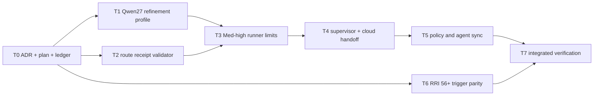

# Plan: Med-high Local Architect Refinement and Single-attempt Gate

## Objective

Replace direct local-first implementation for RRI 41-55 with a fail-closed,
evidence-bearing route:

```text
approved Med-high card
  -> Qwen27 advisory refinement
  -> primary route receipt
  -> GO_LOCAL: Qwen35 once (8 turns / 300 s / 0 repairs)
  -> otherwise: Codex or Claude with the accumulated handoff bundle
```

Low and Moderate routing, human approval, Reflection, independent review, and
owner verification remain unchanged.

## Governing decision and approval

- ADR-038 records the routing decision and risk analysis.
- Aggregate RRI: **93 Very high** (`C3 F3 D3 T4 A4 K4 P4 X4`, architecture
  decision and no-tests/high-impact penalties in the aggregate assessment).
- The aggregate must not be implemented directly. The ledger decomposes it into
  tasks with final RRI <= 55.
- Owner approval was given on 2026-07-26 with `si, de acuerdo` after the full
  route and limits were presented. That approval covers the bounded subtasks as
  long as objective, exclusions, model bindings, and limits do not change.

## Scope

### In scope

- ADR-037-compatible Qwen27 routing-refinement output.
- Hash-bound primary route receipt and fail-closed validation.
- Band-aware Qwen35 limits for Med-high: one session, 8 turns, 300 seconds,
  zero repairs, exact model binding.
- Automatic cloud-handoff evidence on every non-success route.
- Canonical workflow/policy/agent-summary synchronization.
- Regression correction for the RRI 56+ decomposition trigger.

### Out of scope

- Product/runtime architecture or roadmap sequence.
- Changes to Low or Moderate implementation budgets.
- Relaxing HITL, review, Reflection, coverage, or closure gates.
- Allowing Qwen27 to edit code or allowing the primary to override
  `CLOUD_REQUIRED` to local.
- Rewriting historical completed-task evidence.

## Delivery sequence



T1 and T2 may run in parallel after T0. T3 must consume both contracts. T4
owns the hard process cutoff and evidence handoff. T5 activates the route only
after enforcement tests pass. T6 is independent but closes a discovered
criteria mismatch. T7 performs review, documentation QA, and status closure.

## Current state (2026-07-26)

- T0 is complete.
- T1 is complete: `med-high-refinement-v1` profile in `run_analysis.py`, 17
  tests passing, phase-1 (shared T1-T4 d14 review) and phase-2
  (qwen3.6:27b-q4_K_M, disposition `reviewed_no_change`) both recorded.
- T2 is complete: `scripts/local-agent/med_high_gate.py` hash-bound route
  gate, 28 tests passing, phase-1 (shared) and phase-2 (qwen3.6:27b-q4_K_M,
  disposition `fixed`) both recorded.
- T3 is complete: band-aware `EffectiveLimits`/`resolve_effective_limits` in
  `run_local_task.py`, 76 tests passing, phase-1 (shared) and phase-2
  (qwen3.6:27b-q4_K_M, disposition `partial_fix`) both recorded.
- T4 is complete: `scripts/local-agent/run_med_high_task.py` process-group
  supervisor (300s wall clock, killpg on timeout) plus the extended
  `escalation_packet` bundle (11 sections: the 7 ADR-036 sections plus
  refinement artifact, primary receipt, effective limits, stop-reason/hashes),
  15 new tests passing, phase-1 (shared) and phase-2 (qwen3.6:27b-q4_K_M,
  disposition `partial_fix`) both recorded.
- T5 is complete: `docs/policies/RRI_POLICY.md`,
  `docs/policies/HITL_AUTONOMY_POLICY.md`, and
  `docs/playbooks/AGENT_WORKFLOW_GUIDE.md` (with a new Mermaid diagram) now
  describe the actual ADR-038 route in place of the retired direct-local-first
  / 1-repair-attempt Med-high language; the operational handoff script was
  updated to match. `make qa-docs` passes. Phase-1/phase-2 exempt
  (policy/docs-only).
- T6 is complete: `detect_triggers()` in `scripts/rri.py` now fires for
  final RRI >= 56 (was > 70), 64 tests passing. Phase-1 was skipped
  (documented process deviation); phase-2 (qwen3.6:27b-q4_K_M) has now run,
  disposition `reviewed_no_change` — all 4 findings concerned pre-existing
  code outside T6's one-line diff, and both HIGH findings were verified false
  positives.
- T7 is complete: 359 focused tests across every touched/adjacent module (0
  failures, 0 regressions), `make qa-docs` PASS, phase-2 review run and
  disposition-recorded for every development task (T1, T2, T3, T4, T6), 3
  Reflection passes recorded for each of T1-T4 (Med-high), and this table
  synchronized in the same pass. Live-vs-deterministic evidence is reported
  separately in the T7 ledger entry: phase-1/phase-2 reviews are live
  `qwen3.6:27b-q4_K_M` Ollama sessions; the T1-T4 unit suites certify the
  fail-closed logic via fakes/stubs, not a live end-to-end Qwen35 session —
  no live GO_LOCAL session has been run against a real Ollama daemon yet.
- All seven tasks (T0-T7) are now Done. This slice is closed.
- The authoritative handoff entrypoint is
  `scripts/handoff-med-high-local-refinement-to-claude.sh`.

## Acceptance strategy

- Existing ADR-037 analysis remains backward compatible.
- `GO_LOCAL` and `CLOUD_REQUIRED` artifacts validate deterministically.
- Artifact/card hash, model tag/digest, RRI/band, and receipt mismatches fail
  closed before Qwen35 starts.
- The ninth turn is never invoked; the first failed acceptance run ends the
  Med-high session; the 300-second supervisor kills the full process group.
- Any unsuccessful route preserves checkpoint, partial diff, commands/tests,
  stop reason, and hashes for cloud continuation.
- Moderate runner behavior remains unchanged.
- `scripts/rri.py` reports decomposition for every final RRI >= 56.

## Evidence and status synchronization

- RRI outputs and phase review artifacts are recorded in the task ledger.
- Unit/integration command output and a route-fixture handoff bundle are named
  in the ledger before closure.
- Status-bearing documents: ADR-038/index, ADR-036/ADR-037 amendment notes,
  this plan and ledger, workflow guide, RRI policy, HITL policy, AGENTS.md,
  CLAUDE.md, the compact approval-card template, and applicable local-agent
  handoff/budget docs.
- `docs/architecture.md` and `docs/plan/roadmap.md` are evaluated but remain
  unchanged because this slice affects agent process, not product runtime or
  product sequencing.
