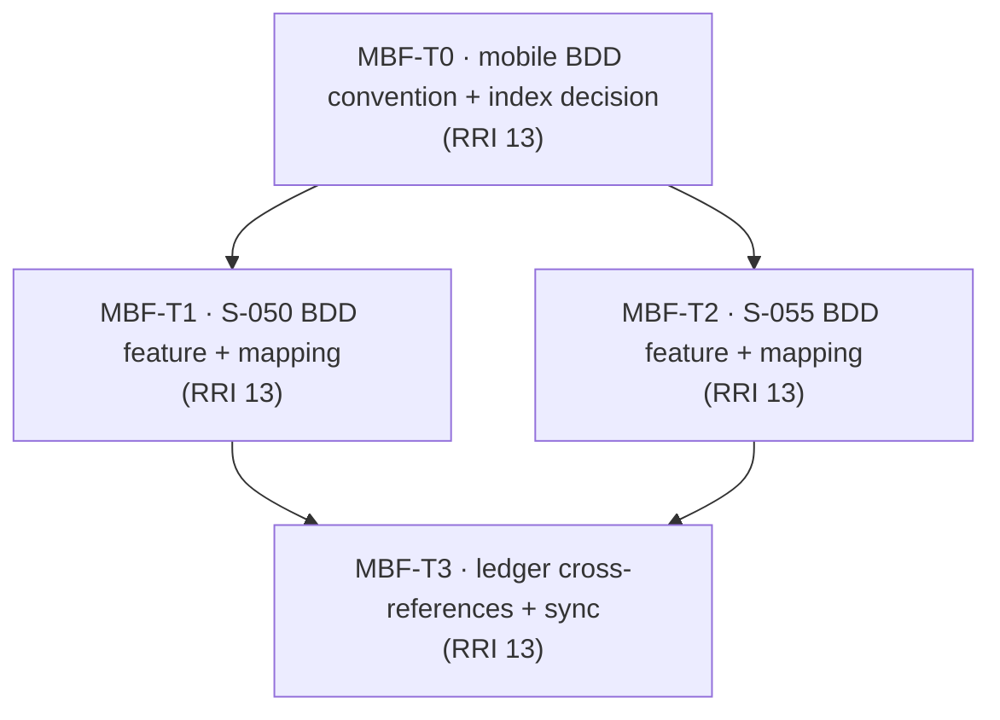

# Plan: Mobile BDD Backfill for S-050 and S-055

> **Status:** Planned. Authored 2026-06-12.
> **Slices covered:** `S-050` (first-party mobile client) and `S-055` (Maestro screenshot / visual-audit suite).
> **Tasks ledger:** `docs/tasks/mobile-bdd-backfill-s050-s055.md`.

## Purpose

`S-060` and `S-100` introduced an explicit BDD-first pattern in this repository,
with stable `SC-*` scenario IDs, `.feature` files, and mapping tables that connect
behavioral specs to E2E flows and unit evidence. `S-050` and `S-055` were delivered
before that pattern was applied consistently to all implemented mobile slices.

Both slices are implemented and verified, but neither has a dedicated `.feature`
source of truth describing the shipped behavior. This follow-up retrofits that
behavioral contract without reopening product scope or changing runtime behavior.

## Objective

Backfill BDD coverage for the already-delivered mobile foundation:

- `S-050`: author a behavioral `.feature` spec for the first-party mobile client
  and map each scenario to existing unit/integration evidence.
- `S-055`: author a behavioral `.feature` spec for the two-phase Maestro suite and
  map each scenario to existing Maestro flows, screenshots, and sanitizer checks.
- Normalize the mobile BDD home so future mobile-only slices can coexist without
  turning `mobile/bdd/README.md` into a single-slice document.

## Scope decisions

| Decision | Choice |
|---|---|
| BDD home for mobile-only slices | Keep mobile-only `.feature` specs under `mobile/bdd/` |
| Existing `mobile/bdd/README.md` | Expand from an `S-060`-only note into a mobile BDD index |
| Scope posture | Backfill documentation only; no product or Maestro behavior change |
| Scenario naming | Stable `SC-*` IDs, grouped per slice (`SC-AUTH-*`, `SC-SUITE-*`, etc.) |

## Affected components

| Layer | Path | Change |
|---|---|---|
| BDD | `mobile/bdd/README.md` | Convert from S-060-only guide into multi-slice mobile BDD index |
| BDD | `mobile/bdd/s-050-mobile-client.feature` (new) | Behavioral Gherkin spec for the shipped mobile client |
| BDD | `mobile/bdd/s-055-maestro-suite.feature` (new) | Behavioral Gherkin spec for the shipped two-phase screenshot suite |
| Docs | `docs/tasks/s-050-mobile-client.md` | Cross-reference the backfilled BDD source of truth |
| Docs | `docs/tasks/s-055-maestro-screenshot-suite.md` | Cross-reference the backfilled BDD source of truth |

## Design decisions

### D1 — Do not rewrite slice history

The backfill is modeled as a new follow-up plan, not by inserting fake historical
tasks into `S-050` or `S-055`. The original ledgers remain accurate records of what
was implemented when; this plan adds the missing behavioral-spec layer afterward.

### D2 — Mobile-only BDD lives with the mobile app

Cross-surface slices (`S-100`, `S-110`) use `docs/bdd/`. Mobile-only slices should
live under `mobile/bdd/`, next to their Maestro flows and mobile-facing mapping.
This keeps the ownership boundary clear and avoids mixing mobile-only flows into the
cross-surface BDD index.

### D3 — Backfill must map to real evidence, not aspirational flows

Each new scenario must point only to artifacts that already exist in the repo:
Jest/RNTL tests for `S-050`, and Maestro YAML/runner/sanitizer evidence for `S-055`.
The backfill must not promise web or mobile flows that do not exist.

### D4 — Retrospective slices and executable slices use different artifact shapes

`S-050` is retrospective and test-evidence-backed: its scenarios document shipped
mobile-client behavior without implying a standalone Maestro flow for every case.
`S-055` is retrospective too, but its guarantees are backed by shipped Maestro flows
and runner/sanitizer artifacts. `S-060` remains the mobile-first executable Maestro
precedent under `mobile/bdd/`, while `S-100` is cross-surface and therefore lives in
`docs/bdd/`.

## Module dependency direction

## Relationship to existing slices

- `S-050` remains the implementation source for the mobile client behavior.
- `S-055` remains the implementation source for the screenshot/visual-audit suite.
- `S-060` is the precedent for mobile-only BDD under `mobile/bdd/`.
- `S-100` is the precedent for slice-level mapping tables that connect scenarios to
  concrete flows and test evidence.

## Governing documents

- `docs/playbooks/AGENT_WORKFLOW_GUIDE.md`
- `docs/policies/HITL_AUTONOMY_POLICY.md`, `docs/policies/RRI_POLICY.md`
- `docs/tasks/s-050-mobile-client.md`
- `docs/tasks/s-055-maestro-screenshot-suite.md`
- `mobile/bdd/README.md`
