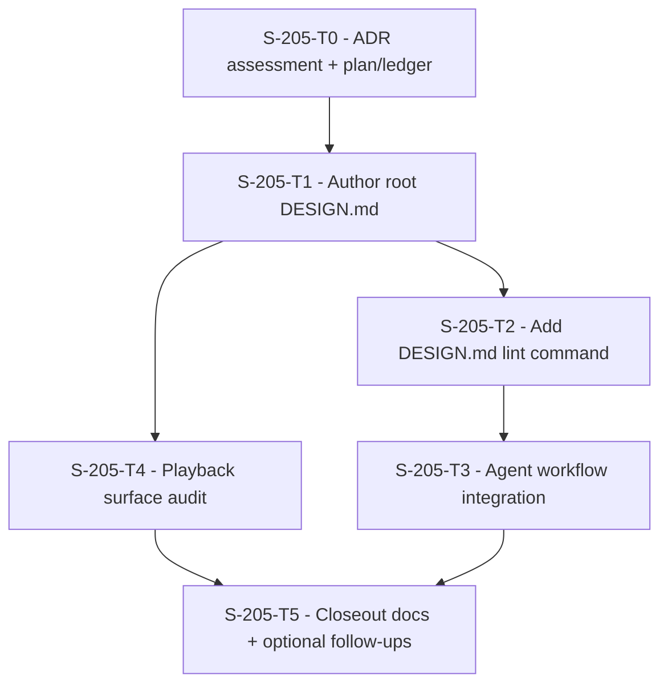

# Plan: S-205 - Mobile DESIGN.md Adoption

> **Status:** Done (2026-06-25). Root `DESIGN.md` authored, `qa-design` added,
> mobile UI workflow integration recorded, and playback audit completed.
> **Roadmap phase:** `S-205`, a cross-cutting mobile design-intent layer on top of
> S-115, S-190, and S-127. Non-blocking for the media pipeline; it makes the
> existing mobile visual system portable to agents without changing runtime UI
> ownership.
> **Tasks ledger:** `docs/tasks/mobile-design-md-adoption.md`.

## Purpose

Google Labs' `DESIGN.md` format is an alpha, plain-text design-system contract for
AI-assisted UI work. It combines machine-readable tokens in YAML frontmatter with
Markdown prose that explains the product's visual intent, component usage, and
negative constraints.

DubBridge mobile already has most of the substance that `DESIGN.md` is meant to
capture:

- S-115 introduced the runtime mobile design system: tokens, primitives, safe-area
  handling, state surfaces, and the restrained "ink + teal" palette.
- S-190 added the product-polish layer: scannable home navigation, formatted IDs
  and timestamps, consent safety, list affordances, and virtualized list behavior.
- S-127 added playback surfaces on top of that system: `VideoPlayer`,
  `PlaybackStateView`, review-detail playback, and asset-detail playback.

The gap is not another redesign. The gap is a portable, agent-readable explanation
of the existing visual system so future mobile UI work does not drift back into
ad-hoc palettes, engineering copy, one-off spacing, or inconsistent state
treatment.

## Objective

- Add a root `DESIGN.md` that documents the current mobile visual identity for
  agents and humans.
- Keep `mobile/src/theme/tokens.ts` as the runtime source of truth; `DESIGN.md`
  mirrors and explains those tokens, but does not replace them.
- Add a lightweight validation path for Google's `@google/design.md` linter without
  immediately making an alpha external format block every existing QA gate.
- Integrate `DESIGN.md` into the mobile UI task workflow only after the file and
  validation behavior are stable.
- Run one pilot audit against the latest playback surfaces (`ReviewDetailScreen`,
  `AssetDetailScreen`, playback states) before using the contract broadly.

## ADR assessment

### Decision

No new ADR and no ADR amendment are required for the initial S-205 adoption.

### Rationale

`DESIGN.md` is being adopted as an agent-facing design-intent artifact, not as a
runtime architecture boundary:

- It does not change ADR-029's product-surface decision. Mobile remains the sole
  authenticated first-party UI, and UI visibility remains non-authoritative for
  authorization.
- It does not change ADR-032's playback-delivery boundary. Playback grants,
  manifests, segment access, readiness gates, and publication gates remain backend
  concerns; S-205 only documents how mobile playback surfaces should look and feel.
- It does not change ADR-033's OKF adoption. `DESIGN.md` is a design-system
  artifact with its own external alpha spec; it can carry YAML frontmatter, but it
  is not part of the governed OKF knowledge-document vocabulary unless a later task
  deliberately adds it.
- It does not create a new dependency in runtime code. The mobile app continues to
  import React Native styles from `mobile/src/theme/tokens.ts`.

### When an ADR would become necessary

Create a new ADR or amend the related ADRs if a later task does any of the
following:

- makes `DESIGN.md` the authoritative runtime source that generates or replaces
  `mobile/src/theme/tokens.ts`;
- expands the contract beyond mobile into a first-party web/product-surface design
  system, thereby reopening ADR-029's surface boundary;
- introduces automatic agent/code-generation paths that can modify UI without the
  normal plan/task/RRI workflow;
- makes Google's alpha `DESIGN.md` linter a hard global release gate with external
  availability risk;
- changes playback product boundaries, public-player scope, or media-delivery UX in
  a way that affects ADR-032.

## Design decisions

### D1 - `DESIGN.md` captures intent; `tokens.ts` powers runtime

The first version of `DESIGN.md` mirrors the existing token values and explains
their intended use. It does not generate TypeScript, change component styling, or
become the source imported by React Native.

### D2 - Adopt the smallest useful Google spec surface

Use the standard `DESIGN.md` structure: YAML frontmatter for colors, typography,
spacing, rounded values, and component tokens; Markdown sections for Overview,
Colors, Typography, Layout, Elevation & Depth, Shapes, Components, and Do's and
Don'ts. Add custom prose only where it helps mobile agents make better choices.

### D3 - Validate, but avoid brittle alpha coupling

Add an explicit `qa-design` or `design:lint` command first. Do not immediately wire
it into `qa-ci` unless the package behavior is stable in the local and CI
environments. If a later task wants hard CI enforcement, that task must revisit the
ADR assessment.

### D4 - Workflow integration is separate from file creation

Creating `DESIGN.md` is Low-band documentation work. Changing the agent workflow so
mobile UI tasks must read it is a separate Moderate task because it modifies the
rules agents follow.

### D5 - Pilot on playback surfaces before broad use

The current open mobile work centers on playback. Audit `ReviewDetailScreen`,
`AssetDetailScreen`, `PlaybackStateView`, and `VideoPlayer` against `DESIGN.md`
before claiming the contract is sufficient for future UI work.

### D6 - No new visual system

S-205 may clarify wording, validation, and usage rules. It must not introduce a new
palette, typography family, icon system, UI kit, navigation pattern, or unrelated
visual redesign.

## Affected files / boundaries

- **New:** `DESIGN.md`.
- **New, later audit:** `docs/audit/mobile-design-md-playback-audit.md`.
- **Modified:** `Makefile` and/or `mobile/package.json` for a design lint command.
- **Modified:** `AGENTS.md` and possibly `docs/playbooks/AGENT_WORKFLOW_GUIDE.md`
  only in the workflow-integration task.
- **Referenced:** `mobile/src/theme/tokens.ts`,
  `mobile/src/components/{Button,Card,Panel,Badge,StateView,PlaybackStateView,VideoPlayer}.tsx`,
  `mobile/src/screens/{ReviewDetailScreen,AssetDetailScreen}.tsx`.
- **Out of scope:** backend/API contracts, auth, storage/playback grants, schema,
  new mobile features, public web/player work, and replacing S-115/S-190 decisions.

## Dependency flow

## Verification

- `npx @google/design.md lint DESIGN.md` or the repository wrapper command added
  by S-205-T2.
- `make qa-docs`.
- For any later code patch from the playback audit:
  - `cd mobile && npm run typecheck`
  - relevant Jest suites, at minimum `ReviewDetailScreen.test.tsx`,
    `asset.screens.test.tsx`, and component tests when primitives are touched.
- Maestro playback flow syntax remains valid if screenshots or player surfaces are
  refreshed.

## Outcome

Completed on `2026-06-25`.

- Added root `DESIGN.md` as the mobile design-intent contract for agents.
- Added `make qa-design` as an explicit, opt-in validation target for the Google
  alpha linter.
- Integrated `DESIGN.md` into the mobile UI analysis workflow without changing the
  existing plan/task/RRI authority chain.
- Audited the current playback surfaces and recorded two narrow follow-ups instead
  of treating them as part of the slice closeout:
  - dark-overlay playback state contrast;
  - summary-row identifier polish on playback-adjacent screens.

S-205 is complete as a documentation/workflow slice. Any playback polish should
open as a separate development task.

## Related documents

- `docs/tasks/mobile-design-md-adoption.md`
- `docs/plan/s-115-mobile-ux-foundation.md`
- `docs/plan/s-190-mobile-ux-usability-pass.md`
- `docs/plan/s-127-mobile-review-player.md`
- `docs/adr/ADR-029-mobile-as-sole-authenticated-product-surface.md`
- `docs/adr/ADR-032-hls-playback-delivery-boundary.md`
- `docs/adr/ADR-033-open-knowledge-format-adoption.md`
- Google Labs `DESIGN.md` spec: `https://github.com/google-labs-code/design.md`
