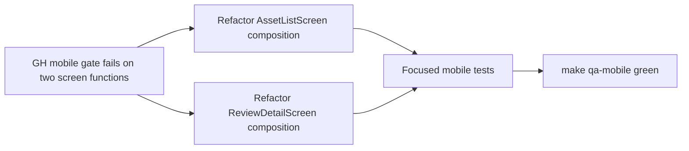

# Plan: Mobile Gate Max-Lines Refactor

> **Status:** Active — authored 2026-07-01 after repeated GitHub Actions failures in the `mobile` job.
> **Tasks ledger:** `docs/tasks/bug-mobile-gate-max-lines.md`.

## Purpose

The GitHub Actions `ci.yml` workflow failed twice on 2026-07-01 in the same
place: `mobile` → `Run mobile gate (strict types + lint + tests)`.

- Run `28514576103` (`ed262c1`) failed at:
  - `mobile/src/screens/AssetListScreen.tsx` — `AssetListScreen` has 80 lines
  - `mobile/src/screens/ReviewDetailScreen.tsx` — `ReviewDetailScreen` has 64 lines
- Run `28500512994` (`b226931`) failed at the same two lint errors.
- Local reproduction matches GitHub exactly: `make qa-mobile` fails with the same
  `max-lines-per-function` violations.

This is a real mobile gate regression, not push-specific noise. The fix should
restore CI by decomposing the two screens while preserving current behavior,
test IDs, and the shipped mobile design intent.

## Objective

- Bring both screen functions back under the `max-lines-per-function` limit of `60`.
- Preserve UX behavior, navigation callbacks, test IDs, and existing acceptance
  coverage.
- Keep the lint rule intact; fix the composition, not the gate.
- Re-green `make qa-mobile` locally before the next push.

## Governing constraints

- `mobile/eslint.config.js` enforces `max-lines-per-function: ['error', 60]`.
- `DESIGN.md` remains the design-intent contract for mobile surfaces.
- This is a behavior-preserving refactor: no API contract, auth flow, or state
  machine changes are in scope.

## Design decisions

### D1 — Fix structure, not policy

Do not weaken or bypass the lint rule. The repair must come from extracting
screen-local sections, selectors, or small helpers so each screen keeps one clear
responsibility.

### D2 — Preserve user-observable behavior

Search/filter behavior, empty/error/loading states, playback, review decisions,
and publication states must keep their current behavior and test IDs.

### D3 — Keep the patch narrow

The issue is isolated to two mobile screens plus their focused tests and the
daily/bug artifacts that track the work. No unrelated mobile polish should be
bundled into this fix.

## Affected files

- `mobile/src/screens/AssetListScreen.tsx`
- `mobile/src/screens/ReviewDetailScreen.tsx`
- `mobile/__tests__/asset.screens.test.tsx`
- `mobile/__tests__/ReviewDetailScreen.test.tsx`
- `docs/daily/2026-07-01.md`
- `docs/tasks/bug-mobile-gate-max-lines.md`

## Dependency flow

## Verification

- `cd mobile && npx eslint src/screens/AssetListScreen.tsx src/screens/ReviewDetailScreen.tsx`
- `cd mobile && npm test -- --runInBand __tests__/asset.screens.test.tsx __tests__/ReviewDetailScreen.test.tsx`
- `make qa-mobile`
- `make qa-docs`

## Outcome target

When complete, the mobile gate should pass locally with no lint violations from
these two screens, and the daily blocker should point to a closed bug record
instead of an open operational issue.
