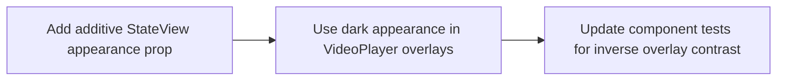

# Plan: Mobile Playback Overlay Contrast

> **Status:** Done (2026-06-25). Dark playback overlay contrast fixed with an
> additive `StateView` appearance prop; focused component tests and typecheck green.
> **Tasks ledger:** `docs/tasks/mobile-playback-overlay-contrast.md`.

## Purpose

The S-205 playback audit found one concrete design-system drift in the shipped
mobile playback surface: `VideoPlayer` renders `StateView` inside a dark media
overlay, but `StateView` uses light-surface text colors unconditionally. The
result is functionally correct but visually muted against the player shell.

This plan fixes only that contrast mismatch. It does not widen scope to summary-row
identifier formatting, playback behavior changes, or a broader redesign of the
review/asset screens.

## Objective

- Add a small, additive appearance control to `StateView`.
- Use that control in `VideoPlayer` so playback loading/error/end overlays render
  with light-on-dark typography.
- Preserve all existing `testID`s, playback behavior, and button wiring.

## Design decisions

### D1 - Additive appearance prop only

`StateView` gains a small appearance selector for foreground treatment. Default
behavior stays unchanged for the rest of the mobile app.

### D2 - Scope the new appearance to dark media overlays

Only `VideoPlayer` uses the dark appearance in this task. No other screen or panel
should change unless a separate task explicitly widens scope.

### D3 - Preserve behavior and testIDs

This is a presentation-only patch. Loading/error/retry behavior, overlay state
transitions, and existing test IDs remain intact.

## Affected files

- `mobile/src/components/StateView.tsx`
- `mobile/src/components/VideoPlayer.tsx`
- `mobile/__tests__/components.test.tsx`

## Dependency flow

## Verification

- `cd mobile && npm test -- --runInBand __tests__/components.test.tsx`
- `cd mobile && npm run typecheck`
- `make qa-docs`

## Outcome

Completed on `2026-06-25`.

- Added an additive `appearance` prop to `StateView`.
- Wired `VideoPlayer` overlays to the inverse appearance for dark-shell playback
  states.
- Kept default `StateView` usage unchanged elsewhere in the app.
