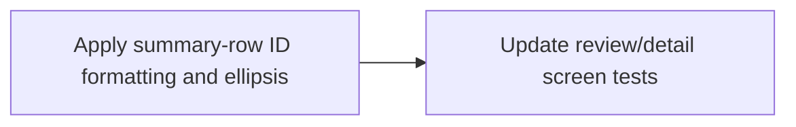

# Plan: Mobile Playback Summary ID Polish

> **Status:** Done (2026-06-25). Playback-adjacent summary IDs now use
> single-line tail ellipsis while preserving full identifier values in the
> rendered tree; focused screen tests and typecheck green.
> **Tasks ledger:** `docs/tasks/mobile-playback-summary-id-polish.md`.

## Purpose

The S-205 playback audit found that the playback-adjacent summary panels in
`ReviewDetailScreen` and `AssetDetailScreen` still expose raw IDs without the same
mobile-friendly treatment used in the later S-190 surfaces. The issue is not data
correctness; it is presentation resilience when identifiers grow long.

This plan keeps the fix narrow: preserve full identifier values, but render them in
summary rows with single-line tail ellipsis so long values do not crowd badges,
labels, or other controls.

## Objective

- Apply identifier formatting to playback-adjacent summary rows.
- Add native single-line tail ellipsis to long summary values.
- Preserve current behavior, semantics, and test IDs.

## Design decisions

### D1 - Keep full IDs as the source string

Do not invent a new truncation rule for these rows. Use the full identifier value
and rely on native tail ellipsis in tight layouts.

### D2 - Scope the patch to playback-adjacent detail summaries

Only `ReviewDetailScreen` and `AssetDetailScreen` are in scope for this task.

### D3 - Preserve behavior

This is presentation-only. No API calls, playback flows, or button states change.

## Affected files

- `mobile/src/screens/ReviewDetailScreen.tsx`
- `mobile/src/screens/AssetDetailScreen.tsx`
- `mobile/__tests__/ReviewDetailScreen.test.tsx`
- `mobile/__tests__/asset.screens.test.tsx`

## Dependency flow

## Verification

- `cd mobile && npm test -- --runInBand __tests__/ReviewDetailScreen.test.tsx __tests__/asset.screens.test.tsx`
- `cd mobile && npm run typecheck`
- `make qa-docs`

## Outcome

Completed on `2026-06-25`.

- `ReviewDetailScreen` summary rows now render task and asset identifiers with
  single-line tail ellipsis.
- `AssetDetailScreen` metadata rows now render asset and uploader identifiers with
  single-line tail ellipsis.
- The patch keeps full identifier strings intact and does not change playback
  behavior.
