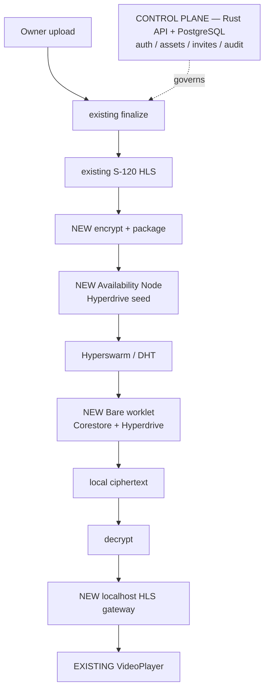

# MVP0-P2P design inputs for P2–P7

## Purpose

`P2`–`P7` have no plan file and no detailed task-ledger entry
(`docs/plan/roadmap.md` § Known planning gaps). Until they do, every
load-bearing input needed to *analyze, score, and present* those phases lived
only in the untracked external package `p2p-mvp/`, which
`docs/plan/mvp0-p2p-first.md:11` classifies as non-authoritative input.

This document transcribes that material into the repository so a future
session can prepare a P2–P7 task card without opening the external package.
It is a **design-input record, not a plan and not a decision**: it does not
approve scope, does not satisfy the ADR required before P2, and does not
replace the per-phase plan/RRI/approval sequence in
`docs/plan/mvp0-p2p-first.md` § Execution sequence.

## Authority and binding status

The external package mixes three different authority levels in adjacent
files. Preserving that distinction is the point of this document — treating
non-binding hypothesis as decided architecture is exactly the failure mode
ADR-043 § Risk analysis calls "premature security claims".

| Source file | Binding status as stated by the source | How to use it here |
|---|---|---|
| `USE_CASES.md` | Product intent | Requirement input for HP/EC derivation |
| `MVP_SCOPE.md` | Scope statement | Scope boundary input; still needs per-phase approval |
| `GLOBAL_INVARIANTS.md` | "locked unless a concrete implementation blocker requires architecture escalation" | Constraint input; see per-invariant adoption below |
| `ACCEPTANCE_GATES.md` | Gate definitions | Acceptance-criteria input per phase |
| `INVITE_CONTRACT.md` | "Suggested minimal surface" | **Non-binding** API hypothesis |
| `ARCHITECTURE_P2P_GUIDANCE.md` | "NON-BINDING ARCHITECTURE GUIDANCE … does not override accepted ADRs or verified repository constraints" | **Non-binding** implementation hypothesis |
| `P2P_RPC_GUIDANCE.md` | "Non-Binding" | **Non-binding** RPC hypothesis |
| `P2P_PREREQUISITES.md` | Prerequisite checklist | Input; P0/P1 already superseded parts of it with measured evidence |
| `REUSE_EXISTING_DUBBRIDGE.md` | Auditor guidance | Input; consistent with `docs/plan/mvp0-p2p-first.md` guardrail 7 |

Nothing in this document overrides an accepted ADR, `docs/architecture.md`,
or a repository policy. Where the source contradicts repository state, the
repository wins and the contradiction is recorded in § Defects and
contradictions in the source material.

## Product use cases

| ID | Use case | Summary | Delivering phase(s) |
|---|---|---|---|
| CU-01 | Upload Content | Authenticated owner uploads through the existing upload/finalize/rights pipeline; existing S-120 prepares HLS; the HLS output is encrypted/packaged, published to Hyperdrive, seeded by the Availability Node, then reaches Ready. | `P2` |
| CU-02 | Invite Viewer | Owner creates an invite for Ready content. The raw token/link is returned once; only the token hash is persisted. The invite grants authorization metadata, not media transport. | `P3` |
| CU-03 | View Library | Minimal dashboard exposing owner content states and viewer invite states. | `P6` |
| CU-04 | Play Invited Content | Viewer claims the invite, receives the minimal authorized P2P access descriptor, Bare syncs the encrypted package through Hyperdrive/Hyperswarm, verifies it, and a local gateway serves decrypted HLS to the existing `VideoPlayer`. | `P3` + `P4` + `P5` |

`P0` and `P1` deliver no product use case; they are feasibility and runtime
foundation (ADR-043).

CU-03 dashboard states, verbatim from the source:

```text
MY CONTENT
Processing | Ready | Failed

INVITES
Pending | Syncing | Available | Expired
```

## MVP-0 scope

**In scope:** existing authenticated upload; existing rights/finalize path;
existing S-120 HLS preparation; encrypted P2P package; Availability Node
seed; Hyperdrive + Hyperswarm; minimal invite create/claim; minimal
device/public-key capability if needed for key wrapping; Bare Worklet in
mobile; full-package preload before Play; local ciphertext cache; local HLS
gateway; existing `VideoPlayer`; minimal My Content + Invites dashboard.

**Out of scope:** Private Screening abstraction; ScreeningLicense;
`play_from`/`play_until`; trusted-time; offline certification; multi-device;
advanced revocation; bulk invites; email delivery; analytics; DRM;
segment-priority streaming; owner phone as required seed; HTTP/S3 media
fallback used to pass P2P certification.

**MVP simplification** — progressive segment-on-demand playback is deferred:

```text
claim → full encrypted sync → verify → READY → play
```

## Global invariants and their repository status

The source lists twelve locked invariants. Their adoption status against
current repository canon differs and must not be flattened.

| # | Invariant | Repository status |
|---|---|---|
| 1 | "Architecture is approved; do not reopen broad design discovery." | **Not adopted.** This is a taskpack execution instruction and conflicts with repository governance, which requires per-task RRI, presentation, and HITL approval (`docs/policies/HITL_AUTONOMY_POLICY.md`). It is superseded by `docs/plan/mvp0-p2p-first.md` § Execution sequence. |
| 2 | Rust owns authorization, business state, persistence, orchestration, governance | Already canonical — `docs/architecture.md` § Core principles |
| 3 | PostgreSQL is the source of truth for structured metadata | Already canonical — `docs/architecture.md`, ADR-006 |
| 4 | `StorageAdapter` remains the binary artifact boundary | Already canonical — ADR-006 |
| 5 | "Private Screening consumes S-120 prepared HLS internally" | **Contradicts** `MVP_SCOPE.md`, which lists "Private Screening abstraction" as out of scope. Operative reading for MVP-0: the encrypted P2P package consumes S-120 prepared HLS internally. See § Defects. |
| 6 | S-125 online playback / `PlaybackGrant` semantics remain unchanged | Already canonical — ADR-032; restated as `docs/plan/mvp0-p2p-first.md` guardrail 9 |
| 7 | Availability Node handles ciphertext availability only; no PostgreSQL, SCK, KEK, JWT or signing-key authority | Already canonical — `docs/plan/mvp0-p2p-first.md` guardrail 11 |
| 8 | MVP = one invitation, one viewer, one active device path | **New constraint, not yet in any canonical doc.** Materially bounds P3/P4 scope. |
| 9 | Raw invitation tokens and plaintext Screening Content Keys must never be persisted or logged | Already canonical — `docs/plan/mvp0-p2p-first.md` guardrail 10 |
| 10 | Existing mobile `VideoPlayer` / `expo-video` is reused | Already canonical — `docs/plan/mvp0-p2p-first.md` guardrail 7 |
| 11 | No Studio Web, payments, analytics, community, advanced revocation, multi-device or alternate P2P stack in MVP | **New constraint, not yet in any canonical doc.** Partially overlaps `MVP_SCOPE.md` § Out of scope. |
| 12 | Stop on concrete blockers; do not silently widen scope or substitute architecture | Already canonical — repository workflow stop conditions |

**Glossary.** The source uses `SCK` and `KEK` without full expansion. `SCK`
is expanded exactly once as "Screening Content Key" (invariant 9). `KEK` is
never expanded in the package; the conventional reading is "key-encryption
key" — the server-side key that wraps the content key. Both terms must be
defined normatively by the ADR required before P2, not inherited by
convention.

## Acceptance gates

| Gate | Definition | Phase | Status |
|---|---|---|---|
| G0 | Existing mobile app runs Bare Worklet and bounded RPC reliably | `P0` | PASS (Android-only) 2026-08-27 |
| G1 | Seed publishes Hyperdrive; client discovers, replicates and verifies a file | `P1` | In progress |
| G2 | Existing upload/finalize and S-120 are reused; encrypted package is published through the Availability Node; Ready only after publication | `P2` | Not started |
| G3 | Invite creation/claim works, token hash only persisted, unauthorized/expired claims rejected, viewer receives minimal P2P descriptor | `P3` | Not started |
| G4 | Bare syncs encrypted package and emits READY only after verification | `P4` | Not started |
| G5 | Local gateway serves the P2P-replicated package to the existing `VideoPlayer` | `P5` | Not started |
| G6 | My Content and Invites expose only required states/actions | `P6` | Not started |
| G7 | End-to-end certification with legacy HTTP media delivery disabled during the critical playback proof | `P7` | Not started |

G7 flow and verdict tokens, verbatim:

```text
OWNER:  Login → Upload → S-120 → P2P Publish → Ready → Invite
VIEWER: Login → Claim → Invites → Sync → Verify → READY → Play
```

`MVP0_P2P_CERTIFIED | MVP0_P2P_NOT_CERTIFIED`

## Control plane / data plane split

> Source: `ARCHITECTURE_P2P_GUIDANCE.md` — **non-binding hypothesis**.

DubBridge remains the **control plane**: auth, authorization, assets,
ownership, invites, structured state, audit, job orchestration. P2P becomes
the **media data plane**: encrypted package publication, discovery,
replication, local ciphertext availability.

The Hyperdrive key is *not* the authorization boundary. Backend
authorization remains authoritative, so media confidentiality requires files
to be encrypted before publication.



## Package model

> Source: `ARCHITECTURE_P2P_GUIDANCE.md` — **non-binding hypothesis**. Field
> names, types, and persistence layout are undecided.

```text
Asset
├── existing HLS derivative
├── p2p package id
├── manifest hash
├── hyperdrive key
├── publication state
└── server-wrapped content key
```

All published media files are ciphertext.

## Responsibility split

> Source: `ARCHITECTURE_P2P_GUIDANCE.md` — **non-binding**, except the
> "must not receive" list, which restates canonical guardrails 10 and 11 of
> `docs/plan/mvp0-p2p-first.md`.

| Runtime | Owns |
|---|---|
| React Native | auth; invite claim; dashboard; secure device identity; content-key unwrap; user-facing sync state |
| Bare worklet | Corestore; Hyperdrive; Hyperswarm; package sync/resume; local ciphertext; package verification; local gateway lifecycle |
| Availability Node | create/open Hyperdrive; write encrypted files; join Hyperswarm; seed; return publication identifiers |

**Bare must never receive:** the user password, the device private key, the
server KEK, the JWT signing key, or PostgreSQL credentials.

**The Availability Node must never own:** DB credentials; user/invite data;
the plaintext content key; business authorization; backend signing keys.

## Invite contract

> Source: `INVITE_CONTRACT.md` — described by the source as a "suggested
> minimal surface". **Non-binding.** Route shapes, payloads, and status codes
> are undecided and belong to the P3 task card.

Suggested surface (no public revoke endpoint is required for MVP-0):

```text
POST /assets/{asset_id}/invitations
POST /asset-invitations/claim
GET  /me/invitations
```

**Create invite** requires an authenticated owner, an asset that
belongs to / permits the owner action, and asset status `Ready`. The response
returns the raw invite token/link exactly once. Persisted fields: token hash;
asset reference; owner subject; expiration; claim metadata. The raw token is
never persisted (global invariant 9).

**Claim invite** takes the raw token and: hashes it; finds a matching
non-expired invite; binds the authenticated viewer if unclaimed; returns the
current access state if already claimed by the same viewer; returns conflict
if claimed by another viewer; rejects if expired or not found.

**Invites inbox** (`GET /me/invitations`) returns only invitations accessible
by the authenticated viewer. Minimum fields: `invitation_id`; `asset_id`;
title/display metadata; owner display metadata if already safely supported;
`state` ∈ `Pending | Available | Expired`; `can_play`. The viewer must not
need the raw token after a successful claim.

**Playback authorization does not replace S-125.** The source states the
playback path as:

```text
viewer identity
→ verify claimed non-expired invite
→ S-125 playback boundary
→ HLS
→ VideoPlayer
```

This composition is precisely the open question the pre-P2 ADR must resolve
— see § Open decisions blocking P2.

## Bare RPC surface and sync states

> Source: `P2P_RPC_GUIDANCE.md` — explicitly **non-binding**. The versioned
> DubBridge protocol accepted by ADR-043 is the authoritative protocol seam;
> this list is a requirement hint for which operations P4/P5 will need.

```text
initialize()
startSync(packageId, hyperdriveKey, expectedManifestHash)
getSyncState()
verifyPackage(packageId)
startPlaybackGateway(packageId, transientContentKey, playbackMetadata)
stopPlaybackGateway()
purgePackage(packageId)
shutdown()
```

Suggested sync states: `NOT_PRESENT`, `DISCOVERING`, `SYNCING`, `VERIFYING`,
`READY`, `FAILED`.

Constraints restated by the source: do not persist plaintext content keys in
Bare; do not send device private keys to Bare.

## Recommended stack and prerequisites

> Source: `ARCHITECTURE_P2P_GUIDANCE.md` and `P2P_PREREQUISITES.md`. Package
> selection for mobile is **no longer hypothetical** — P0/P1 selected and
> measured concrete versions; see `docs/audit/mvp0-p2p-p0-native-preflight.md`
> and `docs/tasks/mvp0-p2p-p1-replication.md`.

Mobile/Bare: `react-native-bare-kit`, `bare-rpc`, `corestore`, `hyperdrive`,
`hyperswarm`, `b4a`, required Bare FS/network modules, and a suitable Bare
HTTP module for the local gateway. HyperDHT is reached indirectly through
Hyperswarm unless lower-level access is justified.

Availability Node: Bare, `corestore`, `hyperdrive`, `hyperswarm`, `b4a`, and
a minimal internal publication-control API.

Backend: prefer the existing Rust stack; add crypto/package dependencies only
after cross-runtime fixture validation.

The two mandatory spikes named by the source map to closed/in-progress work:
Spike A (`React Native → Bare worklet → RPC ping/pong`) is P0/G0, PASS;
Spike B (`seed Hyperdrive → Hyperswarm → client Hyperdrive → verified
replicated file`) is P1/G1, in progress.

## Reuse boundary

> Source: `REUSE_EXISTING_DUBBRIDGE.md`. Consistent with
> `docs/plan/mvp0-p2p-first.md` guardrail 7.

**Reuse directly:** existing authentication/principal propagation; current
upload intake; `finalize_ingestion_core`; the fail-closed rights gate;
PostgreSQL/repository conventions; `StorageAdapter`; jobs/worker-runner
topology; S-120 HLS preparation; the existing React Native/Expo app; existing
navigation/theme/components; `expo-video` / the existing `VideoPlayer`.

**Reuse partially:** playback authorization/policy/audit, where it answers
"may this viewer play this asset?". The P2P media data plane replaces server
media delivery only for the certified path.

**New capabilities:** encrypted P2P package builder; P2P publication
metadata; Availability Node; Bare runtime in mobile; Hyperdrive/Hyperswarm
replication; package verification; local ciphertext cache; local HLS gateway;
minimal content-key envelope delivery; `AssetInvitation` if not already
present.

**Audit rule:** before creating a new abstraction, ask whether DubBridge
already owns that responsibility; if yes, extend or reuse it unless
repository evidence proves incompatibility.

## Open decisions blocking P2

None of the material above decides these. They are the reason
`docs/plan/mvp0-p2p-first.md` guardrail 9 requires an ADR before P2P invite
delivery can be implemented; the draft is
`docs/adr/ADR-044-p2p-audience-delivery-boundary.md` (Proposed — **not
accepted**, so P2 remains unpresentable).

1. How invite authorization composes with ADR-032's `PlaybackGrant` — whether
   P2P playback issues a grant, bypasses it, or introduces a parallel
   audience-scoped authorization record.
2. Content-key algorithm, envelope format, device-key generation/storage, and
   revocation semantics (`docs/plan/mvp0-p2p-first.md` § Deferred decisions).
3. Publication/outbox schema and recovery semantics, and how P2P publication
   state relates to `PreparationStatus::Ready` without delaying S-120
   readiness or its downstream transcription enqueue (guardrail 8).
4. Availability Node deployment, authentication, observability, and
   operational ownership.
5. The P2P certification profile that disables legacy HTTP media routes
   without disabling control-plane APIs.
6. Persistent product cache, device identity, sign-out wipe, and background
   execution requirements beyond P1's transient foreground proof.

## Defects and contradictions in the source material

Recorded so a future session does not re-derive them:

- **Invariant 1 conflicts with repository governance.** "Do not reopen broad
  design discovery" cannot waive the per-task RRI and HITL approval gates.
  Not adopted.
- **Invariant 5 references an out-of-scope abstraction.** It locks behavior
  for "Private Screening", which `MVP_SCOPE.md` lists as out of scope for
  MVP-0. Read as a statement about the encrypted P2P package.
- **`KEK` is never expanded** anywhere in the package, and `SCK` is expanded
  only once. Both need normative definitions in the pre-P2 ADR.
- **`INVITE_CONTRACT.md` § Playback keeps S-125 in the playback path**, while
  `ARCHITECTURE_P2P_GUIDANCE.md` and `MVP_SCOPE.md` require the P2P data
  plane to replace server media delivery for the certified path. These are
  reconcilable (S-125 as the authorization boundary, P2P as the transport)
  but the reconciliation is an undecided ADR question, not an established
  fact.
- **`P2P_PREREQUISITES.md` asks for iOS/Xcode compatibility validation.**
  iPhone/iOS is explicitly deferred by the repository owner
  (`docs/plan/mvp0-p2p-first.md`). Not adopted for MVP-0.

## Related

- `docs/plan/mvp0-p2p-first.md` — the MVP0-P2P plan and its guardrails
- `docs/tasks/mvp0-p2p-first.md` — the task ledger and P2–P7 acceptance summaries
- `docs/plan/roadmap.md` § Known planning gaps — the tracked P2–P7 planning gap
- `docs/adr/ADR-043-mobile-p2p-runtime-ownership-and-proof-isolation.md` — accepted mobile runtime boundary
- `docs/adr/ADR-044-p2p-audience-delivery-boundary.md` — Proposed; blocks P2
- `docs/adr/ADR-032-hls-playback-delivery-boundary.md` — authoritative for present review playback
- `p2p-mvp/` — the external, untracked, non-authoritative source of this record
