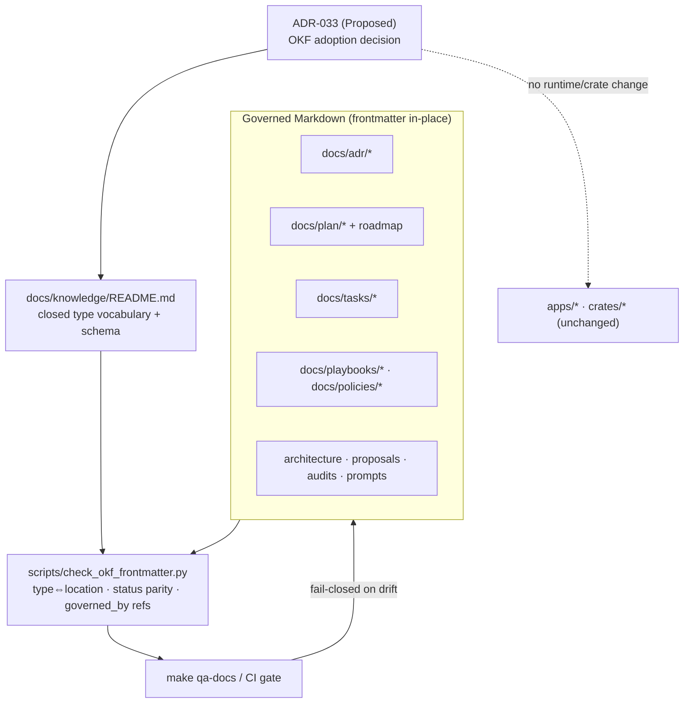

# Plan: OKF — Open Knowledge Format adoption for repository knowledge

**Governing ADR:** `docs/adr/ADR-033-open-knowledge-format-adoption.md` (Proposed).
**Type:** cross-cutting documentation + process initiative (not a product slice).

> **Status:** 📄 Planned — design package only. **No implementation has started.**
> The initiative-level RRI is **69 (Complex, 56–70)**; its gate is "plan first; human
> reviews the plan; decompose before implementation". This plan plus the decomposed,
> independently-gated ledger in `docs/tasks/okf-knowledge-format-adoption.md` satisfy
> that gate. Each implementation task is separately approval-gated (RRI > 25).

## Objective

Make the repository's agent knowledge **classifiable and machine-verifiable** by
adopting OKF YAML frontmatter in-place on governed Markdown documents, and by wiring
a validator into `make qa-docs` so the frontmatter contract is enforced like the
existing ADR-index and roadmap-drift contracts.

Concretely, after the migration an agent (or a script) can:

- filter `type: ADR` with `status: Accepted` without reading every ADR body;
- list `type: Plan` with `status: active` to find live workstreams among ~30 plans;
- read a `TaskList`'s `governed_by:` ADRs as data instead of parsing prose.

## Why this exists / where it sits

DubBridge is already an agent-first repo with strong referential-integrity gates
(`check-doc-consistency.sh`, `check-roadmap-drift.sh`) and an ADR change-propagation
contract, but no general document-metadata contract. The three pains motivating this
are recorded in ADR-033 §Context: no machine-readable classification, invisible plan
lifecycle, and a hand-maintained ADR index status column.

This initiative **unlocks**: type/status/scope filtering of knowledge, a lifecycle
signal for plans, and machine-checkable governing-ADR links on task ledgers. It
**closes**: the gap that the OKF adoption concept identified. It **does not** change
any runtime, crate, or API boundary (ADR-033 §Decision 6).

## Refinement vs. the source concept

The adoption concept was first drafted for a different repository that uses an
Obsidian vault. Two refinements make it stronger and simpler here:

1. **No Obsidian, no wikilink dialect.** The coexistence decision that dominates a
   vault-based adoption (in-place frontmatter vs. a separate vault, `[[wikilinks]]`
   vs. Markdown links) is moot. DubBridge uses plain Markdown links already, so
   frontmatter-in-place is the only sensible option and the source documents remain
   the single source of truth. No `docs/knowledge/` shadow copy of existing Markdown.
2. **Enforcement already exists.** The source concept noted "no schema registry, no
   official validator in v0.1". DubBridge does not need OKF to ship one: the existing
   gate machinery (`make qa-docs`) is extended with a frontmatter validator, turning
   OKF from descriptive metadata into an **enforced contract**. This is the decisive
   difference and the main reason the adoption is worth doing here.

## Scope

### Included

- A canonical vocabulary document: `docs/knowledge/README.md` (closed `type` set +
  field schema + examples).
- A validator `scripts/check_okf_frontmatter.py` wired into `qa-docs` and CI, plus
  its unit tests (`scripts/check_okf_frontmatter_test.py`).
- In-place frontmatter on: 18 ADRs, the playbooks, the policies, the slice plans, the
  task ledgers, `docs/architecture.md`, the roadmap (singleton), proposals, audits,
  and prompts.
- A frontmatter clause added to the **ADR change-propagation contract** in
  `docs/playbooks/AGENT_WORKFLOW_GUIDE.md` and a frontmatter line in the daily/template
  scaffolding where it helps.

### Excluded (deferred)

- **OKF-X1**: wrappers for non-Markdown artifacts (`docs/bdd/*.feature`, JSON
  schemas). Deferred until an agent actually needs them; documented as a follow-up.
- **OKF-X2**: deriving the `docs/adr/README.md` index *from* frontmatter (frontmatter
  as the sole source of truth). Rejected for v1 in ADR-033; revisit once the additive
  layer is trusted.
- Ephemeral logs (`docs/daily/*`), `TEMPLATE.md` files, and pure index READMEs.
- Any change to runtime code, crates, migrations, or product behavior.

## Governing ADRs

- **ADR-033** (Proposed) — the primary decision; this plan is its execution package.
- **ADR-018** — observability/traceability theme: knowledge classification makes the
  governance trail easier to follow, but this plan adds no audit rows.

(No other ADR constrains this initiative; OKF is a docs/process contract, not a
runtime decision.)

## The `type` vocabulary and field schema

`type` is the only required field (OKF v0.1). Recommended: `title`, `description`,
`tags`, `timestamp`. Permitted domain extensions are listed per type.

| `type` | Location | Key domain extensions |
|---|---|---|
| `ADR` | `docs/adr/ADR-*.md` | `status`, `supersedes`, `superseded_by` |
| `Playbook` | `docs/playbooks/*.md` | `governs` |
| `Policy` | `docs/policies/*.md` | `governs` |
| `Plan` | `docs/plan/*.md` (≠ roadmap) | `status`, `slice`, `governed_by` |
| `Roadmap` | `docs/plan/roadmap.md` | — (singleton) |
| `TaskList` | `docs/tasks/*.md` | `status`, `slice`, `plan`, `governed_by` |
| `Architecture` | `docs/architecture.md` | — |
| `Proposal` | `docs/proposals/*.md` | `status` |
| `Audit` | `docs/audit/*.md` | `timestamp` |
| `Prompt` | `docs/prompts/*.md` | — |

Example — an ADR (frontmatter mirrors the existing prose `- **Status:**` line):

```markdown
---
type: ADR
title: ADR-031 Mobile credential login with backend-issued JWT (FenixCRM parity)
description: apps/api issues its own HS256 JWT; the gateway becomes a transparent relay.
status: Accepted
supersedes: [ADR-023, ADR-024]
tags: [adr, auth, mobile, jwt, accepted]
timestamp: 2026-06-17
---
```

Example — a TaskList (governing ADRs become machine-readable and dangling-checked):

```markdown
---
type: TaskList
title: S-200 Mobile JWT credential auth — task ledger
plan: docs/plan/s-200-mobile-jwt-credential-auth.md
slice: S-200
status: active
governed_by: [ADR-031, ADR-018, ADR-026]
tags: [tasks, auth, mobile]
timestamp: 2026-06-18
---
```

## Design decisions

### Additive, never destructive (frontmatter mirrors prose)
The existing gates parse prose (`check-doc-consistency.sh` greps each ADR's
`- **Status:**` line). Frontmatter is added on top and **mirrors** that line; the
prose stays. No current gate breaks. The migration deletes nothing.

### `status:` is checked against prose, not trusted blindly
For ADRs the validator asserts frontmatter `status:` equals the prose status token.
This is the integration risk that a naive adoption misses: two status sources that
can silently diverge. The check makes them provably consistent.

### `type` is derived-checkable from location
Because the directory layout is clean, the validator enforces `type ⇔ location`. A
file under `docs/adr/` must be `type: ADR`; a misfiled or mistyped document fails the
gate. The vocabulary is closed, so a novel `type` string is a hard error, not silent
drift.

### `governed_by` reuses the dangling-reference guarantee
Any ADR token in `governed_by:`/`supersedes:` is validated to resolve to an existing
ADR file, the same guarantee `check-doc-consistency.sh` gives prose references. This
extends referential integrity into the metadata layer for free.

### One validator, mechanical migration, no body edits
The frontmatter blocks are mechanical to author (status and title already exist in
each file). The risk is in the *validator* and in the *process-contract change*, not
in the bulk frontmatter, which is why the decomposition isolates the validator (T1)
and the workflow-contract change (T6) from the bulk migration tasks (T2–T5).

## Module dependencies (documentation topology)

```text
docs/adr/ADR-033 (decision)
  └── docs/plan/okf-knowledge-format-adoption.md (this plan)
        └── docs/tasks/okf-knowledge-format-adoption.md (gated ledger)

enforcement:
  scripts/check_okf_frontmatter.py  ──► make qa-docs ──► CI
        ▲
        └── docs/knowledge/README.md (closed vocabulary = the contract it validates)

migrated knowledge (frontmatter in-place):
  docs/adr/*  docs/playbooks/*  docs/policies/*  docs/plan/*  docs/tasks/*
  docs/architecture.md  docs/proposals/*  docs/audit/*  docs/prompts/*
```

## Architecture diagram



## RRI summary (initiative level)

| RRI | 69 → band Complex (56–70) → gates: plan first; human reviews the plan; **decompose** before implementation |
|---|---|
| Complexity score | raw CC 9 → C=1 (validator branching); D=2 K=3 P=3 T=3 A=1 X=4 (agent-supplied; docs/process, no auth/security anchor) |
| Penalties | arch_decision +12 (process/policy contract); many_files +8 (F=4) |
| Claude Code | Premium — thinking On |
| Codex | Premium |

Computed with `scripts/rri.py` (see the task ledger for the full variable table).
Decomposition is triggered by F≥4 ∧ K≥3 and by the 56+ band; the ledger splits the
initiative so each implementation subtask scores ≤ 55.

## Proposed execution order (decomposition)

```text
OKF-T0  Accept ADR-033; create docs/knowledge/README.md vocabulary  (docs/governance, gated)
  -> T1 scripts/check_okf_frontmatter.py + tests + qa-docs/CI wiring  (development)
  -> T2 Frontmatter on 18 ADRs (status mirrors prose)                 (docs, mechanical)
  -> T3 Frontmatter on playbooks + policies                          (docs, mechanical)
  -> T4 Frontmatter on plans + task ledgers (status/slice/governed_by) (docs, mechanical)
  -> T5 Frontmatter on architecture + proposals + audits + prompts    (docs, mechanical)
  -> T6 Add frontmatter clause to the ADR change-propagation contract  (process/policy)
```

T1 (the validator) lands before T2–T5 so each bulk migration task is verified by the
gate as it is written. T6 makes the contract self-sustaining: future ADR changes must
keep frontmatter in sync, the same way they already keep the index in sync.

## Workflow & management-process impact (evaluation)

This is the part the migration must get right; frontmatter is the easy half.

| Process / artifact | Change | Where |
|---|---|---|
| **ADR change-propagation contract** | Add a row: every ADR status/scope change updates the ADR's frontmatter `status:`/`supersedes:` in the same pass (alongside the prose line and index row it already requires). | `AGENT_WORKFLOW_GUIDE.md` — T6 |
| **`make qa-docs`** | Add `check_okf_frontmatter.py`. The DoD for an ADR change gains "frontmatter parity passes". | `Makefile`, CI — T1 |
| **ADR index maintenance** | Status column becomes *checkable* against frontmatter now; *derivable* later (OKF-X2, deferred). Reduces the dual-write burden. | T1 validator; OKF-X2 |
| **Task presentation contract** | Optional: a presented `TaskList`'s `governed_by:` can be read from frontmatter instead of re-derived from prose. No mandatory change in v1. | follow-up |
| **Roadmap-drift gate** | Unaffected in v1. Could later cross-check `Plan.slice` frontmatter against roadmap rows (OKF-X3, not scoped). | none now |
| **New-document authoring** | New ADRs/plans/tasks must be born with frontmatter or `qa-docs` fails. This is the mechanism that prevents post-migration decay. | T1 + T6 |

Net effect on management overhead: **lower**, not higher — the dual-maintained index
status becomes machine-checked, and governing-ADR links stop living only in prose. The
one added cost is keeping frontmatter in sync on ADR changes, folded into a contract
that already mandates the same discipline for the prose status line and the index row.

## Risk analysis

| Risk | Likelihood | Mitigation |
|---|---|---|
| Frontmatter `status:` drifts from prose `- **Status:**` | Medium | Validator asserts parity (Design §status); CI fails closed |
| New validator has bugs that wrongly pass/fail | Medium | TDD with `check_okf_frontmatter_test.py`; T1 is a separate gated dev task with ≥90% coverage |
| `type` vocabulary drift between contributors | Medium | Closed vocabulary in `docs/knowledge/README.md`, enforced by the validator (novel `type` = hard error) |
| Bulk migration introduces a malformed YAML block that breaks an agent's parse | Low | Validator runs over every in-scope file in T2–T5; YAML is parsed, not regex-sniffed |
| Scope creep into making frontmatter the source of truth | Low | Explicitly deferred (OKF-X2); v1 is additive only |
| OKF v0.1 schema changes before completion | Low | Only `type` is required; extra keys are tolerated by spec; a `type` rename is a string change |

## Open questions

- **OQ1:** Should the validator be Python (matches `rri.py`, `check_roadmap_drift_test.py`)
  or Bash (matches `check-doc-consistency.sh`)? Recommendation: **Python** — YAML
  parsing in Bash is brittle, and the repo already ships Python gates with unit tests.
- **OQ2:** Should `docs/proposals/`, `docs/audit/`, and `docs/prompts/` be in v1 or
  deferred? They are low-value-but-cheap; recommendation: include in T5, low effort.
- **OQ3:** Do we add `type: Index` for README files, or exclude them? Recommendation:
  exclude pure index READMEs in v1; revisit if filtering needs them.

## Acceptance gate

**No implementation has started.** This is a planning + ADR (Proposed) package
produced under the Complex-RRI gate. Each task in
`docs/tasks/okf-knowledge-format-adoption.md` requires explicit human approval before
execution (RRI > 25). OKF-T0 (accept ADR-033 + publish the vocabulary) is the
governance entry point and must be approved before any migration task begins.
