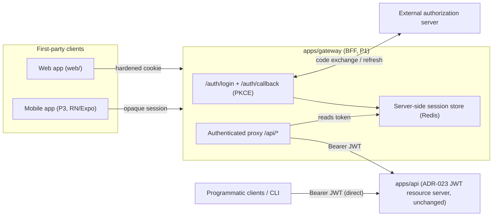

# Plan: P1 — First-party session gateway / BFF

**Roadmap position:** Supporting platform slice **P1**. Depends on **S0** (JWT
resource-server boundary, ADR-023) and an external authorization-server contract.
It does **not** sit on the linear media pipeline (S0–S9). It is the hard
architectural prerequisite for any first-party interactive client — the planned
web app (`web/`) and the planned mobile app (slice **P3**, React Native + Expo).

> P1 must be planned and built before a first-party browser, operator console, or
> mobile client auth flow exists. Per ADR-024 and `docs/plan/roadmap.md` (lines
> 103–107), it does not block S2 or S3.

**Implementation status (2026-06-04):**
- `T0` complete — ADR-024 accepted with concrete cookie / CSRF / session decisions.
- `T1` complete — `apps/gateway` scaffold, typed fail-closed `GatewaySettings`,
  profile/env wiring, and public health endpoints are in place.
- `T2` complete — OAuth PKCE/token exchange/refresh client is implemented and tested.
- `T3` complete — session store, hardened cookies, and CSRF helpers are in place.
- `T4` complete — login / callback / logout routes are wired and tested.
- `T5` complete — authenticated `/api/*` proxy with transparent refresh is wired and tested.
- `T6` complete — deterministic end-to-end lifecycle coverage, architecture/roadmap sync,
  and ADR-024 implementation references are in place.
- `T7` complete — 2026-06-04: the mobile-safe session handoff contract is now
  live end-to-end. Mobile login/callback emits one-time opaque `handoff_code`,
  `POST /auth/mobile/session` redeems that code into `session_ref`, `/api/*`
  accepts `X-Dubbridge-Session`, refresh rotation returns the new opaque session
  reference to mobile callers, `/auth/logout` accepts the mobile header, and the
  deterministic mobile lifecycle is covered end-to-end.

**Slice status:** P1 is complete. The gateway now serves both first-party
transports defined by ADR-024:
- browser/cookie transport
- mobile-safe handoff + explicit session-header transport

P3 is unblocked to start `T1+`.

## Objective

Introduce a **backend-for-frontend (BFF) / session gateway** as a new
frontend-facing service that lets first-party interactive clients (browser today,
mobile in P3) authenticate once against the external authorization server and then
call the protected DubBridge API **without ever holding long-lived access or
refresh tokens on the client**. The gateway maintains a server-side session,
represented to the client by a hardened cookie, and translates that session into a
`Bearer <JWT>` call to `apps/api`.

The core protected API (`apps/api`) **remains an unchanged JWT-validating resource
server** (ADR-023). P1 adds a surface in front of it; it never weakens or bypasses
per-request identity verification.

## Scope

### Included
- A new service crate `apps/gateway` (Axum) acting as the session gateway / BFF.
- OAuth 2.0 Authorization Code + PKCE flow against the external authorization
  server: `/auth/login` (start), `/auth/callback` (code exchange), `/auth/logout`.
- Server-side session store keyed by an opaque session id; tokens (access +
  refresh) are stored **server-side only**, never serialized to the client.
- Hardened session cookie: `HttpOnly`, `Secure`, `SameSite` (policy decided in
  Task 0), plus a CSRF defense (double-submit token or `SameSite=Strict` + origin
  check, decided in Task 0).
- An authenticated reverse-proxy / call-translation layer: gateway routes
  (e.g. `/api/*`) resolve the session, attach a valid `Bearer` access token
  (refreshing transparently when expired), and forward to `apps/api`.
- Token refresh against the authorization server when the access token is expired
  but the session/refresh token is still valid.
- A typed gateway configuration in `crates/config` (authorization-server endpoints,
  client id, client secret reference, cookie policy, upstream `apps/api` base URL,
  session TTL) consistent with the P0 fail-closed layered model (ADR-026).
- Deterministic tests with a stubbed authorization server and a stubbed upstream
  API, covering the login → callback → authenticated-proxy → logout lifecycle and
  the failure branches.
- A **transport-agnostic session contract** so P3 (React Native / Expo) can reuse
  the same gateway. The cookie is the browser representation; the underlying
  session-id mechanism must not assume a browser cookie jar. P3 T0 verified that
  the delivered T0-T6 implementation still exposes only the browser cookie
  transport, so T7 adds the mobile-safe return/handoff seam without creating a
  parallel auth path.

### Excluded (deferred)
- The web frontend itself (`web/` React app) — a separate frontend slice.
- The mobile app — slice **P3** (React Native + Expo).
- Production identity hardening: JWKS discovery and automatic key rotation — slice
  **P2** (ADR-023 follow-up). P1 consumes whatever verification the resource server
  already enforces; it does not add JWKS.
- The external authorization-server deployment/selection itself (owned outside this
  slice; P1 codes against its standard OAuth endpoints).
- Owner-platform credential handling for downloads (S3 / ADR-025) — unrelated
  credential class.

## Governing ADRs
- **ADR-024**: Low-friction first-party API access via session gateway (the slice's
  primary decision; **Accepted** on 2026-06-03 with the concrete cookie policy,
  CSRF posture, session-store choice, TTL, and mobile transport seam recorded in T0).
- **ADR-023**: API client authentication and principal propagation — the protected
  API trust boundary P1 must preserve unchanged.
- **ADR-026**: Layered fail-closed configuration — gateway config (client secret,
  endpoints, cookie policy) follows the committed-profile + injected-secret split.
- **ADR-018**: Traceable governance events — the verified subject remains the
  auditable actor; the gateway must not obscure it.

## Affected Files

### apps/gateway/ (new service)
- `Cargo.toml` — new binary crate; depends on `axum`, `tower`, `reqwest`
  (authorization-server + upstream calls), `crates/config`, cookie/session deps,
  `crates/observability`.
- `src/main.rs` — bootstrap: load config (fail-closed), build session store, build
  router, bind, serve.
- `src/state.rs` — `GatewayState` (config, session store, http clients).
- `src/session/mod.rs` — session model, opaque id, server-side token storage trait.
- `src/session/store.rs` — session store implementation (in-memory for tests;
  Redis-backed for runtime — Redis is already reserved for coordination in the
  architecture).
- `src/auth/login.rs` — `/auth/login`, `/auth/callback`, PKCE + state handling.
- `src/auth/logout.rs` — `/auth/logout`, session + cookie invalidation.
- `src/auth/oauth_client.rs` — pure request builder + IO executor for token
  exchange/refresh against the authorization server (mirrors the connectors
  builder/executor seam from ADR-025).
- `src/proxy.rs` — authenticated forwarding to `apps/api` with transparent refresh.
- `src/cookie.rs` — hardened cookie construction + CSRF token helpers.
- `src/lib.rs` — re-exports and `build_app()` for tests.

### crates/config/
- `src/lib.rs` (or a new `gateway` settings struct) — typed `GatewaySettings`
  (authorization-server endpoints, client id, client-secret reference, redirect uri,
  cookie policy, session TTL, upstream api base url) wired through the layered
  loader. Secret values arrive via injected env (`DUBBRIDGE_*`), not committed
  profiles.

### config/
- `default.toml`, `local.toml`, `<env>.toml` — non-secret gateway profile values
  (endpoints, cookie `SameSite`, session TTL, upstream url). No secrets here.
- `.env.example` — document the injected gateway secrets (client secret).

### docs/adr/
- `ADR-024-...md` — move from **Proposed** to **Accepted**; record concrete cookie
  policy, CSRF posture, session-store choice, and the transport-agnostic seam for
  mobile (P3). Add an `Implemented by` reference to this slice.

### docs/architecture.md
- Promote the session gateway / BFF row from "Planned supporting surface" to its
  operational state and describe `apps/gateway` in Runtime surfaces.

### docs/plan/roadmap.md
- Update P1 status from "⬜ no plan yet" to the plan/task ledger reference and its
  progress; note P3 (mobile) depends on it.

### Cargo.toml (workspace root)
- Add `apps/gateway` to the workspace members; add shared deps as needed.

## Design Decisions

### BFF is a new service, not a change to `apps/api`
ADR-024 is explicit: the protected API stays a JWT resource server. The gateway is
a separate frontend-facing process. This keeps the fail-closed identity boundary
(ADR-023) intact and lets programmatic clients keep calling `apps/api` directly
with a Bearer token.

### Tokens never reach the client
Access and refresh tokens live only in the server-side session store. The client
receives an opaque session reference in a hardened cookie. This is the core
security property of ADR-024 and the reason the BFF exists.

### Authorization Code + PKCE
The gateway is a confidential client doing Authorization Code with PKCE against the
external authorization server. PKCE + `state` defend the callback against
interception and CSRF on the login leg.

### Session store on Redis
The architecture already reserves Redis for coordination. The session store uses an
in-memory implementation for deterministic tests and Redis for runtime, behind a
trait, so sessions survive a single gateway restart and can scale horizontally
later.

### Transport-agnostic session seam (mobile-ready)
Native mobile clients (P3) do not share the browser cookie jar the same way. P1
defines the session contract around an opaque session id; the cookie is one
transport of that id. T7 extends the implemented gateway contract with a mobile
transport:

- mobile OAuth still starts and completes through the same gateway PKCE/state flow;
- the gateway callback returns to a registered mobile URI with a short-lived,
  one-time opaque handoff code only;
- the app redeems that handoff code at the gateway for an opaque session reference;
- subsequent mobile `/api/*` and `/auth/logout` calls carry that opaque reference in
  an explicit gateway session header;
- access tokens and refresh tokens remain server-side only.

P1 does **not** build the mobile client, but it must not bake in browser-only
assumptions that would force a parallel auth path in P3. This is the single most
important forward-looking constraint, since P3 reuses this exact gateway.

### Fail-closed configuration
Gateway config follows ADR-026: missing required values (authorization-server
endpoints, client secret, upstream url, cookie policy in production) abort startup.
The client secret is an injected env secret, never a committed profile value.

## Module Dependencies

```text
apps/gateway -> crates/config (GatewaySettings, fail-closed load)
             -> crates/observability (tracing)
             -> axum, tower (frontend-facing HTTP + middleware)
             -> reqwest (authorization-server token exchange/refresh; upstream apps/api)
             -> session store (in-memory | redis)

first-party client --(hardened cookie / opaque session)--> apps/gateway
apps/gateway --(Authorization: Bearer <JWT>)--> apps/api  (unchanged ADR-023 resource server)
apps/gateway <--(token exchange / refresh)--> external authorization server
```

P3 (mobile) later attaches as another first-party client of `apps/gateway`, reusing
the same session contract — no new trust boundary.

## Architecture Diagram



## Proposed execution order

```text
P1 T0 ADR-024 decision finalize (cookie policy, CSRF, session store, mobile seam)
  -> P1 T1 apps/gateway scaffold + GatewayState + fail-closed config + health
  -> P1 T2 OAuth client (PKCE token exchange/refresh) — pure builder + IO executor
  -> P1 T3 session store (trait + in-memory + Redis) + hardened cookie + CSRF
  -> P1 T4 login/callback/logout routes wired to store
  -> P1 T5 authenticated proxy to apps/api with transparent refresh
  -> P1 T6 end-to-end lifecycle tests (stub AS + stub upstream) + docs/ADR sync
  -> P1 T7 mobile-safe session handoff / deep-link return (post-P3-T0 unblock)
```

## Lines Affected After Implementation

Tracked per task in `docs/tasks/p1-session-gateway-bff.md`.
