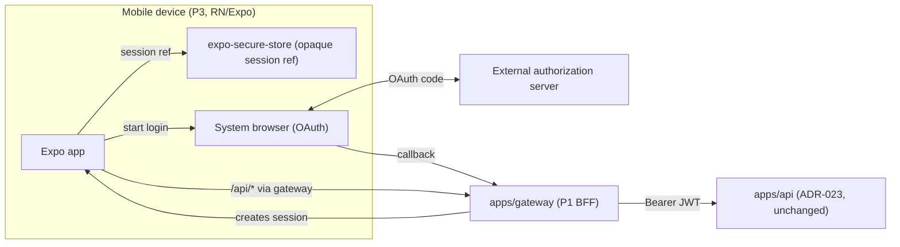

# Plan: P3 — First-party mobile client (React Native + Expo)

**Roadmap position:** Supporting platform slice **P3**. Depends on **P1**
(session gateway / BFF — hard architectural prerequisite, ADR-024) and benefits
from **P2** (production identity hardening / JWKS, ADR-023) for real device login.
It is **not** on the linear media pipeline (S0–S9); it is a first-party client
surface, the mobile twin of the planned web app (`web/`).

> Mobile does not exist in the repository today. This slice introduces it. Per the
> roadmap and ADR-024, a first-party interactive client must terminate in the P1
> session gateway; P3 must not invent a parallel auth path that holds long-lived
> tokens on the device.

## Objective

Deliver a first-party **mobile application built with React Native + Expo** that
authenticates through the **P1 session gateway / BFF** and operates the
DubBridge product surface available at the time (asset listing/detail, ingestion
status; richer media/review screens grow with S4–S9). The device **never holds
long-lived access or refresh tokens**; it authenticates via the gateway and carries
only the gateway's opaque session, exactly as the web client does (ADR-024).

## Scope

### Included
- A new `mobile/` Expo (managed workflow) React Native TypeScript app.
- Authentication via the **P1 gateway**: OAuth login through the device system
  browser (`expo-auth-session` / `expo-web-browser`) against the gateway's
  `/auth/login` → `/auth/callback`, establishing the gateway session.
- A typed API client that talks to the **gateway** (never directly to `apps/api`
  with a raw token), honoring the transport-agnostic session contract defined in
  P1 T0.
- Secure handling of the device-side session reference: stored in `expo-secure-store`
  (Keychain / Keystore), never in plain `AsyncStorage`; no access/refresh token
  ever persisted on device.
- Core screens for the available product surface: authenticated home, asset list,
  asset detail / ingestion status. Screens degrade gracefully where a backend slice
  (S4–S9) is not yet built.
- Navigation, environment configuration (gateway base URL per environment,
  consistent with ADR-026 env separation), and error/empty/loading states.
- Tests: unit tests for the API client and auth/session logic; component tests for
  the core screens (React Native Testing Library); an auth-flow integration test
  against a stubbed gateway. Connectivity targets the real gateway/backend per the
  no-mock-connectivity guidance — only external boundaries (system browser,
  gateway) are stubbed in tests.

### Excluded (deferred)
- The web frontend (`web/`) — separate frontend slice.
- Native live capture / RTMP/SRT streaming from the device — that is S3b
  (ADR-019/020/022) backend work, not this client slice.
- Push notifications, offline sync, and app-store release/CI signing pipelines —
  follow-up mobile hardening backlog once the core client is proven.
- Any change to the `apps/api` trust boundary (ADR-023) or to the gateway contract
  (owned by P1).

## Hard dependencies
- **P1 (session gateway / BFF)** must be built and expose a stable session contract
  (login/callback/logout + authenticated proxy). Without it, P3 has no compliant
  auth path. **This is the blocking dependency.**
- **P2 (production identity hardening)** is strongly recommended before real device
  login at scale (JWKS rotation), though P3 can develop against the same
  authorization server P1 uses.
- A product surface to render: S0+S1 already provide authenticated identity and
  upload/asset state; S4–S9 expand what the mobile UI can show.

## Governing ADRs
- **ADR-024**: first-party clients (incl. mobile) go through the session gateway;
  no long-lived tokens on the client. P3 is a direct consumer of this decision.
- **ADR-023**: the protected API stays a JWT resource server; P3 never bypasses it.
- **ADR-026**: environment separation — the gateway base URL is environment-driven,
  never a compiled/hardcoded default.

## Affected Files

### mobile/ (new Expo app)
- `package.json`, `app.json` / `app.config.ts` — Expo app config; env-driven gateway
  base URL via Expo config + `expo-constants`.
- `tsconfig.json`, `babel.config.js` — TypeScript + Expo presets.
- `src/api/client.ts` — typed fetch client targeting the P1 gateway; attaches the
  session transport; maps errors.
- `src/auth/session.ts` — login/logout via `expo-auth-session`/`expo-web-browser`;
  stores the session reference in `expo-secure-store`.
- `src/auth/AuthProvider.tsx` — auth context/state; gates the navigation tree.
- `src/navigation/` — stack/tab navigation (authed vs. unauthed).
- `src/screens/{Login,Home,AssetList,AssetDetail}.tsx` — core screens.
- `src/config/env.ts` — environment resolution (gateway URL per environment).
- `__tests__/` — unit + component + auth-flow tests.

### docs/
- `docs/adr/ADR-024-...md` — add mobile as a confirmed first-party client of the
  gateway (if not already covered by P1 T0's mobile seam subsection).
- `docs/architecture.md` — add `mobile/` to first-party client surfaces.
- `docs/plan/roadmap.md` — add slice **P3** to the supporting-platform table with
  dependency on P1 (+P2) and its status.

### web/README.md (reference only)
- Cross-reference that web and mobile share the same gateway trust boundary; no
  code change required.

## Design Decisions

### React Native + Expo, TypeScript
Chosen on 2026-06-03. Coherent with the React line reserved in `web/README.md`;
enables a single frontend skill set and shared client logic between web and mobile.
Expo managed workflow accelerates setup and OTA-friendly delivery; native modules
can be added later if a capability (e.g., capture) demands it.

### Gateway-only auth — no tokens on device
The device authenticates against the **P1 gateway** and holds only the gateway's
opaque session reference (in `expo-secure-store` / Keychain / Keystore). Access and
refresh tokens never live on the device. This is the mobile application of ADR-024
and the reason P1 is a hard prerequisite.

### System-browser OAuth, not embedded webview
Login uses the device system browser (`expo-web-browser` / `expo-auth-session`) for
the OAuth redirect, which is the current security best practice (avoids credential
capture in an embedded webview) and matches the gateway's Authorization Code flow.

### Environment-driven gateway URL
The gateway base URL is resolved per environment via Expo config, never hardcoded —
consistent with the ADR-026 fail-closed environment-separation principle applied to
a client.

### Graceful degradation against an evolving backend
Because S4–S9 are not built, screens that would show transcription/dubbing/review
must handle "not available yet" states cleanly rather than assuming endpoints exist.

## Module Dependencies

```text
mobile (Expo RN/TS)
  -> expo-auth-session / expo-web-browser  (OAuth via system browser)
  -> expo-secure-store                     (session reference at rest)
  -> P1 gateway (/auth/* + /api/* proxy)   (the only backend the device talks to)

device --(opaque session)--> apps/gateway (P1) --(Bearer JWT)--> apps/api (ADR-023)
```

The device never opens a direct authenticated channel to `apps/api`; all
authenticated traffic flows through the P1 gateway.

## Architecture Diagram



## Proposed execution order

```text
P3 T0 (gate) confirm P1 gateway session contract is available + stable
  -> P3 T1 Expo app scaffold (TS) + env-driven gateway config + navigation shell
  -> P3 T2 gateway API client (typed) + error/session transport handling
  -> P3 T3 auth flow (system-browser OAuth via gateway) + secure session storage
  -> P3 T4 core screens (Login, Home, AssetList, AssetDetail) against the gateway
  -> P3 T5 tests (unit + component + auth-flow vs. stubbed gateway) + docs/roadmap sync
```

## Lines Affected After Implementation

Tracked per task in `docs/tasks/p3-mobile-client.md`.
