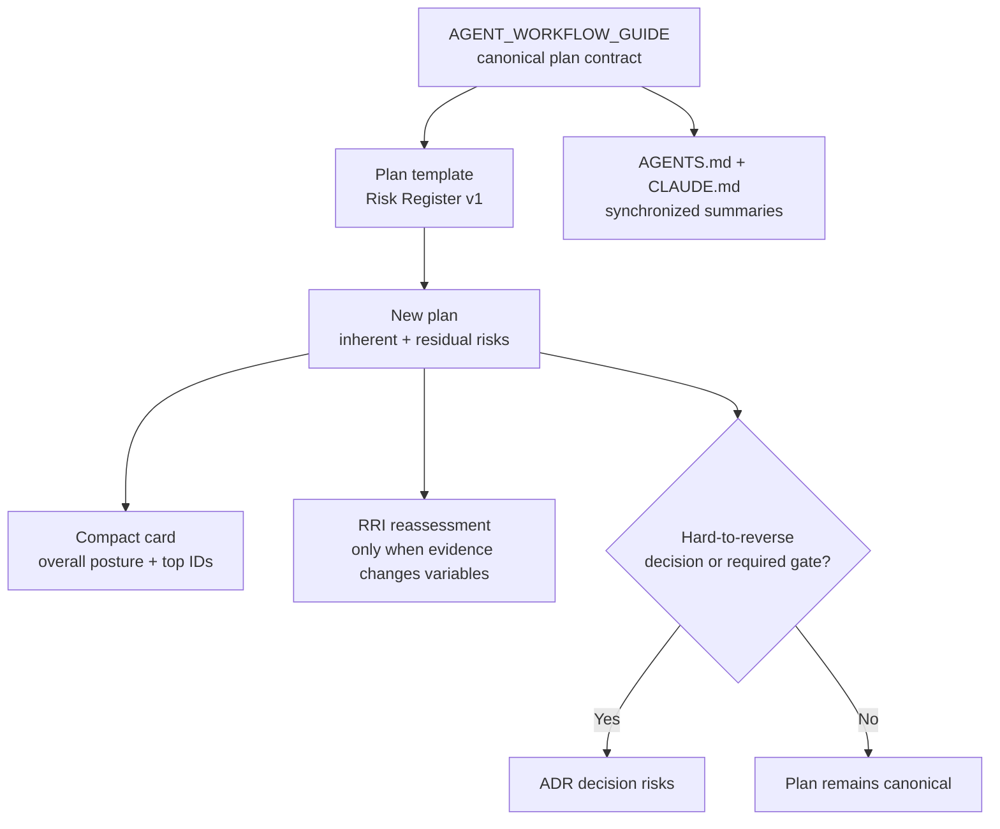

# Plan: Plan Risk Analysis Standard

> **Status:** Ready for approval. This document closes the design choices for the
> standard and provides an implementation-ready contract. No workflow policy or
> template has been changed yet.
>
> **Initiative RRI:** 28 (Moderate, Effort M). The implementation task remains
> subject to the RRI 26+ human approval gate.

## Decision summary

Every new plan must contain a `## Risk analysis` section using a lightweight
**Plan Risk Register**. The register is distinct from RRI:

- **RRI** determines the reasoning, review, model, and approval controls required
  for an agent to execute a task.
- **Plan risk analysis** identifies uncertain events that could prevent the plan
  from achieving its product, architecture, operational, quality, delivery, or
  governance objectives.

FODA/SWOT remains an optional discovery aid for strategic initiatives, but it is
not the canonical risk model. A risk register is selected because it records the
probability and impact of a concrete event, its owner, preventive response,
verification evidence, contingency, and residual exposure. Those fields are not
represented reliably by a FODA matrix.

No ADR is required to adopt this standard. It is a workflow-policy decision, not a
runtime architecture decision. An ADR is used only when a specific plan's risks
are tied to a significant, hard-to-reverse technical decision or when the RRI gate
requires an ADR and risk analysis.

## Objective

Make risk reasoning visible, comparable, and actionable in every new plan without
turning ordinary planning into a heavyweight compliance exercise.

The standard must:

1. expose material risks before implementation approval;
2. distinguish inherent exposure from the risk that remains after controls;
3. connect every high exposure to an owner, evidence, and contingency;
4. clarify when risk belongs in an ADR as well as in the plan;
5. surface the plan's risk posture in the existing Compact Approval Task Card;
6. preserve RRI as the sole execution-routing and autonomy-gate score.

## Current gap

The repository has a quantitative execution-risk model in
`docs/policies/RRI_POLICY.md`, and some plans and ADRs contain ad hoc risk tables.
However, the mandatory Plan step in
`docs/playbooks/AGENT_WORKFLOW_GUIDE.md` currently requires only objective,
affected files, design decisions, and module dependencies. There is no canonical
plan-risk schema, scale, ownership rule, or residual-risk gate.

Existing formats also vary:

- `docs/plan/okf-knowledge-format-adoption.md` uses risk, likelihood, and
  mitigation;
- `docs/adr/ADR-038-med-high-architect-refined-single-attempt.md` uses risk,
  failure mode, and mitigation;
- other plans use unstructured `## Risks` sections.

This standard unifies future plans without retroactively invalidating legacy plans.

## Model selection

### Selected: lightweight Plan Risk Register

The selected model combines the useful parts of a risk register and lightweight
FMEA while avoiding FMEA's per-failure-mode overhead.

| Capability | Plan Risk Register | FODA / SWOT | Full FMEA | RAID log |
|---|---|---|---|---|
| Concrete uncertain event | Strong | Weak | Strong | Strong |
| Likelihood and impact | Explicit | Absent | Explicit | Varies |
| Owner and response | Explicit | Absent | Explicit | Explicit |
| Trigger and contingency | Explicit | Absent | Usually indirect | Varies |
| Residual exposure | Explicit | Absent | Explicit | Varies |
| Suitable for every plan | Yes, with a no-material-risk path | No | Usually too heavy | Duplicates existing dependency tracking |

FODA is still useful before planning when the question is strategic positioning.
Full FMEA may be attached for safety-critical, reliability-heavy, or repeated
failure-mode analysis. Neither replaces the canonical register in the plan.

## Plan Risk Register v1 contract

### Required plan section

Every plan created after adoption must include the following section. It must not
be omitted when no material risk is found; in that case, the author records the
assessment scope and a short rationale instead of inventing placeholder risks.

```md
## Risk analysis

- **Overall residual risk:** `<Low | Moderate | High | Critical>`
- **Risk owner:** `<name or accountable role>`
- **ADR linkage:** `<ADR-NNN | Not required — rationale>`
- **Assessment basis:** `<scope, assumptions, and evidence reviewed>`

| ID | Risk statement | Category | Inherent (L×I) | Response | Verification evidence | Trigger and contingency | Owner | Residual (L×I) | Status |
|---|---|---|---:|---|---|---|---|---:|---|
| R-1 | Because `<cause>`, `<event>` may occur, resulting in `<consequence>` | `<category>` | `4×5=20` | `<preventive or reducing action>` | `<test, review, metric, or artifact>` | `<observable trigger>; <bounded response>` | `<role>` | `2×4=8` | Open |
```

If no material risks are identified, use:

```md
## Risk analysis

- **Overall residual risk:** Low
- **Risk owner:** `<name or accountable role>`
- **ADR linkage:** Not required — no hard-to-reverse decision is introduced.
- **Assessment basis:** `<scope, assumptions, and evidence reviewed>`
- **Material risks identified:** None. `<Specific rationale explaining why the
  scope has no material uncertainty beyond ordinary execution controls.>`
```

### Categories

Use one primary category per row:

- `Architecture / coupling`
- `Security / privacy / data`
- `Quality / testing`
- `Operations / reliability`
- `Product / UX`
- `Delivery / tooling`
- `Governance / external dependency`

Categories support review and filtering; they do not affect the numeric score.

### Likelihood and impact anchors

Likelihood is evaluated over the plan's delivery and initial operating horizon.
Impact is the worst credible consequence, not the most convenient average.

| Score | Likelihood anchor | Impact anchor |
|---:|---|---|
| 1 | Rare; exceptional conditions required | Negligible; local recovery with no plan outcome at risk |
| 2 | Unlikely but credible | Minor; bounded rework or short degradation |
| 3 | Plausible | Material; milestone, quality, or one subsystem is affected |
| 4 | Likely | Major; plan objective, production reliability, security, or data is materially affected |
| 5 | Expected or already observed | Severe; unsafe release, data/security breach, irreversible decision, or plan failure |

`Risk score = Likelihood × Impact` for both inherent and residual exposure.
Inherent exposure assumes no planned response. Residual exposure is reassessed
after the response and verification control are applied.

| Score | Level | Required treatment |
|---:|---|---|
| 1–4 | Low | Track in the plan; ordinary verification is sufficient |
| 5–9 | Moderate | Name an owner and response; review at plan checkpoints |
| 10–15 | High | Response, verification evidence, owner, and contingency are mandatory; surface it in the approval card |
| 16–25 | Critical | Block implementation until reduced, or record explicit human acceptance under the ADR rule below |

The plan's **overall residual risk** is the highest residual row, never an average.
This prevents several low values from hiding one release-blocking exposure.

### Status vocabulary

- `Open` — response work or evidence is outstanding.
- `Accepted` — the accountable human has explicitly accepted the residual risk.
- `Mitigated` — planned controls are implemented and evidence supports the
  recorded residual score.
- `Closed` — the event can no longer affect the plan or the exposure was removed.

### Review triggers

Reassess the register:

1. before a task is presented for approval;
2. when scope, dependencies, design decisions, or assumptions change;
3. when tests, incidents, benchmarks, or reviews invalidate a control;
4. before the plan or its final implementation task is closed.

When a plan risk changes the evidence for `D`, `T`, `A`, `K`, `P`, `X`, or an RRI
penalty, recompute RRI with `scripts/rri.py`. Do not copy the plan risk score into
RRI and do not use it to override the RRI band.

## ADR linkage rule

The plan always retains its `## Risk analysis` section. An ADR is additionally
required when any of these conditions holds:

1. the active RRI band explicitly requires `ADR + risk analysis`;
2. a High or Critical residual risk depends on a significant, hard-to-reverse
   runtime, data, security, public API, ownership, or service-boundary decision;
3. the team intends to accept a Critical residual risk instead of reducing it;
4. the proposed response changes or supersedes an existing ADR decision.

When an ADR exists, it is canonical for decision-specific risks and their accepted
trade-offs. The plan references the ADR risk IDs, summarizes their current residual
level and owner, and adds delivery or operational risks that do not belong in the
ADR. The same full risk table must not be maintained independently in both places.

Recommended ADR extension when decision risk analysis is required:

```md
## Decision risk analysis

| ID | Decision-linked risk | Response / trade-off | Verification | Residual (L×I) | Acceptance |
|---|---|---|---|---:|---|
| DR-1 | `<cause, event, consequence>` | `<control or deliberate trade-off>` | `<evidence>` | `2×5=10` | `<owner/date or pending>` |
```

Adopting this workflow standard does **not** itself require a new ADR. The
repository's RRI adoption note establishes the relevant precedent: workflow policy
does not become a runtime architecture decision merely because it governs agents.

## Compact Approval Task Card projection

The existing six-block card remains six blocks. Add one row to the Decision header
instead of creating a seventh section:

```md
| Plan risk posture | `<level>; top residual risks: R-1, R-3; evidence: <plan link>` |
```

Rules:

- Always show the overall posture.
- Name at most three High or Critical residual risk IDs.
- Keep full analysis in the linked plan; do not copy the register into the card.
- A Critical residual posture makes the approval checkpoint explicitly state
  whether execution is blocked or which named human accepted the risk and where
  that acceptance is recorded.

## Scope of the adoption change

### Affected files

- `docs/playbooks/AGENT_WORKFLOW_GUIDE.md` — make risk analysis a mandatory Plan
  input and define lifecycle, thresholds, and ADR/RRI interaction.
- `docs/policies/RRI_POLICY.md` — clarify that RRI and plan risk are separate and
  require recomputation when plan evidence changes an RRI variable or penalty.
- `docs/templates/plan.md` — add the reusable Plan Risk Register v1 template.
- `docs/templates/compact-approval-task-card.md` — add the risk-posture projection.
- `AGENTS.md` — synchronize the shared presentation summary.
- `CLAUDE.md` — synchronize the agent-facing workflow summary as required by the
  workflow guide's RRI adoption note.

### Out of scope

- No runtime, API, database, migration, security-control, or product change.
- No change to the RRI formula, bands, model routing, or HITL thresholds.
- No mandatory FODA, FMEA, or RAID artifact.
- No retroactive failure of legacy plans. Backfill may happen when a plan is
  materially revised.
- No automated semantic judgment of whether a risk is correctly identified.

## Design decisions

1. **Prospective contract with legacy grandfathering.** New plans use v1 after
   adoption; existing plans migrate when materially revised.
2. **One canonical register.** Supporting analysis may be attached, but the plan
   exposes one normalized risk posture.
3. **Maximum residual, not average.** Overall posture preserves the worst material
   exposure.
4. **Evidence is part of mitigation.** A response without a test, review, metric,
   or artifact is not sufficient to claim a lower residual score.
5. **Critical risk is fail-closed.** It blocks implementation unless it is reduced
   or explicitly accepted through the human/ADR rule.
6. **No new approval-card block.** Risk posture is projected into the current
   Decision header to preserve Compact Approval Task Card v2.
7. **No workflow ADR.** ADRs record the hard-to-reverse decisions inside plans,
   not the generic planning method.

## Module dependencies



## Risk analysis

- **Overall residual risk:** Moderate
- **Risk owner:** Workflow owner / repository maintainer
- **ADR linkage:** Not required — this is a workflow-policy standard and changes no
  runtime architecture boundary.
- **Assessment basis:** Current plan requirements, RRI policy, Compact Approval
  Task Card v2, ADR format, and existing risk sections were compared.

| ID | Risk statement | Category | Inherent (L×I) | Response | Verification evidence | Trigger and contingency | Owner | Residual (L×I) | Status |
|---|---|---|---:|---|---|---|---|---:|---|
| R-1 | Because the workflow contract is summarized in several files, wording may diverge and agents may apply different rules | Governance / external dependency | `4×4=16` | Change the authoritative guide and synchronized summaries in one task | Cross-file consistency review and `make qa-docs` | Conflicting requirement found; stop and reconcile against the guide | Workflow owner | `2×3=6` | Open |
| R-2 | Because both models use the word risk, agents may combine the plan score with RRI and route execution incorrectly | Delivery / tooling | `4×5=20` | Define separate purposes and prohibit score substitution | RRI policy wording plus acceptance review | Card or task derives RRI from plan score; recompute only with `scripts/rri.py` | Task orchestrator | `1×4=4` | Open |
| R-3 | Because mandatory analysis can become ceremonial, plans may grow without improving decisions | Governance / external dependency | `4×3=12` | Use a compact schema and an explicit no-material-risk path | Template review against a low-risk plan | Repeated placeholder rows; simplify and require rationale instead | Workflow owner | `2×2=4` | Open |
| R-4 | Because L×I scores are judgment-based, authors may present false precision or inconsistent ratings | Quality / testing | `3×4=12` | Publish anchors, retain cause-event-consequence prose, and use maximum residual posture | Independent plan review against anchors | Material reviewer disagreement; revise anchors or record uncertainty | Plan owner | `2×3=6` | Open |
| R-5 | Because risks may appear in both a plan and ADR, duplicated registers may drift | Architecture / coupling | `3×3=9` | Make the ADR canonical only for decision risks and reference IDs from the plan | Link and duplication check during review | Same full row maintained twice; consolidate in the ADR and retain plan summary | Plan owner | `1×2=2` | Open |
| R-6 | Because the first version is a prose contract, new plans may omit the section before automated enforcement exists | Delivery / tooling | `3×3=9` | Add a canonical plan template and phase-1 review requirement; assess automation after adoption | Template presence and plan-review evidence | Omission recurs; open a follow-up validator task | Workflow owner | `2×3=6` | Open |

## Verification strategy

Implementation is complete only when:

1. the six affected files express the same contract and authority order;
2. the plan template contains both the material-risk and no-material-risk forms;
3. the compact card remains six blocks and projects only the posture and top IDs;
4. RRI language preserves `scripts/rri.py` as the sole RRI calculator;
5. ADR language avoids duplicating the same canonical risk register;
6. `make qa-docs` and `git diff --check` pass.

Semantic consistency is a human review responsibility; deterministic documentation
checks cannot prove that a risk statement or residual score is substantively
correct.

## Implementation ledger

The bounded adoption task, its full RRI evidence, acceptance criteria, and handoff
prompt are in `docs/tasks/plan-risk-analysis-standard.md`.

