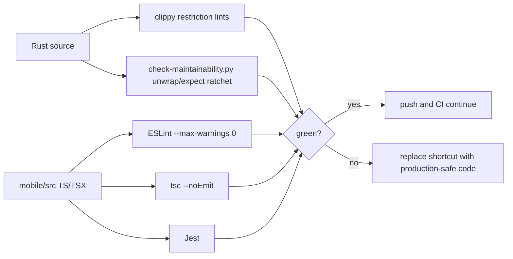

# Plan: Production Readiness Gate

## Objective

Guarantee that backend and mobile code reaching `main` is free of demo-grade or
runtime-risk anti-patterns (panic paths, debug logging, placeholder code, loose
typing escapes), enforced by automation rather than agent or human judgement.

## Outcome (supersedes the original regex design)

The original plan proposed a second standalone regex scanner
(`scripts/check-production-readiness.py`). That approach was rejected and
removed: regex scanning of diffs duplicates — less accurately — what the
language-native AST tools already do, and produces false positives (e.g.
flagging a legitimate `<TextInput placeholder="...">` or every `Duration`
timeout) that train contributors to evade the gate.

Production-readiness is now enforced by the right tool per surface, with **no
extra bespoke script**:

- **Backend Rust → Clippy restriction lints.** `Cargo.toml`
  `[workspace.lints.clippy]` denies `todo`, `unimplemented`, `dbg_macro`,
  `panic`, `print_stdout`, and `print_stderr` workspace-wide; `clippy.toml`
  exempts test code (`allow-*-in-tests`). These ride the existing
  `make qa-lint` / CI clippy gate (`-D warnings`) — AST-accurate, with a
  justified `#[allow(clippy::..)]` escape hatch at the call site.
- **`unwrap()` / `expect()` → diff ratchet in `check-maintainability.py`.**
  These have hundreds of grandfathered call sites, so they cannot be denied
  globally; `check_runtime_risk_additions` blocks only *newly added* occurrences
  in production Rust source.
- **Mobile → ESLint (flat) + `tsc --noEmit` + Jest.** `mobile/eslint.config.js`
  rejects `any`, `console.log/debug`, `debugger`, and `@ts-ignore`/`@ts-nocheck`
  as errors with `--max-warnings 0` (no warning tier). This also closes the
  prior gap where mobile had no CI gate at all. Surfaced through `make qa-mobile`.

## Wiring

- `make qa-mobile` (typecheck + lint + Jest); `make qa-lint` already carries the
  Rust lints; `make qa-maintainability` carries the unwrap/expect ratchet.
- CI: new `mobile` job (Node + `npm ci` + `make qa-mobile`); the `clippy` job
  enforces the Rust lints. The standalone production-readiness job was removed.
- pre-push runs `make qa-mobile` when `mobile/node_modules` is present.

## Module Dependencies

