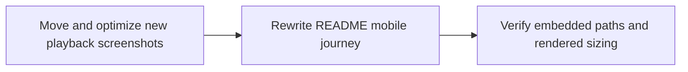

# Plan: README Mobile Experience Refresh

> **Status:** Done (2026-06-25).
> **Tasks ledger:** `docs/tasks/readme-mobile-experience-refresh.md`.

## Purpose

Refresh the `README.md` mobile section so it reflects the current first-party
mobile experience, including the latest inline playback surfaces for asset detail
and review detail.

The current README describes the mobile flow as a user journey, but the screenshots
are referenced as inline links instead of embedded media. This plan updates the
section into a compact, end-to-end narrative with embedded images sized for
readability and reasonable page weight.

## Objective

- Move the latest mobile playback screenshots into the repository.
- Optimize those images for README consumption without making the text illegible.
- Rewrite the `Mobile client` section as a concise mobile journey with embedded
  screenshots and short explanatory copy per stage.

## Design decisions

### D1 — Keep the README as a guided mobile walkthrough

The section should read like a single user journey: access, assets, rights,
playback, review, and publication.

### D2 — Embed images inline and constrain rendered width

Use embedded images in the README, not links. Prefer compact HTML image rows so
the layout stays scannable and the screenshots do not dominate the page.

### D3 — Optimize only the new screenshots for this refresh

The new playback screenshots will be moved into `mobile/artifacts/screenshots/`
and resized in place for lighter README rendering while preserving legibility.

### D4 — Curate the screenshot set

Do not embed every mobile screenshot. Use a representative set that covers the
full flow and highlights the latest playback work.

## Affected files

- `README.md`
- `mobile/artifacts/screenshots/`
- `docs/plan/readme-mobile-experience-refresh.md`
- `docs/tasks/readme-mobile-experience-refresh.md`

## Dependency flow

## Verification

- Confirm the new screenshots exist under `mobile/artifacts/screenshots/`.
- Confirm the README uses embedded image tags with relative repo paths.
- Confirm the mobile section mentions the current inline playback experience for
  asset detail and review detail.
- Run `make qa-docs`.

## Outcome

Completed on 2026-06-25. The README mobile section now embeds a curated set of
screenshots, includes the latest asset-detail and review playback surfaces, and
uses restrained image widths suitable for GitHub rendering.
