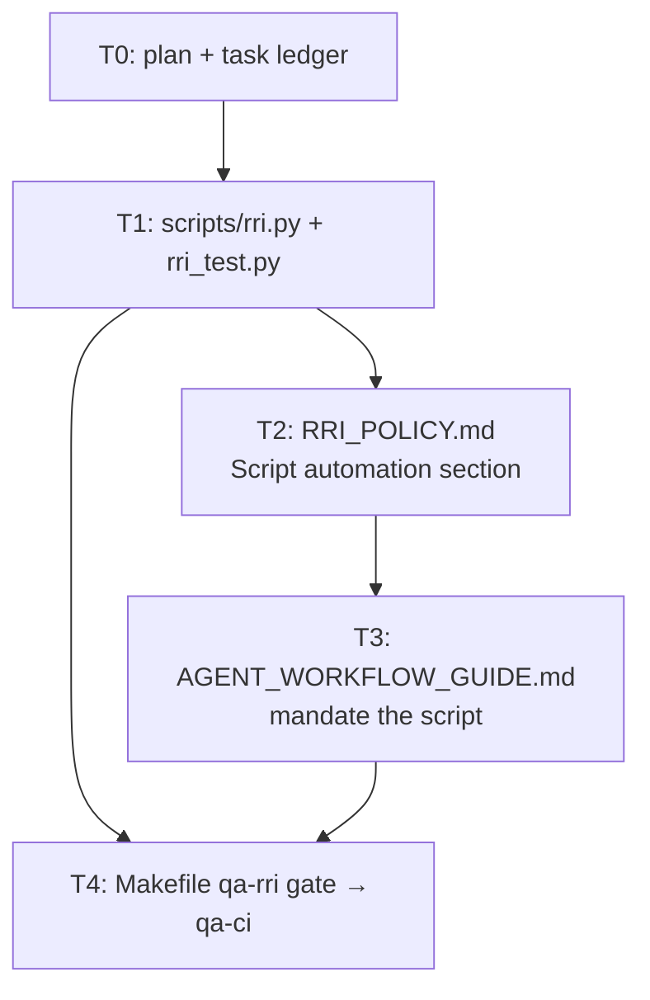

# Plan: RRI Calculator Script

**Roadmap position:** Cross-cutting process tooling. Not a product slice.
Makes RRI scoring deterministic and agent-independent: the script is the arbiter of
every value that can be computed from paths or other scores, so the agent only
supplies the four irreducible judgments.

**Implementation status:**
- T0 complete — plan + task ledger created 2026-06-08.
- T1 complete — `scripts/rri.py` + `scripts/rri_test.py` created; 29 tests green 2026-06-08.
- T2 complete — "Script automation" section added to `RRI_POLICY.md` 2026-06-08.
- T3 complete — script mandated in `AGENT_WORKFLOW_GUIDE.md` 2026-06-08.
- T4 complete — `qa-rri` target added to `Makefile`, wired into `qa-ci` 2026-06-08.

## Objective

Create `scripts/rri.py` — a deterministic Python script that is the single source of
truth for RRI computation. It:

1. **Measures F** from declared `--touches` paths (pre-implementation) or
   `git diff --name-only <base>...HEAD` (post-implementation).
2. **Auto-derives the D/P/K floors** by matching changed/declared paths against the
   anchor rubric in `docs/policies/RRI_POLICY.md`, and **raises** any agent-supplied
   D/P/K below its floor (never below the floor — policy rule).
3. **Computes the exact formula** with correct float math and documented rounding.
4. **Auto-applies the 4 derivable penalties** (`many_files`, `complex_and_domain`,
   `no_tests_high_impact`, `auth_security`) and accepts the 3 intent-based penalties
   as manual flags. Reports which penalties applied and why.
5. **Determines the band** and emits the full crosswalk row: label, Effort,
   Codex tier, Claude tier, thinking, gate.
6. **Detects decomposition triggers** and warns when any fires.
7. **Outputs** the reporting format mandated by `RRI_POLICY.md § Reporting format`
   (markdown default, `--json` optional).

Then amend `RRI_POLICY.md` and `AGENT_WORKFLOW_GUIDE.md` so agents **must** run the
script instead of computing the RRI by hand.

## Motivating evidence

The RRI hand-computed for this plan's own T1 ledger entry was wrong (estimated ~16/28;
the correct value for C1 F1 D1 T2 A0 K1 P0 X2 is 20). Manual computation is
error-prone even with the formula in view. This is the core justification for the
script.

## What stays with the agent vs. what the script decides

| Decided by the **script** (objective / derivable) | Supplied by the **agent** (irreducible judgment) |
|---|---|
| F (file count → score) from `--touches` or git diff | T — measured via `cargo llvm-cov`, passed as `--T` |
| **C score from raw CC** (`--cc <n>` → score via the policy CC table) | A — task ambiguity (has acceptance criteria + examples?) |
| D/P/K **floors** from the anchor rubric (path match) | X — context size required |
| Penalties `many_files`, `complex_and_domain`, `no_tests_high_impact`, `auth_security` | D/P/K **above** the floor (script enforces only the floor) |
| Band, Effort, tiers, thinking, gate (crosswalk) | The 3 intent penalties: `refactor_and_behavior`, `arch_decision`, `no_verification` |
| Decomposition-trigger detection · low-confidence +1 bump | — |

F and C are the only two variables with a deterministic numeric→score table in the
policy; the script owns both mappings. The agent still **measures** the raw inputs
(file paths; raw CC via `radon`/`mccabe` for Python or `clippy` for Rust; coverage
via `llvm-cov`), but the conversion to a 0–5 score and the entire formula, rubric,
penalty, and band logic live in code. The remaining agent inputs (T, A, X, and
D/P/K above the floor) are descriptive judgments with no single-number mapping.

## Decisions closed (scope locked)

| Decision | Choice | Rationale |
|---|---|---|
| Language | **Python** (`scripts/rri.py`) | Zero build → instant invocation at every task presentation; `fnmatch` for rubric globs, native float/json, `argparse` validation; easily unit-tested. `python3` is present by default on macOS/Linux. |
| F source | `--touches` (declared) → else `git diff --name-only <base>...HEAD` | Solves the empty-diff problem at task-presentation time; auto-measures post-implementation. |
| C source | `--cc <raw>` → mapped via policy CC table; else `--C <0-5>` | C is the only other variable with a deterministic numeric→score map; owning it removes avoidable agent error (the C=2 vs C=3 band-flip seen scoring T1 itself). Dual flag mirrors F. |
| D/P/K floors | Auto-derived from path match; agent input **raised** to floor, never lowered | Policy: "never score lower than the floor". Removes subjectivity the rubric already pins. |
| Floor enforcement | Auto-raise + report the raise (not hard-error) | Safer default; matches policy intent; keeps the agent's higher scores when given. |
| Penalties | 4 auto-detected, 3 manual; manual `auth_security` also allowed and de-duped | Removes the most common error (forgetting a derivable penalty); keeps intent-based ones explicit. |
| Output | Markdown default + `--json` | Markdown is copy-paste-ready for task presentations; JSON enables future tooling/CI. |
| Tiers | Emit Economy/Balanced/Premium names, never model IDs | Model IDs drift; policy resolves tier→model at presentation time. |
| Tests | `scripts/rri_test.py` with known vectors (run via `python3 -m unittest` / pytest) | Real tests over ad-hoc self-test; aligns with the repo's TDD discipline. |
| Rounding | Round base to nearest integer, then add integer penalties | Deterministic, documented; band boundaries are integers. |
| CI gating | **In scope (T4)** — `qa-rri` target wired into `qa-ci`, not `qa-docs` | The script becomes a trusted oracle; without an automatic test gate, silent regression reintroduces exactly the agent-independence problem this work removes. Tests not run in CI rot. |

## Affected files

| File | Change | Task |
|---|---|---|
| `docs/plan/rri-calculator-script.md` | Created (this file) | T0 |
| `docs/tasks/rri-calculator-script.md` | Created (ledger) | T0 |
| `scripts/rri.py` | New — RRI calculator | T1 |
| `scripts/rri_test.py` | New — unit tests (known vectors) | T1 |
| `docs/policies/RRI_POLICY.md` | Add "Script automation" section | T2 |
| `docs/playbooks/AGENT_WORKFLOW_GUIDE.md` | Mandate script in the RRI section | T3 |
| `Makefile` | Add `qa-rri` target running the tests; wire into `qa-ci` | T4 |

## Script interface (design)

```
scripts/rri.py [OPTIONS]

Cyclomatic complexity (pass one of these — like F's --touches/--F dual):
  --cc <int>  Raw cyclomatic complexity (radon/mccabe/clippy) → script maps to C score
  --C <0-5>   Pre-computed C score (use when raw CC is unavailable)

Required (agent-supplied irreducible judgments):
  --T <0-5>   Test-coverage risk (agent measures via cargo llvm-cov)
  --A <0-5>   Task ambiguity
  --X <0-5>   Context size required

Semi-required (floor auto-enforced; pass the agent's judged value, script raises if below floor):
  --D <0-5>   Domain complexity   (floor from anchor rubric)
  --K <0-5>   Coupling/side effects (floor from anchor rubric)
  --P <0-5>   Public API/security/data impact (floor from anchor rubric)

Path source (for F and rubric floors):
  --touches <path>   Declared affected path; repeatable. Use at task-presentation time.
  --base <branch>    Base branch for git-diff fallback (default: main)
  --F <0-5>          Manual F override (only if no --touches and no git)

Penalties (3 intent-based; the other 4 are auto-detected):
  --penalty refactor_and_behavior   (+8)
  --penalty arch_decision           (+12)
  --penalty no_verification         (+15)
  --penalty auth_security           (+10)  # also auto-detected; de-duped

Other:
  --low-confidence <vars>   Comma list (e.g. D,K) → +1 step each, capped at 5, marked Low
  --json                    JSON output instead of markdown
```

## Output format (default markdown)

```
| Variable | Score | Evidence | Confidence |
|---|---|---|---|
| C cyclomatic | N | (agent-supplied or blank) | High |
| F files | N | --touches → M files  (or git diff …) | High |
| D domain | N | anchor rubric: <row> → floor F; raised from R | High |
| T coverage | N | (agent-supplied) | High |
| A ambiguity | N | (agent-supplied) | High |
| K coupling | N | anchor rubric: <row> → floor F | High |
| P impact | N | anchor rubric: <row> → floor F | High |
| X context | N | (agent-supplied) | High |

**Base value:** 100 × (Σ / 5) = NN
**Penalties applied:** many_files (+8, F=4); auth_security (+10, crates/auth) | none
**Final RRI:** NN → band <label> → Effort <S/M/L/XL> · Codex <tier> · Claude <tier> · thinking <On/Off>
**Gates for this band:** <gate text>
**Decomposition:** triggered by <rule> — split before implementing | not triggered
```

## Module / document dependencies



## Design decisions

- **Anchor rubric in code.** The rubric table (path → D/P/K floor + ADR) is encoded
  as an ordered list of `(glob, D, P, K, adr, label)` rows; the **most specific
  matching row wins** (e.g. `apps/gateway/src/auth/**` beats a generic `apps/**`).
  Rows the rubric leaves content-dependent (config env-wiring, "secrets/credential
  storage" with no clean path) emit an **advisory note**, not a hard floor.
- **Penalty de-duplication.** Auto-detected and manual penalties live in one set keyed
  by penalty name; each counts once even if both triggered.
- **Floors feed penalty detection.** A raised D can trigger `complex_and_domain`
  (C≥4 ∧ D≥3); the script applies floors *before* evaluating penalties so the result
  is internally consistent.
- **Float precision.** The weighted sum is computed in float, multiplied by 100,
  rounded to the nearest integer; integer penalties are added after rounding. Band
  boundaries (25/26, 40/41, 55/56, 70/71, 85/86, 100/>100) are integer comparisons.
- **Tests are the verification strategy (T1).** `scripts/rri_test.py` asserts known
  vectors: all-0→0; all-5→100; the T1 vector (C1F1D1T2A0K1P0X2 → 20); a floor-raise
  case (`--touches crates/auth/...` with `--D 1` → D raised to 4); an auto-penalty
  case (F=4 → many_files); each band boundary; a decomposition-trigger case.

## Related documents

- `docs/policies/RRI_POLICY.md` — formula, anchor rubric, penalty table, bands (source of truth)
- `docs/playbooks/AGENT_WORKFLOW_GUIDE.md` — mandates RRI scoring; will mandate the script
- `docs/tasks/rri-calculator-script.md` — task ledger (crash-safe progress)
