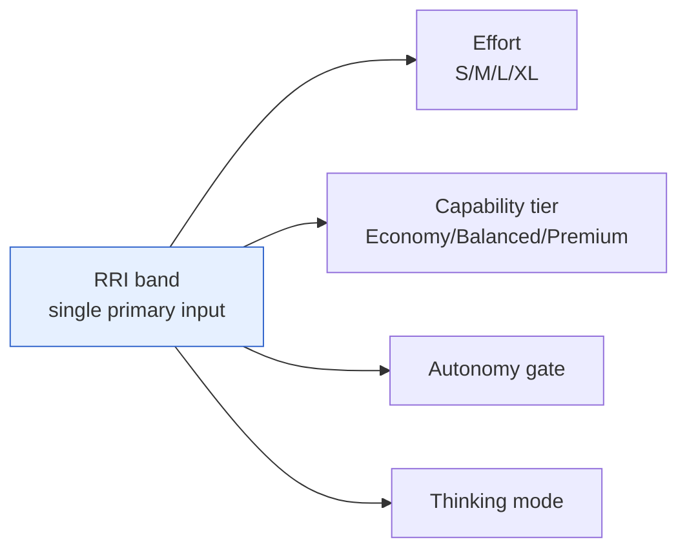

# Plan: RRI ↔ Effort ↔ Capability Consistency

Governing guides: `docs/playbooks/AGENT_WORKFLOW_GUIDE.md`, `docs/policies/RRI_POLICY.md`,
`docs/policies/HITL_AUTONOMY_POLICY.md`, `AGENTS.md`
Related: `docs/tasks/doc-consistency-guardrails.md` (the `make qa-docs` guardrail this
work must keep green)

## Objective

Make the three derived concepts of the workflow scoring model internally consistent
and non-contradictory:

1. **RRI** — the Required Reasoning Index band (the only primary input).
2. **Effort** — the S/M/L/XL label.
3. **Capability decision** — the Economy/Balanced/Premium model tier (plus thinking
   mode and autonomy gate, which are tier-adjacent).

The current documentation derives Effort and capability **in parallel** from RRI, but
spreads the mappings across three partial tables in two files, with diverging
granularity and at least one direct contradiction. This plan consolidates them into a
single canonical crosswalk and removes the contradictions.

## Problem statement (findings from the consistency review)

| # | Finding | Evidence | Type |
|---|---|---|---|
| F1 | `Effort → capability` is not a function: Effort L (41–70) spans two capability rows (`Balanced→Premium` at 41–55 and `Premium` at 56–70); Effort XL (71+) spans three different gates. Effort is a lossy intermediate, so the chain `RRI → Effort → capability` breaks. | `AGENT_WORKFLOW_GUIDE.md:192-197` vs `:308-314`; `RRI_POLICY.md:177-185` | Conceptual model |
| F2 | The Effort scale defines **XL** by "unpredictable external tooling" / "Native toolchain conflict resolution", but the rules below explicitly forbid using Effort to encode toolchain pain. The qualitative description contradicts the canonical RRI-driven rule. | `AGENT_WORKFLOW_GUIDE.md:186` vs `:200-203` | Internal contradiction |
| F3 | The column header "Complexity label" labels two different scales with overlapping vocabularies: the CC table (`Low/Medium/High/Very High`) and the RRI-band table (`Low/Moderate/Med-high/Complex/High/Very High`). `High` means CC 11–20 in one and RRI 71–85 in the other. | `AGENT_WORKFLOW_GUIDE.md:268-273` vs `:308`; presentation format `:362-366` | Vocabulary collision |
| F4 | Codex tier for band 41–55 disagrees between the two canonical docs: the guide says Codex `Balanced`, the policy's unified Tier column says `Balanced → Premium`. | `AGENT_WORKFLOW_GUIDE.md:312` vs `RRI_POLICY.md:181` | Cross-doc contradiction |
| F5 | Three overlapping partial tables (`RRI→Effort`, `RRI→capability+thinking`, `RRI→gate+tier+thinking`) across two files, with different granularity (Effort omits the 55/56 split; the guide omits the 71-85/86-100/>100 split). No single source of truth → drift risk (F4 is already a symptom). | `AGENT_WORKFLOW_GUIDE.md:192-197`, `:308-314`; `RRI_POLICY.md:177-185` | Structural risk |

## Design decisions

- **D1 — Single canonical crosswalk lives in `RRI_POLICY.md`.** The guide already
  delegates the full RRI procedure to `RRI_POLICY.md` (`AGENT_WORKFLOW_GUIDE.md:227-232`).
  We extend the existing "Bands, autonomy gates, and model tiers" table into the one
  authoritative crosswalk with columns:
  `RRI band | label | Effort | Capability (Codex) | Capability (Claude Code) | Thinking | Gate`.
  This co-locates every RRI-derived value in one row so consistency is auditable by
  inspection and impossible to split across files.
- **D2 — The guide references the crosswalk instead of restating partial copies.**
  Remove the standalone `RRI→Effort` table (`:192-197`) and the Step 2 capability
  mapping (`:308-314`) as independent sources; replace them with a pointer to the
  canonical crosswalk plus the explicit derivation rule (D3). The guide keeps the
  qualitative Effort scale (S/M/L/XL descriptions) because it adds reading value, but
  marks it illustrative and RRI-subordinate.
- **D3 — State the derivation topology explicitly.** Add one sentence making the model
  unambiguous: "Effort, capability tier, and autonomy gate are each derived **in
  parallel** from the RRI band; never derive capability or gate from Effort." This
  closes F1 at the conceptual level — Effort is a presentation label, not an
  intermediate in the decision.
- **D4 — Resolve F4 toward the more capable value.** Band 41–55 is the transition band
  where thinking turns On; set both vendors to `Balanced → Premium` at 41–55 to match
  the policy's existing unified value and the thinking-On semantics. Fix it once in the
  canonical crosswalk (D1) so the guide cannot disagree.
- **D5 — Rename to remove the vocabulary collision (F3).** Rename the CC table's
  "Complexity label" column to "Cyclomatic (C) label" and keep the RRI-band label as
  "RRI band label". Update the presentation-format block so `Complexity score → label`
  unambiguously refers to the cyclomatic/decision-weight label, not the RRI band.
- **D6 — Fix the Effort scale contradiction (F2).** Rewrite the XL row's qualitative
  description so it reflects RRI-driven reasoning ("very high reasoning/risk per the
  RRI band") instead of "external tooling", consistent with the anti-toolchain rule at
  `:200-203`. Keep an illustrative example that is not toolchain-flavored.
- **D7 — No code, no ADR, no CI change.** This is a workflow-policy documentation
  consistency change. `make qa-docs` must stay green (no ADR reference is added or
  removed). `CLAUDE.md` (project/global) is left as a documented override per the
  guide's precedence rule and is explicitly out of scope.

## Affected files

- `docs/policies/RRI_POLICY.md` — canonical crosswalk (D1, D4).
- `docs/playbooks/AGENT_WORKFLOW_GUIDE.md` — reference the crosswalk + derivation rule
  (D2, D3), fix Effort scale XL row (D6), rename CC label column + presentation block
  (D5).
- `docs/plan/rri-effort-capability-consistency.md` — this plan (progress ledger fields
  filled after each task).
- `docs/tasks/rri-effort-capability-consistency.md` — task ledger.

## Module dependencies

The fix enforces this topology: one input (RRI band), four parallel outputs, no
output derived from another output.

## Build order

T1 (canonical crosswalk in policy) → T2 (guide references it + derivation rule) →
T3 (Effort scale XL fix) → T4 (label collision rename) → T5 (verify `make qa-docs`,
sync status). T1 first because the guide (T2) must point at a crosswalk that already
exists and already resolves F4.

## Progress ledger

- [x] T1 — Canonical crosswalk in `RRI_POLICY.md` (resolves F4, F5) — 2026-06-07
- [x] T2 — Guide references crosswalk + explicit parallel-derivation rule (resolves F1, F5) — 2026-06-07
- [x] T3 — Fix Effort scale XL contradiction (resolves F2) — 2026-06-07
- [x] T4 — Rename "Complexity label" collision (resolves F3) — 2026-06-07
- [x] T5 — Verify `make qa-docs` green + sync status artifacts — 2026-06-07
