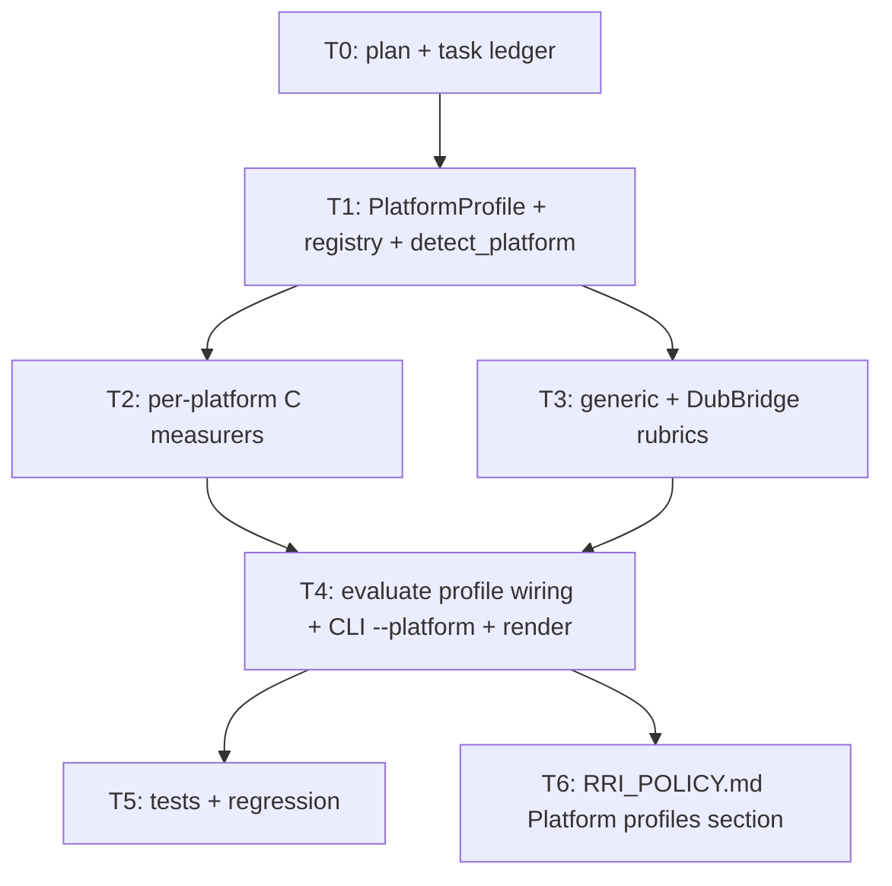

# Plan: RRI Multi-Platform Profiles

**Roadmap position:** Cross-cutting process tooling. Continuation of
`rri-calculator-script` (T0–T4 complete). Makes the RRI calculator portable across
language ecosystems (Rust, Python, Go, React Native / JS-TS) without weakening its
deterministic core: the script stays the single arbiter of the formula, bands, and
penalties — only the **C measurement strategy** and the **anchor rubric** become
platform-selectable.

**Implementation status:**
- T0 complete — plan + task ledger created 2026-06-09.
- T1 complete — `PlatformProfile`/`RubricRow` + `PROFILES` registry + `detect_platform` 2026-06-09.
- T2 complete — per-platform C measurers (clippy, gocyclo, eslint; radon refactored) 2026-06-09.
- T3 complete — built-in generic rubrics + DubBridge profile; `match_rubric` parametrized 2026-06-09.
- T4 complete — `evaluate(profile=…)` wiring + CLI `--platform` + Platform line in render 2026-06-09.
- T5 complete — 61 tests green (37 original + 24 new) 2026-06-09.
- T6 complete — "Platform profiles" section added to `RRI_POLICY.md` 2026-06-09.

## Objective

Refactor `scripts/rri.py` so the two platform-coupled concerns become a pluggable
**`PlatformProfile`** (Strategy + Registry):

1. **C measurement** — today `measure_cc_radon()` is hard-wired to Python/radon, but
   this repo is Rust. Each profile owns its measurer with one uniform signature
   `(paths) -> (raw_cc | None, evidence)`: clippy (Rust), gocyclo (Go), eslint
   (React Native / JS-TS), radon (Python).
2. **Anchor rubric** — today `RUBRIC` lists DubBridge-only paths (`crates/auth/*`,
   `apps/gateway/src/auth/*`) tied to local ADRs. Each profile carries its own
   rubric: built-in **generic** rubrics by cross-language convention
   (`**/auth/**`, `**/security/**`, `**/migrations/**`) plus a **DubBridge** profile
   that keeps the current ADR-anchored rows.

Selection is by **auto-detection** (marker files: `Cargo.toml`→rust, `go.mod`→go,
`package.json`→rn, `pyproject.toml`→python; `docs/policies/RRI_POLICY.md`→dubbridge)
with a manual `--platform` override. radon is preserved as one profile among four
(option kept open, not discarded).

The formula, weights, CC/F tables, penalties, bands, decomposition triggers, and
rendering **do not change** — they are universal.

## Motivating evidence

The `--auto-cc` path added during `rri-calculator-script` calls `radon` even though
the repo is Rust, so it always falls through to the score-0 fallback here. The C
measurement must be language-aware. Likewise the anchor rubric is DubBridge-specific,
so the tool cannot be reused on a React Native or Go project without code edits.
`RRI_POLICY.md § Measuring C` already lists both Python (radon/mccabe) and Rust
(clippy), so the policy already anticipates a multi-language measurer; this work
formalizes it.

## What changes vs. what stays fixed

| Becomes platform-selectable (per `PlatformProfile`) | Stays universal (shared, deterministic) |
|---|---|
| C measurer: `measure_cc_clippy` / `_gocyclo` / `_eslint` / `_radon` | `WEIGHTS`, `CC_TABLE`, `F_TABLE` (numeric→score maps) |
| `source_suffixes` (which files the measurer scans) | `PENALTY_VALUES`, `detect_penalties`, `detect_triggers` |
| Anchor rubric rows (glob → D/P/K floor + ADR) | `BANDS`, `resolve_band` (crosswalk) |
| `markers` (auto-detection files) | `render_markdown` / `render_json` (plus one Platform line) |

## Decisions closed (scope locked)

| Decision | Choice | Rationale |
|---|---|---|
| Scope | Abstract **C measurement + anchor rubric** only | Weights/penalties/bands are language-independent; moving them would break "script = deterministic source of truth". |
| Selection | **Auto-detection** by marker files + `--platform` override | Zero config for the common case; explicit escape hatch when needed. |
| Rubrics | Built-in **generic** profiles + **DubBridge** special (ADR-anchored) | Works out-of-the-box in any repo while preserving DubBridge's ADR floors. |
| Platforms (initial) | **Rust, Python, Go, React Native / JS-TS** | The four ecosystems named by the user; each ships a working measurer. |
| Measurer failure | `(None, reason)` → existing score-0 + Low-confidence fallback | Reuses the already-shipped fallback; no tool is required to be installed. |
| Backward compatibility | `evaluate(profile=None)` auto-detects → dubbridge here | The 37 existing tests keep passing unchanged (same rubric resolved). |
| External config | **Out of scope** | Profiles live in code so the script stays the deterministic arbiter. |

## Affected files

| File | Change | Task |
|---|---|---|
| `docs/plan/rri-multiplatform-profiles.md` | Created (this file) | T0 |
| `docs/tasks/rri-multiplatform-profiles.md` | Created (ledger) | T0 |
| `scripts/rri.py` | `PlatformProfile`/`RubricRow`, registry, `detect_platform` | T1 |
| `scripts/rri.py` | Per-platform measurers + `_filter_existing` helper | T2 |
| `scripts/rri.py` | Generic + DubBridge rubrics; parametrize `match_rubric` | T3 |
| `scripts/rri.py` | `evaluate(profile=…)`, CLI `--platform`, Platform render line | T4 |
| `scripts/rri_test.py` | New tests; 37 existing stay green | T5 |
| `docs/policies/RRI_POLICY.md` | "Platform profiles" section | T6 |

## The pattern (Strategy + Registry)

```
PlatformProfile (dataclass)
├── name: str                       # "rust" | "python" | "go" | "rn" | "dubbridge"
├── markers: list[str]              # ["Cargo.toml"] → auto-detection
├── source_suffixes: tuple[str]     # (".rs",) → which files the measurer scans
├── measure_cc: callable            # (paths) -> (raw_cc | None, evidence)  [Strategy]
└── rubric: list[RubricRow]         # (glob, D, P, K, adr, label)

PROFILES: dict[str, PlatformProfile]            # Registry
detect_platform(start_dir=".") -> PlatformProfile   # walk-up by markers
```

## Module / task dependencies



## Design decisions

- **Profiles in code, not config.** Each `PlatformProfile` is a code-level dataclass
  in the registry; the script remains the deterministic arbiter. No per-repo config
  file is introduced.
- **Uniform measurer signature.** Every `measure_cc_*` returns `(raw_cc | None,
  evidence)`. `None` means "tool absent / no matching files"; the caller reuses the
  existing score-0 + Low-confidence fallback (`rri.py` `auto_cc` branch). No measurer
  requires its tool to be installed for the script to run.
- **`_filter_existing(paths, suffixes)` helper.** Extracts the "filter by suffix +
  on-disk existence" pattern currently inline in `measure_cc_radon`, shared by all
  measurers.
- **Generic rubric by convention.** `_GENERIC_RUBRIC` raises floors for
  `**/auth/**`, `**/security/**`, `**/migrations/**`, `**/crypto/**`; zeroes
  `docs/**` and `**/test*/**`. ADR field is `—` (generic profiles cite no ADRs).
- **DubBridge stays special.** `_DUBBRIDGE_RUBRIC` keeps the current ADR-anchored
  rows verbatim; the `dubbridge` profile uses clippy + this rubric and is selected
  when `docs/policies/RRI_POLICY.md` is the nearest marker (this repo).
- **Detection priority.** `detect_platform` walks up from cwd; dubbridge marker is
  checked before the generic rust marker so this repo never degrades to generic rust.
  No marker → a `generic` profile (empty rubric, no-op measurer) preserving today's
  "no rubric match → agent judgment" behavior.
- **Backward compatibility is a test invariant.** `evaluate(profile=None)`
  auto-detects; in this repo that resolves to dubbridge → identical rubric → the 37
  existing tests pass unchanged.

## Related documents

- `docs/policies/RRI_POLICY.md` — formula, anchor rubric, penalties, bands (source of truth); gains a "Platform profiles" section (T6)
- `docs/playbooks/AGENT_WORKFLOW_GUIDE.md` — highest authority; mandates RRI scoring + the script
- `docs/plan/rri-calculator-script.md` — predecessor plan (the script this work extends)
- `docs/tasks/rri-multiplatform-profiles.md` — task ledger (crash-safe progress)
- `scripts/rri.py` — canonical calculator (target of T1–T4)
