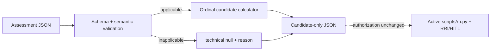

# RRI v2: candidate collector and calculator

## Objective and authorization boundary

Implement `rri-v2-design-0.2` as an isolated, local candidate collector and
calculator. It validates an assessment envelope, preserves uncertainty and
inapplicability semantics, and emits only the ordinal technical summary. It
never replaces, invokes, imports, or changes `scripts/rri.py`, the active RRI
policy, HITL authorization, routing, or model selection.

The owner requested this implementation on 2026-09-07 and explicitly waived a
further task presentation/approval checkpoint in the same session: “el ajuste
ya fue validado asi que puedes trabajarlas sin pedirme autorizacion”. The
coherent outcome remains Moderate (RRI 33); that waiver authorizes only this
frozen candidate scope and does not alter the active RRI/HITL rules.

The owner also directed that no local model implement the work. Codex is the
authoring agent for the approved scope. The required independent review route
remains unchanged; this is not a waiver of phase-2 review or closure evidence.

## Design decisions

- Keep the candidate as a standalone Python standard-library tool:
  `scripts/rri_v2_candidate.py`. It accepts an assessment JSON document and
  writes a derived JSON result; it has no dependency on the active calculator.
- Publish a Draft 2020-12 JSON Schema under `docs/schemas/`. The tool validates
  the schema's declared closed-world contract itself, without making a runtime
  dependency on an unpinned third-party validator. Schema and semantic
  validation are both tested against the same fixtures.
- For applicable assessments, require every `L/I/Q/V` axis and a typed level or
  inclusive integer range. Compute only `bottleneck`, ordinal `ici`, `breadth`,
  and their enclosure bounds. Unknown remains `[0,4]`; no midpoint is created.
- For an inapplicable assessment, dispatch before axis validation and emit
  `technical: null` plus its evidence-backed reason. Invalid version, missing
  axis, malformed status/level/range, non-finite values, and contradictory
  status all fail with a structured validation error and no derived result.
- Always emit `mode: candidate_only`,
  `authorization: governed_by_existing_RRI_and_HITL`, and
  `effort.prediction_status: not_calibrated` with `p50`/`p90: null`. The
  calculator contains neither coefficients nor a prediction path.

## Affected files and dependencies

| File | Responsibility |
|---|---|
| `scripts/rri_v2_candidate.py` | Candidate CLI, collection normalization, schema/semantic validation, ordinal computation |
| `scripts/rri_v2_candidate_test.py` | Unit and CLI evidence for documented scenarios, invalid inputs, uncertainty, and inapplicability |
| `docs/schemas/rri-v2-candidate-assessment.schema.json` | Versioned closed assessment-envelope schema |
| `docs/fixtures/rri-v2-candidate-valid.json` | Applicable, fully assessed contract fixture |
| `docs/fixtures/rri-v2-candidate-unknown.json` | Unknown-axis enclosure fixture |
| `docs/fixtures/rri-v2-candidate-inapplicable.json` | Evidence-backed out-of-rubric fixture |
| `docs/fixtures/rri-v2-candidate-invalid.json` | Invalid-input fixture |
| `docs/audit/rri-v2-candidate-calculator-verification.md` | Commands, results, limits, and review evidence |

## Dependencies and non-goals

T1 establishes the versioned envelope and fixtures. T2 depends on T1 and adds
the separate calculator. T3 verifies the complete behavior, records limits,
and synchronizes status. No task modifies existing RRI files, policies, model
routing, historical ledgers, the roadmap, or proposed formula coefficients.

## RRI and route

The parent outcome scores 33 / Moderate / Effort M; full unmodified calculator
output is in the [task ledger](../tasks/rri-v2-candidate-calculator.md). The
honest Low-band pass finds T1 (schema/fixtures) at 21 / Low, but the calculator
and its integrated validation remain Moderate because they share a validated
wire contract and uncertainty semantics. The parent approval/review envelope
therefore governs all work.

## Status

- T1 — complete: versioned schema and fixtures.
- T2 — complete: isolated candidate collector/calculator.
- T3 — complete: behavioral verification, two Moderate reflection passes,
  phase-2 review, and recorded limitations.

The candidate remains inactive and `not_calibrated`; implementation completion
does not adopt it into the active authorization process.

## Governing references

- [Task ledger](../tasks/rri-v2-candidate-calculator.md)
- [RRI v2 model](../proposals/rri-v2-model.md)
- [RRI v2 formula](../proposals/rri-v2-formula.md)
- [Design validation](../audit/rri-v2-design-validation.md)
- [Workflow guide](../playbooks/AGENT_WORKFLOW_GUIDE.md)
- [HITL policy](../policies/HITL_AUTONOMY_POLICY.md)
