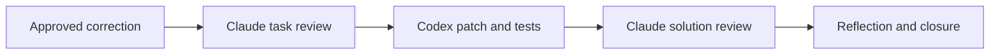
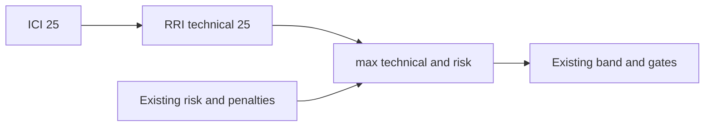

# RRI v2 Low-band correction

Owner approved direct implementation on 2026-09-08. Correct only the
ICI25 -> RRI40 bridge to ICI25 -> RRI25. Preserve mechanical floor 25,
ICI50/75/100 -> RRI55/70/100, max aggregation, path floors and penalties.

Parent: RRI100 / Very high / XL (conservative governance envelope), recorded
in [audit](../audit/rri-v2-low-band-correction.md). No artificial Low split:
the policy decision and code mapping form one invariant. Decompose execution
into T1 decision/risk specification, T2 regression-backed implementation,
T3 independent review and closure; parent review requirements persist.
The user's direct instruction authorizes primary Codex execution of this
specific amendment without another card/approval round.

Affected files: `scripts/rri.py`, `scripts/rri_test.py`,
`docs/policies/RRI_POLICY.md`,
`docs/adr/ADR-045-rri-v2-authority-replacement.md`, this plan,
[task ledger](../tasks/rri-v2-low-band-correction.md), and linked audit.
Review receipts will live under `docs/audit/` with the same task prefix.

Acceptance: local ordinary profiles reach Low; risk above 25 still wins;
anchored auth remains 100; higher technical levels unchanged; exhaustive
monotonicity; CLI JSON and markdown agree. Risk-only sensitive inputs may
also become Low where existing risk arithmetic is <=25: document, do not
invent new floors in this bounded correction. Independently assessed axes
and risk calibration are separate future work.

Verification: regression-first tests, `make qa-rri`, `make qa-docs`,
`git diff --check`; cross-vendor Claude phase-1 and phase-2 reviews,
four Reflection passes, behavioral evidence and primary-owner verification.
No Ollama role is required. Antares: skipped, no task-relevant watchlist CWE.

Status: T1/T2/T3 complete (2026-09-08). Independent reviews PASS;
`make qa-rri`, `make qa-docs`, and `git diff --check` passed.
Behavioral evidence and four Reflection passes are recorded in the task/audit.
