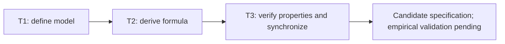

# RRI v2: measurement model and candidate formula

## Objective and authorization

Define an evidence-based implementation-complexity model first, then derive a
candidate formula and a reproducible validation specification. Authorized by the
owner on 2026-09-07: "pues trabaja en el modelo y luego en la formula" following
the RRI evaluation. This is bounded design/documentation work, not adoption of a
new approval policy or implementation of a production calculator.

## Scope and decisions

- Separate technical difficulty, work size, uncertainty, and operational risk.
- Distinguish a reproducible ordinal screening rule from an empirically fitted
  effort predictor. Neither is advertised as a universal complexity measurement.
- Specify evidence provenance, missing-data behavior, measurement time, and
  domain applicability before choosing an aggregation rule.
- Validate mathematical properties and counterexamples now; define prospective
  empirical validation without inventing historical labels or fitted parameters.
- Preserve the active calculator, RRI/HITL policies, model routing, historical
  ledgers, and product roadmap. This cross-cutting research proposal changes no
  product dependency, runtime architecture, or ADR decision.

## Affected files and dependencies

| File | Responsibility |
|---|---|
| `docs/plan/rri-v2-model-and-formula.md` | Scope and integrated status |
| `docs/tasks/rri-v2-model-and-formula.md` | Ordered execution and closure ledger |
| `docs/proposals/rri-v2-model.md` | Measurement contract, rubrics, provenance, validation design |
| `docs/proposals/rri-v2-formula.md` | Ordinal rule, predictive equation, examples, abstention |
| `docs/audit/rri-v2-design-validation.md` | Legacy scoring, reproducible checks, findings, limits |

## Gates and Low-band maximization

The current RRI scores this five-document parent at **33 / Moderate / Effort M**,
including `arch_decision +12`; full output and leaf computations belong in the
audit. T1 and T2 have a real dependency: a formula cannot validate an undefined
construct. Keep their actual design bands; T3 can be a bounded Low leaf. No
splitting of individual dimensions solely to reduce a score. The explicit owner
instruction authorizes this model/formula design scope in the current session.

Primary Codex authors the documentation. Task-analysis review and code-solution
review are `n/a` under the docs/planning-only exemption. No Ollama role is invoked.
Verification consists of mathematical checks, evidence/source review, local link
checks, `git diff --check`, and `make qa-docs`. Synthetic checks certify internal
consistency only. They do not certify prediction accuracy or production readiness.

## Status

- T1: complete — measurement model defined; empirical validation pending.
- T2: complete — ordinal screen and calibrated-effort equation specified.
- T3: complete — exhaustive mathematical checks and `make qa-docs` passed.
- Promotion: not requested; candidate remains inactive.

Design deliverable completed 2026-09-07. Implementation, prospective calibration,
and production adoption are separate future work; the proposal status remains
`Proposed`. Verification record: [design audit](../audit/rri-v2-design-validation.md).

## Governing references

- [Task ledger](../tasks/rri-v2-model-and-formula.md)
- [Workflow guide](../playbooks/AGENT_WORKFLOW_GUIDE.md)
- [RRI policy](../policies/RRI_POLICY.md)
- [HITL policy](../policies/HITL_AUTONOMY_POLICY.md)
- [Original RRI adoption plan](rri-integration.md)
- [Calculator plan](rri-calculator-script.md)

## Follow-up review — 2026-09-07

Owner instruction: "dale una revision para verificar que no haya gaps o
inconsistencias". T4 reviews and corrects the same five documents under the
existing design scope. RRI rerun: 33 / Moderate / Effort M. Primary-agent review;
independent development review remains n/a. Status: complete.

T4 resolved ten specification/documentation findings, recorded in the design
audit. Candidate version is now `rri-v2-design-0.2`; prospective calibration and
production adoption remain pending. Exhaustive arithmetic checks, `make qa-docs`,
and local document/JSON consistency checks passed again.

## Final review — 2026-09-07

Owner instruction: "revision final". T5 checks the existing candidate without
changing the model, formula, or adoption scope. RRI 15 / Low / Effort S using the
T3 verification inputs; original parent envelope remains 33. Status: complete.

No new blocking design inconsistency was found. The model/formula remain unchanged
at version 0.2; mathematical, local document, and `make qa-docs` checks passed.
The T5 audit records proposal fingerprints and the remaining empirical gates.
