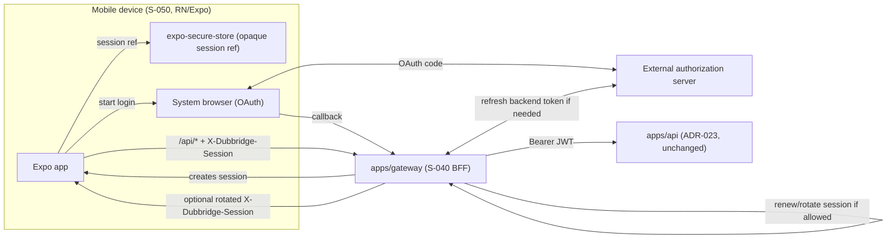

# Plan: S-050 - First-party Mobile Client (React Native + Expo)

**Roadmap phase:** `S-050`. Depends on `S-040-T7`
(mobile-safe session handoff / deep-link return on the session gateway / BFF,
ADR-024) and benefits from `S-070` (production identity hardening / JWKS,
ADR-023) for real device login. It is a first-party client surface, the mobile
twin of the planned web app (`web/`).

> Mobile does not exist in the repository today. This slice introduces it. Per the
> roadmap and ADR-024, a first-party interactive client must terminate in the
> `S-040` session gateway; `S-050` must not invent a parallel auth path that holds long-lived
> tokens on the device.

## Objective

Deliver a first-party **mobile application built with React Native + Expo** that
authenticates through the **S-040 session gateway / BFF** and operates the
DubBridge product surface available at the time (asset listing/detail, ingestion
status; richer media/review screens grow with S-120–S-180). The device **never holds
long-lived access or refresh tokens**; it authenticates via the gateway and carries
only the gateway's opaque session, exactly as the web client does (ADR-024).

## Scope

### Included
- A new `mobile/` Expo (managed workflow) React Native TypeScript app.
- Authentication via the **S-040 gateway after T7**: OAuth login through the device
  system browser (`expo-auth-session` / `expo-web-browser`) against the gateway's
  mobile handoff contract, establishing the gateway session.
- A typed API client that talks to the **gateway** (never directly to `apps/api`
  with a raw token), honoring the transport-agnostic session contract defined in
  S-040 T0. Product operations such as asset list/detail/status use the gateway
  `/api/*` proxy; the mobile app has no separate `apps/api` base URL.
- Secure handling of the device-side session reference: stored in `expo-secure-store`
  (Keychain / Keystore), never in plain `AsyncStorage`; no access/refresh token
  ever persisted on device. If the gateway rotates the opaque session reference,
  mobile replaces the stored value with the rotated reference returned in
  `X-Dubbridge-Session`.
- Core screens for the available product surface: authenticated home, asset list,
  asset detail / ingestion status. Screens degrade gracefully where a backend slice
  (S-120–S-180) is not yet built.
- Navigation, environment configuration (gateway base URL per environment,
  consistent with ADR-026 env separation), and error/empty/loading states.
- Tests: unit tests for the API client and auth/session logic; component tests for
  the core screens (React Native Testing Library); an auth-flow integration test
  against a stubbed gateway. Connectivity targets the real gateway/backend per the
  no-mock-connectivity guidance — only external boundaries (system browser,
  gateway) are stubbed in tests.

### Excluded (deferred)
- The web frontend (`web/`) — separate frontend slice.
- Native live capture / RTMP/SRT streaming from the device — that is S3b
  (ADR-019/020/022) backend work, not this client slice.
- Push notifications, offline sync, and app-store release/CI signing pipelines —
  follow-up mobile hardening backlog once the core client is proven.
- Any change to the `apps/api` trust boundary (ADR-023) or to the gateway contract
  (owned by S-040).

## Hard dependencies
- **S-040-T7 (mobile-safe session handoff / deep-link return)** is complete as of
  2026-06-04. The gateway now exposes the full mobile contract:
  `GET /auth/login?return_uri`, mobile callback handoff code, `POST
  /auth/mobile/session`, `X-Dubbridge-Session` transport on `/api/*`, mobile
  refresh rotation signaling, and header-based logout parity. This previously
  blocked dependency is now satisfied. Session renewal and rotation policy remain
  gateway-owned: mobile only sends the current opaque reference and persists a
  rotated replacement when the gateway returns one.
- **S-070 (production identity hardening)** is strongly recommended before real device
  login at scale (JWKS rotation), though S-050 can develop against the same
  authorization server S-040 uses.
- A product surface to render: S-000+S-010 already provide authenticated identity and
  upload/asset state; S-120–S-180 expand what the mobile UI can show.

## Governing ADRs
- **ADR-024**: first-party clients (incl. mobile) go through the session gateway;
  no long-lived tokens on the client. S-050 is a direct consumer of this decision.
- **ADR-023**: the protected API stays a JWT resource server; S-050 never bypasses it.
- **ADR-026**: environment separation — the gateway base URL is environment-driven,
  never a compiled/hardcoded default.

## Affected Files

### mobile/ (new Expo app)
- `package.json`, `app.json` / `app.config.ts` — Expo app config; env-driven gateway
  base URL via Expo config + `expo-constants`.
- `tsconfig.json`, `babel.config.js` — TypeScript + Expo presets.
- `src/api/client.ts` — typed fetch client targeting the S-040 gateway; attaches the
  session transport; maps errors.
- `src/auth/session.ts` — login/logout via `expo-auth-session`/`expo-web-browser`;
  stores the session reference in `expo-secure-store`.
- `src/auth/AuthProvider.tsx` — auth context/state; gates the navigation tree.
- `src/navigation/` — stack/tab navigation (authed vs. unauthed).
- `src/screens/{Login,Home,AssetList,AssetDetail}.tsx` — core screens.
- `src/config/env.ts` — environment resolution (gateway URL per environment).
- `__tests__/` — unit + component + auth-flow tests.

### docs/
- `docs/adr/ADR-024-...md` — add mobile as a confirmed first-party client of the
  gateway (if not already covered by S-040 T0's mobile seam subsection).
- `docs/architecture.md` — add `mobile/` to first-party client surfaces.
- `docs/plan/roadmap.md` — add slice **S-050** to the supporting-platform table with
  dependency on S-040 (+S-070) and its status.

### web/README.md (reference only)
- Cross-reference that web and mobile share the same gateway trust boundary; no
  code change required.

## Design Decisions

### React Native + Expo, TypeScript
Chosen on 2026-06-03. Coherent with the React line reserved in `web/README.md`;
enables a single frontend skill set and shared client logic between web and mobile.
Expo managed workflow accelerates setup and OTA-friendly delivery; native modules
can be added later if a capability (e.g., capture) demands it.

### Gateway-only auth — no tokens on device
The device authenticates against the **S-040 gateway** and holds only the gateway's
opaque session reference (in `expo-secure-store` / Keychain / Keystore). Access and
refresh tokens never live on the device. This is the mobile application of ADR-024
and the reason S-040 is a hard prerequisite.

### Gateway-owned session renewal
Mobile does not implement token refresh or decide whether a first-party session may
be extended. Every authenticated product request carries the current opaque session
reference to the gateway. The gateway validates the session, renews idle state when
allowed, refreshes backend credentials when needed, and may rotate the opaque
reference. T2 must expose rotated `X-Dubbridge-Session` values to auth/session state;
T3 must persist the replacement in `expo-secure-store`. A `401` from the gateway
means the session is no longer renewable and the app must re-authenticate.

### System-browser OAuth, not embedded webview
Login uses the device system browser (`expo-web-browser` / `expo-auth-session`) for
the OAuth redirect, which is the current security best practice (avoids credential
capture in an embedded webview) and matches the gateway's Authorization Code flow.

### Environment-driven gateway URL
The gateway base URL is resolved per environment via Expo config, never hardcoded —
consistent with the ADR-026 fail-closed environment-separation principle applied to
a client.

### Graceful degradation against an evolving backend
Because S-120–S-180 are not built, screens that would show transcription/dubbing/review
must handle "not available yet" states cleanly rather than assuming endpoints exist.

## Module Dependencies

```text
mobile (Expo RN/TS)
  -> expo-auth-session / expo-web-browser  (OAuth via system browser)
  -> expo-secure-store                     (session reference at rest)
  -> S-040 gateway (/auth/* + /api/* proxy)   (the only backend the device talks to)

device --(opaque session)--> apps/gateway (S-040)
apps/gateway --(optional rotated opaque session)--> device
apps/gateway --(Bearer JWT/internal credential)--> apps/api (ADR-023)
```

The device never opens a direct authenticated channel to `apps/api`; all
authenticated traffic flows through the S-040 gateway. Session renewal/rotation is
also a gateway responsibility; mobile only stores the current opaque reference.

## Architecture Diagram



## Proposed execution order

```text
S-050 T0 (gate) confirm S-040-T7 mobile handoff contract is available + stable
  -> S-050 T1 Expo app scaffold (TS) + env-driven gateway config + navigation shell
  -> S-050 T2 gateway API client (typed) + error/session transport handling
  -> S-050 T3 auth flow (system-browser OAuth via gateway) + secure session storage
  -> S-050-T4 core screens (Login, Home, AssetList, AssetDetail) against the gateway
  -> S-050-T5 tests (unit + component + auth-flow vs. stubbed gateway) + docs/roadmap sync

[after S-050-T4] -> S-055 Maestro screenshot / visual-audit suite (mobile hardening backlog)
                 docs/plan/s-055-maestro-screenshot-suite.md
                 docs/tasks/s-055-maestro-screenshot-suite.md
                 Approved: Option A (ADR-024-clean handoff-code) + S2 (defer until after T4)
                 Task namespace: V1–V8 (distinct from S-050's T0–T5; V4 ≠ T4)
```

## Lines Affected After Implementation

Tracked per task in `docs/tasks/s-050-mobile-client.md`.
