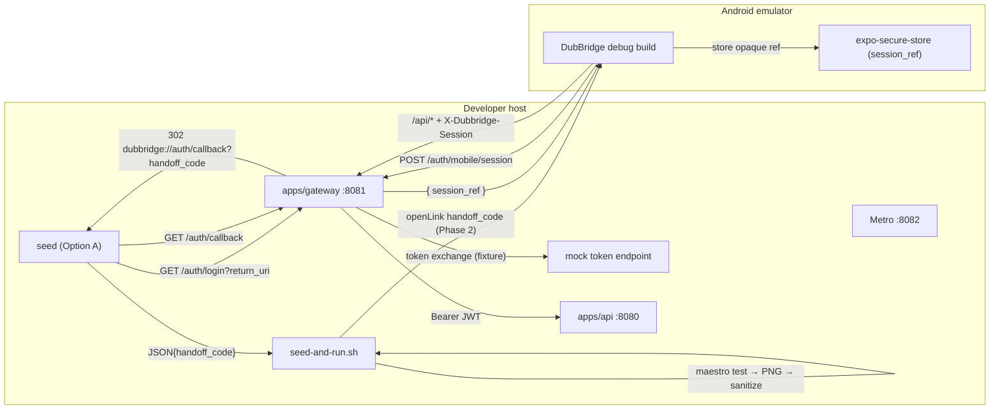

# Plan: S-055 - Maestro Screenshot / Visual-audit Suite (Mobile)

**Roadmap phase:** `S-055`. This is the hardening follow-up to `S-050`
(first-party mobile client, React Native + Expo). It belongs to the mobile
hardening backlog that `S-050` defers
(`docs/plan/s-050-mobile-client.md` → *Excluded (deferred)*).

**Source pattern:** `/Users/matiasleandrokruk/Documents/FenixCRM/docs/maestro-replication-guide.md`
(two-phase Maestro screenshot suite, derived from FenixCRM). This plan **adapts**
that pattern to DubBridge; it does **not** port it verbatim, because FenixCRM's
auth-bypass mechanism is incompatible with ADR-024 (see *Key adaptation* below).

**Governing guides:** `docs/playbooks/AGENT_WORKFLOW_GUIDE.md` (authoritative),
`docs/policies/HITL_AUTONOMY_POLICY.md`, `AGENTS.md`.
**Governing ADRs:** ADR-024 (mobile holds only an opaque session reference — primary
constraint), ADR-026 (environment separation — no hardcoded URLs / fail-closed in
prod), ADR-023 (apps/api remains a JWT resource server).

---

## Objective

Provide a **reproducible, two-phase Maestro suite** that auto-captures
production-quality screenshots of every mobile screen on an Android emulator:

- **Phase 1 — auth surface:** cold-launch capture of the unauthenticated tree
  (login screen). No credentials typed.
- **Phase 2 — authenticated audit:** establish a gateway session **without UI
  login** by redeeming a seeded one-time **handoff code** into an opaque
  `session_ref` (ADR-024-compliant), then navigate to each authenticated screen and
  capture it.

The suite must be runnable with a single command (`npm run screenshots`) and must
keep DubBridge's security invariants intact: **no JWT/refresh token ever reaches the
device or any Maestro artifact.**

---

## Key adaptation — why this is not a verbatim port

| FenixCRM pattern | DubBridge constraint | DubBridge adaptation |
|---|---|---|
| Phase-2 deep link injects a raw **JWT** (`...e2e-bootstrap?token=<JWT>`) into the app auth store | **ADR-024:** the device must never hold a JWT/refresh token; it stores only an opaque `session_ref` | Phase-2 deep link carries a **`handoff_code`** (single-use, 90 s TTL), redeemed via the existing `POST /auth/mobile/session` → `{ session_ref }`. Reuses the real S-040 mobile seam; no new bypass. |
| Custom `/e2e-bootstrap` deep-link handler in the app | DubBridge already returns `dubbridge://auth/callback?handoff_code=...` from the real callback | Reuse the existing callback deep-link shape. Only add a **dev-gated root `Linking` listener** if `openAuthSessionAsync` cannot be driven by Maestro for an externally-opened URL. |
| Go seed: `go run scripts/e2e_seed.go` mints a JWT | DubBridge backend is **Rust**; minting a session requires a `TokenSet` the gateway owns | Seed drives the **real gateway HTTP handoff** (`GET /auth/login?return_uri` → `GET /auth/callback` → extract `handoff_code`) against a **mock token endpoint** fixture. No gateway code change, no JWT emitted. |
| Backend health at `:8080/health`; BFF at `:3000` | Gateway exposes `/health/live` + `/health/ready` on `:8081`; apps/api on `:8080`; there is no `:3000` BFF | Health checks target gateway `:8081/health/ready` and api `:8080`. Drop the `:3000` BFF leg. |
| Metro bundler on `:8081`, `adb reverse tcp:8081` | **Gateway already uses `:8081`** (config/local.toml) — direct collision | Move Metro to a deconflicted port (e.g. `:8082`); `adb reverse` maps gateway `8081`, api `8080`, Metro `8082`. |
| `mobile/android/.../app-debug.apk` assumed to exist | DubBridge mobile is **Expo managed** — there is no `android/` project | Add a prebuild step (`npx expo prebuild` / `expo run:android`) to produce a debug build; decide whether `android/` is committed or regenerated (gitignored). |
| `scheme: yourapp` | `scheme: dubbridge` (app.config.ts) | Use `dubbridge://`. |
| Sanitizer redacts `token=eyJ...` JWTs | Secret in transit is a `handoff_code` / `session_ref`, not a JWT | Sanitizer redacts `handoff_code=...` and any `session_ref` value from Maestro reports. |
| Every screen has a `testID` | Current screens have **no** `testID` | Add `testID="…-screen"` to every captured screen and set a naming convention. |

---

## Central design decision (APPROVED 2026-06-07: Option A)

**How Phase 2 obtains an authenticated session** — three options. **Approved:
Option A** (mock-token-endpoint + real gateway handoff; no gateway code change). The
task list in `docs/tasks/s-055-maestro-screenshot-suite.md` is written for Option A and
notes where B/C diverge.

- **Option A (recommended): mock-token-endpoint + real gateway handoff (no gateway
  code change).** A dev-only seed drives the gateway's real
  `/auth/login?return_uri=dubbridge://auth/callback` → `/auth/callback` flow with
  `token_url` pointed at a local **mock token server** that returns a deterministic
  fixture `TokenSet`. The seed extracts the `handoff_code` from the `Location`
  redirect and emits it as JSON. Pros: reuses the exact production seam; adds **no
  prod-reachable code path** to the S-040-owned gateway; ADR-024-clean (only a
  `handoff_code` ever leaves the gateway). Cons: requires a small mock token server
  fixture; depends on apps/api accepting the fixture access token in local mode (or
  running apps/api with auth disabled locally — to be confirmed in V4a).
- **Option B: dev-only gateway seed endpoint.** Add a `#[cfg(debug)]` /
  env-fail-closed `POST /auth/dev/seed-session` to the gateway that mints a
  `StoredSession` from a fixture `TokenSet` and returns a `handoff_code`. Pros: one
  HTTP call, no mock AS. Cons: **touches the S-040-owned gateway contract** (the S-050
  plan lists gateway changes as out-of-scope) and adds a session-minting path that
  must be proven unreachable in production.
- **Option C: drive real system-browser OAuth in Maestro.** No bypass; Maestro fills
  a mock-AS login form once. Pros: highest fidelity. Cons: the most fragile path —
  exactly what the two-phase pattern exists to avoid.

**Recommendation:** Option A. It is the only option that is simultaneously
ADR-024-clean, leaves the S-040 gateway contract untouched, and keeps Phase 2 stable.

---

## Sequencing decision (APPROVED 2026-06-07: Option S2 — defer until after S-050-T4)

At planning time, Phase 2 needed (a) a working deep-link → `session_ref`
redemption in the app and (b) authenticated screens worth capturing. That
prerequisite is now satisfied: **S-050-T4 and S-050-T5 completed on 2026-06-07**, so the
core screens (`Login`, `Home`, `AssetList`, `AssetDetail`) and the real auth flow
from T3b-ii/iii exist.

**Approved: Option S2 — defer the entire S-055 sub-phase until after S-050-T4 is done.**
That gate is now **satisfied**. The deferral achieved its purpose: S-055 can start
from a stable, complete first pass over the implemented auth flow and core screens
instead of growing around placeholders.

Options considered:
- **Option S-010 (not chosen): land the suite infrastructure now, grow the flows
  later** — build the screen-agnostic parts immediately and extend Phase-2 flows as
  screens land.
- **Option S2 (APPROVED): defer the whole suite until after S-050-T4.**

**Consequence for this plan:** every task below still depends on **S-050-T4 complete**
as a historical prerequisite, and that prerequisite is now met. **S-055 is unblocked
and partially built**; execution now resumes at the Phase-2 bootstrap closure task
documented as `V6b` in `docs/tasks/s-055-maestro-screenshot-suite.md`. Execution still
follows the per-task approval workflow in `docs/playbooks/AGENT_WORKFLOW_GUIDE.md` /
`docs/policies/HITL_AUTONOMY_POLICY.md`.

## Current implementation status (reconciled 2026-06-11)

S-055 is no longer only planned. The repo contains the early suite pieces, but not
the one-command runner or final screenshots command.

Built:
- screen root `testID`s for the currently captured surfaces:
  `login-screen`, `home-screen`, and `config-error-screen`;
- managed-Expo Android build policy and recorded `appId` / APK path;
- screenshot env profile with Metro on `:8082`, gateway on `:8081`, API on `:8080`,
  and `EXPO_PUBLIC_E2E_ENABLED=true`;
- mock OAuth fixture and handoff-code seed CLI under `scripts/e2e-seed/`;
- dev-gated E2E bootstrap in the mobile auth provider;
- Maestro flow files for Phase 1 and Phase 2.

Verified:
- Phase 1 `auth-surface.yaml` reached `login-screen` and captured
  `01_auth_login.png` in the 2026-06-08 local emulator run.

Still missing or blocked:
- Phase 2 `authenticated-audit.yaml` has not captured `02_home.png`; the app stayed
  on `login-screen` after the seeded deep link in the last recorded live run.
- `mobile/maestro/seed-and-run.sh` does not exist yet.
- `mobile/package.json` does not expose `npm run screenshots`.
- From a clean checkout, `mobile/node_modules`, `mobile/android/`, and the debug APK
  may be absent and must be regenerated before live verification.

The next executable task is **V6b — Phase-2 deep-link bootstrap diagnosis +
hardening**. It must prove whether the failure is deep-link delivery, runtime env /
bundle mismatch, gateway redemption, session storage, or navigation state before V7
runner work starts.

---

## Scope

### Included
- `mobile/maestro/` flows: `auth-surface.yaml` (Phase 1) and
  `authenticated-audit.yaml` (Phase 2), with ANR-dialog guards and `testID`-based
  assertions.
- `mobile/maestro/seed-and-run.sh` runner adapted to the DubBridge stack
  (gateway/api/Metro health, deconflicted `adb reverse`, two-phase Maestro,
  screenshot copy, report sanitization, cleanup).
- A deterministic **seed** that mints a one-time `handoff_code` (Option A) and emits
  JSON consumed by the runner; never emits a JWT.
- A **mock token endpoint** fixture (Option A) so the seed can complete the gateway
  handoff without a real IdP.
- `testID`s on all captured screens + a documented naming convention.
- A screenshot-specific environment profile / config (gateway base URL via
  `adb reverse`, Metro on a deconflicted port, `EXPO_PUBLIC_E2E_ENABLED`).
- Android prebuild / debug-build path for the managed Expo app.
- `npm run screenshots` script + a `mobile/maestro/README.md`.
- A dev-gated app-side **E2E deep-link bootstrap** that redeems an inbound
  `handoff_code` into an opaque `session_ref` (only if `openAuthSessionAsync` cannot
  be Maestro-driven; gated behind `__DEV__` / `EXPO_PUBLIC_E2E_ENABLED`).

### Excluded (deferred)
- iOS screenshot capture (Android emulator first).
- CI wiring of the suite (a follow-up once it is stable locally).
- Any change to the **S-040 gateway contract** (unless Option B is chosen) or to the
  apps/api trust boundary (ADR-023).
- Real IdP integration for screenshots (the mock token endpoint is intentional).
- Rich domain-entity seeding (assets/ingestion fixtures) beyond what the available
  screens render — grows with S-050-T4.

---

## Hard dependencies
- **Maestro pattern source** (read-only reference): the FenixCRM guide above.
- **S-040 gateway mobile seam (done):** `GET /auth/login?return_uri`,
  `GET /auth/callback` → `dubbridge://auth/callback?handoff_code=...`,
  `POST /auth/mobile/session` → `{ session_ref }`, `X-Dubbridge-Session` transport
  (`apps/gateway/src/auth/{login,handoff,mobile_session}.rs`).
- **S-050 T2 (done):** typed gateway client (`mobile/src/api/client.ts`) — reused by the
  E2E bootstrap to redeem the handoff code.
- **S-050 T3a (done):** `mobile/src/auth/session.ts` secure-store primitives + JWT guard.
- **S-050-T4 / T5 (done 2026-06-07) — historical gate for the entire S-055
  sub-phase (approved sequencing S2).** The gate is satisfied: T3b-ii (`login()`),
  T3b-iii (navigation wiring), the core screens, and the S-050 verification pass are
  complete. S-055 is no longer blocked on S-050.
- **Local stack:** running emulator + `adb`, gateway (`:8081`), apps/api (`:8080`),
  Redis (session store), Node ≥ 18, Maestro CLI, Android SDK/platform-tools.

---

## Affected files

### New — `mobile/maestro/`
- `mobile/maestro/auth-surface.yaml` — Phase 1 flow (login screen capture).
- `mobile/maestro/authenticated-audit.yaml` — Phase 2 flow (handoff bootstrap +
  authed captures).
- `mobile/maestro/seed-and-run.sh` — runner/orchestrator.
- `mobile/maestro/README.md` — usage, prerequisites, troubleshooting.

### New — seed / fixtures
- `scripts/e2e-seed/` (bash+curl, Option A) **or** an `apps/cli` subcommand —
  mints the `handoff_code`, emits JSON. (Final form decided in V4.)
- A mock token endpoint fixture (small Node or static server) for Option A.

### New — output (gitignored)
- `mobile/artifacts/screenshots/` — captured PNGs.

### Modified — app
- `mobile/app.config.ts` — `EXPO_PUBLIC_E2E_ENABLED` plumbed into `extra`; confirm
  `scheme: "dubbridge"`.
- `mobile/src/screens/{LoginScreen,HomeScreen,ConfigErrorScreen}.tsx` and future
  screens — add `testID`.
- `mobile/package.json` — add `"screenshots"` script; dev-build helper scripts.
- (V5, conditional) `mobile/src/navigation/RootNavigator.tsx` or `App.tsx` — dev-gated
  E2E `Linking` bootstrap; `mobile/src/auth/AuthProvider.tsx` if the bootstrap sets
  session state through the provider.
- `mobile/.gitignore` — ignore `artifacts/screenshots/` and (if regenerated)
  `android/`.

### Modified — config (Option A)
- A screenshot env profile pointing the gateway `token_url` at the mock token
  endpoint, or a documented env override — without weakening non-screenshot configs
  (ADR-026 fail-closed preserved).

### Modified — docs
- `docs/tasks/s-050-mobile-client.md` — cross-link this sub-phase.
- `docs/plan/roadmap.md` — note S-055 under the S-050 row / hardening backlog.
- `docs/architecture.md` — only if a new runtime surface is added (Option B).

---

## Design decisions

### D1 — Opaque-session handoff, never a JWT (ADR-024)
Phase 2 transports a single-use `handoff_code`; the app redeems it into an opaque
`session_ref` via `POST /auth/mobile/session`. No access/refresh token is ever
present on-device or in any Maestro artifact. This is the load-bearing decision that
separates this suite from the FenixCRM source.

### D2 — Reuse the production seam, don't invent a bypass (Option A)
The seed drives the real `/auth/login → /auth/callback` flow; the only fixture is the
token endpoint. This keeps the S-040 gateway contract untouched and guarantees the
screenshot path exercises the same redemption code the real app uses.

### D3 — Port deconfliction
Metro moves off `:8081` (gateway) to `:8082`. `adb reverse` maps: gateway `8081`,
api `8080`, Metro `8082`. The mobile `gatewayBaseUrl` resolves to
`http://localhost:8081` through `adb reverse` (ADR-026: env-driven, not hardcoded).

### D4 — Managed-Expo debug build
Generate a debug build via `expo prebuild` + `gradlew assembleDebug` (or
`expo run:android`). Default: **gitignore** the generated `android/` and regenerate
on demand (keeps the repo a clean managed workflow); revisit if build time forces
committing it. This is the highest-uncertainty (XL) task.

**V2a decision (2026-06-07):** use `npx expo prebuild --platform android` followed
by `cd android && ./gradlew assembleDebug` as the canonical screenshot-build path.
Reason: Maestro needs a reproducible debug APK with a stable output path, and this
split makes the generated native project and the APK build separately inspectable.
`expo run:android` remains a convenience path for local iteration, not the recorded
automation path. The generated `android/` tree stays gitignored and is regenerated
on demand. Recorded Android package / Maestro `appId`:
`com.dubbridge.mobile`. Recorded debug APK path:
`mobile/android/app/build/outputs/apk/debug/app-debug.apk`.

### D5 — Secret hygiene
The runner redacts `handoff_code` and `session_ref` from Maestro reports before
persisting. Although both are opaque and short-lived (90 s code; idle-bounded
session), they still grant access within their window.

### D6 — Dev-gated E2E bootstrap (V5, conditional)
Any app code that auto-redeems an inbound handoff deep link is gated behind
`__DEV__` / `EXPO_PUBLIC_E2E_ENABLED` and must be inert in production builds — the
DubBridge analog of FenixCRM's `__DEV__`-gated handler, but redeeming an opaque
reference rather than injecting a token.

### D7 — Screen root `testID` convention
Every screen captured or asserted by Maestro exposes a stable root `testID` using
the convention `<feature>-screen`. V1 establishes the first set:
`login-screen`, `home-screen`, and `config-error-screen`. Later S-055 tasks and any
new mobile screens captured by Maestro must follow the same pattern so visual flows
assert by `id` rather than brittle text.

---

## Module dependencies

```text
seed-and-run.sh (runner)
  ├─ emulator + adb            (device control, port reversal)
  ├─ gateway :8081             (/health/ready, real /auth/login + /auth/callback)
  ├─ apps/api :8080            (/api/* data for authed screens; local auth mode)
  ├─ mock token endpoint       (Option A: deterministic TokenSet for the handoff)
  ├─ Metro :8082               (JS bundle for the debug build)
  ├─ seed → JSON{ handoff_code, … } → env vars
  └─ maestro test (Phase 1, Phase 2) → PNGs → sanitize → artifacts/

App (Expo RN/TS, debug build)
  ├─ dubbridge://auth/callback?handoff_code=…   (Maestro openLink, Phase 2)
  ├─ POST /auth/mobile/session  → { session_ref }   (T2 client)
  └─ expo-secure-store(session_ref)                 (T3a primitives)   # never a JWT
```

## Architecture diagram



## Proposed execution order

```text
[HARD GATE] S-050-T4 complete (core screens + T3b-ii/iii auth) — nothing below starts first
V1  testIDs + naming convention                                         (RRI ~18)
  -> V2a decide prebuild strategy + android/ commit policy              (RRI ~20)
  -> V2b execute debug build + verify emulator launch          [XL]     (RRI ~49)
  -> V3  screenshot env + port deconfliction                           (RRI ~24)
  -> V4a mock token endpoint + screenshot token_url override            (RRI ~36)
  -> V4b seed orchestration (handoff-code mint) + no-JWT check  [auth]  (RRI ~57)
  -> V5  app-side E2E deep-link bootstrap                      [auth]  (RRI ~59)
  -> V6  Maestro flow files (auth-surface + minimal authenticated-audit)(RRI ~36)
  -> V6b Phase-2 deep-link bootstrap diagnosis + hardening              (RRI TBD)
  -> V7a runner: preconditions + stack bring-up                        (RRI ~38)
  -> V7b runner: seed→env + 2-phase maestro + copy + sanitize          (RRI ~45)
  -> V8  package.json script + README + docs/roadmap sync               (RRI ~18)
```

> **RRI decomposition (2026-06-07).** Applying `docs/policies/RRI_POLICY.md`, three
> originally-monolithic tasks exceeded the split triggers and were decomposed so each
> subtask targets RRI ≤ 55 with explicit acceptance criteria: **V2 → V2a + V2b**
> (isolate the `+12` process decision from the XL native build), **V4 → V4a + V4b**
> (RRI 76 > 70 and `T≥4 ∧ P≥4`; isolate the non-auth mock fixture from the auth
> core), **V7 → V7a + V7b** (isolate the security-relevant report sanitizer from
> stack bring-up). **V4b** and **V5** sit at the irreducible auth floor (~56–59,
> Complex) — further subdivision cannot lower `D`/`P`/auth-penalty, so they remain
> single Complex tasks with mandatory human diff review. Full per-task RRI tables are
> produced at each task's presentation. See the decomposition summary table in
> `docs/tasks/s-055-maestro-screenshot-suite.md`.

## Lines affected after implementation
Tracked per task in `docs/tasks/s-055-maestro-screenshot-suite.md`.
</content>
</invoke>
