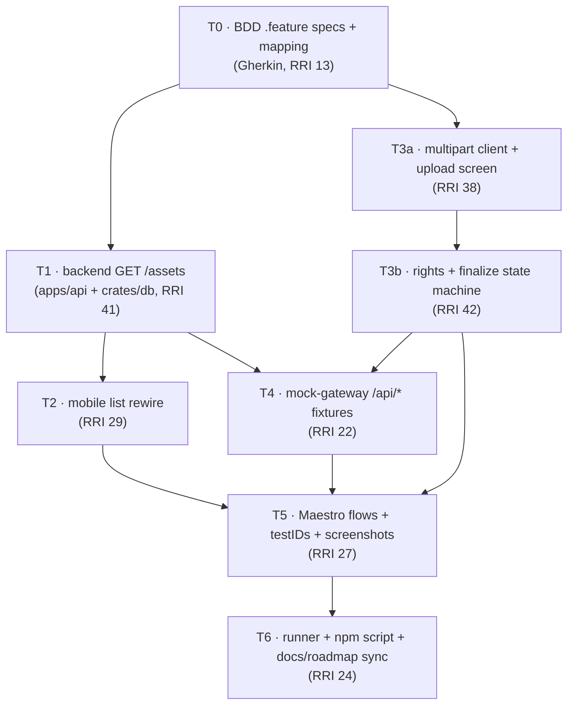

# Plan: S-060 - First-party Mobile Asset Lifecycle (Functional Surface + BDD/Maestro)

> **Status:** Complete. Authored 2026-06-11; implemented and closed 2026-06-12.
> **Roadmap phase:** `S-060` — successor functional phase to `S-050` (mobile client,
> done) and sibling of `S-055` (Maestro screenshot/visual-audit suite, V1–V6 done).
> **Tasks ledger:** `docs/tasks/s-060-mobile-asset-lifecycle.md`.

## Purpose

S-050 delivered the first-party mobile shell (auth, navigation, read-only asset
surfaces). This slice closes the gap between what the mobile app *renders* and what
the backend *actually serves*, and makes the mobile asset lifecycle exercisable
end-to-end under BDD-driven Maestro flows.

Two product-relevant capabilities are missing or broken today:

1. **Asset list is dead against the real backend.** `AssetListScreen` calls
   `GET /api/assets?view=mobile`
   ([AssetListScreen.tsx:58-61](/Users/matias/Documents/projects/dubbridge/mobile/src/screens/AssetListScreen.tsx#L58-L61)),
   which the gateway proxies to `apps/api` `GET /assets`. That endpoint **does not
   exist** — `apps/api` only exposes `GET /assets/{id}`
   ([ingestion.rs:52-61](/Users/matias/Documents/projects/dubbridge/apps/api/src/routes/ingestion.rs#L52-L61)),
   and `crates/db` has no list query
   ([asset_repo.rs](/Users/matias/Documents/projects/dubbridge/crates/db/src/asset_repo.rs)).
   The screen therefore always degrades to its `not_available` (404) branch.

2. **Mobile cannot create assets.** The core S-010 capability — upload → rights → finalize
   — is fully implemented on the backend
   ([ingestion.rs:37-50](/Users/matias/Documents/projects/dubbridge/apps/api/src/routes/ingestion.rs#L37-L50))
   but has no mobile surface. The device is read-only.

This plan adds the missing list endpoint (an S-010 read-surface extension), wires the
mobile list to it, builds the mobile ingestion flow, and proves all of it under
Gherkin BDD specs mapped 1:1 to Maestro flows.

## Objective

Deliver a working, BDD-verified mobile asset lifecycle:

- **See assets**: real list endpoint + mobile list wired to it.
- **Open an asset**: existing detail screen, now reachable from a populated list.
- **Create an asset**: mobile upload → rights → finalize flow against the real S-010
  endpoints, terminating at the asset's detail/list.
- **Prove it**: each flow has a Gherkin `.feature` spec, a Maestro flow, and unit
  evidence, with a deterministic local E2E backend (extended mock-gateway).

## Scope decisions (confirmed 2026-06-11)

| Decision | Choice |
|---|---|
| Feature scope | Full functional surface: list endpoint + mobile list + mobile ingestion flow |
| BDD format | Gherkin `.feature` files (`mobile/bdd/*.feature`) mapped 1:1 to Maestro flows and to each task's `HP-#`/`EC-#` cases |
| Maestro E2E backend | Extend `scripts/e2e-seed/mock-gateway-server.mjs` to serve `/api/*` fixtures (deterministic, no Postgres) |

## Affected components

| Layer | Path | Change |
|---|---|---|
| Backend API | `apps/api/src/routes/ingestion.rs` | New `GET /assets` list route (`assets:read` scope) |
| Backend API | `apps/api/src/dto/ingestion.rs` | List response shape (reuse `AssetSummaryResponse`; add list/page wrapper if needed) |
| Backend DB | `crates/db/src/asset_repo.rs` | New `list_assets` query (ownership-scoped, ordered, paginated) |
| Mobile | `mobile/src/screens/AssetListScreen.tsx` | Wire to real endpoint; retire permanent `not_available` path; add refresh/retry |
| Mobile | `mobile/src/api/client.ts` | Add multipart-capable request method for `POST /ingest` |
| Mobile | `mobile/src/screens/UploadScreen.tsx` (new) | Upload → rights → finalize 3-step flow |
| Mobile | `mobile/src/navigation/RootNavigator.tsx` | Register the upload route + entry point from Home/List |
| E2E backend | `scripts/e2e-seed/mock-gateway-server.mjs` | Serve `GET /api/assets`, `GET /api/assets/{id}`, `POST /api/ingest*` with static seed fixtures |
| BDD | `mobile/bdd/*.feature` (new) | Gherkin specs for list, detail, and ingestion |
| Maestro | `mobile/maestro/*.yaml` (new) | Flows for list, detail, ingestion + screenshots |
| Maestro | `mobile/maestro/seed-and-run.sh`, `mobile/package.json` | Runner integration + `npm run screenshots` |

## Design decisions

### D1 — `GET /assets` ownership scoping (fail-closed default)

The new list endpoint must decide what the caller sees. The asset domain carries
`uploader_id` ([dto/ingestion.rs:46](/Users/matias/Documents/projects/dubbridge/apps/api/src/dto/ingestion.rs#L46)).

**Decision:** the list is **scoped to the authenticated principal** — it returns only
assets whose `uploader_id == principal.subject_id`. This is the fail-closed default
for data visibility (ADR-023, ADR-008 spirit) and avoids leaking other owners' assets
through a broad list. A cross-owner/admin view is explicitly out of scope.

> **Observation (not in scope to fix here):** the existing `GET /assets/{id}` handler
> ([ingestion.rs:275-285](/Users/matias/Documents/projects/dubbridge/apps/api/src/routes/ingestion.rs#L275-L285))
> does **not** enforce ownership — it returns any asset by id to any `assets:read`
> caller. The new list endpoint will be ownership-scoped; reconciling the by-id
> handler's ownership posture is recorded as an open follow-up (X-P3F-1), not changed
> in this slice.

### D2 — Pagination + ordering

The list returns assets ordered by `created_at DESC`, with a bounded page size
(default 50, hard cap to avoid unbounded scans). Cursor/offset is a v1 simple
`limit`/`offset`; a richer cursor scheme is deferred. The mobile list consumes the
first page only in v1 (no infinite scroll); refresh re-fetches page 1.

### D3 — Mobile multipart upload

`apps/api` `POST /ingest` expects `multipart/form-data` with `title` + `file` fields
([ingestion.rs:66-116](/Users/matias/Documents/projects/dubbridge/apps/api/src/routes/ingestion.rs#L66-L116)).
The current mobile client only sends JSON
([client.ts:50-55](/Users/matias/Documents/projects/dubbridge/mobile/src/api/client.ts#L50-L55)).
A new `postMultipart` method builds a `FormData` body (file picked via
`expo-document-picker`), omits the `Content-Type: application/json` header so the
runtime sets the multipart boundary, and carries the `X-Dubbridge-Session` transport
exactly like the JSON path. The gateway proxy already forwards arbitrary bodies and
preserves non-sensitive headers
([proxy.rs:208-230](/Users/matias/Documents/projects/dubbridge/apps/gateway/src/proxy.rs#L208-L230)),
so no gateway change is required.

> **Backend-auth caveat (carried from S-055 V4a):** local `apps/api` requires a
> JWT-verifiable principal; an opaque fixture token is insufficient for real `/api/*`
> calls. The Maestro E2E therefore runs against the **extended mock-gateway** (D4),
> which terminates `/api/*` with deterministic fixtures. Real-stack verification of
> the ingestion flow is an operational task on the live gateway+api+Postgres stack
> and is documented, not automated, in this slice.

### D4 — Mock-gateway `/api/*` fixtures (Maestro E2E backend)

`mock-gateway-server.mjs` originally served only health + `/auth/mobile/session`
([mock-gateway-server.mjs](/Users/matias/Documents/projects/dubbridge/scripts/e2e-seed/mock-gateway-server.mjs)).
It is extended with two static seed assets and these routes, all gated behind a
resolved `X-Dubbridge-Session`:

- `GET /api/assets` → ordered list of the two static seed fixtures.
- `GET /api/assets/{id}` → single asset or 404.
- `POST /api/ingest`, `POST /api/ingest/{token}/rights`, `POST /api/ingest/{token}/finalize`
  → return deterministic happy-path response shapes only; they do not mutate a
  dynamic store.

This is dev/test-only fixture code; it must never ship in a production path
(ADR-026 fail-closed posture is unaffected because it lives under `scripts/e2e-seed/`).

### D5 — BDD ⇄ Maestro ⇄ unit mapping convention

Each Gherkin scenario gets a stable ID and maps to exactly one Maestro assertion path
and one or more `HP-#`/`EC-#` unit cases. The mapping table lives in
`mobile/bdd/README.md` (authored in T0) and is mirrored per task in the ledger.

```text
mobile/bdd/asset-lifecycle.feature
  Scenario: Browse my assets            -> HP (T2) -> mobile/maestro/asset-list.yaml
  Scenario: Empty asset list            -> EC (T2) -> asset-list.yaml (empty assertion)
  Scenario: Open an asset from the list -> HP (T2/detail) -> asset-detail.yaml
  Scenario: Upload a new asset          -> HP (T3) -> asset-ingestion.yaml
  Scenario: Upload rejected (no rights) -> EC (T3) -> asset-ingestion.yaml (error assertion)
```

### D6 — testID convention reuse

New/changed screens follow the S-055 V1 convention (`<feature>-screen`):
`asset-list-screen`, `asset-detail-screen`, `upload-screen`, plus action testIDs
(`upload-pick-file`, `upload-submit-rights`, `upload-finalize`). These IDs are the
contract between the Maestro flows (T5) and the screens (T2/T3).

## Module dependency direction



- **T0** defines acceptance (BDD) before any code — BDD-first.
- **T1** (backend list) is the keystone for the list flow; it unblocks both the mobile
  rewire (T2) and the faithful mock fixtures (T4).
- **T3a → T3b** is the ingestion flow; independent of T1/T2 and can run in parallel.
- **T4** needs both contracts (list from T1, ingest from T3b) to mock faithfully.
- **T5** needs the screens (T2, T3b), the testIDs, and the data backend (T4).
- **T6** integrates the flows into the S-055 runner and syncs status docs.

## Relationship to S-055

S-055 owns the Maestro *infrastructure* (build, env, ports, seed, mock-oauth,
mock-gateway, runner V7/V8). S-060 **consumes and extends** that infrastructure with
data-screen flows. The mock-gateway `/api/*` extension (T4) and the new flows (T5)
build on S-055 V1–V6. T6 coordinates with S-055 V7a/V7b/V8 rather than duplicating the
runner. The `V`-prefix (S-055) and `T`-prefix (S-060) namespaces are kept distinct to
avoid the twin hazard called out in the S-055 ledger.

## Governing documents

- `docs/playbooks/AGENT_WORKFLOW_GUIDE.md` (authoritative workflow)
- `docs/policies/HITL_AUTONOMY_POLICY.md`, `docs/policies/RRI_POLICY.md`
- ADR-024 (session gateway, no token on device), ADR-023 (JWT resource server),
  ADR-008 (rights fail-closed precondition), ADR-026 (env separation)
- `docs/plan/s-050-mobile-client.md`, `docs/plan/s-055-maestro-screenshot-suite.md`
- `docs/plan/s1-asset-ingestion-rights-ledger.md` (the list endpoint extends S-010)

## Open follow-ups

- **X-P3F-1:** reconcile `GET /assets/{id}` ownership posture with the ownership-scoped
  list (D1). Pre-existing; not changed in this slice.
- **X-P3F-2:** real-stack (gateway+api+Postgres) Maestro verification of the ingestion
  flow — operational, documented in T6, not automated here.
