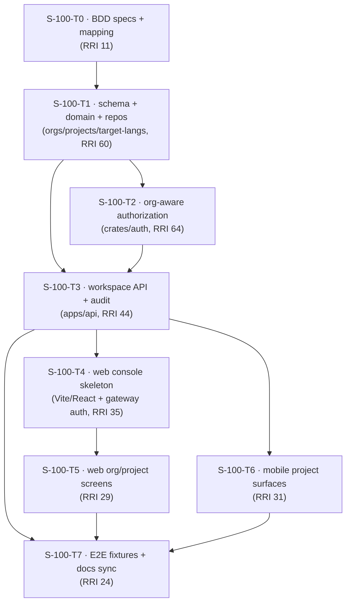

# Plan: S-100 — Collaborative Localization Workspace

> **Status:** Planned (plan exists, not built). Authored 2026-06-11.
> **Roadmap phase:** `S-100` — collaborative product foundation
> before the ML localization phases. Foundation for `S-110` and `S-160`.
> **Tasks ledger:** `docs/tasks/s-100-collaborative-workspace.md`.

## Purpose

S-000/S-010 and the early product phases gave DubBridge a governed ingestion
pipeline, a session gateway (S-040), and a first-party mobile shell (S-050). S-055
also added the early Maestro/testID/mock-gateway screenshot infrastructure, while S-060 has planned but
not yet built the mobile asset lifecycle (`GET /assets`, upload, `/api/*` fixtures).
But the platform is still
**single-principal and flat**: the `AuthenticatedPrincipal` carries only a
`subject_id` and a set of scopes
([principal.rs:6-19](/Users/matias/Documents/projects/dubbridge/crates/auth/src/principal.rs#L6-L19)),
every asset is visible only to its uploader, and there is **no concept of an
organization, a project, a team member, or a target language**. There is also
**no web frontend** — `web/` holds only a README placeholder.

This slice introduces the **collaborative product layer**: organizations with
role-based members, projects that group assets, and target languages as
first-class localization intent — plus the **first web console** and the mobile
surfaces to operate them. It is the foundation the compliance center (S-110) and
review/publication workspace (S-160) build on.

## Objective

Deliver a team-usable workspace, end-to-end and governed:

- **Organizations & roles**: an org owns members (`owner` / `admin` / `reviewer` /
  `viewer`); access to org resources is authorized by membership + role, fail-closed.
- **Projects**: group existing (uploader-owned) assets into projects within an org.
- **Target languages**: declare source + target languages per project — the
  localization intent the pipeline (S-130–S-150) will later consume.
- **Web console**: the first browser surface, authenticating through the S-040
  gateway exactly like mobile (no token in the browser, ADR-024).
- **Mobile**: browse projects and their assets from the device.
- **Prove it**: Gherkin BDD specs mapped to web (Playwright) + mobile (Maestro) +
  backend unit evidence, on a deterministic local backend.

## Scope decisions (confirmed 2026-06-11)

| Decision | Choice |
|---|---|
| Feature scope | Orgs + role-based membership + projects + target languages + web console + mobile project surfaces |
| Tenancy model | Organization is the tenancy boundary; assets stay uploader-owned (ADR-023) and are *linked* into projects, never reassigned |
| Authorization | Keep S-000/ADR-023 scope checks at the Axum boundary; add an org-scope guard (membership + role) on org-scoped routes, fail-closed |
| Web stack | Vite + React in `web/` (the React line reserved in `web/README.md`), gateway-session auth, no token in browser (ADR-024) |
| BDD home | `docs/bdd/*.feature` (cross-surface); mapped 1:1 to web + mobile flows and to each task's `HP-#`/`EC-#` |
| Previous implementation reuse | Reuse S-040 gateway auth/proxy, S-050 mobile `createGatewayClient`/session rotation/error contracts, S-055 testID + mock-gateway conventions, and S-010 asset ownership/finalize invariants |
| S-060 coordination | Do **not** duplicate S-060's planned `GET /assets`, mobile upload, or generic asset fixtures. If S-060 lands first, S-100 consumes its list/upload/mock asset store; if S-100 lands first, S-100 exposes linked asset summaries only through workspace/project endpoints |

## Affected components

| Layer | Path | Change |
|---|---|---|
| BBDD (schema) | `infra/migrations/0010_create_organizations.sql` | `organizations` + `org_members` (role enum), FK-audited |
| BBDD (schema) | `infra/migrations/0011_create_projects.sql` | `projects` (org FK) + `project_assets` (M:N to `assets`) |
| BBDD (schema) | `infra/migrations/0012_create_target_languages.sql` | `target_languages` (project FK, BCP-47 source + targets) |
| Backend domain | `crates/domain/src/workspace.rs` (new) | Org/Project/Membership/Role/TargetLanguage entities + invariants |
| Backend DB | `crates/db/src/workspace_repo.rs` (new) | Repos for orgs, members, projects, links, target languages |
| Backend auth | `crates/auth/src/membership.rs` (new), `crates/auth/src/axum.rs` | Org-aware authorization (resolve role in org; role→action) |
| Backend API | `apps/api/src/routes/workspace.rs`, `apps/api/src/dto/workspace.rs` (new) | Org/project/member/target-language endpoints + audit |
| Frontend (web) | `web/` (new app) | Vite + React console: gateway-session auth, project/org screens |
| Mobile | `mobile/src/api/client.ts`, `mobile/src/api/types.ts`, `mobile/src/navigation/RootNavigator.tsx`, `mobile/src/screens/ProjectListScreen.tsx`, `ProjectDetailScreen.tsx` | Extend existing S-050 gateway client/nav patterns; project detail links to the existing asset detail route |
| E2E backend | `scripts/e2e-seed/mock-gateway-server.mjs` | Preserve existing health/handoff bootstrap routes; add `/api/*` workspace fixtures and share the asset store if S-060 fixtures already exist |
| BDD | `docs/bdd/p4-workspace.feature`, `docs/bdd/README.md` | Cross-surface Gherkin specs + mapping |

## Design decisions

### D1 — Organization is the tenancy boundary; assets stay uploader-owned

A new `organizations` table and an `org_members` join (`org_id`, `subject_id`,
`role`) make the org the unit of collaboration. **Assets are not reassigned** — they
remain owned by their uploader (ADR-023, the S-010 `uploader_id` contract on
[asset.rs:54](/Users/matias/Documents/projects/dubbridge/crates/domain/src/asset.rs#L54)).
Projects *reference* assets through `project_assets`. This keeps the S-010 ownership
invariant intact while letting a team collaborate around shared projects.
S-100's link operation validates asset existence and caller ownership using the S-010/S-060
asset-read posture; it must not create a second general-purpose `GET /assets` list
surface or upload flow.

### D2 — Role-based authorization, fail-closed, layered on ADR-023

Roles are `owner` > `admin` > `reviewer` > `viewer`. The existing scope check at the
Axum boundary ([axum.rs](/Users/matias/Documents/projects/dubbridge/crates/auth/src/axum.rs))
is **kept** (a caller still needs the right OAuth scope); on top of it, org-scoped
routes resolve the caller's **membership and role** in the target org and reject any
caller who is not a member or whose role is insufficient. No membership → no access
(fail-closed, the same posture as the rights gate, ADR-008). Every governance event
(member added/removed, role changed, project created) writes a durable audit row
(ADR-018).

> **Open follow-up (X-S-100-1):** the org/membership authorization model is a real
> architecture decision and should get its own ADR before S-110/S-160 widen the surface.
> Recorded as a follow-up; no ADR number is claimed here.

### D3 — Target languages as first-class localization intent

`target_languages` records, per project, a source language and one or more target
languages (BCP-47 codes). This is the **input contract for the ML pipeline**: S-130
(ASR) keys off the source, S-140/S-150 (subtitles, translation, dubbing) produce one
output per target. Declaring it here, ahead of those producers, gives the pipeline a
stable intent record and gives the product a place to express "localize this into
es-ES, fr-FR, pt-BR".

### D4 — First web console through the S-040 gateway (ADR-024)

`web/` becomes a Vite + React app. It authenticates **through the S-040 session
gateway** exactly like mobile: the browser holds a gateway session (cookie
transport), never a JWT or refresh token (ADR-024). It calls the same `/api/*`
proxy. This reuses S-040 entirely; no new auth path is introduced. The web API client
should mirror the S-050 mobile client's result/error vocabulary where practical, but
with cookie transport instead of `X-Dubbridge-Session`.

### D5 — Deterministic E2E backend (extend the mock-gateway)

`mock-gateway-server.mjs` already serves the S-055 health + handoff bootstrap routes.
S-100 extends that same server with in-memory orgs/projects/members so the web and
mobile workspace flows are exercisable without Postgres. If S-060's `/api/*` asset
fixtures are present by then, S-100 reuses the same asset store for linked project
assets; if not, S-100 seeds only the minimal linked-asset summaries needed by project
fixtures and leaves generic asset lifecycle routes to S-060. Dev/test-only, lives
under `scripts/e2e-seed/`.

### D6 — Cross-surface BDD ⇄ web ⇄ mobile ⇄ unit mapping

Each Gherkin scenario in `docs/bdd/p4-workspace.feature` gets a stable ID and maps to
one web (Playwright) assertion path, optionally one Maestro flow, and ≥1 `HP-#`/`EC-#`
unit case. The mapping table lives in `docs/bdd/README.md` and is mirrored per task.
The surface contracts follow S-055 `testID` convention so S-100 flows can be folded into
the same mobile screenshot/visual-audit runner once S-055 V7/V8 land.

### D7 — Reuse contract for delivered and planned prior slices

S-100 is not a fresh product shell. Each implementation task must first check the
current state of the prior slice it touches and reuse it:

- **S-040:** all browser/mobile calls continue through the session gateway `/api/*`
  proxy; S-100 introduces no direct first-party client channel to `apps/api`.
- **S-050:** mobile screens extend `RootNavigator`, `createGatewayClient`, `GatewayResult`,
  session rotation, `session_expired` logout, and existing asset detail navigation.
- **S-055:** testIDs, mock-gateway process shape, and Maestro environment conventions
  are the E2E baseline.
- **S-060:** generic asset listing, upload, and asset lifecycle fixtures remain owned
  by S-060. S-100 may consume them when built, but project/workspace endpoints should
  return the linked asset summaries they need instead of reimplementing the asset
  lifecycle.
- **S-010/S-020:** asset ownership, finalize atomicity, durable audit, and fail-closed
  status decoding remain intact.

## Module dependency direction

- **T0** fixes acceptance (BDD-first).
- **T1** is the data + domain keystone; everything reads from it.
- **T2** (org-aware authz) gates every org route; **T3** mounts the API on top of T1+T2.
- **T4** stands up the first web app; **T5** builds its screens; **T6** adds mobile.
- **T7** wires the deterministic E2E backend + flows and syncs status docs.

## Relationship to other slices

- **Depends on (built):** S-000 (auth), S-010 (assets + `uploader_id`), S-040
  (gateway session for web + mobile), S-050 (mobile shell).
- **Coordinates with:** S-055 (partial screenshot/mock infrastructure) and S-060
  (planned asset lifecycle). S-100 must re-check both at task-presentation time and
  reuse what has landed, without copying unfinished S-060 responsibilities into S-100.
- **Unblocks:** S-110 (compliance needs org context + web console) and S-160 (review
  needs org/role + web console).
- **Forward integration:** target languages (D3) become the input contract consumed
  by S-130–S-150 when those pipeline stages are built.

## Governing documents

- `docs/playbooks/AGENT_WORKFLOW_GUIDE.md` (authoritative workflow)
- `docs/policies/HITL_AUTONOMY_POLICY.md`, `docs/policies/RRI_POLICY.md`
- ADR-023 (API auth + principal), ADR-024 (session gateway, no token on client),
  ADR-008 (fail-closed precondition, applied to authorization), ADR-018 (durable
  audit + tracing), ADR-006 (Postgres metadata)
- `docs/plan/s-040-session-gateway-bff.md`, `docs/plan/s-050-mobile-client.md`,
  `docs/plan/s-055-maestro-screenshot-suite.md`,
  `docs/plan/s-060-mobile-asset-lifecycle.md`

## Open follow-ups

- **X-S-100-1:** author an ADR for the organization / membership / role authorization
  model (the tenancy boundary on top of ADR-023). Not claimed as a number here.
- **X-S-100-2:** real-stack (gateway + api + Postgres) verification of the web console
  login + project flows — operational, documented in T7, not automated here.
- **X-S-100-3:** decide whether target languages live per-project (this slice) or also
  per-asset-in-project; defaulted to per-project for v1.
- **X-S-100-4:** at implementation time, reconcile with the then-current S-060 state:
  reuse `GET /assets`, upload, and mock asset fixtures if delivered; otherwise leave
  those responsibilities in S-060 and keep S-100 project endpoints self-contained.
