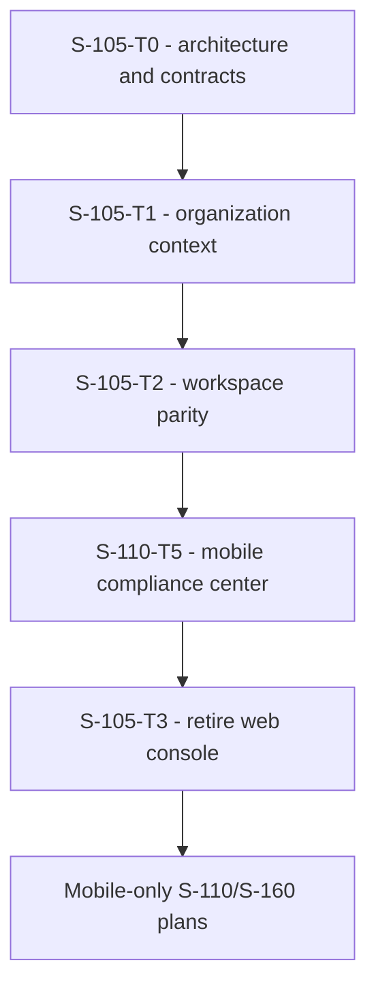

# Plan: S-105 - Mobile Workspace Parity and Web Console Retirement

> **Status:** Complete. Approved and delivered 2026-06-13.
> **Roadmap phase:** `S-105`, after `S-100` and before client surfaces in `S-110`
> and `S-160`.
> **Tasks ledger:** `docs/tasks/s-105-mobile-workspace-parity.md`.

## Purpose

DubBridge currently maintains two first-party authenticated clients, but the web
console is only a shell with unmounted workspace components. The mobile app already
owns the operational asset lifecycle and project navigation. S-105 consolidates the
authenticated product into mobile, closes the remaining workspace parity gaps, and
then removes the unused web console and its duplicate test/tooling surface.

Public web/player experiences are not part of this retirement. A future public web
surface must be planned independently and must not inherit authenticated-console
code by default.

## Objective

- Resolve organization context in mobile through list/create/select flows.
- Make existing mobile project routes reachable with a valid organization ID.
- Add mobile organization membership management with role-gated mutation controls.
- Show project target languages in mobile project detail.
- Move the complete S-110 compliance/consent experience to mobile.
- Retire `web/` only after mobile unit tests, typecheck, and relevant Maestro flows pass.
- Replan S-160 as a mobile-only authenticated review/publication experience.

## Design decisions

### D1 - Mobile is the canonical authenticated interface

`mobile/` is the only first-party authenticated product client after S-105. It keeps
the existing opaque session-reference transport through the session gateway. Backend
authorization remains authoritative; hiding a control in mobile is never treated as
an authorization boundary. This product-surface decision is formalized by ADR-029;
ADR-024 continues to govern the gateway/session contract.

### D2 - Organization selection precedes workspace navigation

Home opens an organization list. Selecting an organization provides the `orgId` used
by project and member routes. Creating an organization selects it through the same
navigation path. No organization identifier is invented or hard-coded by the client.

### D3 - Parity is behavioral, not a component port

Mobile reimplements the useful behaviors from the dormant web components using the
existing React Native screen, gateway-client, session-rotation, loading, empty, error,
and retry patterns. Web components are not mechanically translated.

### D4 - Retirement is gated by evidence

The authenticated web console is deleted only after organization, project, member,
target-language, and compliance mobile tests pass. Backend tests retain ownership and
authorization evidence. Maestro becomes the UI E2E contract for authenticated product
flows.

## Dependency flow

## Affected boundaries

- Mobile navigation and screens under `mobile/src/`.
- Mobile component tests and Maestro flows.
- Existing workspace and compliance APIs; no schema changes.
- Removal of the authenticated `web/` Vite/React application.
- Architecture, roadmap, BDD mappings, and S-110/S-160 task ledgers.

## Verification

- `cd mobile && npm test -- --runInBand`
- `cd mobile && npm run typecheck`
- Relevant Maestro workspace/compliance flows on the configured emulator.
- Backend ownership/authorization tests remain green.
- `make qa-docs`

The automated mobile, typecheck, backend workspace, mock-gateway, YAML, and shell
checks passed. A live Maestro emulator run remains environment-dependent; the
flows and runner integration are present and syntax-validated.
