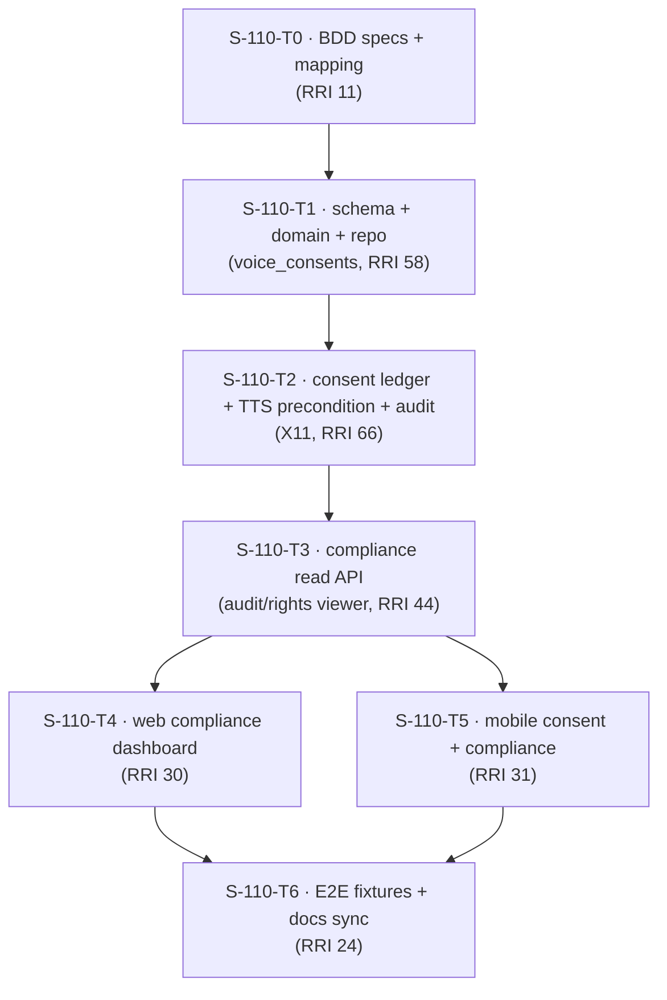

# Plan: S-110 — Compliance & Consent Center

> **Status:** Planned (plan exists, not built). Authored 2026-06-11.
> **Roadmap phase:** `S-110` — governance/product phase before
> `S-150`. Surfaces the immutable audit trail and rights ledger to content owners,
> and adds the voice-cloning consent ledger that gates TTS derivatives
> (cross-cutting obligation X11).
> **Tasks ledger:** `docs/tasks/s-110-compliance-consent-center.md`.

## Purpose

Traceability and authorization are structural in DubBridge: every governance event is
logged and every artifact has a traceable origin (`README.md`). S-010 already persists
this — `audit_events`
([migration 0004](/Users/matias/Documents/projects/dubbridge/infra/migrations/0004_create_audit_events.sql))
and `rights_records`
([migration 0002](/Users/matias/Documents/projects/dubbridge/infra/migrations/0002_create_rights_records.sql)).
But none of it is **visible to the people who need it** (owners, compliance teams),
and a known obligation is unmet: **X11 — enforce consent and voice-cloning permissions
before TTS derivatives**, which currently has no home.

This slice builds the **compliance & consent product layer**: a read-only audit/rights
viewer scoped to the owner/org, and an append-only **voice-consent ledger** with a
fail-closed precondition that S-150 (TTS/dubbing) will enforce. It turns DubBridge's governance
into a visible, sellable trust feature.

## Objective

Deliver a governed compliance and consent surface:

- **Audit timeline**: an owner/org-scoped, read-only view of `audit_events` per asset.
- **Rights ledger viewer**: surface the existing append-only `rights_records`.
- **Voice-consent ledger**: append-only grants/revocations for voice cloning/synthesis,
  with evidence stored by reference and redacted (ADR-025 spirit).
- **Consent precondition (X11)**: a fail-closed gate that blocks any TTS/voice-cloning
  derivative without a valid, unrevoked consent — defined and unit-proven now, enforced
  when S-150 is built.
- **Surfaces**: a web compliance dashboard and mobile consent capture/summary.
- **Prove it**: Gherkin BDD mapped to web + mobile + backend unit evidence.

## Scope decisions (confirmed 2026-06-11)

| Decision | Choice |
|---|---|
| Feature scope | Read-only audit/rights viewer + append-only voice-consent ledger + fail-closed TTS precondition + web dashboard + mobile consent |
| Audit/rights posture | **Read-only.** S-110 never mutates `audit_events` or `rights_records`; it only reads them, ownership/org-scoped |
| Consent posture | `voice_consents` is append-only (grant/revoke rows); current status is derived from the latest row (mirrors rights ledger, ADR-008) |
| Enforcement | The consent precondition (X11) is built and unit-tested here as a reusable gate; S-150 calls it when TTS lands (forward dependency) |
| BDD home | `docs/bdd/p6-compliance.feature`; mapped to web + mobile flows + `HP-#`/`EC-#` |

## Affected components

| Layer | Path | Change |
|---|---|---|
| BBDD (schema) | `infra/migrations/0017_create_voice_consents.sql` | `voice_consents` (append-only grant/revoke, scope, evidence ref) |
| Backend domain | `crates/domain/src/consent.rs` (new) | Consent entity + status derivation + scope model |
| Backend DB | `crates/db/src/consent_repo.rs` (new) | Append-only consent repo + latest-status query |
| Backend service | `apps/api/src/services/consent_gate.rs` (new) | Fail-closed TTS-derivative precondition (X11) + audit |
| Backend API | `apps/api/src/routes/compliance.rs`, `dto/compliance.rs` (new) | Ownership-scoped audit/rights read + consent grant/revoke |
| Backend DB (read) | `crates/db/src/audit_repo.rs`, `rights_repo.rs` | Add ownership/org-scoped read queries (no mutation) |
| Frontend (web) | `web/src/screens/Compliance*.tsx`, `ConsentScreen.tsx`, `components/AuditTimeline.tsx` | Compliance dashboard |
| Mobile | `mobile/src/screens/ConsentScreen.tsx`, `ComplianceScreen.tsx`, nav | Consent capture + compliance summary |
| E2E backend | `scripts/e2e-seed/mock-gateway-server.mjs` | `/api/*` compliance/consent fixtures |
| BDD | `docs/bdd/p6-compliance.feature`, `docs/bdd/README.md` | Cross-surface Gherkin specs + mapping |

## Design decisions

### D1 — Voice-consent ledger is append-only

`voice_consents` records consent to synthesize or clone a given voice/speaker within a
scope (asset and/or org), with `granted_by`, an evidence **reference** (not the
evidence bytes), and a `status` expressed through append-only rows (grant, then
optionally revoke). Current consent status is the **latest row**, mirroring the
rights-ledger and review-decision posture (ADR-008). Evidence is stored by reference
and redacted in logs (ADR-025, ADR-018).

### D2 — Consent precondition is fail-closed (X11), built ahead of S-150

`consent_gate.rs` owns the rule: **no TTS / voice-cloning derivative may proceed
without a valid, unrevoked consent for the target voice/scope.** This is the intake-
edge twin of the rights gate (ADR-008) for the synthesis stage. S-150 (TTS/dubbing) is not built;
S-110 implements and unit-proves the gate now so S-150 calls it directly when it lands —
closing X11 at the contract level without waiting for the ML worker.

> **Open follow-up (X-S-110-1):** author an ADR for the voice-consent ledger + TTS
> precondition (the X11 decision). Recorded; no number claimed here.

### D3 — Audit/rights viewer is strictly read-only and ownership-scoped

The compliance read API serves `audit_events` and `rights_records` filtered to the
caller's owned assets / org. It **never writes** governance rows — it is a window onto
the existing immutable ledgers. Ownership scoping is the same fail-closed default S-060
(D1) applies to the asset list: a caller sees only their own governance trail.

> **Observation:** this read surface inherits the open `GET /assets/{id}` ownership
> question (S-060 follow-up X-S-060-1). The compliance reads are ownership-scoped from
> the start; the by-id reconciliation remains that slice's follow-up, not changed here.

### D4 — Web compliance dashboard + mobile consent + BDD mapping

The web dashboard shows an audit timeline per asset, the rights ledger, and consent
management (grant/revoke). Mobile provides consent capture (grant/revoke from the
device) and a compliance summary. `data-testid`/`testID` are the flow contract.

## Module dependency direction

- **T0** fixes acceptance. **T1** lays the consent schema + domain.
- **T2** owns the governance core (append-only consent + fail-closed TTS precondition, X11).
- **T3** adds the read-only audit/rights/consent API; **T4/T5** build web + mobile.
- **T6** wires E2E fixtures + syncs docs.

## Relationship to other slices

- **Depends on (built/planned):** S-000, S-010 (`audit_events`, `rights_records`
  already persisted), S-040, S-050, and **S-100** (org context + web console skeleton).
- **Closes obligation:** X11 (consent/voice-cloning permission before TTS) at the
  contract level.
- **Forward integration:** S-150 (TTS/voice synthesis) calls `consent_gate` before any
  derivative; S-180 publication may surface the compliance view.
- **Ordering with S-160:** independent at build time, but S-110 must exist before
  S-150 TTS/dubbing can run fail-closed.

## Governing documents

- `docs/playbooks/AGENT_WORKFLOW_GUIDE.md` (authoritative workflow)
- `docs/policies/HITL_AUTONOMY_POLICY.md`, `docs/policies/RRI_POLICY.md`
- ADR-008 (fail-closed precondition — applied to the consent gate), ADR-018 (durable
  audit + redaction), ADR-025 (owner-credential/evidence stored by reference +
  redacted), ADR-023 (API auth), ADR-024 (gateway transport), ADR-006 (Postgres metadata)
- `docs/plan/s-100-collaborative-workspace.md` (S-100 hard predecessor),
  `docs/plan/s1-asset-ingestion-rights-ledger.md` (the ledgers this reads)

## Open follow-ups

- **X-S-110-1:** author an ADR for the voice-consent ledger + TTS precondition (X11).
- **X-S-110-2:** evidence-store mechanism for consent proof (stored by reference) ties to
  the owner-credential secret-store decision (roadmap X20); align when that is decided.
- **X-S-110-3:** real-stack verification of the compliance reads against live
  `audit_events`/`rights_records` — operational, documented in T6, not automated here.
