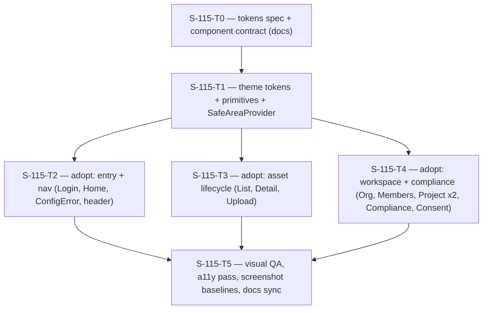

# Plan: S-115 — Mobile UX Foundation & Design-System Adoption

> **Status:** Proposed. Awaiting approval (2026-06-13).
> **Roadmap phase:** `S-115`, cross-cutting mobile UI/UX layer after `S-110`
> (mobile is the canonical authenticated client, ADR-029) and before/parallel to
> `S-120`. Non-blocking for the media pipeline; it hardens the product surface that
> `S-160` and later mobile work inherit.
> **Tasks ledger:** `docs/tasks/s-115-mobile-ux-foundation.md`.

## Purpose

The mobile app (`mobile/`) is functionally complete and well-engineered at the
data/state layer (typed view states, session rotation, retry/refresh, ownership
errors). Its **visual and interaction layer is not yet professional**: there is no
shared design system, the palette is incoherent across screens, copy reads like an
engineering harness, touch targets are small, safe-area insets are faked with magic
margins, and loading/error states are inconsistent.

S-115 introduces a small, tasteful design system (tokens + a handful of primitives)
and migrates every existing screen onto it **without changing behavior or test IDs**,
so the product looks and feels professional with minimal user friction and better
engagement, while staying restrained — not overloaded.

This slice does **not** add features, change navigation graph, or touch the gateway
contract. It is a presentation-and-interaction refactor gated by evidence.

## Evidence: current-state findings (audited 2026-06-13)

| # | Finding | Evidence |
|---|---|---|
| F1 | No shared design system — every screen redeclares its own `StyleSheet` with hardcoded hex | `grep -r "theme\|tokens" mobile/src` → 0 matches; 13 inline `StyleSheet.create` blocks |
| F2 | Incoherent palette: a teal/green family and an unrelated warm-tan family coexist | green: `HomeScreen` `#15715f`, `AssetListScreen` `#1a5d50`, `ComplianceScreen` `#1a6a58`; tan: `LoginScreen`/`AssetDetailScreen`/`ConfigErrorScreen` `#855f19`/`#f4efe5` |
| F3 | Even the "green" accent is inconsistent: `#15715f` vs `#1a5d50` vs `#1a6a58` | Home vs AssetList vs Compliance |
| F4 | No safe-area handling; status-bar gap faked with `marginTop: 24/48` | `grep -r "SafeArea" mobile/src` → 0 matches; `react-native-safe-area-context` is a dep but unused |
| F5 | Primary actions are small, left-aligned chips (`alignSelf: 'flex-start'`) below comfortable touch size | `HomeScreen`, `UploadScreen`, `AssetDetailScreen`, `OrganizationListScreen` button styles |
| F6 | Engineering-shell copy hurts engagement; Home renders the raw gateway URL as a primary panel | `HomeScreen` "Authenticated shell" + `metaValue` gateway URL; `LoginScreen` "Session gateway shell"; `AssetDetailScreen` "reads the current S1 asset summary through the session gateway" |
| F7 | Inconsistent state rendering: rich panels in some screens, bare `<Text>Loading...</Text>` in others | `ComplianceScreen:117`, `ConsentScreen:87` unstyled vs `AssetListScreen`/`ProjectListScreen` panels |
| F8 | No typographic/spacing scale; title sizes differ per screen (34/40/32/28) | Home 34, Login 40, AssetList/Upload/Org/Project 32, ConfigError 28 |
| F9 | Status shown as plain text ("Active"/"Inactive") with no badge/semantic color; tappable cards lack pressed feedback | `ComplianceScreen`/`ConsentScreen` status; `Pressable`s lack pressed/ripple styles |
| F10 | Accessibility is partial: some inputs have `accessibilityLabel`, most controls/roles do not | present in `ConsentScreen`/`OrganizationListScreen`, absent elsewhere |

## Objective

- Introduce `mobile/src/theme` design tokens (color, spacing, radius, typography,
  elevation) as the single source of visual truth.
- Introduce a minimal primitive set: `Screen`, `ScreenHeader`, `Button`, `Card`,
  `Panel`, `Badge`, `StateView`.
- Wire `SafeAreaProvider` at the root and consume insets through `Screen`.
- Migrate all 13 screens and the navigation header theme onto tokens + primitives,
  preserving every `testID` and all behavior.
- Replace engineering-shell copy with concise, user-facing product copy; demote raw
  diagnostics (gateway URL/env) out of the primary surface.
- Refresh Maestro screenshot baselines and run an accessibility pass.

## Design decisions

### D1 — One restrained brand palette ("ink + teal")
Consolidate on a single palette: a neutral ink text scale, one teal primary accent,
white/near-white surfaces, and four semantic colors (success / warning / danger /
info). Rationale: 9 of 13 screens already lean teal/green; the warm-tan screens are
the outliers. One accent + generous whitespace reads professional and tasteful
without being overloaded. The warm-tan family is retired.

### D2 — Tokens, never inline hex
All color, spacing, radius, and type come from `theme/tokens.ts`. Screens import
tokens/primitives; no raw hex or magic numbers remain in screen files after migration.

### D3 — Behavior- and testID-preserving migration
Primitives replace per-screen `StyleSheet`s, but **every `testID` and the existing
view-state logic are preserved verbatim**. This keeps S-060/S-105/S-110 Jest and the
Maestro suite green and makes the migration low-risk and reviewable screen-by-screen.

### D4 — Safe-area correctness
`SafeAreaProvider` wraps the app; the `Screen` primitive applies top/bottom insets.
All faked `marginTop: 24/48` status-bar spacers are removed.

### D5 — Product voice
Replace "Authenticated shell", "Session gateway shell", and similar developer copy
with concise user-facing strings. The raw gateway URL/env panel on Home moves to a
secondary/diagnostic affordance (dev-visible), not the hero surface.

### D6 — Minimal-friction interaction
Primary actions use comfortable, full-width-where-appropriate buttons with a ≥44pt
target, consistent pressed and disabled states, and one elevation level. Status uses
semantic `Badge`s instead of plain text.

### D7 — Restraint (not overloaded)
No new heavy UI-kit or icon-font dependency. The system stays RN-native: tokens + a
few primitives, one accent, one shadow level, one radius scale. Taste through
consistency and whitespace, not ornamentation.

## Affected files / boundaries

- New: `mobile/src/theme/tokens.ts`, `mobile/src/theme/index.ts`,
  `mobile/src/components/{Screen,ScreenHeader,Button,Card,Panel,Badge,StateView}.tsx`.
- Modified: `mobile/App.tsx` (SafeAreaProvider + StatusBar), all 13 screens under
  `mobile/src/screens/`, navigation header theme in
  `mobile/src/navigation/RootNavigator.tsx`.
- Tests: new component unit/RTL tests under `mobile/__tests__/`; existing screen tests
  and Maestro flows preserved (testIDs unchanged); screenshot baselines refreshed.
- Docs: roadmap S-115 row, architecture note for the mobile design-system module.
- **Out of scope:** gateway/API contract, navigation graph, new screens/features,
  backend, schema.

## Module dependency flow

## Verification

- `cd mobile && npm test -- --runInBand` (component + screen tests green)
- `cd mobile && npm run typecheck`
- Maestro flows syntax-valid and testIDs intact; refreshed screenshot baselines
  reviewed against the new palette.
- Accessibility: touch targets ≥44pt, semantic roles/labels on interactive controls,
  text contrast ≥ WCAG AA for body text.
- `make qa-docs`

A live Maestro emulator run remains environment-dependent; runner integration and
flow syntax are validated regardless.

## Design tokens (locked by S-115-T0)

Single source of visual truth in `mobile/src/theme/tokens.ts`, re-exported from
`mobile/src/theme/index.ts`. One restrained palette ("ink + teal"); the warm-tan
family is retired (D1).

**Color**

| Group | Token | Value | Use |
|---|---|---|---|
| Ink (text) | `ink900` | `#0F1B22` | display/title |
| | `ink700` | `#243640` | headings, strong body |
| | `ink500` | `#4A5A63` | body copy |
| | `ink400` | `#647079` | muted / meta |
| | `ink300` | `#8A949B` | placeholder / disabled text |
| Surface | `canvas` | `#F4F7F6` | screen background |
| | `raised` | `#FFFFFF` | cards / panels |
| | `sunken` | `#EAF0EE` | subtle fills / unselected toggle |
| Border | `border` | `#D8E0DD` | default hairline |
| | `borderStrong` | `#C2CDC8` | input / emphasized edge |
| Primary | `primary` | `#127C68` | the single accent |
| | `primaryPressed` | `#0E6353` | pressed state |
| | `primarySubtle` | `#E2EFEB` | tinted bg / selected toggle |
| | `onPrimary` | `#F7FBF9` | text on primary |
| Semantic | `success` / `successSubtle` | `#1A7F5A` / `#E3F2EA` | active/granted |
| | `warning` / `warningSubtle` | `#9A6B12` / `#F6ECD6` | caution |
| | `danger` / `dangerSubtle` / `dangerPressed` | `#B3261E` / `#F7E4E2` / `#8F1E18` | destructive / errors |
| | `info` / `infoSubtle` | `#1D5E84` / `#E1ECF3` | neutral-informational |

**Space** `xs:4 · sm:8 · md:12 · lg:16 · xl:20 · xxl:24 · xxxl:32`
**Radius** `sm:6 · md:8 · lg:12 · pill:999`
**Elevation** one soft level (`shadowOpacity 0.06`, `shadowRadius 12`, offset `0,4`,
Android `elevation 2`). Tappable `Card`s use it; static `Panel`s use border only.

**Typography** (`size / weight / lineHeight`, `+` = uppercase label with `letterSpacing 0.5`)

| Token | Spec | Use |
|---|---|---|
| `display` | 32 / 700 / 38 | screen titles (unifies prior 32–40) |
| `title` | 24 / 700 / 30 | large item title (asset title) |
| `heading` | 19 / 700 / 25 | panel/section titles |
| `body` | 16 / 400 / 24 | copy |
| `bodyStrong` | 16 / 600 / 24 | emphasized body |
| `button` | 16 / 600 / 20 | button labels |
| `meta` | 13 / 400 / 18 | ids, timestamps, secondary meta |
| `label+` | 12 / 700 / 16 | kicker/eyebrow/field label |

## Primitive contracts (locked by S-115-T0)

All primitives live in `mobile/src/components/` and consume only tokens.

| Primitive | Props (shape) | Behavior / variants |
|---|---|---|
| `Screen` | `{ children; scroll?; refreshControl?; contentContainerStyle?; edges?; testID? }` | Safe-area wrapper (top+bottom insets) on `canvas` with `xxl` horizontal padding; `ScrollView` when `scroll`, else `View`. No `marginTop` hacks. |
| `ScreenHeader` | `{ kicker?; title; copy? }` | `label+` kicker (primary) → `display` title → optional `body` copy; standard top spacing. |
| `Button` | `{ label; onPress; variant?: 'primary'\|'secondary'\|'danger'; size?: 'md'\|'sm'; disabled?; loading?; fullWidth?; testID?; accessibilityLabel? }` | `accessibilityRole="button"`; min-height `md:48` / `sm:44`; pressed + disabled (`opacity` + `accessibilityState.disabled`) visuals; `loading` shows spinner and blocks press. |
| `Card` | `{ children; onPress?; testID?; style? }` | `raised` + `border` + elevation; pressed feedback and `accessibilityRole="button"` when `onPress`. |
| `Panel` | `{ children; testID?; style? }` | Static `raised` + `border`, no elevation, no press. |
| `Badge` | `{ label; tone?: 'neutral'\|'success'\|'warning'\|'danger'\|'info'; testID? }` | Pill with subtle bg + toned text; unknown tone → `neutral` (no throw). Helper `statusTone(status)` maps domain status → tone. |
| `StateView` | `{ kind: 'loading'\|'empty'\|'error'; title?; message?; onRetry?; retryLabel?; testID? }` | `loading` = spinner + title/message; `empty` = title + message; `error` = title + message + retry `Button` only when `onRetry` given. |

Forms keep the native `TextInput`; T2–T4 style it from a shared token-based
`fieldStyle` exported by the theme (no separate `Input` primitive in this slice).
