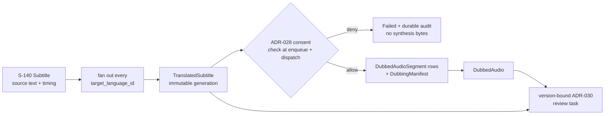

# Plan: S-150 — Translation and Dubbing

> **Status:** Planned 2026-08-02. S-150-T0 opened this plan and ratified the
> localization-unit, artifact-lineage, immutability, and review-version
> boundaries. S-150-T1a, S-150-T1b, S-150-T1c-i, and S-150-T1c-ii are now
> complete, so the slice has the product-code domain types, the migration layer
> for per-target translation/dubbing readiness and exact current-generation
> pointer/claim storage, plus the fail-closed translation/dubbing repository
> implementations that consume that schema. The former `S-150-T2` parent was
> decomposed on 2026-08-09: `S-150-T2b-i` (dispatch-outbox migration), then
> `S-150-T2b-ii` (durable delivery repository and exact target binding), then
> `S-150-T2c` (versioned jobs and fan-out) are the next executable sequence. The
> plan-review conditions recorded for this slice remain in
> force, especially the durable S-140/S-150 route discriminator, deterministic
> initial generation-request identity, migration parity, review cutover, and
> deferred voice-consent hardening boundary.
> **Roadmap phase:** `S-150` — Translation + dubbing (TTS / voice cloning).
> **Tasks ledger:** `docs/tasks/s-150-translation-dubbing.md`.

## Purpose

S-140 now produces a canonical source-language `Subtitle` artifact from word
alignment, but the next pipeline stage still consists only of placeholder JSON
schemas under `workers/translation-worker-py` and `workers/tts-worker-py`.
There are no Rust jobs, provider clients, per-target readiness records, persisted
translation/dubbing artifact kinds, or runtime enforcement of ADR-028's consent
precondition.

The current seam also exposes two constraints that S-150 must not hide:

- S-140 status is asset-global and its enqueue path selects only the first target
  language in deterministic order. That shape cannot represent one independent
  localization result per `target_languages` row.
- `review_tasks.subtitle_artifact_id` is nullable and S-140 currently enqueues the
  task with `None`. It does not bind a review decision to an exact translation or
  dubbed-audio version, so roadmap follow-up `X-S-160-3` remains open.

S-150 closes the translation/dubbing stage without treating temporary worker URIs,
storage keys, or mutable status rows as artifact identity.

## Objective

Deliver a fail-closed, per-target localization stage that:

- fans out from one source `Subtitle` artifact to every configured target language;
- persists immutable translated-subtitle and dubbed-audio artifacts with an exact,
  queryable lineage chain;
- preserves segment identity and timing across translation and synthesis;
- checks active consent in Rust before TTS work is accepted and again immediately
  before the worker is dispatched;
- never lets Python workers own governance, canonical storage keys, or database
  state;
- advances readiness only when the exact expected artifact set is persisted; and
- binds human review to exact artifact versions so an approval cannot silently
  authorize a later regeneration.

## Scope

### Included

- Per-localization-unit translation and dubbing status/readiness records.
- New derived artifact kinds for translated subtitles, synthesized segments, a
  dubbing manifest, and the merged dubbed-audio track.
- Rust translation and TTS job contracts, queue wiring, provider clients, worker
  dispatch, storage persistence, checksums, lineage, and failure transitions.
- Functional Python translation and TTS workers behind typed stdin/stdout JSON
  contracts; provider/model choice remains configurable and is decided by the
  relevant implementation task.
- ADR-028-compliant consent enforcement outside the Python worker.
- Exact artifact-version binding into ADR-030's existing review/publication path,
  including the remaining `X-S-160-3` ownership/version follow-up.
- BDD scenarios and canonical plan/task/roadmap synchronization.

### Excluded

- S-170 reviewer execution UX and S-180 publication delivery.
- Mixing dubbed speech with background music/effects or mastering a final video.
- Lip-sync/video retiming, emotion transfer, speaker diarization, and automatic
  voice-profile training.
- Provider benchmarking or a permanent vendor/model choice.
- Storing voice embeddings, consent evidence bytes, provider credentials, or raw
  worker-local paths in artifact payloads or metadata.
- Redefining the append-only consent ledger or the ADR-030 decision ledger.

## Ratified artifact boundaries (S-150-T0)

### D1 — The localization unit is per target-language row

The durable unit of work is `(project_id, asset_id, target_language_id)`, not merely
`asset_id` and not a free-form language string. Translation and dubbing each have a
status row keyed by that unit and carrying the exact source/output artifact IDs for
the active generation. BCP-47 text is payload metadata; `target_language_id` is the
relational identity.

This supersedes asset-global readiness for S-150. It also means S-140's current
"first target in C order" seam is only an upstream compatibility bridge; S-150-T2
must fan out all configured targets and must not copy the asset-global status shape.

### D2 — Artifact kinds and immediate-parent lineage are explicit

The persisted chain is:

```text
S-140 Subtitle
  -> TranslatedSubtitle
       -> DubbedAudioSegment (one row per synthesized segment)
       -> DubbingManifest (ordered exact segment artifact IDs)
            -> DubbedAudio (merged track)
```

The ratified new `ArtifactKind` names are:

- `TranslatedSubtitle` (`translated_subtitle`)
- `DubbedAudioSegment` (`dubbed_audio_segment`)
- `DubbingManifest` (`dubbing_manifest`)
- `DubbedAudio` (`dubbed_audio`)

Each `artifact_records.parent_artifact_id` names one immediate source. Every segment
and the manifest point to the translated subtitle; the merged audio points to the
manifest, which is the ordered multi-input boundary. The manifest references exact
segment artifact IDs, so the single-parent relational model does not lose the merge
inputs.

### D3 — Canonical payloads are provider-neutral and versioned

`TranslatedSubtitle` is JSON with `schema_version: 1`, source and target BCP-47
language tags, and ordered segments containing stable `segment_id`, `start_ms`,
`end_ms`, `source_text`, and `translated_text` fields. Translation must preserve the
Rust input adapter's segment IDs and the S-140 timing.

Repository inspection found that the current S-140 runtime serializes a bare
`Vec<SubtitleSegment>` with only timing/text, despite the S-140 plan describing an
envelope with `source_language`. S-150 therefore does not pretend the existing bytes
already satisfy this boundary: its Rust input adapter derives a stable segment ID
from `(subtitle_artifact_id, zero_based_ordinal)`, resolves source language from the
localization unit, validates timing/order, and emits the versioned translation-worker
input. This compatibility rule preserves existing immutable S-140 artifacts while
making every new S-150 output explicit and versioned.

`DubbingManifest` is JSON with `schema_version: 1`, target language, an opaque
`voice_profile_ref`, consent scope, and ordered entries containing `segment_id`,
`artifact_id`, `start_ms`, and `end_ms`. It stores no voice embedding, credential,
or consent-evidence bytes.

### D4 — Worker URIs are transport only

The existing `*_uri` fields in both Python worker contracts refer only to files in a
bounded worker workspace. Rust reads and validates those files, uploads bytes through
`StorageAdapter` under storage-owned keys, computes checksums, and only then inserts
`artifact_records`. Worker-returned URIs never become canonical storage keys and are
never written directly to PostgreSQL.

### D5 — Regeneration creates a new immutable generation

Object keys include the localization unit plus a generation UUID; workers never
overwrite an earlier canonical object. A retry with the same idempotency key returns
or resumes the same generation. An intentional regeneration creates new artifact
IDs and atomically advances the status row's current-output pointers only after the
complete expected artifact set exists.

The idempotency identity is `(operation, project_id, asset_id,
target_language_id, generation_request_id)`. The initiating command/event owns the
opaque `generation_request_id`; every redelivery of that same causal request must
carry it unchanged. An explicit regeneration must create a new request ID. The exact
source artifact ID is stored with the generation claim and a reused request ID with
different source or operation data fails closed instead of aliasing another
generation. The decomposed T1c pair owns this boundary in two halves: T1c-i adds the
claim/current-pointer schema and atomic uniqueness storage, while T1c-ii consumes it
through fail-closed repository methods. T2 and the decomposed T5 job contracts own
propagation of the request ID.

The initial translation request is the one bounded exception to caller-minted
identity because the current S-140 post-ready seam has no request ID. After the
exact `Subtitle` artifact is persisted, T2 derives
`generation_request_id = UUIDv5(S150_INITIAL_TRANSLATION_NAMESPACE,
"initial-translation-v1:" || canonical_lowercase_subtitle_artifact_uuid)`. The
namespace value is a single public constant owned by `crates/jobs`; the UUID input
uses the canonical lowercase hyphenated artifact UUID encoded as UTF-8. All
target-language fan-out jobs from that subtitle share this causal request ID while
the localization-unit fields in the idempotency tuple keep their claims independent.
On an idempotent post-ready replay, T2 resolves the already persisted `Subtitle` by
the same `(asset_id, word_alignment_parent_artifact_id)` uniqueness boundary and
uses its existing artifact ID; it never inserts a replacement merely to derive the
request. Re-delivery therefore derives the same ID without relying on mutable
status, queue attempt IDs, target ordering, or wall-clock time. An explicit
regeneration command must mint a new opaque UUIDv4 and must not invoke the
initial-derivation function; its command ID is then preserved by all redeliveries.
T1c rejects an explicit regeneration that attempts to reuse the reserved
deterministic initial ID or any request ID already bound to different
source/operation facts.

Partial objects or artifact rows never imply `Ready`. Cleanup/reconciliation remains
responsible for abandoned partial output, while older complete generations remain
auditable.

### D6 — Consent is checked twice and never delegated to Python

Translation requires the inherited ADR-008 rights basis but no voice-consent check.
TTS/voice cloning requires the exact ADR-028 scope and active consent:

1. before a TTS job is accepted/enqueued; and
2. immediately before subprocess/provider dispatch, closing the revoke-after-enqueue
   race.

Missing, revoked, mismatched, unreadable, or unauditable consent fails closed before
any synthesis bytes are produced. Both allowed and denied checks emit durable audit
evidence as required by ADR-028; the current implementation only constructs a
`ConsentCheckDenied` event on denial, so T4 must reconcile that implementation drift
instead of propagating it. The present implementation lives in
`apps/api/src/consent_gate.rs`, which is not reusable by `apps/worker-runner` without
an app-layer dependency. S-150-T4 must amend ADR-028 with the app-neutral ownership
seam and decompose that move before TTS implementation begins.

### D7 — Review approval is bound to an exact artifact set

S-150 owns the remaining `X-S-160-3` follow-up. A review task must bind, by artifact
ID and role, the exact `TranslatedSubtitle` and `DubbedAudio` generation it governs.
The existing `(project_id, asset_id, target_language_id)` uniqueness is insufficient
for regeneration: a new generation must create a new review unit, and prior decisions
must remain attached only to the old unit.

The implementation task must introduce a normalized artifact-binding/version seam
(rather than adding more nullable kind-specific columns) and must preserve existing
S-160 rows. S-140's premature `subtitle_artifact_id: None` enqueue is retired from the
full localization route; S-150 enqueues into the same ADR-030 gate after its exact
reviewable artifact set is ready. No parallel review or publication path is allowed.

The cutover is staged explicitly. T2 may suppress the legacy null-artifact enqueue
only for work adopted by the S-150 localization route; it must not globally remove
the compatibility path used by pre-S-150 subtitle-only flows. Until T6 lands, S-150
generations do not create a legacy review row and remain pending review enqueue even
when their artifact readiness is complete. T6 atomically introduces generation-aware
uniqueness and exact artifact bindings, preserves/backfills readable legacy rows,
enqueues any complete S-150 generations accumulated during the transition, and only
then retires the compatibility path. This avoids both tuple collisions and a window
where a null-bound decision could authorize a regenerated artifact set.

The route discriminator is concrete and travels in the durable serialized
`SubtitleJob` payload as a versioned `post_ready_route` enum with the wire values
`legacy_subtitle_review_v1` and `s150_localization_v1`. A missing field defaults only
to `legacy_subtitle_review_v1`, preserving already queued S-140 JSON; an unknown
value fails deserialization. The existing `SubtitleJob::new` constructor remains the
explicit legacy constructor, while T2 adds and uses an explicit localization
constructor for newly adopted S-150 work. On `legacy_subtitle_review_v1`, subtitle
readiness continues to call `prepare_review_post_ready` with the existing
`target_language`. On `s150_localization_v1`, the runtime ignores that legacy target
field, resolves every current `target_languages` row, derives the initial request ID
from the exact persisted `Subtitle` artifact as specified in D5, enqueues translation
fan-out, and does not call the null-bound review enqueue. The generation claim then
persists the route outcome through its operation, source artifact, and request ID;
no inference from project age, row presence, or feature timing is allowed.

## Governing constraints

- ADR-006: PostgreSQL owns structured metadata; object-store artifacts are immutable,
  storage-owned, and checksum-addressed by record.
- ADR-008: no translation or synthesis derivative may bypass the rights basis.
- ADR-018: transitions, failures, consent denials, and governance-significant actions
  emit durable correlated evidence.
- ADR-028: TTS/voice cloning is blocked without active consent for the exact scope;
  consent logic is not inlined in the ML worker.
- ADR-030: S-150 must use the existing review/publication gate.
- ADR-026: provider/model/runtime configuration is environment-explicit and
  fail-closed; no production credentials or endpoints are compiled in.
- Roadmap X12: every derived artifact preserves lineage and an evidence-backed
  quality/readiness transition.

## Affected components

| Layer | Expected path | Responsibility |
|---|---|---|
| Domain | `crates/domain/src/artifact.rs` | artifact kinds and per-target status records |
| Database | `infra/migrations/00XX_*.sql`, `crates/db/src/{translation,dubbing}_repo.rs` | localization-unit state, exact artifact pointers, immutable generations |
| Storage | `crates/storage/src/lib.rs` | canonical generation-scoped keys |
| Jobs | `crates/jobs/src/lib.rs` | translation/TTS job contracts and Redis queues |
| Providers | `crates/providers/src/{translation,tts}.rs` | typed subprocess/provider boundaries |
| Runtime | `apps/worker-runner/src/{translation,dubbing}_*.rs` | fan-out, gates, dispatch, persistence, readiness |
| Workers | `workers/{translation,tts}-worker-py/` | provider execution only |
| Review | `crates/domain/src/review.rs`, `crates/db/src/review_repo.rs`, migrations | exact generation/artifact binding |
| BDD/docs | `docs/bdd/s-150-translation-dubbing.feature`, plan/task/roadmap | executable behavior and status evidence |

## Task decomposition

| Task | Title | Type | Provisional RRI / Effort | Execution note |
|---|---|---|---|---|
| T0 | Open plan + ledger; ratify artifact boundaries | planning | 23 / S | Done 2026-08-01 |
| T1a | Domain artifact kinds and localization status types | development | 23 / S | Recompute before execution |
| T1b | Per-target status and artifact-kind migration | migration | 52 / L | Done 2026-08-02; verified on fresh PostgreSQL 16 |
| T1c | Translation/dubbing repositories and immutable generation pointers | development parent | 56 / L | Decomposed 2026-08-02 after exact rerun over repo paths plus schema-gap review |
| T1c-i | Generation-claim and exact-pointer schema migration | migration | 52 / L | Done 2026-08-02; verified on fresh PostgreSQL 16; cloud-required by owner request |
| T1c-ii | Translation/dubbing repositories and readiness evidence | development | 47 / L | Done 2026-08-02; repositories, strict artifact helpers, and readiness evidence verified with cloud-review fallback PASS |
| T2 | Translation fan-out delivery parent | development parent | 50 / L historical parent | Decomposed 2026-08-09; not executable |
| T2b-i | Translation dispatch outbox migration | migration | 55 / L | Done 2026-08-12; ADR-038 escalated (local `boundary_violation` on `docker` denylist, 0 repairs) to `gpt-5.6-terra`/high (ADR-039 human-selected); verified with 7/7 acceptance tests on live PostgreSQL by the primary agent after the cloud implementer's sandbox could not reach the local DB |
| T2b-ii | Durable translation delivery repository and exact target binding | development | 48 / L provisional | Cloud branch unless a preceding approved extraction brings every full-read target below 500 lines |
| T2c | Versioned localization jobs and outbox-backed fan-out | development | 54 / L provisional | Consumes T2b-ii; replaces first-target-only seam without provider execution |
| T3a | Translation provider/subprocess contract | development | 42 / L | Med-high |
| T3b | Functional translation worker | development | 44 / L | Med-high |
| T3c | Translation runtime persistence and readiness | development | 53 / L | Med-high |
| T4 | Amend ADR-028 with app-neutral consent ownership and decompose TTS | ADR/planning | 26 / M | Recompute; must precede T5 |
| T5 | TTS/dubbing implementation parent | development parent | 68–70 / L | Mandatory decomposition before implementation |
| T6 | Exact review artifact/version binding; close X-S-160-3 | development parent | 71 / XL | Mandatory decomposition + human diff review |
| T7 | BDD and canonical docs closeout | docs | 11 / S | Recompute; runs only after executable evidence exists |
| T8 | Future voice-consent hardening and evidence lifecycle | future ADR/planning parent | 71 / XL | Non-blocking backlog; decompose and approve when activated |

All provisional values were produced by `scripts/rri.py` over the expected path
sets on 2026-08-01, except the T1c rerun/decomposition update recorded on
2026-08-02. The exact rerun of the original T1c repo surface returned `RRI 56`
(`Complex`) and the phase-1 review packet confirmed the current `0027` migration
does not yet provide the D1/D5 generation-claim storage or the exact current
source/output pointers the repository task requires. They are routing evidence, not
permission to execute: every task must be rerun against its exact paths and current
coverage. T1c, T5, and T6 are parent requirements, not executable handoff cards;
their child tasks must be created before coding begins. T8 is a non-blocking future
parent and must be decomposed only when its governance program is activated.

Sequence: `T0 -> T1a -> T1b -> T1c-i -> T1c-ii -> T2b-i -> T2b-ii -> T2c -> T3a -> T3b -> T3c -> T4
-> decomposed T5 children -> decomposed T6 children -> T7`. T8 is deliberately
last and is not part of the S-150 delivery critical path; it is a future
governance follow-up coordinated with `X-S-110-2`, `X-S-110-3`, X20, and S-180.

## Technical flow



## Risks and explicit follow-ups

| Risk | Disposition |
|---|---|
| S-140 currently chooses only the first target language | T2b-i/T2b-ii create the durable per-target dispatch identity; T2c replaces this seam with deterministic all-target fan-out |
| S-140 currently has no post-ready route marker and always enqueues legacy review | D7/T2c adds a versioned job discriminator; missing legacy payload fields remain compatible and unknown values fail closed |
| S-140 readiness has no initiating request ID | D5/T2c derives the initial ID deterministically from the exact persisted subtitle artifact; explicit regeneration uses a distinct command ID |
| Asset-global status cannot distinguish target languages | D1 requires per-target status tables before runtime work |
| S-140 bytes are a bare segment array without the envelope/language described by its plan | D3 adds a Rust compatibility adapter with deterministic `(artifact_id, ordinal)` segment IDs; old immutable bytes are not rewritten |
| Consent gate is owned by `apps/api` today | T4 amends ADR-028 and decomposes an app-neutral shared seam |
| Current consent code audits denials but ADR-028 requires evidence for allowed and denied checks | T4 must reconcile the drift before any TTS child executes |
| Worker schemas currently omit segment identity, checksums, and versions | T3a/T5 children revise schemas before functional workers rely on them |
| Review decisions could leak across regenerated artifacts | D7/T6 binds each review unit to exact artifact IDs and a generation |
| TTS/model/provider choice is unspecified | Keep provider-neutral contracts; decide/configure in decomposed T5 children |
| Partial cross-store output can remain after failure | Never mark Ready; emit evidence and use existing reconciliation/cleanup posture |
| Consent-proof lifecycle, multi-speaker scope, and post-synthesis revocation policy remain open | T8 tracks them as future hardening without reopening X24 or blocking T1-T7 |

## Material references

- `docs/plan/roadmap.md`
- `docs/plan/s-140-subtitle-generation.md`
- `docs/plan/s-110-compliance-consent-center.md`
- `docs/plan/s-160-review-publication-workspace.md`
- `docs/adr/ADR-006-postgres-metadata-object-storage-binaries.md`
- `docs/adr/ADR-008-rights-ledger-fail-closed-precondition.md`
- `docs/adr/ADR-018-structured-observability-traceable-events.md`
- `docs/adr/ADR-028-voice-consent-ledger.md`
- `docs/adr/ADR-030-review-decision-ledger-and-fail-closed-publication-gate.md`
- `workers/translation-worker-py/*.schema.json`
- `workers/tts-worker-py/*.schema.json`
