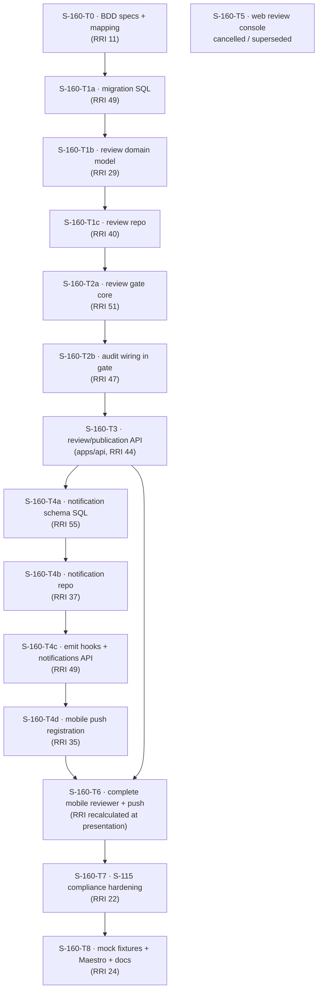

# Plan: S-160 — Human Review & Publication Workspace

> **Status:** Planned, replanned mobile-only 2026-06-13. `T5` is cancelled; `T6`
> owns the complete reviewer UI and is complete as of 2026-06-13; `T1` was
> decomposed into `T1a`/`T1b`/`T1c` on 2026-06-13 after RRI review. `T7` is the
> approved S-115 compliance hardening task; `T8` remains pending for Maestro +
> fixture/doc sync. Authored 2026-06-11.
> **Roadmap phase:** `S-160` — review/publication product phase
> that S-170/S-180 adopt when the generated artifacts exist.
> **Tasks ledger:** `docs/tasks/s-160-review-publication-workspace.md`.

## Purpose

DubBridge's design philosophy is that **nothing reaches an audience without clearing
rights, quality, and human review** (`README.md`). The pipeline reserves S-170 (human
review) and S-180 (publication) for this, but there is no product surface for it: no
review queue, no approve/reject with comments, no publication gate a reviewer can
operate, and no notification when something needs attention.

This slice builds the **review & publication product layer**: a governed review-task
model with append-only decisions, a fail-closed publication gate, notifications, and
the mobile surface a reviewer uses to do the work. It makes the HITL gate — the
reason a content owner trusts DubBridge — a first-class experience.

## Objective

Deliver a governed, end-to-end human-review and publication workspace:

- **Review queue**: reviewers (S-100 role) see review tasks assigned to their org/projects.
- **Decide**: approve or reject a derived output with a comment; decisions are
  append-only and audited.
- **Publication gate**: an asset/target cannot be published unless its governing
  review task is approved — a hard, fail-closed gate (ADR-008 spirit).
- **Notifications**: reviewers are notified (mobile push + in-app) when a task is
  assigned, decided, or published.
- **Surface**: a complete mobile review inbox/detail with alternable or stacked
  original/derived comparison, approve/reject comments, state-gated publish,
  notifications, and deep links.
- **Prove it**: Gherkin BDD mapped to mobile component/Maestro and backend gate evidence.

## Scope decisions (confirmed 2026-06-11)

| Decision | Choice |
|---|---|
| Feature scope | Review-task model + append-only decisions + publication gate + notifications + complete mobile reviewer surface |
| Decision posture | `review_decisions` is append-only; the task's current state is derived from the latest decision (mirrors the rights ledger, ADR-008) |
| Publication posture | Publish is fail-closed: blocked unless the governing review task is `approved`; every attempt is audited (ADR-018) |
| Review target | Reviews target derived artifacts (subtitles/dubs). Until S-140/S-150 produce them, the surface operates on `artifact_records`/fixtures (forward dependency, see D4) |
| BDD home | `docs/bdd/s-160-review.feature`; mapped to mobile flows, backend gate tests, and `HP-#`/`EC-#` |

## Affected components

| Layer | Path | Change |
|---|---|---|
| BBDD (schema) | `infra/migrations/0014_create_review_tasks.sql` | `review_tasks` (asset+target, assignee, derived state) |
| BBDD (schema) | `infra/migrations/0015_create_review_decisions.sql` | `review_decisions` (append-only: verdict, comment, reviewer, ts) |
| BBDD (schema) | `infra/migrations/0016_create_publications.sql` | `publications` (asset+target, state, published_at) |
| BBDD (schema) | `infra/migrations/0017_create_notifications.sql` | `notifications` (recipient, kind, ref, read_at) |
| Backend domain | `crates/domain/src/review.rs` (new) | Review task / verdict / publication state machine |
| Backend DB | `crates/db/src/review_repo.rs`, `notification_repo.rs` (new) | Repos (append-only decisions, derived state, notifications) |
| Backend service | `apps/api/src/services/review_gate.rs` (new) | Publication gate (fail-closed) + audit emission |
| Backend API | `apps/api/src/routes/review.rs`, `notifications.rs`, dto (new) | Queue, decide, publish, list notifications |
| Mobile | `mobile/src/push/registerPush.ts` (new) | Expo push token registration |
| Mobile | `mobile/src/screens/ReviewInboxScreen.tsx`, `ReviewDetailScreen.tsx`, nav | Inbox, compare, decide, publish, notifications + deep links |
| Mobile UX | S-115 tokens/primitives + reviewer screen tests | Safe-area, semantic status, touch-target, and accessibility compliance before Maestro baselines |
| E2E backend | `scripts/e2e-seed/mock-gateway-server.mjs` | `/api/*` review/publication/notification fixtures |
| BDD | `docs/bdd/s-160-review.feature`, `docs/bdd/README.md` | Cross-surface Gherkin specs + mapping |

## Design decisions

### D1 — Review-task model derived from append-only decisions

A `review_tasks` row represents one reviewable unit (asset + target language). Its
state (`pending` → `in_review` → `approved` / `rejected`) is **derived from the latest
row in `review_decisions`**, which is **append-only** — a reviewer's verdict is never
edited or deleted, only superseded by a newer decision. This mirrors the rights-ledger
append-only invariant (ADR-008, hardened in
[migration 0007](/Users/matias/Documents/projects/dubbridge/infra/migrations/0007_harden_governance_invariants.sql))
and keeps the full review history auditable.

### D2 — Publication gate is fail-closed (ADR-008 spirit)

`review_gate.rs` owns the rule: **a publication cannot be created unless the governing
review task is `approved`.** A publish attempt against a non-approved task is rejected
and audited (ADR-018), exactly as finalize is rejected without rights. This is the S-180
gate, expressed as a reusable service so S-180 can adopt it directly when built.

### D3 — Assignment by org role (consumes S-100)

Review tasks are assigned to org members holding the `reviewer` (or higher) role from
S-100. The queue a reviewer sees is scoped to their org/projects. This is why S-160 hard-
depends on S-100: without org membership + roles there is no notion of "my queue".

### D4 — Forward dependency on pipeline outputs (build ahead of producers)

The thing under review is a **derived artifact** (a subtitle track from S-140, a dubbed
audio track from S-150). Those producers are not built yet. S-160 therefore defines the
review domain and surfaces **against `artifact_records` (S-010 lineage) and deterministic
fixtures**, the same forward-building pattern S-060 used with the mock-gateway. When
S-140/S-150 land, they create the derived artifacts and enqueue review tasks; the gate and
surfaces are already in place.

> **ADR-030** closes the review/decision/publication gate contract for the
> S-170→S-180 governance boundary.

### D5 — Notifications: durable rows + mobile push, no PII in payloads

A `notifications` row is written on assignment, decision, and publication. Mobile
registers an Expo push token (`registerPush.ts`) and displays in-app notifications.
Payloads carry **references, not content** (no asset titles or PII in
the push body) — consistent with the redaction posture in ADR-018.

### D6 — Complete mobile reviewer surface + BDD mapping

Mobile provides the queue, original/derived comparison through an alternable or
stacked view, approve/reject with comments, and publish visible only for approved
tasks. Notifications deep-link to the relevant detail. `testID` values are the
contract between Maestro and screens; the backend publication gate remains authoritative.

### D7 — S-115 is the governing mobile presentation contract

The S-160 reviewer screens inherit the completed S-115 design system. New review UI must
use its tokens and primitives, native-header-aware safe-area edges, shared semantic status
mapping, minimum touch targets, and accessible state announcements. `S-160-T7` verifies and
hardens that integration before `S-160-T8` records Maestro flows and visual baselines.

## Module dependency direction

- **T0** fixes acceptance. **T1a/T1b/T1c** isolate schema, domain, and repo seams so
  each subtask stays below the decomposition target.
- **T2a/T2b** isolate the governance core from audit emission so each executable task stays
  below the post-policy `56+` decomposition gate.
- **T3** exposes the API; **T4a/T4b/T4c/T4d** split notifications into schema,
  repo, backend emit/API, and mobile push registration so each executable task stays
  below the `56+` decomposition gate.
- **T5** is cancelled under S-105; **T6** builds the complete mobile surface; **T7**
  hardens it against the inherited S-115 design-system contract; **T8** wires mock
  fixtures, Maestro, and docs after the final UI shape is stable.

## Relationship to other slices

- **Depends on (built/planned):** S-000, S-010, S-040, S-050, **S-105**
  (mobile workspace context and canonical authenticated UI), and **S-115**
  (mobile design-system, safe-area, interaction, and accessibility contract).
- **Forward integration:** S-140 (subtitles) and S-150 (translation/dubbing) create
  the derived artifacts that become review targets; S-170/S-180 adopt this gate and
  surfaces.
- **Ordering with S-110:** independent at build time; both sit on S-100, but S-110
  gates S-150 while S-160 gates S-170/S-180.

## Governing documents

- `docs/playbooks/AGENT_WORKFLOW_GUIDE.md` (authoritative workflow)
- `docs/policies/HITL_AUTONOMY_POLICY.md`, `docs/policies/RRI_POLICY.md`
- ADR-008 (fail-closed precondition — applied to the publication gate), ADR-018
  (durable audit + tracing), ADR-023 (API auth), ADR-024 (gateway transport), ADR-006
  (Postgres metadata), ADR-027 (org membership authorization), ADR-030
  (review/publication gate contract)
- `docs/plan/s-100-collaborative-workspace.md` (S-100 hard predecessor)

## Open follow-ups

- **X-S-160-2:** reconcile this gate with the eventual S-170/S-180 pipeline implementation so
  the producers enqueue review tasks and call the same publication gate (no second path).
- **X-S-160-3:** push-delivery provider decision (Expo push service vs direct FCM/APNs)
  and its secret-store boundary (ties to S-030 secret split).
