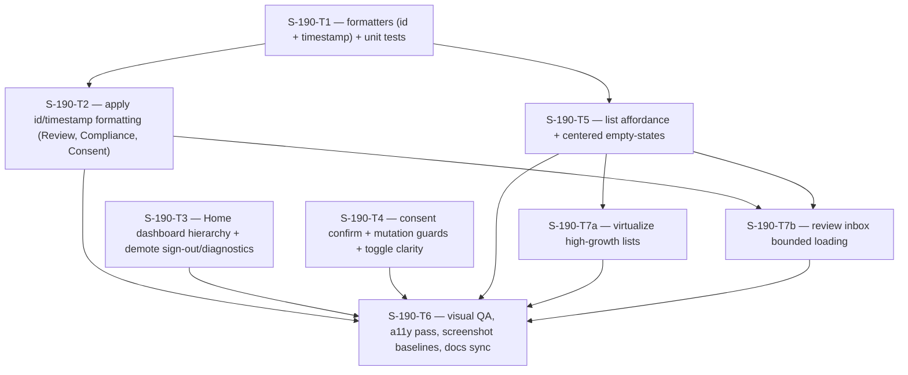

# Plan: S-190 — Mobile UX Usability, Performance & Product-Polish Pass

> **Status:** Done (2026-06-19). All tasks complete; 130 tests green; typecheck clean.
> **Roadmap phase:** `S-190`, a cross-cutting mobile usability layer on top of the
> S-115 design-system foundation (ADR-029 mobile surface). Non-blocking for the
> media pipeline; it hardens product usability that all mobile screens inherit.
> **Tasks ledger:** `docs/tasks/s-190-mobile-ux-usability-pass.md`.

## Purpose

S-115 delivered the **visual foundation** (tokens + 7 primitives + safe-area +
testID-preserving migration). S-190 is the **usability/product layer** that S-115
explicitly left out of scope: information legibility, action hierarchy, navigation
affordance, destructive-action safety, and data formatting.

A walkthrough of the captured Maestro screenshots
(`mobile/artifacts/screenshots/01..17`) on 2026-06-19 shows the app is now
*visually consistent* but still *reads like an engineering harness*: identifiers are
truncated mid-token so they look broken, the Home screen is a flat wall of identical
buttons, raw ISO timestamps are shown to users, list cards give no tap affordance,
an append-only consent ledger is mutated with a single un-confirmed tap, and
high-growth list surfaces still render with unvirtualized `ScrollView` + `.map`
patterns. The review inbox also serializes org -> project -> queue fan-out, which
is acceptable for seed fixtures but becomes poor mobile perceived performance as
the workspace grows.

S-190 fixes these **without** adding features, changing the navigation graph, or
touching the gateway/API contract. It is a presentation-and-interaction refactor on
the existing design system, gated by evidence (screenshots + source lines).

This slice does **not** introduce new tokens or primitives beyond small, additive
helpers (e.g. an `id`/timestamp formatter, an optional `Card` trailing affordance).
It stays within the S-115 restraint principle (D7): taste through consistency, not
ornamentation.

## Evidence: current-state findings (audited 2026-06-19)

Each finding is anchored to a screenshot **and** the source line that produces it.

| # | Severity | Finding | Screenshot | Source evidence |
|---|---|---|---|---|
| U1 | 🔴 High | Identifiers truncated mid-token via `.slice(0, 8)` — `asset-seed-1` renders as `asset-se`, `project-seed-1` as `project-`, `lang-...` as `lang-see`. Looks like a rendering bug; two tasks become indistinguishable. | `14_review_inbox`, `15_review_detail` | `ReviewInboxScreen.tsx:322,326,328`; `ReviewDetailScreen.tsx:136,141,143` |
| U2 | 🔴 High | Raw ISO-8601 timestamps shown to users (`2026-01-01T11:00:00Z`). | `11_compliance_center`, `12_consent_active` | `ComplianceScreen` audit/ledger rows; `ConsentScreen` history rows |
| U3 | 🔴 High | Home is a flat wall of 5 identical `secondary` full-width buttons; destructive **Sign out** carries the same visual weight as primary navigation; raw gateway URL + `local` env are shown as a hero panel in all environments. | `02_home`, `08_home_for_projects` | `HomeScreen.tsx:35-78` |
| U4 | 🟡 Med | Destructive, **append-only** consent actions (Grant/Revoke) execute on a single tap with no confirmation; scope chips (`voice clone` / `tts synthesis`) do not read clearly as selectable toggles. | `12_consent_active`, `13_consent_revoked` | `ConsentScreen` scope + grant/revoke actions |
| U5 | 🟡 Med | List/detail cards give no persistent "tappable" affordance (no trailing chevron; existing pressed feedback is transient only); empty-states pinned to the top leave ~70% dead canvas. | `03_asset_list`, `06_ingest_complete`, `09_project_list` | `AssetListScreen`, `ProjectListScreen`, `ReviewInboxScreen`, `ProjectDetailScreen`, `StateView`/`Card` |
| U6 | 🟡 Med | High-growth lists render every row eagerly with `ScrollView` + `.map`, creating avoidable memory/layout cost and slow first paint for large workspaces. | `03_asset_list`, `09_project_list`, `10_project_detail`, `14_review_inbox` | `AssetListScreen`, `ProjectListScreen`, `ProjectDetailScreen`, `OrganizationListScreen`, `OrganizationMembersScreen`, `ReviewInboxScreen` |
| U7 | 🟡 Med | Review inbox data loading performs sequential org -> project -> review queue fan-out before rendering, so one slow scope delays the entire inbox. | `14_review_inbox` | `ReviewInboxScreen.tsx` load loop |

### Deliberately out of scope for S-190 (recorded, not actioned)

- **Login keyboard/secure-entry/states** — already correct in source
  (`LoginScreen.tsx:75-97` sets `keyboardType`, `autoCapitalize`, `secureTextEntry`,
  `textContentType`, disabled state, spinner, error region). The screenshot's "pale"
  button is the *correct disabled state* for an empty form, not a defect. **No task.**
- Brand-casing nits (`DUBBRIDGE` kicker vs `DubBridge` copy) — the kicker uppercase
  is the `label+` type token by design (`tokens.ts:93-99`), not an inconsistency.
- Upload stepper visualization (`05_upload`) — deferred; the upload flow is a
  separate S-120 concern and a stepper is a feature, not polish.

## Objective

- **U1:** Stop truncating identifiers mid-token. Show the human-readable field
  (asset/project title) as primary and the *full* id in `meta` mono, eliding only
  with a trailing ellipsis on a complete value, never cutting a slug.
- **U2:** Introduce a single shared timestamp formatter and route every user-facing
  timestamp through it (absolute, locale-aware; optional relative for recency).
- **U3:** Convert Home into a scannable dashboard: navigation as menu `Card`s
  (title + one-line subtitle), **Sign out** demoted to a low-emphasis affordance,
  and the gateway/env diagnostic panel hidden outside dev builds.
- **U4:** Require confirmation before the destructive **Revoke** consent action and
  make scope chips read unambiguously as toggles (selected/unselected states).
  Guard both **Grant** and **Revoke** while submitting so append-only mutations cannot
  be double-posted by rapid taps.
- **U5:** Give tappable cards a persistent trailing affordance while preserving the
  existing pressed feedback, and vertically center empty-states so screens don't read
  as broken/empty.
- **U6:** Convert high-growth lists to virtualized RN list primitives without changing
  navigation, data contracts, or testIDs.
- **U7:** Improve review inbox perceived performance by avoiding strictly sequential
  scope fan-out; either parallelize with bounded concurrency inside the current API
  contract or explicitly record a later aggregate-endpoint follow-up if code review
  finds the client-only approach unsafe.

## Design decisions

### D1 — Identifiers: format, never truncate (U1)
Add a pure helper (e.g. `formatId`) in `mobile/src/theme` or a small
`src/format/` module. Cards lead with the human title; ids render full in `meta`.
Where horizontal space is tight, rely on `numberOfLines={1}` + native ellipsis on
the **whole** value, not a manual `.slice(0, 8)`. Rationale: a mid-token cut is the
single biggest "this looks broken" signal in the audit.

### D2 — One timestamp formatter (U2)
A single `formatTimestamp(iso)` (and optional `formatRelative`) used by Compliance,
Consent, and Review. No raw ISO strings in any user-facing surface. Rationale:
consistency + legibility; centralizing avoids per-screen `toLocaleString` drift.
The formatter must support deterministic tests by accepting explicit locale/timezone
options (or a fixed test wrapper), while the UI may use the device locale by default.
Screen tests should assert that rendered user-facing trees contain no raw ISO pattern
such as `YYYY-MM-DDT...Z`.

### D3 — Home as a dashboard, not a button wall (U3)
Reuse the existing tappable `Card` primitive for the four navigation destinations
(title + subtitle). `Sign out` becomes a text/secondary-`sm` affordance separated
from navigation. The diagnostics panel renders only when `__DEV__` (or an env flag),
so production users never see `http://10.0.2.2:8081`. **No navigation-graph change** —
the same `onOpen*` callbacks are wired; only presentation changes, and every existing
`home-open-*` / `home-sign-out` testID is preserved.

### D4 — Confirm destructive consent; toggles read as toggles (U4)
`Revoke` triggers a confirm step (native `Alert.alert` or an in-screen confirm) before
the append-only mutation. Scope chips get explicit selected/unselected token styling
(`primarySubtle`/`sunken`) and `accessibilityState.selected`. Rationale: the consent
ledger is append-only and legally meaningful (ADR-029/-030 governance surface);
a one-tap irreversible revoke is a usability *and* safety gap. Grant does not need an
extra confirm because it already requires evidence input, but both Grant and Revoke
must enter a submitting state that disables repeat taps until the POST + reload cycle
finishes.

### D5 — Tappable affordance + centered empty-states (U5)
`Card` gains an optional trailing chevron (additive prop, default off → no change to
existing call sites). The existing `Card` pressed state is preserved; the chevron is
the persistent affordance. `StateView` empty/error layouts center within available
space, but the task must update parent containers as needed (`flexGrow`, `justifyContent`,
or equivalent) because a child-only change cannot center inside a non-growing parent.
Rationale: affordance + whitespace usage, both within S-115 restraint.

### D6 — Behavior- and testID-preserving (inherited from S-115/D3)
Every change is presentation/interaction only. All existing `testID`s and view-state
logic are preserved verbatim so S-060/S-105/S-110/S-160 Jest suites and the Maestro
suite stay green. New behavior (confirm dialog, formatter) is covered by new unit tests.

### D7 — No new heavy dependency
No icon-font or UI-kit dependency. Chevron is a token-styled glyph/View; formatter is
plain `Intl`/`Date`. Stays RN-native (S-115/D7).

### D8 — Virtualize high-growth lists (U6)
Use React Native built-ins (`FlatList` / `SectionList`) for list surfaces that can grow
with customer data: assets, projects, project-linked assets, organizations, members,
and review tasks. Preserve pull-to-refresh, empty/error states, row `testID`s, and
tap callbacks. Add large-list fixtures (100+ rows) that verify row rendering remains
bounded and long labels ellipsize without pushing affordances off-screen.

### D9 — Review inbox loading is bounded, not strictly serialized (U7)
Within the current gateway/API contract, the review inbox may issue project/queue
requests with bounded concurrency so one slow scope does not block all other visible
tasks. The behavior must remain fail-closed for session expiry and forbidden scopes.
If bounded client fan-out proves too risky during implementation, record the exact
aggregate endpoint needed as a future API task instead of widening S-190's backend
scope.

## Affected files / boundaries

- **New:** `mobile/src/format/` (id + timestamp formatters) with unit tests under
  `mobile/__tests__/`.
- **Modified:** `mobile/src/screens/{HomeScreen,ReviewInboxScreen,ReviewDetailScreen,
  ComplianceScreen,ConsentScreen,AssetListScreen,ProjectListScreen,ProjectDetailScreen,
  AssetDetailScreen,OrganizationListScreen,OrganizationMembersScreen}.tsx`;
  `mobile/src/components/{Card,StateView}.tsx` (additive props only).
- **Tests:** new formatter + component unit/RTL tests; existing screen tests and
  Maestro flows preserved (testIDs unchanged); large-list fixtures; no-raw-ISO
  rendered-tree assertions; screenshot baselines refreshed.
- **Docs:** roadmap S-190 row, this plan, the tasks ledger.
- **Out of scope:** gateway/API contract, navigation graph, new screens/features,
  backend, schema, new design tokens/primitives (only additive helpers/props).

## Module dependency flow

## Verification

- `cd mobile && npm test -- --runInBand` (formatter + component + screen tests green)
- `cd mobile && npm run typecheck`
- Large-list fixtures verify virtualized rendering for assets/projects/orgs/members
  and review rows; review inbox tests cover bounded loading and session-expiry behavior.
- Rendered-tree tests or equivalent assertions prove no user-facing raw ISO timestamp
  pattern remains on S-190 surfaces.
- Maestro flows syntax-valid and testIDs intact; the consent flow is updated for the
  Revoke confirm step; refreshed screenshot baselines reviewed (no truncated ids,
  formatted timestamps, dashboard Home, confirm on revoke, virtualized lists retain
  affordances).
- Accessibility: toggles expose `accessibilityState.selected`; destructive action has a
  confirm; touch targets remain ≥44pt; contrast ≥ WCAG AA.
- `make qa-docs`

A live Maestro emulator run remains environment-dependent; runner integration and flow
syntax are validated regardless.

## Sequencing note

T1 is the first hard prerequisite (T2 consumes the formatters). T3 and T4 are
independent and can run in any order. T5 should land before T7a/T7b so list rows have
the final tappable-card shape before virtualization. T7b also depends on T2 because
Review row formatting and timestamp assertions should be stable before the loading refactor.
T6 is the closeout gate after T2–T5 and T7a/T7b.

## Related

- `docs/plan/s-115-mobile-ux-foundation.md` (foundation this slice builds on)
- `docs/adr/ADR-029-mobile-as-sole-authenticated-product-surface.md`
- `docs/plan/roadmap.md` (S-190 row)
