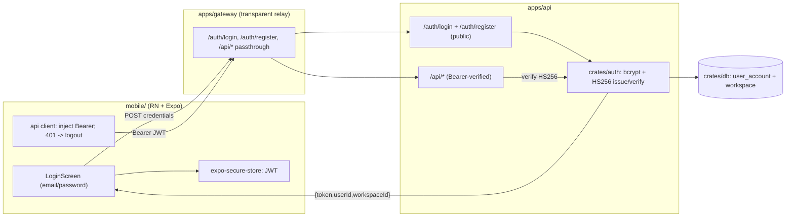

# Plan: S-200 — Mobile credential login with backend-issued JWT (FenixCRM parity)

**Roadmap phase:** `S-200`. Re-architects the first-party mobile authentication
established by `S-000` (ADR-023), `S-040` (ADR-024), and `S-050`/`S-105` (ADR-029).
Governed by **ADR-031** (Proposed). Depends on nothing new being built first, but its
acceptance **supersedes ADR-023 and ADR-024** and amends ADR-029.

> **Status:** 📄 Planned — design package only. **No implementation has started.**
> The initiative-level RRI is **109 (Excessive, > 100)**; its gate is
> "architecture/design work must happen first — re-scope before any implementation".
> This plan, ADR-031, the risk analysis, and the decomposition in
> `docs/tasks/s-200-mobile-jwt-credential-auth.md` satisfy that gate. Each
> implementation task is independently gated (RRI > 25 → explicit human approval).

## Objective

Adapt DubBridge's mobile authentication to match the **FenixCRM reference flow** at
full fidelity (`/Users/matias/fenix/docs/mobile-auth-flow-reference.md`):

- `apps/api` validates `email`/`password` and **issues its own HS256 JWT**.
- `apps/gateway` becomes a **transparent relay** (no session store, no opaque
  reference, no rotation) for the mobile transport.
- `mobile/` **stores the JWT** in secure storage, injects `Authorization: Bearer`,
  and logs out on `401` — replacing the opaque `session_ref` and OAuth/PKCE handoff.

The product surface stays mobile-only (ADR-029). Backend authorization (scopes, org
membership, publication gate) stays fail-closed and unchanged.

## Why this exists / where it sits

The directive (2026-06-17) is to make mobile auth work "like FenixCRM". DubBridge's
current design is the deliberate opposite (ADR-023/024/029): the device never holds a
token; the gateway owns an opaque server-side session. ADR-031 records the inversion
and its accepted security regressions. S-200 is the execution package for that ADR.

This slice **unlocks**: a self-contained auth system with no external authorization
server dependency, and a mobile login UX identical to the documented FenixCRM flow.
It **closes**: the directive to reach FenixCRM parity. It **opens follow-ups**:
X-S-200-1 (RS256 hardening) and X-S-200-2 (pre-expiry revocation).

## Scope

### Included
- `crates/auth`: credential-auth primitives — `hash_password`/`verify_password`
  (bcrypt cost 12), `generate_jwt`/`parse_jwt` (HS256, algorithm-pinned), and a
  credential `AuthService` (login + register with atomic workspace/account creation).
- `apps/api`: public `POST /auth/login` and `POST /auth/register` handlers + request
  validation; issuance config (`DUBBRIDGE_JWT_SECRET`, `DUBBRIDGE_JWT_EXPIRY_HOURS`)
  wired fail-closed through `crates/config` (ADR-026); login/registration audit rows
  (ADR-018). `apps/api` token verification switches from RS256 to the HS256 boundary.
- `crates/db` + `infra/migrations`: `user_account` (email, bcrypt hash, workspace_id,
  status) and the workspace linkage the token's `workspace_id` claim needs.
- `apps/gateway`: reduce the mobile path to a relay — forward `/auth/login`,
  `/auth/register`, and `Bearer`-carrying `/api/*`; remove mobile session store usage,
  `X-Dubbridge-Session`, and handoff-code redemption for this transport.
- `mobile/`: email/password `LoginScreen` + register; secure-store token persistence;
  `Authorization: Bearer` request injection; `401 → logout` response handling; cold-
  start token restore; **removal of the `isJwtLike()` anti-JWT guards**.
- Tests: backend unit/integration (login/register/issue/verify, fail-closed,
  enumeration, algorithm pinning), mobile component/flow tests, BDD scenarios
  (`docs/bdd/s-200-mobile-auth.feature`), and a Maestro login flow.
- Docs: ADR-031 acceptance + supersession propagation; `architecture.md`, `roadmap.md`,
  `crates/auth` references; `.env.example` for the new secrets.

### Excluded (deferred)
- **X-S-200-1**: RS256 (asymmetric) issuance hardening — recommended, declined for v1
  fidelity.
- **X-S-200-2**: pre-expiry revocation (`jti` deny-list or refresh tokens).
- Password reset, account lockout, MFA, email verification — identity-provider
  lifecycle DubBridge now owns but does not build in v1.
- Programmatic/M2M clients: ADR-023's direct-Bearer path for non-first-party clients
  is removed by this re-architecture; if a machine client is later needed it must be
  re-planned against the HS256 issuer (note in `Open questions`).
- The retired `web/` console (ADR-029) — not revived.

## Governing ADRs
- **ADR-031** (Proposed) — the primary decision and risk analysis for this slice.
- **ADR-023** (superseded on ADR-031 acceptance) — the RS256 resource-server boundary
  being replaced; T0 flips its status.
- **ADR-024** (superseded on ADR-031 acceptance) — the session-gateway/opaque-session
  transport being replaced; T0 flips its status.
- **ADR-029** (amended on acceptance) — mobile stays the sole surface; transport
  changes.
- **ADR-008** — uploader/actor identity must stay derived from the verified token
  subject.
- **ADR-018** — login/registration are auditable events.
- **ADR-026** — `DUBBRIDGE_JWT_SECRET` injected, fail-closed.

## Affected files

### crates/auth/
- `src/credentials.rs` (new) — bcrypt `hash_password`/`verify_password`.
- `src/issuer.rs` (new) — HS256 `generate_jwt`/`parse_jwt`, `alg` pinning, claims.
- `src/service.rs` (new) — `AuthService` login + register (atomic workspace/account).
- `src/verifier.rs` — replace RS256 verification with the HS256 `parse_jwt` boundary;
  keep the `TokenVerifier` trait so `apps/api` handlers/middleware are untouched at
  the call site.
- `src/config.rs`, `src/lib.rs` — issuance/verification config (secret, expiry).

### apps/api/
- `src/routes/auth.rs` (new) — `POST /auth/login`, `POST /auth/register`, validation,
  generic-error mapping (400/401/409/500).
- `src/main.rs` / router — mount `/auth/*` **public** (outside the auth middleware);
  keep `/api/*` and existing routes behind verification.
- `tests/` — login/register integration tests.

### crates/db/ + infra/migrations/
- `user_account` table + workspace linkage migration (append-only, fail-closed decode
  of `status`).

### apps/gateway/
- `src/proxy.rs`, `src/auth/*`, `src/session/*` — relay `/auth/*` + `Bearer` `/api/*`;
  remove mobile session-store usage, `X-Dubbridge-Session`, and mobile handoff
  redemption. Browser-cookie code is deleted with the retired transport.

### mobile/
- `src/auth/session.ts` — store `{ token, userId, workspaceId }`; **remove
  `isJwtLike()`**.
- `src/auth/AuthProvider.tsx` — email/password `login`/`register`, cold-start restore,
  `401 → logout`; remove OAuth/PKCE + handoff bootstrap.
- `src/api/client.ts` — inject `Authorization: Bearer`; remove `X-Dubbridge-Session`
  + rotation extraction; `401` response handling.
- `src/screens/LoginScreen.tsx` — email/password form (+ register entry).
- `__tests__/*` — rewrite auth/session/flow tests for the bearer model.

### docs/ + config/
- `docs/adr/ADR-031-...md` (status → Accepted at T0), `docs/adr/ADR-023/024` (status →
  Superseded), `docs/adr/ADR-029` (amend transport), `docs/adr/README.md` index.
- `docs/architecture.md`, `docs/plan/roadmap.md`.
- `.env.example`, `config/*.toml` — new auth secrets/profile values (ADR-026).

## Design decisions

### Keep the `TokenVerifier` trait seam
`apps/api` handlers and `crates/auth::axum` consume a `TokenVerifier`. Swapping the
RS256 implementation for an HS256 one behind the same trait limits the blast radius to
`crates/auth` and the new `/auth/*` routes — existing protected handlers do not change
their call sites. This isolates the most dangerous change.

### Issuance lives in `crates/auth`, not in handlers
`AuthService` owns credential validation, hashing, atomic registration, and signing;
`apps/api` handlers only map HTTP ↔ service and shape errors. This mirrors the
existing pure-builder / IO-executor seams and keeps signing testable in isolation.

### Algorithm pinning is mandatory and tested first
HS256 verification must reject any non-HS256 header (and `alg:none`) before signature
checks. A characterization test mirroring the existing
`verify_rejects_algorithm_substitution` is written **before** the RS256→HS256 swap (T1
is characterization-first because T≥4 ∧ P≥4).

### Fail-closed secret
`DUBBRIDGE_JWT_SECRET` is an injected env secret (ADR-026). Non-local environments
**panic at startup** if it is unset; local may use a documented placeholder. The
secret is never logged and never written to a committed profile.

### Generic credential error
Login returns the same `401` for unknown email and wrong password; when the email is
absent, still run a bcrypt comparison against a dummy hash to avoid timing-based
enumeration.

### Relay, not session, on the gateway
The gateway forwards bodies and `Authorization` headers unchanged for the mobile
transport. It keeps `X-Real-IP` forwarding for audit. It no longer reads or writes the
session store on this path.

## Module dependencies

```text
mobile/ --(email/password)--> apps/gateway (relay) --> apps/api  POST /auth/login|register
mobile/ --(Authorization: Bearer <HS256 JWT>)--> apps/gateway (relay) --> apps/api /api/*
apps/api -> crates/auth (AuthService: bcrypt + HS256 issue/verify)
         -> crates/db   (user_account, workspace)
         -> crates/config (DUBBRIDGE_JWT_SECRET, DUBBRIDGE_JWT_EXPIRY_HOURS; fail-closed)
         -> crates/audit (login/register audit rows, ADR-018)
mobile/ -> expo-secure-store (stores the JWT, replacing dubbridge_session_ref)
```

## Architecture diagram



## RRI summary (initiative level)

| RRI | 109 → band Excessive (> 100) → gates: architecture/design first; **decompose**; ADR + risk analysis before implementation |
|---|---|
| Complexity score | raw CC 14 → C=2 (cyclomatic); D=5 P=5 K=5 T=5 (auth/security anchor, ADR-023 floor) |
| Penalties | arch_decision +12; auth_security +10; no_tests_high_impact +10 |
| Claude Code | Premium — thinking On |
| Codex | Premium |

Full variable table and the subtask-level RRIs are in
`docs/tasks/s-200-mobile-jwt-credential-auth.md`. Per the decomposition triggers
(RRI > 70; T≥4 ∧ P≥4), the slice is split so each implementation subtask scores
≤ 55 where achievable; the irreducible security core (T1/T3) stays high and carries
characterization-test-first + diff-review gates.

## Proposed execution order (decomposition)

```text
S-200-T0  Accept ADR-031; flip ADR-023/024 -> Superseded; amend ADR-029;
          propagate to index/architecture/roadmap (docs-only, gated by approval)
  -> T1   crates/auth: HS256 issuer + alg-pinning, characterization-first (verify swap)
  -> T2   crates/db + migration: user_account + workspace linkage
  -> T3a  crates/auth: bcrypt helpers + validation primitives
  -> T3b  crates/auth: AuthService register + token issuance
  -> T3c  crates/auth: AuthService login + anti-enumeration
  -> T4a  crates/config: auth.jwt_expiry_hours + parity docs
  -> T4b  apps/api: AuthService runtime wiring + fail-closed issuer builder
  -> T4c  crates/domain: auth audit event kinds + helper
  -> T4d  apps/api: /auth/register handler + audit
  -> T4e  apps/api: /auth/login handler + audit
  -> T4f  apps/api: public /auth/* router mount
  -> T5a  apps/gateway: POST /auth/login + /auth/register relay handlers
  -> T5b  apps/gateway: /api/* bearer passthrough relay + preserved X-Real-IP
  -> T5c  apps/gateway: retire /auth/mobile/session and session_ref mobile contract
  -> T5d  apps/gateway: retire legacy OAuth login/callback/logout surface
  -> T5e  apps/gateway: remove leftover session-store/runtime wiring
  -> T6a  mobile: replace the core auth runtime with bearer auth (storage + client +
          provider + login form), no legacy path
  -> T6b  mobile: rewrite auth-flow integration evidence for bearer login
  -> T7   BDD + Maestro + end-to-end + docs sync (architecture/roadmap/ADR refs)
```

## Risk analysis

The accepted security regressions (R1–R7) and recommended hardening (X-S-200-1/2) are
recorded in **ADR-031 §Risk analysis**. This is a directive-driven, deliberate
downgrade from the ADR-024 no-token-on-device property. Acceptance of ADR-031 is the
point at which the platform takes on those risks.

## Open questions
- **OQ1:** Does any programmatic/M2M client currently depend on ADR-023's direct
  `Bearer` path? If yes, T5 must preserve a verification path for it against the new
  HS256 issuer or re-plan an M2M credential. (Assumed none in v1.)
- **OQ2:** Source of the account principal `sub` and `workspace_id` — confirm the
  `user_account`↔`workspace` model matches the existing `assets.uploader_id` UUID
  contract so ADR-008 lineage is preserved.
- **OQ3:** Is HS256 acceptable for production, or should X-S-200-1 (RS256) be pulled
  into v1 before any production device login?

## Acceptance gate

**No implementation has started.** This is a planning + ADR + risk package produced
under the Excessive-RRI gate. Each task in
`docs/tasks/s-200-mobile-jwt-credential-auth.md` requires explicit human approval
before execution (RRI > 25), and T0 (ADR acceptance + supersession of ADR-023/024) is
a governance-critical change that must be approved before any code task begins.
