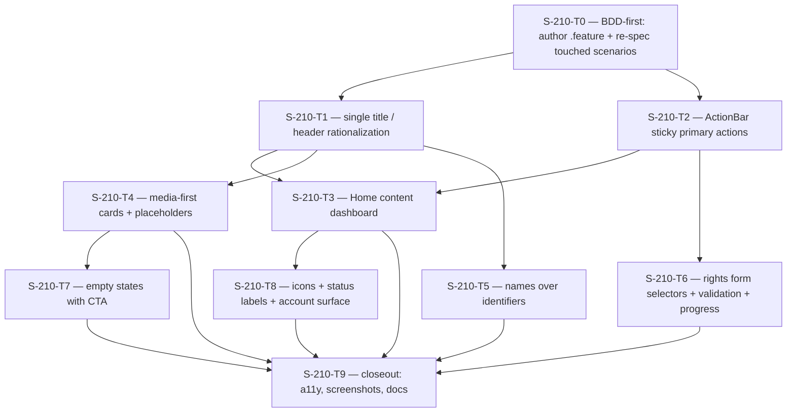

# Plan: S-210 — Mobile Product-Experience Refresh

> **Status:** Complete (2026-06-28). P0 ✅ P1 ✅ P2 ✅ — T0–T9 all Done.
> **Roadmap phase:** `S-210`, a non-blocking mobile product-experience layer on top
> of the S-115 design foundation and the S-190 usability pass (ADR-029 mobile
> surface). It does not touch the media pipeline, schema, or governance gates.
> **Tasks ledger:** `docs/tasks/s-210-mobile-product-experience.md`
> **Governs decision:** "Home as a content dashboard" navigation model
> (stack preserved, **no** bottom tab bar) chosen by the product owner on 2026-06-26.

## Purpose

S-115 delivered the **visual foundation** (tokens + primitives + safe-area). S-190
delivered the **usability pass** (id/timestamp formatting, virtualized lists, consent
confirmation, Home button-wall → menu cards). After S-190 the app is *visually
consistent* but still **reads like a navigable database, not a product**: it is
scannable and correct, yet it does not feel intuitive, media-first, or thumb-friendly.

A fresh walkthrough of the post-S-190 Maestro screenshots
(`mobile/artifacts/screenshots/01..19`, audited 2026-06-26) plus a source read of
every screen surfaces three **root causes**, all usability/ergonomics rather than
styling:

1. **Menu-tree navigation.** Every section hangs off a Home that is a list of menu
   cards; crossing sections requires backing out to Home and re-entering. The only
   inter-section path is the top-left back arrow — the worst thumb position on a tall
   device.
2. **Developer data as primary content.** Raw identifiers (`asset-seed-1`, `e2e-user`,
   `lang-seed-1`) and domain enums (`owned / direct_upload`) are presented as the
   user's primary reading material. Detail screens read like database rows.
3. **Inverted ergonomics.** Display-size titles and the back affordance live in the
   top third of every screen — exactly where the thumb cannot reach on a 2400px-tall
   device — while the comfortable bottom third is dead canvas.

S-210 fixes these **within the chosen navigation model** (Home-as-dashboard, stack
preserved). It is a presentation/interaction + light data-aggregation refactor on the
existing design system. It adds **no** gateway/API *write* contract, **no** schema,
**no** new heavy dependency, and **no** tab navigator.

## Evidence: current-state findings (audited 2026-06-26, post-S-190)

Each finding is anchored to a screenshot **and** the source line that produces it.

| # | Severity | Finding | Screenshot | Source evidence |
|---|---|---|---|---|
| E1 | 🔴 High | **Duplicated title chrome.** Native stack header repeats the body `ScreenHeader`; on asset detail the title appears 3× (header, kicker block, card). ~120–150px of the most valuable vertical space lost per screen. | `03_asset_list`, `04_asset_detail`, `05_upload` | `RootNavigator.tsx:89-232` (native titles) + every `ScreenHeader` usage |
| E2 | 🔴 High | **Inverted ergonomics / dead thumb zone.** Display titles + back arrow occupy the top third; primary CTAs sit mid/upper screen; the comfortable bottom third is empty (Home `Sign out` floats in the void). | `02_home`, `04_asset_detail` | `Screen.tsx` top-pad header; per-screen CTA placement; `HomeScreen.tsx:83-92` |
| E3 | 🔴 High | **Home is a menu, not a dashboard.** Four equal cards with no live content; user must drill in to learn there are 0 assets / N pending reviews. No greeting, no at-a-glance state. | `02_home` | `HomeScreen.tsx:10-92` |
| E4 | 🔴 High | **No media anchors in a media app.** Asset/review cards are text-only; no thumbnail/poster/duration/language. Lists read as DB rows, not a media library. The raw id line is visual noise. | `03_asset_list`, `14_review_inbox` | `AssetListScreen.tsx:169-182`; `AssetSummary` has no media metadata fields |
| E5 | 🟡 Med | **Identifiers as primary content.** Asset detail leads with `ASSET ID: asset-seed-1` and `UPLOADER ID: e2e-user`; review compares `Asset asset-seed-1` vs `Target lang-seed-1`. Technical ids, not user-meaningful info. | `04_asset_detail`, `15_review_detail` | `AssetDetailScreen.tsx:178-185`; `ReviewDetailScreen.tsx:165-180` |
| E6 | 🟡 Med | **Rights form: enums as free text + silent validation.** `license_type` / `source_type` are enums (compliance shows `owned / direct_upload`) but entered as free `TextInput`; submitting an incomplete form does nothing with no message. No step-progress indicator for the 3-step wizard. | `05_upload` | `UploadScreen.tsx:113-128` (silent return), `262-298` (free-text fields) |
| E7 | 🟡 Med | **Empty states without a path forward.** "No assets yet" is centered in a gray void with no CTA; the user must back out and find Upload. | `03_asset_list` | `AssetListScreen.tsx:183-190`; `StateView.tsx` |
| E8 | 🟢 Low | **Visual system reads as wireframe.** Restraint taken to the point of no hierarchy: no iconography (Home cards distinguished by text only), accent barely used, status labels are raw domain jargon ("Finalized", "in_review"), `Sign out` is a naked centered link. | `02_home`, `04_asset_detail` | `HomeScreen.tsx`; `Badge.tsx:30-52` labels |

### Deliberately out of scope (recorded, not actioned)

- **Bottom tab bar** — explicitly rejected by the product owner (2026-06-26) in favor
  of Home-as-dashboard. The stack navigator and navigation graph are preserved.
- **Gateway/API write contract, schema, governance gates** — untouched. Media metadata
  for E4 (poster/duration/language) is a **read**-shape gap recorded as `X-S-210-1`
  below; S-210 ships graceful placeholders until the field exists.
- **New design tokens/primitives** beyond small additive props/components.

## Objective

- **E1:** One title per screen. Remove the redundant display `ScreenHeader` on screens
  that already carry a native stack header (or collapse the native header), recovering
  vertical space without losing the back affordance.
- **E2:** Anchor primary actions to the bottom (sticky action bar, as `LoginScreen`
  already does) and ensure one-handed reachability of the principal action on Upload,
  AssetDetail, and ReviewDetail.
- **E3:** Convert Home from a menu into a **data-driven dashboard**: greeting, pending
  review count + a short actionable list, a recent-assets row, quick actions, and an
  account/sign-out affordance moved out of the dead-canvas link.
- **E4:** Make lists **media-first**: poster/thumbnail + duration + language chip on
  asset (and where applicable review) cards, with graceful placeholders until the API
  exposes the metadata (`X-S-210-1`).
- **E5:** Lead detail screens with human-readable names; demote raw identifiers to a
  collapsible "technical details" group.
- **E6:** Rights form uses **selectors** for enum fields, shows **visible validation**,
  and renders a **step-progress** indicator.
- **E7:** Empty states carry a primary CTA (e.g. "Upload asset").
- **E8:** Add restrained iconography + accent hierarchy, user-facing status labels, and
  a proper account/profile surface for sign-out.

## Design decisions

### D1 — One title per screen; reclaim vertical space (E1)
Standardize on a single title source per screen. Default: keep the **native stack
header** (it carries the platform back affordance and swipe-back) and drop the in-body
display `ScreenHeader` on stack-pushed screens; keep the large in-body header only on
**Home** (which has `headerShown:false`). Where a screen genuinely needs both an
eyebrow and a long title (e.g. detail context), collapse to a single compact header
block. testIDs and screen semantics preserved.

### D2 — Bottom-anchored primary actions (E2)
Introduce a reusable `ActionBar` (sticky, safe-area-aware bottom container) reusing the
existing `Button`. Apply to Upload (`Continue` / `Upload & finalize`), AssetDetail
(`Play` / `Open compliance`), and ReviewDetail (`Approve` / `Reject` / `Publish`). The
content `ScrollView` keeps bottom padding so the bar never occludes the last row.
Rationale: the principal action belongs in the thumb zone; `LoginScreen` already proves
the pattern in-repo.

### D3 — Home as a content dashboard (E3) — *chosen navigation model*
Home fetches a small, bounded aggregate on focus and renders: (a) a greeting using the
authenticated principal; (b) a **Review** summary (unread/pending count + up to N
tappable task rows, deep-linking into `ReviewDetail`); (c) a **Recent assets** row
(horizontal, media-first cards → `AssetDetail`); (d) **Quick actions** (Upload, Browse
assets, Orgs) as icon affordances; (e) an **account** entry (avatar/menu) that hosts
`Sign out`. Loading/empty/error states reuse `StateView`. Bounded concurrency for the
fan-out (reuse the S-190 `concurrentMap` pattern), fail-closed on session expiry. This
preserves the navigation graph: the same `onOpen*` callbacks are wired; Home gains
content, not new routes. The dashboard's section CTAs give the cross-section shortcuts
that the menu-tree lacked — without a tab bar.

### D4 — Media-first cards with graceful degradation (E4, X-S-210-1)
Card layout gains an optional leading media slot (poster/thumbnail), a duration badge,
and a language chip (additive `Card` props, default off → existing call sites
unchanged). Because `AssetSummary` exposes **no** media metadata today
(`AssetListScreen.tsx:18-25`: id/title/uploader_id/status/created_at/updated_at), S-210
renders a **typed placeholder** (status-toned media tile) and records `X-S-210-1`: the
gateway must expose `poster_url`, `duration_ms`, and `language` (read-only) before the
real media anchors can land. No client-side fabrication of metadata.

### D5 — Names over identifiers; technical details collapsed (E5)
Detail screens lead with the human title and resolved names. Raw ids
(`asset_id`, `uploader_id`, `target_language_id`, scope ids) move into a collapsible
"Technical details" group rendered with `formatId` (S-190) in `meta`. Uploader shows a
display name when the API provides one; otherwise the existing id via `formatId`, with
`X-S-210-2` recorded if a name field is needed.

### D6 — Rights form: selectors, visible validation, step progress (E6)
`license_type` and `source_type` become selection controls bound to the known enum
sets (a small in-repo `Select`/segmented control primitive, RN-native, no new dep).
`handleRightsSubmit` surfaces a per-field validation message instead of the current
silent no-op (`UploadScreen.tsx:113-128`). A 3-step progress indicator (Rights → File →
Finalize) replaces the bare "Step N" label. Enum value sets are sourced from the
existing rights contract; if they are not enumerable client-side, record `X-S-210-3`.

### D7 — Empty states carry a primary action (E7)
`StateView` gains an optional primary action (additive prop). Asset-list empty renders
"Upload asset"; project-list empty renders "Create project" where applicable. Centering
behavior from S-190 (D5) is preserved.

### D8 — Restrained iconography + user-facing status language (E8)
Add a small token-styled icon set (RN vector glyphs or inline SVG, no icon-font dep) for
dashboard quick actions and section headers. Map raw domain statuses to user-facing
labels at the presentation layer (e.g. `finalized → "Ready"`, `in_review → "In review"`)
without changing the domain values used for tone resolution in `Badge.tsx`. Move
`Sign out` into an account menu/profile affordance.

### D9 — testID invariant ≠ asserted-text preservation (inherited + corrected)
The S-115/S-190 "testID-preserving" rule holds as a **hard invariant**: every existing
`testID` (`home-screen`, `home-open-assets|upload|review|organizations`,
`asset-list-screen`, `asset-card-*`, `asset-detail-screen`, `upload-screen`,
`upload-finalize`, `review-*`, etc.) is preserved verbatim so the Maestro suite's
`tapOn: id:` / `assertVisible: id:` steps keep resolving. **But this is distinct from
asserted on-screen *text*, which some S-210 decisions legitimately change** (D5 hides
raw ids; D8 relabels statuses). Where a flow asserts text that S-210 changes, the
`.feature` scenario **and** its Maestro/Jest evidence are updated in lockstep — see the
**BDD scenario impact** section. New surfaces get new unit/RTL tests; screenshot
baselines refresh in closeout.

### D10 — No tab bar, no new heavy dependency
Navigation stays a native stack. No UI-kit/tab-navigator dependency. New primitives
(ActionBar, Select, icon set) are token-styled RN-native components.

### D11 — BDD-first: author scenarios before implementation
Per the repo's BDD convention (`docs/bdd/README.md`) and the workflow guide, S-210 is
**scenario-driven**. A new canonical spec `docs/bdd/s-210-mobile-product-experience.feature`
defines the new behaviors, and the `docs/bdd/README.md` mapping table gains an S-210
section linking each scenario to executable evidence (Jest + Maestro). Touched existing
scenarios (SC-DETAIL-1, SC-LIST-1/2, SC-INGEST-1/2, SC-PLAYBACK-3/4, SC-NAV-1) are
re-asserted against the new presentation. No scenario ID is renumbered; only asserted
text/evidence is updated where the behavior legitimately changes.

### D12 — Declarative spec leads; executable evidence follows the UI (sequencing)
A `.feature` file is declarative and may be authored ahead of code (BDD-first, T0). A
Maestro `*.yaml` flow is **executable** and runs against the built app, so its assertion
edits **must land in the same task that ships the UI change** (and its screenshot
re-baseline), never in T0 — otherwise the flow asserts against a screen that does not
exist yet and turns the suite red. Rule: **T0 edits no executable Maestro YAML**; each
implementing task owns its flow + baseline update; T9 does the final baseline sweep.

## BDD scenario impact & coverage

S-210 is BDD-first. Two distinct surfaces:

### Existing scenarios touched (regression — re-assert, never renumber)

| Scenario | Evidence affected | What S-210 changes | Resolution |
|---|---|---|---|
| **SC-NAV-1** (auth controls root nav) | `RootNavigator.test.tsx` | Home becomes a dashboard (D3); routes unchanged | Preserve `home-screen` + all `home-open-*` testIDs as dashboard affordances; assertions unchanged |
| **SC-LIST-1 / SC-LIST-2** (browse / empty) | `mobile/maestro/asset-list.yaml`, `asset.screens.test.tsx` | Media-first cards (D4), empty CTA (D7) | `asset-list-screen`, `asset-list-empty-state`, `asset-card-*` ids + "No assets yet" text preserved; add assertion for the new empty CTA |
| **SC-DETAIL-1** (open asset) | `mobile/maestro/asset-detail.yaml` | **Breaks**: flow asserts `asset-seed-1`, `e2e-user`, `Finalized`; D5 collapses ids, D8 relabels status | **Two-phase (D12):** the `.feature` text is updated in **T0** (spec); the **executable** `asset-detail.yaml` edit + screenshot re-baseline lands **with the implementing UI task** (T5 ids, T8 status) so the flow never asserts ahead of the app. Target: assert human title/labels by default; expand "Technical details" before asserting `asset-seed-1`/`e2e-user`; assert "Ready" |
| **SC-INGEST-1 / SC-INGEST-2** (upload / no-rights) | `asset-ingestion.yaml`, `asset-ingestion-no-rights.yaml` | ActionBar (D2) moves buttons; rights form (D6) gains selectors/validation | Maestro happy path unaffected (E2E mode skips the rights form; `upload-finalize` id + "Upload & finalize"/error text preserved); validation/selector behavior covered by new Jest scenarios |
| **SC-PLAYBACK-3 / SC-PLAYBACK-4** (asset-detail playback) | `asset.screens.test.tsx`, `playback.yaml` | ActionBar (D2) repositions Play; detail re-layout (D5) | `asset-play-button` + `asset-open-compliance` ids preserved; re-assert against new layout |

### New scenarios to author (`docs/bdd/s-210-mobile-product-experience.feature`)

| New scenario | Behavior | Evidence (planned) | HP/EC |
|---|---|---|---|
| **SC-DASH-1** | Home dashboard shows greeting, pending-review summary, and recent assets | `mobile/__tests__/HomeScreen.test.tsx`; Maestro `02_home` | HP |
| **SC-DASH-2** | Dashboard fails closed / degrades on aggregate load error or session expiry | `HomeScreen.test.tsx` | EC |
| **SC-DASH-3** | Dashboard quick-actions still reach Assets/Upload/Review/Orgs (testIDs preserved) | `RootNavigator.test.tsx`; existing Maestro flows | HP |
| **SC-ACTBAR-1** | Primary action is bottom-anchored and reachable on Upload/AssetDetail/ReviewDetail | `ActionBar.test.tsx`; screen tests | HP |
| **SC-FORM-1** | Rights enum fields use selectors; incomplete submit shows a visible per-field message | `UploadScreen.test.tsx` | EC |
| **SC-FORM-2** | 3-step progress reflects Rights → File → Finalize | `UploadScreen.test.tsx` | HP |
| **SC-EMPTY-1** | Empty asset/project lists present a primary CTA | `StateView.test.tsx`; `asset.screens.test.tsx` | HP |
| **SC-STATUS-1** | Domain statuses render user-facing labels while tone resolution is unchanged | `format`/`Badge` tests | HP |

> `docs/bdd/README.md` gains an **S-210** mapping section indexing the rows above.
> Media-real-data scenarios for `X-S-210-1` are deferred until the API field exists;
> until then SC-LIST-1 asserts the placeholder media tile, not real posters.

## Affected files / boundaries

- **New:** `docs/bdd/s-210-mobile-product-experience.feature`;
  `mobile/src/components/{ActionBar,Select,Icon}.tsx`; a status-label mapper in
  `mobile/src/format/`; dashboard data hook (e.g. `mobile/src/hooks/useDashboard.ts`);
  unit/RTL tests under `mobile/__tests__/`.
- **Modified:** `mobile/src/screens/{HomeScreen,AssetListScreen,AssetDetailScreen,
  UploadScreen,ReviewDetailScreen,ProjectListScreen}.tsx`; `mobile/src/components/
  {Card,StateView,Screen,ScreenHeader}.tsx` (additive props); `RootNavigator.tsx`
  (header-title rationalization only — no route changes).
- **Tests / BDD:** new `.feature` scenarios (T0, spec only) + component/hook tests.
  Executable Maestro flow edits land **with their implementing UI task** (D12):
  `asset-detail.yaml` with T5 (ids) / T8 (status); empty-CTA assertion in `asset-list.yaml`
  with T7. Screenshot baselines refreshed per-change and swept in T9.
- **Docs:** roadmap S-210 row, this plan, the tasks ledger, `docs/bdd/README.md` S-210
  mapping section.
- **Out of scope:** gateway/API write contract, navigation graph/routes, tab bar,
  schema, backend, new design tokens beyond additive helpers.

## Phased rollout

| Phase | Theme | Tasks | Gate |
|---|---|---|---|
| **P0 — Ergonomics & chrome** | Reclaim space + thumb-zone actions | T1 (single title), T2 (ActionBar) | Approve P0 before P1 |
| **P1 — Dashboard & media-first** | Home dashboard + content-led lists/detail | T3 (dashboard), T4 (media cards + `X-S-210-1`), T5 (names over ids) | Approve P1 before P2 |
| **P2 — Forms, empties, polish** | Friction + finish | T6 (rights form), T7 (empty CTAs), T8 (icons/status/account), T9 (closeout: a11y + screenshots + docs) | Closeout gate |

### Task summary (RRI to be computed before implementation)

| ID | Title | Phase | Effort (est.) | Depends on |
|---|---|---|---|---|
| S-210-T0 | Author `s-210-*.feature` + README mapping (spec only — **no** executable Maestro YAML edits; D12) | P0 | S | — |
| S-210-T1 | Single title per screen / header rationalization | P0 | S | T0 |
| S-210-T2 | `ActionBar` sticky primary actions (Upload/AssetDetail/ReviewDetail) | P0 | M | — |
| S-210-T3 | Home content dashboard (greeting, review summary, recent assets, quick actions, account) | P1 | L | T1, T2 |
| S-210-T4 | Media-first cards + placeholders (records `X-S-210-1`) | P1 | M | T1 |
| S-210-T5 | Names over identifiers; technical details collapsed | P1 | M | T1 |
| S-210-T6 | Rights form: enum selectors + visible validation + step progress | P2 | M | T2 |
| S-210-T7 | Empty states with primary CTA | P2 | S | T4 |
| S-210-T8 | Iconography + user-facing status labels + account/sign-out surface | P2 | M | T3 |
| S-210-T9 | Closeout: a11y pass, screenshot baselines, docs sync | P2 | S | T3–T8 |

> **RRI & approval gating.** Each task's RRI must be computed with
> `python3 scripts/rri.py --platform rn` before implementation. Per
> `docs/playbooks/AGENT_WORKFLOW_GUIDE.md` and `docs/policies/HITL_AUTONOMY_POLICY.md`:
> RRI 0–25 (Low) tasks are local-Gemma eligible; RRI 26+ tasks require an explicit
> approval presentation + Reflection passes (2 for Moderate, 3 for Med-high) and the
> full dev-closure gate (Gemma Reviewer/D14 + Reflection log + unit-coverage cert +
> owner verification) before any `[x] Done`.

## Recommended follow-ups (cross-references)

- **X-S-210-1** — Gateway exposes read-only asset media metadata (`poster_url`,
  `duration_ms`, `language`) so D4 media anchors render real data. Until then S-210
  ships placeholders. Gate: blocks the *real-data* portion of T4 only.
- **X-S-210-2** — Resolve uploader/principal **display name** for E5 (avoid showing
  `e2e-user`-style ids). Until then `formatId` is used.
- **X-S-210-3** — Confirm `license_type` / `source_type` enum value sets are
  client-enumerable for D6 selectors; otherwise expose them via a small read endpoint.

## Module dependency flow

## Verification

- `cd mobile && npm test -- --runInBand` (new component/hook tests + existing screen
  tests green; testIDs unchanged).
- `cd mobile && npm run typecheck && npm run lint`.
- Dashboard tests cover loading/empty/error + bounded fan-out + session-expiry
  fail-closed behavior.
- `ActionBar`, `Select`, status-label mapper, and empty-state CTA covered by unit/RTL
  tests; rights-form validation surfaces a visible message on incomplete submit.
- Maestro suite (`mobile/maestro/*.yaml`) passes; `asset-detail.yaml` re-asserts the
  new detail layout (human labels by default; technical ids behind the expandable);
  screenshot baselines refreshed in T9.
- Every new SC-* scenario in `docs/bdd/s-210-mobile-product-experience.feature` has
  mapped executable evidence in `docs/bdd/README.md`; every touched scenario
  (SC-DETAIL-1, SC-LIST-1/2, SC-INGEST-1/2, SC-PLAYBACK-3/4, SC-NAV-1) stays green
  against the new presentation. `make qa-docs` task-coverage gate passes.
- No user-facing raw ISO timestamp or mid-token id regressions (S-190 invariants hold).
