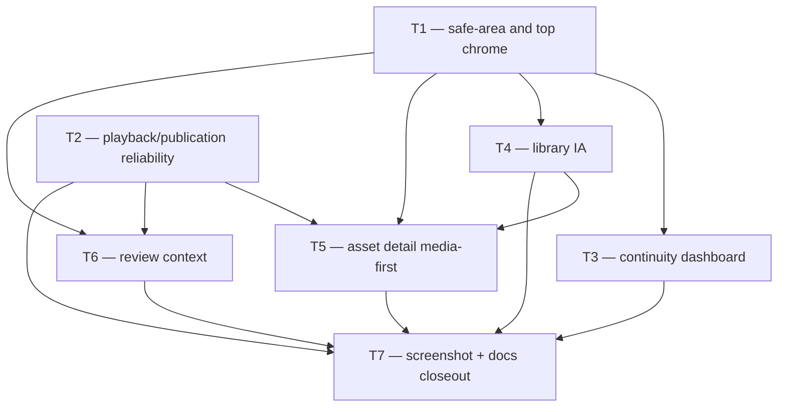

# Plan: S-215 — Mobile Streaming-Style Organization & Continuity Pass

> **Status:** Active — authored 2026-06-28 from a fresh post-rebuild screenshot audit. Implementation pending approval.
> **Roadmap phase:** `S-215`, a non-blocking mobile product follow-up on top of S-210 that focuses on organization, continuity, and media-first wayfinding.
> **Tasks ledger:** `docs/tasks/s-215-mobile-streaming-organization-pass.md`

## Purpose

S-210 materially improved the mobile product surface: Home now carries live content,
recent assets are visible, quick actions are clearer, and several screens reclaimed
space and action hierarchy. After recompiling the Android app and re-running the
Maestro screenshot suite on 2026-06-28, however, the app still reads more like a
governed operations console than a streaming-style working surface.

The issue is no longer visual inconsistency. The remaining gap is **organization**:
what the user sees first, how they resume work, how a library grows without becoming
a list of rows, and whether detail/review screens are anchored around media instead of
technical workflow nouns.

S-215 documents and implements that next pass without removing governance,
compliance, upload, review, or publication functionality. The goal is to reorganize
the same product into a more intuitive, content-led flow.

## Evidence: screenshot audit (2026-06-28)

Audit source:

- refreshed screenshots in `mobile/artifacts/screenshots/01_auth_login.png` through
  `16_review_approved.png`
- failure-state capture `mobile/artifacts/screenshots/review_publish_failure.png`

### Current-state findings

| # | Severity | Finding | Screenshot evidence |
|---|---|---|---|
| F1 | 🔴 High | **Home is improved but still not continuity-led.** The dashboard shows recent assets and review count, but there is no "continue reviewing", "resume playback", or "next required action" organization. It still asks the user to choose a section rather than continuing their current workflow. | `02_home` |
| F2 | 🔴 High | **Library organization is missing.** The asset surface still lacks search, filters, sort, grouping, and a distinction between "empty workspace" and "no results for current view". At scale this becomes a flat catalog with no browsing model. | `03_asset_list` |
| F3 | 🔴 High | **Asset detail is not media-first yet.** Playback is present but visually secondary; metadata and compliance still carry more visual weight than the actual media object. A streaming-style surface would anchor the page around preview, duration, language, and next action. | `04_asset_detail` |
| F4 | 🔴 High | **Review surfaces are workflow-first, not editorial-first.** `Task review-task-seed-1`, raw asset ids, and state badges dominate the first read. The reviewer should first understand title, project, language pair, duration, and why this item is in queue. | `14_review_inbox`, `15_review_detail`, `16_review_approved` |
| F5 | 🔴 High | **Top chrome still clips into the system status area.** Several screen kickers (`ASSETS`, `UPLOAD`, `REVIEW`, `GOVERNANCE`) sit visibly too close to or under the Android status bar, making the surface feel unfinished. | `03_asset_list`, `04_asset_detail`, `05_upload`, `11_compliance_center`, `14_review_inbox` |
| F6 | 🟡 Medium | **Runtime trust is still shaky on the exact surfaces that should sell the product.** The screenshot suite could approve a review task, but publication never rendered `Published`; separately the review playback panel showed a `401` playback error. These are not the same bug, but together they undercut the media/review story and must gate UX closeout. | `review_publish_failure.png` |

## Objective

- Reorganize the mobile product around **continuity first**: what needs attention,
  what is ready, and where the user should resume.
- Turn the asset library into a **browsable collection**, not a flat list.
- Make asset and review detail screens **media-first** while preserving governance
  and audit access.
- Clarify review context with editorial signals before workflow identifiers.
- Correct top-chrome safe-area problems and treat playback/publication runtime issues
  as a pre-closeout gate.

## Scope

### Included

- Home/dashboard information architecture and continuity affordances.
- Library search/filter/sort/grouping and empty/no-results distinction.
- Media-first asset/review cards and detail-surface organization.
- Top-chrome/safe-area corrections on affected mobile screens.
- Publication/playback runtime stabilization on the reviewed mobile paths.
- Screenshot baseline refresh and docs sync.

### Excluded

- New backend write workflows unrelated to playback/publication correctness.
- Replacing the stack navigator with a mandatory bottom-tab shell. This exclusion is
  provisional: a future community/discovery surface may require a dedicated tab, and
  that decision must be reopened before the bottom-tab option is foreclosed by further
  stack-navigation investment.
- New pipeline stages (`S-130+`) or schema unrelated to mobile product organization,
  except additive read-shape support that S-215 explicitly records.
- Removing governance/compliance surfaces or reducing fail-closed behavior.

## Design decisions

### D1 — Preserve the existing product surface; reorganize it

S-215 does not remove upload, compliance, review, or publication. It changes their
presentation order and navigation emphasis so the product feels content-led rather
than action-led.

### D2 — Continuity beats menu navigation

Home should answer "what should I do next?" before "where do you want to go?".
Dashboard content should be organized around resume/review/publish continuity, then
recent assets, then quick actions.

### D3 — Library needs collection mechanics

The asset surface needs a browsing model: search, status filters, sort/grouping, and
a visible distinction between workspace-empty and query-empty. The current empty-state
CTA pattern remains, but collection state becomes first-class.

### D4 — Media object before technical detail

Asset and review detail should lead with preview/player, title, language, duration,
state, and next action. Raw ids stay available in a technical-details group but are
not primary reading material.

### D5 — Editorial context before workflow ids in review

Review inbox and detail must foreground the content being reviewed: title, project,
source/target language, duration, and current blocking reason. Task ids and internal
scope ids are secondary metadata.

### D6 — Reliability gates UX closeout

S-215 does not treat the publication state bug or the playback `401` as visual nits.
The organization pass is not closed until those flows are either repaired or narrowed
to an explicit, visible fail-closed state with updated screenshots and evidence.

### D7 — Streaming-style does not mean consumer-only, but the community path must stay open

This is still a professional governed workspace, not a consumer OTT app. The target
feel is "operator tooling with clear content hierarchy", not "marketing Netflix clone".
The visual language from `DESIGN.md` and ADR-029 remains authoritative.

However, "Published" is not a terminal badge — it is a potential launch point for a
community-facing surface. S-215 IA decisions in T3 (Home) and T4 (Library) must not
foreclose this path:

- **T3 Home:** the dashboard layout must reserve a named composition slot for a future
  community-engagement module (community feedback, shared-stream activity). The slot
  can be empty or hidden at this stage; it must exist in the component structure so it
  can be filled without redesigning the page hierarchy.
- **T4 Library:** the grouping model must treat project / target-language pair as a
  first-class browsing dimension alongside status filters, so a community channel or
  collection layer can be layered on top without replacing the underlying IA.

## Backend/read-shape follow-ups recorded

| Follow-up | Need | Notes |
|---|---|---|
| X-S-215-1 | Asset/review cards need richer read data (`duration_ms`, `source_language`, `target_language`, optional poster/thumbnail key) | Placeholder tiles from S-210 are acceptable interim behavior, but real collection browsing needs these fields. |
| X-S-215-2 | Review rows need a stable blocking/context summary (`ready for review`, `approved waiting to publish`, `publish failed`, etc.) | Can be derived client-side only if current API shape is sufficient; otherwise record additive read contract. |
| X-S-215-3 | Published content requires a community-accessible read contract: channel/collection grouping keyed by project + target language, public asset metadata (title, target language, duration, thumbnail), and a stable public identifier distinct from internal asset UUIDs. | S-215 does not implement this. It is recorded explicitly so it is not silently assumed at closeout. Required before any community/discovery surface can be built on top of the publication state. |

## Affected components

| Layer | Path | Change |
|---|---|---|
| Mobile screens | `mobile/src/screens/{HomeScreen,AssetListScreen,AssetDetailScreen,ReviewInboxScreen,ReviewDetailScreen}.tsx` | information architecture, continuity, media-first hierarchy |
| Mobile components | `mobile/src/components/{Card,StateView,ScreenHeader,ActionBar,PlaybackStateView}.tsx` | layout/wayfinding/status presentation adjustments |
| Mobile hooks/api | `mobile/src/hooks/*`, `mobile/src/api/{playback,review}.ts` | dashboard aggregation, filter state, publish/playback flow correctness |
| Navigation | `mobile/src/navigation/RootNavigator.tsx` | wayfinding affordances only; stack model retained unless explicitly reopened |
| Backend/runtime if required | `apps/api`, `apps/worker-runner`, `crates/*` on playback/publication path | only if needed to resolve F6 |
| Docs | this plan, task ledger, roadmap, screenshot artifacts | status sync and evidence |

## Phased rollout

| Phase | Theme | Tasks |
|---|---|---|
| P0 | Reliability and chrome | T1, T2 |
| P1 | Continuity and library organization | T3, T4 |
| P2 | Media-first detail and review context | T5, T6 |
| P3 | Evidence and closeout | T7 |

## Task decomposition

| Task | Title | Effort (provisional) | Depends on |
|---|---|---|---|
| T1 | Safe-area and top-chrome normalization | S | — |
| T2 | Playback/publication reliability gate | M | — |
| T3 | Home continuity dashboard | M | T1 |
| T4 | Library information architecture pass | M | T1 |
| T5 | Media-first asset detail pass | M | T1, T2, T4 |
| T6 | Review inbox/detail editorial context pass | M | T1, T2 |
| T7 | Screenshot, BDD, and docs closeout | S | T1–T6 |

RRI must be computed per task before implementation. This plan records the sequence,
scope, and acceptance intent; it does not pre-authorize execution.

## Dependency flow

## Verification expectations

- `cd mobile && npm run typecheck`
- `cd mobile && npm test -- --runInBand`
- Maestro screenshot suite re-run with fresh Android build
- refreshed screenshots must show corrected top chrome and updated organization
- publication path must either render the expected published state or fail with an
  explicit, reviewed product state and synchronized test evidence
- `make qa-docs`

## Related

- `DESIGN.md`
- `docs/plan/s-190-mobile-ux-usability-pass.md`
- `docs/plan/s-210-mobile-product-experience.md`
- `docs/tasks/s-210-mobile-product-experience.md`
- `docs/adr/ADR-029-mobile-as-sole-authenticated-product-surface.md`
- `mobile/artifacts/screenshots/review_publish_failure.png`
