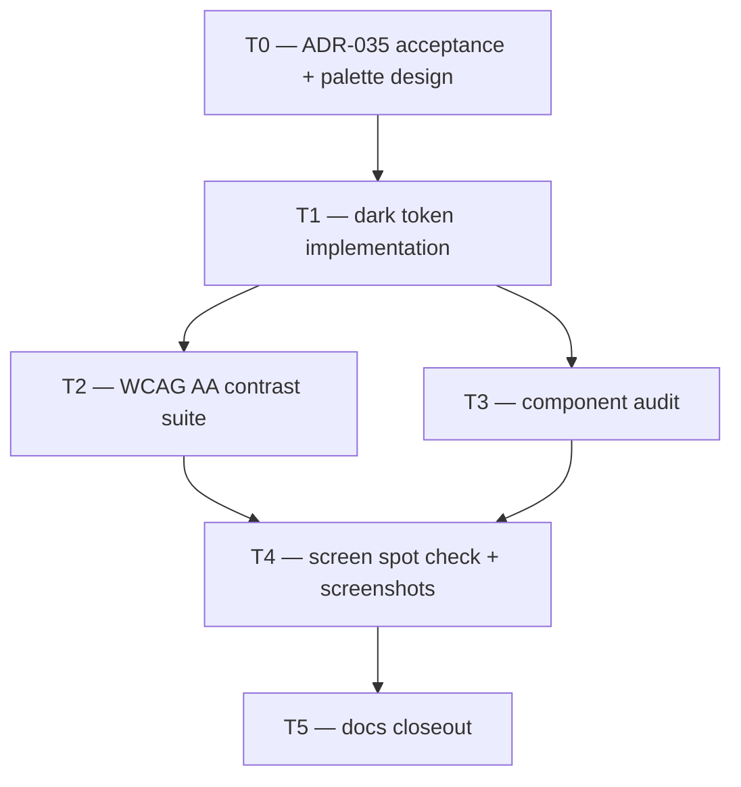

# Plan: S-220 — Mobile Dark Theme (Netflix-style dark canvas)

> **Status:** Done 2026-06-29 — T0–T5 complete. Dark canvas `#141414` + Netflix-red `#E50914` shipped. Follow-ups X-S-220-1–3 deferred.
> **Roadmap phase:** `S-220`, a mobile product follow-up on top of S-215 that replaces the light ink+teal theme with a dark canvas and bold red accent.
> **Tasks ledger:** `docs/tasks/s-220-mobile-dark-theme.md` (to be created at T0 approval)

## Purpose

After the S-215 organization and palette pass, the app reads as a well-structured
SaaS tool but still lacks the visual confidence of professional media platforms
(Frame.io, Blackbird, Netflix). The team has decided to shift the mobile product to
a **dark canvas with a bold red accent** — a pattern that:

- foregrounds video content (dark backgrounds make thumbnails pop)
- reads as a media-first product, not an operations console
- matches the reference direction ("like Netflix") explicitly requested at S-215 closeout

S-220 implements this direction without removing any governance, compliance, or
publication surface, and without changing any route, testID, or API contract.

## Design decisions

All design decisions are recorded in **ADR-035**. Summary:

- **D1:** Dark canvas (`#141414`) as default — not OS dark-mode, always dark.
- **D2:** Bold red accent (`#E50914` or DubBridge-calibrated derivative) replacing teal.
- **D3:** Ink scale inverted for dark-on-dark reading.
- **D4:** Surface scale (`raised`, `sunken`, `border`, `borderStrong`) recalibrated.
- **D5:** Semantic colors (`success`, `warning`, `danger`, `info`) recalibrated, not removed.
- **D6:** WCAG AA is a hard gate — contrast tests required for every interactive pair.
- **D7:** DESIGN.md must mirror shipped tokens before slice closes.
- **D8:** No component may reference a light-canvas assumption after S-220 lands.

## Scope

### Included

- Token system replacement: `mobile/src/theme/tokens.ts` and `DESIGN.md`.
- Component library audit: every primitive in `mobile/src/components/` verified for
  dark-canvas correctness (no hardcoded light-surface colors).
- Screen-level spot check: Home, AssetList, AssetDetail, ReviewInbox, ReviewDetail
  verified visually via Maestro screenshot suite.
- Contrast certification: `theme.tokens.test.js` extended to cover new dark pairs.
- Screenshot baseline refresh: all Maestro artifacts updated to dark-theme baseline.
- DESIGN.md sync.

### Excluded

- OS-level light/dark toggle (X-S-220-1 — deferred).
- Poster/thumbnail scrim implementation (X-S-220-2 — deferred, needs real media data).
- New navigation structure, routes, or backend contracts.
- Removing or modifying any governance/compliance/publication surface.

## Affected components

| Layer | Path | Change |
|---|---|---|
| Theme tokens | `mobile/src/theme/tokens.ts` | Full dark-canvas token replacement |
| Design doc | `DESIGN.md` | Color block sync |
| Components | `mobile/src/components/*.tsx` | Audit for hardcoded light colors |
| Tests | `mobile/__tests__/theme.tokens.test.js` | New WCAG AA contrast assertions |
| Screenshots | `mobile/artifacts/screenshots/` | Full baseline refresh |
| Docs | This plan, task ledger, roadmap | Status sync |

## Phased rollout

| Phase | Theme | Tasks |
|---|---|---|
| P0 | ADR acceptance and token design | T0 |
| P1 | Token implementation and contrast gate | T1, T2 |
| P2 | Component audit and screen verification | T3, T4 |
| P3 | Evidence and closeout | T5 |

## Task decomposition (provisional)

| Task | Title | Effort | Depends on |
|---|---|---|---|
| T0 | ADR-035 acceptance and token palette design | S | — |
| T1 | Dark token implementation (`tokens.ts` + `DESIGN.md`) | M | T0 |
| T2 | WCAG AA contrast certification suite | S | T1 |
| T3 | Component library dark-canvas audit | M | T1 |
| T4 | Screen spot check and Maestro screenshot refresh | M | T1, T2, T3 |
| T5 | Docs and roadmap closeout | S | T1–T4 |

RRI must be computed per task before any task is presented or executed.

## Dependency flow

## Verification expectations

- `cd mobile && npm run typecheck`
- `cd mobile && npm test -- --runInBand` — including new contrast assertions
- Maestro screenshot suite re-run with dark-theme APK
- All refreshed screenshots show dark canvas and red accent
- `make qa-docs`

## Open follow-ups recorded

| ID | Need |
|---|---|
| X-S-220-1 | OS dark/light toggle — ship dark by default; honor system preference in a future slice |
| X-S-220-2 | Poster/thumbnail scrim — media cards need a background scrim when poster images are light-dominant |
| X-S-220-3 | Semantic badge audit — `successSubtle`/`warningSubtle`/`dangerSubtle` need dark-appropriate equivalents |

## Related

- `ADR-035-mobile-dark-theme-netflix-style.md`
- `ADR-029-mobile-as-sole-authenticated-product-surface.md`
- `DESIGN.md`
- `docs/plan/s-215-mobile-streaming-organization-pass.md`
- `docs/tasks/s-215-mobile-streaming-organization-pass.md`
