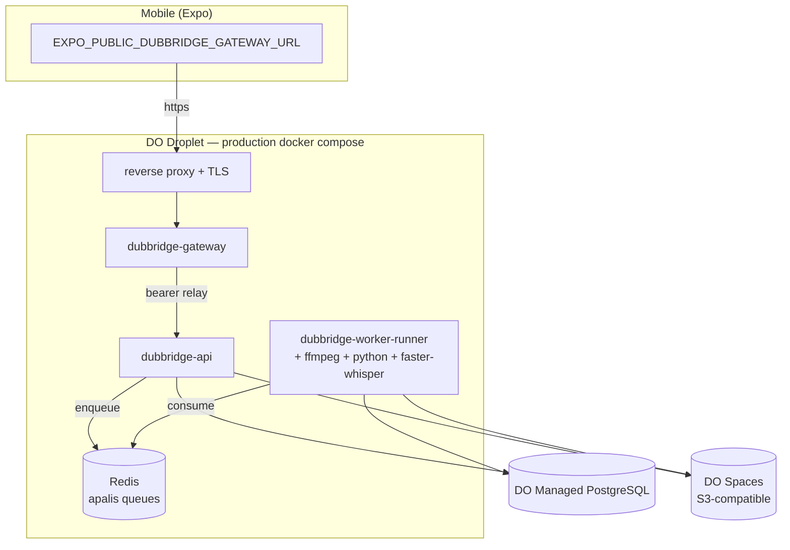
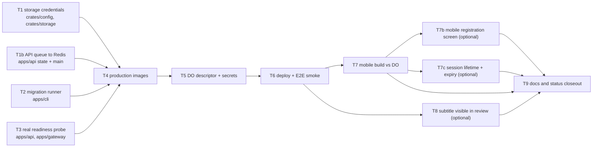

# Plan: S-230 — POC v1 deployment (Digital Ocean)

## Objective

Take the pipeline that already exists in code — login, upload, rights gate, HLS
preparation, ASR, subtitles, human review, publication, in-app playback — and
make it a running, publicly reachable POC on Digital Ocean within a 10-day
window, without adding any technology the repository does not already depend on.

This slice is a **deployment-enablement slice**, not a product slice. Every task
exists because something concrete blocks a real deploy today.

## Scope decision (owner, 2026-08-16)

| Decision | Resolution |
|---|---|
| POC v1 product scope | Subtitles + governed review/publication. `S-150` (translation + dubbing) is **explicitly out** and stays parked. |
| Deployment target | Single Digital Ocean droplet + production Docker Compose. Not App Platform. |
| Gateway | Deployed as-is. Its request/response buffering is accepted as recorded debt and bounded by lowering the POC upload limit. |

### Why S-150 is out

The remaining `S-150` work is `T2c-v` (RRI 50), `T2c-vi-a` (51), `T2c-vi-b` (31),
`T3a` (42), `T3b` (44), `T3c` (53), `T4` (26), `T5` (68–70, mandatory
decomposition into ~8 children), `T6` (71, mandatory decomposition), and `T7`.
Two of those parents cannot be executed at all until they are decomposed and
re-approved. Under this repository's governance contract — RRI scoring, phase-1
and phase-2 band-routed review, Reflection passes, unit coverage certification,
owner verification per task — that is a multi-week slice. It does not fit in ten
days alongside a first deployment, and attempting both would deliver neither.

The `S-150-T2c-v` Redis-adapter decision the owner parked therefore stops being a
blocker for this window: it belongs to a slice that is out of POC scope.

### What POC v1 demonstrates

```text
mobile login (S-200) -> upload + rights gate (S-010, ADR-008)
  -> HLS preparation (S-120) -> ASR transcription (S-130)
  -> subtitle generation (S-140) -> review task (S-160)
  -> human approval -> publication gate (ADR-030) -> in-app HLS playback (S-125, S-127)
```

Every stage above is already implemented and closed on the roadmap. Nothing in
this slice adds a pipeline stage.

## Position on Redis (owner constraint: no new technologies)

Redis is **not** a new technology for this deployment. It is already the apalis
backend for all three live job queues — preparation, transcription, and subtitle
— defined in `crates/jobs/src/lib.rs` (`define_redis_job_queue!`) and wired into
the worker topology in `apps/worker-runner/src/main.rs`. `crates/config` has
carried a required `redis_url` since S-030, and `apps/gateway` additionally
depends on the `redis` crate for its session store.

Removing Redis would mean rewriting three working queues and the gateway session
store inside the POC window. It is kept. This slice adds **no** technology beyond
what the repository already compiles against: PostgreSQL, Redis, an S3-compatible
object store (DO Spaces replaces MinIO — same adapter, same `object_store` crate),
ffmpeg, and Python/faster-whisper.

The only genuinely new *operational* pieces are a TLS-terminating reverse proxy
on the droplet and the production Compose descriptor itself — both unavoidable
for any public deployment, and neither is a new application dependency.

## Verified gap analysis

Each item below was confirmed against the current tree, not inferred.

### G1 — S3 credentials and region are not wired (blocking)

`crates/storage/src/s3.rs:17` builds the adapter with
`AmazonS3Builder::new()`. In the pinned `object_store` revision, `new()` is
`Default::default()` and reads nothing from the environment — only `from_env()`
evaluates `AWS_*` variables (`aws/builder.rs:572` vs `:606`). With no explicit
credentials, `build()` falls through to `WebIdentityProvider` /
`InstanceCredentialProvider` (`aws/builder.rs:1191`, `:1233`), neither of which
exists on a Digital Ocean droplet. Region silently defaults to `us-east-1`
(`aws/builder.rs:1152`).

`infra/local/docker-compose.yml` sets `AWS_ACCESS_KEY_ID` / `AWS_SECRET_ACCESS_KEY`
in the container environment, but nothing in the Rust path consumes them.

**Consequence:** the first write to DO Spaces fails, at runtime, after the API
has already reported itself healthy.

### G2 — No migration runner in the production path (blocking)

`sqlx::migrate!("../../infra/migrations")` appears only inside `#[cfg(test)]`
modules and test helpers (`crates/db/src/user_account.rs:184`,
`apps/api/src/routes/auth.rs:583`, three worker-runner test modules). No binary,
CLI subcommand, or startup hook applies the 29 files in `infra/migrations/` to a
real database. `apps/cli` is a skeleton that loads config and logs one line.

**Consequence:** a fresh DO database has no schema and there is no supported way
to give it one.

### G3 — `/health/ready` is a stub (blocking for a health-checked deploy)

`apps/api/src/lib.rs:49` returns `status: "ready"` unconditionally. It never
touches PostgreSQL, Redis, or storage. `apps/gateway` has the same pair.

**Consequence:** a droplet health check or restart policy keeps a broken instance
in service. This is precisely the failure mode G1 produces.

### G4 — No production container images (blocking)

Dockerfiles exist only for the three Python workers. There is none for
`apps/api`, `apps/gateway`, or `apps/worker-runner`. The worker image is the
non-trivial one: `apps/worker-runner` shells out to `ffprobe`/`ffmpeg`
(`crates/media/src/lib.rs:11`, `:76`) and spawns
`python3 workers/asr-worker-py/main.py` as a subprocess
(`apps/worker-runner/src/main.rs:184-227`), so Rust binary, ffmpeg, Python, and
faster-whisper must coexist in one image.

### G5 — No production deployment descriptor (blocking)

`S-030` Phase 3 ("production deployment descriptor + secret-manager injection
boundary") is explicitly deferred on the roadmap. `infra/local/docker-compose.yml`
carries a banner stating it is never the production descriptor (ADR-026), and
that is correct — so there is nothing to deploy with.

### G6 — No `.env.example`, and `config/production.toml` holds placeholders

The roadmap records `.env.example` as delivered by S-030 Phase 0, but no such
file exists at the repository root. `config/production.toml` carries
`*.dubbridge.example` hostnames for every gateway/OAuth field. An operator has no
authoritative list of required `DUBBRIDGE_*` variables.

### G7 — ASR defaults to `large-v3`

`workers/asr-worker-py/main.py:50` defaults `ASR_MODEL_SIZE` to `large-v3` with
`device="auto", compute_type="auto"`. On a CPU droplet that is several GB of
weights and very slow. It is environment-configurable, so this is a deployment
parameter, not a code defect — but it must be set deliberately.

### G8 — Gateway buffers whole bodies (accepted debt for the POC)

`apps/gateway/src/proxy.rs:100` does `to_bytes(body, usize::MAX)` and then
`.to_vec()` — the entire request body in memory, twice, with no limit. Responses
are buffered the same way in `relay_upstream_response`.

This cancels the bounded-memory upload path the API deliberately implements:
`spool_upload_field` streams the multipart field to a `tempfile::NamedTempFile`
while checksumming, then uploads from the path
(`apps/api/src/routes/ingestion.rs:196-204`), under a 500MB
`DefaultBodyLimit` (`MAX_UPLOAD_BYTES`, `:13`). That streaming behavior is what
S-080 delivered for X9.

**Owner decision:** accepted for the POC. Mitigated by lowering the effective
upload limit and sizing droplet RAM accordingly; recorded as debt, not fixed in
this window.

### G9 — Review tasks are not bound to the subtitle they approve

`apps/worker-runner/src/review_enqueue.rs:35` creates review tasks with
`subtitle_artifact_id: None`, and the mobile review surface has no way to display
subtitle content. The full fix is `S-150-T6` (RRI 71, generation-aware exact
version binding, decomposition mandatory) and is out of scope.

A POC-scoped subset — bind the already-existing nullable column at creation,
expose a read endpoint, render the text — is tracked as the one optional product
task in this slice.

### G10 — The API enqueues preparation jobs into an in-process `Vec` (blocking)

Added 2026-08-16 by the S-070/S-090/S-095/S-150 coverage review below. This is
the most consequential gap in the slice and it fails **silently**.

`apps/api/src/main.rs:29` builds its state with `AppState::with_auth_service(..)`.
That constructor — like `AppState::new` and `AppState::with_workspace_service` —
hardcodes `preparation_queue: Arc::new(InMemoryPreparationJobQueue::default())`
(`apps/api/src/state.rs:31`, `:49`, `:67`). `InMemoryPreparationJobQueue` is a
`Mutex<Vec<PreparationJob>>` whose `enqueue` only pushes onto that vector
(`crates/jobs/src/lib.rs:72`–`94`).

The worker-runner, meanwhile, consumes from Redis: it connects
`RedisPreparationJobQueue`, `RedisTranscriptionJobQueue` and
`RedisSubtitleJobQueue` at `apps/worker-runner/src/main.rs:76`–`88` and registers
its three workers against those backends.

The two halves are therefore not connected. `apps/api` never opens a Redis
connection at all. On a deployed instance, `POST /ingest/{token}/finalize`
succeeds, `enqueue` returns `Ok(())`, the job is appended to a vector inside the
API process, and no preparation, transcription or subtitle work ever runs. No
review task is ever created, so the reviewer surface stays empty forever. Every
health check is green and every request returns 2xx.

`AppState::with_preparation_queue` (`apps/api/src/state.rs:75`) already accepts an
injected queue, but it is unused by `main.rs` and sets `auth_service: None`, so it
cannot currently carry both an authenticated API and a real queue. The fix is a
constructor that takes both, plus Redis wiring in `main.rs`.

Tracked as `S-230-T1b`.

### G11 — `config/production.toml` has no `[auth]` block, so no binary boots

Added 2026-08-16 by the same review.

`AppConfig::validate()` rejects `self.auth.is_none()` in production-like
environments (`crates/config/src/lib.rs:196`–`200`), and `config/production.toml`
contains no `[auth]` table — neither does `config/staging.toml`; only
`config/local.toml:31` has one. `AuthSettings` (`crates/config/src/lib.rs:110`–
`118`) has six fields, and `issuer`, `audience`, `rsa_public_key_path` and
`clock_skew_leeway_seconds` carry no serde default. Only `jwt_expiry_hours` has
one (24, `crates/config/src/lib.rs:146`).

`AppConfig::load()` merges env with `Env::prefixed("DUBBRIDGE_").split("__")`
(`crates/config/src/lib.rs:160`), so the whole block must be supplied as
double-underscore variables:

- `DUBBRIDGE_AUTH__ISSUER`
- `DUBBRIDGE_AUTH__AUDIENCE`
- `DUBBRIDGE_AUTH__RSA_PUBLIC_KEY_PATH`
- `DUBBRIDGE_AUTH__JWT_SECRET`
- `DUBBRIDGE_AUTH__CLOCK_SKEW_LEEWAY_SECONDS`

All three binaries call `AppConfig::load()` (`apps/api/src/main.rs:19`,
`apps/gateway/src/main.rs:8`, `apps/worker-runner/src/main.rs:159`), so each one
needs the complete set; a partial set fails closed at startup with
`auth settings are required in production-like environments`.

**Operator trap: two env conventions coexist.** `AuthSettings::from_env()`
(`crates/config/src/lib.rs:361`–`382`) reads the same fields under *single*
underscores — `DUBBRIDGE_AUTH_ISSUER`, `DUBBRIDGE_AUTH_JWT_SECRET`, and so on —
but its only non-test caller is the legacy `AppConfig::from_env()`
(`crates/config/src/lib.rs:222`, itself marked "Do not add new callers — use
load() instead"). No binary uses it. An operator who sets the single-underscore
names gets no error and no effect: Figment ignores them and validation then fails
for a missing `[auth]` block. The environment template must therefore use the
double-underscore names exclusively and say why.

Note that `rsa_public_key_path` is a **required field that ADR-031 made dead** —
`apps/api` issues and verifies HS256 tokens and never reads an RSA key.
`config/local.toml:34` sets it to `/dev/null`. Removing it is cleanup, not POC
work; the POC supplies a placeholder and records the vestige as debt.

Absorbed into `S-230-T5` acceptance criteria rather than a separate task, since
T5 already owns the production descriptor and the secret boundary.

### G12 — The mobile app has no registration surface (non-blocking, owner-promoted)

Surfaced as a secondary finding by the coverage review below and promoted to
planned work by the owner on 2026-08-16.

The backend half is complete. `apps/api/src/routes/auth.rs:23` mounts
`POST /auth/register`; the handler returns `(StatusCode::CREATED,
Json(AuthSuccessResponse))` — the **same payload shape as login**, so a
successful registration can authenticate the caller immediately with no second
round-trip. `apps/gateway/src/auth/mod.rs:16` already relays it, so the public
path exists end to end.

The mobile half does not exist. `mobile/src/screens/` contains `LoginScreen.tsx`
and no registration surface, and `AuthContextValue`
(`mobile/src/auth/AuthProvider.tsx:21`–`28`) exposes only `login`, `logout` and
the `onSessionRotation` stub — there is no `register` method to call.

**Consequence:** every POC tester account has to be created by the operator with
a direct API call. That is workable for a single-user demo and unworkable for
handing the build to two or three people.

Tracked as `S-230-T7b`, droppable. If it is dropped, the `S-230-T6` runbook step
that creates the first account by direct call remains the documented path.

### G13 — 24h tokens, no refresh, and a stale stored session reads as authed (non-blocking, owner-promoted)

Same origin: a secondary coverage-review finding promoted to planned work by the
owner on 2026-08-16.

`jwt_expiry_hours` defaults to 24 (`crates/config/src/lib.rs:146`) and nothing
issues refresh tokens. The client half of the expiry contract *is* implemented:
`mobile/src/api/client.ts:57` maps 401 to `session_expired`, and roughly fifteen
call sites act on it by calling `auth.logout()` (for example
`mobile/src/screens/useUploadFlow.ts:72`, `:82`, `:93`;
`mobile/src/screens/useReviewInboxLoader.ts:108`, `:123`). This is **not** a
missing-code gap and must not be planned as one.

Two things are genuinely open:

1. **The expiry value is undecided for production.** There is no `[auth]` block
   in `config/production.toml` at all (G11), so today the deployed value would
   be whatever the template happens to set, or the 24h serde default by
   omission.
2. **A stored session is trusted without validation at launch.**
   `hydrateStoredSession` → `acceptStoredSession`
   (`mobile/src/auth/AuthProvider.tsx`) reads the persisted session and sets
   status `authed` without checking expiry, so an app opened after the token
   expired renders the authenticated UI and only bounces to login on the first
   request that comes back 401.

**Consequence:** bounded and cosmetic at POC scale — a tester sees one screen
flash before being returned to login, and a long demo can require one re-login.
No data is lost except an in-flight upload (`useUploadFlow.ts:72`).

Tracked as `S-230-T7c`. The refresh-token path itself stays out of scope and is
recorded as debt in T9.

## Coverage review against S-070, S-090, S-095 and S-150 (2026-08-16)

Owner question: does anything in those four slices have to move into S-230 for
the POC to be functional? Checked against the mounted runtime surface, not
against the slice documents.

**Conclusion: no. None of the four contributes anything the POC path needs.** The
review did, however, surface G10 and G11 above, which were missing from the
original gap list and are both blocking.

| Slice | Runtime evidence | Verdict |
|---|---|---|
| `S-070` production identity hardening (JWKS, key rotation) | ADR-031/S-200 inverted this: `apps/api/src/routes/auth.rs:22`–`23` serves `/auth/login` and `/auth/register`; credentials are bcrypt (`crates/auth/src/credentials.rs:1`) and tokens are self-issued HS256 with algorithm pinning (`crates/auth/src/issuer.rs:79`). There is no external IdP for JWKS to discover. | **Not needed.** The roadmap's "S-070 (JWKS) remains recommended before production device login" note predates ADR-031 and is stale. |
| `S-090` platform ingest | No platform router is mounted: `apps/api/src/lib.rs:30`–`38` merges only auth, compliance, ingestion, notifications, playback, review and workspace. `S-090-C4`–`C7` are deferred and no `/ingests/platform` route exists. | **Not needed.** Zero runtime surface. |
| `S-095` live recording | Same — no recording routes are mounted; the recorder work is ex-T3–T8, deferred. | **Not needed.** |
| `S-150` translation and dubbing | `apps/worker-runner/src/main.rs:105`–`109` registers exactly three workers (preparation, transcription, subtitle). No translation worker, no fan-out call in the runtime path, and no translation or dubbing UI anywhere under `mobile/src`. | **Not needed.** Parking it leaves no dangling runtime edge. |

Secondary findings from the same review. None is blocking, but the owner
promoted the first two into planned work on 2026-08-16 — they are written up as
G12 and G13 above and tracked as `S-230-T7b` and `S-230-T7c`. The remaining
three stay as recorded observations.

- **The Spaces bucket can stay private.** `S3Adapter::object_url` returns an
  `s3://` URL (`crates/storage/src/s3.rs`), and playback segments are served
  through `GET /assets/{id}/playback/segments/{filename}`
  (`apps/api/src/routes/playback.rs:39`–`42`), so no public-read bucket policy is
  required. This is a favourable finding for ADR-032.
- **Segments are read fully into memory.** `StorageAdapter::get` returns
  `Vec<u8>` (`crates/storage/src/adapter.rs`), so each segment request allocates
  the whole segment. Fine at POC scale, same family of debt as G8.
- **The gateway's `[gateway.oauth]` block is dead config.** `auth_router()`
  mounts only `/login` and `/register` relays (`apps/gateway/src/auth/mod.rs:15`–
  `16`); the OAuth `authorize`/`callback` handlers in `login.rs` are not mounted.
  The block must still hold non-localhost URLs to pass
  `GatewaySettings::validate`, so the placeholders stay.

## Demo-quality review (2026-08-16)

Owner question: does the POC as scoped show the product's potential, or does the
scope need to change? The gap list above answers "will it run"; this section
answers "will it read as DubBridge". None of these findings is deploy-blocking —
they are demo-narrative gaps, evaluated against the runtime surface.

**Framing.** POC v1 stops at `S-140`. `S-140` turns the S-130 timed transcript
into a canonical subtitle artifact (`docs/plan/s-140-subtitle-generation.md`
§Purpose) — subtitles in the **source** language. Cross-language output is
`S-150`, parked. `README.md:3` states the product as "takes a video filmed in one
language and turns it into a version people can watch in another — with new
spoken audio and subtitles". The POC therefore demonstrates the governed pipeline
and the platform invariants end to end, and demonstrates **no cross-language
capability at all**. That is a deliberate consequence of the frozen scope, not a
defect, but it decides which audience the POC is for and must be stated
explicitly rather than discovered during a demo.

### G14 — Language renders as a raw UUID in the reviewer surface

`ReviewInboxScreen.tsx:29` renders `formatId(task.target_language_id) ||
"Language TBD"` as the card title, and `ReviewDetailScreen.tsx:47` renders the
full `task.target_language_id`. `formatId` (`mobile/src/format/index.ts:65`) only
truncates a string; it resolves nothing. `project_target_languages` already
carries `source_lang` / `target_lang` and the mobile app already renders them in
`ProjectDetailScreen.tsx:22`, `:54`.

**Consequence:** in a localization product, the reviewer's primary axis is shown
as `a3f2c1d0…`. Low cost to fix (resolve the id to its language pair on the
review DTO); disproportionate effect on how the demo reads.

### G15 — No pipeline visibility and no "ready to review" signal

`apps/api/src/lib.rs:30`–`38` mounts auth, compliance, ingestion, notifications,
playback, review and workspace. There is no transcription/subtitle/preparation
status route, and `mobile/src/api/` has no asset-processing client. The mobile
surface shows only `asset.status` (`AssetDetailScreen.tsx:59`, `:109`), which is
the ingestion status.

Notifications exist but fire on the wrong side of the pipeline:
`apps/api/src/review_gate.rs` inserts them in `approve_review_task` (`:224`),
`reject_review_task` (`:258`) and `publish_review_task` (`:315`) — reviewer
decisions. `apps/worker-runner/src/review_enqueue.rs` emits none when the review
task is created.

**Consequence:** after finalize, the uploader sees a terminal-looking state while
ffmpeg and faster-whisper run for minutes, with no progress, no ETA, and no
notification when subtitles are ready. Discovering the result requires manually
opening the review inbox. On a live demo this is several minutes of dead screen
at the exact moment the product is supposed to be working.

### G16 — T8 is the demo's core and is currently the second thing dropped

The ten-day sequence drops `T8` (subtitle visible in review) second, ahead of
only `T7c`. The plan itself records the cost: "a reviewer approving content they
cannot see is a visible hole in the product story". Combined with G14, dropping
T8 leaves a reviewer approving an unnamed language whose content is not shown.

**Recommendation:** T8 is not interchangeable with T7b as buffer. Reordering the
soft-day drop list so T8 survives is a scope-neutral change to the sequence, not
new work.

### G17 — Configured target languages are inert in the POC path

`ProjectDetailScreen.tsx:22`, `:54`–`:74` lets an operator see per-project
`source_lang` / `target_lang` rows, and `apps/worker-runner/src/main.rs:105`–
`109` registers exactly three workers (preparation, transcription, subtitle) with
no translation consumer. A POC user can therefore configure target languages that
nothing acts on.

**Consequence:** the UI advertises the parked capability. Either the demo script
avoids that screen, or the surface says explicitly that translation targets are
not yet processed. This is copy, not code.

### Assessment

The POC is sound for a **platform/risk** audience: it proves the fail-closed
rights gate (ADR-008), durable audit (ADR-018), HITL review and the publication
gate (ADR-030), authorized HLS delivery (ADR-032), and a real async pipeline on
real infrastructure — the parts that are expensive to retrofit.

It is weak for a **market/product** audience: nothing in the demonstrated path is
cross-language, so the differentiator the name and README promise is absent. No
cheap path to add it exists inside this window — the remaining `S-150` surface to
reach translated subtitles alone is `T2c-v` (50), `T2c-vi-a` (51), `T2c-vi-b`
(31) plus the `T3a`/`T3b` worker tasks (42, 44). Closing this gap is a separate
slice after the deploy, not a scope adjustment to S-230.

G14, G15 and G16 are the highest value-per-cost changes to the demo and are all
inside the existing task surface (G14/G15 are small additions; G16 is a
sequencing decision). They are recorded here as findings for owner decision, not
adopted into scope.

### The market-audience gap, examined (2026-08-16 follow-up)

The first pass at this review understated how far `S-150` actually is from a
demonstrable clip. Checked directly: `workers/translation-worker-py/` and
`workers/tts-worker-py/` each contain only `Dockerfile`, three JSON schemas, and
a one-line `README.md` stating the directory is "reserved for the ... worker
implementation." There is no `main.py`, no model integration, in either
directory. This matches the task ledger — `S-150-T3a` is titled "Translation
provider/subprocess contract" and `S-150-T3b` "Functional translation worker"
(`docs/tasks/s-150-translation-dubbing.md:3106`, `:3151`) — both still `Planned`.

What *is* real: `apps/worker-runner/src/translation_fanout.rs` is a tested,
working Rust service that resolves the source subtitle, lists target-language
candidates, and independently persists a `TranslationJob` per target
(`S-150-T2c-iv-c`). It is explicitly `#[allow(dead_code)]` and commented "Not
yet wired into any caller/dispatcher by design ... the runtime integration is
sequenced in `S-150-T2c-vi-a`" (`translation_fanout.rs:8`–`9`). So the
distributed-systems half of localization — exactly-once dispatch, per-target
failure isolation, durable claim/outbox — is built and reviewed. The half that
would actually produce translated text or dubbed audio does not exist yet, not
even as a stub that calls out to a third-party API.

This rules out any "just wire it in" option: even connecting the fan-out
service to the Redis queue would leave `TranslationJob`s with no consumer,
reproducing the exact G10 failure shape for a second pipeline stage.

**Options considered for closing the market-facing gap:**

| Option | What it is | Cost | Risk |
|---|---|---|---|
| A — Canned example clip | Produce one dubbed clip out-of-band (manual MT/TTS, outside DubBridge), embed it as a labeled "vision preview" | Very low, no S-230 impact | The demo now contains one asset the live system did not produce; any due-diligence question about "is this live" has to be answered honestly, which undercuts the moment it was added to strengthen |
| B — Sell the architecture, not the output | Present `translation_fanout.rs` / the delivery-repo design as evidence the hard part of multi-target localization is done | Zero — it exists today | Only lands with an audience that can evaluate distributed-systems design; not a demo moment |
| C — Reframe the POC's claim | Position this POC explicitly as "the governed pipeline that will carry dubbing," lead with rights/audit/review/publication as the proof point, show `S-150` only as an architecture/roadmap slide | Zero — documentation and pitch framing only | None; weakest on "wow," strongest on credibility |
| D — Minimal real worker, follow-on slice | Implement `S-150-T3a`/`T3b` against one off-the-shelf MT/TTS API for a single hardcoded language pair, wire `translation_fanout.rs` in, produce one real (not canned) generated clip | Larger than a single task — see "D, scoped" below | Bounded if scoped to exactly one language pair and demo purposes, not production quality |

**Recommendation:** C for this POC, and only pursue D as a small, explicitly
scoped follow-on slice if an actual investment conversation is imminent enough
to justify the calendar cost. Reject A outright — DubBridge's own credibility
argument in this same document is that a human reviews and approves every
version before it goes public; a demo asset the system did not produce
undermines that argument the first time someone asks how it was made. B is a
useful secondary talking point for technical due diligence but cannot carry a
general audience by itself. Do not let the desire for a translated-clip moment
pull `S-150` scope back into `S-230` piecemeal — the governance-calendar risk
this plan already flags (RRI, two review phases, Reflection, coverage, owner
verification per task) applies to a follow-on slice exactly as it applies here.

**D, scoped (2026-08-16 follow-up):** the first pass at Option D undercounted
its cost by describing it as "T3a/T3b." Checked against the actual S-150
ledger (`docs/tasks/s-150-translation-dubbing.md`), a real end-to-end clip
needs the queue and runtime wiring as a hard prerequisite, not just the
worker:

| Task | What it does | Provisional RRI | Band |
|---|---|---|---|
| `S-150-T2c-v` | Redis translation-queue adapter (parked pending a topic decision, not an S-230 blocker) | 50 | Med-high |
| `S-150-T2c-vi-a` | Wire `fan_out_localization` into the subtitle runtime, replacing `prepare_review_post_ready` | 51 | Med-high |
| `S-150-T2c-vi-b` | Delete the dead legacy review module, sync S-140 BDD | 31 | Moderate |
| `S-150-T3a` | Typed translation provider/subprocess contract | 42 | Med-high |
| `S-150-T3b` | Functional Python translation worker | 44 | Med-high |
| `S-150-T3c` | Rust translation runtime persistence + readiness transition | 53 | Med-high |

That is **five Med-high tasks plus one Moderate task in sequence**, every
Med-high one routed cloud-only under ADR-038 (Muse Glimmer refinement →
primary receipt → cloud takeover, no local repair attempts), each carrying
its own band-resolved review (phases 1 and 2), 3 Reflection passes, unit
coverage certification, and owner verification. `T2c-vi-b` is cleanup/docs
sync, not functionally load-bearing for a demo clip — it could be deferred
past a demo-only cut, but doing so leaves the dead `review_enqueue.rs`
module and stale S-140 BDD wording as recorded debt, not a silent omission.
TTS/dubbing (`T4`–`T7`, RRI 26–71, two requiring mandatory decomposition) is
**not** included above — this scope produces a translated-subtitle clip
only, not a dubbed-audio one; adding real TTS roughly doubles this chain.

This does not change the recommendation (C now, D only if investment timing
demands it) but corrects what "small, explicitly scoped" actually costs: at
minimum five sequential Med-high approval/review cycles before a translated
(non-dubbed) clip exists, or roughly double that for dubbed audio. Treat this
table, not the earlier one-line estimate, as the basis for any go/no-go
timing decision on D.

## Target architecture (single droplet)



Managed PostgreSQL is preferred over a container so backups and the connection
string are not the operator's problem during a POC. Redis stays as a container on
the droplet: the queues are not the system of record, and a managed instance is
avoidable cost for this window.

The `API -->|enqueue| RD` edge above is the **target**, not the current state:
today the API enqueues into an in-process vector and never opens a Redis
connection. `S-230-T1b` is what makes that edge real (G10).

## Module dependencies



T1, T1b, T2 and T3 are independent of each other and all four gate T4: an image
that cannot authenticate to Spaces, cannot dispatch work to its own workers,
cannot migrate, or lies about its readiness is not worth building.

T1b is the one that decides whether the POC does anything at all. T1, T2 and T3
make failures loud; T1b is what makes success possible.

## Ten-day sequence

| Day | Work | Milestone |
|---|---|---|
| 1 | T0 plan/ledger; T1 storage credentials + region | Spaces writes possible |
| 2 | T1b API preparation queue bound to Redis; T2 migration runner | **Pipeline actually dispatches**; fresh DB can be schema'd |
| 3 | T3 real readiness probes | Broken deploys fail visibly |
| 4–5 | T4 production images (worker image is the hard one) | Images build and run locally |
| 5–6 | T5 DO descriptor, secrets boundary, env example | Deployable artifact exists |
| 6–7 | T6 provision, deploy, E2E smoke with a real video | **Backend live on DO** |
| 8 | T7 mobile build against the deployed URL; T7c session lifetime + expiry | **POC usable end to end** |
| 9 | T8 subtitle visible in review; T7b registration screen; or buffer | Demo quality |
| 10 | T9 closeout: README, roadmap, debt register; buffer | Slice closed |

Day 7 is the hard milestone. Days 9 and 10 are deliberately soft.

Three tasks now compete for that soft day. The drop order is explicit, worst
first: **T7b** (registration screen) is dropped first — it is a full mobile
development task with the complete closure checklist, and the T6 runbook already
gives the operator a working way to create accounts. **T8** (subtitle visible in
review) is dropped second; it costs the demo more, because a reviewer approving
content they cannot see is a visible hole in the product story. **T7c** is not a
drop candidate: its expiry half is a value in the T5 template that has to be
chosen anyway, and its mobile half is a few lines. If all three survive, T9
compresses into day 10.

T1b was inserted on day 2 by the 2026-08-16 coverage review. It is small in diff
terms but it is the difference between a demo and an inert deployment, so it is
not a candidate for dropping. Verifying it end to end is folded into T6's smoke
run rather than costing separate calendar time.

## Risks

| Risk | Impact | Mitigation |
|---|---|---|
| faster-whisper `large-v3` default exhausts droplet RAM (G7) | ASR silently fails or OOMs the droplet | Set `ASR_MODEL_SIZE=small` in the production descriptor; size the droplet at 8GB |
| ffmpeg HLS transcode is CPU-bound on a droplet | Long preparation times during the demo | Use short demo videos; document expected timing in the runbook |
| Gateway body buffering (G8) | OOM under concurrent uploads | Lower effective upload limit for the POC; single-user demo; recorded as debt |
| Governance overhead per task | 8 tasks × (RRI, approval, 2 review phases, Reflection, coverage, owner verification) is real calendar cost | T4/T5/T6 are config/ops-shaped and carry lighter gates; the three code tasks (T1–T3) are front-loaded |
| First contact with DO Spaces signature/region behavior | T6 slips | T1 acceptance includes a real round-trip against a Spaces bucket, not only a unit test |
| Managed PostgreSQL requires TLS | api/worker fail to connect | Verify `sslmode` handling in `create_pool` during T6; treat as a T6 finding, not a surprise |
| G10-class silent no-ops elsewhere in the wiring | A deploy is green and does nothing, and the failure is invisible to every probe | T6's smoke run asserts on **observed downstream state** (artifact rows, a review task appearing in the inbox), never on a 2xx from finalize; T3's readiness probe is what makes a broken Redis/storage binding visible at all |
| Auth env surface is larger than it looks (G11) | api, gateway and worker each fail closed at boot on a partial set | T5 ships one shared env template covering all five `DUBBRIDGE_AUTH__*` variables and T6 boots all three processes before the smoke run |

## Out of scope

- `S-150` translation and dubbing in full, including the parked `T2c-v` Redis
  adapter decision.
- `S-170` / `S-180` runtime slices (no plan exists for either).
- `S-070` production identity hardening. ADR-031 moved token issuance in-house
  (HS256 in `apps/api`), so JWKS discovery is not on the POC path; `X-S-200-1`
  (RS256) and `X-S-200-2` (revocation) stay open. Confirmed against the mounted
  runtime in the coverage review above.
- `S-090` platform connectors, `S-095` live recording. Neither mounts a route in
  `apps/api/src/lib.rs`; confirmed in the coverage review above.
- Removing the vestigial required `auth.rsa_public_key_path` field that ADR-031
  made dead (G11). The POC supplies a placeholder; the cleanup is recorded as
  debt in T9.
- Refresh tokens or any silent session-renewal path (G13). The POC re-logs in;
  `S-230-T7c` only makes the expiry deliberate and stops a stale stored session
  from rendering as authenticated. Recorded as debt in T9.
- Password reset, email verification, and invite flows. `S-230-T7b` adds a
  registration screen over the existing `POST /auth/register` and nothing else;
  account recovery for the POC is operator-side.
- Fixing the gateway buffering (G8) — recorded as debt.
- Generation-aware review version binding (`S-150-T6`, `X-S-160-3`).
- CI/CD automation for deploys. The POC deploy is operator-run and documented in
  a runbook.

## Related

- `docs/tasks/s-230-poc-v1-digitalocean.md` — task ledger
- `docs/plan/roadmap.md` — S-030 Phase 3, X9, X21
- `docs/adr/ADR-026-layered-fail-closed-configuration-and-environment-separation.md`
- `docs/adr/ADR-006-postgres-metadata-object-storage-binaries.md`
- `docs/adr/ADR-018-structured-observability-traceable-events.md`
- `docs/adr/ADR-031-mobile-jwt-credential-auth-fenix-parity.md`
- `docs/plan/s-080-object-storage-switchover.md` — the bounded-memory upload path G8 undermines
