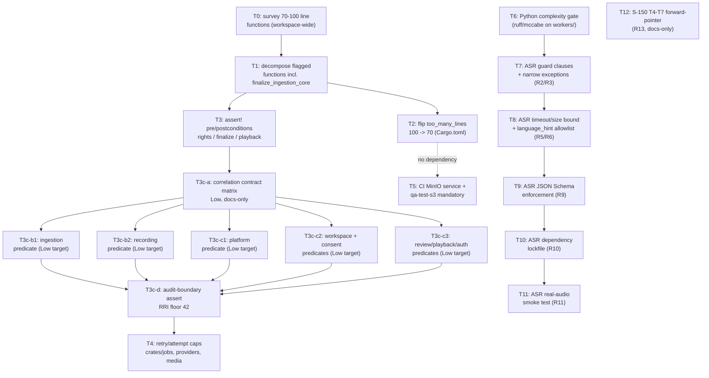

# Plan: Tiger Style Adaptation (X26)

## Objective

Close the evidence-backed Tiger Style gaps identified in
`docs/proposals/tiger-style-adaptation-evaluation.md` (R1–R13), now that the owner
has resolved the three decision points (D1–D3) that were blocking this plan from
being drafted (roadmap cross-cutting item **X26**). This plan sequences the
in-scope requirements against module boundaries and existing slice work; it does
not itself change any code — `docs/tasks/tiger-style-adaptation.md` carries the
executable, RRI-scored task list.

## Prerequisites resolved (owner sign-off, 2026-08-30)

| Decision | Owner resolution | Scope impact |
|---|---|---|
| **D1** — assert-in-production philosophy (R1) | **`assert!` always-on** (compiled into release) at the safety-critical boundaries identified by the evaluation: rights validation, finalize, playback grant issuance, audit emission. | R1 is **in scope**. `debug_assert!` is rejected — assertions must survive into release builds to match Tiger Style's actual guarantee. |
| **D2** — tighten `too_many_lines` below 100 (R7) | **Lower to 70 now** (commit, not survey-then-decide). The owner accepted that this forces decomposing `finalize_ingestion_core` (97 lines) and any other function in the 70–100 line band. | R7 is **in scope**. A mechanical survey is still required as the first task (Phase 3, T0) to bound the blast radius before any decomposition or lint-threshold change — the owner's decision commits to the direction, not to skipping the inventory step. |
| **D3** — promote integration tests from opt-in to mandatory in CI (R12) | **Mandatory now**, accepting the CI runner cost. | R12 is **in scope**, narrowed by re-verification below: Postgres- and Redis-backed tests already run unconditionally in two of the three relevant CI jobs; the real gap is MinIO/S3. |

No further owner decisions are required to execute the phases below. Per
`docs/policies/HITL_AUTONOMY_POLICY.md § Permitted without prior approval`,
drafting this plan required no separate approval; each individual implementation
task in `docs/tasks/tiger-style-adaptation.md` still goes through its own
RRI-gated approval before any code is touched (RRI 26+ requires explicit
approval; RRI 0–25 follows the Low-band local-delegation path).

## Re-verification of R12/D3 scope (evidence as of 2026-08-30)

The evaluation's R12 text described the opt-in integration tests generically.
Re-reading `.github/workflows/ci.yml` and `Makefile` before sequencing this plan
found the situation is **better than described for Postgres/Redis and worse than
described for MinIO**:

- `ci.yml`'s `test` job already runs a `redis:7` service container and sets
  `DUBBRIDGE_REDIS_URL`, then runs `make qa-test-redis` unconditionally
  (`.github/workflows/ci.yml:53-87`) — Redis integration tests are **already
  mandatory** in CI.
- `ci.yml`'s `coverage` job already runs a `postgres:16` service container and
  sets `DUBBRIDGE_DATABASE_URL` (`.github/workflows/ci.yml:150-167`), so any
  Postgres-gated tests inside `cargo llvm-cov --workspace` (invoked by
  `make qa-coverage`) **already execute unconditionally** in that job. The base
  `test` job (`make qa-test`, `.github/workflows/ci.yml:29-51`) has no Postgres
  service, so the same tests would self-skip there — redundant with, not
  weaker than, the coverage job, but worth closing so `make qa-test` is
  locally representative of CI's DB-backed path too.
- **MinIO/S3 is the real gap.** `crates/storage/src/s3.rs:182` marks its
  integration test `#[ignore = "requires local MinIO + DUBBRIDGE_STORAGE_TEST_*
  env vars; run explicitly via qa-test-s3"]`, but `qa-test-s3` **does not exist**
  as a Makefile target (absent from `Makefile`'s `.PHONY` list and body), and no
  CI job provisions MinIO. The S3-backed `StorageAdapter` path (S-080) has zero
  CI coverage today.

This re-verification narrows Phase 4 below to the actual gap rather than
re-implementing what already exists.

## Scope

**In scope (this plan):** R1–R12 against the Rust workspace, CI, and the one
implemented Python worker (`workers/asr-worker-py`).

**In scope (forward-pointer only, no implementation now):** R13 — defines what
S-150 `T4`–`T7`'s task card(s) must require as first-commit acceptance criteria
*when* they resume (still parked on the ADR-028 consent seam per
`docs/plan/roadmap.md`). This plan does not unblock or resequence S-150.

**Out of scope:** the non-goals carried over unchanged from the evaluation — no
wholesale rewrite, no deterministic-simulation-testing framework, no change to
Python's `-O` policy, no early unblocking of `translation-worker-py`/
`tts-worker-py`.

## Design decisions

- **Assertions vs. Result stay both in force.** `assert!` is added only for
  conditions that represent a *programmer/invariant* violation (a state that
  should be structurally impossible if upstream code is correct) — never as a
  replacement for recoverable/external error handling, which remains
  `Result`-typed. Converting an existing recoverable error path into an assert
  is explicitly disallowed; each call site's classification is a per-task
  review item, not a mechanical find-and-replace.
- **Decompose before asserting.** Phase 3 (function-length tightening) is
  sequenced before Phase 1 (assertions) at any function they share
  (`finalize_ingestion_core` first among them), because placing clean
  pre/postcondition asserts is easier on the decomposed, single-responsibility
  helpers than on the current 97-line function, and avoids doing the assertion
  work twice.
- **Lint-threshold flip is the last step of its own phase, not the first.** The
  clippy `too_many_lines` ceiling only moves from 100 to 70 after the survey
  (T0) and every flagged function is decomposed (T1) — flipping the lint first
  would turn CI red for functions no task has touched yet.
- **CI cost is accepted, not re-litigated.** D3 already accepted the runner-cost
  trade-off; Phase 4 tasks implement it rather than reopening the decision.
- **Python gap-closing stays scoped to the one built worker.** `R13`
  (green-field workers) is a documentation forward-pointer, not new Python
  implementation, consistent with the evaluation's non-goal on early unblocking.

## Module dependencies and phase sequencing

Phases map to independent module boundaries, so Phase 3/1/2 (Rust), Phase 4
(CI/storage), and Phase 5/6 (Python ASR) can proceed in parallel once each
phase's own internal ordering (shown above) is respected. T12 has no code
dependency and can be drafted at any point.

## Phase 1 — Function-length survey and decomposition (R7, D2)

- **T0.** Mechanical, workspace-wide survey of every function currently between
  70 and 100 lines (clippy `too_many_lines` set to a temporary 70 threshold in a
  scratch run, or an equivalent line-count script, to enumerate — not yet
  enforce). Output: a table of file, function, current line count.
- **T1.** Decompose every function T0 flags, starting with
  `finalize_ingestion_core` (`crates/ingestion/src/lib.rs:48-145`, 97 lines,
  already partially decomposed into five helpers under 20 lines each per the
  evaluation) down to ≤70 lines each, preserving behavior and existing test
  coverage.
- **T2.** Flip `too_many_lines` from `"deny"` at the 100-line default to a
  70-line ceiling (`Cargo.toml:65`, plus any `clippy.toml` threshold if the lint
  needs an explicit argument), and confirm zero new
  `#[allow(clippy::too_many_lines)]` escape hatches were introduced to make it
  pass — if a function genuinely cannot reach 70 lines without harming
  readability, that is a named exception requiring its own justification, not a
  silent allow.

## Phase 2 — Safety assertions at critical boundaries (R1, D1)

- **T3.** Add paired `assert!` preconditions/postconditions (positive and
  negative space) at the boundaries the evaluation identified as safety-critical
  and currently assertion-free: rights validation (`RightsBasis::validate`),
  finalize (`finalize_ingestion_core` and its decomposed helpers from T1),
  playback grant issuance (`PlaybackGrant::is_valid_at`), and audit emission.
  Each call site is classified explicitly as invariant (→ `assert!`) or
  recoverable (→ stays `Result`) per the Design decisions above. The audit
  portion is further decomposed in `X26-T3c-a`, `b1`, `b2`, and `c1`–`c3`: a
  Low-band contract matrix and pure domain predicates precede the one
  audit-boundary integration (`T3c-d`). The
  latter cannot honestly be Low because `crates/audit/**` has the ADR-008/
  ADR-018 RRI floor; it must not be relabelled merely because the final diff is
  small. The matrix also gates assertion work on resolving the currently
  unpersisted `platform_ingest_session_id` path.

  **Implementation note (2026-08-31):** `T3c-d` was implemented and pushed to
  `main` at `1fa4f9b42796ac1975b1f4bf8062641553f5d34a`. Migration
  `infra/migrations/0030_add_platform_ingest_correlation_to_audit_events.sql`
  persists `platform_ingest_session_id`; both `crates/db/src/audit_repo.rs`
  insert paths and the row-mapping bind/rehydrate it; `crates/audit/src/lib.rs`
  enforces the family-specific correlation-shape assertion from the
  `X26-T3c-a` contract matrix for all `AuditEventKind` variants. Detail:
  `docs/audit/x26-t3c-correlation-contract.md`.

## Phase 3 — Explicit bounds on retry/backoff (R4)

- **T4.** Add explicit attempt/retry caps to the `Retryable` disposition path
  (`apps/worker-runner/src/translation_fanout.rs:73-77` and any equivalent path
  in `crates/jobs`, `crates/providers`, `crates/media`), closing the one bounds
  gap the evaluation found in an otherwise-strong pillar.

  **Implementation note (2026-08-31):** T4 was consolidated and pushed to
  `main` at `610d70240026dfe1b481c1a2bab7db01fa8de4b5`. The implementation
  persists a durable attempt counter, enforces `MAX_TRANSLATION_DISPATCH_ATTEMPTS = 3`,
  prevents scheduling after exhaustion, and persists terminal
  `delivery_state = 'failed'`. Implementation-time incidents and deferred
  controls are recorded in `docs/audit/x26-t4-implementation-incidents.md`.
  That note also records one acceptance-criteria deviation requiring owner
  review: retry exhaustion is durably recorded in the outbox but no new
  ADR-018 `audit_events` row/event kind was introduced. This must not be
  represented as fully satisfying the original "durably audited" wording
  until the owner either accepts outbox durability as the intended contract
  and amends the task wording, or authorizes a separately scored audit task.
  `qa-docs` failures observed during the work were traced to historical S-150
  review commit references and are not a T4 retry-cap code failure.

## Phase 4 — CI integration-test coverage (R12, D3, MinIO gap)

- **T5.** Add a `minio` service container to the relevant CI job, add the
  missing `qa-test-s3` Makefile target that runs `crates/storage/src/s3.rs`'s
  currently-`#[ignore]`d integration test with `DUBBRIDGE_STORAGE_TEST_*` wired
  to the CI-provisioned MinIO instance, and confirm `make qa-test`'s own job
  either provisions Postgres too or is documented as intentionally relying on
  the `coverage` job for that coverage (avoid duplicating a Postgres service
  needlessly).

  **Implementation note (2026-08-31):** T5 was implemented directly on `main`
  at `45e94631631f2971c7fc63fd36effac4b82792af`. `Makefile` now exposes a
  fail-closed `qa-test-s3` target, CI provisions a real MinIO service and bucket,
  and the mandatory `s3-integration` job completed successfully with the real
  S3 adapter round-trip test (`1 passed; 0 failed`). The `test` job also now
  provisions Postgres so `make qa-test` exercises DB-backed tests instead of
  silently self-skipping them. Controls discovered outside T5's S3 path are
  intentionally not folded into this implementation: the Postgres-enabled
  workspace test exposed auth-fixture collisions on `owner@example.com`, and
  `qa-docs` remains blocked by historical S-150 review commit references.
  Both incidents, their evidence, scope disposition, and follow-up guidance are
  recorded in `docs/audit/x26-t5-implementation-incidents.md`.

## Phase 5 — Python complexity gate (R8)

- **T6.** Add a `ruff` (with complexity rules) or `flake8` + `mccabe`
  configuration scoped to `workers/*-py`, before `translation-worker-py`/
  `tts-worker-py` gain real implementations — cheapest point to add per the
  evaluation.

  **Implementation note (2026-08-31):** T6 is implemented on `main` with
  pinned Ruff 0.16.5. `ruff.toml` restricts discovery to
  `workers/*-py/**/*.py` and enforces McCabe complexity (`C901`), branch count
  (`PLR0912`), statement count (`PLR0915`), and 120-column line length (`E501`).
  `make qa-python-complexity` is fail-closed when Ruff is unavailable and is
  included in the aggregate `qa-ci` target. CI has a dedicated Python 3.12
  `python-complexity` job that installs exactly Ruff 0.16.5 and invokes the
  Make target. Implementation evidence and scope rationale are recorded in
  `docs/audit/x26-t6-implementation.md`.

## Phase 6 — ASR worker gap-closing (R2, R3, R5, R6, R9, R10, R11)

All against `workers/asr-worker-py/main.py` (95 lines) and its
`requirements.txt`/`Dockerfile`:

- **T7.** Replace `dict.get()`-with-silent-defaults (`main.py:32-34`) with
  explicit `if not <condition>: raise <SpecificError>` guard clauses (R2), and
  replace the broad `except Exception as exc` (`main.py:70`) with narrower,
  named exception types mapped to distinct error codes (R3).
- **T8.** Add an explicit timeout and max-audio-duration/size bound around
  `WhisperModel(...).transcribe()` (`main.py:55-57`, R5), and validate
  `language_hint` against a known-language allowlist before passing it through
  (`main.py:34,56`, R6).
- **T9.** Enforce `input.schema.json`/`output.schema.json`/`error.schema.json`
  at the process boundary at runtime (`jsonschema` validation or schema-derived
  Pydantic models), replacing the current unenforced-contract pattern (R9).
- **T10.** Lock `faster-whisper`'s transitive dependencies (numpy, ctranslate2,
  huggingface-hub, tokenizers, onnxruntime, av) via `uv.lock` or a compiled
  `requirements-lock.txt`, so `Dockerfile:5`'s `pip install -r requirements.txt`
  stops floating (R10).
- **T11.** Add at least one checked-in, opt-in, real-audio/real-model smoke
  test to replace the current 100%-mocked test suite's single point of
  unverified truth (R11).

  **Implementation note (2026-08-31):** T7–T11 were implemented and pushed to
  `main`. `workers/asr-worker-py/main.py` gained a named `WorkerError`
  hierarchy with explicit guard clauses (T7,
  `f166a55173ac119191ea189c3c2e9ea0c3ae4bd3`); an explicit
  `ASR_TRANSCRIBE_TIMEOUT_SECONDS` deadline, `ASR_MAX_AUDIO_BYTES` bound, and a
  Whisper language-code allowlist (T8, `bf5408e8396bf8c5d9967cece051a054ceaff5a4`);
  runtime Draft 2020-12 JSON Schema enforcement on input/output/error payloads
  via `jsonschema==4.26.0` (T9, `e267261d21a74906387b8652d7d689bf41bcb1e5`);
  a compiled `requirements-lock.txt` installed with `pip install --no-deps`
  plus `pip check` in `Dockerfile` (T10, `d16993f06d41316d4afcd754cbea312b57d5471b`);
  and an opt-in real-model smoke test gated by
  `DUBBRIDGE_ASR_REAL_MODEL_SMOKE=1` (T11, `2d01e90500e40c516cb819eefbe0ea727b40c643`).
  T11 also corrected a real bug found while wiring the smoke path: T8's
  timeout originally cancelled the deadline before faster-whisper's lazy
  segment generator was iterated, so the deadline did not cover the actual
  transcription work; `_transcribe_with_timeout` now materializes
  `list(segments)` before cancelling the alarm. Verified independently on
  2026-09-01: the 16-test mocked suite passes and `ruff check workers`
  (pinned 0.16.5) reports no findings. One residual gap: the mocked
  `test_transcription_timeout_uses_distinct_error` test simulates a slow
  synchronous `transcribe()` call, not a fast-returning call with a
  slow-to-iterate generator (the exact class of bug T11 fixed) — a
  regression of that fix would not be caught by the default (non-opt-in)
  test suite, only by the opt-in real-model smoke test. Evidence:
  `docs/audit/x26-t7-implementation.md`, `x26-t7-implementation-incidents.md`,
  `x26-t8-implementation.md`, `x26-t9-implementation.md`,
  `x26-t10-implementation.md`, `x26-t11-implementation.md`.

## Phase 7 — S-150 forward-pointer (R13, docs-only)

- **T12.** No code change. Record, as a docs-only task, that when S-150 `T4`
  resumes (currently ADR/planning-only and blocked on the ADR-028 consent seam
  per `docs/plan/roadmap.md`), its decomposed `T5`–`T7` child task cards must
  carry R2/R3-equivalent guard clauses, R5/R6-equivalent bounds, R8's
  complexity gate (already delivered by T6 above, so this is inheritance, not
  new work), R9-equivalent schema enforcement, and R10-equivalent dependency
  locking as first-commit acceptance criteria — never as later hardening. This
  task does not argue for unblocking S-150 early and does not edit the S-150
  ledger; it is the durable record this plan exists for that requirement to be
  picked up correctly whenever S-150 resumes.

  **Implementation note (2026-08-31):** T12 was closed via an owner wait-state
  waiver (T12's own stop condition allows closure only when S-150 T4 resumes
  or the owner explicitly waives the wait). S-150 T4 itself remains parked;
  no S-150 product code, task ordering, or ADR-028 ownership decision changed.
  The waiver does not waive the substantive Tiger Style requirements listed
  above for T4's eventual decomposed children. Detail:
  `docs/audit/x26-t12-forward-pointer-closure.md`.

## Evidence to emit / status artifacts affected

- Evidence: `scripts/rri.py` output per task in
  `docs/tasks/tiger-style-adaptation.md`; `make qa-lint`/`make qa-test`/
  `make qa-coverage`/`make qa-test-s3` output before and after each Rust phase;
  `ruff`/`ownership` tool output for T6; ASR worker test-suite output for
  T7–T11; Gemma/Muse Glimmer reviewer evidence per the band-routed chain for
  every development task.
- Status artifacts to sync on each task's closure: this plan,
  `docs/tasks/tiger-style-adaptation.md`, `docs/plan/roadmap.md` (X26 row),
  and `docs/proposals/tiger-style-adaptation-evaluation.md` (mark requirements
  closed as their tasks complete).

## Related documents

- `docs/proposals/tiger-style-adaptation-evaluation.md` — the requirements (R1–R13)
  and decision points (D1–D3) this plan sequences
- `docs/tasks/tiger-style-adaptation.md` — the executable, RRI-scored task ledger
- `docs/audit/x26-t4-implementation-incidents.md` — T4 implementation incidents,
  deferred controls, and the unresolved ADR-018 acceptance-criteria deviation
- `docs/audit/x26-t5-implementation-incidents.md` — T5 CI/control incidents and
  deferred follow-up discovered while making MinIO/S3 mandatory
- `docs/audit/x26-t6-implementation.md` — T6 Python worker complexity/length gate
  implementation evidence and scope guard
- `docs/plan/roadmap.md` — X26 cross-cutting item
- `docs/plan/s-150-translation-dubbing.md`, `docs/tasks/s-150-translation-dubbing.md` — R13's landing point (T4–T7, still parked)
- `docs/playbooks/AGENT_WORKFLOW_GUIDE.md`, `docs/policies/HITL_AUTONOMY_POLICY.md` — governing workflow and approval gates for every task below
- `Cargo.toml`, `clippy.toml`, `Makefile`, `.github/workflows/ci.yml` — enforcement mechanisms this plan modifies
- ADR-006, ADR-008, ADR-018, ADR-021, ADR-026 — existing Tiger-Style-aligned precedent cited by the evaluation
