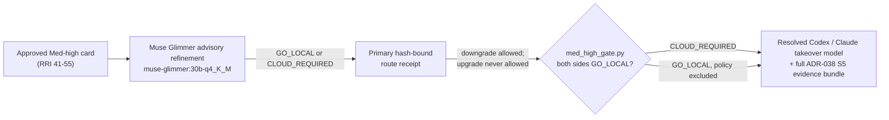
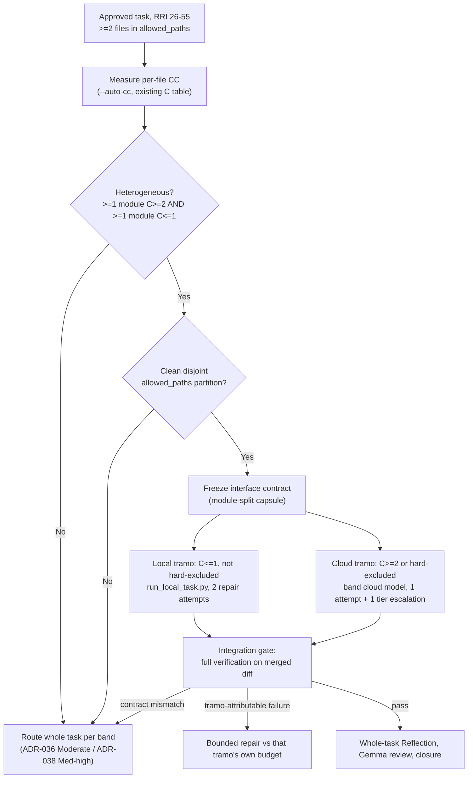

# Agent Workflow Guide

> **Status:** Authoritative. This guide is the highest-authority source for **all**
> agent-facing decisions: workflow, process, implementation discipline, task
> presentation structure, model selection, complexity scoring, testing rules, commit
> rules, handoff format, ADR propagation, and language policy.
> It overrides `CLAUDE.md` (project and global) and `AGENTS.md` without exception.
> `CLAUDE.md` applies only for topics not covered here.

> **Current routing override (owner directive, 2026-08-16):**
> `qwen3.8:27b-mlx` is now both the eligible Low/S (RRI 0–25) developer and
> the Moderate/M (RRI 26–40) developer, replacing the prior
> `nemotron-3.5-lightning:30b-a3b-q4_K_M` Low/S binding (ADR-036 Amendments
> 3/4/7) so both bands share one implementer model family.
> Med-high/L (RRI 41–55), Complex, and XL bands are cloud-only. For Med-high,
> the ADR-038 refinement/receipt still run as routing evidence, but a
> `GO_LOCAL` result never starts a local developer. This override supersedes
> earlier prose in this guide that describes a Nemotron Med-high attempt.

## Mandatory workflow before implementing

0. **Per-task Ollama restart and local-stack precheck** — before the first
   Ollama-backed action of every task that will invoke a local model, restart
   Ollama even when the current server appears healthy, then verify that the
   local stack and the models the task will actually invoke respond correctly
   under production
   generation parameters (`think=false` where applicable, the repo's default
   `num_predict`/`num_ctx` from `gemma_local.py`). A silent `done_reason:
   "length"` with empty `content` (thinking-mode exhausting the token budget
   before any visible output) is a known failure mode. Empty `content` with any
   terminal reason is also a possible local-memory or context-capacity failure;
   it must enter the resource-recovery protocol below rather than be retried
   unchanged. Catching either condition here
   avoids discovering it mid-review, where it forces an avoidable fallback
   (Muse Glimmer → Gemma → D14 for RRI 0–25, or Gemma → Muse Glimmer → D14
   for RRI 26–55) and burns a review hop that a healthy stack would not have
   needed.
   - Treat the repository task ID as the restart boundary: perform exactly one
     mandatory restart before that task's first local-model call. Retries,
     repair attempts, and later local phases within the same task reuse the
     restarted server unless it becomes unavailable or wedged. A new task ID
     requires a new restart.
   - Before restarting, confirm that no local-model runner for another task is
     still active. If one is active, wait for its bounded run to finish or stop
     it under that task's own timeout/termination contract; never kill an
     unrelated in-flight task merely to satisfy this bootstrap step.
   - Record the current `ollama serve` PID, terminate that server process
     (`kill <pid>`; the macOS app relaunches it), and wait for the old listener
     to disappear. Then confirm both a new server PID and a listening endpoint
     with `pgrep -fl ollama` and `lsof -iTCP:11434 -sTCP:LISTEN`. A surviving
     old PID, absent replacement PID, or missing listener leaves the restart
     item blocked; do not issue the task's first local-model request.
   - Warm and re-test each model this task's band will use (at minimum the
     RRI 0–25 reviewer chain: `muse-glimmer:30b-q4_K_M` →
     `gemma4:26b-a4b-it-qat`; for RRI 26–55 add the reviewer chain
     `gemma4:26b-a4b-it-qat` → `muse-glimmer:30b-q4_K_M`, the implementer
     binding `qwen3.8:27b-mlx`, and, for Med-high ADR-038 routes, the
     Local Architect binding `muse-glimmer:30b-q4_K_M`) with a review-style
     prompt at production `num_predict`/`num_ctx`, e.g.:
     ```bash
     curl -s http://127.0.0.1:11434/api/chat -d '{
       "model": "<model>",
       "messages": [{"role": "user", "content": "You are a code reviewer. Reply with ONLY a JSON object: {\"verdict\": \"PASS\", \"findings\": []}"}],
       "stream": false,
       "think": false,
       "options": {"num_predict": 4096, "num_ctx": <role production context>}
     }' -m 180
     ```
     Use the role's effective production context: `16384` for the Low/S
     Qwen Developer delegation wrapper, `65536` for the Moderate/M local-agent
     runner, and the configured reviewer context for review roles. Confirm
     `done_reason: "stop"` with non-empty `content`. A `"length"`
     result with empty content on a small ping (e.g. `num_predict: 16`) is
     usually just an undersized budget, not the real failure — retry at the
     production `num_predict` before concluding the model is unhealthy.
   - **Local resource-recovery protocol** — when an otherwise valid Ollama
     response has empty `content`, do **not** repeat the same request with the
     same or larger model/context budget. Treat it as a capacity symptom until
     disproved. In this exact order:
     1. unload the affected model (`ollama stop <model>`); inspect
        `GET /api/ps`, `pgrep -fl ollama`, and host memory pressure (on macOS,
        `memory_pressure` or `vm_stat`) so the observation is recorded;
     2. set `think=false`, `temperature=0`, `num_ctx` at or below `16384`, and
        `num_predict` to `512`–`1024`; then issue one bounded JSON-only probe;
     3. if that probe is usable, rebuild the actual review/delegation packet so
        it fits the reduced context (split source excerpts or the task when
        necessary) and make one bounded retry using that profile; and
     4. if the reduced retry is still empty or invalid, unload it and proceed to
        the band's normal reviewer/fallback route. Do not burn additional
        retries on the same high-memory profile.

     A smaller local model may be used only for a separate local D14 review
     after the normal chain has failed and the ADR-039 fallback-selection
     receipt authorizes that exact model, effort, and same-provider-degraded
     route. It is not a silent substitute for the band-resolved reviewer.
     Record the model, `num_ctx`, `num_predict`, `think`, terminal reason,
     content length, loaded-model state, and the recovery decision in the
     precheck or review artifact. A reduced-profile success does not certify
     the original high-memory production profile as healthy.
   - Track this operation as `Restart Ollama + local-stack precheck —
     <orchestrator>` in the live per-task checklist. It is an operational
     prerequisite, not a review or approval gate, and completes only after the
     PID/listener checks and required model warm-ups pass.
   - This restart/precheck is infrastructure verification, not a
   review gate: it does not replace, skip, or pre-decide the Band-routed
     peer review outcome for this task, and a healthy precheck does not
     retroactively change a prior phase's recorded result (e.g. a historical
     D14 fallback stays as recorded even if a later precheck shows the
     primary chain healthy again).
   - Applies to any task type that will invoke an Ollama-backed local role,
     including implementation, phase-1/phase-2 review, Local Architect,
     Antares, or push-review work. Skip it only when the task will make no
     local-model call; docs-only, config-only, migration-only, ADR, plan,
     task-ledger, and policy-only tasks normally fall into that exemption.
1. **Analyze** — read context, dependencies, and affected files.
   - For **mobile UI / presentation tasks** under `mobile/`, also read the root
     `DESIGN.md` before planning or implementation. `DESIGN.md` governs visual
     intent and component-usage expectations for the mobile surface. It does not
     replace task files, runtime tokens in `mobile/src/theme/tokens.ts`, or the
     workflow authority of this guide.
   - **Antares refinement touchpoint** — for any RRI 26+ development task that
     carries a task-relevant CWE hypothesis already on the T3a watchlist
     (`scripts/antares/cwe_watchlist.py`), invoke Antares against the existing
     baseline snapshot before implementation starts (see § Antares
     Security-Specialist Advisor below). If no such CWE hypothesis exists,
     record a typed skip instead — never invoke Antares as a generic sweep.
     Does not apply to docs-only, config-only, migration-only, ADR, plan,
     task-ledger, or policy-only tasks. This step is strictly advisory: it
     never gates or delays approval, the band-routed reviewer, or RRI
     computation.
2. **Plan** — create `docs/plan/<plan-name>.md` with: objective, affected files,
   design decisions, and module dependencies.
3. **Tasks** — create `docs/tasks/<tasks-name>.md` with: an ordered task list,
   inter-task dependencies, acceptance criteria per task, an **Effort** field
   (S/M/L/XL), a short agent handoff prompt, and for each development task a
   small behavioral example set covering both:
   - at least one **happy path example** with a stable `HP-#` ID — a concrete
     success flow the task must implement or preserve;
   - at least one **edge case example** with a stable `EC-#` ID — a concrete
     boundary, invalid-input, or failure flow the task must handle or reject.
   - when a task can produce benchmark/evaluation/review evidence, metrics, or
     a blocker/promotion-state change, the task definition must also name:
     - **Evidence to emit** — the concrete artifacts expected during execution
       (for example transcripts, screenshots, audit rows, benchmark outputs,
       review packets, or report sections);
     - **Status artifacts affected** — the exact ledgers, plans, reports, ADR
       indexes, or downstream blocker docs that must be synchronized before the
       task can be reported complete.
4. **Gate by RRI** — compute RRI with `scripts/rri.py`. For RRI 0–25, skip the
   full human approval presentation. Use local Qwen Developer delegation through Ollama
   only for eligible simple code patches; otherwise execute directly as the
   primary agent. For **RRI 26–40 Moderate**, show the plan and tasks, wait
   for explicit approval, then use the **local-first implementation path** by
   default: `scripts/local-agent/run_local_task.py` in a disposable worktree,
   resolving the implementer from `DUBBRIDGE_LOCAL_AGENT_MODEL` (default
   `qwen3.8:27b-mlx`), with at most 2 evidence-backed local repair attempts
   before escalating to the cloud-takeover model resolved in Step 2. The primary
   agent remains the orchestrator of record and cloud implementation is the
   escalation/fallback path, not the default. For **RRI 41–55 Med-high**, show
   the plan and tasks, wait for
   explicit approval, then route through the **ADR-038 Architect-refined
   single-attempt gate**: Muse Glimmer advisory refinement (`GO_LOCAL` |
   `CLOUD_REQUIRED`) → primary hash-bound route receipt (may downgrade, never
   upgrade) → every result, including `GO_LOCAL`, produces the concrete
   Codex/Claude cloud-takeover packet from Step 2 with the full evidence bundle.
   Med-high keeps the
   band-resolved independent review route, 3 Reflection passes, and the human
   approval gate unchanged — the routing change affects only who authors the
   code, not who reviews or approves it. See § Local-first and
   Architect-refined implementation routing (RRI 26–55) below for the full
   diagram and contract. For **RRI 56+**, show the plan and tasks and wait for
   explicit approval before starting implementation, even if a plan was
   approved in a prior session; implementation stays on the cloud path
   (Premium tier) and decomposition remains mandatory before implementation.
5. **Implement** — one task at a time, in the defined order.
6. **Mark progress** — update the tasks document after each completed task (it is
   the crash-safe progress ledger).
7. **Sync status artifacts before reporting completion** — before telling the user
   a task is done, update every materially affected status document in the same
   workflow pass. Completion is not valid until those documents are consistent.

## Task definition requirements

- For development tasks, the `docs/tasks/*.md` entry is not complete unless it
  includes explicit examples for both the intended happy path and the relevant
  edge cases.
- These examples do not need to be long. One or two bullets per category is
  enough if they are concrete and testable.
- Every development-task example must have a stable case ID:
  - happy path examples use `HP-1`, `HP-2`, etc.;
  - edge case examples use `EC-1`, `EC-2`, etc.
- Write the examples in behavioral terms, not implementation terms. Prefer
  statements such as `HP-1: valid ingest token + owned blob -> artifact finalized`
  over `call finalize_ingestion()`.
- The pre-task sections `Happy paths considered` and `Edge cases considered`
  should be derived from these task-definition examples, then refined if new
  constraints are discovered during analysis.
- Skip this requirement for docs-only, config-only, migration-only, or planning
  tasks unless the task's main risk is behavioral correctness.
- When a task can produce metrics, benchmark outputs, evaluation evidence, or a
  blocker/promotion-state change, its task definition is not complete unless it
  also names:
  - **Evidence to emit** — the concrete artifacts the task is expected to
    create while it runs; and
  - **Status artifacts affected** — the exact status-bearing docs that must be
    updated in the same workflow pass.
- Treat these as execution-time outputs, not as optional closure notes. If they
  are known at planning time, they belong in the task definition up front.
- A task ledger can opt into automated enforcement by declaring
  `Behavioral coverage contract: unit-v1`. For ledgers with that marker, `make
  qa-docs` rejects completed development tasks whose `HP-#` / `EC-#` cases are not
  certified with unit test evidence. Legacy completed tasks without the marker are
  grandfathered until they are migrated into the contract.

## Per-task discipline

- **Phase 1 — Task-analysis review** (before presenting or delegating any task):
  run the reviewer resolved by the canonical `Band-routed peer review` table on
  the task card/plan. Record the phase-1 report line with the actual reviewer,
  artifact, and verdict. Do not maintain a second band mapping here.
  A `BLOCKED` verdict stops presentation or delegation until revised, explicitly
  waived by the user, or reported as blocked. Docs-only, config-only,
  migration-only, ADR, plan, task-ledger, and policy-only tasks are exempt from
  phase 1 and record `n/a` with the exemption stated.
- Present the next task using the `AGENTS.md` presentation contract before executing
  it when approval is required. For RRI 0–25, do not present the full task for
  approval. If the task is an eligible simple code patch, prepare a local
  delegation packet for Gemma and report after review and verification; otherwise
  execute directly and report normally.
- Before implementation starts, derive an explicit execution-time documentation set
  from the task definition: what evidence/metrics must be emitted and which status
  artifacts must be synchronized. For tasks that affect benchmarks, reports, audit
  trails, blockers, or promotion state, that set is part of the task's working
  surface from the start, not a post-hoc cleanup list.
- **Pre-task summary for development tasks:** the compact card's `Scope and
  acceptance` block must name the primary `HP-#` and `EC-#` behaviors, and its
  workflow table must name the required Reflection pass count and pass focuses
  for RRI 26+. A compact technical-scope Mermaid diagram is mandatory. These
  items do not require separate prose sections in the approval card; their full
  definitions remain in the linked task ledger. Skip development-only content
  for docs-only, config, migration-only, or planning tasks unless requested.
- After each task: verify the relevant tests/checks, update the status docs,
  document deviations or evidence, and state unresolved risks or blockers.
- When a task's evidence or metrics become available mid-execution, update the
  named report/ledger artifacts in the same workflow pass instead of deferring
  them until an end-of-task memory sweep. A task that changes the measured state
  of the project should update that measured state as part of the task itself.
- Treat status-document synchronization as part of the task itself, not follow-up
  cleanup. Do not report a task complete while any governing status document still
  shows stale state.
- When a task completion changes the status of a slice, dependency, ADR, or blocked
  downstream task, update all materially affected status documents in the same
  workflow before reporting completion. This includes, as applicable:
  `docs/tasks/*`, `docs/plan/roadmap.md`, linked slice plans, dependent task files,
  and ADR status/implementation references.
- At minimum, check whether the completed task changes any of:
  `docs/tasks/*`, `docs/plan/roadmap.md`, the linked `docs/plan/*` slice file,
  dependent task ledgers, ADR status/implementation references, and any handoff
  prompt or blocking-gate language that names the completed work.
- When an ADR is created, amended, or deleted as part of a task, apply the
  **ADR change propagation** contract below in the same workflow pass.
- Work on the approved or delegated task only; show a summary before switching to
  the next.
- **Post-task summary for development tasks:** when the completed task involves writing
  or modifying code, the summary must include two explicit sections:
  - **Happy paths covered** — the primary success flows exercised by the implementation
    and tests (e.g., "valid command → session created in Requested state").
  - **Edge cases covered** — the boundary and failure conditions explicitly handled in
    logic and tests (e.g., "None credential_ref → MissingCredentialRef before any IO").
  For both sections, include **code evidence**: point to the concrete files,
  functions, and tests that prove the claimed coverage, using file references and
  concise explanations of what each reference demonstrates.
  This section is required only for development tasks. Skip it for docs-only,
  config, migration-only, or planning tasks.
- **Unit coverage certification for development tasks:** before marking a
  development task `[x] Done`, add a `Unit coverage certification` section that
  maps every approved `HP-#` and `EC-#` case to at least one unit test reference in
  the form `` `path/to/file.rs::test_name` ``. The referenced test must replicate
  the behavior described by that case and the recorded result must be `passed`.
  `N/A` is not allowed for development-task happy paths or edge cases. If a case
  cannot be unit-tested, refactor the implementation until it can be unit-tested
  or revise the task definition before closure.
- The same completion record must include `Owner final verification` with owner,
  date, verification statement, and exact commands run. The owner is responsible
  for certifying that each referenced unit test genuinely covers the claimed
  behavior; the automated gate verifies the structure and referenced test
  existence.

Required completion format for development tasks:

```md
### Unit coverage certification

| Case ID | Type | Behavior | Unit test evidence | Result |
|---|---|---|---|---|
| HP-1 | Happy path | valid input creates session | `apps/gateway/src/auth/login.rs::valid_login_creates_session` | passed |
| EC-1 | Edge case | unknown state fails closed | `apps/gateway/src/auth/login.rs::unknown_state_returns_unauthorized` | passed |

### Owner final verification

- Owner: `<name-or-handle>`
- Date: `YYYY-MM-DD`
- Statement: I verified every happy path and edge case defined for this task has unit test evidence that replicates the expected behavior.
- Commands run: `<exact test commands>`
```

## Live per-task phase todo list

Every orchestrator (Claude Code, Codex, or any other primary agent acting as
orchestrator of record) must keep a **live, per-task todo/checklist** that
mirrors the Compact Approval Task Card's `Agent workflow` block (block 3) and
stays current as the task actually moves through phases. Block 3 is a frozen
snapshot taken at presentation time; this checklist is the running tracker
during execution — it is not satisfied by showing the card once and moving on.

**Mechanism (tool-agnostic).** Use whichever native checklist/plan mechanism
the orchestrator has — Claude Code uses its `TodoWrite` tool; Codex uses its
own plan/task-tracking mechanism. Both must render an equivalent visible list:
one entry per applicable phase, each entry naming the **resolved responsible
agent/model** for that phase (not a generic role label such as "reviewer"),
and a status of `pending`, `in_progress`, `blocked`, or `completed`.

**Phase set by band:**

- **Any task invoking an Ollama-backed local role:** prepend `Restart Ollama +
  local-stack precheck — <resolved orchestrator>` to the applicable phase set.
  Seed this entry immediately before the task's first local-model invocation,
  even when that invocation is the phase-1 reviewer and therefore precedes the
  approval card. Add the remaining phase entries when their route is resolved.
  This operational entry does not add a human gate or replace any review phase.

- **RRI 26+ (Moderate through Complex+):** one entry per row of the approval
  card's `Agent workflow` table — Analyze/scope, Phase 1 review, Approval,
  Implement, Reflect and verify, Phase 2 review, Close.
- **RRI 0–25 (Low):** a reduced list matching the phases that actually apply —
  e.g. Analyze, Gemma/D14 review, Implement (primary agent or Gemma
  Developer), Close.
- **Docs-only, config-only, migration-only, ADR, plan, task-ledger, or
  policy-only tasks:** a minimal list (1–3 entries) is sufficient; a
  genuinely single-step task may skip the list entirely, matching the
  existing phase-1-review and Reflection exemptions for this task class.

**Update discipline:**

- Seed the list before implementation starts — immediately after the task is
  presented and approved (RRI 26+), or immediately before direct execution
  (RRI 0–25). For a task whose first local-model call occurs earlier, seed the
  mandatory Ollama restart/precheck entry before that call as specified above.
- Normally exactly one phase entry is `in_progress` at a time.
- Flip an entry to `completed` only when that phase's own gate has actually
  passed (for example, do not mark "Phase 1 review" `completed` before the
  reviewer's verdict is `PASS`).
- A `BLOCKED` review verdict, a failed acceptance run, or an escalation keeps
  the corresponding entry `blocked` — never silently `completed` or dropped —
  until it is resolved, explicitly user-waived, or reported blocked.
- When a task reroutes mid-flight (a local implementer fails and escalates to
  cloud, a Med-high gate resolves `CLOUD_REQUIRED`, a reviewer falls back down
  its chain), update the affected entry's responsible agent/model to the
  actual resolved participant. Do not leave a pre-escalation name in place.

**Authority boundary.** The live todo list is a transparency and tracking
artifact, not a new approval or review gate. It does not replace the HITL
approval checkpoint, the band-routed review chain, the Reflection log, or any
other closure gate defined elsewhere in this guide. An entry marked
`completed` still requires that phase's own evidence (review artifact,
Reflection log, unit coverage certification, owner verification, etc.) — the
checklist records that the step happened, it does not certify that it
happened correctly.

## ADR change propagation

An ADR change that occurs outside a task ledger (e.g. a replan, a hotfix, or a
cross-cutting amendment) is still subject to this contract. Apply the matching row
in the same change — not as a follow-up.

| ADR change | Must review and update in the same change |
|---|---|
| **New ADR** | `docs/adr/README.md` index row; ADR frontmatter block (`type: ADR`, `title:`, `status:`); `docs/architecture.md` if it adds or alters a runtime/crate boundary; `docs/plan/roadmap.md` if it changes slice scope or dependencies; the affected `docs/plan/*` and `docs/tasks/*` files |
| **Status change** (`Proposed` → `Accepted` → `Superseded` / `Deprecated`) | ADR frontmatter `status:` field (must mirror the prose `- **Status:**` token); index `Status` column; every canonical doc (`architecture.md`, `roadmap.md`, plan/tasks) that cites the ADR as authority for a decision |
| **Scope narrowed or broadened** | index scope annotation; `docs/architecture.md`; `docs/plan/roadmap.md`; affected plan/tasks; `README.md` if the change is outward-facing |
| **Content / decision change** (the decision itself, not just status or scope) | every canonical doc whose prose describes that decision — **this is semantic and not machine-verifiable**; Layer 2/3 confirm references still resolve, but human review owns whether the prose is still accurate |
| **Superseded by ADR-YYY** | both ADRs' frontmatter (`status:` / `supersedes:` / `superseded_by:`); both ADRs' prose `Status` field; the index row for each; every doc citing the superseded ADR |
| **Deletion or renumbering** | see the deletion rule below; update the index, every doc citation, **and every code/migration comment** (`.rs`, `.sql`) in the same change |

**Deletion rule.** An `Accepted` ADR is part of the auditable decision record and
must **not be deleted** — mark it `Superseded by ADR-YYY` or `Deprecated` instead.
A `Proposed` ADR that was never adopted may be deleted only after every reference
(docs *and* code/migration comments) is removed in the same change. Renumbering is
a delete + create and must update all references atomically.

**Definition of done for any ADR change:**
- [ ] The ADR file's prose `- **Status:**` line is updated.
- [ ] The ADR file's frontmatter `status:` mirrors the prose token; `supersedes:` /
      `superseded_by:` are set where applicable (frontmatter parity).
- [ ] `docs/adr/README.md` index row matches (status token + title).
- [ ] Every doc in the matching propagation row above has been reviewed and updated
      if its content describes the changed decision.
- [ ] No code or migration comment cites a missing ADR number.
- [ ] `make qa-docs` passes (index parity, completeness, dangling refs in docs and
      code/migrations, superseded-successor existence, OKF frontmatter parity).

### What this contract does and does not guarantee

**Guaranteed by `make qa-docs` (deterministic, Layers 2/3):**
- Every cited ADR file exists.
- Index↔file status tokens agree.
- The index is complete (no file without a row, no row without a file).
- A `Superseded` ADR names an existing successor.
- No code or migration comment cites a missing ADR.

**Not guaranteed (Layer 1 + human review only):**
- That the *prose* of a canonical doc still accurately describes an ADR whose
  decision changed. Referential integrity is automatable; semantic consistency is
  not. The propagation table tells the author *which prose to re-read*; it does not
  prove the update was made correctly.

## Effort scale

| Level | Agent reasoning | Example |
|-------|-----------------|---------|
| S  | Mechanical — transcription, copy, merge | Config files from an explicit spec |
| M  | Moderate — contracts, logic, edge cases | Boundary tests; small services |
| L  | High — multiple subsystems, architecture | Process supervisor with replay tests |
| XL | Very high — RRI-driven reasoning, risk, and verification burden | Cross-boundary redesign with explicit risk analysis |

**Canonical effort mapping (required):** `Effort` must reflect the computed **RRI
band**, not a separate subjective estimate of likely elapsed time or annoyance. See
`docs/policies/RRI_POLICY.md` §Bands, autonomy gates, and model tiers for the
canonical crosswalk.

The S/M/L/XL descriptions above are illustrative; the RRI band is authoritative for
assignment.

Effort, capability tier, and autonomy gate are each derived in parallel from the RRI
band; never derive capability or gate from Effort.

Rules:
- Do not use `Effort` to encode toolchain pain, waiting time, or expected operator
  frustration when the computed RRI is lower.
- If a task is operationally tedious but its RRI remains in a lower band, keep the
  lower `Effort` and explain the operational caveat in prose.
- If an existing task ledger has `Effort` that disagrees with the computed RRI band,
  update the ledger so `Effort`, complexity presentation, and model guidance are
  internally consistent in the same documentation change.

## Model and thinking-mode selection

This section is the canonical source for complexity scoring, model-tier
selection, and thinking-mode guidance. `AGENTS.md` defines the presentation
fields, but agents must derive the values from this guide rather than from
agent-specific defaults.

Concrete vendor model IDs change over time. Agents must therefore separate:

1. the **capability decision** (`Economy`, `Balanced`, `Premium`) derived from
   the formulas in this guide, from
2. the **concrete model resolution** (the current OpenAI / Anthropic model ID
   that best fits that capability at the time of presentation).

Do not collapse these into one undocumented guess.

The **RRI 0–25 Low band** is the exception to vendor model resolution: eligible
simple patches may use local Qwen Developer delegation through Ollama. Resolve the
local model from `DUBBRIDGE_LOW_RRI_MODEL`, defaulting to
`qwen3.8:27b-mlx`, and the Ollama endpoint from `OLLAMA_HOST`,
defaulting to `http://localhost:11434`.

### Local-first and Architect-refined implementation routing (RRI 26–55)

The **RRI 26–40 Moderate band** is a routing exception for implementation:
task cards still present Codex/Claude recommendations for the orchestrator and
escalation environment, but the default code-authoring surface moves local.

**Moderate (26–40):** the code-authoring surface is the local agentic runner
(`scripts/local-agent/run_local_task.py`) using `DUBBRIDGE_LOCAL_AGENT_MODEL`
(default `qwen3.8:27b-mlx`) inside a disposable worktree, with at most 2
evidence-backed local repair attempts before escalating to cloud. This
routing became operative by owner override on 2026-07-15, ahead of the
original ADR-036 pilot promotion gate.

**Med-high (41–55):** ADR-038 (2026-07-26) remains its fail-closed,
evidence-bearing refinement/receipt gate, and implementation is cloud-only
**for the whole task** except for individual modules that independently
qualify for ADR-040 per-module split routing (§ Per-module complexity-split
routing below):



Implementation surfaces: `scripts/local-architect/run_analysis.py`
(`med-high-refinement-v1` profile) for the Muse Glimmer artifact,
`scripts/local-agent/med_high_gate.py` for the fail-closed route decision, and
`scripts/local-agent/run_med_high_task.py` for automatic cloud-evidence-bundle
emission on every Med-high result. There is no whole-task local attempt or
repair at this band; the only local authoring surface Med-high permits is a
module independently qualified under ADR-040 (see below).

Both sub-bands keep the independent reviewer resolved by the canonical band
table (currently Gemma, then Muse Glimmer, then D14), 3 Reflection
passes, and the RRI 26+/41+ human approval gate exactly as before — the
routing change affects only who authors the code, not who reviews or
approves it.

#### Post-repair-budget Low-band decomposition (owner directive 2026-08-16)

**Once the whole-task local-agent repair budget above is exhausted**
(Moderate's 2/2 attempts, or the Med-high ADR-038 gate's `GO_LOCAL`/module
tramo budget), the default next step is **no longer cloud escalation**. The
default is to decompose the remaining implementation into Low-band
(RRI 0–25) subtasks and keep authoring local, via `scripts/delegate-low-rri.py`
(`--mode full-file` for new files, `--mode before-after` for small edits),
with the primary agent acting as orchestrator only — diagnosing the exact
signatures needed, splitting scope, dispatching, reviewing returned patches,
and assembling the result, never authoring substantive logic directly.
Cloud escalation remains available as the fallback of last resort, not the
default, at this step.

A direct edit by the orchestrator is permitted only in two narrow,
explicitly-recorded cases: (1) a **documented tooling-failure exception** —
the local model already correctly diagnosed and proposed a fix, but the
delegation wrapper itself failed to construct or apply a usable diff; or
(2) a **mechanical lint-driven refactor** of already-verified logic (e.g.
extracting helpers to satisfy a cognitive-complexity gate) with no behavior
change. Both must be recorded as such, distinct from any fix the
orchestrator diagnosed and authored itself, which this route does not
permit.

This does not change the task's RRI, band, band-resolved reviewer,
Reflection pass count, or the RRI 26+ human-approval gate — it changes only
who authors the remaining code once the whole-task local route's budget is
spent. It requires no additional per-subtask approval once the containing
task is already HITL-approved. A `### Implementation routing evidence`
block is required in the closure record — see
`docs/policies/HITL_AUTONOMY_POLICY.md § Post-repair-budget Low-band
decomposition` for the full route, evidence-block contract, and the
validated `S-150-T2c-iv-c` worked example.

#### Per-module complexity-split routing (RRI 26–55, ADR-040)

For an **approved** task (26–40 or 41–55) whose `allowed_paths` span two or
more files, the orchestrator may split implementation authorship by
per-module cyclomatic complexity instead of the whole-task routes above.
This is a routing refinement that fires after HITL approval and phase-1
review — it changes only which files each implementer authors, never the
task's RRI, band, phase-1/phase-2 reviewer, Reflection pass count, or
closure gates.



Mechanics, in short — full contract in
`docs/policies/RRI_POLICY.md` § Per-module complexity-split routing and
`docs/adr/ADR-040-per-module-complexity-split-implementation-routing.md`:

- **Trigger:** split only when per-module CC is genuinely heterogeneous
  (≥1 module C≥2 and ≥1 module C≤1, using the existing RRI `C` table); a
  uniform-tier task is never split.
- **Hard domain exclusion:** a module matching the ADR-038 §6 exclusion list
  (auth, security, rights/consent/governance, migrations, unresolved ADR
  decisions, unbounded scope) is always cloud-eligible regardless of its own
  CC — this is what keeps Med-high's ADR-038 §6 rationale intact under this
  exception.
- **Disjoint paths:** the two tramos' `allowed_paths` must partition with no
  overlap, or the task is not split.
- **Repair budgets:** local tramo gets 2 evidence-backed attempts
  (uniformly, whether the task's band is Moderate or Med-high); the cloud
  tramo gets 1 attempt, then one escalation to the band's higher cloud tier,
  then stops and reports blocked for that module.
- **Integration gate (mandatory):** run the task's full verification against
  the merged diff before Reflection. A tramo-attributable failure is a
  bounded repair against that tramo's budget; a failure attributable to the
  frozen interface contract itself abandons the split and escalates the
  whole task to its normal band route — it is not retried as a split.
- **Tooling status:** `scripts/local-agent/module_split_gate.py` is built and
  tested (`evaluate_split()` / `next_cloud_action()`, 29 cases in
  `module_split_gate_test.py`) and enforces the trigger, hard-exclusion, and
  partition checks. The module-split capsule format (§6 interface freeze)
  and the `run_local_task.py` / `run_med_high_task.py` dispatch integration
  are not yet built; until they land, an orchestrator invokes the gate for
  the split decision itself but still records the interface-freeze capsule
  and dispatches both tramos manually — say so in the evidence block rather
  than claiming full automated-gate enforcement end-to-end.

Record a `### Module-split routing evidence` block in the task closure
record whenever this route is evaluated (including a `no split` result and
its reason) — see ADR-040 § Evidence for the required fields.

When preparing a task for presentation or local delegation, the agent must compute
a complexity score and derive the recommended model tier or local delegation
target from it. Do not guess; use the procedure below.

### RRI — canonical scoring method (adopted 2026-06-04)

This guide adopts the **Required Reasoning Index (RRI)** as the canonical method
for deriving complexity, risk, model tier, and autonomy gates. The full procedure
(formula, scoring rubric, repo-specific anchor rubric, penalty table, bands, and
decomposition triggers) lives in `docs/policies/RRI_POLICY.md`.

**Adoption note:** RRI supersedes the single-axis cyclomatic-complexity scoring
that previously drove the tier mapping. No ADR is required — RRI is a workflow
policy, not a runtime architecture decision. `AGENTS.md` and `CLAUDE.md` are
summaries of this guide and must be synchronized whenever its presentation or
routing contract changes.

**How Steps 1 and 2 below relate to RRI:**
- The cyclomatic-complexity formula in Step 1 maps directly to the **`C` variable**
  of the RRI formula. Step 1 remains the procedure for computing `C`.
- The tier mapping in Step 2 is now driven by the **RRI band** (not the raw CC
  label). The tier names (Economy / Balanced / Premium) and thinking-mode rules
  are unchanged; only the input that selects the tier changes.
- Step 3 includes the compact RRI summary in the task presentation for RRI 26+,
  or in the local delegation packet and final report for RRI 0–25.

Before presenting or delegating any task: **run `scripts/rri.py`** — do not compute the RRI by hand.
The script measures F automatically and maps raw CC to the C score via the policy
table. Store its full markdown output in the task ledger or a linked RRI artifact.
For RRI 26+, project the required compact summary into the approval card; for RRI
0–25, include the full output in the local delegation packet and final report.

```bash
# Task-presentation time (before code is written — diff is empty):
python3 scripts/rri.py \
  --touches <path1> --touches <path2> \
  --cc <raw-cyclomatic-complexity> \
  --D <0-5> --K <0-5> --P <0-5> \
  --T <0-5> --A <0-5> --X <0-5> \
  [--penalty refactor_and_behavior] [--penalty arch_decision] [--penalty no_verification]

# Post-implementation (diff available; omit --touches):
python3 scripts/rri.py --cc <raw> --D <0-5> --K <0-5> --P <0-5> \
  --T <0-5> --A <0-5> --X <0-5>
```

Measure C and T before invoking: use `radon`/`mccabe` (Python) or
`clippy::cognitive_complexity` (Rust) for C; use `cargo llvm-cov` for T.
The script applies D/P/K floors from the anchor rubric and auto-detects four
penalties — agent supplies only the three intent-based ones. See
`docs/policies/RRI_POLICY.md § Script automation` for the full agent-vs-script
split and `--json` output for tooling use.

### Step 1 — Compute complexity

**For development tasks (code to write or modify):**

Compute the **cyclomatic complexity** (McCabe, 1976) of the functions that will be
created or materially changed:

```
CC = E − N + 2P
```

where E = edges, N = nodes, P = connected components in the control-flow graph.
Practically: start at 1 and add 1 for each `if`, `else if`, `match` arm, `while`,
`for`, `loop`, `?` propagation that branches, `&&`, `||` in a condition.

| CC range | Cyclomatic (C) label | RRI `C` variable score |
|---|---|---|
| 1–5 | Low | 0–1 |
| 6–10 | Medium | 1–2 |
| 11–20 | High | 2–3 |
| > 20 | Very High | 4–5 |

> **Subsumed by RRI:** the CC range above is the `C` variable of the RRI formula.
> Use the full RRI score (not just `C`) to determine the model tier and autonomy
> gates. See `docs/policies/RRI_POLICY.md` for the complete scoring procedure.

**For non-development tasks (analysis, planning, research, config, docs):**

Use the **decision-weight heuristic** — count the number of irreversible decisions
plus external dependencies the task requires:

| Score | Complexity label |
|---|---|
| 0–2 | Low |
| 3–5 | Medium |
| 6–9 | High |
| ≥ 10 | Very High |

Irreversible decisions include: schema changes, public API changes, CI gate changes,
deletion of authoritative files, policy changes. External dependencies include: live
DB, external APIs, CLI tools with version-sensitive behavior, network-bound ops.

### Step 2 — Map to model tier (cost / capability balance)

Prefer capability tiers over pinned model IDs in this guide. Model names change
over time; the workflow should stay stable across agents and providers.

| Tier | Best for |
|---|---|
| Economy | Low-complexity, mechanical tasks |
| Balanced | Medium-complexity, standard implementation work |
| Premium | High / Very High complexity, architecture, synthesis, deep debugging |

Mapping (now driven by RRI band — see the canonical crosswalk in
`docs/policies/RRI_POLICY.md` §Bands, autonomy gates, and model tiers):

> **Subsumed by RRI:** the complexity label alone no longer determines the tier.
> The RRI band (which incorporates `C`, `F`, `D`, `T`, `A`, `K`, `P`, `X`, and
> penalties) selects the canonical crosswalk row. The tier names and thinking-mode
> rules are unchanged; only the input that selects the tier has changed.

Agent-specific resolution rules:

- For normal RRI 0–25 handling, use the primary-agent or local Ollama/Gemma
  protocol in `docs/policies/RRI_POLICY.md § Low RRI local delegation`; a cloud
  vendor model recommendation is unnecessary unless that bounded local path
  actually escalates. For the step-by-step handoff discipline for local-model
  work, see `docs/playbooks/LOW_RRI_LOCAL_MODEL_HANDOFF.md`.
- Resolve each capability label to the best currently available model in the
  active agent environment.
- When naming a concrete vendor model ID, verify the current vendor guidance
  first if there is any reasonable chance the recommendation has changed. Do not
  rely on stale memory for "latest", "best", "recommended", or similar claims.
- For OpenAI recommendations, prefer official OpenAI documentation. For Claude /
  Claude Code recommendations, prefer official Anthropic documentation.
- The final recommendation must be produced in this order:
  1. compute complexity with the formula in Step 1
  2. map complexity to capability tier with Step 2
  3. resolve that tier to the best current vendor model
  4. present the resolved model and note any task-local override
- `Effort` must be derived from the computed RRI band using the canonical effort
  mapping above; it does not replace the complexity formula. If an existing task's
  recorded `Effort` disagrees with the computed RRI band, fix the task metadata
  instead of carrying the inconsistency forward into the presentation.
- If a task file explicitly pins a model, that task-local guidance overrides the
  default tier mapping.
- If a task file pins a model that appears stale relative to current vendor
  guidance, do not silently swap it during task presentation. Either:
  - present the pinned model as the task-local override, or
  - update the task metadata explicitly in an approved documentation change.
- If the user asks for the latest or most recent model, verify against official
  provider documentation before naming a specific model.
- Do not silently replace a task-local pinned model with a newer one. Either use
  the pinned model or update the task metadata explicitly.

#### Current Codex cloud-takeover resolution

The table below is the current OpenAI/Codex resolution baseline, verified against
official OpenAI documentation on 2026-08-09. It is a presentation-time default,
not a permanent model pin: re-check the official guidance whenever preparing a
new task card, and preserve any explicit task-local pin until an approved
documentation change replaces it.

| RRI / capability | Local-first position | When cloud takes control | Codex model to present | Starting reasoning effort |
|---|---|---|---|---|
| **0–25 / Low** | Primary-agent direct by default; Qwen Developer only for an eligible simple patch | Qwen Developer is unavailable/unusable or its bounded repair fails and the Low-band escalation gate is followed | `gpt-5.6-luna`; use `gpt-5.6-terra` at `low` only when Luna is unavailable in the active environment | `low` |
| **26–40 / Balanced** | `qwen3.8:27b-mlx` local-first, up to 2 evidence-backed repairs | Local runner/model is unavailable, scope enforcement fails, or the repair budget is exhausted | `gpt-5.6-terra` | `medium` |
| **41–55 / Balanced -> Premium** | ADR-038 evidence gate, then cloud-only | Operational-only cloud route | `gpt-5.6-terra` | `high` |
| **41–55 / Balanced -> Premium** | ADR-038 evidence gate, then cloud-only | `CLOUD_REQUIRED` or capability/risk boundary | `gpt-5.6-sol` | `high` |
| **56–70 / Premium** | Cloud is the primary route after mandatory decomposition | Approved decomposed subtask proceeds on Codex | `gpt-5.6-sol` | `high`; use `xhigh` only when eval evidence shows a gain |
| **71–85 / Premium** | Cloud is the primary route after mandatory decomposition | Approved subtask proceeds on Codex with human diff review | `gpt-5.6-sol` | `xhigh`; compare `max` only for the hardest quality-first case |
| **86–100 / Premium** | No direct implementation | Cloud performs ADR/risk analysis and decomposition only | `gpt-5.6-sol` | `max` |
| **>100 / Premium** | No direct implementation before re-scope | Cloud performs architecture/design and re-scoping only | `gpt-5.6-sol` | `max` |

Classify the takeover cause before choosing the model:

- **Operational-only fallback** means the local service, model binding, process,
  or machine is unavailable, without evidence that the approved task itself is
  more ambiguous, coupled, risky, or difficult than scored. Do not spend Premium
  capacity merely because Ollama is down.
- **Capability/risk takeover** means cloud won before local execution because of
  an ADR-038 hard exclusion or `CLOUD_REQUIRED`, or the local attempt produced
  evidence of an acceptance, scope, organization, ambiguity, or reasoning gap.
  Use the Premium resolution and carry the full escalation evidence.
- In Moderate, two capability-related local failures are evidence that the
  original RRI or task decomposition may be incomplete. Re-run `scripts/rri.py`
  and re-apply the resulting gate before promoting from Terra to Sol; an
  infrastructure-only failure does not change the RRI.

The approval card must show the local route and the cloud takeover separately.
For a conditional Med-high route, write both branches, for example:
`operational-only -> gpt-5.6-terra/high; capability-or-risk ->
gpt-5.6-sol/high`. If cloud is already the winning route, name the concrete cloud
model as the implementer instead of leaving `Codex` as an unresolved provider.

Current official basis:

- OpenAI describes `gpt-5.6-sol` as the flagship for complex coding and
  `gpt-5.6-terra` as the intelligence/cost balance; `gpt-5.6-luna` is the
  cost-sensitive option: <https://developers.openai.com/api/docs/models>.
- Codex guidance positions Sol for complex/open-ended work, Terra as the everyday
  workhorse, and Luna for clear/repeatable work; it also recommends the lowest
  reasoning effort that meets the quality bar:
  <https://learn.chatgpt.com/docs/models>.
- `gpt-5.5` and `gpt-5.4` remain task-local compatibility choices, not new
  defaults. OpenAI classifies GPT-5.5 as previous-generation; GPT-5.4 and
  GPT-5.4 mini retire from Codex with ChatGPT sign-in on 2026-08-31, while API-key
  usage is unaffected. Do not silently rewrite historical task pins.

#### Current Claude Code capability resolution

The table below is the current Anthropic resolution baseline, verified against
the active Claude Code runtime's model roster on 2026-08-09. Like the Codex
table above, it is a presentation-time default, not a permanent pin: re-check
current guidance whenever preparing a new task card, and preserve any
explicit task-local pin until an approved documentation change replaces it.
This table is the canonical source `docs/policies/RRI_POLICY.md § Model tier
resolution` points to for the `Capability (Claude Code)` column; `CLAUDE.md`
and `AGENTS.md` must not carry their own copy of the concrete model names —
they summarize this table and link to it, so the fact lives in exactly one
place.

| RRI band | Capability | Claude model to present | Thinking | Escalation within band |
|---|---|---|---|---|
| **0–25 / Low** | n/a — primary agent direct or local Qwen Developer | Whichever model is already running the session; no Claude-cloud resolution needed | Off | n/a |
| **26–40 / Balanced** | Balanced | `claude-sonnet-5` | Off | none — stays on Sonnet 5 |
| **41–55 / Balanced → Premium** | Balanced → Premium | `claude-sonnet-5`; escalate to `claude-opus-5` only if the bounded attempt stalls or repeatedly fails | On | Sonnet 5 → Opus 5 on stall/failure |
| **56–70 / Premium** | Premium | `claude-opus-5` | On | n/a |
| **71–85 / Premium** | Premium | `claude-opus-5` | On | n/a |
| **86–100 / Premium** | Premium (analysis/decomposition only) | `claude-opus-5` | On | n/a |
| **>100 / Premium** | Premium (re-scope only) | `claude-opus-5` | On | n/a |

Escalation guidance: escalate to `claude-opus-5` only when the task is
long-context heavy, synthesis-heavy, or repeatedly stalls under
`claude-sonnet-5`. If a task is primarily code editing, repo navigation,
shell execution, or deterministic implementation work, keep `claude-sonnet-5`
as the default — do not escalate to Opus merely because Codex escalated to
`gpt-5.6-sol` in the same row; the two vendor resolutions are independent.

Current official basis: the active Claude Code runtime environment reports
the current lineup as the Claude 5 family (`claude-opus-5`, `claude-sonnet-5`,
`claude-fable-5`) plus `claude-haiku-4-5-20251001`. If the active runtime's
model roster is unavailable or the recommendation is more than roughly two
months old, re-verify against official Anthropic documentation
(<https://docs.anthropic.com>) before presenting a concrete model ID. Do not
silently replace a task-local pinned model with a newer one — see the Codex
rule above, which applies identically here.

**Thinking mode** for the selected balanced/premium reasoning model:
activate when the task requires multi-step reasoning that cannot be validated
incrementally — e.g., architecture trade-offs with more than two interacting
constraints, novel algorithmic design, or diagnosis of non-deterministic failures.
Do **not** activate for: writing tests for already-specified logic, config edits,
doc updates, or any task where the strategy is fully pre-defined.

### Step 3 — State it in the task presentation or delegation packet

For RRI 26+, use the **Compact Approval Task Card v2**. It is a projection of the
linked task ledger and full RRI evidence, not a second task definition. Keep the
card to no more than six content blocks:

1. **Decision header** — task ID/title, status, final RRI/band, Effort, and the
   approval gate. Include a small routing table with the orchestrator, concrete
   Codex/Claude recommendations, resolved primary implementation route, the
   cloud-takeover trigger and model, penalties, two or three dominant RRI
   drivers, and a link to full RRI evidence.
2. **Scope and acceptance** — one-sentence objective, in-scope paths/behaviors,
   explicit out-of-scope boundary, the primary acceptance criteria (`HP-#` and
   `EC-#` for development), evidence to emit, and status artifacts to sync.
3. **Agent workflow** — a table naming the actual responsible participant for
   analysis, phase-1 review, human approval, implementation, Reflection/testing,
   phase-2 review, and closure. Each row states its gate/output and any fallback.
   Show the route resolved for this task, not every possible band route.
4. **Diagrams** — one compact agent-workflow Mermaid diagram. Development tasks
   add one compact technical-scope diagram; never exceed two diagrams.
5. **References** — task, plan, and only materially governing policies/ADRs.
6. **Approval checkpoint** — the required HITL wording, or an explicit record of
   the bounded user waiver.

The reusable projection lives at
`docs/templates/compact-approval-task-card.md`. The linked task ledger must still
contain the full task definition and the unmodified `scripts/rri.py` markdown
report. The approval card itself shows only the final score, band, gates,
penalties, dominant drivers, and evidence link.

For RRI 0–25, do not present a full approval card. Put the full RRI report in the
local delegation packet and final report as required by the Low-band route.

The recommendation is **not** a competition between vendors. Every presentation
must provide:

- one concrete current recommendation for OpenAI / Codex
- one concrete current recommendation for Claude Code / Anthropic

Both recommendations must be derived from the same computed complexity and the
same tier-mapping rules in this guide. Do not present only one vendor unless the
task file explicitly scopes the task to a single vendor environment.

For RRI 0–25, use the resolved primary-agent or eligible local-Gemma route and
note that the active agent remains the reviewer/orchestrator.
For RRI 26–55, keep the Codex/Claude recommendations for orchestration and
escalation, and name both the local implementer and the conditional cloud
takeover model/trigger in the decision-header routing table.

Compact-card rules:

- Always show the computed `Complexity score`, even if the task file already
  declares `Complexity:`.
- Every approval card includes the agent-workflow diagram. Development tasks also
  include the smallest technical diagram that makes the implementation boundary
  obvious.
- Keep acceptance to the decision-relevant behaviors; link to the full task
  definition instead of copying its inputs, outputs, context, or long case lists.
- Keep the workflow table to seven phase rows and make every involved agent/model
  visible with its responsibility, gate, and fallback.
- If the task file provides explicit complexity or model guidance, state that it
  is a task-local override when presenting the task.
- If the presentation uses a resolved model from the current agent environment,
  prefer the actual resolved model identifier over a generic tier label.
- When a concrete model identifier is presented as "recommended", it must be
  traceable either to:
  - current official vendor guidance, or
  - a task-local explicit pin documented in the task file.
- Add a one-line rationale if the mapping is non-obvious (e.g., a Medium CC task
  escalated to High because of a Very High external-dependency count).

### Human-selected fallback checkpoint (ADR-039)

Before a terminal local-review or local-implementation failure can invoke D14 or
a cloud implementer, the responsible script must emit a
`fallback-selection-v1` artifact bound by SHA-256 to the exact fallback packet.
The artifact authorizes a later invocation; it never invokes a model itself.

- `human-select` is the interactive default. If model, reasoning effort, or
  selector is absent, emit `awaiting_fallback_selection`, stop, and do not invoke
  the fallback.
- `preauthorized` is valid only when model, effort, and selector were frozen in
  the approved card or preflight. Missing fields fail closed.
- Before resuming, the orchestrator validates the receipt against the current
  packet and invokes exactly the selected model and effort. A missing, stale,
  role-mismatched, or digest-mismatched receipt remains blocked.
- Preserve role and gate boundaries: D14 is still a read-only, context-isolated
  Balanced-tier adjudicator; cloud implementation is separately selected. Neither
  selection changes RRI, HITL approval, reviewer independence, repair budgets, or
  scope/organization gates.

The approval card records the selection mode and artifact/resume condition when
a fallback is possible. The Low handoff packet records the same requirement for
Gemma-to-cloud escalation. See ADR-039 for the schema and frozen recommendation
matrix.

## Reflection design pattern for development tasks

When a development task has an RRI of 26 or higher, the agent must apply
**Reflection** passes before reporting the task complete. Each pass is a complete
Draft → Critique → Revise loop.

Required pass count by RRI band:

| RRI band | Label | Required Reflection passes |
|---|---|---|
| 26–40 | Moderate | 2 |
| 41–55 | Med-high | 3 |
| 56–70 | Complex | 4 |

MANDATORY:
---------
For RRI 56+, decomposition is mandatory before implementation. Follow the
decomposition and human-review gates in `docs/policies/RRI_POLICY.md`, split the
task to the policy target, and only then implement the approved subtasks. Apply
at least the Complex band minimum of 4 Reflection passes to any 56+ development
subtask that proceeds after decomposition.

Task-presentation requirement for development tasks:

- For RRI 26+, the compact card's `Reflect and verify` workflow row states the
  RRI/band, required pass count, and a terse ordered focus for the passes (for
  example `contract -> failure boundaries -> coverage`). A separate Reflection
  section is not required in the approval card.
- The workflow row must still make clear that every pass is a complete Draft ->
  Critique -> Revise loop. Detailed findings and revisions belong in the closure
  `Reflection log`, not in the approval card.

Each Reflection pass consists of:

1. **Draft** — produce the initial implementation following the task's acceptance
   criteria, happy paths, and edge cases. In later passes, treat the current revised
   implementation as the draft.
2. **Critique** — re-read the draft as if reviewing someone else's code. Check for:
   - logical correctness against every `HP-#` and `EC-#` case;
   - missing or incorrect error handling at system boundaries;
   - unintended side effects on adjacent modules or state;
   - whether applicable design patterns or concepts should be used to improve
     execution performance, memory usage, and UX/UI quality when the task has a
     user-facing surface;
   - test coverage gaps against the 90% gate.
3. **Revise** — apply concrete fixes identified in the critique step. If no fixes are
   needed, state that explicitly (one sentence).
4. **Certify** — proceed to unit coverage certification only after at least one
   complete Draft → Critique → Revise loop has been recorded for every required
   Reflection pass.

The passes must be documented in the task completion record as a
`### Reflection log` section placed before `### Unit coverage certification`.
Minimum format:

```md
### Reflection log

Required passes: <N> (`<RRI>` → `<band>`)

#### Pass 1

- **Draft verdict:** <one-line summary of current state>
- **Critique findings:** <bullet list of issues found, or "no issues found">
- **Revisions applied:** <bullet list of changes made, or "none">

#### Pass 2

- **Draft verdict:** <one-line summary of current state>
- **Critique findings:** <bullet list of issues found, or "no issues found">
- **Revisions applied:** <bullet list of changes made, or "none">
```

For RRI 0–25 tasks delegated to local Qwen Developer, the delegating agent applies the
Reflection cycle to Gemma's output during the mandatory review step. Record the
reflection log in the final report, not inside the delegated task.

Skip the Reflection cycle for: docs-only, config-only, migration-only, or planning
tasks. For tasks at the boundary (RRI exactly 25–26), apply judgment: if the task
writes non-trivial logic, apply the cycle.

## Testing and commit rules

- TDD where practical: test first, implement, run tests.
- Target at least **90% line coverage** for the implemented scope. Treat coverage
  as an enforced quality gate, not a reporting-only metric.
- Prefer real backends over mocks; features should talk to the real backend.
- **Do not commit if any test is broken.** Run all tests before commit and push.
- Keep the automated coverage gate aligned with CI configuration. If the required
  threshold changes, update both the workflow guide and `.github/workflows/ci.yml`
  in the same change.
- Mirror critical QA gates locally before changes reach the remote. The repository
  pre-push hook at `.githooks/pre-push` should enforce the fast deterministic Rust
  gates (`fmt`, `clippy`, `test`, `cargo check`) and run dependency-policy checks
  when Cargo manifests change. CI keeps the full blocking baseline, including the
  90% coverage gate. Enable the hook with `git config core.hooksPath .githooks`.
- Ask for confirmation before deleting anything.

## Handoff prompt format

Keep handoff prompts minimal. The task was already presented and approved, or it
is in the RRI 0–25 local-delegation band — do not re-explain it.

A human-agent handoff prompt must contain only:

1. Task ID + one-line goal
2. Governing docs (task file + plan file, paths only)
3. The one file + line range with the logic to change
4. Exact acceptance criteria (bullets only, no prose)
5. Stop condition: what the agent must do last and must NOT start next

For RRI 0–25 local Qwen Developer delegation, build a delegation packet instead of the
human-agent handoff prompt. It must contain only: task excerpt, acceptance
criteria, RRI output, allowed paths, relevant file snippets, and stop conditions.
Send the packet with `scripts/delegate-low-rri.py`, which performs the local
Ollama request with the repository timeout. Qwen Developer must return the tagged-block
contract with complete file contents for each changed file; the delegating agent
must validate the tagged response, let the wrapper build and check the diff,
personally review the solution against the requirements, run verification, and
perform at most one bounded repair cycle before escalating. Qwen Developer must not
evaluate or approve its own delegated work.

For harder but still Low-RRI attempts, the wrapper supports explicit generation
knobs such as `--temperature` / `DUBBRIDGE_LOW_RRI_TEMPERATURE` and `--think` /
`--no-think` / `DUBBRIDGE_LOW_RRI_THINK`. Keep thinking mode off by default; use
it only for a bounded experiment because it can consume the token budget before
the tagged response is completed.

For **RRI 26–40 local-first implementation** (Moderate), use
`scripts/local-agent/run_local_task.py` in a disposable git worktree. The
primary agent remains orchestrator of record: it owns the task card,
`allowed_paths`, verification commands, Reflection passes, closure, and final
accept/reject judgment. The local implementer resolves from
`DUBBRIDGE_LOCAL_AGENT_MODEL` (default `qwen3.8:27b-mlx`).
The model receives the complete authorized file contents up front and cannot
read files or run processes itself.

The runner exposes a deliberately simple, card-bound tool contract —
`write_file` (create or overwrite), `apply_patch` (single-unique-anchor
replacement), and `finish`. Every edit is limited to the card's
`allowed_paths`; any model-issued read, command, or unlisted-path access
terminates immediately as `boundary_violation`. On `finish`, the runner formats
only edited authorized Rust files through isolated temporary copies, then runs
the operator-authored `acceptance_tests` in order. A formatter or acceptance
failure returns its output plus refreshed authorized file contents for a bounded
repair. The final diff scope check remains mandatory as defense in depth. (This
replaced an earlier Serena/semantic-tool path that never produced a successful
edit — see `docs/plan/local-agent-simple-editing.md`.)

At finish, the DEV result is fail-closed on its own responsibilities only: the
final diff must remain in scope and the operator-authored acceptance commands
must pass before the audit may carry the `local-implementer` signature. Code
organization, independent review, coverage, and closure remain later workflow
phases owned by the orchestrator and do not rewrite the DEV result. A success
audit records scope, acceptance/verification results, edit metrics, implementer
model, and the signature. Use at most **2**
evidence-backed local repair attempts for Moderate (26–40). Med-high (41–55)
is cloud-only after its ADR-038 evidence gate. If the local runner/model is
unavailable, the applicable repair budget is exhausted, or the task violates the
scope boundary, escalate with the relevant ADR-036/ADR-038
evidence packet to the concrete cloud-takeover model recorded in the task card
instead of continuing locally. Med-high tasks still go through the
band-resolved independent review route (phases 1 and 2) and 3 Reflection passes
regardless of where the code was authored — local-first routing changes only
the code-authoring surface, not the review or approval controls.

**Rollback triggers for this operative policy:** if the rolling 20-task window
shows escalation rate `> 40%`, any **accepted** out-of-scope diff, any
unintended change escaping the disposable worktree boundary, or sustained
swap/thermal degradation attributable to the local implementer, revert the
affected band (Moderate and/or Med-high) to cloud implementation while
retaining the local review roles.

**Target-file size gate (owner directive, 2026-07-22):** before building a
task card for RRI 26–40 local-first delegation, check every file in
`allowed_paths` and every file the local implementer must read in full. If
any exceeds **500 lines**, do not delegate as-is — decompose the task so each
subtask's touched/read files stay under the threshold (preferred; see the
GEG-1a–1e chain in `docs/tasks/gemma-evidence-artifact-gate.md` for the
pattern), refactor the oversized file first as its own preceding task, or
escalate to cloud implementation and record why splitting wasn't practical.
This is the delegation-side counterpart to the reviewability budget gate
below (that gate bounds what Gemma can *review*; this one bounds what the
local implementer can *read/author* in one turn) — both exist because a
large file inflates the per-turn prompt and degrades local-model latency and
attention the same way. See `docs/policies/RRI_POLICY.md` § "Target-file size
gate for local-first delegation" for full detail. Full policy owns this
rule; keep this summary in sync if the policy changes.

## Reviewability budget gate

Local Gemma roles evaluate a change inside a fixed context window
(`DEFAULT_NUM_CTX`) while reserving generation headroom (`DEFAULT_NUM_PREDICT`).
A change larger than that effective window either overflows the context silently
or truncates Gemma's response (`done_reason == "length"`). The before-after mode
and the push-review token-limit handler protect against this *after* it happens;
the **reviewability budget gate** (`make qa-review-budget`,
`scripts/check-review-budget.py`) is the *proactive* counterpart that runs before
delegation.

The gate fails closed when the added/changed code lines of the change exceed a
budget **derived from the context window** — not a fixed constant — so it tracks
`DUBBRIDGE_REVIEW_NUM_CTX` / `DUBBRIDGE_REVIEW_NUM_PREDICT` rather than drifting
from them. `DUBBRIDGE_REVIEW_MAX_DIFF_LINES` overrides the derived value when an
operator needs an explicit ceiling, and `DUBBRIDGE_REVIEW_PACKET_OVERHEAD_TOKENS`
tunes the fixed prompt/contract overhead the derivation reserves. Only code paths
Gemma actually receives are counted; docs, config, and markdown are excluded,
mirroring the `qa-gemma-review` packet filter.

`REVIEW_PATHS` (empty by default — no behavior change) is a shared, opt-in
Makefile variable that scopes the diff itself, applied identically by
`qa-gemma-review`, `qa-peer-workflow-review`, and `qa-review-budget`. Unlike
the line-count budget above, this addresses a different failure mode: a
`git diff`-based gate with no pathspec reviews the *entire working tree*, not
just the task at hand. If another task's uncommitted changes coexist in the
same checkout, the packet mixes both tasks' diffs — a reviewer's findings can
then land entirely on the unrelated task's files while the actual reviewed
change goes unchecked (or vice versa), with nothing in the gate itself
surfacing the mismatch. Set `REVIEW_PATHS` to the task's own touched paths
before invoking any of these three targets whenever the working tree holds
more than one task's uncommitted work.

**Non-Gemma agents are responsible for staying inside this budget.** When a
change is too large, the delivering agent must split it into smaller delegation
units. If the change is genuinely irreducible (mechanical rename, atomic
migration), the agent takes the **documented escape**: record a
`D14-OVERRIDE: <reason>` line in the commit body or task entry, which passes the
gate and routes the change to the non-Gemma context-isolated reviewer (D14)
instead of Gemma. The override reason is captured for the audit log; an override
without a reason does not satisfy the gate. The escape is for reviewability, not
for skipping review — the D14 reviewer still runs and the primary agent records
`disposition_divergence`.

**Closure reporting (RRI 0–25 only):** record the gate result as a
`Reviewability budget: <lines>/<budget> — <within|D14-OVERRIDE>` line in the
task closure record. Omit the line entirely when the change is trivially
within budget (no meaningful margin question) — only include it when the
margin is tight (within ~10% of the derived budget) or when the escape was
used. This band is the only one the gate currently evaluates; 26–55 and 56+
route to Gemma / cross-vendor peer review respectively, neither
of which has a derived budget yet, so no equivalent line applies to them.

## Language

- User-facing communication: Spanish.
- Plans, task documents, prompts, ADRs, and code/comments: precise technical English.

## Communication format

Agent communication must follow a **Socratic doubt model**:

- **Do not consent by default.** Do not affirm, validate, or agree with a user statement unless you have verified it independently. A question is not a position; treat it as a question.
- **Doubt with trusted sources.** Every claim about the codebase, a policy rule, a score, or a fact must be grounded in a source you can cite (a file, a line, a tool output). If you cannot cite a source, say so explicitly rather than asserting.
- **No hallucination.** Do not infer positions from tone or phrasing. Do not attribute intent, agreement, or correctness to a message that does not state them. If a message is ambiguous, ask — do not deduce.
- **Challenge your own output.** Before reporting a result, ask whether it could be wrong and whether the source you used is current. The RRI self-scoring error in T1 (estimated ~16/28 by hand; script returned 27) is the canonical example of why this matters.

## Band-routed peer review (two phases)

Every task goes through two independent review checkpoints. The reviewer is
resolved from the task's RRI band and the review phase:

| Review phase | RRI 0–25 (Low) | RRI 26–55 (Moderate + Med-high) | RRI 56+ (Complex+) |
|---|---|---|---|
| **Phase 1 — Task-analysis review** (before task-card presentation or delegation) | **Muse Glimmer** (advisory)†; Gemma fallback‡; D14 final fallback | **Gemma**§; Muse Glimmer fallback¶; D14 final fallback | **Cross-vendor peer**; D14 fallback |
| **Phase 2 — Code-solution review** (after implementation, before closure) | **Muse Glimmer Reviewer** (N-pass)†; Gemma fallback‡; D14 final fallback | **Gemma Reviewer**§ (existing N-pass); Muse Glimmer fallback¶; D14 final fallback | **Cross-vendor peer replaces Gemma**; D14 fallback |

† **Owner directive, 2026-08-11** (local model stack restructure) — Muse
Glimmer (`muse-glimmer:30b-q4_K_M`) becomes the RRI 0–25 primary reviewer,
replacing Gemma in that role. See `docs/policies/RRI_POLICY.md § Local
pipeline phase-1/phase-2 reviewer bindings` and ADR-037 Amendment 1.

‡ **Owner directive, 2026-08-11** — when Muse Glimmer is unavailable,
stalled, or returns invalid/`BLOCKED` output, fall back to **Gemma** (one
retry with the same packet if Gemma itself is unusable) before escalating to
D14. Chain: `muse-glimmer:30b-q4_K_M → gemma4:26b-a4b-it-qat → D14`.

§ **Owner directive, 2026-08-11** — this **retires** the prior 2026-07-21
override that made `qwen3.6:27b-q4_K_M` the RRI 26–55 primary reviewer
(retired because that binding became the local implementer — see ADR-036
Amendment 2, since superseded by Amendment 3's rebind to
`nemotron-3.5-lightning:30b-a3b-q4_K_M`). Gemma reverts to the RRI 26–55 primary reviewer role, the
role it held before the 2026-07-21 override. Applies regardless of whether
implementation stayed local or escalated to cloud.

¶ **Owner directive, 2026-08-11** — when Gemma is unavailable, stalled, or
returns invalid/`BLOCKED` output, fall back to **Muse Glimmer** (one retry
with the same packet if Muse Glimmer itself is unusable) before escalating
to D14. Chain: `gemma4:26b-a4b-it-qat → muse-glimmer:30b-q4_K_M → D14`.

### Cross-vendor peer and D14 provider resolution

```
caller = claude-code     -> reviewer = codex
caller = codex           -> reviewer = claude
caller = local-provider  -> reviewer = claude
caller = remote-provider -> reviewer = claude
caller = unknown         -> reviewer = claude
```

The mapping above is the **primary reviewer** route for RRI 56+ only. It does
not limit D14. Whenever D14 is triggered in any RRI band, it MUST first use a
responsive reviewer from a provider different from the primary orchestrator's
provider. A same-provider D14 is permitted only as the final degraded fallback
after the cross-provider D14 is unavailable, unauthenticated, stalled, or
returns invalid/`BLOCKED` output. Record the cross-provider attempt and, when
used, the same-provider fallback reason in the review artifact. Context
isolation is required in both cases.

### Report line contract

Two lines are required per task, one per phase. Both appear in the task-card (phase 1)
and the closure report (phase 2). A docs/policy/config-only task records `n/a` with
the exemption stated for phase 2.

```
Task-analysis review: <gemma|muse-glimmer|codex|claude|d14> <artifact path> - <PASS|BLOCKED>
Code-solution review: <gemma|muse-glimmer|codex|claude|d14> <artifact path> - <PASS|BLOCKED>
```

- `<reviewer>` ∈ `gemma | muse-glimmer | codex | claude | d14`. In the 0–25
  band, use `gemma` when Muse Glimmer was unavailable/stalled/invalid and
  Gemma handled the review instead. In the 26–55 band, use `muse-glimmer`
  when Gemma was unavailable/stalled/invalid and Muse Glimmer handled the
  review instead. In either band, use `d14` when both models in that band's
  chain were unusable and D14 handled it. Outside 0–55, use `d14` when the
  resolved reviewer (peer CLI) was unavailable/unauthenticated/stalled and
  D14 handled the review.
- `PASS` — the phase may proceed (presentation or closure).
- `BLOCKED` — non-pass verdict, or every reviewer in the band's fallback
  chain unavailable (0–25: Muse Glimmer + Gemma + D14 all unavailable; 26–55:
  Gemma + Muse Glimmer + D14 all unavailable; other bands: primary reviewer +
  D14 both unavailable). The caller stops and reports a blocked artifact.
  Clearing it requires revision, an explicit user waiver, or reporting the
  task blocked. Never downgrade silently to self-review.

### Interaction with existing gates

- Peer review **does not replace** the HITL human approval gate required by the
  RRI band. It is a separate, independent check that runs in addition to it.
- In the RRI 0–25 band, **Muse Glimmer** (owner directive, 2026-08-11)
  replaces Gemma as the primary reviewer for both phases. If Muse Glimmer is
  unavailable/stalled/invalid, **Gemma** is the intermediate fallback before
  **D14**, which remains the mandatory final fallback:
  `muse-glimmer:30b-q4_K_M → Gemma → D14`.
- In the RRI 26–55 band, **Gemma** (owner directive, 2026-08-11) reverts to
  the primary reviewer for both phases, retiring the 2026-07-21 override
  that had used `qwen3.6:27b-q4_K_M` in this role (that binding became the
  local implementer under ADR-036 Amendment 2, since superseded by
  Amendment 3's rebind to `nemotron-3.5-lightning:30b-a3b-q4_K_M`). If Gemma is
  unavailable/stalled/invalid, **Muse Glimmer** is the intermediate fallback
  before **D14**, which remains the mandatory final fallback:
  `Gemma → muse-glimmer:30b-q4_K_M → D14`.
- In the RRI 56+ band the cross-vendor peer **replaces Gemma** as the
  code-solution reviewer (they do not both run). **D14** remains the
  mandatory fallback.
- The four existing development-task closure blocks (Step 1 reviewer/D14,
  Step 2 Reflection log, Step 3 coverage cert, Step 4 owner verification) are
  preserved. The band-resolved reviewer occupies the reviewer slot inside
  Step 1; D14 remains the Step 1 fallback path in every band.

### Enforcement note

Until `scripts/peer-workflow-review.py` (PPR-2) and the Makefile target (PPR-3)
are implemented, peer review is a **workflow and reporting contract**: the caller
must perform the review and record the two report lines. Hook enforcement is not
active in PPR-1.

## Gemma Reviewer / Muse Glimmer Reviewer

**Gemma Reviewer** and **Muse Glimmer Reviewer** are read-only local model
roles sharing one mechanism (`scripts/gemma-code-review.py`, N sequential
passes, consolidated findings). Owner directive, 2026-08-11: **Muse Glimmer**
is the primary reviewer for RRI 0–25 development tasks, with Gemma as the
intermediate fallback; **Gemma** is the primary reviewer for RRI 26–55, with
Muse Glimmer as the intermediate fallback. D14 is the mandatory final
fallback in both bands. Both roles are distinct from **Gemma Developer**,
which is the patch-delegation path for eligible simple code patches and
stays bound to Gemma regardless of this restructure (see `scripts/gemma_local.py`
`DEFAULT_MODEL`, decoupled from the reviewer-role default).

### Authority boundary

- Gemma Reviewer may report findings (correctness, fail-closed, side-effect, and
  missing-test issues). It may not write files, apply patches, approve tasks,
  certify coverage, or mark tasks complete.
- A finding — including a `BLOCKING` one — never fails the review gate by itself.
  Gemma Reviewer is advisory evidence; the primary agent owns the final judgment.
- Gemma-authored Low-RRI patches require an independent primary-agent review even
  when Gemma Reviewer also runs.

### When it runs

For Low development tasks, or when the RRI 26–55 reviewer fallback is triggered
after implementation:

1. Implementation completes (primary agent or eligible Gemma Developer).
2. The band's resolved primary reviewer (Muse Glimmer for RRI 0–25, Gemma
   for RRI 26–55) runs N sequential passes (default 3, `--passes N`,
   env `DUBBRIDGE_REVIEW_PASSES`) via `scripts/gemma-code-review.py`, which
   resolves the model from `DEFAULT_REVIEW_MODEL` per band.
   - Each parseable pass contributes review comments to one consolidated
     developer-review packet.
   - Duplicate findings are consolidated and source buckets are preserved.
   - Findings are classified as `consensus`, `pass-specific`,
     `severity-inconsistent`, `location-inconsistent`, or
     `likely-false-positive`; these buckets are review metadata, not escalation
     triggers by themselves.
   - **`--passes 1`** → reproduces the previous single-pass behavior exactly.
   - **No usable consolidated result, or Gemma unavailable** → see Availability
     below.
3. The primary agent runs its Reflection cycle, treating Gemma Reviewer findings
   as one input and recording the disposition in `### Reflection log`.

Gemma Reviewer does not add a separate sign-off step; it feeds the existing
Reflection cycle.

### Availability

The review step is mandatory. For RRI 0–25, **Muse Glimmer** is the preferred
primary reviewer and **Gemma** is the intermediate fallback. For RRI 26–55,
**Gemma** is the preferred primary reviewer and **Muse Glimmer** is the
intermediate fallback. D14 is the final fallback in both bands, defined by
the canonical band table.

- **Primary model available and a usable consolidated result is produced:**
  run `make qa-gemma-review`, read the consolidated developer-review packet,
  and disposition every finding.
- **Primary model unavailable, stalls, returns invalid output, returns
  `BLOCKED`, or no usable consolidated result can be produced:** the agent
  must perform **one immediate retry** with the same review packet against
  the primary model first. If the retry yields a usable consolidated result,
  continue on that path. If the retry fails for the same class of reason or
  still produces no usable consolidated result, retry once against the
  band's intermediate-fallback model (Gemma for RRI 0–25, Muse Glimmer for
  RRI 26–55) with the same packet. If that also fails, spawn a
  context-isolated subagent (D14) as the mandatory final fallback reviewer.
  The subagent receives an isolation packet (diff + acceptance criteria + any
  usable partial findings) and its output is advisory, exactly as the
  primary model's. The primary agent reconciles and records
  `disposition_divergence` in the audit log.
- **No path may be skipped.** No additional human approval gate beyond
  what the RRI band already requires is opened by using the fallback.

Docs-only, config-only, migration-only, ADR, plan, task-ledger, and policy-only
work are exempt from this review requirement.

### Context-isolated adjudicator (D14)

When the D14 trigger fires, the disposition of findings is adjudicated by a
fresh subagent or fresh session — fed **only** the final diff, the acceptance
criteria, and the reconciled findings — never the development transcript or
chain-of-thought. D14 first uses a responsive cross-provider reviewer; a
same-provider session is permitted only after that cross-provider attempt is
unusable and must be recorded as a degraded fallback. The
`scripts/adjudicator-packet.py` module implements the trigger gate
(`should_adjudicate()`) and the isolation packet builder
(`build_adjudicator_packet()`).

**Isolated-context profile.** “Context-isolated” has two separate, mandatory
dimensions; a short prompt alone is not isolation:

- **Minimal packet:** include only the task ID, final diff (or task scope for
  phase 1), acceptance criteria, independently verified command output, and
  reconciled findings. Exclude the implementation transcript, source files not
  needed to assess the diff, prior model output, and chain-of-thought.
- **Window:** use `num_ctx=65536` as the normal local isolated-review ceiling,
  with `think=false`, a JSON-only response contract, and an output allowance
  sized to the review. The configured window is a memory allocation budget,
  not a target prompt size: do not pad a minimal packet to fill it.
- **Capacity override:** if the local resource-recovery protocol is triggered,
  reduce both packet and window to its `16384` maximum before the one bounded
  retry. Record that the D14/reviewer ran under the reduced profile; do not
  silently retain `65536` after an empty-content capacity symptom.

**Trigger conditions (any one fires):**

| Condition | Detail |
|---|---|
| Gemma unavailable or unusable | `gemma_blocked=True`, missing aggregate, empty aggregate, `BLOCKED`, invalid output, stall, or no usable consolidated result |

**Model:** the subagent must be spawned at the **Balanced** tier — a capable
but token-efficient model, not Premium. Prefer a responsive model from a
provider other than the primary orchestrator's provider in every band. Only
after that provider is demonstrably unusable may D14 use a same-provider
Balanced model, with the reason recorded in the artifact. The adjudicator role
is read-only and analytical (diff + criteria + findings), not generative or
synthesis-heavy; a Premium model is wasteful and must not be used unless the
primary agent explicitly overrides with a documented reason recorded in the
audit log. Resolve the concrete Balanced-tier model from the active environment
per `docs/policies/RRI_POLICY.md` §Model tier resolution; do not pin a model ID
in this guide.

**Authority:** the adjudicator is advisory — it never closes the task. The
primary agent reconciles its disposition against the adjudicator's and records
`disposition_divergence` (`"none"`, `"partial"`, or `"full"`) in the audit log.
Gemma findings of any severity, inter-pass disagreement, and Med-high/Complex
band alone stay in the primary agent's normal disposition path when the local
packet is usable.

### Scope

Does not apply to docs-only, config-only, migration-only, ADR, plan,
task-ledger, or policy-only work.

### Completion evidence block

Task completion records for Low/Moderate development tasks must include:

```md
### Gemma Reviewer evidence

- Model: `<resolved DUBBRIDGE_REVIEW_MODEL, else DUBBRIDGE_LOW_RRI_MODEL>`
- Command: `<exact command, e.g. make qa-gemma-review>`
- Passes run / usable: `<N>/<M>` (e.g. `3/3`, `3/1`; zero usable passes triggers fallback)
- Aggregate status: `PASS | FINDINGS | BLOCKED`
- Consensus findings: `<count>` | Pass-specific: `<count>` | Disagreement: `<count>`
- Artifacts: `<path to result.json and per-pass result.passK.json, if persisted>`
- Isolated adjudicator: `spawned | not triggered` — trigger: `<condition or n/a>`
- D14 provider route: `cross-provider | same-provider-degraded | n/a` — reason: `<provider and failed cross-provider attempt, or n/a>`
- disposition_divergence: `none | partial | full | null`
- Primary-agent disposition: `<accepted findings / rejected false positives / repaired>`
```

`--passes 1` collapses to the single-pass form (no reconciliation fields, no
per-pass artifacts). Run the reviewer with `make qa-gemma-review` (local only;
not required in GitHub-hosted CI until an Ollama-capable runner is available).
For task ledgers that declare `Behavioral coverage contract: unit-v1`, `make
qa-docs` rejects completed development sections that omit the `Reflection
log` required for RRI 26+, and — per the review evidence gate below — omit
both a `Review artifact:` line and a `REVIEW-OVERRIDE:` line at **every**
RRI band, not only 0–40.

### Review artifact receipt and REVIEW-OVERRIDE lines (GEG-1)

Owner directive, 2026-07-22: `make qa-gemma-review` and `make
qa-peer-workflow-review` write a committed JSON receipt when invoked with
`GEMMA_REVIEW_TASK_ID=<task_id>`, at
`docs/audit/gemma-evidence/<task_id>.json`:

```json
{"task_id": "<task_id>", "commit_sha": "<sha>", "reviewer": "gemma|muse-glimmer|d14", "verdict": "PASS|FINDINGS-ACKED|...", "timestamp": "<ISO 8601>"}
```

The completed section in the task file must reference it:

```md
- Review artifact: docs/audit/gemma-evidence/<task_id>.json
```

`scripts/check-task-unit-coverage.sh` checks the file exists, is valid JSON,
its `task_id` matches the section, and its `commit_sha` is reachable from
the reviewed history.

If no review ran (or none is applicable), use a typed override line instead
of the artifact line — never both, never neither:

```md
- REVIEW-OVERRIDE: <urgency|pipeline-failure|not-applicable> — <reason>
- Waiver-by: <human name>            # urgency only
- Failed-attempt: <evidence>          # pipeline-failure only
- Scope-note: <why>                   # not-applicable only
```

Every `REVIEW-OVERRIDE:` line also needs a matching row in the append-only
ledger `docs/audit/gemma-review-overrides.md` — the validator fails a
section whose override has no ledger row, even if the companion field is
present. `urgency` overrides require a human `Waiver-by`; an agent may not
self-issue one (see `docs/policies/HITL_AUTONOMY_POLICY.md`). Full contract:
`docs/policies/RRI_POLICY.md § Review evidence gate (artifact-or-override,
all bands)`.

## Local Architect / Complex Analyst (ADR-037)

**Local Architect / Complex Analyst** (`muse-glimmer:30b-q4_K_M` via Ollama,
per ADR-037 Amendment 1, 2026-08-11) is a bounded, advisory-only role for
architecture synthesis and complex causal analysis on a real work item,
invoked before the primary agent authors the target ADR/plan/tasks. It is
not an implementer, not a technical judge, and does not replace D14 or human
approval — see ADR-037 §1 for the full may/may-not boundary and §3 for the
eight invocation triggers (e.g. a likely ADR decision, multi-module failure
analysis, or a high-RRI problem needing decomposition before execution).

**Retired scoped exception:** the 2026-07-21 owner directive that had this
role's prior binding (`qwen3.6:27b-q4_K_M`, later rebound to
`nemotron-3.5-lightning:30b-a3b-q4_K_M` under ADR-036 Amendment 3) also serve
as the RRI 26–55 phase-1/phase-2 reviewer is **retired as of 2026-08-11** — see
`docs/policies/RRI_POLICY.md § Local pipeline phase-1/phase-2 reviewer
bindings` and `§ Band-routed peer review` above, where RRI 26–55 review
reverts to Gemma (primary) / Muse Glimmer (fallback). This role no longer
doubles as a phase-1/phase-2 reviewer for any band: the ADR-037 boundary
applies without exception again — advisory-only for architecture/analysis
synthesis, may not author the target document itself, and does not satisfy
the human-approval gate.

Its advisory-analysis output carries no approval authority of its own; the
primary agent must independently verify every claim against repository
evidence before authoring any canonical document. Full procedure, task
cards, and operational evidence:
`docs/tasks/adr037-local-architect-direct-project.md`;
`docs/evaluations/adr037-direct-project-report.md`.

## Antares Security-Specialist Advisor

The **Antares Security-Specialist Advisor workflow** is a bounded, read-only,
advisory-only security aid. The primary agent or human security specialist owns
the security judgment; Antares is only a CWE-directed repository-level
vulnerability-localization sub-tool inside that workflow.

Antares requires a justified **CWE identifier plus its generic category
description** and an existing repository snapshot. Its output is limited to a
ranked list of candidate source files and the terminal exploration trace. It does
not choose the CWE, threat-model the task, explain why a candidate is vulnerable,
recommend tests or remediation, or produce an RRI proposal.

As of the T5 promote decision (`docs/tasks/antares-security-specialist-advisor.md`
§ T5 Decision record, 2026-08-06), the role is active for every RRI 26+ task that
carries a task-relevant CWE hypothesis already on the T3a watchlist
(`scripts/antares/cwe_watchlist.py`) — this is the same eligibility rule T4 fixed
for its own pilot sample, not an undeclared per-slice flag. The primary security
advisor invokes it at three touchpoints under that condition:

- **refinement** — a mandatory step inside § "Mandatory workflow before
  implementing" (step 1, Analyze) for any eligible task, against the existing
  baseline snapshot, after the advisor or human has documented the CWE
  hypothesis;
- **post-implementation** — a mandatory step inside § "Development task closure
  checklist" for any eligible task, against the candidate snapshot, as
  supplemental triage separate from the reviewer-of-record verdict and closure
  gate;
- **post-CI** — already wired as CI automation: `.github/workflows/push-review.yml`'s
  "Antares post-CI observe-only pilot (T4)" step, against the exact completed
  revision.

If no justified CWE exists for a task, the touchpoint is skipped and the reason
is recorded; Antares must never invent a generic sweep merely to satisfy
workflow ceremony. Docs-only, config-only, migration-only, ADR, plan,
task-ledger, and policy-only tasks are exempt from all three touchpoints.

### Authority boundary

- Antares may emit ranked candidate files and exploration evidence only. The
  primary agent or human specialist independently verifies repository claims and
  owns threat surfaces, security rationale, tests, remediation, and follow-up.
- Antares-1B's reported File F1 `0.209` is a macro-average of task-level benchmark
  scores and signals substantial localization uncertainty; it is not a verdict or
  a per-output correctness probability.
- Antares may not compute the canonical RRI, approve or block a task, satisfy
  the HITL approval gate, replace the band-routed reviewer of record, merge,
  close, or autonomously remediate a change.
- Every material Antares candidate requires a durable human disposition recorded
  by the primary agent or named owner (`accepted-now`, `accepted-follow-up`,
  `rejected`, or `needs-human-security-review`).
- The primary agent must independently verify any repository claim cited from
  Antares output before propagating it into a canonical plan, task, policy, or
  closure record.
- **Production workflow touchpoints are active** as of the T5 promote decision
  (`docs/tasks/antares-security-specialist-advisor.md` § T5 Decision record,
  2026-08-06). This promotion was recorded **without** a completed calibration
  run against the fixed thresholds (File F1 >= 0.30 macro-averaged per
  watchlisted CWE, true-negative rate >= 0.70) or a completed 30-day pilot
  window — the T5 decision record states that gap explicitly as an
  owner-directed deviation, not as evidence the thresholds were met. A future
  calibration or pilot result that contradicts those thresholds is grounds to
  revisit this decision (narrow or retire); it is not a standing blocker on the
  promotion already in effect.

## Push Reviewer

**Gemma Push Reviewer** is a separate post-pipeline audit role. It is not a
code-review replacement, not a patch approver, and not a final RRI authority.

### Authority boundary

- Push Reviewer starts only from completed GitHub pipeline evidence (`workflow_run`
  or local replay against a completed run).
- It may collect run metadata, job status, failed-step summaries, annotations,
  and available logs/artifacts before model analysis.
- It may normalize findings into candidate tasks, pass them through
  `scripts/rri.py`, and dispatch only pure Low eligible incidents to Gemma Developer.
- It may not compute the final RRI itself, accept a delegated patch, certify
  coverage, or close the work item.
- Post-development review of any delegated patch remains a non-Gemma-agent responsibility.

### Daily consumption

- Daily opening and close should inspect the newest push-review summary when one
  exists.
- Non-pure-Low or Moderate+ findings must be carried into the daily ledger as
  non-Gemma review work or HITL decisions.
- Delegated pure Low patches must remain visible as `in_review` until their
  post-development review is completed and recorded.

## Development task closure checklist

A development task is not done until the closure gates for its band have been
checked **in order**. Evaluate the review gate first; do not start the closure
summary with unit coverage certification or owner final verification.

**This checklist applies to every development task regardless of RRI band.**
The steps that apply per band are marked below. Skipping any applicable step is
not permitted — including for Low (0–25) tasks.

### Pre-closure — Antares post-implementation touchpoint (conditional)

Runs before Step 1 below, not as a replacement or renumbering of it. Applies to:
any RRI 26+ development task that carries a task-relevant CWE hypothesis already
on the T3a watchlist (`scripts/antares/cwe_watchlist.py`) — the same eligibility
rule as the refinement touchpoint in § "Mandatory workflow before implementing".
Exempt: docs-only, config-only, migration-only, ADR, plan, task-ledger, or
policy-only tasks, and any RRI 0–25 task with no eligible CWE hypothesis.

Invoke Antares against the candidate (post-implementation) snapshot as
supplemental triage. Record every candidate in the disposition ledger
(`scripts/antares/disposition_ledger.py`) and disposition each one
(`accepted-now`, `accepted-follow-up`, `rejected`, or
`needs-human-security-review`) per § Antares Security-Specialist Advisor
§ Authority boundary below. If no eligible CWE hypothesis exists, record a
typed skip instead of invoking Antares.

This step is strictly advisory: it never blocks, delays, or substitutes for
Step 1's code-solution review, never satisfies the band-routed reviewer or the
HITL approval gate, and its absence, failure, or a degraded Antares run never
blocks closure — record the degraded result and proceed.

### Step 1 — Code-solution review (all development tasks, mandatory)

Applies to: **all development tasks** regardless of RRI band.
Exempt only: `docs-only`, `config-only`, `migration-only`, `ADR`, `plan`,
`task-ledger`, or `policy-only` tasks.

**Reviewer is determined by RRI band** (see `Band-routed peer review` above):

#### Step 1-A — RRI 0–25 (Low): Muse Glimmer Reviewer / Gemma / D14

**Owner directive, 2026-08-11:** Muse Glimmer (`muse-glimmer:30b-q4_K_M`) is
the RRI 0–25 primary reviewer, with Gemma as the intermediate fallback
before D14.

```
[ ] 1a. Run `make qa-gemma-review`
        - Muse Glimmer runs N sequential passes (default 3, env DUBBRIDGE_REVIEW_PASSES).
        - Every parseable pass contributes to one consolidated developer-review
          packet; there is no quorum gate.
        - Wrapper classifies findings: consensus | pass-specific |
          severity-inconsistent | location-inconsistent | likely-false-positive.
        - One or more parseable passes produce a usable aggregate. Zero parseable
          passes, invalid output, stall, or unavailable model retries once against
          Muse Glimmer, then falls back to Gemma with the same packet; `BLOCKED`
          status on Gemma too routes to D14 fallback.
        - `make qa-gemma-review` automatically runs `parse-review-findings.py`
          after writing the result. If findings exist in ANY bucket (findings[],
          consensus, pass_specific, location_inconsistent, severity_inconsistent,
          or likely_false_positive), the script exits non-zero and the agent MUST
          read every finding and record disposition before proceeding to step 1b.
          Do NOT report "0 findings" without verifying the script exit code.

[ ] 1b. Evaluate D14 trigger — spawn context-isolated subagent if ANY of:
        - Muse Glimmer unavailable, stalled, returned invalid output, or
          returned `BLOCKED`, **and** the Gemma fallback also failed the same
          way  ← mandatory
        The D14 subagent must be spawned at the Balanced model tier, using a
        responsive cross-provider first; same-provider is a recorded degraded
        fallback only after that attempt is unusable.
        Its output is advisory; record disposition_divergence.

[ ] 1c. Record `### Gemma Reviewer evidence` block in the task entry
        (`Model:` names whichever of Muse Glimmer/Gemma/D14 actually ran).
        For RRI 0–25 primary-agent tasks: record in the task entry.
        For RRI 0–25 delegated Gemma Developer tasks: record in the final report.
        Neither path may be skipped.
```

#### Step 1-B — RRI 26–55 (Moderate + Med-high): Gemma / Muse Glimmer / D14

**Owner directive, 2026-08-11:** phase 2, and non-exempt phase 1, default to
**Gemma** (`gemma4:26b-a4b-it-qat`) throughout RRI 26–55, reverting the prior
2026-07-21 override that used `qwen3.6:27b-q4_K_M` (that binding became the
local implementer under ADR-036 Amendment 2, since superseded by
Amendment 3's rebind to `nemotron-3.5-lightning:30b-a3b-q4_K_M`). See
`docs/policies/RRI_POLICY.md § Local pipeline phase-1/phase-2 reviewer
bindings` for the full contract and ADR-037 scope note.

```
[ ] 1d. Send the diff, task acceptance criteria, and any independently-
        verified facts (verification/test output already produced) to
        Gemma (`gemma4:26b-a4b-it-qat`) via the Ollama `/api/chat` endpoint
        (`OLLAMA_HOST`, default `http://localhost:11434`). No tagged-block
        contract required — request a structured PASS/FINDINGS verdict with
        findings by severity.

[ ] 1e. Evaluate Muse Glimmer fallback (owner directive, 2026-08-11) — route
        to Muse Glimmer (`muse-glimmer:30b-q4_K_M`) if Gemma unavailable,
        stalled, or returns invalid/`BLOCKED` output. One retry against
        Gemma with the same packet first; if the retry also fails, send the
        same review packet to Muse Glimmer instead.

[ ] 1f. Evaluate D14 fallback — spawn context-isolated subagent if:
        - Gemma unavailable/stalled/invalid **and** Muse Glimmer also
          unavailable, stalled, or returns invalid/`BLOCKED` output.
        - If D14 is also unavailable: write a blocked-artifact record and stop.
          Never self-review. Report the task as blocked.
        The D14 subagent runs at the Balanced model tier, cross-provider first;
        same-provider is a recorded degraded fallback only after that attempt
        is unusable. Output is advisory.

[ ] 1g. Record `### Peer Reviewer evidence` block in the task entry:
        - Reviewer: `<gemma|muse-glimmer|d14>`
        - Command: `<exact command or manual invocation>`
        - Artifact: `<path to review artifact>`
        - Verdict: `PASS | BLOCKED`
        - Findings: `<summary or "none">`
        - Muse Glimmer fallback: `triggered | not triggered` — reason: `<condition or n/a>`
        - D14 fallback: `triggered | not triggered` — reason: `<condition or n/a>`
        - D14 provider route: `cross-provider | same-provider-degraded | n/a` — reason: `<provider and failed cross-provider attempt, or n/a>`
        - disposition_divergence: `none | partial | full | null`
        - Primary-agent disposition: `<accepted / rejected false positives / repaired>`
```

#### Step 1-C — RRI 56+ (Complex and above): cross-vendor peer / D14

The cross-vendor peer **replaces Gemma** as the code-solution reviewer for
this band (the Gemma/Muse Glimmer routing in Step 1-B above applies only to
26–55). Do not run Gemma Reviewer or Muse Glimmer Reviewer for RRI 56+
tasks; the peer is the mandatory path and D14 is the mandatory fallback.

```
[ ] 1d. Resolve the cross-vendor peer from the caller identity:
        claude-code → codex | codex → claude | any other → claude

[ ] 1e. Invoke the peer reviewer via `scripts/peer-workflow-review.py --phase code`
        (once PPR-2 lands). Until then, invoke the peer manually and write the
        review artifact to `.agent/peer-code-review-<task-id>.json`.

[ ] 1f. Evaluate D14 fallback — spawn context-isolated subagent if:
        - Peer CLI unavailable, unauthenticated, or returns invalid output.
        - If D14 is also unavailable: write a blocked-artifact record and stop.
          Never self-review. Report the task as blocked.
        The D14 subagent runs at the Balanced model tier, cross-provider first;
        same-provider is a recorded degraded fallback only after that attempt
        is unusable. Output is advisory.

[ ] 1g. Record `### Peer Reviewer evidence` block in the task entry:
        - Reviewer: `<codex|claude|d14>`
        - Command: `<exact command or manual invocation>`
        - Artifact: `<path to review artifact>`
        - Verdict: `PASS | BLOCKED`
        - Findings: `<summary or "none">`
        - D14 fallback: `triggered | not triggered` — reason: `<condition or n/a>`
        - D14 provider route: `cross-provider | same-provider-degraded | n/a` — reason: `<provider and failed cross-provider attempt, or n/a>`
        - disposition_divergence: `none | partial | full | null`
        - Primary-agent disposition: `<accepted / rejected false positives / repaired>`
```

Record the phase-2 report line in the closure report:

```
Code-solution review: <gemma|muse-glimmer|codex|claude|d14> <artifact path> - <PASS|BLOCKED>
```

### Step 2 — Reflection log (RRI 26+)

Applies to: **development tasks with RRI 26 or higher** (Moderate, Med-high, Complex).
Not required for RRI 0–25 tasks; for those, the Reflection cycle is applied to
Gemma's output during the mandatory Step 1 review and recorded there.

```
[ ] 2. Record `### Reflection log` block in the task entry.
       - Moderate (26–40): 2 passes (Draft → Critique → Revise each)
       - Med-high (41–55): 3 passes
       - Complex  (56–70): 4 passes
       Gemma Reviewer findings must be treated as one input to the Reflection
       cycle; record the disposition of each finding in the log.
```

### Step 3 — Unit coverage certification (all development tasks)

```
[ ] 3. Record `### Unit coverage certification` block in the task entry.
       - Table: Case ID | Type | Behavior | Unit test evidence | Result
       - Every HP-# and EC-# must map to at least one passing test.
       - `N/A` is not permitted for development-task happy paths or edge cases.
```

### Step 4 — Owner final verification (all development tasks)

```
[ ] 4. Record `### Owner final verification` block in the task entry.
       - Owner, date, statement, exact commands run.
```

Only after all applicable steps above are checked may the task status be
flipped to `[x] Done` and the completion reported to the user.

### Step 5 — Context compaction reminder (all tasks, after `[x] Done`)

```
[ ] 5. In the closure report to the user, append a one-line reminder to run
       `/compact` (or `/clear` if the task's context is no longer needed).
       This is advisory text only — no agent or hook can invoke context
       compaction on its own; only the user (or the harness automatically,
       near the context limit) can trigger it.
```

## Related

- `CLAUDE.md`, `AGENTS.md`, `README_AGENT_ORDER.md`
- `DEVELOPMENT_REFERENCE.md` — developer entry point: architecture, ADR index, roadmap, BDD, setup, and QA gates
- `docs/policies/HITL_AUTONOMY_POLICY.md`
- `docs/policies/RRI_POLICY.md` — RRI formula, anchor rubric, bands, and gates
- `docs/adr/ADR-040-per-module-complexity-split-implementation-routing.md` — per-module complexity-split routing (RRI 26–55)
- `docs/playbooks/LOW_RRI_LOCAL_MODEL_HANDOFF.md` — patch delegation vs. review delegation
- `docs/gemma-local-improve.md` — active local Gemma contract summary
