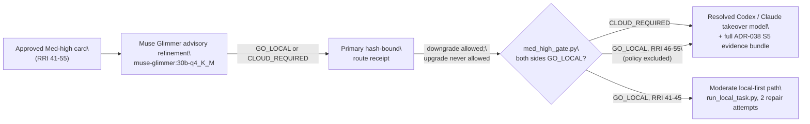

# Agent Workflow Guide

> **Status:** Authoritative. This guide is the highest-authority source for **all**
> agent-facing decisions: workflow, process, implementation discipline, task
> presentation structure, model selection, complexity scoring, testing rules, commit
> rules, handoff format, ADR propagation, and language policy.
> It overrides `CLAUDE.md` (project and global) and `AGENTS.md` without exception.
> `CLAUDE.md` applies only for topics not covered here.

> **Directives only.** This guide states the rules in force. Superseded
> bindings, retired overrides, and the dated lineage behind a rule are
> recorded in `docs/audit/agent-workflow-binding-history.md` and the relevant
> ADRs — never here. Verbose rationale, worked examples, vendor-citation
> lists, and provenance narratives trimmed from this guide for token cost
> live in `docs/audit/agent-workflow-guide-detail-archive.md` — every
> operative rule, gate, table, checklist, and format template stays here.

## Local-model role bindings

| Role | Binding |
|---|---|
| Local implementer, RRI 0–25 | `qwen3.8:27b-mlx` |
| Local implementer, RRI 26–45 and ADR-040 local tramos in RRI 46–55 | `nemotron-3.5-lightning:30b-a3b-q4_K_M` |
| RRI 0–25 reviewer chain (phases 1 and 2) | `muse-glimmer:30b-q4_K_M` → `gemma4:26b-a4b-it-qat` → D14 |
| RRI 26–55 reviewer chain (phases 1 and 2) | `gemma4:26b-a4b-it-qat` → `muse-glimmer:30b-q4_K_M` → D14 |
| Local Architect / Complex Analyst | `muse-glimmer:30b-q4_K_M` — advisory-only (ADR-037), never a phase-1/phase-2 reviewer in any band |

RRI 46–55, Complex, and XL are cloud-only for implementation: the ADR-038
refinement and receipt run as routing evidence, but a `GO_LOCAL` result never
starts a local developer. **RRI 41–45 is the exception (ADR-038 Amendment
3, 2026-08-23):** a `GO_LOCAL` refinement/receipt result routes the whole
task through the same Moderate local-first path as RRI 26–40 (§ Local-first
and Architect-refined implementation routing below), not to cloud. A
`CLOUD_REQUIRED` result in 41–45 still routes directly to cloud, unchanged.

## Mandatory workflow before implementing

0. **Per-task Ollama restart and local-stack precheck** — before the first
   Ollama-backed action of any task using a local model, restart Ollama once
   (even if it looks healthy), confirm a new server PID and a listening
   endpoint (`pgrep -fl ollama`, `lsof -iTCP:11434 -sTCP:LISTEN`), then
   warm-test every model the task's band will use with a review-style
   JSON-only prompt at production `num_predict`/`num_ctx` (`65536` for Low/S
   Qwen roles; `32768` for Moderate nemotron roles, lowered 2026-08-24 for
   host memory constraints — see `scripts/local-agent/run_local_task.py`
   `MODEL_CONTEXT_TOKENS`; the configured reviewer context otherwise),
   confirming `done_reason: "stop"` with non-empty content. Treat empty
   `content` on any
   terminal reason as a capacity symptom, not a stall — enter the
   resource-recovery protocol below rather than retrying unchanged.
   - One restart per repository task ID; retries, repairs, and later local
     phases of the same task reuse it. Confirm no other task's local-model
     runner is active before restarting — wait for it or stop it under its
     own timeout/termination contract rather than killing an unrelated run.
   - **Resource-recovery protocol** on empty `content`, in order: (1)
     `ollama stop <model>`, inspect `GET /api/ps` and host memory pressure
     (`memory_pressure`/`vm_stat` on macOS); (2) retry once with
     `think=false`, `temperature=0`, `num_ctx<=16384`, `num_predict`
     `512`–`1024`; (3) if usable, rebuild the real review/delegation packet to
     fit the reduced context and make one bounded retry at that profile; (4)
     if still empty/invalid, unload and fall back to the band's normal
     reviewer/fallback route — never repeat the same high-memory profile. A
     smaller local model may take a separate D14 review only under an
     ADR-039 fallback-selection receipt authorizing that exact model/effort,
     never as a silent substitute for the band-resolved reviewer. Record
     model, `num_ctx`, `num_predict`, `think`, terminal reason, content
     length, loaded-model state, and the recovery decision in the precheck or
     review artifact — a reduced-profile success does not certify the
     original high-memory profile as healthy.
   - Track as `Restart Ollama + local-stack precheck — <orchestrator>` in the
     live per-task checklist. Operational precondition only — it does not
     replace, skip, or pre-decide the Band-routed peer review outcome, and a
     healthy precheck never retroactively changes a prior phase's recorded
     result.
   - Applies to any task invoking an Ollama-backed local role (implementation,
     phase-1/phase-2 review, Local Architect, Antares, push-review); skip only
     when the task makes no local-model call (docs/config/migration/ADR/plan/
     task-ledger/policy-only tasks normally qualify). Full warm-up curl
     example and per-role context table:
     `docs/audit/agent-workflow-guide-detail-archive.md § Step 0`.
1. **Analyze** — read context, dependencies, and affected files.
   - **Mobile UI / presentation tasks** under `mobile/`: also read the root
     `DESIGN.md` before planning or implementation (governs visual intent and
     component usage; does not replace task files, `mobile/src/theme/
     tokens.ts`, or this guide).
   - **Antares refinement touchpoint** — for any RRI 26+ development task
     carrying a task-relevant CWE hypothesis already on the T3a watchlist
     (`scripts/antares/cwe_watchlist.py`), invoke Antares against the
     existing baseline snapshot (see § Antares Security-Specialist Advisor).
     If no such hypothesis exists, record a typed skip — never invoke Antares
     as a generic sweep. Exempt: docs/config/migration/ADR/plan/task-ledger/
     policy-only tasks. Strictly advisory — never gates or delays approval,
     the band-routed reviewer, or RRI computation.
2. **Plan** — create `docs/plan/<plan-name>.md` with: objective, affected
   files, design decisions, and module dependencies.
3. **Tasks** — create `docs/tasks/<tasks-name>.md` with: an ordered task
   list, inter-task dependencies, acceptance criteria per task, an **Effort**
   field (S/M/L/XL), a short agent handoff prompt, and for each development
   task a small behavioral example set covering both:
   - at least one **happy path example** (`HP-#`) — a concrete success flow
     the task must implement or preserve;
   - at least one **edge case example** (`EC-#`) — a concrete boundary,
     invalid-input, or failure flow the task must handle or reject.
   - when a task can produce benchmark/evaluation/review evidence, metrics,
     or a blocker/promotion-state change, also name:
     - **Evidence to emit** — concrete artifacts expected during execution
       (transcripts, screenshots, audit rows, benchmark outputs, review
       packets, report sections);
     - **Status artifacts affected** — exact ledgers, plans, reports, ADR
       indexes, or downstream blocker docs to synchronize before closure.
4. **Gate by RRI** — compute RRI with `scripts/rri.py`, then apply the
   band's approval gate and implementation route:
   - **0–25 Low** — skip the full human approval presentation. Use local Qwen
     Developer delegation through Ollama only for eligible simple code
     patches; otherwise execute directly as the primary agent.
   - **26–40 Moderate** — show the plan and tasks, wait for explicit
     approval, then implement local-first via
     `scripts/local-agent/run_local_task.py` in a disposable worktree
     (`DUBBRIDGE_LOCAL_AGENT_MODEL`, default
     `nemotron-3.5-lightning:30b-a3b-q4_K_M`), at most 2
     evidence-backed local repair attempts. On 2/2 exhaustion, decompose the
     remaining work into scored Low-band subtasks before considering the
     cloud-takeover model resolved in Step 2 as last resort.
   - **41–55 Med-high** — show the plan and tasks, wait for explicit
     approval, then route through the **ADR-038 Architect-refined
     single-attempt gate**: Muse Glimmer advisory refinement (`GO_LOCAL` |
     `CLOUD_REQUIRED`) → primary hash-bound route receipt (may downgrade,
     never upgrade). For **RRI 46–55**, every result, including `GO_LOCAL`,
     produces the concrete Codex/Claude cloud-takeover packet from Step 2
     with the full evidence bundle. For **RRI 41–45** (ADR-038 Amendment 3,
     2026-08-23), a `GO_LOCAL` result instead routes the whole task through
     the same local-first path as 26–40 Moderate (`run_local_task.py`, 2
     evidence-backed repair attempts, then Low-band decomposition before
     cloud as last resort); `CLOUD_REQUIRED` still routes directly to cloud.
   - **56+** — show the plan and tasks and wait for explicit approval before
     starting implementation, even if a plan was approved in a prior
     session; implementation stays on the cloud path (Premium tier) and
     decomposition remains mandatory before implementation.

   Full routing contract and diagrams: § Local-first and Architect-refined
   implementation routing (RRI 26–55). In every band the primary agent stays
   orchestrator of record, and the human approval gate, band-resolved
   independent review, and Reflection pass count are fixed by the band —
   never by where the code was authored.
5. **Implement** — one task at a time, in the defined order.
6. **Mark progress** — update the tasks document after each completed task
   (it is the crash-safe progress ledger).
7. **Sync status artifacts before reporting completion** — before telling
   the user a task is done, update every materially affected status document
   in the same workflow pass. Completion is not valid until those documents
   are consistent.

## Task definition requirements

- A development task's `docs/tasks/*.md` entry is not complete without
  concrete `HP-#` / `EC-#` examples (one or two bullets each is enough),
  written in behavioral terms (`HP-1: valid ingest token + owned blob ->
  artifact finalized`, not `call finalize_ingestion()`). The pre-task `Happy
  paths considered` / `Edge cases considered` sections derive from these,
  refined as constraints are discovered during analysis.
- Skip this requirement for docs-only, config-only, migration-only, or
  planning tasks unless the task's main risk is behavioral correctness.
- When a task can produce metrics, benchmark outputs, evaluation evidence, or
  a blocker/promotion-state change, its definition is not complete without
  **Evidence to emit** and **Status artifacts affected** (see Step 3 above)
  named up front — these are execution-time outputs, not post-hoc closure
  notes.
- **Behavioral testing semantics:** BDD defines stable externally observable
  product/domain behavior; ATDD-style acceptance discipline is expressed by
  acceptance criteria plus approved `HP-#`/`EC-#` examples and executable
  evidence; TDD is the implementation technique used to drive code with
  tests. Do not collapse these three responsibilities into one test layer.
- New development ledgers default to
  `Behavioral coverage contract: behavior-v2`. Under `behavior-v2`, every
  completed `HP-#`/`EC-#` case must map to passing executable evidence at the
  cheapest layer that genuinely proves the behavior: `unit`, `component`,
  `integration`, `contract`, or `e2e`. The deterministic `make qa-docs` gate
  validates the declared layer, evidence references, Reflection requirement,
  and owner-verification structure; the referenced tests/runners remain
  responsible for proving the behavior itself.
- `Behavioral coverage contract: unit-v1` is the grandfathered legacy
  contract. Its existing unit-evidence semantics and validator remain in
  force for ledgers that already declare it. Do not mass-migrate completed
  historical ledgers solely for consistency; migrate an active/touched
  ledger only when the change materially benefits from cross-layer evidence.
- Stable product/domain behavior that should survive implementation refactors
  or cross subsystem boundaries belongs in canonical `docs/bdd/*.feature`
  specifications and, for strict specs, in the machine-readable mapping
  checked by `make qa-bdd-map`. Do not introduce Cucumber/Behave or another
  BDD runner merely to execute `.feature` files.

## Per-task discipline

- **Phase 1 — Task-analysis review** (before presenting or delegating any
  task): run the reviewer resolved by the canonical `Band-routed peer
  review` table on the task card/plan. Record the phase-1 report line with
  the actual reviewer, artifact, and verdict — do not maintain a second band
  mapping here. A `BLOCKED` verdict stops presentation or delegation until
  revised, explicitly waived by the user, or reported as blocked. Exempt:
  docs/config/migration/ADR/plan/task-ledger/policy-only tasks record `n/a`
  with the exemption stated.
- **Every local-developer delegation packet requires its own phase-1 pass
  before it is sent — not only the task as a whole.** A phase-1 `PASS` on an
  earlier packet version does not carry forward to a materially revised one
  (corrected interface contract, fixed constraint, re-scoped criterion,
  etc.). Any packet the orchestrator changes before a repair/re-delegation
  attempt must go back through the band's phase-1 reviewer and get its own
  `PASS` (or a recorded, resolved `BLOCKED`) before it reaches the local
  developer. This applies within a single task's repair-attempt budget, not
  only across tasks — a later delegation attempt is a new phase-1 event with
  its own distinct artifact and verdict (never overwrite or merge them). If
  the reviewer flags something in the revised packet the orchestrator
  believes is incorrect, verify the claim with a reproducible test (not
  assertion) before accepting or overriding it, and record both the original
  verdict and the resolution. Worked example:
  `docs/audit/agent-workflow-guide-detail-archive.md § Per-task discipline`.
- Present the next task using the `AGENTS.md` presentation contract before
  executing it when approval is required. For RRI 0–25, do not present the
  full task; prepare a Qwen Developer delegation packet for an eligible simple patch,
  otherwise execute directly and report normally.
- **Pre-task summary for development tasks:** the compact card's `Scope and
  acceptance` block must name the primary `HP-#`/`EC-#` behaviors, and its
  workflow table must name the required Reflection pass count and pass
  focuses for RRI 26+. A compact technical-scope Mermaid diagram is
  mandatory. Full definitions stay in the linked task ledger. Skip
  development-only content for docs/config/migration-only/planning tasks
  unless requested.
- **Status-document synchronization is part of the task itself, not
  follow-up cleanup.** Before implementation starts, derive the explicit
  execution-time documentation set (evidence/metrics to emit, status
  artifacts to sync) from the task definition. When evidence becomes
  available mid-execution, update the named artifacts in the same workflow
  pass. Do not report a task complete while any governing status document
  shows stale state. When a completion changes the status of a slice,
  dependency, ADR, or blocked downstream task, update all materially
  affected documents in the same pass — at minimum check `docs/tasks/*`,
  `docs/plan/roadmap.md`, the linked `docs/plan/*` slice file, dependent
  task ledgers, ADR status/implementation references, and any handoff/
  blocking-gate language naming the completed work.
- When an ADR is created, amended, or deleted as part of a task, apply the
  **ADR change propagation** contract below in the same workflow pass.
- Work on the approved or delegated task only; show a summary before
  switching to the next.
- **Post-task summary for development tasks:** the summary must include
  **Happy paths covered** and **Edge cases covered** — the success/boundary
  flows exercised by the implementation and tests, each with **code
  evidence** (concrete files, functions, and tests, with a short explanation
  of what each demonstrates). Required only for development tasks; skip for
  docs/config/migration-only/planning tasks.
- **Behavioral coverage certification:** before marking a `behavior-v2`
  development task `[x] Done`, add a `Behavioral coverage certification`
  section mapping every approved `HP-#`/`EC-#` case to at least one passing
  executable evidence reference and its test layer. Pure deterministic logic
  should normally map to unit evidence; cross-boundary behavior may map to
  component, integration, contract, or E2E evidence when that is the
  cheapest layer that genuinely proves the behavior. `N/A` is not allowed
  for development-task cases — revise the behavior/evidence contract before
  closure if the case is not actually executable.
- Legacy `unit-v1` ledgers retain their required `Unit coverage
  certification` format and unit-test semantics; the legacy validator
  remains authoritative for those ledgers.
- The same completion record must include `Owner final verification` with
  owner, date, verification statement, and exact commands run. The owner
  certifies each referenced evidence item genuinely covers the claimed
  behavior; the automated gate verifies structure and referenced-evidence
  existence/selector rules, not semantic sufficiency.

Required completion format for new development tasks (`behavior-v2`):

```md
### Behavioral coverage certification

| Case ID | Type | Behavior | Layer | Executable evidence | Result |
|---|---|---|---|---|---|
| HP-1 | Happy path | valid input creates session | integration | `apps/gateway/tests/auth.rs::valid_login_creates_session` | passed |
| EC-1 | Edge case | unknown state fails closed | unit | `apps/gateway/src/auth/login.rs::unknown_state_returns_unauthorized` | passed |

### Owner final verification

- Owner: `<name-or-handle>`
- Date: `YYYY-MM-DD`
- Statement: I verified every happy path and edge case defined for this task has executable evidence at an appropriate layer that replicates the expected behavior.
- Commands run: `<exact test/runner commands>`
```

## Live per-task phase todo list

Every orchestrator (Claude Code, Codex, or any other primary agent acting as
orchestrator of record) must keep a **live, per-task todo/checklist** mirroring
the Compact Approval Task Card's `Agent workflow` block (block 3), kept
current as the task actually moves through phases — block 3 is a frozen
presentation-time snapshot; this checklist is the running tracker during
execution.

**Mechanism (tool-agnostic).** Use whichever native checklist/plan mechanism
the orchestrator has (Claude Code's `TodoWrite`; Codex's own plan/task
tracker). Both must render an equivalent visible list: one entry per
applicable phase, each naming the **resolved responsible agent/model** (not a
generic role label), with status `pending`/`in_progress`/`blocked`/
`completed`.

**Phase set by band:**

- **Any task invoking an Ollama-backed local role:** prepend `Restart Ollama +
  local-stack precheck — <resolved orchestrator>`, seeded immediately before
  the task's first local-model invocation (even when that invocation is the
  phase-1 reviewer, preceding the approval card). Add remaining entries as
  their route resolves. This entry adds no human gate and replaces no review
  phase.
- **RRI 26+ (Moderate through Complex+):** one entry per approval-card
  `Agent workflow` row — Analyze/scope, Phase 1 review, Approval, Implement,
  Reflect and verify, Phase 2 review, Close.
- **RRI 0–25 (Low):** a reduced list matching applicable phases — e.g.
  Analyze, Muse Glimmer/Gemma/D14 review, Implement (primary agent or Qwen Developer),
  Close.
- **Docs/config/migration/ADR/plan/task-ledger/policy-only tasks:** a
  minimal list (1–3 entries); a genuinely single-step task may skip it
  entirely.

**Update discipline:**

- Seed the list before implementation starts — immediately after approval
  (RRI 26+) or immediately before direct execution (RRI 0–25); seed the
  Ollama precheck entry earlier if its first call precedes that point.
- Normally exactly one entry is `in_progress` at a time.
- Flip to `completed` only when that phase's own gate has actually passed
  (e.g. not "Phase 1 review" before the reviewer's verdict is `PASS`).
- A `BLOCKED` verdict, failed acceptance run, or escalation keeps the entry
  `blocked` — never silently `completed` or dropped — until resolved,
  user-waived, or reported blocked.
- When a task reroutes mid-flight (local implementer escalates to cloud, a
  Med-high gate resolves `CLOUD_REQUIRED`, a reviewer falls back down its
  chain), update the entry's responsible agent/model to the actual resolved
  participant — never leave a pre-escalation name in place.

**Authority boundary.** The live todo list is a transparency/tracking
artifact, not a new approval or review gate. It never replaces the HITL
approval checkpoint, the band-routed review chain, the Reflection log, or any
other closure gate. `completed` still requires that phase's own evidence
(review artifact, Reflection log, behavioral coverage cert, owner verification,
etc.) — the checklist records the step happened, not that it happened
correctly.

## ADR change propagation

An ADR change outside a task ledger (a replan, hotfix, or cross-cutting
amendment) is still subject to this contract — apply the matching row in the
same change, not as a follow-up.

| ADR change | Must review and update in the same change |
|---|---|
| **New ADR** | `docs/adr/README.md` index row; ADR frontmatter block (`type: ADR`, `title:`, `status:`); `docs/architecture.md` if it adds/alters a runtime/crate boundary; `docs/plan/roadmap.md` if it changes slice scope/dependencies; the affected `docs/plan/*` and `docs/tasks/*` files |
| **Status change** (`Proposed` → `Accepted` → `Superseded`/`Deprecated`) | ADR frontmatter `status:` (must mirror prose `- **Status:**` token); index `Status` column; every canonical doc citing the ADR as authority for a decision |
| **Scope narrowed or broadened** | index scope annotation; `docs/architecture.md`; `docs/plan/roadmap.md`; affected plan/tasks; `README.md` if outward-facing |
| **Content / decision change** | every canonical doc whose prose describes that decision — semantic, not machine-verifiable; automation confirms references resolve, human review owns whether the prose is still accurate |
| **Superseded by ADR-YYY** | both ADRs' frontmatter (`status:`/`supersedes:`/`superseded_by:`); both ADRs' prose `Status`; the index row for each; every doc citing the superseded ADR |
| **Deletion or renumbering** | see the deletion rule below; update the index, every doc citation, **and every code/migration comment** (`.rs`, `.sql`) in the same change |

**Deletion rule.** An `Accepted` ADR is part of the auditable decision record
and must **not be deleted** — mark it `Superseded by ADR-YYY` or `Deprecated`
instead. A `Proposed` ADR never adopted may be deleted only after every
reference (docs and code/migration comments) is removed in the same change.
Renumbering is a delete + create and must update all references atomically.

**Definition of done for any ADR change:**
- [ ] The ADR file's prose `- **Status:**` line is updated.
- [ ] Frontmatter `status:` mirrors the prose token; `supersedes:`/
      `superseded_by:` set where applicable.
- [ ] `docs/adr/README.md` index row matches (status token + title).
- [ ] Every doc in the matching propagation row above reviewed and updated.
- [ ] No code or migration comment cites a missing ADR number.
- [ ] `make qa-docs` passes (index parity, completeness, dangling refs in docs
      and code/migrations, superseded-successor existence, OKF frontmatter).

`make qa-docs` deterministically guarantees: every cited ADR file exists;
index↔file status tokens agree; the index is complete; a `Superseded` ADR
names an existing successor; no code/migration comment cites a missing ADR.
It does **not** guarantee that a canonical doc's *prose* still accurately
describes a changed decision — that is semantic and human-review-only; the
propagation table tells the author which prose to re-read, not that the
update was made correctly.

## Effort scale

| Level | Agent reasoning | Example |
|-------|-----------------|---------|
| S  | Mechanical — transcription, copy, merge | Config files from an explicit spec |
| M  | Moderate — contracts, logic, edge cases | Boundary tests; small services |
| L  | High — multiple subsystems, architecture | Process supervisor with replay tests |
| XL | Very high — RRI-driven reasoning, risk, and verification burden | Cross-boundary redesign with explicit risk analysis |

**Canonical effort mapping (required):** `Effort` must reflect the computed
**RRI band**, not a subjective time/annoyance estimate — see
`docs/policies/RRI_POLICY.md` §Bands, autonomy gates, and model tiers for the
canonical crosswalk. The S/M/L/XL descriptions above are illustrative; the RRI
band is authoritative. Effort, capability tier, and autonomy gate are each
derived in parallel from the RRI band — never derive capability or gate from
Effort. Do not use `Effort` to encode toolchain pain or operator frustration
when the computed RRI is lower; if an existing ledger's `Effort` disagrees
with the computed band, fix the ledger in the same change.

## Model and thinking-mode selection

This section is the canonical source for complexity scoring, model-tier
selection, and thinking-mode guidance. `AGENTS.md` defines the presentation
fields; agents must derive values from this guide, not agent-specific
defaults.

Agents must separate the **capability decision** (`Economy`/`Balanced`/
`Premium`, derived from the formulas below) from the **concrete model
resolution** (the current vendor model ID that best fits that capability at
presentation time) — never collapse these into one undocumented guess.

The **RRI 0–25 Low band** is the exception to vendor model resolution:
eligible simple patches may use local Qwen Developer delegation through
Ollama (`DUBBRIDGE_LOW_RRI_MODEL`, default `qwen3.8:27b-mlx`; `OLLAMA_HOST`,
default `http://localhost:11434`).

### Local-first and Architect-refined implementation routing (RRI 26–55)

The **26–40 Moderate band** keeps Codex/Claude recommendations for
orchestration/escalation but moves the default code-authoring surface local:
`scripts/local-agent/run_local_task.py` (`DUBBRIDGE_LOCAL_AGENT_MODEL`,
default `qwen3.8:27b-mlx`) inside a disposable worktree, at most 2
evidence-backed local repair attempts. On 2/2 exhaustion, first decompose the
remaining work into scored Low-band subtasks; cloud is the last resort when
that route cannot proceed.

**Med-high (41–55):** ADR-038 is its fail-closed, evidence-bearing
refinement/receipt gate. **RRI 46–55** is cloud-only **for the whole task**
except a module independently qualified under ADR-040 per-module split
routing (below). **RRI 41–45** (ADR-038 Amendment 3, 2026-08-23) is the
exception: a `GO_LOCAL` result routes the whole task through the same
local-first path as 26–40 Moderate instead of cloud.



Implementation surfaces: `scripts/local-architect/run_analysis.py`
(`med-high-refinement-v1` profile) for the Muse Glimmer artifact,
`scripts/local-agent/med_high_gate.py` for the fail-closed route decision,
`scripts/local-agent/run_med_high_task.py` for automatic cloud-evidence-bundle
emission on every `CLOUD_REQUIRED` or 46–55 `GO_LOCAL` result. For **RRI
41–45**, a `GO_LOCAL` result instead hands off to
`scripts/local-agent/run_local_task.py` exactly as Moderate does — no
whole-task local attempt/repair applies to 46–55 outside an ADR-040-qualified
module.

Both sub-bands keep the band-resolved independent reviewer, 3 Reflection
passes, and the RRI 26+/41+ human approval gate.

#### Post-repair-budget Low-band decomposition

**Once Moderate's whole-task local-agent repair budget is exhausted (2/2),**
the default next step is **not cloud escalation** — it is to decompose the
remaining implementation into scored Low-band (RRI 0–25) subtasks and keep
authoring local, via `scripts/delegate-low-rri.py` (`--mode full-file` for
new files, `--mode before-after` for small edits), with the primary agent as
orchestrator only — diagnosing, splitting, dispatching, reviewing, and
assembling, never authoring substantive logic directly. Cloud escalation
stays available as the fallback of last resort, not the default.

An ADR-040-qualified local module tramo follows its own two-attempt local
budget and may use this decomposition route for remaining module work. A
**46–55** Med-high whole-task `GO_LOCAL` advisory never starts a local
developer and never creates a whole-task local repair budget. **RRI 41–45**
(ADR-038 Amendment 3) is the exception: a `GO_LOCAL` result there does start
a whole-task local attempt under the Moderate route, including this same
post-repair-budget decomposition step on 2/2 exhaustion.

A direct orchestrator edit is permitted only in two narrow, explicitly
recorded cases: (1) a **documented tooling-failure exception** — the local
model correctly diagnosed and proposed a fix, but the delegation wrapper
failed to construct/apply a usable diff; or (2) a **mechanical
lint-driven refactor** of already-verified logic with no behavior change.
Both must be recorded as such, distinct from any orchestrator-diagnosed fix,
which this route does not permit.

This never changes the task's RRI, band, band-resolved reviewer, Reflection
pass count, or the RRI 26+ human-approval gate — only who authors the
remaining code once the whole-task local route's budget is spent. No
additional per-subtask approval is required once the containing task is
already HITL-approved. A `### Implementation routing evidence` block is
required in the closure record — full route, evidence-block contract, and the
validated `S-150-T2c-iv-c` worked example:
`docs/policies/HITL_AUTONOMY_POLICY.md § Post-repair-budget Low-band
decomposition`.

#### Per-module complexity-split routing (RRI 26–55, ADR-040)

For an **approved** task (26–40 or 41–55) whose `allowed_paths` span two or
more files, the orchestrator may split implementation authorship by
per-module cyclomatic complexity instead of the whole-task routes above —
a routing refinement firing after HITL approval and phase-1 review, changing
only which files each implementer authors, never RRI, band, reviewer,
Reflection count, or closure gates.


The diagram is the operative contract; the trigger, hard-exclusion, and
partition checks are enforced by `scripts/local-agent/module_split_gate.py`
(`evaluate_split()`/`next_cloud_action()`, tested). Not yet built: the
module-split capsule format and `run_local_task.py`/`run_med_high_task.py`
dispatch integration — until then the orchestrator invokes the gate for the
split decision but records the interface-freeze capsule and dispatches both
tramos manually, and says so in the evidence block. Record a `### Module-split
routing evidence` block whenever this route is evaluated (including a
`no split` result and its reason). Hard domain exclusion reuses the ADR-038
§6 list (auth, security, rights/consent/governance, migrations, unresolved
ADR decisions, unbounded scope). Full contract, evidence field list, and
alternatives considered: `docs/policies/RRI_POLICY.md` § Per-module
complexity-split routing and
`docs/adr/ADR-040-per-module-complexity-split-implementation-routing.md`.

### RRI — canonical scoring method

The **Required Reasoning Index (RRI)** is the canonical method for deriving
complexity, risk, model tier, and autonomy gates. The full procedure (formula,
scoring rubric, anchor rubric, penalty table, bands, decomposition triggers)
lives in `docs/policies/RRI_POLICY.md`. `AGENTS.md`/`CLAUDE.md` summarize this
guide and must be synchronized whenever its presentation/routing contract
changes.

Step 1 below computes the RRI formula's `C` variable; Step 2's tier mapping
is driven by the RRI band, not the raw CC label; Step 3 projects the compact
RRI summary into the task presentation (RRI 26+) or delegation packet/final
report (RRI 0–25).

Before presenting or delegating any task: **run `scripts/rri.py`** — do not
compute the RRI by hand. It measures F automatically and maps raw CC to the C
score via the policy table. Store its full markdown output in the task
ledger or a linked RRI artifact.

```bash
# Task-presentation time (before code is written — diff is empty):
python3 scripts/rri.py \
  --touches <path1> --touches <path2> \
  --cc <raw-cyclomatic-complexity> \
  --D <0-5> --K <0-5> --P <0-5> \
  --T <0-5> --A <0-5> --X <0-5> \
  [--penalty refactor_and_behavior] [--penalty arch_decision] [--penalty no_verification]

# Post-implementation (diff available; omit --touches):
python3 scripts/rri.py --cc <raw> --D <0-5> --K <0-5> --P <0-5> \
  --T <0-5> --A <0-5> --X <0-5>
```

Measure C and T before invoking: `radon`/`mccabe` (Python) or
`clippy::cognitive_complexity` (Rust) for C; `cargo llvm-cov` for T. The
script applies D/P/K floors from the anchor rubric and auto-detects four
penalties — agent supplies only the three intent-based ones. See
`docs/policies/RRI_POLICY.md § Script automation` for the full split and
`--json` output.

### Step 1 — Compute complexity

**For development tasks (code to write or modify):** compute the
**cyclomatic complexity** (McCabe, 1976) of the functions created/materially
changed: `CC = E − N + 2P` (E=edges, N=nodes, P=connected components).
Practically: start at 1, add 1 for each `if`, `else if`, `match` arm,
`while`, `for`, `loop`, branching `?` propagation, `&&`/`||` in a condition.

| CC range | Cyclomatic (C) label | RRI `C` variable score |
|---|---|---|
| 1–5 | Low | 0–1 |
| 6–10 | Medium | 1–2 |
| 11–20 | High | 2–3 |
| > 20 | Very High | 4–5 |

> **Subsumed by RRI:** use the full RRI score, not just `C`, to determine
> model tier and autonomy gates — `docs/policies/RRI_POLICY.md` has the
> complete procedure.

**For non-development tasks:** use the **decision-weight heuristic** — count
irreversible decisions (schema/public-API/CI-gate changes, deletion of
authoritative files, policy changes) plus external dependencies (live DB,
external APIs, version-sensitive CLI tools, network-bound ops):

| Score | Complexity label |
|---|---|
| 0–2 | Low |
| 3–5 | Medium |
| 6–9 | High |
| ≥ 10 | Very High |

### Step 2 — Map to model tier (cost / capability balance)

Prefer capability tiers over pinned model IDs — model names change over time.

| Tier | Best for |
|---|---|
| Economy | Low-complexity, mechanical tasks |
| Balanced | Medium-complexity, standard implementation work |
| Premium | High / Very High complexity, architecture, synthesis, deep debugging |

The **RRI band** (incorporating `C`, `F`, `D`, `T`, `A`, `K`, `P`, `X`, and
penalties) selects the tier via the crosswalk in `docs/policies/RRI_POLICY.md`
§Bands, autonomy gates, and model tiers — the complexity label alone never
determines the tier.

Resolution rules: for RRI 0–25 use the primary-agent/local Ollama protocol in
`docs/policies/RRI_POLICY.md § Low RRI local delegation` (see also
`docs/playbooks/LOW_RRI_LOCAL_MODEL_HANDOFF.md`); a cloud recommendation is
unnecessary unless that bounded path escalates. Resolve each capability label
to the best currently available model; verify current vendor guidance before
naming an ID if there's any chance the recommendation changed (OpenAI docs
for OpenAI, Anthropic docs for Claude). Produce the final recommendation in
order: compute complexity (Step 1) → map to tier (Step 2) → resolve to
current vendor model → present with any task-local override noted. `Effort`
derives from the computed RRI band (fix ledger metadata if it disagrees — do
not carry the inconsistency forward). A task-local pinned model overrides the
default tier mapping; if it looks stale, either present it as an explicit
override or update the task metadata in an approved change — never silently
swap it.

#### Current Codex cloud-takeover resolution

Presentation-time default verified against official OpenAI documentation on
2026-08-09 — re-check official guidance when preparing a new task card;
preserve any task-local pin until an approved change replaces it.

| RRI / capability | Trigger | Codex model to present | Starting reasoning effort |
|---|---|---|---|
| **0–25 / Low** | Qwen Developer unavailable/unusable, or bounded repair fails | `gpt-5.6-luna`; `gpt-5.6-terra` at `low` only if Luna is unavailable | `low` |
| **26–40 / Balanced** | Local runner/model unavailable, scope enforcement fails, or repair budget exhausted | `gpt-5.6-terra` | `medium` |
| **41–55 / Balanced -> Premium** | Operational-only | `gpt-5.6-terra` | `high` |
| **41–55 / Balanced -> Premium** | `CLOUD_REQUIRED` or capability/risk | `gpt-5.6-sol` | `high` |
| **56–70 / Premium** | Approved decomposed subtask (cloud primary) | `gpt-5.6-sol` | `high`; `xhigh` only when eval evidence shows a gain |
| **71–85 / Premium** | Approved subtask, human diff review | `gpt-5.6-sol` | `xhigh`; compare `max` only for the hardest quality-first case |
| **86–100 / Premium** | ADR/risk analysis and decomposition only, no implementation | `gpt-5.6-sol` | `max` |
| **>100 / Premium** | Architecture/design and re-scoping only, no implementation | `gpt-5.6-sol` | `max` |

Local-first position for 0–55 is set by § Model and thinking-mode selection
and § Local-first and Architect-refined implementation routing above (Qwen
Developer for eligible Low patches; `qwen3.8:27b-mlx` local-first for
Moderate; ADR-038 cloud-only for Med-high 46–55, local-first for Med-high
41–45 per ADR-038 Amendment 3); 56+ has no local-first position.
Classify the takeover cause before choosing the model: **operational-only**
means the local service/binding/process/machine is unavailable with no
evidence the task itself is harder than scored (don't spend Premium capacity
merely because Ollama is down); **capability/risk** means cloud won before
local execution because of an ADR-038 hard exclusion, `CLOUD_REQUIRED`, or the
local attempt evidencing an acceptance/scope/ambiguity/reasoning gap (use the
Premium resolution, carry the full escalation evidence). In Moderate, two
capability-related local failures are evidence the original RRI/decomposition
may be incomplete — re-run `scripts/rri.py` and re-apply the gate before
promoting Terra→Sol; an infrastructure-only failure does not change the RRI.

The approval card must show the local route and cloud takeover separately;
for a conditional Med-high route write both branches, e.g. `operational-only
-> gpt-5.6-terra/high; capability-or-risk -> gpt-5.6-sol/high`. If cloud is
already the winning route, name the concrete cloud model instead of leaving
`Codex` unresolved. Vendor-citation basis for this table:
`docs/audit/agent-workflow-guide-detail-archive.md § Model tier resolution`.

#### Current Claude Code capability resolution

Presentation-time default verified against the active Claude Code runtime's
model roster on 2026-08-09 — re-check current guidance per new task card;
preserve any task-local pin. This is the canonical source
`docs/policies/RRI_POLICY.md § Model tier resolution` points to for the
`Capability (Claude Code)` column; `CLAUDE.md`/`AGENTS.md` must not carry
their own copy — they summarize and link here.

| RRI band | Claude model to present | Thinking | Escalation within band |
|---|---|---|---|
| **0–25 / Low** | Whichever model is already running the session; no Claude-cloud resolution needed | Off | n/a |
| **26–40 / Balanced** | `claude-sonnet-5` | Off | none — stays on Sonnet 5 |
| **41–55 / Balanced → Premium** | `claude-sonnet-5`; escalate to `claude-opus-5` only if the bounded attempt stalls or repeatedly fails | On | Sonnet 5 → Opus 5 on stall/failure |
| **56–70 / Premium** | `claude-opus-5` | On | n/a |
| **71–85 / Premium** | `claude-opus-5` | On | n/a |
| **86–100 / Premium** | `claude-opus-5` (analysis/decomposition only) | On | n/a |
| **>100 / Premium** | `claude-opus-5` (re-scope only) | On | n/a |

Escalate to `claude-opus-5` only for long-context-heavy, synthesis-heavy, or
repeatedly-stalling tasks under Sonnet — do not escalate merely because Codex
escalated to `gpt-5.6-sol` in the same row; the two vendor resolutions are
independent. **Thinking mode:** activate for multi-step reasoning that can't
be validated incrementally (architecture trade-offs with 2+ interacting
constraints, novel algorithmic design, non-deterministic-failure diagnosis);
do not activate for tests of already-specified logic, config edits, doc
updates, or fully pre-defined strategy. Vendor-citation basis:
`docs/audit/agent-workflow-guide-detail-archive.md § Model tier resolution`.

### Step 3 — State it in the task presentation or delegation packet

For RRI 26+, use the **Compact Approval Task Card v2** — a projection of the
linked task ledger and full RRI evidence, not a second task definition. Keep
it to six content blocks:

1. **Decision header** — task ID/title, status, final RRI/band, Effort,
   approval gate, plus a routing table with orchestrator, concrete
   Codex/Claude recommendations, resolved primary route, cloud-takeover
   trigger/model, penalties, dominant RRI drivers, and a link to full RRI
   evidence. For RRI 26–55, the cloud-takeover field must name the §
   Post-repair-budget Low-band decomposition default before the last-resort
   cloud trigger — never show repair-budget exhaustion escalating straight
   to cloud.
2. **Scope and acceptance** — one-sentence objective, in/out-of-scope
   paths/behaviors, primary `HP-#`/`EC-#` criteria, evidence to emit, status
   artifacts to sync.
3. **Agent workflow** — a table naming the actual responsible participant for
   analysis, phase-1 review, human approval, implementation,
   Reflection/testing, phase-2 review, closure, each with gate/output and
   fallback, showing the route resolved for this task. For RRI 26–55, the
   `Implement` row's fallback must name the same Low-band decomposition
   default before cloud.
4. **Diagrams** — one compact agent-workflow Mermaid diagram; development
   tasks add one compact technical-scope diagram; never exceed two.
5. **References** — task, plan, and only materially governing
   policies/ADRs.
6. **Approval checkpoint** — the required HITL wording, or a recorded
   bounded user waiver.

The reusable projection lives at
`docs/templates/compact-approval-task-card.md`; the linked task ledger holds
the full task definition and unmodified `scripts/rri.py` markdown report.

For RRI 0–25, do not present a full approval card — put the full RRI report
in the local delegation packet and final report.

Every presentation must provide one concrete current recommendation for
OpenAI/Codex and one for Claude Code/Anthropic, both derived from the same
computed complexity and tier-mapping rules — never present only one vendor
unless the task file explicitly scopes to a single vendor environment. For
RRI 0–25, use the resolved primary-agent/eligible-Qwen route and note the
active agent remains reviewer/orchestrator; for RRI 26–55, keep Codex/Claude
recommendations for orchestration/escalation and name both the local
implementer and conditional cloud takeover model/trigger in the routing
table.

**Compact-card rules:** always show the computed `Complexity score` even if
the task file declares `Complexity:`; every card includes the agent-workflow
diagram (development tasks also the smallest technical diagram that makes
the implementation boundary obvious); keep acceptance to decision-relevant
behaviors, linking to the full task definition rather than copying it; keep
the workflow table to seven phase rows with every agent/model's
responsibility, gate, and fallback visible; state a task-local
complexity/model override explicitly; prefer the actual resolved model
identifier over a generic tier label; a "recommended" model ID must trace to
current official vendor guidance or a task-local pin; add a one-line
rationale when the mapping is non-obvious.

### Human-selected fallback checkpoint (ADR-039)

Before a terminal local-review or local-implementation failure can invoke
D14 or a cloud implementer, the responsible script must emit a
`fallback-selection-v1` artifact bound by SHA-256 to the exact fallback
packet — it authorizes a later invocation, never invokes a model itself.

- `human-select` is the interactive default: if model, reasoning effort, or
  selector is absent, emit `awaiting_fallback_selection`, stop, and do not
  invoke the fallback.
- `preauthorized` is valid only when model, effort, and selector were frozen
  in the approved card or preflight; missing fields fail closed.
- Before resuming, the orchestrator validates the receipt against the
  current packet and invokes exactly the selected model/effort — a missing,
  stale, role-mismatched, or digest-mismatched receipt remains blocked.
- D14 stays a read-only, context-isolated Balanced-tier adjudicator; cloud
  implementation is separately selected. Neither selection changes RRI,
  HITL approval, reviewer independence, repair budgets, or scope gates.

The approval card records the selection mode and artifact/resume condition
when a fallback is possible; the Low handoff packet records the same for
Gemma-to-cloud escalation. See ADR-039 for the schema and frozen
recommendation matrix.

## Reflection design pattern for development tasks

When a development task has an RRI of 26 or higher, the agent must apply
**Reflection** passes before reporting the task complete — each pass a
complete Draft → Critique → Revise loop.

| RRI band | Label | Required Reflection passes |
|---|---|---|
| 26–40 | Moderate | 2 |
| 41–55 | Med-high | 3 |
| 56–70 | Complex | 4 |

**MANDATORY:** for RRI 56+, decomposition is mandatory before implementation
— follow the decomposition and human-review gates in
`docs/policies/RRI_POLICY.md`, split to the policy target, then implement the
approved subtasks with at least 4 Reflection passes.

For RRI 26+, the compact card's `Reflect and verify` row states the RRI/band,
required pass count, and a terse ordered focus (e.g. `contract -> failure
boundaries -> coverage`) — a separate Reflection section is not required in
the approval card, but the row must make clear every pass is a full Draft ->
Critique -> Revise loop; detailed findings/revisions belong in the closure
`Reflection log`.

Each pass: **Draft** (produce/treat the current revised implementation per
acceptance criteria, happy paths, edge cases); **Critique** (re-read as if
reviewing someone else's code — logical correctness against every `HP-#`/
`EC-#`, error handling at boundaries, unintended side effects, applicable
design patterns for performance/UX where user-facing, test coverage gaps
against the applicable gates); **Revise** (apply concrete fixes, or state
explicitly that none are needed); **Certify** (proceed to behavioral
coverage certification only after every required pass has a complete loop
recorded).

Document passes in the task completion record as a `### Reflection log`
section before `### Behavioral coverage certification` for `behavior-v2`
ledgers (legacy `unit-v1` ledgers keep `### Unit coverage certification`):

```md
### Reflection log

Required passes: <N> (`<RRI>` → `<band>`)

#### Pass 1

- **Draft verdict:** <one-line summary of current state>
- **Critique findings:** <bullet list of issues found, or "no issues found">
- **Revisions applied:** <bullet list of changes made, or "none">

#### Pass 2

- **Draft verdict:** <one-line summary of current state>
- **Critique findings:** <bullet list of issues found, or "no issues found">
- **Revisions applied:** <bullet list of changes made, or "none">
```

For RRI 0–25 tasks delegated to local Qwen Developer, apply the Reflection
cycle to Gemma's output during the mandatory review step and record it in the
final report, not inside the delegated task. Skip the cycle for
docs/config/migration-only/planning tasks; at the RRI 25–26 boundary, apply
judgment — if the task writes non-trivial logic, apply it.

## Testing and commit rules

- **TDD where practical.** For a reproducible defect, add the regression test
  first, confirm it fails for the intended reason (RED), implement the fix,
  then confirm it passes (GREEN). For deterministic critical logic — domain
  invariants, authorization, rights/consent fail-closed gates, parsers,
  routing/state machines and policy decisions — strongly prefer test-first
  unless a concrete reason is recorded. Do not force test-first chronology
  for wiring, trivial DTOs, migrations/config, generated glue, or purely
  visual changes when another evidence layer is the correct proof.
- The **90% line-coverage threshold is the Rust workspace gate** enforced by
  `cargo llvm-cov` with the repository's configured filename exclusions. It
  is a quality gate, not a claim that every stack has 90% line coverage.
  Mobile is gated independently by typecheck, lint, and Jest; cross-stack
  behavioral completion is enforced through `behavior-v2` evidence.
- Prefer real backends over mocks.
- **Do not commit if any test is broken.** Run all tests before commit and
  push.
- Keep the automated coverage gate aligned with CI. If the Rust threshold or
  exclusions change, update this guide and the corresponding Makefile/CI
  configuration in the same change.
- The `.githooks/pre-push` hook enforces the fast deterministic Rust gates
  (`fmt`, `clippy`, `test`, `cargo check`) plus dependency-policy checks when
  Cargo manifests change; CI keeps the full blocking baseline including the
  Rust 90% coverage gate and the separate mobile gate. Enable with
  `git config core.hooksPath .githooks`.
- Ask for confirmation before deleting anything.

## Handoff prompt format

Keep handoff prompts minimal — the task was already presented and approved,
or is in the RRI 0–25 local-delegation band; do not re-explain it.

A human-agent handoff prompt must contain only: (1) task ID + one-line goal;
(2) governing docs (task file + plan file, paths only); (3) the one file +
line range with the logic to change; (4) exact acceptance criteria (bullets
only, no prose); (5) stop condition — what the agent must do last and must
NOT start next.

For RRI 0–25 local Qwen Developer delegation, build a delegation packet
instead: task excerpt, acceptance criteria, RRI output, allowed paths,
relevant file snippets, stop conditions — sent via
`scripts/delegate-low-rri.py` (local Ollama request with the repo timeout).
Qwen Developer must return the tagged-block contract with complete file
contents per changed file; the delegating agent validates the response, lets
the wrapper build/check the diff, personally reviews the solution, runs
verification, and performs at most one bounded repair cycle before
escalating. Qwen Developer must not evaluate or approve its own delegated
work. For harder Low-RRI attempts, the wrapper supports `--temperature`/
`DUBBRIDGE_LOW_RRI_TEMPERATURE` and `--think`/`--no-think`/
`DUBBRIDGE_LOW_RRI_THINK`; keep thinking off by default (it can consume the
token budget before the tagged response completes).

For **RRI 26–40 local-first implementation** (Moderate), use
`scripts/local-agent/run_local_task.py` in a disposable git worktree. The
primary agent remains orchestrator of record — owning the task card,
`allowed_paths`, verification commands, Reflection passes, closure, and
final accept/reject judgment. The local implementer resolves from
`DUBBRIDGE_LOCAL_AGENT_MODEL` (default
`nemotron-3.5-lightning:30b-a3b-q4_K_M`), receives the
complete authorized file contents up front, and cannot read files or run
processes itself.

The runner exposes a deliberately simple, card-bound tool contract —
`write_file` (create or overwrite), `apply_patch` (single-unique-anchor
replacement), and `finish`. Every edit is limited to the card's
`allowed_paths`; any model-issued read, command, or unlisted-path access
terminates immediately as `boundary_violation`. On `finish`, the runner
formats only edited authorized Rust files through isolated temporary copies,
then runs the operator-authored `acceptance_tests` in order; a formatter or
acceptance failure returns its output plus refreshed authorized file
contents for a bounded repair. The final diff scope check remains mandatory
as defense in depth. (Provenance for this clause's role as the canonical
`local_developer` prompt source:
`docs/audit/agent-workflow-guide-detail-archive.md § Handoff prompt format`.)

At finish, the DEV result is fail-closed on its own responsibilities only:
the final diff must remain in scope and acceptance commands must pass before
the audit may carry the `local-implementer` signature. Code organization,
independent review, coverage, and closure remain later orchestrator-owned
phases and do not rewrite the DEV result. A success audit records scope,
acceptance/verification results, edit metrics, implementer model, and the
signature. Use at most **2** evidence-backed local repair attempts for
Moderate (26–40) and for Med-high 41–45 on a `GO_LOCAL` result (ADR-038
Amendment 3); Med-high 46–55 is cloud-only after its ADR-038 evidence gate.
If the local runner/model is unavailable, the repair budget is exhausted, or
the task violates the scope boundary, escalate with the relevant
ADR-036/ADR-038 evidence packet to the concrete cloud-takeover model in the
task card. Med-high tasks still go through the band-resolved
independent review (phases 1 and 2) and 3 Reflection passes regardless of
authoring location.

**Rollback triggers:** if the rolling 20-task window shows escalation rate
`> 40%`, any **accepted** out-of-scope diff, any unintended change escaping
the disposable worktree boundary, or sustained swap/thermal degradation
attributable to the local implementer, revert the affected band (Moderate
and/or Med-high) to cloud implementation while retaining the local review
roles.

**Target-file size gate:** before building a task card for RRI 26–40
local-first delegation, check every file in `allowed_paths` and every file
the local implementer must read in full. If any exceeds **500 lines**, do
not delegate as-is — decompose the task so touched/read files stay under the
threshold (preferred; see the GEG-1a–1e chain in
`docs/tasks/gemma-evidence-artifact-gate.md`), refactor the oversized file
first as its own preceding task, or escalate to cloud and record why
splitting wasn't practical. This is the delegation-side counterpart to the
reviewability budget gate below (that one bounds what Gemma can *review*;
this one bounds what the local implementer can *read/author* in one turn) —
both exist because a large file inflates the per-turn prompt and degrades
local-model latency/attention. Full detail:
`docs/policies/RRI_POLICY.md § "Target-file size gate for local-first
delegation"`.

## Reviewability budget gate

Local Gemma roles evaluate a change inside a fixed context window
(`DEFAULT_NUM_CTX`) while reserving generation headroom
(`DEFAULT_NUM_PREDICT`). A change larger than that effective window either
overflows the context silently or truncates Gemma's response
(`done_reason == "length"`). The before-after mode and the push-review
token-limit handler protect against this *after* it happens; the
**reviewability budget gate** (`make qa-review-budget`,
`scripts/check-review-budget.py`) is the *proactive* counterpart that runs
before delegation.

The gate fails closed when the added/changed code lines exceed a budget
**derived from the context window** (tracking `DUBBRIDGE_REVIEW_NUM_CTX`/
`DUBBRIDGE_REVIEW_NUM_PREDICT`, not a fixed constant).
`DUBBRIDGE_REVIEW_MAX_DIFF_LINES` overrides the derived value when an
operator needs an explicit ceiling; `DUBBRIDGE_REVIEW_PACKET_OVERHEAD_TOKENS`
tunes the fixed prompt/contract overhead reserved. Only code paths Gemma
actually receives are counted (docs/config/markdown excluded), mirroring the
`qa-gemma-review` packet filter.

`REVIEW_PATHS` (empty by default — no behavior change) is a shared, opt-in
Makefile variable scoping the diff itself, applied identically by
`qa-gemma-review`, `qa-peer-workflow-review`, and `qa-review-budget`. Unlike
the line-count budget, this addresses a different failure mode: a
`git diff`-based gate with no pathspec reviews the *entire working tree*. If
another task's uncommitted changes coexist in the same checkout, the packet
mixes both tasks' diffs — a reviewer's findings can land entirely on the
unrelated task's files while the actual reviewed change goes unchecked, with
nothing surfacing the mismatch. Set `REVIEW_PATHS` to the task's own touched
paths whenever the working tree holds more than one task's uncommitted work.

**Non-Gemma agents are responsible for staying inside this budget.** When a
change is too large, split it into smaller delegation units. If genuinely
irreducible (mechanical rename, atomic migration), take the **documented
escape**: a `D14-OVERRIDE: <reason>` line in the commit body or task entry,
which passes the gate and routes the change to the non-Gemma context-isolated
reviewer (D14) instead of Gemma — captured for the audit log; an override
without a reason does not satisfy the gate. The escape is for reviewability,
not for skipping review — D14 still runs and `disposition_divergence` is
still recorded.

**Closure reporting (RRI 0–25 only):** record `Reviewability budget:
<lines>/<budget> — <within|D14-OVERRIDE>` in the task closure record. Omit
when trivially within budget; include only when the margin is tight (within
~10% of the derived budget) or the escape was used. 26–55 and 56+ route to
Gemma/cross-vendor peer review respectively, neither with a derived budget
yet, so no equivalent line applies there.

## Language

- User-facing communication: Spanish.
- Plans, task documents, prompts, ADRs, and code/comments: precise technical
  English.

## Communication format

Agent communication must follow a **Socratic doubt model**:

- **Do not consent by default.** Do not affirm, validate, or agree with a
  user statement unless verified independently. A question is not a
  position; treat it as a question.
- **Doubt with trusted sources.** Every claim about the codebase, a policy
  rule, a score, or a fact must be grounded in a citable source (file, line,
  tool output). If you cannot cite a source, say so explicitly.
- **No hallucination.** Do not infer positions from tone or phrasing, or
  attribute intent/agreement/correctness to a message that does not state
  them. Ask when ambiguous — do not deduce.
- **Challenge your own output.** Before reporting a result, ask whether it
  could be wrong and whether the source is current. Hand-estimated scores
  and remembered rules are untrusted — re-derive from the tool or file.

## Band-routed peer review (two phases)

Every task goes through two independent review checkpoints, resolved from
the task's RRI band and the review phase:

| Review phase | RRI 0–25 (Low) | RRI 26–55 (Moderate + Med-high) | RRI 56+ (Complex+) |
|---|---|---|---|
| **Phase 1 — Task-analysis review** (before task-card presentation or delegation) | **Muse Glimmer** (advisory) | **Gemma** | **Cross-vendor peer** |
| **Phase 2 — Code-solution review** (after implementation, before closure) | **Muse Glimmer Reviewer** (N-pass) | **Gemma Reviewer** (N-pass) | **Cross-vendor peer replaces Gemma** |

Canonical chains — every other section names them by band instead of
re-deriving them:

- **RRI 0–25 chain:** `muse-glimmer:30b-q4_K_M` → `gemma4:26b-a4b-it-qat` → D14
- **RRI 26–55 chain:** `gemma4:26b-a4b-it-qat` → `muse-glimmer:30b-q4_K_M` → D14
- **RRI 56+ chain:** cross-vendor peer → D14

D14 is the mandatory final fallback in every band; both local chains apply
regardless of whether implementation stayed local or escalated to cloud. Retry
discipline: § Gemma Reviewer / Muse Glimmer Reviewer § Availability; binding
rationale: `docs/policies/RRI_POLICY.md § Local pipeline phase-1/phase-2
reviewer bindings`.

### Cross-vendor peer and D14 provider resolution

```
caller = claude-code     -> reviewer = codex
caller = codex           -> reviewer = claude
caller = local-provider  -> reviewer = claude
caller = remote-provider -> reviewer = claude
caller = unknown         -> reviewer = claude
```

This is the **primary reviewer** route for RRI 56+ only; it does not limit
D14. Whenever D14 triggers in any band, it MUST first use a responsive
reviewer from a provider different from the primary orchestrator's. A
same-provider D14 is permitted only as the final degraded fallback after the
cross-provider D14 is unavailable, unauthenticated, stalled, or returns
invalid/`BLOCKED` output. Record the cross-provider attempt and, when used,
the same-provider fallback reason in the review artifact. Context isolation
is required in both cases.

### Report line contract

Two lines are required per task, one per phase, in the task-card (phase 1)
and closure report (phase 2). A docs/policy/config-only task records `n/a`
with the exemption stated for phase 2.

```
Task-analysis review: <gemma|muse-glimmer|codex|claude|d14> <artifact path> - <PASS|BLOCKED>
Code-solution review: <gemma|muse-glimmer|codex|claude|d14> <artifact path> - <PASS|BLOCKED>
```

`<reviewer>` names whichever participant actually produced the verdict (the
band's primary, the intermediate fallback, or `d14`). `PASS` — the phase may
proceed. `BLOCKED` — non-pass verdict, or every reviewer in the band's chain
(D14 included) is unavailable; the caller stops and reports a blocked
artifact, cleared only by revision, an explicit user waiver, or reporting
the task blocked. Never downgrade silently to self-review.

### Interaction with existing gates

- Peer review **does not replace** the HITL human approval gate — it is a
  separate, additional check.
- Each band's primary reviewer, intermediate fallback, and D14's mandatory
  final position are the chains above; both phases of a band use the same
  chain. In RRI 56+ the cross-vendor peer **replaces** Gemma/Muse Glimmer —
  they do not both run.
- The four existing development-task closure blocks (Step 1 reviewer/D14,
  Step 2 Reflection log, Step 3 behavioral coverage cert, Step 4 owner
  verification) are preserved; the band-resolved reviewer occupies the
  reviewer slot inside Step 1, with D14 as the Step 1 fallback path in every
  band.

### Enforcement note

Until `scripts/peer-workflow-review.py` (PPR-2) and the Makefile target
(PPR-3) are implemented, peer review is a **workflow and reporting
contract**: the caller must perform the review and record the two report
lines. Hook enforcement is not active in PPR-1.

## Gemma Reviewer / Muse Glimmer Reviewer

**Gemma Reviewer** and **Muse Glimmer Reviewer** are read-only local model
roles sharing one mechanism (`scripts/gemma-code-review.py`, N sequential
passes, consolidated findings). Which is primary in a given band, and the
fallback order behind it, is resolved by § Band-routed peer review's chains.
Both are distinct from **Qwen Developer**, the patch-delegation path for
eligible simple code patches. It is bound to `qwen3.8:27b-mlx`; the shared
`scripts/gemma_local.py` transport helpers do not change that role binding.

### Authority boundary

- Gemma Reviewer may report findings (correctness, fail-closed, side-effect,
  missing-test issues). It may not write files, apply patches, approve tasks,
  certify coverage, or mark tasks complete.
- A finding — including a `BLOCKING` one — never fails the review gate by
  itself. Gemma Reviewer is advisory evidence; the primary agent owns the
  final judgment.
- Qwen-authored Low-RRI patches require an independent primary-agent review
  even when Gemma Reviewer also runs.

The sentence above is the canonical source for the authority-boundary clause
sent to Ollama as part of Gemma Reviewer's system prompt, mechanically
extracted (not hand-paraphrased) by `scripts/local-agent/prompt_anchors.py` /
`prompt_builder.py`. Provenance and defect history:
`docs/audit/agent-workflow-guide-detail-archive.md § Gemma Reviewer / Muse
Glimmer Reviewer`.

### When it runs

For Low development tasks, or when the RRI 26–55 reviewer fallback triggers
after implementation:

1. Implementation completes (primary agent or eligible Qwen Developer).
2. The band's resolved primary reviewer runs N sequential passes (default 3,
   `--passes N`, env `DUBBRIDGE_REVIEW_PASSES`) via
   `scripts/gemma-code-review.py`, resolving the model from
   `DEFAULT_REVIEW_MODEL` per band.
   - Each parseable pass contributes to one consolidated developer-review
     packet; duplicates are consolidated with source buckets preserved.
   - Findings are classified `consensus`, `pass-specific`,
     `severity-inconsistent`, `location-inconsistent`, or
     `likely-false-positive` (metadata, not escalation triggers by
     themselves).
   - `--passes 1` reproduces the previous single-pass behavior exactly.
   - No usable consolidated result, or Gemma unavailable → see Availability.
3. The primary agent runs its Reflection cycle, treating findings as one
   input and recording disposition in `### Reflection log`.

Gemma Reviewer does not add a separate sign-off step; it feeds the existing
Reflection cycle.

### Availability

The review step is mandatory. The primary reviewer, intermediate fallback,
and D14's final position come from § Band-routed peer review's chains; this
section defines only the retry discipline for moving along them.

- **Primary model available, usable result produced:** run
  `make qa-gemma-review`, read the consolidated packet, disposition every
  finding.
- **Primary model unavailable, stalls, returns invalid output, returns
  `BLOCKED`, or no usable result:** perform **one immediate retry** against
  the primary model with the same packet. If that also fails the same class
  of reason, retry once against the band's intermediate-fallback model with
  the same packet. If that also fails, spawn a context-isolated subagent
  (D14) as the mandatory final fallback reviewer — advisory output, exactly
  as the primary model's; the primary agent reconciles and records
  `disposition_divergence` in the audit log.
- **No path may be skipped**, and reviewer unavailability never opens a
  human approval gate beyond what the RRI band already requires.

Exempt: docs/config/migration/ADR/plan/task-ledger/policy-only work.

### Context-isolated adjudicator (D14)

When D14 triggers, the disposition of findings is adjudicated by a fresh
subagent or fresh session — fed **only** the final diff, acceptance
criteria, and reconciled findings, never the development transcript or
chain-of-thought. D14 first uses a responsive cross-provider reviewer; a
same-provider session is permitted only after that attempt is unusable and
must be recorded as a degraded fallback. `scripts/adjudicator-packet.py`
implements the trigger gate (`should_adjudicate()`) and the isolation packet
builder (`build_adjudicator_packet()`).

**Isolated-context profile** — two mandatory dimensions; a short prompt
alone is not isolation:

- **Minimal packet:** task ID, final diff (or task scope for phase 1),
  acceptance criteria, independently verified command output, reconciled
  findings only — exclude the implementation transcript, unneeded source
  files, prior model output, chain-of-thought.
- **Window:** `num_ctx=65536` as the normal local isolated-review ceiling,
  `think=false`, JSON-only response contract, output allowance sized to the
  review — a memory allocation budget, not a target prompt size (don't pad
  to fill it).
- **Capacity override:** if the local resource-recovery protocol triggers,
  reduce both packet and window to its `16384` maximum before the one
  bounded retry, and record that the reviewer ran under the reduced
  profile.

**Trigger:** Gemma unavailable or unusable (`gemma_blocked=True`, missing/
empty aggregate, `BLOCKED`, invalid output, stall, or no usable consolidated
result).

**Model:** spawn at the **Balanced** tier — capable but token-efficient, not
Premium. Prefer a provider other than the primary orchestrator's; only after
that provider is demonstrably unusable may D14 use a same-provider Balanced
model, with the reason recorded. The role is read-only/analytical, not
generative — a Premium model is wasteful and must not be used without a
documented override in the audit log. Resolve the concrete Balanced-tier
model per `docs/policies/RRI_POLICY.md` §Model tier resolution; do not pin a
model ID here.

**Authority:** advisory — never closes the task. The primary agent
reconciles its disposition against the adjudicator's and records
`disposition_divergence` (`none`/`partial`/`full`) in the audit log. Gemma
findings of any severity, inter-pass disagreement, and Med-high/Complex band
alone stay in the primary agent's normal disposition path when the local
packet is usable.

### Scope

Does not apply to docs-only, config-only, migration-only, ADR, plan,
task-ledger, or policy-only work.

### Completion evidence block

Task completion records for Low/Moderate development tasks must include:

```md
### Gemma Reviewer evidence

- Model: `<resolved DUBBRIDGE_REVIEW_MODEL, else DUBBRIDGE_LOW_RRI_MODEL>`
- Command: `<exact command, e.g. make qa-gemma-review>`
- Passes run / usable: `<N>/<M>` (e.g. `3/3`, `3/1`; zero usable passes triggers fallback)
- Aggregate status: `PASS | FINDINGS | BLOCKED`
- Consensus findings: `<count>` | Pass-specific: `<count>` | Disagreement: `<count>`
- Artifacts: `<path to result.json and per-pass result.passK.json, if persisted>`
- Isolated adjudicator: `spawned | not triggered` — trigger: `<condition or n/a>`
- D14 provider route: `cross-provider | same-provider-degraded | n/a` — reason: `<provider and failed cross-provider attempt, or n/a>`
- disposition_divergence: `none | partial | full | null`
- Primary-agent disposition: `<accepted findings / rejected false positives / repaired>`
```

`--passes 1` collapses to the single-pass form (no reconciliation fields, no
per-pass artifacts). Run with `make qa-gemma-review` (local only; not
required in GitHub-hosted CI until an Ollama-capable runner is available).
Legacy ledgers declaring `Behavioral coverage contract: unit-v1` retain the
existing `check-task-unit-coverage.sh` review-artifact/override enforcement.
For `behavior-v2`, `make qa-docs` enforces RRI-dependent Reflection and Owner
final verification through `check-behavioral-coverage.py`; reviewer evidence
remains governed by the band-routed workflow above rather than being
misrepresented as unit-test evidence.

### Review artifact receipt and REVIEW-OVERRIDE lines (GEG-1)

`make qa-gemma-review` and `make qa-peer-workflow-review` write a committed
JSON receipt when invoked with `GEMMA_REVIEW_TASK_ID=<task_id>`, at
`docs/audit/gemma-evidence/<task_id>.json`:

```json
{"task_id": "<task_id>", "commit_sha": "<sha>", "reviewer": "gemma|muse-glimmer|d14", "verdict": "PASS|FINDINGS-ACKED|...", "timestamp": "<ISO 8601>"}
```

The completed task section must reference it:

```md
- Review artifact: docs/audit/gemma-evidence/<task_id>.json
```

`scripts/check-task-unit-coverage.sh` checks the file exists, is valid JSON,
its `task_id` matches the section, and its `commit_sha` is reachable from
the reviewed history for legacy `unit-v1` ledgers.

If no review ran (or none is applicable), use a typed override line instead
— never both, never neither:

```md
- REVIEW-OVERRIDE: <urgency|pipeline-failure|not-applicable> — <reason>
- Waiver-by: <human name>            # urgency only
- Failed-attempt: <evidence>          # pipeline-failure only
- Scope-note: <why>                   # not-applicable only
```

Every `REVIEW-OVERRIDE:` line also needs a matching row in the append-only
ledger `docs/audit/gemma-review-overrides.md` — the legacy validator fails a
`unit-v1` section whose override has no ledger row, even with the companion
field present. `urgency` overrides require a human `Waiver-by`; an agent may
not self-issue one. Full contract: `docs/policies/RRI_POLICY.md § Review
evidence gate (artifact-or-override, all bands)`.

## Local Architect / Complex Analyst (ADR-037)

**Local Architect / Complex Analyst** (`muse-glimmer:30b-q4_K_M` via Ollama,
per ADR-037) is a bounded, advisory-only role for architecture synthesis and
complex causal analysis on a real work item, invoked before the primary
agent authors the target ADR/plan/tasks. It is not an implementer, not a
technical judge, and does not replace D14 or human approval — see ADR-037 §1
for the full may/may-not boundary and §3 for the eight invocation triggers
(e.g. a likely ADR decision, multi-module failure analysis, a high-RRI
problem needing decomposition before execution).

The ADR-037 boundary applies without exception in every band: this role is
**not** a phase-1/phase-2 reviewer anywhere, may not author the target
document itself, and does not satisfy the human-approval gate. Its output
carries no approval authority of its own; the primary agent must
independently verify every claim against repository evidence before
authoring any canonical document. Full procedure, task cards, and
operational evidence: `docs/tasks/adr037-local-architect-direct-project.md`;
`docs/evaluations/adr037-direct-project-report.md`.

The ADR-037 §1 boundary is also the canonical source for the
authority-boundary clause `scripts/local-architect/run_analysis.py` sends to
Ollama for both its default and Med-high-refinement profiles, mechanically
extracted the same way as Gemma Reviewer's clause above. Provenance and the
LRPC-6 defect record (a missing governing header once let both local models
read the assembled prompt as permitting what ADR-037 prohibits):
`docs/audit/agent-workflow-guide-detail-archive.md § Local Architect /
Complex Analyst`.

## Antares Security-Specialist Advisor

The **Antares Security-Specialist Advisor workflow** is a bounded, read-only,
advisory-only security aid. The primary agent or human security specialist
owns the security judgment; Antares is only a CWE-directed repository-level
vulnerability-localization sub-tool inside that workflow.

Antares requires a justified **CWE identifier plus its generic category
description** and an existing repository snapshot. Its output is limited to
a ranked list of candidate source files and the terminal exploration trace —
it does not choose the CWE, threat-model the task, explain why a candidate is
vulnerable, recommend tests/remediation, or produce an RRI proposal.

The role is active for every RRI 26+ task carrying a task-relevant CWE
hypothesis already on the watchlist (`scripts/antares/cwe_watchlist.py`) —
watchlist membership is the whole eligibility rule. The primary security
advisor invokes it at three touchpoints under that condition:

- **refinement** — mandatory inside § Mandatory workflow before implementing
  (step 1, Analyze), against the existing baseline snapshot, after the CWE
  hypothesis is documented;
- **post-implementation** — mandatory inside § Development task closure
  checklist, against the candidate snapshot, as supplemental triage separate
  from the reviewer-of-record verdict and closure gate;
- **post-CI** — wired as CI automation in
  `.github/workflows/push-review.yml`, observe-only, against the exact
  completed revision.

If no justified CWE exists, the touchpoint is skipped with the reason
recorded — Antares must never invent a generic sweep to satisfy workflow
ceremony. Exempt: docs/config/migration/ADR/plan/task-ledger/policy-only
tasks.

### Authority boundary

- Antares may emit ranked candidate files and exploration evidence only. The
  primary agent or human specialist independently verifies repository claims
  and owns threat surfaces, security rationale, tests, remediation, and
  follow-up.
- Antares-1B's reported File F1 `0.209` is a macro-average of task-level
  benchmark scores signaling substantial localization uncertainty — not a
  verdict or per-output correctness probability.
- Antares may not compute the canonical RRI, approve or block a task,
  satisfy the HITL approval gate, replace the band-routed reviewer of
  record, merge, close, or autonomously remediate a change.
- Every material Antares candidate requires a durable human disposition
  (`accepted-now`, `accepted-follow-up`, `rejected`, or
  `needs-human-security-review`) recorded by the primary agent or named
  owner.
- The primary agent must independently verify any repository claim cited
  from Antares output before propagating it into a canonical plan, task,
  policy, or closure record.
- **The three production touchpoints are active**, but the role's
  calibration thresholds (File F1 >= 0.30 macro-averaged per watchlisted
  CWE, true-negative rate >= 0.70) have never been measured against it —
  treat a contradicting calibration/pilot result as grounds to narrow or
  retire the role, not as a standing blocker on the active touchpoints.
  Provenance: `docs/tasks/antares-security-specialist-advisor.md` § T5
  Decision record.

## Push Reviewer

**Gemma Push Reviewer** is a separate post-pipeline audit role — not a
code-review replacement, patch approver, or final RRI authority.

### Authority boundary

- Starts only from completed GitHub pipeline evidence (`workflow_run` or
  local replay against a completed run).
- May collect run metadata, job status, failed-step summaries, annotations,
  and available logs/artifacts before model analysis.
- May normalize findings into candidate tasks, pass them through
  `scripts/rri.py`, and dispatch only pure Low eligible incidents to Gemma
  Qwen Developer.
- May not compute the final RRI itself, accept a delegated patch, certify
  coverage, or close the work item. Post-development review of any
  delegated patch remains a primary-agent responsibility.

### Daily consumption

- Daily opening/close should inspect the newest push-review summary when one
  exists.
- Non-pure-Low or Moderate+ findings must be carried into the daily ledger
  as non-Gemma review work or HITL decisions.
- Delegated pure Low patches must remain visible as `in_review` until their
  post-development review is completed and recorded.

## Development task closure checklist

A development task is not done until the closure gates for its band have
been checked **in order** — evaluate the review gate first; do not start
the closure summary with behavioral coverage certification or owner final
verification.

**Applies to every development task regardless of RRI band**, including Low
(0–25); the steps that apply per band are marked below.

### Pre-closure — Antares post-implementation touchpoint (conditional)

Runs before Step 1, not as a replacement or renumbering of it. This is the
**post-implementation** touchpoint of § Antares Security-Specialist Advisor
— same eligibility rule and exemptions as its refinement touchpoint, invoked
against the candidate (post-implementation) snapshot as supplemental triage,
with every candidate recorded and dispositioned in the disposition ledger
(`scripts/antares/disposition_ledger.py`). If no eligible CWE hypothesis
exists, record a typed skip instead.

Strictly advisory: never blocks, delays, or substitutes for Step 1's
code-solution review, never satisfies the band-routed reviewer or HITL gate,
and its absence/failure/degraded run never blocks closure — record the
degraded result and proceed.

### Step 1 — Code-solution review (all development tasks, mandatory)

Applies to all development tasks regardless of RRI band. Exempt: docs-only,
config-only, migration-only, ADR, plan, task-ledger, or policy-only tasks.

**Reviewer is determined by RRI band** (see `Band-routed peer review`
above):

#### Step 1-A — RRI 0–25 (Low): Muse Glimmer Reviewer / Gemma / D14

```
[ ] 1a. Run `make qa-gemma-review`
        - Muse Glimmer runs N sequential passes (default 3, env DUBBRIDGE_REVIEW_PASSES).
        - Every parseable pass contributes to one consolidated developer-review
          packet; there is no quorum gate.
        - Wrapper classifies findings: consensus | pass-specific |
          severity-inconsistent | location-inconsistent | likely-false-positive.
        - One or more parseable passes produce a usable aggregate. Zero parseable
          passes, invalid output, stall, or unavailable model retries once against
          Muse Glimmer, then falls back to Gemma with the same packet; `BLOCKED`
          status on Gemma too routes to D14 fallback.
        - `make qa-gemma-review` automatically runs `parse-review-findings.py`
          after writing the result. If findings exist in ANY bucket (findings[],
          consensus, pass_specific, location_inconsistent, severity_inconsistent,
          or likely_false_positive), the script exits non-zero and the agent MUST
          read every finding and record disposition before proceeding to step 1b.
          Do NOT report "0 findings" without verifying the script exit code.

[ ] 1b. Evaluate D14 trigger — spawn context-isolated subagent if ANY of:
        - Muse Glimmer unavailable, stalled, returned invalid output, or
          returned `BLOCKED`, **and** the Gemma fallback also failed the same
          way  ← mandatory
        Spawn per § Context-isolated adjudicator (D14). Output is advisory;
        record disposition_divergence.

[ ] 1c. Record `### Gemma Reviewer evidence` block in the task entry
        (`Model:` names whichever of Muse Glimmer/Gemma/D14 actually ran).
        For RRI 0–25 primary-agent tasks: record in the task entry.
        For RRI 0–25 delegated Qwen Developer tasks: record in the final report.
        Neither path may be skipped.
```

#### Step 1-B — RRI 26–55 (Moderate + Med-high): Gemma / Muse Glimmer / D14

```
[ ] 1d. Send the diff, task acceptance criteria, and any independently-
        verified facts (verification/test output already produced) to
        Gemma (`gemma4:26b-a4b-it-qat`) via the Ollama `/api/chat` endpoint
        (`OLLAMA_HOST`, default `http://localhost:11434`). No tagged-block
        contract required — request a structured PASS/FINDINGS verdict with
        findings by severity.

[ ] 1e. Evaluate Muse Glimmer fallback — route to Muse Glimmer
        (`muse-glimmer:30b-q4_K_M`) if Gemma is unavailable, stalled, or
        returns invalid/`BLOCKED` output. One retry against Gemma with the
        same packet first; if the retry also fails, send the same review
        packet to Muse Glimmer instead.

[ ] 1f. Evaluate D14 fallback — spawn context-isolated subagent if:
        - Gemma unavailable/stalled/invalid **and** Muse Glimmer also
          unavailable, stalled, or returns invalid/`BLOCKED` output.
        - If D14 is also unavailable: write a blocked-artifact record and stop.
          Never self-review. Report the task as blocked.
        Spawn per § Context-isolated adjudicator (D14). Output is advisory.

[ ] 1g. Record `### Peer Reviewer evidence` block in the task entry:
        - Reviewer: `<gemma|muse-glimmer|d14>`
        - Command: `<exact command or manual invocation>`
        - Artifact: `<path to review artifact>`
        - Verdict: `PASS | BLOCKED`
        - Findings: `<summary or "none">`
        - Muse Glimmer fallback: `triggered | not triggered` — reason: `<condition or n/a>`
        - D14 fallback: `triggered | not triggered` — reason: `<condition or n/a>`
        - D14 provider route: `cross-provider | same-provider-degraded | n/a` — reason: `<provider and failed cross-provider attempt, or n/a>`
        - disposition_divergence: `none | partial | full | null`
        - Primary-agent disposition: `<accepted / rejected false positives / repaired>`
```

#### Step 1-C — RRI 56+ (Complex and above): cross-vendor peer / D14

The cross-vendor peer **replaces Gemma** as the code-solution reviewer for
this band (the Gemma/Muse Glimmer routing in Step 1-B applies only to
26–55). Do not run Gemma Reviewer or Muse Glimmer Reviewer for RRI 56+; the
peer is the mandatory path and D14 the mandatory fallback.

```
[ ] 1d. Resolve the cross-vendor peer from the caller identity:
        claude-code → codex | codex → claude | any other → claude

[ ] 1e. Invoke the peer reviewer via `scripts/peer-workflow-review.py --phase code`
        (once PPR-2 lands). Until then, invoke the peer manually and write the
        review artifact to `.agent/peer-code-review-<task-id>.json`.

[ ] 1f. Evaluate D14 fallback — spawn context-isolated subagent if:
        - Peer CLI unavailable, unauthenticated, or returns invalid output.
        - If D14 is also unavailable: write a blocked-artifact record and stop.
          Never self-review. Report the task as blocked.
        Spawn per § Context-isolated adjudicator (D14). Output is advisory.

[ ] 1g. Record `### Peer Reviewer evidence` block in the task entry — same
        fields as Step 1-B's 1g, with `Reviewer: <codex|claude|d14>` and no
        Muse Glimmer fallback line.
```

Record the phase-2 report line in the closure report:

```
Code-solution review: <gemma|muse-glimmer|codex|claude|d14> <artifact path> - <PASS|BLOCKED>
```

### Step 2 — Reflection log (RRI 26+)

Applies to development tasks with RRI 26 or higher (Moderate, Med-high,
Complex). Not required for RRI 0–25; for those, the Reflection cycle is
applied to Gemma's output during the mandatory Step 1 review and recorded
there.

```
[ ] 2. Record `### Reflection log` block in the task entry.
       - Moderate (26–40): 2 passes (Draft → Critique → Revise each)
       - Med-high (41–55): 3 passes
       - Complex  (56–70): 4 passes
       Gemma Reviewer findings must be treated as one input to the Reflection
       cycle; record the disposition of each finding in the log.
```

### Step 3 — Behavioral coverage certification (all new development tasks)

For `behavior-v2` ledgers:

```
[ ] 3. Record `### Behavioral coverage certification` block in the task entry.
       - Table: Case ID | Type | Behavior | Layer | Executable evidence | Result
       - Every HP-# and EC-# maps to at least one passing executable evidence item.
       - Allowed layers: unit | component | integration | contract | e2e.
       - Use the cheapest layer that genuinely proves the behavior.
       - `N/A` is not permitted for development-task happy paths or edge cases.
```

For grandfathered `unit-v1` ledgers, retain the legacy `### Unit coverage
certification` block and existing unit-test-only semantics.

### Step 4 — Owner final verification (all development tasks)

```
[ ] 4. Record `### Owner final verification` block in the task entry.
       - Owner, date, statement, exact commands run.
       - The owner verifies that each mapped evidence item genuinely proves
         the claimed behavior at the declared layer.
```

Only after all applicable steps above are checked may the task status be
flipped to `[x] Done` and the completion reported to the user.

### Step 5 — Context compaction reminder (all tasks, after `[x] Done`)

```
[ ] 5. In the closure report to the user, append a one-line reminder to run
       `/compact` (or `/clear` if the task's context is no longer needed).
       This is advisory text only — no agent or hook can invoke context
       compaction on its own; only the user (or the harness automatically,
       near the context limit) can trigger it.
```

## Related

- `CLAUDE.md`, `AGENTS.md`, `README_AGENT_ORDER.md`
- `DEVELOPMENT_REFERENCE.md` — developer entry point: architecture, ADR index, roadmap, BDD, setup, and QA gates
- `docs/playbooks/BEHAVIORAL_TESTING_CONTRACT.md` — focused reference for the TDD / ATDD-style / BDD contract enforced here
- `docs/policies/HITL_AUTONOMY_POLICY.md`
- `docs/policies/RRI_POLICY.md` — RRI formula, anchor rubric, bands, and gates
- `docs/adr/ADR-040-per-module-complexity-split-implementation-routing.md` — per-module complexity-split routing (RRI 26–55)
- `docs/playbooks/LOW_RRI_LOCAL_MODEL_HANDOFF.md` — patch delegation vs. review delegation
- `docs/gemma-local-improve.md` — local reviewer and shared-transport contract summary
- `docs/audit/agent-workflow-guide-detail-archive.md` — trimmed rationale, worked examples, vendor citations, and provenance narratives
