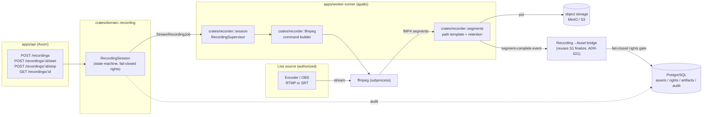

# Proposal: Stream Recording Module

- **Status:** Draft for approval
- **Date:** 2026-05-31
- **Author:** Platform engineering (assisted)
- **Decision confirmed by stakeholder:** engine = FFmpeg orchestrated by Rust;
  v1 protocols = RTMP + SRT; ADRs = new recording ADRs + backfill of ADR-006/008/018.

> **Confidentiality — INTERNAL, NOT FOR PUBLICATION.** This document contains
> open-source/competitive evaluation and internal design rationale. It must not
> appear in published, customer-facing, or marketing materials. No third-party
> source code is used: the recorder is an **original, clean-room Rust
> implementation** built with standard segmented-recording techniques. Open-source
> projects are named only as engineering references reviewed during due diligence.

## 1. Requirement

Add a module that **records a live stream** and produces a multimedia file that is
then **incorporated into the platform** as an asset, subject to the existing
fail-closed rights gate (ADR-008) and explicit-lineage guarantees (ADR-006).

## 2. Constraints from the current architecture

- **Rust-first**: Rust owns the API, orchestration, governance and quality gates;
  non-Rust media tooling is allowed only behind a clear boundary
  (`docs/architecture.md`).
- **Established pattern**: `crates/media` invokes media tooling as an **external
  process via a command builder** (`ffprobe_command`) — not as a linked library.
- **Fail-closed rights** (ADR-008) and **immutable lineage + checksums** (ADR-006)
  must hold for any new ingestion source.
- **Jobs** run on apalis/Redis through `apps/worker-runner`; the API enqueues.
- S1 (asset ingestion + rights ledger) provides the ingestion finalize path this
  module must reuse. S1 tasks T4–T6 (storage adapter, API, tests) are still open
  and are a prerequisite for the bridge (ADR-021).

## 3. Open-source options evaluated

| # | Option | Lang / License | Integration model | Rust-first fit | Lineage + rights control | Verdict |
|---|--------|----------------|-------------------|----------------|--------------------------|---------|
| **A** | **FFmpeg** orchestrated by Rust | C / **LGPL** (via subprocess) | Rust spawns/supervises `ffmpeg`; segments to disk; uploads to MinIO | ★★★★★ (same pattern as `ffprobe`) | **High** — Rust registers the asset | **Chosen engine** |
| **B** | **GStreamer** (`gstreamer-rs`) | C+LGPL / bindings MIT–Apache | In-process Rust pipeline (`srtsrc/rtmpsrc ! … ! splitmuxsink`) | ★★★★ | High | **Future upgrade path** |
| **C** | **MediaMTX** | Go / **MIT** | Sidecar service; Rust orchestrates via API + segment hooks | ★★ (new Go runtime) | Medium (capture outside Rust) | **Architecture reference + fallback** |
| **D** | **SRS** | C++ / **MIT** | Full multi-protocol sidecar | ★★ (new C++ runtime) | Medium | Rejected for v1 |

**Decision (ADR-019):** use **FFmpeg orchestrated by Rust** as the v1 capture
engine, implement an **original Rust-native recorder** using standard
segmented-recording techniques (segments/parts, retention, completion hooks), keep
**GStreamer** as the sanctioned future in-process upgrade, and keep a **third-party
media-server sidecar** as the documented fallback.

### Why not a sidecar now

A Go/C++ sidecar gives production-grade recording immediately, but it (a) adds a
new runtime to the operational surface and (b) moves capture — and therefore part
of the lineage/rights control — outside Rust, weakening the fail-closed posture
that ADR-008 makes central. FFmpeg-as-subprocess keeps Rust in control while
reusing the exact pattern already in `crates/media`.

## 4. Internal reference review (not for publication)

The segment/part recording model used here (bounded RPO, segment rotation, path
templating, retention, completion hooks) is a **standard industry technique**, not
specific to any one project. During design we reviewed mature open-source media
servers — primarily MediaMTX (MIT) — as engineering references for proven parameter
choices. The implementation is **original and clean-room in Rust**; no third-party
source code is used. The mapping below relates the reviewed reference concepts to
their independent DubBridge equivalents:

| Reference concept (reviewed example) | What it does | DubBridge Rust equivalent (original) |
|------------------|--------------|---------------------------|
| `internal/core` Core orchestrator | Boots subsystems in dependency order, lifecycle/hot-reload | `crates/recorder::session::RecordingSupervisor` + `apps/worker-runner` job loop |
| Path-based routing, `Path` struct | Per-stream config: source, auth, record options, hooks | `RecordingSession` aggregate in `crates/domain::recording` |
| Protocol-independent stream representation | Accept one protocol, serve/record any | FFmpeg normalizes RTMP/SRT input; `SourceProtocol` enum models the source |
| Recorder: fMP4 **parts** (`recordPartDuration`) | RPO; bounds data lost on crash | `record_part_duration` in `crates/config`; FFmpeg fragment/segment options |
| Recorder: **segments** (`recordSegmentDuration`) | Bounds file size; enables incremental upload | `record_segment_duration`; FFmpeg `segment` muxer |
| `recordPath` templating (`%path/%Y-%m-%d/...`) | Organized, collision-free naming | `crates/recorder::segments` path templater → `storage_key` |
| `recordDeleteAfter` retention | Local cleanup after durable upload | `record_delete_after`; cleanup after MinIO put |
| `runOnRecordSegmentComplete` hook | Fires when a segment is finalized | **In-process** segment-complete event → upload + asset bridge (ADR-021) |
| `internal/playback` server | Serves recorded content over HTTP | Out of scope for v1 (assets are served via the normal asset path) |
| Graceful behavior / clean finalization | Non-corrupt files on stop | Write `q\n` to FFmpeg stdin on stop (ADR-020) |

**Reference spike (recommended, not built in this proposal):** a throwaway,
internal-only sandbox under `spikes/recorder-sandbox/` that validates, end to end:
`ffmpeg -i srt://…  -c copy -f segment -segment_format mp4 …` and the RTMP
equivalent, plus graceful-stop finalization. Its only purpose is to confirm the
FFmpeg command shape and segment behavior before the production crate is built; it
is deleted once `crates/recorder` exists. It contains no third-party source code and
is never published.

## 5. Target architecture in DubBridge

### New / changed components

- **`crates/domain`** — new `recording.rs`: `RecordingSession`, `RecordingStatus`,
  `SourceProtocol {Rtmp, Srt}`, `RecordingSource`, `StartRecordingCommand` (reuses
  `RightsBasis`, fail-closed). Extend `ArtifactKind` with `RecordedStreamMedia`.
- **`crates/recorder`** (new) — `ffmpeg.rs` (pure command builder), `session.rs`
  (`RecordingSupervisor` over `tokio::process`), `segments.rs` (path template +
  retention). Engine boundary mirrors `crates/media`.
- **`crates/jobs`** — `StreamRecordingJob` envelope.
- **`crates/storage`** — `recordings/{session_id}/...` prefix + segment put.
- **`crates/config`** — `ffmpeg_binary_path`, `recording_base_path`,
  `record_part_duration`, `record_segment_duration`, `record_delete_after`.
- **`apps/api`** — recording routes + DTOs.
- **`apps/worker-runner`** — consume `StreamRecordingJob`, supervise capture,
  upload, bridge to asset, emit audit.
- **`infra/migrations`** — `0005_create_recording_sessions.sql` (+ optional
  `0006_create_recording_segments.sql`).

## 6. Risks and prerequisites

- **Prerequisite:** the S1 finalize path must be reusable by the bridge. This means
  completing S1 T4–T6 or extracting the finalize logic into a transport-agnostic
  function. Tracked in the plan.
- **FFmpeg runtime** must be present in the worker-runner image (LGPL build; no
  GPL-only components).
- **Subprocess management** (graceful stop, timeouts, zombies) is error-prone;
  covered by ADR-020 and dedicated tests.
- **Credential handling** for RTMP keys / SRT passphrases must be redacted in logs
  (ADR-022, ADR-018).
- **Per-segment vs whole-session bridging** is an open design choice resolved in
  the plan (default: bridge on session stop for v1 simplicity; per-segment is a
  follow-up).

## 7. Governing ADRs

- ADR-006, ADR-008, ADR-018 (backfilled foundations).
- ADR-019 (engine), ADR-020 (lifecycle/segments), ADR-021 (asset bridge),
  ADR-022 (protocols + auth).

## 8. Next step

On approval, implementation is tracked by:
- Plan: `docs/plan/stream-recording-ingest.md`
- Tasks: `docs/tasks/stream-recording-ingest.md`

## Sources

- MediaMTX — <https://github.com/bluenviron/mediamtx> · recording docs
  <https://mediamtx.org/docs/usage/record> · license (MIT)
  <https://github.com/bluenviron/mediamtx/blob/main/LICENSE> · architecture
  <https://deepwiki.com/bluenviron/mediamtx>
- SRS — <https://github.com/ossrs/srs>
- datarhei Restreamer — <https://github.com/datarhei/restreamer>
- GStreamer Rust bindings — <https://github.com/GStreamer/gstreamer-rs> ·
  plugins-rs <https://github.com/GStreamer/gst-plugins-rs>
- FFmpeg-in-Rust orchestration patterns —
  <https://danielmschmidt.de/posts/2023-03-23-managing-processes-in-rust/>
