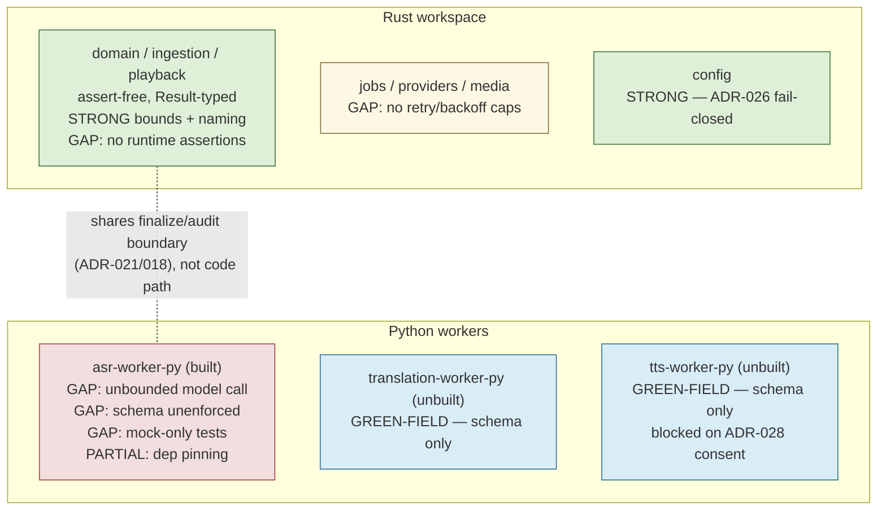

# Tiger Style Adoption: Rust/Python Backend Evaluation

## Purpose

The owner asked for an evaluation of adopting **Tiger Style** (TigerBeetle's coding
standard: NASA Power-of-Ten-inspired safety rules, short assert-heavy functions,
explicit resource bounds, deterministic testing, narrative naming) for the Rust
workspace and Python workers — the parts of `dubbridge` doing critical backend work.

This document is a **requirements-defining evaluation**, not an implementation plan.
It exists to answer one question with evidence rather than impression: *where does
the current codebase already match Tiger Style, and where would closing the gap
require real design decisions?* The output is a set of numbered requirements and
explicit decision points. A follow-up `docs/plan/<slice>.md` +
`docs/tasks/<slice>.md` pair — sequenced, RRI-scored, and subject to the normal
approval gates in `docs/playbooks/AGENT_WORKFLOW_GUIDE.md` — is the next step and is
out of scope here.

## What Tiger Style asks for

Five pillars, condensed from TigerBeetle's public `TIGER_STYLE.md`:

1. **Safety via assertions** — assert both preconditions and postconditions, assert
   positive *and* negative space, and keep assertions compiled into release builds
   (not a debug-only aid).
2. **Explicit bounds everywhere** — every loop, buffer, queue, retry, and timeout has
   a known, enforced limit. No unbounded recursion or unbounded growth.
3. **Short, low-complexity functions** — roughly 70 lines, single responsibility,
   decomposed rather than nested.
4. **Deterministic testing over mocks** — prefer real dependencies and deterministic
   simulation to mocked unit tests wherever the cost is tractable.
5. **Narrative naming and static configuration** — code reads as prose;
   environment-specific behavior is explicit, never a compiled-in surprise.

## Methodology

Findings below come from two read-only code surveys of this repository (not from
memory or from Tiger Style's own docs): one across `crates/*` and `apps/*`
(708 `assert!` + 1,381 `assert_eq!`/`assert_ne!` occurrences inventoried, allow-attribute
and unwrap/expect grep sweeps, direct reads of `crates/domain`, `crates/ingestion`,
`crates/playback`, `crates/db`, `crates/config`, `apps/api`, `apps/gateway`), and one
across `workers/*-py` plus `docs/python-exceptions.md`. Every claim below cites a
file, line, or command. Governing docs already read directly for this evaluation:
`Cargo.toml`, `clippy.toml`, `Makefile`, `docs/architecture.md`,
`docs/python-exceptions.md`, ADR-006, ADR-008, ADR-018, ADR-021, ADR-026.

## Current-state assessment

### Rust workspace — already strong on 4 of 5 pillars

The workspace lint block (`Cargo.toml:49-69`) already encodes a large slice of Tiger
Style's safety pillar as **compiler-enforced, not aspirational**:

| Lint | Setting | Tiger Style pillar |
|---|---|---|
| `unsafe_code` | `forbid` | Safety |
| `panic`, `todo`, `unimplemented`, `dbg_macro`, `print_stdout`, `print_stderr` | `deny` | Safety / no surprises |
| `too_many_lines` | `deny` (100-line default) | Short functions |
| `cognitive_complexity` | `deny` (threshold 15, `clippy.toml:12`) | Single responsibility |

These are not decorative: the Rust survey found **zero** `#[allow(clippy::panic)]` or
`#[allow(clippy::unwrap_used)]` escape hatches anywhere in the workspace, and only
**3 total** `too_many_lines`/`cognitive_complexity` allows, none in genuinely complex
production logic (`apps/api/src/cleanup.rs:60,79,121` for a tracing-macro
false-positive; the rest in test files). Production `.unwrap()`/`.expect()` sites are
8 and 8 respectively, each one either idiomatic (`Mutex::lock().unwrap()` in
`apps/gateway/src/{auth,session}/*.rs`), provably infallible
(`crates/providers/src/lib.rs:70`), or a documented invariant
(`.expect("validate() must be called before new()")` in
`crates/domain/src/{platform_ingest,recording}.rs`).

Bounded resources are concrete, not implicit: `MAX_UPLOAD_BYTES = 500 * 1024 * 1024`
enforced pre-auth (`apps/api/src/routes/ingestion.rs:13,43`), pagination clamped to
`DEFAULT_LIMIT=50`/`MAX_LIMIT=200` (`ingestion.rs:398-399,412`), explicit probe
timeouts (`apps/api/src/lib.rs:24,184`), and streaming (not buffered) upload staging
through `StorageAdapter::put_file` (`crates/storage/src/adapter.rs:13`), matching the
bounded-memory claim in `docs/architecture.md:153`.

Naming across the three safety-critical boundaries sampled — ADR-008 rights
(`RightsBasis`, `IngestionError::MissingRightsBasis`), ADR-021 finalize
(`finalize_ingestion_core`, `IngestionServiceError::SessionExpired`), ADR-032
playback (`PlaybackGrant::is_valid_at`) — is narrative and intention-revealing, not
abbreviated. `crates/config::AppConfig::validate` (`crates/config/src/lib.rs:183,341`)
fail-closes on `localhost`/`127.0.0.1` in production-like environments, which is
exactly Tiger Style's "no compiled-in surprises" applied to config (ADR-026).

**The one pillar genuinely absent: assertion-heavy production code.** Of 2,089
combined `assert!`/`assert_eq!`/`assert_ne!` occurrences, **100% sit inside test
modules**. Production validation is done exclusively through the `Result`/type
system (`FinalizeIngestionCommand::validate`, `RightsBasis::validate`), never through
inline runtime assertions of pre/postconditions or negative-space invariants. This is
a legitimate, safe alternative — but it is not what Tiger Style means by "assert
liberally," and closing that gap is a real design decision, not a mechanical patch
(see Decision Point D1 below).

Two secondary gaps: `finalize_ingestion_core` itself is 97 lines
(`crates/ingestion/src/lib.rs:48-145`) — under clippy's 100-line ceiling but over
Tiger Style's ~70-line ideal, though well-decomposed into five helpers under 20 lines
each. And retry/backoff logic (`apps/worker-runner/src/translation_fanout.rs:73-77`,
`Retryable` disposition enum) has no visible attempt cap anywhere in `crates/jobs`,
`crates/providers`, or `crates/media` — the one place "explicit bounds everywhere"
is not yet true.

### Python workers — a green-field opportunity, not a retrofit

**Scope correction that changes the shape of this evaluation:** of the three worker
directories declared in `docs/python-exceptions.md` (ASR, translation, TTS), only
`workers/asr-worker-py` has an actual implementation. `workers/translation-worker-py`
and `workers/tts-worker-py` contain only their three JSON Schema contract files and a
placeholder README each — no `main.py`, no dependencies, no tests. This tracks
`docs/plan/roadmap.md`'s S-150 status: translation/TTS runtime work (`T4`–`T7`) is
still parked behind the ADR-028 consent seam. **Two-thirds of the Python surface can
be built Tiger-Style-native from day one instead of retrofitted** — materially
cheaper than the Rust-side gap.

For the one implemented worker (`workers/asr-worker-py/main.py`, 95 lines total):

- **Contract enforcement is documentation-only.** `input.schema.json`/`output.schema.json`/`error.schema.json`
  exist (draft 2020-12, `additionalProperties: false`) but `main.py` never validates
  against them — input is `json.loads` + `dict.get()` with silent defaults
  (`main.py:32-34`). No `pydantic`/`jsonschema` dependency exists anywhere in the repo.
- **Fail-closed behavior is real** for the failure modes it does handle: bad JSON,
  missing `audio_uri`, missing file, and transcription exceptions all route through
  `emit_error()` → `sys.exit(1)` (`main.py:16-19,36-38,47-48,70-71`), and success/error
  output shapes are mutually exclusive by construction. One soft spot: `language_hint`
  passes to faster-whisper unvalidated (`main.py:34,56`).
- **No resource bounds at all** around the actual ML call: no timeout, no
  max-audio-duration/size check, no retry cap on `WhisperModel(...).transcribe()`
  (`main.py:55-57`; grep for `timeout|max_|limit|retry` across `workers/` is empty).
  Any bounding today depends entirely on whatever the Rust subprocess caller enforces
  — unverified in this evaluation, since `crates/media`'s process-orchestration side
  was not audited for a Python-facing timeout.
- **Dependency pinning is half-done.** The direct pin
  `faster-whisper==1.1.0` (`workers/asr-worker-py/requirements.txt:1`, tightened in
  commit `dc9d0cd`) is exact, but `Dockerfile:5` runs a bare
  `pip install -r requirements.txt` with **no lockfile** for faster-whisper's own
  transitive dependencies (numpy, ctranslate2, huggingface-hub, tokenizers,
  onnxruntime, av) — the build floats on whatever those resolve to.
- **Testing is 100% mock-based** by explicit design
  (`tests/test_worker.py:3`: "All tests mock faster_whisper so no GPU, model
  download, or real audio is needed") — no real-model, real-audio smoke test exists
  anywhere in the Python surface.
- **No complexity gate exists for Python** at all — no `ruff`/`mypy`/`mccabe`
  config anywhere under `workers/` or repo root (the repo-root `scripts/*.py` agent
  tooling is a separate, unrelated body of code with its own near-1:1 test ratio, out
  of scope here).

### Comparison table

| Tiger Style pillar | Rust workspace | Python (ASR, only implemented worker) |
|---|---|---|
| Assert pre/postconditions, positive+negative space | **Gap** — 0 production asserts; `Result`-only validation | **Gap** — 0 asserts (correctly, since Python `assert` is `-O`-strippable); ad hoc `if`/`dict.get()` instead |
| Explicit bounds everywhere | **Mostly strong** — upload/pagination/timeout bounds concrete; retry/backoff caps missing | **Gap** — zero timeout/size/retry bound around the model call |
| Short, low-complexity functions | **Strong** — clippy-enforced, near-zero escape hatches; one 97-line boundary function, well-decomposed | Inconclusive — only one small file exists; no enforcement mechanism |
| Deterministic testing over mocks | **Good** — real Postgres/Redis/MinIO integration tests exist, opt-in via env var | **Gap** — 100% mocked, zero real-model test |
| Narrative naming / static config | **Strong** — ADR-026 fail-closed config; intention-revealing names | Neutral — too little code to assess |
| Schema/contract enforcement (Tiger-adjacent: no silent inputs) | N/A (typed at compile time) | **Gap** — JSON Schema exists but is unenforced at runtime |
| Dependency pinning ("no surprises") | Cargo.lock is authoritative and committed | **Partial gap** — direct pin exact, transitive deps unlocked |

### Alignment map

## Requirements

Numbered, evidence-backed, and scoped to what would need to be true for each gap to
close. These are inputs to a future task ledger, not tasks themselves — none are
sized or RRI-scored here.

### Safety / assertions

- **R1 (Rust).** Introduce paired precondition/postcondition assertions in
  production code at the safety-critical boundaries identified above (rights
  validation, finalize, playback grant issuance, audit emission) — currently zero.
  Requires deciding `assert!` (always-on, matches Tiger Style) vs `debug_assert!`
  (stripped in release, does not) per call site. **This is Decision Point D1.**
- **R2 (Python).** Do not use Python's `assert` keyword as a Tiger-Style substitute
  (it is stripped under `-O` and is not equivalent to a compiled-in Rust assert).
  Instead require explicit `if not <condition>: raise <SpecificError>` guard clauses
  at every worker's input/output boundary, replacing the current ad hoc
  `dict.get()`-with-silent-default pattern (`main.py:32-34`).
- **R3 (Python).** Replace the broad `except Exception as exc` catch-all
  (`main.py:70`) with narrower, named exception types so distinct failure modes map
  to distinct, diagnosable error codes instead of being flattened into one.

### Explicit bounds

- **R4 (Rust).** Add explicit retry/attempt caps to `crates/jobs`,
  `crates/providers`, and `crates/media` — the `Retryable` disposition path in
  `apps/worker-runner/src/translation_fanout.rs` has no visible ceiling today.
- **R5 (Python, ASR).** Add an explicit timeout and max-audio-duration/size bound
  around `WhisperModel(...).transcribe()` (`main.py:55-57`); currently a pathological
  input can run unbounded with no caller-visible limit.
- **R6 (Python, ASR).** Validate `language_hint` against a known-language allowlist
  at the contract boundary instead of passing it through unvalidated to faster-whisper
  (`main.py:34,56`).

### Function length / complexity

- **R7 (Rust, optional tightening).** Consider lowering `too_many_lines` from
  clippy's 100-line default toward Tiger Style's ~70-line ideal. Flagged as
  **Decision Point D2** because it would force further decomposition of the
  already-at-the-edge `finalize_ingestion_core` (97 lines) and any other function
  currently between 70–100 lines not inventoried here.
- **R8 (Python).** Add a complexity/length gate (`ruff` with complexity rules, or
  `flake8` + `mccabe`) to the Python worker surface before `translation-worker-py`
  and `tts-worker-py` are implemented — there is currently no enforcement mechanism
  at all, and it is far cheaper to add before code exists than after.

### Contract / schema enforcement

- **R9 (Python).** Enforce every worker's own `input.schema.json` /
  `output.schema.json` / `error.schema.json` at the process boundary at runtime
  (via `jsonschema` validation or schema-derived Pydantic models), replacing
  `dict.get()`-with-defaults. Currently the contract is real on disk but unenforced
  in code for the one implemented worker.

### Dependency pinning

- **R10 (Python).** Lock faster-whisper's transitive dependencies (numpy,
  ctranslate2, huggingface-hub, tokenizers, onnxruntime, av) via a proper lockfile
  (`uv.lock` or a compiled `requirements-lock.txt`), so `Dockerfile:5`'s
  `pip install -r requirements.txt` stops floating on whatever those resolve to at
  build time. The direct `faster-whisper==1.1.0` pin is already correct; this closes
  the remaining half of "no surprises."

### Testing philosophy

- **R11 (Python, ASR).** Add at least one checked-in, real-audio, real-model smoke
  test (can be opt-in/gated like the Rust integration tests, given model-download
  cost) so behavior is verified against the actual dependency at least once, not only
  against a mocked shape.
- **R12 (Rust, optional).** Consider promoting the existing real-Postgres/Redis/MinIO
  integration tests from opt-in (self-skipping when `DUBBRIDGE_DATABASE_URL` is
  unset) to mandatory in CI. Flagged as **Decision Point D3** — this has a CI-runner
  availability cost the workflow guide already tracks elsewhere (e.g. the
  Ollama-capable-runner caveat on `qa-gemma-review`).
- **Non-goal:** full deterministic simulation testing (TigerBeetle's own DST
  framework) is explicitly **not** proposed — see Non-goals below.

### Green-field requirement

- **R13 (Python, translation/TTS workers).** When `translation-worker-py` and
  `tts-worker-py` are eventually implemented (S-150 `T4`–`T7`, currently parked on
  the ADR-028 consent seam per `docs/plan/roadmap.md`), their implementing task
  card(s) should require R2/R3 (assertion-equivalent guards), R5/R6-equivalent
  bounds, R8 (complexity gate), R9 (schema enforcement), and R10 (dependency
  locking) as **acceptance criteria from the first commit**, not as later hardening.
  This is the cheapest point in the entire evaluation to close a gap.

## Decision points requiring explicit owner sign-off

These are not mechanical and should not be resolved inside a task card without prior
direction — each is a real trade-off, not a default:

- **D1 — Assert-in-production philosophy (R1).** Adopting Tiger Style's
  always-on, release-mode assertions is a genuine departure from this codebase's
  current pure `Result`-typed validation style. It touches a safety pattern used
  consistently across `crates/domain`, `crates/ingestion`, `crates/playback`, and
  more — not a localized patch. Needs an explicit scope decision (which boundaries
  first; `assert!` vs `debug_assert!`) before any task is sized.
- **D2 — Tightening `too_many_lines` below 100 (R7).** A workspace-wide lint change
  with unknown blast radius beyond `finalize_ingestion_core`; requires a survey of
  every function currently in the 70–100 line band before committing to a new
  ceiling.
- **D3 — Promoting integration tests from opt-in to mandatory (R12).** Trades CI
  reliability/runner cost against stronger deterministic-testing alignment; the
  workflow guide already treats similar infra-availability trade-offs as
  explicit exceptions elsewhere.

## Decision resolution (owner sign-off, 2026-08-30)

The owner resolved all three decision points during the `docs/plan/
tiger-style-adaptation.md` drafting session:

- **D1 → `assert!` always-on.** R1 is in scope at rights validation,
  finalize, playback grant issuance, and audit emission. `debug_assert!` was
  explicitly rejected — assertions must survive into release builds.
- **D2 → lower `too_many_lines` to 70 now.** R7 is in scope. The owner
  accepted the decomposition cost, including `finalize_ingestion_core`; the
  plan still runs the 70–100 line survey first (`X26-T0`) to bound scope
  before any decomposition or lint-threshold change.
- **D3 → Postgres/Redis/MinIO integration tests mandatory in CI now.** R12 is
  in scope. Re-verification while planning found Postgres- and Redis-backed
  tests are **already** mandatory in CI (`.github/workflows/ci.yml`'s
  `coverage` and `test` jobs respectively); the real remaining gap is
  MinIO/S3, whose integration test is `#[ignore]`d
  (`crates/storage/src/s3.rs:182`) behind a `qa-test-s3` Makefile target that
  does not yet exist.

Sequencing, module dependencies, and the executable task list are in
`docs/plan/tiger-style-adaptation.md` and `docs/tasks/tiger-style-adaptation.md`.

## Non-goals

- **No wholesale rewrite.** The Rust workspace already embodies most of Tiger
  Style's safety and bounds pillars via existing `clippy` lints — this is a targeted
  gap-closing exercise, not a rewrite.
- **No deterministic-simulation-testing framework.** TigerBeetle's DST exists to
  validate distributed-consensus correctness under simulated fault injection. This
  platform is a media processing pipeline, not a consensus system; the cost of
  building an equivalent simulator is not justified by this codebase's actual failure
  surface. Real-backend integration tests (already present) are the proportionate
  substitute.
- **No change to Python's `-O` policy or a push to make Python asserts load-bearing.**
  R2 deliberately routes around Python's `assert`-stripping behavior rather than
  fighting it.
- **No requirement changes to `translation-worker-py`/`tts-worker-py`'s existing
  parked status.** R13 only defines what "done" should include *when* S-150 `T4`–`T7`
  is unblocked; it does not argue for unblocking them early.

## Next steps

This report was the input; it is no longer the plan itself. Per
`docs/playbooks/AGENT_WORKFLOW_GUIDE.md`'s Analyze → Plan → Tasks flow:

1. ✅ **Done 2026-08-30** — Owner resolution of decision points D1–D3 (see
   Decision resolution above).
2. ✅ **Done 2026-08-30** — `docs/plan/tiger-style-adaptation.md` sequences the
   in-scope requirements against module boundaries and existing slice work
   (R13 slots into S-150 `T4`–`T7` via a forward-pointer task, not a new
   slice).
3. ✅ **Done 2026-08-30** — `docs/tasks/tiger-style-adaptation.md` (`X26-T0`–
   `X26-T12`) has one task per requirement with `HP-#`/`EC-#` behavioral
   examples. **Remaining:** each task still needs its own `scripts/rri.py`
   score and its own RRI-band approval/review gate before any code change —
   none of `X26-T0`–`X26-T11` has been implemented yet.

## Related documents

- `docs/plan/tiger-style-adaptation.md` — the resulting application plan (post-D1–D3)
- `docs/tasks/tiger-style-adaptation.md` — the executable, task-per-requirement ledger
- `docs/architecture.md` — crate/app boundaries and delivery status cited throughout
- `docs/python-exceptions.md` — the Python isolation boundary this evaluation respects
- `docs/plan/roadmap.md` — S-150 `T4`–`T7` status for R13's green-field window
- `docs/playbooks/AGENT_WORKFLOW_GUIDE.md` — governs the Plan/Tasks step that follows this report
- ADR-006, ADR-008, ADR-018, ADR-021, ADR-026 — governance decisions cited as existing Tiger-Style-aligned precedent
- `Cargo.toml`, `clippy.toml`, `Makefile` — current enforcement mechanisms evaluated against
