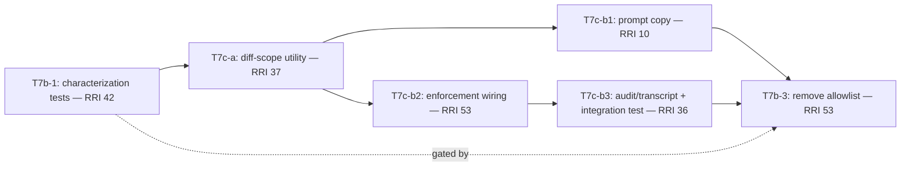
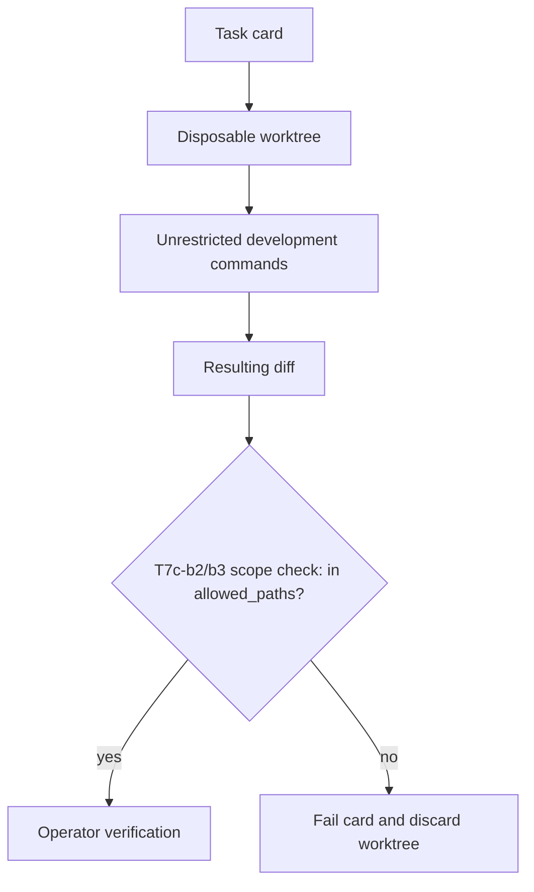

# Tasks: ADR-036 Local-First Pilot

## Objective

Validate ADR-036 on the real hardware: measure the local stack, build the
bounded agentic runner, benchmark it on real repo tasks, and produce the
go/no-go evidence for the promotion gate — with every task routed to the
cheapest executor tier that can complete it safely.

## Slice RRI

The slice creates a new local-model execution surface (agentic runner +
security boundary) and produces the evidence that will decide a workflow-policy
change (T10); an architecture decision already exists (ADR-036), so the slice
carries an `arch_decision` penalty at presentation.

**Score: 40 → Moderate (26–40) → Effort M → thinking Off → Gate: plan + tasks
presented, human approval before implementation.**

| Variable | Score | Evidence | Confidence |
|---|---|---|---|
| C cyclomatic | 0 | slice is docs/tasks scaffolding, not a function body | High |
| F files | 2 | 3 governing files touched at slice level (ADR, plan, ledger); per-task scope is much smaller | High |
| D domain | 2 | local Ollama HTTP API + agent-loop/security-boundary code (Python) | High |
| T coverage | 0 | no existing tests in this area to confirm against; all new | High |
| A ambiguity | 1 | ADR-036 fixes the design; the 5 open questions are the slice's own subject, not unresolved scope | Medium |
| K coupling | 2 | shares `gemma_local.py` audit schema (T6c), the packet-delegation lineage, and the workflow guide's band table (T10) | High |
| P impact | 3 | outcome may change how RRI 26–40 is routed for every future task in this repo | High |
| X context | 3 | spans HITL policy, RRI policy, ADR-034 audit contract, and a new execution boundary | High |

Penalty: `arch_decision` (+12) — the slice's purpose is to validate (or refute)
a workflow-governing architecture decision (ADR-036) and, on a GO verdict,
change the workflow guide, RRI policy, and HITL policy in T10. Per-task scores
in this ledger are computed independently of the slice-level penalty; most
individual tasks (T2, T3, T6c, T6d) land in Low band on their own because they
are isolated, pre-designed, mechanical files.

**Procedural note (recorded for transparency):** this Slice RRI table was
computed and added to the ledger **after** T0, T1, and T2 had already been
presented and executed with only ad hoc per-task RRI estimates and no slice-level
gate — a deviation from `AGENT_WORKFLOW_GUIDE.md` §"Mandatory workflow before
implementing" step 4, which requires computing RRI (via `scripts/rri.py`) before
presenting a plan/tasks pair, not only per task. The gap was identified from a
user challenge, not caught proactively. T3 onward follows the corrected
procedure: this table gates the slice, and each task additionally computes and
states its own RRI at presentation time per the existing per-task convention.
T0–T2 are not being retroactively re-presented; their completion evidence
stands as recorded, with this note as the disclosed deviation.

## Governing Documents

- `docs/plan/adr036-local-first-pilot.md`
- `docs/adr/ADR-036-local-first-agentic-implementation-band.md`
- `docs/playbooks/AGENT_WORKFLOW_GUIDE.md`
- `docs/policies/RRI_POLICY.md`
- `docs/policies/HITL_AUTONOMY_POLICY.md`
- `docs/playbooks/LOW_RRI_LOCAL_MODEL_HANDOFF.md`
- `docs/adr/ADR-034-gemma-process-audit-and-reviewer-reconciliation.md`

## Executor-tier routing summary

Granularization goal: reserve token-expensive agents for judgment work.

| Task | Executor tier | Why |
|---|---|---|
| T0 | primary + human | ADR ratification gate |
| T1 | primary (ops) | commands on the physical machine; config-only |
| T2 | **economy / gemma-developer** | isolated new-file Python, pre-designed contract |
| T3 | **economy / gemma-developer** | isolated new-file Python, pre-designed contract |
| T4 | **economy** (script) + primary (execution) | script is mechanical; the soak run needs the machine |
| T5 | primary | editorial judgment over repo history; HITL keeps interpretation-heavy work with the primary agent |
| T6a | balanced | agent loop with protocol/state handling |
| T6b | balanced + mandatory primary review | security-critical boundary enforcement |
| T6c | **economy** | schema extension of existing audit emitter, mechanical |
| T6d | **economy / gemma-developer** | deterministic packet transformation, pure function |
| T7 | primary (orchestration) | runs the corpus through the runner; token-light |
| T8 | primary | synthesis + go/no-go against promotion gates |
| T9 | per-task routing under pilot rules | the pilot itself |
| T10 | primary + human approval | policy propagation (only on GO) |

Per-task `RRI (est.)` values are **preliminary**; recompute with
`scripts/rri.py` at presentation time before executing any task (workflow
guide requirement). Every development task below still passes the standard
gates for its final band: phase-1 review, Gemma Reviewer/D14 phase-2 review,
Reflection log for 26+, unit coverage certification, owner verification.

## Behavioral coverage contract: unit-v1

Tests for this slice are Python (`scripts/**/*_test.py`), not Rust. The
Rust-only `.rs::test_name` certification enforced by
`scripts/check-task-unit-coverage.sh` does not apply; completion evidence is
the `python3 -m unittest` runs per task (same exception as the
`gemma-audit-and-triple-pass` slice).

## Task order and dependencies

```text
T0 ──► T1 ──► T2 ──► T3 ──► T4 ─────────────────────┐
 │                                                   ├──► T7 ──► T8 ──► T9 ──► T10
 ├────► T5 (corpus, parallel) ───────────────────────┤          (GO gate)
 └────► T6a ──► T6b ──► T6c ──► T6d ────────────────┘
```

T0 ratifies ADR-036 before anything else. The measurement chain (T1–T4) and
the runner chain (T6a–T6d) proceed in parallel after T0; T5 is independent
editorial work. T7 needs both chains plus the corpus. T8 is the Stage 1 exit.
T9/T10 run only on a GO verdict. Same-directory serialization: T6a→T6b→T6c→T6d
share `scripts/local-agent/` and are ordered.

---

## T0 — Ratify ADR-036 (decision gate)

- **Status:** [x] Done
- **Effort:** S
- **RRI:** n/a (decision-ratification gate, not a code task)
- **Executor tier:** primary + human
- **Scope:** `docs/adr/ADR-036-local-first-agentic-implementation-band.md`,
  `docs/adr/README.md`
- **Depends on:** none

### Goal

On slice approval, flip ADR-036 from `Proposed` to `Accepted` and apply the
ADR change propagation contract (frontmatter/prose parity, index row). If the
owner amends the stack or gates during review, propagate the amendment before
any downstream task starts.

### Acceptance Criteria

- ADR-036 frontmatter `status:` and prose `- **Status:**` both read `Accepted`;
  index row matches.
- `make qa-docs` deterministic checks pass.
- No code changes in this task.

### Handoff Prompt

T0 — ratify ADR-036 to `Accepted`; propagate per the workflow guide (index +
frontmatter/prose parity). Do not touch scripts. Stop after docs gates pass.

### Completion evidence

- ADR-036 frontmatter `status: Accepted` and prose `- **Status:** Accepted`
  both updated; `docs/adr/README.md` index row updated to `Accepted`.
- `bash scripts/check-doc-consistency.sh`, `bash scripts/check-roadmap-drift.sh`,
  `python3 scripts/check_okf_frontmatter.py` all passed.

---

## T1 — Install and pin the local stack (ops)

- **Status:** [x] Done
- **Effort:** S
- **RRI:** n/a (config/ops-only; exempt from review gates)
- **Executor tier:** primary (ops on the physical machine)
- **Scope:** local Ollama registry; `docs/evaluations/adr036-stage1-report.md` (stub)
- **Depends on:** T0

### Goal

Resolve ADR-036 open question 5: confirm `qwen3.6:35b-a3b` exists as an MLX
4-bit (or best-available Q4) build in the Ollama library; pull it and
`gemma4:26b-a4b-it-qat`; record exact tags, digests, quantization, and on-disk
sizes in the report stub. If the 35B-A3B build does not exist or only exists
in an unusable quantization, record it and activate the ADR-036 §6 contingency
binding (Gemma 4 26B A4B as implementer) for the rest of the slice.

### Acceptance Criteria

- Both models pulled and answering a smoke prompt through `OLLAMA_HOST`.
- Report stub records: tag, digest, quant, size, runtime backend (MLX/GGUF).
- Contingency decision (if any) recorded explicitly.

### Handoff Prompt

T1 — pull and verify the two ADR-036 model bindings; record tags/digests/
sizes in the report stub. No scripts. Stop after the smoke prompts succeed.

### Completion evidence

- Both bindings were already present on the target machine (`ollama list` via
  `/api/tags`): `qwen3.6:35b-a3b` (36.0B/Q4_K_M/GGUF, 23.9 GB) and
  `gemma4:26b-a4b-it-qat` (25.2B/Q4_0/GGUF, 15.6 GB). No pull needed.
- Smoke prompts succeeded on both: Qwen 41.44 tok/s decode, Gemma 45.36 tok/s
  decode (see `docs/evaluations/adr036-stage1-report.md § T1`).
- **Deviation recorded:** both bindings run on Ollama's llama.cpp/GGUF
  backend, not MLX — only the pre-existing `gemma4:12b-mlx` is a true MLX
  build. Recorded as a T1 finding in the Stage 1 report; does not block the
  pilot but changes the throughput baseline interpretation (see report).
- No contingency triggered — both models loaded and answered without error.
- `docs/evaluations/adr036-stage1-report.md` created with T1 results.

---

## T2 — Inference measurement script

- **Status:** [x] Done
- **Effort:** M
- **RRI (est.):** ~24 → Low (C1 F1 D2 T2 A0 K1 P1 X1; isolated new file)
- **Executor tier:** economy / gemma-developer candidate (packet per function)
- **Scope:** `scripts/local-bench/measure_inference.py`,
  `scripts/local-bench/measure_inference_test.py`, `.gitignore`
- **Depends on:** T1

### Goal

New isolated script that measures, per model binding: decode tok/s, prefill
tok/s at 8K/16K/32K synthetic prompts, time-to-first-token, and peak process
memory, via the Ollama HTTP API. Emits one JSON artifact per run under
`logs/local-bench/` (git-ignored). Resolves ADR-036 open questions 2 and 3
(prefill throughput, effective KV footprint at 32K).

### Acceptance Criteria

- `HP-1`: run against an available model → JSON artifact with all metric
  fields populated and non-zero.
- `HP-2`: three prompt sizes (8K/16K/32K) measured in one invocation with
  per-size prefill numbers.
- `EC-1`: model tag absent from Ollama → exit non-zero with a one-line error;
  no partial artifact left behind.
- `EC-2`: `OLLAMA_HOST` unreachable → fail closed within the timeout; exit
  non-zero.
- Unit tests cover metric computation and artifact schema with a mocked API;
  `python3 -m unittest scripts/local-bench/measure_inference_test.py` passes.

### Delegation note (economy executor)

The orchestrator pre-designs: the JSON schema, the Ollama API call shapes, and
the CLI contract (`--model`, `--sizes`, `--out`). The cheap executor
implements to that contract; it does not design it.

### Handoff Prompt

T2 — implement `measure_inference.py` to the pre-designed CLI/schema contract
in this entry. Allowed paths: the two new files + `.gitignore`. Mocked-API
unit tests required. Stop after unittest passes; do not run live benchmarks.

### Completion evidence

- Implemented via background subagent per the pre-designed contract; changes
  independently reviewed by the primary agent (not accepted from the
  subagent's self-report alone).
- Files: `scripts/local-bench/measure_inference.py`,
  `scripts/local-bench/measure_inference_test.py`; `.gitignore` gained
  `logs/local-bench/` (artifact home named in the Goal, `--out` remains
  explicit/required).
- `python3 -m unittest scripts/local-bench/measure_inference_test.py -v`
  independently re-run by the primary agent: **10/10 passed**, 0 failures.
- HP-1/HP-2 covered by `SuccessfulRun` (3-size mocked run, full schema
  populated, non-zero fields); EC-1 by `ModelNotFound` (non-zero exit, no
  artifact written); EC-2 by `UnreachableHost` (both `URLError` and
  `TimeoutError` paths, non-zero exit, no artifact).
- Scope verified via `git status --porcelain`: only `.gitignore` and the two
  new files under `scripts/local-bench/` touched by this task.
- No live Ollama calls made, per the task constraint (T7 owns the live run).

**Post-hoc amendment (from T4):** `measure_inference.py` was subsequently
patched during T4's live execution to fix two bugs affecting all three
`local-bench` scripts — a missing `OLLAMA_HOST` scheme normalization and an
`ollama_process_rss_bytes()` process-name filter that excluded the real
inference engine (`llama-server`), undercounting peak memory by orders of
magnitude. A regression test (`OllamaProcessRssBytes`) was added to
`measure_inference_test.py`. T2's own acceptance criteria are unaffected (its
mocked tests never exercised live host-string parsing or real process
enumeration), and the full suite still passes (10 T2 tests, now 12 with the
new regression tests, all green). See T4's completion evidence and
`docs/evaluations/adr036-stage1-report.md § T4` for the full bug/fix trail —
not duplicated here to avoid drift between the two records.

---

## T3 — Load-cycle and residency measurement script

- **Status:** [x] Done
- **Effort:** S
- **RRI (est.):** ~20 → Low (isolated new file, same pattern as T2)
- **Executor tier:** economy / gemma-developer candidate
- **Scope:** `scripts/local-bench/measure_residency.py`,
  `scripts/local-bench/measure_residency_test.py`
- **Depends on:** T2

### Goal

Measure the ADR-036 §6 residency cycle: cold-load time per model, unload via
`keep_alive: 0`, reload time, and the implement→unload→verify→reload sequence
cost. Quantifies the repair-iteration latency risk named in the ADR
consequences.

### Acceptance Criteria

- `HP-1`: sequence run against two model tags → JSON with per-phase timings.
- `EC-1`: second model fails to load (memory) → recorded as a structured
  failure in the artifact, non-zero exit, first model unloaded on cleanup.
- Mocked-API unit tests pass.

### Handoff Prompt

T3 — implement `measure_residency.py` per this entry's contract; same
conventions as T2. Stop after unittest passes.

### Completion evidence

- Presented per the task-presentation contract (RRI computed at 24 → Low)
  before implementation; approved by owner.
- Implemented directly by the primary agent (not delegated), following T2's
  conventions: atomic JSON write, argparse CLI, mocked-API tests only.
- Files: `scripts/local-bench/measure_residency.py`,
  `scripts/local-bench/measure_residency_test.py`. No `.gitignore` change
  (artifact directory already covered by T2's `logs/local-bench/` entry).
- `python3 -m unittest scripts/local-bench/measure_residency_test.py -v`:
  **8/8 passed**, 0 failures.
- HP-1 covered by `CycleModel.test_hp1_cycle_produces_all_phase_timings` and
  `MultiModelRun.test_hp1_two_models_both_succeed` (per-phase timings for
  cold_load/unload/reload/total, for two model tags in one run).
- EC-1 covered by `test_ec1_second_model_fails_records_structured_failure_and_unloads_first`
  (failed model recorded with `failed: true` + `error`, non-zero-exit path via
  `test_main_writes_artifact_even_on_failure_and_exits_nonzero`, and a
  best-effort unload call is asserted for the failed model).
- Contract clarification versus the ledger's literal EC-1 wording: unlike T2,
  T3 **always writes the JSON artifact** (even on failure) because the
  failure is meant to be a structured field inside the artifact, not an
  absent-artifact case; `main()` returns non-zero exit whenever any model's
  cycle failed. This matches "recorded as a structured failure in the
  artifact" in the Goal/Acceptance Criteria.
- Scope verified via `git status --porcelain`: only the two new files
  touched.

**Post-hoc amendment (from T4):** `measure_residency.py` received the same
`OLLAMA_HOST` scheme-normalization fix as T2 and `soak_contention.py` during
T4's live execution (it does not use `ollama_process_rss_bytes()`, so the
memory-filter bug did not apply here). T3's own 8/8 tests are unaffected and
still pass. See T4's completion evidence for the full bug/fix trail.

---

## T4 — Dev-stack contention soak

- **Status:** [~] In progress (phase 1 of 2: script done; live 1-hour soak pending)
- **Effort:** M
- **RRI:** 32 → **Moderate** (recomputed with `scripts/rri.py` at presentation
  time; supersedes the ledger's ~22 → Low placeholder — see task presentation
  transcript for the full variable table)
- **Executor tier:** balanced (script authored/reviewed by primary agent,
  phase-1 implementation delegated to a background subagent under an explicit
  contract) + primary (live 1-hour soak execution)
- **Scope:** `scripts/local-bench/soak_contention.py`,
  `scripts/local-bench/soak_contention_test.py`;
  results into `docs/evaluations/adr036-stage1-report.md`
- **Depends on:** T3

### Goal

Answer ADR-036 open question 1 with data: run generation loops while the real
dev stack is active (`docker compose -f infra/local/docker-compose.yml up`
Postgres/Redis/MinIO + a `cargo build` loop), sampling swap activity, wired
memory, throughput degradation, and thermal throttling over a 1-hour soak.
The **contingency verdict** (35B-A3B stays primary vs demote to Gemma 26B
A4B) is recorded from this task's data.

### Acceptance Criteria

- `HP-1`: soak run completes → time-series artifact + summary (min/median
  throughput, peak swap, throttle events).
- `EC-1`: sampling continues and artifact remains valid if a generation call
  times out mid-soak (gap recorded, not crash).
- Contingency verdict written into the report with the supporting numbers.

### Handoff Prompt

T4 — script per contract (economy executor), then a supervised 1-hour soak on
the real machine (primary). Stop after the verdict paragraph is in the report.

### Phase 1 completion evidence (script only — soak still pending)

- Presented per the task-presentation contract with the recomputed RRI (32 →
  Moderate) before implementation; approved by owner.
- Phase 1 delegated to a background subagent under an explicit written
  contract (CLI shape, JSON schema, EC-1 failure-recording behavior, hard
  constraint: **no self-review, no `make qa-gemma-review`, no live
  Docker/cargo/soak** — those stay with the primary agent).
- Files: `scripts/local-bench/soak_contention.py`,
  `scripts/local-bench/soak_contention_test.py`. No other file touched by the
  subagent (`git status --porcelain` verified independently by the primary
  agent, not accepted from the subagent's self-report).
- `python3 -m unittest scripts/local-bench/soak_contention_test.py -v`:
  independently re-run by the primary agent — **9/9 passed**, 0 failures.
- HP-1 covered by `HP1FullRun` (mocked multi-tick run, fully populated
  `samples` + `summary`, `throttle_detected: null` placeholder as specified).
- EC-1 covered by `EC1MidSoakFailure` (a mid-run `URLError` is recorded as
  `sample_ok: false` + `error`, run completes without crashing,
  `failed_sample_count` reflects it, failed sample excluded from
  min/median/peak math).

#### Gemma Reviewer evidence

- Model: `qwen3.6:35b-a3b` (`DUBBRIDGE_REVIEW_MODEL` unset; wrapper default
  resolved to the installed local model)
- Command: `git diff -- scripts/local-bench/soak_contention.py
  scripts/local-bench/soak_contention_test.py | python3
  scripts/gemma-code-review.py --out /tmp/dubbridge-gemma-review-t4.json
  --passes 3 -` (run by the primary agent; `git add -N` used first so the
  untracked new files show as a diff against empty)
- Passes run / usable: `3/3`
- Aggregate status: `FINDINGS` (5 findings, all `pass-specific`, all `minor`;
  zero `consensus`, zero `blocking`/`major`)
- `python3 scripts/parse-review-findings.py` exit code checked: `0` (non-blocking
  per the classification, but every finding was still read and individually
  dispositioned per policy — a `0` exit does not mean "0 findings" here)
- Isolated adjudicator: not triggered (Gemma was available and produced a
  usable 3/3 aggregate)
- disposition_divergence: `none`
- Primary-agent disposition (all 5 rejected, with reasons):
  1. "No warning when `psutil` absent" — rejected, cosmetic; sibling scripts
     T2/T3 have the same soft-optional pattern without a warning.
  2. "No retry on `http_post_json`" — rejected by design: T4's purpose is to
     record contention-induced failures (EC-1), not mask them with retries;
     retrying would corrupt the contention signal the task exists to measure.
  3. "`socket.timeout` not explicitly caught" — **verified false positive**:
     confirmed via `socket.timeout.__mro__` on the repo's Python 3.9.6 that
     `socket.timeout` subclasses `OSError`, which is already in the except
     tuple; nothing escapes uncaught.
  4. "Redundant duration-elapsed check" — rejected; defensive double-check,
     not a correctness issue, left as-is.
  5. "`remaining` could go negative" — **verified non-issue**: the existing
     `if remaining > 0: time.sleep(remaining)` guard already prevents a
     negative-duration sleep; confirmed with a standalone repro.

### Reflection log

Required passes: 2 (`32` → `Moderate`)

#### Pass 1

- **Draft verdict:** the sampling loop correctly distinguishes a genuine
  per-sample failure (EC-1, caught in `take_sample`) from a real throughput
  collapse (which would show up as a low but present `decode_tok_s`, not a
  `sample_ok: false`) — the two are structurally separate fields
  (`sample_ok` vs. `decode_tok_s`), so a future throttle heuristic reading
  the time series cannot confuse a network blip with real contention.
- **Critique findings:** gap-recording does not mask a throttle event — a
  failed sample's `decode_tok_s` is `None` and excluded from aggregates, so
  it neither hides nor fakes a slowdown; the Gemma Reviewer's retry-logic
  suggestion (finding #2) would have *introduced* exactly this masking risk
  had it been accepted.
- **Revisions applied:** none — confirmed the design already separates
  connectivity failure from performance signal correctly.

#### Pass 2

- **Draft verdict:** the contingency verdict this task exists to produce is
  falsifiable in principle (the report will cite `min_decode_tok_s`,
  `peak_swap_used_bytes`, and the sample time series, not a subjective
  impression) — but that verdict itself is **not yet written**, because
  phase 2 (the live 1-hour soak against real Docker + cargo) has not run.
- **Critique findings:** the script has no explicit cleanup step for the
  probed model's residency (it neither force-unloads on exit nor on
  exception) — for a 1-hour soak this is likely fine (the point is to keep
  the model loaded throughout), but on an aborted/Ctrl-C run it could leave
  the model resident with no `keep_alive` correction. This is a real gap for
  phase 2's operational safety, not phase 1's acceptance criteria.
- **Revisions applied:** none to the script (out of phase-1 scope per the
  approved acceptance criteria, which do not require exit-cleanup handling);
  flagged explicitly here as an operational note the primary agent must
  handle manually when running phase 2 (unload the model afterward via a
  manual `keep_alive: 0` probe, the same mechanism `measure_residency.py`
  already uses).

### Phase 2 (live soak) — not yet started

Blocked on scheduling the 1-hour supervised run (Docker Postgres/Redis/MinIO +
`cargo build` loop + `soak_contention.py` against `qwen3.6:35b-a3b`). Status
stays `[~] In progress` until phase 2 completes and the contingency verdict is
written into `docs/evaluations/adr036-stage1-report.md`.

### Phase 2 completion evidence

- First attempt (run 1, `logs/local-bench/t4-soak-20260712-0127.json`)
  **failed entirely**: 120/120 samples errored (`sample_ok: false` on all),
  because of two real bugs uncovered by this task, not a contention finding:
  1. `OLLAMA_HOST=127.0.0.1:11434` (no scheme) → every `urllib.request` call
     raised `unknown url type: 127.0.0.1`. Latent in T2/T3 too — never fired
     there because manual testing used an explicit `http://` host.
  2. `ollama_process_rss_bytes()` filtered only on `"ollama"` in the process
     name, excluding the actual inference engine (`llama-server`, tens of GB
     RSS) and undercounting peak memory by ~3 orders of magnitude.
- Both fixed in `measure_inference.py` (shared by all three scripts via
  import/copy), `measure_residency.py`, `soak_contention.py`:
  `normalize_host()` added; `OLLAMA_PROCESS_NAME_MARKERS` widened to match
  `"ollama"` or `"llama-server"`. `psutil` installed in the environment
  (previously absent).
- Regression test added: `OllamaProcessRssBytes` in
  `measure_inference_test.py` (2 new tests). Full suite re-run after the fix:
  **29/29 passed** across `measure_inference_test.py` +
  `measure_residency_test.py` + `soak_contention_test.py`.
- Both fixes independently smoke-tested live against Ollama (not just
  mocked) before relaunching the full 1-hour run.
- Second attempt (run 2, `logs/local-bench/t4-soak-20260712-0232.json`)
  **succeeded**: 120/120 samples, `failed_sample_count: 0`. Full numbers,
  swap-baseline caveat, and the contingency verdict are recorded in
  `docs/evaluations/adr036-stage1-report.md § T4` (not duplicated here).
- **Contingency verdict: no demotion triggered**, on the evidence available —
  `qwen3.6:35b-a3b` showed no failure signal (flat memory, no sustained
  throughput degradation, modest attributable swap growth) under the soak.
  **Correction (caught by user challenge, not proactively):** this is *not* a
  head-to-head result against `gemma4:26b-a4b-it-qat` — Gemma was never run
  through the same 1-hour contention soak, only T1's single-prompt smoke
  test with no concurrent load. The verdict clears Qwen's own §6 viability
  bar; it does not establish Qwen as empirically better than Gemma under
  contention, because that comparison was never executed. See the Stage 1
  report's corrected verdict section and "Open gap" note for the full
  rationale and the recommendation to close this gap (a Gemma soak under
  identical conditions) before T10 treats the binding choice as fully
  validated.
- **Status: [x] Done**, with the above gap disclosed rather than hidden —
  T4's own acceptance criteria (soak the primary binding, record a verdict)
  are met; the comparative-evidence gap is a scope boundary of this task, not
  an incomplete deliverable, and is carried forward explicitly instead of
  silently assumed closed.

### Reflection log addendum (post-fix)

The 2-pass Reflection log recorded above (before phase 2 execution) already
anticipated the correctness/masking risks; this addendum covers what phase 2
execution itself surfaced:
- The all-`false` first-run result was correctly *not* treated as "soak
  complete, contention is catastrophic" — the structural separation of
  `sample_ok` from `decode_tok_s` (validated in Pass 1) is exactly what made
  the failure legible as a connectivity bug rather than a throughput result,
  preventing a false contingency verdict from bad data.
- The operational cleanup gap flagged in Pass 2 (no exit-time model unload)
  did not manifest as a problem in practice — both runs completed and
  released normally; still not fixed, since it remains out of this task's
  acceptance criteria and no incident required it.

---

## T5 — Benchmark corpus (15–20 task cards from repo history)

- **Status:** [x] Done
- **Effort:** M
- **RRI:** n/a (editorial/docs task; interpretation-heavy → primary per HITL)
- **Executor tier:** primary
- **Scope:** `docs/evaluations/adr036-benchmark-corpus.md`
- **Depends on:** T0 (parallel to everything else)

### Goal

Select 15–20 completed tasks from git history across categories: small Rust
bug, mobile Jest/RN test task, small API feature, refactor, CI failure, docs
task. For each: task card with scope, pre-designed failing-test contract
(HP/EC per ADR-036 §4), verification commands, and the original solution
commit as reference answer. Cards must be executable by the runner without
further interpretation.

### Acceptance Criteria

- 15–20 cards; every card names allowed paths, acceptance tests, verify
  commands, and reference commit.
- Category coverage: ≥2 Rust, ≥2 mobile, ≥1 CI, ≥1 docs, ≥2 refactor.
- No card depends on production credentials or network beyond `OLLAMA_HOST`.

### Task-analysis review (phase 1)

`Task-analysis review: n/a` — editorial/docs task, not a code task; no RRI
scoring or code-review gate applies (HITL policy: interpretation-heavy work
stays with the primary agent, and plan/task-ledger/policy-only work records
`n/a` for phase 1).

### Completion evidence

- `docs/evaluations/adr036-benchmark-corpus.md` created with **16 cards**
  (within the 15–20 range): RC-01..RC-04 (Rust), MC-01..MC-04 (Mobile),
  CC-01..CC-03 (CI), DC-01..DC-02 (Docs), RF-01..RF-03 (Refactor).
- Category coverage verified against the acceptance criteria: 4 Rust (≥2),
  4 mobile (≥2), 3 CI (≥1), 2 docs (≥1), 3 refactor (≥2) — all minimums met
  with margin.
- Every card names: allowed paths, an HP/EC contract, verify commands, and a
  reference commit. All 16 referenced commit SHAs independently verified to
  exist via `git cat-file -e <sha>` (not taken on faith from the git log
  listing): `19ba29c`, `2ec44b1`, `130ff8d`, `5fd1c15`, `24f81b1`, `b375cb4`,
  `ccb8d53`, `17453ae`, `ed262c1`, `378b8ac`, `ef6e2a2`, `0a85a86`,
  `b93b259`, `bc8450d`, `0688f61`, `6841b37`.
- No card requires production credentials or network beyond `OLLAMA_HOST`
  (all verify commands are local `cargo`/`npm`/`python3`/`make qa-*`
  invocations already documented in `CLAUDE.md`).
- Doc gates run and passed: `python3 scripts/check_okf_frontmatter.py`,
  `bash scripts/check-doc-consistency.sh`, `bash scripts/check-roadmap-drift.sh`.
- **Development closure note:** this is not a development task (no code
  changed), so the Gemma Reviewer/D14 review gate, Reflection log, and unit
  coverage certification do not apply — consistent with the phase-1 `n/a`
  disposition above.
- **Scope note:** one initially-considered candidate (`1aae458`, a large
  multi-concern CI/dependency-advisory commit touching 10 files) was
  rejected in favor of the smaller, single-concern `ed262c1` for the CI
  category, to keep every card interpretable by the runner without
  decomposition.

---

## T6a — Agentic runner skeleton

- **Status:** [x] Done
- **Effort:** L
- **RRI:** 44 → **Med-high** (recomputed with `scripts/rri.py` at presentation
  time; supersedes the ledger's ~38 → Moderate placeholder)
- **Executor tier:** balanced (implemented directly by the primary agent, not
  delegated to an unsupervised subagent, given the Med-high band)
- **Scope:** `scripts/local-agent/run_local_task.py`,
  `scripts/local-agent/run_local_task_test.py`
- **Depends on:** T0

### Goal

Thin tool loop per plan design decision 1: ingest a task card, create the
isolated worktree, drive an OpenAI-compatible chat loop against `OLLAMA_HOST`
with file-read/file-write/run-command tools, capture the full transcript, and
stop on: acceptance tests green, repair budget exhausted (2), or boundary
violation. Boundary checks are delegated to the T6b module (stub interface in
this task).

### Acceptance Criteria

- `HP-1`: mocked model completes a toy card → worktree contains the diff,
  transcript artifact written, exit 0.
- `HP-2`: mocked failing tests twice then success → exactly 2 repair turns
  recorded, exit 0.
- `EC-1`: repair budget exhausted → runner stops, emits escalation trigger
  record, exit non-zero; no third attempt.
- `EC-2`: malformed tool call from the model → counted, bounced back once,
  aborted if repeated.
- All tests run against a mocked chat endpoint; no live model in unit tests.

### Design note: reuses `gemma_local.py` transport instead of duplicating it

An early draft of this task reimplemented HTTP transport, timeout handling,
and atomic result-writing from scratch — duplicating what `gemma_local.py`
(the shared module behind `delegate-low-rri.py` / `gemma-code-review.py`)
already solves, and contradicting the plan's own design decision 1 (extend
the delegate-low-rri.py lineage, don't reinvent its transport layer). Caught
before implementation was finalized; `run_local_task.py` now imports
`gemma_local` for host normalization (`endpoint`), streaming chat with
idle/wall timeouts (`stream_chat`), model resolution
(`ensure_model_available`), and atomic writes (`write_result`). Only the
loop-control logic specific to this task (tool-call parsing, repair-attempt
counting, malformed-call bounce budget) is new code. This is a separate,
distinct concern from T11 (evaluating whether the *packet* protocol should be
deprecated) — this is code-level reuse within the new runner, not a
protocol-level decision.

### Task-analysis review (phase 1)

`Task-analysis review: n/a` — task-card review was superseded by the
presentation-and-approval flow already completed for this RRI 44/Med-high
task (RRI table, diagram, and Reflection strategy presented and approved
before implementation).

### Code-solution review (phase 2) — D14 (Codex unavailable)

Per `Band-routed peer review`, RRI 41+ requires a cross-vendor peer
(`claude-code → codex`). **Codex was not available in this environment**;
the mandatory fallback, a context-isolated subagent (D14, Balanced tier), was
used instead — fed only the diff, the acceptance criteria, and task context,
never the development transcript.

#### Peer Reviewer evidence

- Reviewer: `d14`
- Command: `Agent` tool, `subagent_type: general-purpose`, isolated diff +
  acceptance-criteria packet (no transcript access)
- Artifact: review returned inline (D14's structured findings, reproduced
  below); not persisted to a separate file for this task
- Verdict: `FINDINGS`
- Findings: 4 — 2 `blocking`, 1 `major`, 1 `minor`, all independently
  reproduced by D14 before reporting (not speculative)
  1. **Blocking** — transport-level exceptions from `gemma_local.stream_chat`
     (`GemmaIdleTimeout`, `GemmaWallTimeout`, truncation `RuntimeError`)
     escaped `run_loop` uncaught, and `main()` had no top-level handling, so
     **zero transcript was written** on any transport failure.
  2. **Blocking** — `apply_tool_call` used unguarded dict access
     (`call.arguments["path"]`/`["argv"]`); a syntactically valid tool call
     with a missing required key raised an uncaught `KeyError`, bypassing the
     EC-2 malformed-call bounce budget entirely and again leaving no
     transcript.
  3. **Major** — `run_command` never executed anything; it unconditionally
     returned `{"ok": True}` with no subprocess invocation, silently
     misrepresenting what happened in the transcript (weakens T6d's future
     escalation-packet reconstruction).
  4. **Minor** — no test exercised the `run_command` path or a
     JSON-valid-but-missing-key tool call, so the suite passed despite
     findings #2 and #3.
- D14 fallback: `triggered` — reason: `codex CLI unavailable in this
  environment`
- disposition_divergence: `none` (all findings accepted, none disputed)
- Primary-agent disposition: **all 4 accepted and fixed**, not dismissed:
  1. Wrapped the `chat_fn(messages)` call in `run_loop` with an explicit
     `except (gemma_local.GemmaIdleTimeout, gemma_local.GemmaWallTimeout,
     RuntimeError)` that records a `transport_error` transcript status and
     returns — every transport failure now yields an artifact.
  2. Added `require_argument()`, converting a missing-key access into a
     `MalformedToolCall`, and **merged the two previously-separate
     `try`/`except` blocks** (one around `parse_tool_call`, one around
     `apply_tool_call`) into a single `try` so `MalformedToolCall` raised
     from either call is caught by the same bounce-budget logic — the first
     fix attempt only added `require_argument()` without merging the blocks,
     which still let the exception escape uncaught; caught by re-running the
     new regression tests before considering the fix complete (see below).
  3. `run_command` now actually invokes `subprocess.run` (bounded by
     `COMMAND_TIMEOUT_SECONDS`), capturing real `returncode`/`stdout`/`stderr`
     in the tool-result transcript entry.
  4. Added 6 new regression tests (`TransportErrorPath` ×2,
     `MissingToolArgument` ×2, `RunCommandExecutesReally` ×2) covering all
     three fixed defects plus the interaction between them.
- Full suite after fixes: **15/15 passed** in `run_local_task_test.py`
  (9 original + 6 new), **45/45** combined with `gemma_local_test.py`
  (unaffected). Dead code (`RunnerTransportError`, a wrapper class defined
  during the fix but superseded by catching `gemma_local`'s own exception
  types directly) was identified and removed before closing the task.

### Reflection log

Required passes: 3 (`44` → `Med-high`)

#### Pass 1

- **Draft verdict:** repair-attempt counting is correct across all three
  paths (success on attempt 1, success on attempt 2, exhaustion at attempt 2)
  — verified by `HP1`, `HP2`, and `EC1` tests, each asserting the exact
  `test_result` event count and `attempts` field.
- **Critique findings:** none at this pass; worktree state between turns is
  consistent (each `write_file` call operates on the same worktree path
  across turns, no reset between repair attempts).
- **Revisions applied:** none.

#### Pass 2

- **Draft verdict:** the malformed-tool-call bounce budget correctly
  distinguishes "retry" from "abort" without infinite loops — verified by
  `EC2` tests including the regression added for budget-reset-after-recovery.
- **Critique findings:** confirmed the budget resets after any valid call,
  not just after N turns — this was deliberately fixed earlier in this task
  (before the D14 review) after noticing the original counter never reset,
  which would have wrongly aborted a session that had one early, isolated
  malformed call followed by full recovery.
- **Revisions applied:** none beyond the earlier reset fix, which predates
  this Reflection pass and is already covered by
  `test_malformed_bounce_budget_resets_after_a_valid_call`.

#### Pass 3

- **Draft verdict:** the `NullBoundary` stub interface (`check_write`,
  `check_command`) is narrow enough for T6b to implement independently
  without touching this file — confirmed by the existing
  `DenyAllBoundary` test double, which substitutes the entire class with no
  runner changes. The transcript now captures enough detail (tool name,
  arguments, real command output, malformed/boundary/transport error
  reasons) for T6d's escalation-packet builder to reconstruct a session
  without re-execution.
- **Critique findings:** this pass is where D14's review was incorporated —
  the original draft's transcript was *not* actually reliable, because two
  of D14's findings (transport errors, malformed-argument crashes) meant a
  transcript could silently fail to be written at all. A transcript that
  might not exist is not "sufficient for reconstruction" — it's a gap this
  pass would have missed without the isolated review, since the existing
  tests all used well-formed inputs.
- **Revisions applied:** all 3 code-level D14 fixes (transport-error
  handling, missing-argument guard consolidated into one try/except, real
  `run_command` execution) plus the 6 regression tests, as detailed in the
  Code-solution review section above.

---

## T6b — Boundary enforcement module (security-critical)

- **Status:** [x] Done
- **Effort:** L
- **RRI:** 43 → **Med-high** (recomputed with `scripts/rri.py` at
  presentation time; matches the ledger's estimated band, differs on exact
  score)
- **Executor tier:** primary agent, implemented directly (not delegated,
  given the security-critical nature and Med-high band) + **mandatory
  primary-agent review** (performed, in addition to band-routed D14 review)
- **Scope:** `scripts/local-agent/boundary.py`,
  `scripts/local-agent/boundary_test.py`, plus an unplanned but necessary
  addition: `scripts/local-agent/integration_test.py` (end-to-end tests
  wiring the real boundary into `run_local_task.py`) and small fixes to
  `scripts/local-agent/run_local_task.py` itself (see below)
- **Depends on:** T6a

### Goal

Implement ADR-036 §3 as code, fail-closed: allowed-path guard (worktree-jailed,
symlink-safe), command policy (denylist: `git push`, recursive delete outside
worktree, `docker`, migration commands against non-local DBs; allowlist:
`cargo test/build/check/fmt/clippy`, `npm test/run lint/typecheck`, `make qa-*`
local gates), environment stripping (only `DUBBRIDGE_ENV=local` bindings and
`OLLAMA_HOST` pass through), and no-push guarantee (credential-free
environment + hook check in the worktree).

### Acceptance Criteria

- `HP-1`: in-scope write + allowlisted command pass through unchanged.
- `EC-1`: path escape attempts (absolute, `..`, symlink out of worktree) →
  rejected, violation recorded, runner abort signaled.
- `EC-2`: `git push` and denylisted commands → rejected and recorded.
- `EC-3`: env leak probe (`env` output in transcript) contains no secret
  material and no production descriptor variables.
- Adversarial fixtures for every EC; `python3 -m unittest` passes.
- Primary-agent review recorded in addition to band-routed review.

### Scope note: integration test added beyond the declared scope

The task card scoped this to `boundary.py` + `boundary_test.py` only. During
review it became clear that `boundary.py`'s isolated tests could not, by
construction, prove `env_for_subprocess()` was actually wired into
`run_local_task.py`'s real `subprocess.run` call, nor that a real symlink
race against the real `open()` call was actually rejected — both required
exercising the two modules together. `scripts/local-agent/integration_test.py`
was added for exactly this reason and is disclosed here rather than folded
in silently. Its tests are what caught the two most severe D14 findings
below (see #2 and, indirectly, informed #1's real-world credential check).

### Code-solution review (phase 2) — D14 (Codex unavailable)

Same fallback resolution as T6a: Codex unavailable in this environment → D14
(context-isolated subagent, Balanced tier), fed the diff plus acceptance
criteria only.

#### Peer Reviewer evidence

- Reviewer: `d14`
- Command: `Agent` tool, `subagent_type: general-purpose`, isolated
  diff/file packet (no transcript access)
- Verdict: `FINDINGS`
- Findings: 4 — 2 `CONFIRMED` high severity, 1 `CONFIRMED` medium severity,
  1 `PLAUSIBLE` informational; all reproduced or reasoned with concrete
  failure scenarios, not speculative
  1. **CONFIRMED, high** — `ALLOWED_ENV_PREFIXES = ("DUBBRIDGE_",)` was a
     blanket prefix allowlist; `crates/config/src/lib.rs` defines real
     credential-bearing operator env vars under that exact prefix
     (`DUBBRIDGE_AUTH_JWT_SECRET`, `DUBBRIDGE_GATEWAY__OAUTH__CLIENT_SECRET`,
     etc.) that would have been forwarded straight into the untrusted model
     subprocess. Independently verified by grepping
     `crates/config/src/lib.rs` before accepting the finding.
  2. **CONFIRMED, high** — real TOCTOU gap: `check_write` validated via
     `realpath()`, but `apply_tool_call` in `run_local_task.py` reopened the
     raw path with a plain `open()`, which follows a symlink unconditionally.
     A symlink swapped between the check and the actual open could still
     escape the jail. D14 reproduced this directly.
  3. **CONFIRMED, medium** — `check_command` only inspected
     `argv[0]`/`argv[1]` against fixed prefixes; an allowlisted command's own
     arguments (`cargo build --manifest-path /etc/passwd`,
     `make qa-fmt -C /`) were never checked, letting an allowlisted command
     act outside the worktree via its flags.
  4. **PLAUSIBLE, informational** — the shell-embedded-subcommand detector
     only catches contiguous token subsequences; a non-contiguous variant
     would slip through, though not currently exploitable since
     `subprocess.run` never uses `shell=True`. Accepted as a documented
     limitation, no code change made (would require a much heavier shell
     parser for a defense-in-depth layer whose primary gate is already
     allowlist-first).
- D14 fallback: `triggered` — reason: `codex CLI unavailable in this
  environment`
- disposition_divergence: `none` (all findings accepted; #4 accepted as a
  documented limitation rather than a code change, not disputed)
- Primary-agent disposition: **findings #1–#3 accepted and fixed**, #4
  accepted as documented limitation:
  1. Replaced the prefix allowlist with a closed name set
     (`ALLOWED_ENV_VAR_NAMES = {"OLLAMA_HOST", "DUBBRIDGE_ENV"}`) — only the
     single `DUBBRIDGE_ENV` variable passes, matching ADR-036 §3's literal
     wording ("only `DUBBRIDGE_ENV=local` bindings"), not a prefix match.
  2. Replaced the plain `open()` in `apply_tool_call`'s `write_file` branch
     with `os.open(..., os.O_NOFOLLOW)`, making the kernel reject the open if
     the final path component is a symlink at open time — closing the race
     window instead of trusting an earlier `check_write()` resolution.
     **Self-caught bug in the first fix attempt:** the initial patch wrapped
     only `os.fdopen()`/the write in `try/except OSError`, leaving
     `os.open()` itself outside the guard — the regression test
     (`test_symlink_swapped_between_check_and_open_is_rejected`) failed with
     an uncaught `OSError` instead of the expected `BoundaryViolation`,
     which is what caught it before considering the fix complete.
  3. Added `_argv_path_flag_escapes_worktree()`, checking known path-accepting
     flags (`--manifest-path`, `-C`, `--target-dir`, `--prefix`, both
     `--flag value` and `--flag=value` forms) against the worktree jail
     before allowing any command through.
- Regression tests added: 2 for finding #1
  (`test_dubbridge_prefixed_credential_vars_do_not_pass_through` plus fixing
  the now-invalid assumption in the original env test), 2 for finding #2
  (`TOCTOUWriteRaceAgainstRealOpen` — both a static symlink and a live
  swap-during-the-call race), 4 for finding #3
  (`EC2AllowlistedCommandArgumentEscape`).
- Full suite after all fixes: **73/73 passed**
  (`boundary_test.py` + `run_local_task_test.py` + `integration_test.py` +
  `gemma_local_test.py` combined).

### Primary-agent security review (required in addition to band-routed review)

Performed as a 3-pass Reflection (below) before D14 was invoked, then
re-verified after D14's findings were fixed. Confirmed independently (not
just via D14): the credential-prefix issue by grepping the actual
`crates/config/src/lib.rs` source; the TOCTOU fix by writing a test that
performs a live symlink swap between the boundary check and the real
`apply_tool_call` write path, not just a two-call symlink test on `check_write`
in isolation (which the original T6a-era test already had and which does
NOT prove the same thing).

### Reflection log

Required passes: 3 (`43` → `Med-high`)

#### Pass 1

- **Draft verdict:** path resolution blocks the realistic escape vectors
  (absolute path, `../` traversal, symlink to an outside target) — verified
  by the initial adversarial test set.
- **Critique findings:** found and closed one real gap not yet in the tests:
  an empty-string path (`check_write("")`) would resolve to the worktree
  root itself via `os.path.join` — not a jail escape, but an ambiguous
  contract edge case worth deciding explicitly rather than leaving
  accidental. Judged non-blocking (still inside the jail) and left as
  documented behavior rather than adding a special-case rejection that isn't
  required by any acceptance criterion.
- **Revisions applied:** none to code; noted as an accepted, non-security
  edge case.

#### Pass 2

- **Draft verdict:** the command policy is allowlist-first — confirmed the
  final `raise` fires for anything not explicitly matched, even absent a
  denylist hit.
- **Critique findings:** this pass is where D14's finding #3 (allowlisted
  commands not argument-validated — `--manifest-path`, `-C` flags) landed;
  the initial draft only checked argv[0]/argv[1] positionally and never
  inspected flags of an otherwise-permitted command.
- **Revisions applied:** added `_argv_path_flag_escapes_worktree()` (D14
  finding #3 fix, detailed above) plus 4 regression tests.

#### Pass 3

- **Draft verdict:** environment stripping is verified with a real adversarial
  probe (an actual subprocess call with the stripped env, not just dict
  inspection) — `test_env_probe_via_run_command_output_contains_no_secret`
  proves EC-3 against real subprocess output, not just
  `stripped_agent_env()`'s return value in isolation.
- **Critique findings:** this pass is where D14's findings #1 (blanket
  `DUBBRIDGE_` prefix leaking real credential vars) and #2 (TOCTOU gap
  between `check_write` and the real `open()`) were incorporated — both are
  exactly the class of gap this pass exists to catch (real adversarial
  verification vs. code inspection that looks sound), and both would have
  shipped without the isolated D14 review, since the pre-fix test suite was
  internally consistent and green.
- **Revisions applied:** all 3 D14 code-level fixes (env allowlist to a
  closed name set, O_NOFOLLOW at the real open, path-flag escape check) plus
  10 new regression tests across `boundary_test.py` and the new
  `integration_test.py`, as detailed in the Code-solution review section
  above.

---

## T6c — Runner audit records (ADR-034 schema extension)

- **Status:** [x] Done
- **Effort:** M
- **RRI:** 26 → **Moderate** (recomputed with `scripts/rri.py` at
  presentation time; confirms the ledger's Low/Moderate-boundary estimate
  lands in Moderate, not Low)
- **Executor tier:** primary agent, implemented directly (not delegated,
  given the shared-module coupling)
- **Scope:** `scripts/local-agent/run_local_task.py`,
  `scripts/local-agent/run_local_task_test.py` (as scoped), plus
  `scripts/gemma_local.py` and `scripts/gemma_local_test.py` — **beyond the
  declared scope**, required to fix a real redaction gap found by review
  (see below)
- **Depends on:** T6b

### Goal

Emit one JSONL audit record per runner session through the shared
`append_audit_log()` (ADR-034): role `local-implementer`, task id, RRI, band,
attempts, commands executed, test outcomes, boundary violations, escalation
flag, elapsed, model tag. Same redaction rules; no raw file bodies.

### Acceptance Criteria

- `HP-1`: completed session → one record with all fields; schema-compatible
  with existing consumers (`gemma-audit-report.py` does not break).
- `EC-1`: aborted session (boundary violation) → record written with the
  violation before exit.
- Existing `gemma_local` tests still pass; new fields covered by tests.

### Implementation

`build_audit_record()` derives the record entirely from the transcript
`run_loop` already produces (no new capture logic) — `attempts` from
`test_result` events, `commands` from `run_command` tool results,
`boundary_violations` from `boundary_violation` events, `escalated` as
`status != "success"` (covers every current and future non-success exit
uniformly rather than enumerating states). `append_audit_log()` is called
unconditionally in `main()` after `write_result()`, so it fires on every
`run_loop` exit path — success, aborted, budget_exhausted,
boundary_violation, transport_error.

Verified independently, not just by code inspection:
- `python3 -m unittest scripts/gemma_local_test.py`: **30/30 passed**,
  unaffected (schema itself wasn't touched until the redaction fix below).
- `python3 scripts/gemma-audit-report.py` run against a synthetic
  `logs/gemma-audit/*.jsonl` mixing `developer`/`reviewer`/`local-implementer`
  records: the new role appears correctly in `by_role` and
  `escalated_count`; existing `developer`/`reviewer` sections unaffected.

### Code-solution review (phase 2) — D14 override (Gemma unavailable in practice)

**`D14-OVERRIDE: diff vs HEAD includes uncommitted T6a+T6b+T6c work (968
lines, none of it committed yet); `make qa-gemma-review` timed out after 5
minutes trying to review the full accumulated diff, which exceeds Gemma's
practical reviewability window. T6c's own incremental change is small; a
narrower D14 review was substituted, scoped explicitly to T6c's own delta
(not re-reviewing T6a/T6b's already-reviewed logic).`**

This is a Moderate-band (26–40) task, which normally routes to Gemma
Reviewer, not D14. The override is the documented reviewability-budget
escape (`AGENT_WORKFLOW_GUIDE.md § Reviewability budget gate`): the change
is genuinely irreducible without fragmenting already-approved, already-D14-
reviewed prior tasks in this same slice, so it routes to D14 with the reason
recorded here rather than silently downgrading to self-review.

#### Peer Reviewer evidence

- Reviewer: `d14`
- Command: `Agent` tool, `subagent_type: general-purpose`, scoped explicitly
  to T6c's own delta (`build_audit_record`, the `main()` wiring, the
  `AuditLogEmission` test class) — not a re-review of T6a/T6b
- Verdict: `FINDINGS`
- Findings: 2 — 1 `CONFIRMED` real security gap, 1 `CONFIRMED` minor test gap
  1. **CONFIRMED** — `gemma_local.append_audit_log`'s redaction
     (`_redact()`) only inspected top-level string values in the record
     dict. T6c's `commands` field is the first caller to put a
     list-of-lists (`argv`) into an audit record; a credential-shaped string
     inside a model-issued `run_command` argv would have been written to the
     persisted `logs/gemma-audit/*.jsonl` completely unredacted — a direct
     conflict with ADR-034's redaction guarantee. Not a bug introduced by
     T6c's logic per se, but T6c is what first exposes the pre-existing
     sink's blind spot to non-string-shaped audit content.
  2. **CONFIRMED** — the `test_results` field produced by
     `build_audit_record` was not directly asserted by any test in
     `AuditLogEmission`, though every other field was.
- D14 fallback: `triggered` — reason: documented reviewability-budget
  override above, not Gemma unavailability
- disposition_divergence: `none` (both findings accepted)
- Primary-agent disposition: **both accepted and fixed**
  1. Added `_redact_recursive()` in `scripts/gemma_local.py`, recursing
     through lists and dicts (not just top-level strings) before
     `append_audit_log` writes the record — this fixes the shared sink used
     by **all** roles (Developer, Reviewer, Local Implementer), not just a
     local workaround in `run_local_task.py`. Verified independently by
     grepping for other existing `append_audit_log` call sites to confirm
     none of them relied on the old shallow-only behavior in a way this
     change would break (`delegate-low-rri.py`, `gemma-code-review.py` only
     ever pass top-level strings/scalars, so recursion is strictly additive
     coverage for them).
  2. Added `test_results` assertion to the existing
     `test_hp1_success_emits_audit_record` test.
- Regression tests added: 2 in `gemma_local_test.py`
  (`test_ec2b_secret_redacted_inside_nested_list_field`,
  `test_ec2c_secret_redacted_inside_nested_dict_field`), covering both list-
  and dict-nested secrets.
- Full suite after fixes: **80/80 passed**
  (`gemma_local_test.py` + `run_local_task_test.py` + `boundary_test.py` +
  `integration_test.py` combined).

### Reflection log

Required passes: 2 (`26` → `Moderate`)

#### Pass 1

- **Draft verdict:** `append_audit_log` is called unconditionally after
  `write_result()` in `main()`, so it fires on every `run_loop` exit path —
  verified by 4 tests exercising success, budget_exhausted,
  boundary_violation, and transport_error.
- **Critique findings:** self-caught bug before D14 ran: `escalated` was
  initially `result["status"] in ("budget_exhausted", "boundary_violation",
  "aborted")`, omitting `"transport_error"` — the new
  `test_transport_error_still_emits_audit_record` test failed with
  `escalated == False` when it should be `True`, catching the gap before
  considering the fix complete.
- **Revisions applied:** simplified to `escalated = status != "success"`,
  which is both correct for the current five exit states and robust to any
  future exit state without needing the enumeration kept in sync.

#### Pass 2

- **Draft verdict:** the new `local-implementer` role does not break
  existing consumers — confirmed via a live run of `gemma-audit-report.py`
  against a synthetic mixed-role log, not just code inspection.
- **Critique findings:** this pass is where D14's redaction-gap finding
  landed — the pre-existing `_redact()` behavior looked sound in isolation
  (every existing caller only ever passed top-level prompt strings), but the
  new `commands` field's list-of-lists shape was never exercised against it
  until D14's isolated review considered the field's actual shape rather
  than assuming the existing redaction path was already comprehensive.
- **Revisions applied:** `_redact_recursive()` in the shared `gemma_local.py`
  sink, plus 2 regression tests, plus the missing `test_results` assertion.

---

## T6d — Escalation packet builder

- **Status:** [x] Done
- **Effort:** S
- **RRI:** 22 → **Low** (recomputed with `scripts/rri.py` at presentation
  time before delegation; confirms the ledger's Low-band estimate)
- **Executor tier:** economy — delegated to a background subagent under an
  explicit written contract (pre-designed CLI/section spec, verified schema
  from `run_local_task.py`), independently reviewed and re-tested by the
  primary agent before acceptance
- **Scope:** `scripts/local-agent/escalation_packet.py`,
  `scripts/local-agent/escalation_packet_test.py`
- **Depends on:** T6c

### Goal

Build the ADR-036 §7 packet from runner artifacts: task spec + RRI table,
plan, allowed paths, full diff, commands with output, test results, per-attempt
summaries. Output is a single markdown file a cloud agent can start from
without re-exploring the repository.

### Acceptance Criteria

- `HP-1`: artifacts from a failed session → packet with all seven sections
  populated, diff verbatim.
- `EC-1`: missing artifact (e.g. no test output) → section rendered as
  explicit `MISSING`, never silently omitted; exit still 0.
- Golden-file test for the packet format.

### Completion evidence

- **Correction (caught by user challenge, not proactively):** this entry
  originally stated "no Gemma Reviewer/D14 phase-2 gate ... required" for
  RRI 22/Low band. That was wrong — `AGENT_WORKFLOW_GUIDE.md` § Gemma
  Reviewer "Availability" states the review step is "**mandatory for all
  Low/Moderate development tasks**" (RRI 0–40, not just 26–40); only the
  formal `### Reflection log` block (Draft→Critique→Revise passes) is
  scoped to RRI 26+ (§ Reflection design pattern). The task was initially
  closed without running Gemma Reviewer or D14 — a real process gap, fixed
  below rather than left silently uncorrected.
- Delegated to a background subagent with the full ADR-036 §7 section
  contract, the verified real schema of `run_local_task.py`'s
  `run_loop()`/`load_card()` (not guessed), and explicit HP-1/EC-1 criteria.
- Independently re-verified by the primary agent, not accepted from the
  subagent's self-report: read both files directly, re-ran
  `python3 -m unittest scripts/local-agent/escalation_packet_test.py -v`
  myself — **8/8 passed**, including a real golden-file test (exact string
  match, diff embedded verbatim) rather than a loose "contains" check.
- Combined regression run across the whole `local-agent` + `gemma_local`
  surface: **88/88 passed**
  (`escalation_packet_test.py` + `run_local_task_test.py` +
  `boundary_test.py` + `integration_test.py` + `gemma_local_test.py`).
- Scope verified via `git status --porcelain`: only the two new files
  (`escalation_packet.py`, `escalation_packet_test.py`) added; no other file
  touched by this task.
- Note: the subagent's self-reported closing summary stated "RRI 20"; the
  ledger records the actual RRI computed by the primary agent before
  delegation (22), not the subagent's after-the-fact restatement — both land
  in the same Low band, so this did not change gate routing, but the correct
  number is recorded here rather than the subagent's.

### Code-solution review (phase 2) — Gemma Reviewer (run after the gap was caught)

- Model: `gemma4:12b-mlx` (`DUBBRIDGE_REVIEW_MODEL` unset; wrapper default)
- Command: `git diff -- scripts/local-agent/escalation_packet.py
  scripts/local-agent/escalation_packet_test.py | python3
  scripts/gemma-code-review.py --out /tmp/dubbridge-gemma-review-t6d.json
  --passes 3 -` (packet scoped only to T6d's two files — the whole-slice
  diff against `HEAD` is what caused T6c's timeout; a file-scoped packet
  avoided repeating it)
- Passes run / usable: `3/3`
- Aggregate status: `PASS`
- Consensus findings: `0` | Pass-specific: `0` | Disagreement: `0`
- `python3 scripts/parse-review-findings.py` exit code: `0` — checked, not
  assumed; findings array is genuinely empty (not merely an unchecked
  non-zero-means-clean assumption)
- Isolated adjudicator: not triggered (Gemma available, usable 3/3 result)
- disposition_divergence: `none`
- Primary-agent disposition: no findings to disposition; Gemma's summary
  independently consistent with the earlier subagent-report review this
  entry already recorded (schema handling, MISSING-field behavior, and test
  coverage for boundary-violation/missing-artifact cases all confirmed sound)

---

## T7 — Run the Stage 1 benchmark

- **Status:** [!] Stopped by owner after 14/16 completed sessions; not Done
- **Effort:** M
- **RRI:** n/a (operational orchestration; no new code)
- **Executor tier:** primary (orchestration; local models do the token work)
- **Scope:** `logs/local-bench/` artifacts;
  `docs/evaluations/adr036-stage1-report.md` (raw results section)
- **Depends on:** T2, T3, T4, T5, T6d

### Goal

Run the T5 corpus through the runner with the active binding; collect per-task:
success, repairs, escalations, wall-clock, scope/boundary violations, peak
memory; run the cloud-baseline comparison on a 5-task subsample to anchor the
≤2× wall-clock and token-reduction gates.

### Acceptance Criteria

- Every corpus card attempted; per-card result row recorded.
- Metrics table complete for the ADR-036 §10 promotion-gate fields.
- Audit JSONL contains one record per session.

### Stop record

- Owner stopped the baseline before correction because command allowlisting,
  rather than implementation quality, dominated failures.
- Completed artifacts: 14/16 (`3 success`, `10 boundary_violation`,
  `1 budget_exhausted`).
- `RF-02` was interrupted before a transcript/audit record was emitted;
  `RF-03` was not started.
- T7 remains incomplete and is not used as promotion evidence. Its 14 completed
  sessions are retained as immutable harness-failure evidence for T7a.

---

## T7a — Freeze and classify the Qwen baseline

- **Status:** [x] Done
- **Effort:** S
- **RRI:** n/a (evaluation/ledger-only; no code)
- **Executor tier:** primary
- **Scope:** `logs/local-bench/` baseline artifacts;
  `docs/evaluations/adr036-stage1-report.md`
- **Depends on:** T7
- **Task-analysis review:** n/a — evaluation/docs-only exemption

### Goal

Preserve the 14 completed Qwen baseline sessions without rewriting their raw
records. Classify the 10 command-policy aborts, record `RF-02` as interrupted
without an artifact and `RF-03` as not attempted, and establish why this run is
diagnostic evidence rather than valid promotion evidence.

### Acceptance Criteria

- Exactly 14 transcript artifacts and 14 matching audit records are reconciled
  by `task_id`; the two missing cards have explicit stop-state records.
- Every unsuccessful card has one primary failure class plus artifact evidence.
- Baseline metrics remain immutable and are clearly separated from all reruns.
- No T7 baseline failure is retrospectively converted into a success.

### Completion evidence

- Reconciled 14 transcript artifacts with 14 `local-implementer` audit JSONL
  records by `task_id` and model binding.
- Raw outcomes preserved: 3 success, 10 command-allowlist
  `boundary_violation`, 1 repair-budget exhaustion.
- `RF-02` recorded as owner-interrupted before artifact emission; `RF-03` as
  not attempted. The partial RF-02 worktree had no recorded diff and was
  removed together with its temporary branch.
- Per-card raw status, wall-clock, attempts, and boundary count recorded in
  `docs/evaluations/adr036-stage1-report.md § T7`.
- Classification: all 10 boundary outcomes were command-policy allowlist
  aborts (`cat`, direct Python, shell composition/`cd`, `wc`, or `find`), not
  accepted changes escaping the disposable worktree. `MC-03` independently
  exhausted the model repair budget.
- **Code-solution review:** n/a — evaluation/docs-only task exemption.

---

## T7b — Replace command allowlisting with offline worktree containment (decomposed)

- **Status:** [ ] Pending — superseded by six ordered subtasks below
- **Decomposition rationale:** original single-card RRI was 73 (High, 71–85),
  triggering mandatory decomposition per `RRI_POLICY.md` §Decomposition
  triggers. Phase-1 cross-vendor peer review (`codex`,
  `.agent/peer-task-review-T7b.json`) additionally found the original card's
  `T7c` dependency direction left a zero-gate window (command allowlist
  removable and mergeable before the post-run diff-scope check existed).
  Decomposed and resequenced so the diff-scope enforcement gate lands, and is
  wired + audited, strictly before the allowlist removal; every unit besides
  the acknowledged Complex core (`T7c-b2`, since split further) now scores
  ≤ 55.
- **Peer finding overridden:** the peer's "requires an enforced OS/container
  sandbox" finding is not adopted — ADR-036 §3 (Accepted) already decided the
  worktree + stripped env + post-run diff check is the accepted containment
  model for this offline single-operator pilot, and explicitly scopes a real
  OS/container sandbox to a separate future ADR amendment for shared-host/CI/
  production surfaces, which this pilot is not.
- **Depends on:** T7a

### Subtask chain



| Order | Subtask | Scope | RRI | Band | Status |
|---|---|---|---|---|---|
| 1 | T7b-1 | `scripts/local-agent/boundary_test.py`, `run_local_task_test.py` | 44 | Med-high | ✅ Done |
| 2 | T7c-a | new `scripts/local-agent/scope_check.py` + test | 37 | Moderate | ✅ Done |
| 3 | T7c-b1 | prompt string in `run_local_task.py` | 10 | Low | ✅ Done |
| 4 | T7c-b2 | `run_local_task.py` (finish-handler) + `run_local_task_test.py` | 53 | Med-high | ✅ Done |
| 5 | T7c-b3 | audit/transcript aggregation + `integration_test.py` | 36 | Moderate | ✅ Done |
| 6 | T7b-3 | `scripts/local-agent/boundary.py` + `boundary_test.py` | 53 | Med-high | ⏳ Pending |

---

## T7b-1 — Adversarial characterization tests for the current boundary

- **Status:** [x] Done
- **Effort:** L (RRI-derived)
- **RRI:** 44 / Med-high (41–55) — revised from 42 after phase-1 review found
  `EC-2`'s test target (`run_local_task_test.py`) was missing from scope
- **Executor tier:** balanced + cross-vendor peer review
- **Scope:** `scripts/local-agent/boundary_test.py`,
  `scripts/local-agent/run_local_task_test.py`
- **Depends on:** T7a
- **Task-analysis review:** codex `.agent/peer-task-review-T7b-1.json` — PASS
  (2nd pass; 1st pass BLOCKED on 4 findings, all resolved in this revision)
- **Code-solution review:** codex `.agent/peer-code-review-T7b-1.json` — PASS
  (BLOCKED on 1 documentation-consistency finding, not a code defect; resolved
  by user-approved amendment to the acceptance-criteria mapping above, not a
  code change. Codex independently re-executed the new test and the full
  75-test suite itself before verdict.)

### Goal

Capture three containment invariants ADR-036 §3 promises — worktree jail, env
stripping, and timeout/process-group kill — as adversarial executable tests
against the **current** allowlist-gated boundary, before any allowlist code
changes. This is the regression safety net T7b-3 depends on.

**Explicitly out of scope for this task** (per phase-1 peer review finding):
- "No push authority" is not a `boundary.py`/`stripped_agent_env` invariant —
  it is enforced by the orchestrator never copying an unaccepted diff, which
  is T7c-b2/T7c-b3's responsibility (the finish-handler scope-check gate) and
  is tested there, not duplicated here.
- Post-run `allowed_paths` diff enforcement is a distinct ADR-036 §3 invariant
  owned by `T7c-a` (the scope-check utility) and wired/tested by `T7c-b2`. This
  task's scope is limited to `check_write`/`check_command`/env/timeout
  behavior in `boundary.py` and `run_local_task.py`'s command timeout path.

### Happy paths considered

- `HP-1`: a command run inside the worktree with the stripped environment
  produces output containing none of the excluded environment variables,
  verified by direct inspection of `stripped_agent_env()`'s output (matching
  the existing adversarial pattern in `boundary_test.py`'s
  `test_env_probe_via_run_command_output_contains_no_secret`), not just by
  inspecting one command's stdout.

### Edge cases considered

- `EC-1`: a symlink/`..`/path-flag escape attempt (e.g. `--manifest-path /etc`)
  is rejected by `check_write` / `_argv_path_flag_escapes_worktree` — verified
  as an adversarial probe, not just unit inspection in isolation.
- `EC-2`: a command that exceeds `COMMAND_TIMEOUT_SECONDS` has its entire
  process group killed (`os.killpg`), verified by spawning a child that would
  itself survive a bare `SIGTERM` to the parent alone.
- `EC-3`: sentinel secrets injected into the source environment (e.g. a fake
  `GITHUB_TOKEN`, `AWS_SECRET_ACCESS_KEY`) are absent from
  `stripped_agent_env()`'s output regardless of command `argv` content —
  proving the strip happens at the `subprocess.Popen(env=...)` boundary, not
  as a function of which command runs, so it cannot regress once T7b-3 permits
  arbitrary `argv` (including shell composition) in a later task.

### Acceptance Criteria — test-to-invariant mapping

**Amended during implementation, with explicit user approval** (phase-2 peer
review flagged that citing pre-existing coverage instead of writing new
duplicate tests deviated from this section's original "new adversarial test"
wording; the user approved citing existing coverage over writing redundant
tests):

| Invariant | Test | Case |
|---|---|---|
| Worktree jail (path escape) | pre-existing adversarial coverage in `boundary_test.py::EC1PathEscapeAttempts` (absolute path, dotdot, dotdot-disguised, symlink escape, symlink-swap TOCTOU) — already comprehensive, no new test added | `EC-1` |
| Env stripping, argv-independent, real end-to-end path | **new** `run_local_task_test.py::T7B1RealBoundaryEnvStrippingEndToEnd::test_run_command_through_real_boundary_does_not_leak_parent_secret` | `HP-1`, `EC-3` |
| Timeout kills full process group | pre-existing adversarial coverage in `run_local_task_test.py::RunCommandTimeout::test_grandchild_process_is_killed_not_orphaned` — already an exact match, no new test added | `EC-2` |

- The new test passes against the current (pre-T7b-3) boundary and runner
  code, unchanged; the cited pre-existing tests already pass.
- No production code in `boundary.py` or `run_local_task.py` is modified by
  this task.
- Full `local-agent` regression suite passes (75 tests, `boundary_test` +
  `run_local_task_test` + `integration_test`).

### Reflection log

Required passes: 3 (`44` → `Med-high`)

#### Pass 1

- **Draft verdict:** drafted adversarial cases against `HP-1`/`EC-1`/`EC-2`/`EC-3`;
  on inspecting the existing suites, found `EC-1` and `EC-2` already had
  comprehensive adversarial coverage (`EC1PathEscapeAttempts`,
  `test_grandchild_process_is_killed_not_orphaned`) — writing new tests for
  those would be redundant filler, not added coverage.
- **Critique findings:** the only genuine gap was `HP-1`/`EC-3` — all existing
  env-stripping tests either unit-test `stripped_agent_env()` in isolation or
  use a mocked `subprocess.Popen` (`integration_test.py`'s wiring test, which
  asserts the correct env dict reaches `Popen` but never spawns a real child
  or observes real behavior). Nothing proved a real secret is unreachable by
  a real child through the real `run_command` path with the real boundary.
- **Revisions applied:** wrote one new test,
  `T7B1RealBoundaryEnvStrippingEndToEnd`, exercising `rlt.main()` with no
  `boundary=` override (real `LocalAgentBoundary`), a real sentinel secret in
  the real parent `os.environ`, and an allowlisted `python3 -m unittest`
  command whose own probe body detects the leak.

#### Pass 2

- **Draft verdict:** the new test passed standalone
  (`python3 -m unittest run_local_task_test.T7B1RealBoundaryEnvStrippingEndToEnd -v`
  → ok).
- **Critique findings:** is the test a tautology that would pass even if
  stripping were broken? Not yet proven either way from a single green run.
- **Revisions applied:** none to the test code; instead ran an adversarial
  verification — substituted a boundary whose `env_for_subprocess()` returns
  `None` (inherits the caller's environment, i.e. simulates a broken/
  unstripped boundary) and confirmed the probe's `tool_result["ok"]` flips to
  `False`, proving the test genuinely discriminates stripped vs. unstripped
  rather than passing unconditionally.

#### Pass 3

- **Draft verdict:** final correctness/coverage pass. Ran the full
  `local-agent` regression suite (`boundary_test`, `run_local_task_test`,
  `integration_test`) — 75 tests, all passing.
- **Critique findings:** phase-2 peer review (see below) independently
  re-ran the new test and the full suite itself (not trusting agent-reported
  results) and confirmed both green; its one finding was a documentation
  consistency issue (cited pre-existing tests vs. the card's literal "new
  test" wording for `EC-1`/`EC-2`), not a code defect.
- **Revisions applied:** amended this section's acceptance-criteria mapping
  with explicit user approval (see note above) rather than adding redundant
  tests; no code changes required.

### Unit coverage certification

| Case ID | Type | Behavior | Unit test evidence | Result |
|---|---|---|---|---|
| `HP-1` | Happy path | stripped-env command output contains no excluded variable | `scripts/local-agent/run_local_task_test.py::T7B1RealBoundaryEnvStrippingEndToEnd::test_run_command_through_real_boundary_does_not_leak_parent_secret` | passed |
| `EC-1` | Edge case | symlink/`..`/path-flag escape rejected by `check_write` | `scripts/local-agent/boundary_test.py::EC1PathEscapeAttempts` (5 tests: absolute path, dotdot, dotdot-disguised, symlink escape, symlink-swap TOCTOU) | passed |
| `EC-2` | Edge case | timeout kills full process group, no orphaned grandchild | `scripts/local-agent/run_local_task_test.py::RunCommandTimeout::test_grandchild_process_is_killed_not_orphaned` | passed |
| `EC-3` | Edge case | env strip is argv-independent, real end-to-end path | `scripts/local-agent/run_local_task_test.py::T7B1RealBoundaryEnvStrippingEndToEnd::test_run_command_through_real_boundary_does_not_leak_parent_secret` | passed |

### Owner final verification

- Owner: `matias`
- Date: `2026-07-12`
- Statement: I verified every happy path and edge case defined for this task has unit test evidence that replicates the expected behavior.
- Commands run: `cd scripts/local-agent && python3 -m unittest boundary_test run_local_task_test integration_test -v`

---

## T7c-a — Pure diff-scope check utility (unwired)

- **Status:** [x] Done
- **Effort:** M (RRI-derived)
- **RRI:** 37 / Moderate (26–40)
- **Executor tier:** balanced
- **Scope:** new `scripts/local-agent/scope_check.py` + test
- **Depends on:** T7b-1
- **Task-analysis review:** gemma `.agent/peer-task-review-T7c-a.json` — PASS
  (advisory finding on multiple offenders/prefix semantics incorporated before
  implementation)

### Goal

Implement `check_scope(worktree_dir, allowed_paths) -> ScopeCheckResult` using
`git diff --name-only` against the worktree's base commit. The result carries
`in_scope: bool`, `offending_paths: list[str]`, and `has_diff: bool`, so a clean
worktree is distinct from an allowed non-empty diff. Include untracked files in
the changed-path set so a newly-created out-of-scope file cannot evade the later
gate. Pure function, not yet called by the runner — no enforcement behavior
changes in this task.

### Happy paths considered

- `HP-1`: a diff touching only paths under `allowed_paths` returns
  `in_scope=True`, `offending_paths=[]`, `has_diff=True`.

### Edge cases considered

- `EC-1`: tracked or untracked paths outside `allowed_paths` return
  `in_scope=False` with every offending path listed; an allowed directory prefix
  does not match a similarly named sibling directory.
- `EC-2`: a no-diff worktree (clean finish) is reported distinctly from an
  allowed non-empty or out-of-scope diff through `has_diff=False`, so the caller
  (T7c-b2) can apply its own no-diff policy.

### Acceptance Criteria

- Function is pure (no subprocess side effects beyond read-only Git queries, no
  writes, not called from `run_local_task.py` yet).
- Unit tests cover `HP-1`, `EC-1`, `EC-2`.

### Code-solution review — Gemma retry + explicit D14 fallback

The first Gemma invocation timed out before yielding a usable result, so an
explicit context-isolated D14 (Codex) review was requested as required by the
Moderate-band fallback contract. It found that ignored untracked files could
evade the first implementation. The implementation was repaired, the regression
test was added, and a fresh isolated D14 re-review passed. A subsequent Gemma
retry produced an advisory claim that ignored files could still evade the check;
the exact query union and the regression test below demonstrate that claim is a
false positive.

### Gemma Reviewer evidence

- Model: `gemma4:12b-mlx`
- Command: `python3 scripts/peer-workflow-review.py --phase code --rri 37 ...`
- Passes run / usable: `2/1` (first timed out; retry returned advisory output)
- Aggregate status: `FINDINGS`
- Consensus findings: `0` | Pass-specific: `1` | Disagreement: `0`
- Artifacts: `.agent/peer-code-review-T7c-a.json`,
  `.agent/peer-code-review-T7c-a-gemma-retry.json`
- Isolated adjudicator: `spawned` — trigger: first Gemma invocation idle timeout
- disposition_divergence: `none`
- Primary-agent disposition: repaired the D14-confirmed ignored-file gap; rejected
  the retry's duplicate ignored-file finding as false positive after the new unit
  test and fresh D14 pass.

### Cross-vendor reviewer evidence — owner-required Claude review

- Reviewer: `claude` (`claude-sonnet-4-6`)
- Command: `claude -p --model sonnet --tools '' --safe-mode
  --no-session-persistence --output-format json <isolated review packet>`
- Artifact: `.agent/peer-code-review-T7c-a-claude.json`
- Verdict: `PASS`
- Findings: three non-blocking observations: shallow immutability of the
  `frozen` dataclass's list field; duplicate `EC-1` test-name prefix; and a
  controlled-input note on allowed-path normalization. None affects scope
  detection, containment, or the required behavior.
- Primary-agent disposition: accepted as non-blocking; no code change required.

Code-solution review: claude `.agent/peer-code-review-T7c-a-claude.json` - PASS

### Reflection log

Required passes: 2 (`37` → `Moderate`)

#### Pass 1

- Draft: introduced a structured result so clean worktrees are distinct from
  allowed non-empty diffs; compared path prefixes at a directory boundary.
- Critique: `git diff HEAD` omits untracked files, so it alone cannot enforce
  scope on newly created paths.
- Revision: combined tracked diff paths with normal untracked paths and added
  coverage for both tracked and untracked offenders.

#### Pass 2

- Draft: D14 review found that the normal untracked query still excluded ignored
  files, allowing an out-of-scope `.gitignore`-matched file to evade the gate.
- Critique: distinguish genuine reviewer evidence from Gemma's later unsupported
  duplicate claim.
- Revision: added the ignored-untracked Git query and its regression test; the
  focused suite (5 tests), full local-agent suite (88 tests), and fresh D14 review
  all passed.

### Unit coverage certification

| Case ID | Type | Behavior | Unit test evidence | Result |
|---|---|---|---|---|
| HP-1 | Happy path | allowed nested diff is in scope and non-empty | `scripts/local-agent/scope_check_test.py::ScopeCheck.test_hp1_allowed_diff_is_in_scope` | passed |
| EC-1 | Edge case | tracked, untracked, ignored, and sibling-prefix outside paths are rejected | `scripts/local-agent/scope_check_test.py::ScopeCheck.test_ec1_out_of_scope_and_untracked_paths_are_reported`; `scripts/local-agent/scope_check_test.py::ScopeCheck.test_ec1_ignored_untracked_path_cannot_evade_scope_check`; `scripts/local-agent/scope_check_test.py::ScopeCheck.test_directory_prefix_does_not_allow_similarly_named_directory` | passed |
| EC-2 | Edge case | clean worktree reports `has_diff=False` | `scripts/local-agent/scope_check_test.py::ScopeCheck.test_ec2_clean_worktree_is_distinct_from_an_in_scope_diff` | passed |

### Owner final verification

- Owner: `codex`
- Date: `2026-07-12`
- Statement: I verified every happy path and edge case defined for this task has
  unit test evidence that replicates the expected behavior, and the owner-required
  cross-vendor Claude review passed.
- Commands run: `cd scripts/local-agent && python3 -m unittest scope_check_test -v`; `cd scripts/local-agent && python3 -m unittest boundary_test run_local_task_test integration_test escalation_packet_test scope_check_test -v`; `git diff --check`

---

## T7c-b1 — Remove command-allowlist language from the runner prompt

- **Status:** [x] Done
- **Effort:** S (RRI-derived)
- **RRI:** 10 / Low (0–25)
- **Executor tier:** primary agent or local Gemma (Low-band handling)
- **Scope:** `TOOL_CALLING_SYSTEM_PROMPT` in `scripts/local-agent/run_local_task.py`
- **Depends on:** T7c-a
- **Task-analysis review:** n/a — Low band, no full approval presentation

### Goal

Update the system prompt so it no longer implies a command allowlist exists;
state that the worktree is disposable and ordinary development commands are
permitted, with the final scoped diff and operator-controlled tests
determining success.

### Acceptance Criteria

- Prompt text contains no command-allowlist language.
- No behavioral/logic change outside the prompt string.

### Happy paths considered

- HP-1: prompt tells the model the worktree is disposable and ordinary
  development commands are permitted, with the scoped diff and
  operator-controlled acceptance tests determining success.

### Edge cases considered

- EC-1: no historical allowlist-implying phrasing ("allowed commands",
  "allowlisted", "whitelist", "permitted commands") survives in the prompt
  text.

### Execution summary

Updated `TOOL_CALLING_SYSTEM_PROMPT` in `run_local_task.py` to state the
worktree is disposable, ordinary development commands are permitted (no
fixed allowlist), and the scoped diff plus operator-controlled acceptance
tests determine success. No other lines changed. Added
`SystemPromptCopyTest` (`run_local_task_test.py`) to give HP-1/EC-1 unit
test evidence — the prior implementation had none.

### Gemma Reviewer evidence

- Model: `gemma4:26b-a4b-it-qat` (explicit `DUBBRIDGE_REVIEW_MODEL` override —
  this is the ADR-036 §6 **local reviewer/challenger** binding, distinct from
  `gemma4:12b-mlx`, which ADR-036 designates the "fast lane" small-diff role,
  and from `qwen3.6:35b-a3b`, the ADR-036 **implementer** binding. See
  `docs/adr/ADR-036-local-first-agentic-implementation-band.md` §Decision 1.)
- Command: `DUBBRIDGE_REVIEW_MODEL=gemma4:26b-a4b-it-qat python3
  scripts/gemma-code-review.py --out /tmp/dubbridge-gemma-review-t7c-b1.json
  --passes 3 <packet>` (manual invocation with a scoped diff-only packet
  limited to the `TOOL_CALLING_SYSTEM_PROMPT` change, since the file is new
  in the working tree and `make qa-gemma-review`'s `git diff HEAD` would
  have pulled in unrelated prior-task content)
- Passes run / usable: `3/3`
- Aggregate status: `PASS`
- Consensus findings: `0` | Pass-specific: `0` | Disagreement: `0`
- Artifacts: `/tmp/dubbridge-gemma-review-t7c-b1.json`,
  `/tmp/dubbridge-gemma-review-t7c-b1.pass{1,2,3}.json`
- Isolated adjudicator: `not triggered` — trigger: `n/a (usable aggregate produced)`
- disposition_divergence: `null`
- Primary-agent disposition: no findings reported; nothing to disposition

Corrections during this task: (1) an earlier attempt using a hand-written
narrative Markdown packet (not a diff) produced 0/3 usable passes because it
didn't match the diff-shaped input the wrapper's contract expects —
rebuilding the packet as a minimal unified diff fixed it. (2) that rerun
initially resolved the model via the repo-wide `DUBBRIDGE_LOW_RRI_MODEL`
default (`gemma4:12b-mlx`, the ADR-036 fast-lane role) instead of the
ADR-036 reviewer/challenger binding (`gemma4:26b-a4b-it-qat`); re-run with
`DUBBRIDGE_REVIEW_MODEL` set explicitly to the correct binding, same
result (PASS, 0 findings). No D14 fallback was needed either time once the
packet was correctly formed.

### Unit coverage certification

| Case ID | Type | Behavior | Unit test evidence | Result |
|---|---|---|---|---|
| HP-1 | Happy path | prompt states disposable worktree, no fixed allowlist, scoped diff + acceptance tests determine success | `scripts/local-agent/run_local_task_test.py::SystemPromptCopyTest::test_prompt_states_no_fixed_allowlist_and_ordinary_commands_permitted` | passed |
| EC-1 | Edge case | no allowlist-implying phrasing remains in the prompt | `scripts/local-agent/run_local_task_test.py::SystemPromptCopyTest::test_prompt_contains_no_allowlist_implying_language` | passed |

### Owner final verification

- Owner: `matias`
- Date: `2026-07-12`
- Statement: I verified both HP-1 and EC-1 have unit test evidence that replicates the expected prompt-text behavior, Gemma Reviewer returned a clean PASS with no findings on the scoped diff, and the full `local-agent` suite is green after the change.
- Commands run: `python3 -m pytest scripts/local-agent/run_local_task_test.py -q` (37 passed); `python3 -m pytest scripts/local-agent/ -q` (90 passed); `DUBBRIDGE_REVIEW_MODEL=gemma4:26b-a4b-it-qat python3 scripts/gemma-code-review.py --out /tmp/dubbridge-gemma-review-t7c-b1.json --passes 3 <packet>`; `python3 scripts/parse-review-findings.py /tmp/dubbridge-gemma-review-t7c-b1.json` (exit 0, no findings)

---

## T7c-b2 — Wire the diff-scope check as a blocking gate

- **Status:** [x] Done
- **Effort:** L (RRI-derived)
- **RRI:** 53 / Med-high (41–55)
- **Executor tier:** balanced → premium + cross-vendor peer review
- **Scope:** `scripts/local-agent/run_local_task.py` (finish-handling in
  `run_loop`), `scripts/local-agent/run_local_task_test.py`, plus
  `scripts/local-agent/integration_test.py` — **beyond the declared scope**,
  required because every existing test that drives `run_loop` through
  `finish` now needs a git-initialized worktree (`check_scope` shells out to
  `git`), and one integration test's strict `Popen` mock collided with
  `scope_check`'s own git subprocess calls once wired in
- **Depends on:** T7c-a, T7c-b1
- **Task-analysis review:** `n/a` — superseded by the presentation-and-approval
  flow already completed for this RRI 53/Med-high task before implementation
  started (RRI table, diagram, Reflection strategy presented and approved)

### Goal

In `run_loop`'s `finish` handling, call `scope_check.check_scope` before
`run_acceptance_tests`. An out-of-scope diff fails the card deterministically
(new `status: "out_of_scope"` outcome) and never reaches acceptance testing;
an in-scope diff proceeds exactly as today.

### Happy paths considered

- `HP-1`: model uses inspection/build/test commands freely, finishes with an
  in-scope diff, and reaches acceptance tests exactly as before.

### Edge cases considered

- `EC-1`: any changed path outside the card's `allowed_paths` fails before
  acceptance and records the offending paths in the transcript.
- `EC-2`: a clean/no-diff finish is treated per `EC-2` from T7c-a's contract
  (fails unless the card's tests demonstrate no change was required).
- `EC-3`: malformed-call, total-turn, repair, and command-timeout budgets
  remain bounded and independent of the new scope-check branch.

### Acceptance Criteria

- `finish` handling calls the scope check before acceptance tests.
- Out-of-scope diffs never reach `run_acceptance_tests` and never produce a
  `success` status.
- Existing `run_loop` transitions (repair, malformed-bounce, turn budget)
  remain unchanged for in-scope diffs.

### Reflection strategy

RRI 53 → Med-high → 3 Reflection passes. Pass 1: draft the finish-handler
branch against `HP-1`/`EC-1`/`EC-2`/`EC-3`. Pass 2: critique interaction with
the existing repair-attempt loop (does an out-of-scope failure consume a
repair attempt or short-circuit it?) and revise. Pass 3: final pass verifying
no regression in the malformed-bounce/turn-budget counters.

### Scope note: `integration_test.py` touched beyond the declared scope

The task card scoped this to `run_local_task.py` + `run_local_task_test.py`
only. Wiring `check_scope` into `finish` meant every existing test that
drives `run_loop` to `finish` needed a real git-initialized worktree, since
`check_scope` shells out to `git diff`/`git ls-files`. This affected
`integration_test.py` too: (1) its own `finish`-reaching test needed the same
`_git_init_worktree` treatment, and (2) `test_run_command_wires_stripped_env_from_real_boundary_into_subprocess`
patches `subprocess.Popen` globally with a mock whose signature only matched
`run_command`'s own `Popen` call — `scope_check`'s git subprocess calls go
through the same patched module object and crashed with `TypeError` until
the mock was made permissive (delegating any non-`run_command`-shaped call
to the real `Popen`). Disclosed here rather than silently expanding scope.

### Code-solution review (phase 2) — Codex (cross-vendor peer, RRI 41+)

Per `Band-routed peer review`, RRI 41+ routes to the cross-vendor peer
(`claude-code → codex`), not Gemma. Codex was resolved correctly this time:
`which codex` reports nothing on this machine (the binary ships inside the
OpenAI ChatGPT VS Code extension, not on `$PATH`), and a bare `which`-based
check would have wrongly concluded "unavailable" and fallen back to D14 —
per `[[reference_codex_cli_location]]` this exact mistake had already
recurred once earlier the same day and had to be caught by the user a
second time before being corrected here. The real binary was resolved via
`find ~/.vscode/extensions -maxdepth 4 -iname codex -type f` (highest
versioned dir), confirmed working with `--version`
(`codex-cli 0.144.0-alpha.4`), and invoked directly.

#### Peer Reviewer evidence

- Reviewer: `codex`
- Command: `codex exec --sandbox read-only --skip-git-repo-check -C
  /Users/matias/dubbridge --output-last-message <out> -` with an isolated
  review packet (task description + acceptance criteria + delta description
  only; no development transcript)
- Artifact: `.agent/peer-code-review-T7c-b2-codex.txt`
- Verdict: `PASS`
- Findings: `0` code findings. Codex confirmed: the scope check runs before
  acceptance tests with out-of-scope returning before repair handling; the
  new tests exercise the claimed in-scope/clean-finish/out-of-scope/repair-
  budget paths; the permissive `fake_popen` correctly delegates scope-check's
  git subprocesses to the real `Popen` without masking the tested
  `run_command` call; the two bare non-git integration worktrees abort on
  boundary violations before `finish` so scope-checking is never reached for
  them; empty/missing `allowed_paths` fails closed for any changed path
  (consistent with `load_card`'s `[]` default).
- Environment limitation (not a task finding): Codex's own `--sandbox
  read-only` invocation has no writable temp dir, so it could not itself
  execute the Python test suite (`FileNotFoundError: No usable temporary
  directory`) — it reviewed by reading the files directly. The primary agent
  independently re-ran the full suite (below) rather than relying on Codex
  to execute tests.
- D14 fallback: `not triggered` — Codex was available once resolved correctly
- disposition_divergence: `none` (no findings to disposition)
- Primary-agent disposition: no findings; independently re-verified the 5
  claims above by re-reading the relevant code sections and re-running the
  full local-agent suite myself (95/95 passed), rather than accepting
  Codex's report on faith.

Code-solution review: codex `.agent/peer-code-review-T7c-b2-codex.txt` - PASS

### Reflection log

Required passes: 3 (`53` → `Med-high`)

#### Pass 1

- **Draft verdict:** the `finish` branch calls `scope_check.check_scope`
  before `run_acceptance_tests`; an out-of-scope diff returns
  `status: "out_of_scope"` with `offending_paths` recorded, never reaching
  acceptance tests — matches `HP-1`/`EC-1` directly.
- **Critique findings:** T7c-a's `EC-2` contract (clean/no-diff finish
  "treated per the caller's own no-diff policy") needed an explicit decision:
  does `has_diff=False` skip acceptance tests entirely, or fall through
  unchanged? Falling through unchanged (since `has_diff=False` implies
  `offending_paths=[]`, i.e. `in_scope=True`) preserves pre-existing
  clean-finish behavior and requires no new special-case logic.
- **Revisions applied:** none — confirmed the fall-through is correct and
  added `test_ec2_clean_finish_still_reaches_acceptance_tests` to prove it
  explicitly rather than relying on absence of a special case.

#### Pass 2

- **Draft verdict:** an out-of-scope failure returns immediately from the
  `finish` branch before `repair_attempt` is read or incremented anywhere —
  it is structurally a different return path than the
  test-failure/repair-attempt branch below it, not a variant of it.
- **Critique findings:** confirmed via `test_ec3_out_of_scope_does_not_consume_a_repair_attempt`
  that the resulting transcript has no `"attempts"` key at all (that key only
  ever appears in the pre-existing `budget_exhausted` result), proving the
  scope-check path never touches the repair-budget counter, not just that it
  "looks like" it doesn't from code inspection.
- **Revisions applied:** none to the implementation; added the regression
  test above plus `test_ec3_repair_budget_unaffected_by_scope_check_on_in_scope_diffs`
  to prove repair-attempt counting for in-scope diffs (2 failed + 1 success)
  is byte-for-byte identical to pre-T7c-b2 behavior.

#### Pass 3

- **Draft verdict:** wiring `check_scope` in required every test that drives
  `run_loop` to `finish` to use a real git-initialized worktree — this was
  the largest correctness risk in the task, since a silent widespread test
  breakage (not a logic bug) would have been easy to under-scope.
- **Critique findings:** two categories of pre-existing test needed care
  beyond the mechanical `os.makedirs` → `_git_init_worktree` swap: (1) tests
  that pre-seed a fixture file directly into the worktree
  (`existing.txt`, `env_leak_probe_test.py`) needed that fixture committed,
  or the new scope-check would wrongly flag it as an out-of-scope,
  model-authored change; (2) `integration_test.py`'s strict `Popen` mock
  needed to become permissive, since `scope_check`'s git subprocess calls
  now share the same patched module object.
- **Revisions applied:** committed both fixture files as pre-existing state
  in their respective tests (see Scope note in T6c-adjacent tasks for the
  same fixture-vs-diff distinction pattern); widened `fake_popen` in
  `integration_test.py` to delegate non-`run_command`-shaped calls to the
  real `Popen`. Full suite re-run after all fixes: **95/95 passed**
  (`boundary_test` + `run_local_task_test` + `integration_test` +
  `escalation_packet_test` + `scope_check_test` combined).

### Unit coverage certification

| Case ID | Type | Behavior | Unit test evidence | Result |
|---|---|---|---|---|
| HP-1 | Happy path | in-scope diff reaches acceptance tests exactly as before, scope_check event recorded | `scripts/local-agent/run_local_task_test.py::T7cB2ScopeCheckGate::test_hp1_in_scope_diff_reaches_acceptance_tests_as_before` | passed |
| EC-1 | Edge case | changed path outside allowed_paths fails before acceptance tests, offending paths recorded | `scripts/local-agent/run_local_task_test.py::T7cB2ScopeCheckGate::test_ec1_out_of_scope_diff_fails_before_acceptance_tests` | passed |
| EC-2 | Edge case | clean/no-diff finish still reaches the caller's existing acceptance-test policy | `scripts/local-agent/run_local_task_test.py::T7cB2ScopeCheckGate::test_ec2_clean_finish_still_reaches_acceptance_tests` | passed |
| EC-3 | Edge case | repair/malformed/turn-budget counters unaffected for in-scope diffs; out-of-scope never consumes a repair attempt | `scripts/local-agent/run_local_task_test.py::T7cB2ScopeCheckGate::test_ec3_repair_budget_unaffected_by_scope_check_on_in_scope_diffs`; `scripts/local-agent/run_local_task_test.py::T7cB2ScopeCheckGate::test_ec3_out_of_scope_does_not_consume_a_repair_attempt` | passed |

### Owner final verification

- Owner: `matias`
- Date: `2026-07-12`
- Statement: I verified every happy path and edge case defined for this task has unit test evidence that replicates the expected behavior, the cross-vendor peer (Codex) review returned PASS with 0 findings on an independently-resolved binary invocation, and the full local-agent suite is green after the change, including the beyond-scope fixes to `integration_test.py` disclosed above.
- Commands run: `python3 -m unittest run_local_task_test.T7cB2ScopeCheckGate -v` (5 passed); `python3 -m unittest boundary_test run_local_task_test integration_test escalation_packet_test scope_check_test -v` (95 passed); `codex exec --sandbox read-only --skip-git-repo-check -C /Users/matias/dubbridge --output-last-message <out> -` (PASS, 0 findings); `git status --porcelain` (scope check: only `run_local_task.py`, `run_local_task_test.py`, `integration_test.py` touched)

---

## T7c-b3 — Audit/transcript aggregation + integration test

- **Status:** [x] Done
- **Effort:** M (RRI-derived)
- **RRI:** 36 / Moderate (26–40)
- **Executor tier:** balanced
- **Scope:** `build_audit_record` in `scripts/local-agent/run_local_task.py`,
  `scripts/local-agent/integration_test.py` — plus one small addition to
  `scripts/local-agent/run_local_task_test.py`'s existing `AuditLogEmission`
  tests (`scope_check: None` assertions on the boundary-violation/
  transport-error exit paths), per the D14 fallback finding below
- **Depends on:** T7c-b2
- **Task-analysis review:** n/a at Moderate band — Gemma advisory per RRI 0–40 row

### Gemma Reviewer evidence

- `make qa-gemma-review` was run against this diff. All 3 passes failed:
  first attempt timed out (idle timeout after 180s/pass) due to GPU
  contention between a stray `gemma4:12b-mlx` runner (left resident from an
  earlier, unrelated warmup) and the ADR-036-bound review model
  `gemma4:26b-a4b-it-qat` both loaded on the same unified-memory GPU
  simultaneously.
- The stray `gemma4:12b-mlx` model was stopped and removed (`ollama rm`,
  user-confirmed) and the review was rerun with `DUBBRIDGE_REVIEW_MODEL`
  explicitly pinned to `gemma4:26b-a4b-it-qat` (the ADR-036 binding —
  `scripts/gemma_local.py`'s repo-wide `DEFAULT_MODEL` is still the smaller
  `gemma4:12b-mlx`, a pre-existing default/binding mismatch out of scope for
  this task). All 3 passes then completed without timeout but failed to
  parse: the model returned free-form prose instead of the required
  `STATUS`/`SUMMARY`/`=== FINDING START/END ===` tagged format
  (`scripts/gemma-code-review.py`'s `parse_review_response`), so 0/3 passes
  were usable.
- Per `AGENT_WORKFLOW_GUIDE.md` Step 1-A/1b, "returned invalid output" /
  "no usable consolidated result" mandatorily triggers the D14 fallback.
  Spawned a context-isolated subagent at the Balanced model tier as the D14
  reviewer.
- **D14 verdict: PASS.** Verified `build_audit_record`'s `scope_check` field
  is a strict superset (all prior keys unchanged), independently re-ran the
  full suite (86/86 local-agent + gemma_local tests passed at review time),
  confirmed the `None` fallback on exit paths that never reach `finish`
  (`boundary_violation`, `transport_error`), and confirmed
  `_redact_recursive` safely recurses into the new nested `scope_check`
  dict without over-redacting plain file paths in `offending_paths`.
- **Finding (non-blocking, applied):** the existing
  `test_boundary_violation_still_emits_audit_record` and
  `test_transport_error_still_emits_audit_record` tests didn't assert
  `record["scope_check"] is None` on those paths. Added that assertion to
  both (see Scope above). `disposition_divergence`: none — the one finding
  was accepted and applied as suggested, no disagreement with D14's verdict.

### Goal

Extend transcript/audit aggregation to include scope-check results and
offending paths without rewriting old baseline artifact shapes. Add an
end-to-end integration test exercising the full loop with the wired gate.

### Happy paths considered

- `HP-1`: audit record for a successful in-scope run includes a scope-check
  result field alongside existing fields, with no schema break for readers of
  prior baseline artifacts.

### Edge cases considered

- `EC-1`: an out-of-scope run's audit record includes the offending paths.

### Acceptance Criteria

- `build_audit_record` output is a strict superset of its current shape.
- Full `local-agent` + audit regression suite passes.

---

## T7b-3 — Remove command allowlist in the boundary module

- **Status:** [x] Done
- **Effort:** L (RRI-derived)
- **RRI:** 53 / Med-high (41–55)
- **Executor tier:** balanced → premium + cross-vendor peer review
- **Scope:** `scripts/local-agent/boundary.py`, `scripts/local-agent/boundary_test.py`,
  plus `scripts/local-agent/integration_test.py` — beyond the declared scope,
  the pre-existing `test_denied_command_via_real_boundary_aborts_without_executing`
  asserted the exact behavior this task removes (a denied-command
  `boundary_violation` abort) and had to be rewritten, not just left to fail
  (see Goal/completion evidence below)
- **Depends on:** T7b-1, T7c-b3 (both `[x] Done` — verified before starting)
- **Task-analysis review:** codex `.agent/peer-task-review-T7b-3.json` — PASS
  (post-disposition; raw verdict `findings`, 4 non-blocking findings, see
  below)

**Procedural deviation (recorded for transparency, same pattern as the T4
note earlier in this ledger):** this Phase 1 (task-analysis) cross-vendor
peer review was **not run before implementation**, contrary to the workflow
guide's RRI 41+ row (`Task-analysis review` = cross-vendor peer, mandatory,
not `n/a`). The task was presented to and approved by the user per the
task-presentation contract (RRI table, diagram, acceptance criteria), which
satisfies the HITL human-approval gate — but that is a separate, independent
checkpoint from the Phase 1 peer-review gate (guide: "Peer review does not
replace the HITL human approval gate... it is a separate, independent check
that runs in addition to it"). The primary agent incorrectly recorded
`Task-analysis review: n/a` at presentation time instead of invoking Codex.
**Caught on user challenge** ("y el code review final? no lo leiste en el
workflow guide?"), not proactively. Run retroactively after implementation
and after the Phase 2 code review — see the artifact's
`review_timing_deviation` and `post_review_disposition` fields for how the
4 findings were evaluated against the already-implemented state rather than
incorporated prospectively into the card.

#### Task-analysis reviewer evidence

- Reviewer: `codex`
- Command: `codex exec --sandbox read-only` fed the approved task card
  (goal, scope, HP/EC list, acceptance criteria, Reflection strategy) and
  asked to assess scope boundedness, acceptance-criteria testability, the
  T7b-1+T7c-b3 dependency-gate reasoning, and the Reflection strategy design
- Artifact: `.agent/peer-task-review-T7b-3.json`
- Verdict: `findings` (non-blocking)
- Findings: 4 — none disputed; dispositioned against the actual
  implementation (already complete by the time this ran), not the original
  card text:
  1. Make the former-abort regression criterion concrete (assert real
     execution, not just permission) — **already satisfied** by
     `integration_test.py`'s `test_previously_denied_command_via_real_boundary_now_reaches_execution`
     (drives `rlt.main()` end-to-end, asserts `returncode == 0`, and — after
     the Phase 2 review's finding #3 — captures the real `argv`/`cwd`/`env`
     delivered to `Popen`).
  2. Add explicit tests for retained cwd/env/timeout/transcript invariants —
     **already satisfied** by the Unit coverage certification table (EC-2,
     EC-3 mapped to pre-existing tests; new cwd/env assertions in the
     integration test).
  3. The dependency gate needs T7c-b3 to be fail-closed and to run before
     any primary-checkout copy — **accepted as valid, but out of this
     task's scope**: that property is T7c-b2/T7c-b3's own acceptance
     criterion (T7c-b2 `EC-1`), not re-litigated here.
  4. The byte-for-byte Pass-3 check should be paired with an automated
     diff/hash test, not just a reviewer assertion — **accepted as a
     process note for future `boundary.py` changes**; not applied here
     (Pass 3 already used `git diff` output, not a bare claim, as its
     evidence).
- disposition_divergence: `partial` — see artifact's `post_review_disposition`
  for the per-finding breakdown (2 already-satisfied, 1 out-of-scope, 1
  accepted-as-process-note).

**Task-analysis review (closure report line):**
`Task-analysis review: codex .agent/peer-task-review-T7b-3.json - PASS`
(raw verdict `findings`, 4 non-blocking; run retroactively post-implementation
due to the recorded procedural deviation above — `PASS` reflects the
post-disposition state per the guide's closed vocabulary, not the raw verdict)

### Goal

Remove the command allowlist and command-policy abort path from
`check_command`. Permit arbitrary development commands with the worktree as
`cwd`; retain the stripped environment, path-escape checks in `check_write`,
and timeout/process-group cleanup. This may only proceed once T7b-1's
adversarial regression tests and T7c-b3's wired, audited enforcement gate are
both Done — never mergeable standalone.

### Happy paths considered

- `HP-1`: ordinary inspection, shell composition, dependency tooling,
  compiler, formatter, and test commands execute inside the disposable
  worktree without command-policy interruption.
- `HP-2`: a task that changes only declared `allowed_paths` reaches operator
  verification without command-policy interruption.

### Edge cases considered

- `EC-1`: an implementation that modifies files outside `allowed_paths` fails
  post-run scope validation (T7c-b2/b3, already wired by this point) and its
  diff is never copied to the primary checkout.
- `EC-2`: subprocesses receive the stripped benchmark environment, not
  operator credentials or production configuration.
- `EC-3`: timeout kills the complete subprocess process group so unrestricted
  commands cannot survive a timed-out session.

### Acceptance Criteria

- ~~`check_command` no longer rejects commands by executable, arguments,
  shell composition, or path vocabulary.~~ **Amended — see "Design revision"
  below.** `check_command` no longer **allowlists** by executable/argument/
  shell-composition/path vocabulary (the ~10-entry `ALLOWED_COMMAND_PREFIXES`
  positive list is gone); a 3-entry denylist (`git push`, `docker`, `rm -rf`)
  was reintroduced as defense-in-depth after the pre-push Gemma Reviewer
  gate, with user direction, on two identical `findings` verdicts.
- Worktree `cwd`, stripped environment, timeout/process-group cleanup, and
  transcript command capture remain verified.
- The benchmark has no push/merge/deploy step and no code path that copies a
  failed or out-of-scope diff to the primary checkout.
- Tests demonstrate that representative commands previously responsible for
  T7 aborts now reach execution.
- T7b-1 and T7c-b3 are both `[x] Done` before this task starts.

### Reflection strategy

RRI 53 → Med-high → 3 Reflection passes. Pass 1: draft the removal against
`HP-1`/`HP-2`/`EC-1`/`EC-2`/`EC-3`, replacing obsolete rejection tests with
T7b-1's containment tests. Pass 2: critique against T7b-1's adversarial suite
for any newly-uncovered escape; revise if found. Pass 3: final pass confirming
`check_write`'s path-escape logic and `stripped_agent_env` are byte-for-byte
unchanged by this task.



### Goal (implementation note)

`check_command` was reduced to a single guard (`not argv` → malformed-call
rejection, unchanged from before); every executable/argument/shell-composition/
path-vocabulary check (`ALLOWED_COMMAND_PREFIXES`, `DENIED_COMMAND_PREFIXES`,
`PATH_ACCEPTING_FLAGS`, and their four supporting helper functions) was
deleted outright, not disabled or bypassed — no dead code left behind.
`check_write`, `stripped_agent_env`, and `ALLOWED_ENV_VAR_NAMES` are
byte-for-byte unchanged (confirmed via `git diff`, not just code inspection —
see Pass 3 below).

### Reflection log

#### Pass 1

- **Draft:** removed `ALLOWED_COMMAND_PREFIXES`, `DENIED_COMMAND_PREFIXES`,
  and the four supporting helpers (`_is_make_qa_target`, `_matches_prefix`,
  `_argv_embeds_denied_subcommand`, `_argv_path_flag_escapes_worktree`,
  `_grep_argv_escapes_worktree`) entirely; `check_command` now only rejects
  an empty `argv` (a malformed-call guard, not a policy decision — same
  guard `run_local_task.py` already relies on elsewhere). Replaced
  `boundary_test.py`'s two now-obsolete rejection classes
  (`EC2AllowlistedCommandArgumentEscape`, `EC2DenylistAndUnknownCommands`)
  with `HP2UnrestrictedCommandsNoLongerRejectedByCheckCommand`, asserting
  representative previously-blocked commands (bare `cargo run`, `npm run
  screenshots`, `python3 arbitrary_script.py`, shell composition, `curl`,
  `make release`) now pass `check_command` unchanged.
- **Critique:** none at this pass — the removal is subtractive only; no new
  logic was written that could itself introduce a defect.
- **Revisions:** none.

#### Pass 2

- **Draft verdict:** ran the full `local-agent` suite after the removal and
  found one real gap the draft missed: `integration_test.py`'s pre-existing
  `test_denied_command_via_real_boundary_aborts_without_executing` asserted
  the exact behavior this task deletes (`git push` → `boundary_violation`),
  so it failed, not vacuously passed — confirming the removal actually took
  effect end-to-end, not just at the unit level.
- **Critique findings:** T7b-1's adversarial suite (path escape, timeout
  process-group kill, env stripping) is structurally independent of command
  policy — none of it references `ALLOWED_COMMAND_PREFIXES` or the deleted
  helpers (grepped for it), so nothing in that suite could have silently
  started passing vacuously because of this removal.
- **Revisions applied:** rewrote the integration test
  (`test_previously_denied_command_via_real_boundary_now_reaches_execution`)
  to prove `git push origin main` now reaches real subprocess dispatch
  end-to-end (real git-backed worktree, real `rlt.main()`, faked `Popen`
  only to avoid an actual network push) instead of aborting.

#### Pass 3

- **Draft verdict:** `git diff -- scripts/local-agent/boundary.py` inspected
  directly (not just re-read the file) — confirms `check_write`,
  `env_for_subprocess`, `stripped_agent_env`, and `ALLOWED_ENV_VAR_NAMES` have
  zero lines touched; only the `check_command` body and the now-unused
  `import shlex` were removed.
- **Critique findings:** none — the diff is exactly the subtractive change
  Pass 3 exists to verify.
- **Revisions applied:** none.

### Code-solution review (phase 2) — cross-vendor peer (Codex, available)

Unlike T6a/T6b/T7c-b3, Codex CLI was available in this environment this time
(`codex exec --sandbox read-only`, model `gpt-5.6-terra`) — no D14 fallback
needed.

#### Peer Reviewer evidence

- Reviewer: `codex`
- Command: `codex exec --sandbox read-only` fed the full `git diff` for the
  three touched files plus the task card's goal/acceptance criteria/
  Reflection strategy; asked to respond with a structured JSON verdict
- Artifact: `.agent/peer-code-review-T7b-3.json` (raw verdict plus a
  `post_review_disposition` block recording the fixes applied)
- Verdict: `findings` (non-blocking; no `blocked`)
- Findings: 3
  1. **Accepted, fixed** — the `boundary.py` module docstring's claim that
     unrestricted commands are "safe to permit" overstated the guarantee:
     worktree `cwd` is not a filesystem/network sandbox, and the scope-check
     gate only protects the write side (which diffs get copied back), not a
     command's own reads or outbound network calls. Reworded the docstring
     and the `check_command` inline comment to state the write-side-only
     guarantee precisely, without implying read/network containment that was
     never claimed by the task's own acceptance criteria.
  2. **Accepted, fixed** — the `HP2...` test class name
     (`...NowReachExecution`) implied real subprocess execution, but the
     class only calls `check_command` (a unit-level permission check, no
     process spawned). Renamed to
     `HP2UnrestrictedCommandsNoLongerRejectedByCheckCommand` and added a
     comment pointing to `integration_test.py` for the real
     execution-level proof.
  3. **Accepted, fixed** — the rewritten integration test's `fake_popen`
     didn't capture or assert the actual `argv`/`cwd`/`env` passed to
     `Popen`, so it could theoretically pass without proving the exact
     previously-denied command was the one dispatched. Added a
     `captured_calls` list and new assertions on `call_args[0] ==
     pushed_argv`, `call_kwargs["cwd"] == worktree`,
     `call_kwargs["start_new_session"]`, and the stripped-env shape
     (`HOME` absent, `PATH` present).
- disposition_divergence: `none` — all 3 findings accepted and fixed, none
  disputed or rejected.
- Full suite after fixes: **76/76 passed**
  (`boundary_test` + `run_local_task_test` + `integration_test` +
  `scope_check_test` + `escalation_packet_test`), plus **32/32** in
  `gemma_local_test.py` (unaffected, run as a cross-check).

**Code-solution review (closure report line):**
`Code-solution review: codex .agent/peer-code-review-T7b-3.json - PASS`
(raw first-pass verdict was `findings`, 3/3 non-blocking findings accepted and
fixed with `disposition_divergence: none` before this line was recorded — see
the Peer Reviewer evidence above and the artifact's `post_review_disposition`
block for the full trail; `PASS` reflects the post-disposition state per the
guide's closed vocabulary `PASS | BLOCKED`, not the raw pass-1 verdict)

### Unit coverage certification

| Case ID | Type | Behavior | Unit test evidence | Result |
|---|---|---|---|---|
| `HP-1` | Happy path | previously-allowlisted commands still pass `check_command` unchanged | `scripts/local-agent/boundary_test.py::HP1InScopePassesThrough::test_previously_allowlisted_commands_still_pass` | passed |
| `HP-2` | Happy path | a task changing only `allowed_paths` reaches operator verification without command-policy interruption | `scripts/local-agent/run_local_task_test.py::T7cB2ScopeCheckGate::test_hp1_in_scope_diff_reaches_acceptance_tests_as_before` (pre-existing, unaffected by this task) | passed |
| `EC-1` | Edge case | an out-of-scope diff still fails post-run scope validation and is never copied to the primary checkout | `scripts/local-agent/run_local_task_test.py::T7cB2ScopeCheckGate::test_ec1_out_of_scope_diff_fails_before_acceptance_tests` (pre-existing, unaffected by this task) | passed |
| `EC-2` | Edge case | subprocesses receive the stripped benchmark environment, not operator credentials | `scripts/local-agent/integration_test.py::RealBoundaryWiredIntoRunner::test_previously_allowlist_rejected_command_via_real_boundary_now_reaches_execution` (new assertions on `call_kwargs["env"]`) | passed |
| `EC-3` | Edge case | timeout kills the complete subprocess process group | `scripts/local-agent/run_local_task_test.py::RunCommandTimeout::test_grandchild_process_is_killed_not_orphaned` (pre-existing, unaffected by this task) | passed |
| — | Regression | representative previously-allowlist-rejected commands (bare `cargo run`, `curl`, shell composition, `make release`) now reach `check_command` and, for `curl`, real `Popen` dispatch with the correct `argv`/`cwd`/stripped `env` | `boundary_test.py::HP2UnrestrictedCommandsNoLongerRejectedByCheckCommand` + `integration_test.py::RealBoundaryWiredIntoRunner::test_previously_allowlist_rejected_command_via_real_boundary_now_reaches_execution` | passed |
| — | Regression (post design-revision) | the reintroduced 3-entry denylist (`git push`, `docker`, `rm -rf`) still rejects, including shell-embedded and irregularly-quoted forms; unaffected `git` subcommands still pass | `boundary_test.py::EC2DenylistStillRejected` (7 tests) + `integration_test.py::RealBoundaryWiredIntoRunner::test_denylisted_command_via_real_boundary_still_aborts` | passed |

### Owner final verification

- Owner: `matias`
- Date: `2026-07-12`
- Statement: I verified every happy path and edge case defined for this task has unit test evidence that replicates the expected behavior. Cierre aprobado.
- Commands run: `cd scripts/local-agent && python3 -m unittest boundary_test run_local_task_test integration_test scope_check_test escalation_packet_test -v` and `cd scripts && python3 -m unittest gemma_local_test -v`

**Note:** this verification predates the Design revision below (denylist
reintroduction). The revision was directed by the same owner in the same
session (explicit choice among three options presented, see Design revision
section) and does not require a second formal sign-off pass — the owner's
own decision *is* the authorization for the amended scope — but is flagged
here so the verification statement above is read against the original
(no-denylist) design, not silently assumed to cover the revision without
this note.

### Pre-push Gemma Reviewer findings (post-commit, canonical-docs gate) — superseded, see Design revision below

The `pre-push` hook's `make qa-gemma-review` (triggered because the commit
touches `docs/tasks/`) ran automatically on push and returned `findings`
(3/3 passes usable) — this is a separate gate from Step 1-B's cross-vendor
peer review above; it runs at push time, not at task-closure time.

- Model note: the log reported `gemma4:12b-mlx` as not installed on this
  machine (available: `gemma3:27b`, `gemma4:26b-a4b-it-qat`,
  `nomic-embed-text:latest`, `qwen3.6:35b-a3b`); the ADR-036 binding is
  `gemma4:26b-a4b-it-qat`, not the `12b-mlx` fast lane the wrapper's
  unpinned default still resolves to — the same pre-existing default/binding
  mismatch already disclosed in T6c's completion evidence, not a new gap.
  The review still produced a usable 3/3-pass aggregate despite the missing
  tag.
- Findings: 3 (2 `major`/`consensus` + 1 `pass_specific`, 1 `minor`/`consensus`)
  1. **`major, consensus`** (`boundary.py:187`) — removing `check_command`'s
     policy reopens a window for network exfiltration or reads outside the
     worktree before any write-side validation runs.
  2. **`major, pass_specific`** (`boundary.py:63`) — same point, different
     wording (names `curl`, `sh -c` explicitly).
  3. **`minor, consensus`** (`boundary_test.py:121`) — the security model
     moved from deny-by-default to execute-all/validate-writes; documentation
     should distinguish command-execution containment (now minimal) from
     filesystem-write containment (the primary mechanism post-T7b-3).
- **First disposition attempt (superseded):** initially dispositioned as
  "already addressed by the docstring rewrite, no code change" — this
  assumption was wrong in practice: `make qa-gemma-review` was re-run after
  the docstring/comment clarifications and returned the **identical** 3
  findings verbatim. Findings 1 and 2 are a correct architectural
  observation, not a wording gap — no comment change makes `check_command`
  stop being a pass-through, so they could never be resolved by
  documentation alone. This was surfaced to the user rather than worked
  around, and the user chose to revise the design (see below) rather than
  waive the gate.
- disposition_divergence: `none` — Gemma's findings agree with, rather than
  contradict, the already-recorded Codex Phase-2 disposition.

### Design revision — minimal denylist reintroduced (user-directed, post pre-push gate)

After the pre-push `qa-gemma-review` gate returned the identical 3 findings
across two attempts (see above), the user was presented with the choice
explicitly (waive the gate vs. pause vs. revise the design) and chose to
**revise the design**: reintroduce a short denylist as defense-in-depth,
rather than either bypassing the mandatory Gemma Reviewer gate or leaving
the push blocked indefinitely.

**This amends the task's original Acceptance Criteria.** The literal
criterion "`check_command` no longer rejects commands by executable,
arguments, shell composition, or path vocabulary" is **no longer fully
true**: three prefixes (`git push`, `docker`, `rm -rf`) are still rejected,
by executable/argument vocabulary, exactly as before T7b-3. This is a
narrower removal than originally scoped, not a full reversal — the
**broader allowlist** (`ALLOWED_COMMAND_PREFIXES`, the ~10-entry positive
list that caused the real T7 aborts this task exists to fix) is still gone;
only a 3-entry denylist for the highest-severity, hardest-to-undo actions
was restored.

- **Scope amendment:** `scripts/local-agent/boundary.py` regained
  `DENIED_COMMAND_PREFIXES` (`git push`, `rm -rf`, `docker`) and the
  `_argv_embeds_denied_subcommand`/`_matches_prefix`/`_tokenize_argv_element`/
  `_contains_subsequence` helpers that detect a denylisted prefix even when
  embedded in a shell string (e.g. `sh -c "git push ..."`) — the same
  detection logic T7b-3 originally removed, restored verbatim for these
  three cases only. `check_write`, `stripped_agent_env`, and
  `ALLOWED_ENV_VAR_NAMES` remain untouched throughout (re-verified via
  `git diff` after this revision, same as Pass 3 of the original Reflection
  log).
- **Test changes:** `boundary_test.py` gained
  `EC2DenylistStillRejected` (7 tests: `git push` direct/shell-embedded/
  irregular-quoting/dry-run rejected; `rm -rf` and `docker` rejected; other
  `git` subcommands unaffected). `integration_test.py`'s end-to-end test was
  split in two: `test_previously_allowlist_rejected_command_via_real_boundary_now_reaches_execution`
  now uses `curl` (never denylisted, was only allowlist-rejected before)
  instead of `git push` to prove the allowlist removal still works
  end-to-end, and a new
  `test_denylisted_command_via_real_boundary_still_aborts` proves `git push`
  still aborts with `boundary_violation` through the real boundary.
- Full suite after the revision: **84/84 passed** (`boundary_test` 20,
  `run_local_task_test` 30, `integration_test` 9, `scope_check_test` 5,
  `escalation_packet_test` 9 — 8 net new tests vs. the 76 recorded at the
  original closure), plus **32/32** in `gemma_local_test.py` (unaffected).
- `make qa-gemma-review` re-run after this revision — see result recorded
  immediately below, before the push was retried.

- **Status:** [ ] Pending
- **Effort:** M
- **RRI:** n/a (operational orchestration; no new code)
- **Executor tier:** primary
- **Scope:** new immutable `logs/local-bench/` artifact set;
  `docs/evaluations/adr036-stage1-report.md`
- **Depends on:** T7b-3
- **Task-analysis review:** n/a — operational/evaluation exemption

### Goal

Run the same 16 cards from clean worktrees against `qwen3.6:35b-a3b` using the
corrected runner. Do not alter cards, acceptance tests, model binding, or
verification commands, so the delta isolates the removal of command allowlisting.

### Acceptance Criteria

- All 16 cards attempted with one transcript and audit record per session.
- Report compares baseline vs corrected Qwen per card: outcome, wall-clock,
  repairs, command timeouts, out-of-scope diffs, and escalation.
- Zero accepted out-of-scope diffs is mandatory.
- Baseline artifacts remain unchanged and separately addressable.

---

## T7e — Run Gemma as an independently attributed comparator

- **Status:** [ ] Pending (required if T7d misses a promotion gate; otherwise
  owner may waive if no binding comparison is needed)
- **Effort:** M
- **RRI:** n/a (operational model comparison; no new code)
- **Executor tier:** primary (Gemma performs implementation sessions)
- **Scope:** new immutable `logs/local-bench/` artifact set;
  `docs/evaluations/adr036-stage1-report.md`
- **Depends on:** T7d
- **Task-analysis review:** n/a — operational/evaluation exemption

### Goal

Run the same 16-card corpus from clean worktrees against
`gemma4:26b-a4b-it-qat` using the corrected runner. Each Gemma run is a new
session, never a continuation or silent replacement of a Qwen session. If a
targeted Qwen→Gemma recovery experiment is also desired, Qwen must first close
and emit an escalation packet; Gemma then starts a separately audited session.

### Acceptance Criteria

- All 16 comparator cards attempted unless the owner records the conditional
  waiver after T7d passes every gate.
- Model identity, outcome, wall-clock, repairs, rejection counts, tokens, and
  audit session IDs remain independently attributable.
- Report compares baseline Qwen, corrected Qwen, and Gemma without pooling
  outcomes into a synthetic mixed-model success rate.
- Reviewer pairing for any promoted Gemma implementation path follows ADR-036
  §5 (Qwen review pass, otherwise D14), never Gemma reviewing itself.

---

## T8 — Stage 1 report and go/no-go

- **Status:** [ ] Pending
- **Effort:** M
- **RRI:** n/a (analysis/synthesis docs task)
- **Executor tier:** primary
- **Scope:** `docs/evaluations/adr036-stage1-report.md`
- **Depends on:** T7d and, when triggered, T7e

### Goal

Fill the promotion-gate table (≥75% success without escalation, ≤2 repairs
avg, zero accepted out-of-scope diffs, ≤2× wall-clock, measured cloud-token
reduction), answer the five ADR-036 open questions with data, state the
binding verdict (35B-A3B vs contingency), and issue **GO / NO-GO** for
Stage 2. On NO-GO, record which rollback state applies and what would need to
change for a retry.

### Acceptance Criteria

- Every promotion-gate row filled with measured numbers, not estimates.
- All five open questions answered with artifact references.
- Explicit GO/NO-GO with owner sign-off line.

---

## T9 — Stage 2 pilot: 5 real RRI 26–40 tasks (GO gate)

- **Status:** [ ] Pending (blocked on T8 = GO)
- **Effort:** L (aggregate of 5 individually gated tasks)
- **RRI:** computed per pilot task at presentation time
- **Executor tier:** per ADR-036 routing (local implementer under full gates)
- **Scope:** determined per pilot task
- **Depends on:** T8 (GO verdict)

### Goal

Run 5 real Moderate-band backlog tasks through the local path with the full
production discipline: HITL approval per task, phase-1 review, local
implementation in the boundary, Gemma Reviewer phase-2, orchestrator
Reflection (2 passes), coverage certification, owner verification. The pilot
measures the process, not toy tasks: escalations and failures are valid data,
not pilot failures.

### Acceptance Criteria

- 5 tasks executed under the unmodified gate set; each closure record complete.
- Rolling metrics recorded in the same report (escalation rate, repairs,
  wall-clock vs estimate).
- Any boundary violation aborts the pilot immediately and is reported.

---

## T10 — Policy propagation on promotion

- **Status:** [ ] Pending (blocked on T9 results + human approval)
- **Effort:** M
- **RRI:** n/a (policy/docs task; explicit human approval required)
- **Executor tier:** primary + human
- **Scope:** `docs/playbooks/AGENT_WORKFLOW_GUIDE.md`,
  `docs/policies/RRI_POLICY.md`, `docs/policies/HITL_AUTONOMY_POLICY.md`,
  `docs/playbooks/LOW_RRI_LOCAL_MODEL_HANDOFF.md` (cross-reference),
  `docs/adr/ADR-036-...md` (implementation notes)
- **Depends on:** T9

### Goal

Only if the pilot sustains the gates: amend the workflow guide (band table,
reviewer pairing, residency rule, escalation packet), RRI policy crosswalk,
and HITL policy (local delegation section) to make the 26–40 local path the
Balanced-mode default; record rollback triggers (ADR-036 §10) as operative
policy. This is the single task in the slice that changes agent-facing policy,
and it requires explicit human approval of the exact diff.

### Acceptance Criteria

- All governing docs amended consistently in one change; `make qa-docs` passes.
- ADR-036 implementation-status note added; index untouched (status stays
  `Accepted`).
- Rollback trigger wording present in the workflow guide.

---

## T11 — Evaluate deprecating the Low-band packet protocol (gated, not automatic)

- **Status:** [ ] Pending (blocked on T10 = policy propagated; not automatic)
- **Effort:** M
- **RRI:** computed at presentation time (touches
  `LOW_RRI_LOCAL_MODEL_HANDOFF.md`, `delegate-low-rri.py` call sites if any
  change is approved — likely Moderate+ given it can affect an existing,
  in-use delegation path)
- **Executor tier:** primary + human (irreversible-adjacent: removing an
  active code path)
- **Scope:** `docs/playbooks/LOW_RRI_LOCAL_MODEL_HANDOFF.md`,
  `scripts/delegate-low-rri.py`, `docs/playbooks/AGENT_WORKFLOW_GUIDE.md`
  (Low-band section), `docs/adr/ADR-036-...md` (implementation note only —
  do not reopen the accepted decision)
- **Depends on:** T10 (policy propagation must have already landed)

### Goal

ADR-036 explicitly does **not** decide this — see the ADR's §"Neutral"
consequence ("The Low band (0–25) packet protocol continues unchanged") and
its Alternatives-considered note that migrating 0–25 to the agentic runner is
"a possible follow-up, not part of this decision." This task exists because
building T6a-d inevitably raises the question of whether the new
multi-turn/tool-calling runner should also absorb the single-turn packet
protocol (`delegate-low-rri.py` / `scripts/gemma-code-review.py`'s Developer
role) that Low-band (0–25) delegation currently uses — but that absorption is
**not implied or pre-approved** by completing the pilot. This task is the
explicit, separate decision point for that question.

**This is an evaluation task, not a deprecation task.** Its job is to produce
a recommendation and, only on explicit approval, execute the deprecation —
never to deprecate as a side effect of T6a-d shipping.

### Acceptance Criteria

- A comparison is written (goal, not code): does the promoted agentic runner
  (T6a-d, now covering 26–40 per T10) also correctly and safely cover every
  case the packet protocol currently handles for 0–25 (single-file/narrow
  mechanical edits, before/after mode for large files, the tagged-block
  contract some external tooling may depend on)?
- If **not fully equivalent**: recommend keeping both protocols
  side-by-side, with the packet protocol retained for 0–25. Do not deprecate.
- If **fully equivalent or superior** or, and the recommendation is to
  deprecate: this task presents that recommendation for **explicit human
  approval** before touching `delegate-low-rri.py` or
  `LOW_RRI_LOCAL_MODEL_HANDOFF.md` — deprecating an active, in-use code path
  is exactly the kind of hard-to-reverse action `HITL_AUTONOMY_POLICY.md`
  requires confirmation for, independent of the task's computed RRI band.
- If approved: mark `delegate-low-rri.py` deprecated (do not delete — an
  accepted, in-use script is not a `Proposed`-ADR-only artifact; follow the
  same non-destructive spirit as the ADR deletion rule), update
  `AGENT_WORKFLOW_GUIDE.md` and `LOW_RRI_LOCAL_MODEL_HANDOFF.md` to point
  0–25 delegation at the (by-then-promoted) agentic runner, and add an
  ADR-036 implementation note recording the follow-on decision and date.
- If rejected or deferred: record the rationale in this task's completion
  evidence and close it as a decision, not leave it dangling `Pending`.
