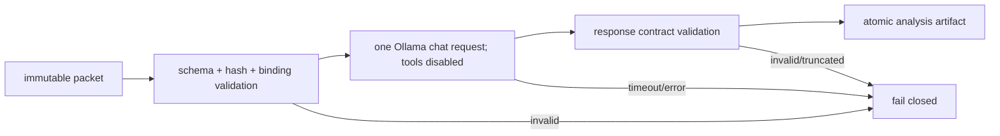

# Tasks: ADR-037 Local Architect / Complex Analyst Pilot

## Objective

Evaluate `qwen3.6:27b-q4_K_M` as a read-only Local Architect / Complex Analyst and
measure whether it improves the existing local stack without assigning it
implementation or reviewer authority.

## Creation-task RRI and review exemption

The documentation package that created ADR-037, this plan, this ledger, and the ADR
index scored `RRI 20` (`Low`, `Effort S`) with `arch_decision +12`. It is ADR/plan/
task-ledger-only work.

- `Task-analysis review: n/a - ADR/plan/task-ledger-only exemption`
- `Code-solution review: n/a - ADR/plan/task-ledger-only exemption`

The RRI values below are preliminary task-card scores produced with
`scripts/rri.py`. Recompute every score immediately before presenting or executing
the task. A recomputed score controls the final Effort, reviewer route, thinking
mode, and approval gate.

## Medium-agent contract

“Medium” in this ledger maps to the canonical `RRI 26–40 Moderate / Effort M /
Balanced capability` band. It is an execution profile, not an authority level.

Medium agents:

- run one task at a time after explicit approval;
- receive fixed inputs, allowed paths, acceptance criteria, and evidence outputs;
- stop rather than widening scope or silently substituting a model/case;
- may report measurements and recommendations but may not accept ADR-037, promote
  the role, approve an architecture, review code officially, or start the next task;
- use the normal Moderate-band phase-1 and phase-2 review routes when a task is a
  development task; operational/evaluation/docs-only exemptions are recorded per
  task and do not confer authority.

## Task order

```text
T0 ─┬─► T1 ─► T4 ───────────────┐
    │    └────────► T5           │
    ├─► T2 ─────────► T5 ─► T6A ├─► T7
    └─► T3 ─────────► T5    └► T6B ┘

T5 FAIL ─────────────────────────► T7 (NO-GO or RETEST; T6A/T6B skipped)
```

## Task summary

| Task | Status | Preliminary RRI | Effort | Agent grade | Depends on |
|---|---|---:|---|---|---|
| T0 Ratify ADR-037 | `[ ] Proposed` | decision gate | S | primary + human | — |
| T1 Resolve and fingerprint model | `[ ] Blocked` | 27 Moderate | M | Medium ops | T0 |
| T2 Freeze corpus and scoring protocol | `[ ] Blocked` | 34 Moderate | M | Medium analyst | T0 |
| T3 Build tool-free invocation wrapper | `[ ] Blocked` | 27 Moderate | M | Medium developer | T0 |
| T4 Runtime and contention profile | `[ ] Blocked` | 28 Moderate | M | Medium operator | T1 |
| T5 Offline blind quality evaluation | `[ ] Blocked` | 36 Moderate | M | Medium evaluator | T1, T2, T3, T4 |
| T6A Shadow cases 1–2 | `[ ] Blocked` | 35 Moderate | M | Medium analyst | T5 PASS |
| T6B Shadow cases 3–5 | `[ ] Blocked` | 35 Moderate | M | Medium analyst | T6A |
| T7 Promotion synthesis and decision | `[ ] Blocked` | 50 Med-high | L | primary + human | T4, T5, T6B or T5 FAIL |

No task below T7 may change ADR-037 from `Proposed` or edit workflow/policy routing.

---

## T0 — Ratify ADR-037 and authorize the pilot boundary

- **Status:** `[ ] Proposed`
- **Effort:** S
- **RRI:** decision ratification; recompute if the ADR is amended
- **Agent grade:** primary + human
- **Depends on:** none
- **Allowed paths:** ADR-037, ADR index, this plan, this ledger
- **Review:** phase 1/phase 2 `n/a` — ADR/plan/task-ledger-only

### Objective

Review the role and authority boundary, then either accept ADR-037 for pilot use,
amend it, or reject it. Acceptance authorizes only T1–T6 evidence collection; it does
not promote the role into the general workflow.

### Requirements

- Confirm the role is architect/complex analyst only.
- Confirm the exact requested model binding and no-substitution rule.
- Confirm the quality, runtime, promotion, and rollback gates.
- Confirm that model download is not authorized until T1 is separately presented
  and approved.

### Acceptance criteria

- Human decision recorded as `accept pilot | amend | reject`.
- If accepted, ADR frontmatter/prose and index both read `Accepted` while the plan
  remains `proposed` until T1 begins.
- `make qa-docs` passes.

### Evidence to emit

- Human decision and date in this task.
- Documentation QA command/results.

### Status artifacts affected

- ADR-037, `docs/adr/README.md`, this plan, this ledger.

### Medium-agent handoff prompt

T0 is not delegated. Stop after recording the human decision and documentation QA;
do not pull the model or start T1.

---

## T1 — Resolve, install, and fingerprint the exact model binding

- **Status:** `[ ] Blocked`
- **Effort:** M
- **Preliminary RRI:** 27 → Moderate; `C0 F0 D3 T2 A0 K3 P1 X2`
- **Agent grade:** Medium ops
- **Depends on:** T0 accepted
- **Allowed surfaces:** local Ollama registry;
  `docs/evaluations/adr037-local-architect-report.md`; this task entry
- **Task-analysis review:** pending — run Gemma before presentation if final RRI is
  0–40
- **Code-solution review:** `n/a` — operational/evaluation task; no code change

### Objective

Resolve and, only after explicit task approval, pull `qwen3.6:27b-q4_K_M`. Record
identity and a smoke result without substituting another installed 27B model.

### Steps for a Medium agent

1. Recompute RRI and present the task; wait for explicit approval.
2. Capture `ollama list` and `/api/tags` before mutation.
3. Resolve the exact requested tag. If it is unavailable, stop `BLOCKED` and record
   the registry/error evidence.
4. Pull only the approved tag; record tag, digest, quantization, size, runtime
   backend, and pull timestamp.
5. Unload every other large model, then run one bounded smoke prompt.
6. Unload Qwen3.6-27B and verify `/api/ps` no longer shows it resident.
7. Write the T1 report section and synchronize this ledger; do not start T4.

### Acceptance criteria

- Exact tag/digest recorded; no silent alias or substitute.
- Smoke response completes and carries model/runtime metadata.
- Only one large model was resident and the model unload is confirmed.
- Missing tag, pull failure, incompatible backend, or memory failure is preserved as
  `BLOCKED`, not hidden by fallback.

### Evidence to emit

- Pre/post `ollama list`, `/api/tags`, `/api/ps`, pull output, digest/quantization,
  smoke transcript, load/unload timestamps.

### Status artifacts affected

- `docs/evaluations/adr037-local-architect-report.md`, this task ledger, plan status.

### Handoff prompt

T1 — resolve and fingerprint the exact ADR-037 model. Governing docs: this ledger +
plan. Pull only after approval. Emit the T1 report evidence. Stop after confirmed
unload; do not benchmark or start T4.

---

## T2 — Freeze the blind corpus and scoring protocol

- **Status:** `[ ] Blocked`
- **Effort:** M
- **Preliminary RRI:** 34 → Moderate; `C0 F2 D3 T2 A1 K2 P1 X4`
- **Agent grade:** Medium analyst
- **Depends on:** T0 accepted
- **Allowed paths:** `docs/evaluations/adr037-case-manifest.md`,
  `.agent/local-architect/adr037/cases/`, this task entry
- **Task-analysis review:** `n/a` — planning/evaluation-artifact exemption
- **Code-solution review:** `n/a` — planning/evaluation-artifact exemption

### Objective

Create and freeze 12–15 reproducible, pre-decision cases plus scoring anchors before
any candidate output is inspected.

### Steps for a Medium agent

1. Recompute RRI and verify T0.
2. Select cases by the category quotas in the plan, using commits before the answer
   was encoded.
3. For each case, record source revision, included excerpts, question, non-goals,
   critical constraints, accepted reference outcome, automatic failures, and
   redactions.
4. Exclude any case whose answer appears in the supplied snapshot or whose evidence
   cannot be reproduced.
5. Build immutable input packets and compute a SHA-256 manifest hash per case and for
   the corpus.
6. Create evaluator instructions and randomized lane IDs without revealing their
   mapping.
7. Have a second human verify all security/data cases and a 25% sample of the rest.
8. Freeze the manifest; later edits invalidate affected outputs and require rerun.

### Acceptance criteria

- 12–15 valid cases meet every category quota.
- The retired ADR-036 16-card corpus is not reused as promotion evidence.
- Every packet has a source revision, redaction decision, expected constraints,
  automatic failures, and hashes.
- Lane mapping is separate from evaluator artifacts.

### Evidence to emit

- Case manifest, per-case packet hashes, corpus hash, source revisions, exclusion
  log, redaction log, verification sign-off, lane-mapping checksum.

### Status artifacts affected

- `docs/evaluations/adr037-case-manifest.md`, this task ledger.

### Handoff prompt

T2 — freeze the ADR-037 blind corpus from pre-decision snapshots. Governing docs:
this ledger + plan. Emit manifest and hashes. Stop when the corpus is frozen; do not
run any model lane.

---

## T3 — Implement the one-shot, tool-free invocation wrapper

- **Status:** `[ ] Blocked`
- **Effort:** M
- **Preliminary RRI:** 27 → Moderate; `C1 F1 D3 T1 A0 K2 P1 X2`
- **Agent grade:** Medium developer; default Moderate local implementer routing
- **Depends on:** T0 accepted
- **Allowed paths:** `scripts/local-architect/run_analysis.py`,
  `scripts/local-architect/run_analysis_test.py`
- **Task-analysis review:** Gemma before presentation, per final RRI
- **Code-solution review:** Gemma Reviewer/D14 before closure, per final RRI

### Objective

Implement a narrow Ollama client that reads one immutable packet, invokes one model
without tools, validates the structured response, and atomically writes one result
artifact with provenance.

### Happy-path examples

- `HP-1`: valid packet + installed exact model + valid structured response → one
  provenance-complete result artifact is written atomically.
- `HP-2`: response labels claims and supplies every required section → schema
  validation passes and generation metrics are preserved.

### Edge-case examples

- `EC-1`: requested model tag/digest differs from the approved binding → fail before
  inference; no result artifact.
- `EC-2`: missing section, invalid claim label, truncated response, timeout, or
  unreachable Ollama → non-zero exit; raw failure evidence preserved separately;
  no valid result artifact.
- `EC-3`: output path falls outside the caller-provided artifact root → reject before
  writing.

### Steps for a Medium agent

1. Recompute RRI, run phase-1 review, present the full development card, and wait for
   approval.
2. Write tests for `HP-1`, `HP-2`, `EC-1`, `EC-2`, and `EC-3` first.
3. Reuse the repository's Ollama HTTP conventions; do not add a tool loop, shell,
   repository traversal, or automatic repair.
4. Validate packet and binding identity before inference.
5. Write raw failure evidence separately and valid output atomically.
6. Run focused tests, standard applicable QA, phase-2 review, two Reflection passes,
   and unit-coverage certification before closure.
7. Synchronize evidence and this task entry; stop before a live candidate run.

### Conceptual diagram



### Acceptance criteria

- All HP/EC unit tests pass with mocked HTTP; implemented scope meets the repository
  coverage gate.
- Model receives no callable tools and cannot mutate a worktree.
- Valid result includes packet hash, model tag/digest, prompt version, parameters,
  timestamps, metrics, and all ADR-037 sections/labels.
- Output writes are restricted to the explicit artifact root and atomic.

### Evidence to emit

- Test output/coverage, example valid artifact, one artifact per failure class,
  phase-1/phase-2 reports, Reflection log, HP/EC unit mapping.

### Status artifacts affected

- This task ledger; T3 section of the ADR-037 report if the report exists.

### Handoff prompt

T3 — implement only the one-shot tool-free wrapper and tests. Governing docs: this
ledger + plan. Allowed paths are the two named Python files. Stop after review,
Reflection, unit evidence, and ledger sync; do not run the corpus.

---

## T4 — Measure runtime, residency, and contention

- **Status:** `[ ] Blocked`
- **Effort:** M
- **Preliminary RRI:** 28 → Moderate; `C0 F0 D3 T2 A0 K3 P1 X3`
- **Agent grade:** Medium operator
- **Depends on:** T1
- **Allowed surfaces:** existing `scripts/local-bench/` commands; raw artifact root;
  report and this task entry
- **Task-analysis review:** pending — run Gemma before presentation if final RRI is
  0–40
- **Code-solution review:** `n/a` — operational/evaluation task; no code change

### Objective

Measure the candidate on the real 32 GB machine and determine whether the operating
envelope in ADR-037 is viable.

### Steps for a Medium agent

1. Recompute RRI; verify exact model identity and T1 unload evidence.
2. Record machine, OS, Ollama, power, background-load, and baseline swap state.
3. Warm the candidate once, unload it, then run five measured samples at 8K and 16K.
4. Run one bounded 24K operating-ceiling sample. If the existing script lacks 24K,
   record the limitation and use a separately declared prompt size; do not relabel
   32K as 24K.
5. Run one 32K stress sample and a load/unload/reload cycle.
6. Run the existing contention/soak measurement with the normal development stack,
   maintaining one-large-model residency.
7. Record raw metrics and compute median/min/max without deleting failed samples.
8. Compare only against ADR-037's proposed gates; do not promote the role.
9. Unload the model, synchronize report/ledger, and stop.

### Acceptance criteria

- Five complete 8K and 16K samples plus declared 24K and 32K samples, or an explicit
  `BLOCKED/RETEST` reason.
- Prefill, decode, TTFT proxy, wall time, peak memory, swap delta, load/unload, and
  contention evidence retained.
- No simultaneous residency with Qwen3.6-35B-A3B or Gemma 4 26B.
- Gate result is mechanical: pass/fail/unknown per metric.

### Evidence to emit

- Raw JSON, exact commands, machine/runtime fingerprint, `/api/ps` snapshots,
  memory/swap samples, summary table, failures, final unload proof.

### Status artifacts affected

- `docs/evaluations/adr037-local-architect-report.md`, this task ledger.

### Handoff prompt

T4 — profile the exact ADR-037 binding with the existing local-bench tools. Preserve
all raw samples and one-model residency evidence. Stop after report/ledger sync and
confirmed unload; do not run T5.

---

## T5 — Run the offline blind quality evaluation

- **Status:** `[ ] Blocked`
- **Effort:** M
- **Preliminary RRI:** 36 → Moderate; `C0 F1 D3 T3 A1 K2 P2 X4`
- **Agent grade:** Medium evaluator
- **Depends on:** T1, T2, T3, T4
- **Allowed surfaces:** frozen case packets, tool-free wrapper, raw artifact root,
  blind score sheets, report and this task entry
- **Task-analysis review:** pending — run Gemma before presentation if final RRI is
  0–40
- **Code-solution review:** `n/a` — evaluation-only; no code change

### Objective

Compare candidate, local baseline, and primary/reference lanes without exposing lane
identity to evaluators, then decide only whether the shadow stage is eligible.

### Steps for a Medium agent

1. Recompute RRI and verify every input/corpus hash.
2. Run each lane in a fresh session from the identical packet and fixed parameters;
   never switch models inside a case.
3. Preserve raw output, normalize presentation without changing semantic content,
   assign random lane IDs, and verify blindness.
4. Run automatic-failure checks before human scoring.
5. Obtain two independent human scores for every critical case and one for all other
   cases; adjudicate differences of 15+ points.
6. Unblind only after score sheets are locked and hashed.
7. Compute per-dimension, per-category, and aggregate results with failure counts and
   confidence caveats.
8. If ADR-037's offline gates pass, unblock T6A. Otherwise skip T6A/T6B and unblock
   T7 for `NO-GO` or `RETEST` synthesis.
9. Synchronize report/ledger and stop.

### Acceptance criteria

- All valid cases and lanes have attributable raw artifacts, or failures are counted.
- No evaluator sees lane identity before scores are frozen.
- Every critical case has two evaluator records and required adjudication.
- Gate calculation is reproducible from score sheets; no failed case is discarded.

### Evidence to emit

- Raw/normalized outputs, invocation metadata, blind mapping/hash, evaluator score
  sheets, adjudications, automatic-failure log, aggregate tables, gate result.

### Status artifacts affected

- `docs/evaluations/adr037-local-architect-report.md`, this task ledger, T6A/T7
  blocker state.

### Handoff prompt

T5 — run the frozen corpus across the three lanes, preserve blindness, score against
ADR-037, and update only the offline gate. Stop after ledger/report sync; do not
start shadow cases.

---

## T6A — Shadow-mode batch 1: two real cases

- **Status:** `[ ] Blocked`
- **Effort:** M
- **Preliminary RRI:** 35 → Moderate; `C0 F1 D3 T3 A1 K2 P2 X3`
- **Agent grade:** Medium analyst
- **Depends on:** T5 passes the offline quality gate
- **Allowed surfaces:** two approved live problem packets, artifact root, report,
  this task entry
- **Task-analysis review:** pending — run Gemma before presentation if final RRI is
  0–40
- **Code-solution review:** `n/a` — evaluation-only; no implementation

### Objective

Measure workflow utility on two real problems while the candidate output remains
non-operative and hidden from the primary agent until the primary draft plan exists.

### Steps for a Medium agent

1. Recompute RRI; approve and freeze two activation-eligible problem packets.
2. Record the primary agent/human time to produce an independent draft plan.
3. Run the candidate tool-free; preserve and validate its artifact.
4. Reveal the artifact only after the independent draft is frozen.
5. Record each recommendation as `adopted | partially adopted | rejected`, with
   reason and any corrected fact.
6. Record time to approvable plan, reopened decisions, critical omissions, and
   whether activation was worth its latency.
7. Update report/ledger and stop; do not implement either proposed solution as part
   of this task.

### Acceptance criteria

- Two complete, independently drafted comparisons.
- Candidate never edits or reviews implementation.
- Adoption and timing fields are evidence-backed, not retrospective estimates when
  direct timing is available.
- Any critical hallucination stops shadow expansion and routes to T7.

### Evidence to emit

- Frozen packets/hashes, independent draft timestamps, candidate artifacts, decision
  delta logs, adoption labels, planning-time measurements, stop-trigger log.

### Status artifacts affected

- ADR-037 report, this ledger, T6B/T7 blocker state.

### Handoff prompt

T6A — run exactly two shadow cases after independent primary drafts exist. Record
decision deltas and timing. Stop without implementation and without starting T6B.

---

## T6B — Shadow-mode batch 2: three real cases

- **Status:** `[ ] Blocked`
- **Effort:** M
- **Preliminary RRI:** 35 → Moderate; `C0 F1 D3 T3 A1 K2 P2 X3`
- **Agent grade:** Medium analyst
- **Depends on:** T6A complete with no critical stop trigger
- **Allowed surfaces:** three approved live problem packets, artifact root, report,
  this task entry
- **Task-analysis review:** pending — run Gemma before presentation if final RRI is
  0–40
- **Code-solution review:** `n/a` — evaluation-only; no implementation

### Objective

Complete the five-case shadow sample using the same frozen procedure and close the
evidence set needed by T7.

### Steps for a Medium agent

Repeat T6A steps for exactly three new cases. Verify activation criteria before each
case, preserve the independent primary draft, record recommendation disposition and
planning time, and stop immediately on a critical hallucination or authority breach.

### Acceptance criteria

- Three new cases plus T6A yield five total complete shadow comparisons.
- Procedure, timing, and adoption taxonomy match T6A.
- No candidate output becomes a canonical plan without primary verification and the
  normal workflow gates.

### Evidence to emit

- Same evidence schema as T6A for three cases; five-case aggregate utility table.

### Status artifacts affected

- ADR-037 report, this ledger, T7 blocker state.

### Handoff prompt

T6B — execute the remaining three shadow cases under the T6A protocol. Emit the
five-case aggregate. Stop after ledger/report sync; do not promote ADR-037.

---

## T7 — Synthesize promotion decision and propagate only after human approval

- **Status:** `[ ] Blocked`
- **Effort:** L
- **Preliminary RRI:** 50 → Med-high; `C0 F2 D3 T2 A1 K2 P3 X4` plus
  `arch_decision +12`
- **Agent grade:** primary + cross-vendor phase-1 peer + human; not Medium-delegable
- **Depends on:** T4 and T5, plus T6B when shadowing proceeds; T5 failure may route
  directly here
- **Allowed paths:** ADR-037, ADR index, plan, ledger, final report; workflow/policy
  files only after a separate explicit promotion approval
- **Task-analysis review:** `n/a` while report/docs-only; any later workflow-policy
  change is separately scored, presented, reviewed, and approved
- **Code-solution review:** `n/a` — report/ADR/plan/task-ledger-only

### Objective

Produce a traceable `GO | RETEST | NO-GO` recommendation from raw evidence and ask
the human owner for the final decision. Medium-agent self-promotion is forbidden.

### Steps

1. Recompute RRI and resolve the applicable phase-1 path for the exact scope.
2. Audit every ADR-037 gate against raw-source references; mark missing evidence
   `UNKNOWN`.
3. Separate model-quality failures, packet/harness defects, corpus defects, and
   runtime failures.
4. Recommend:
   - `GO` only when every promotion gate passes;
   - `RETEST` only with a bounded remediation and invalidated-case list;
   - `NO-GO` when the role lacks quality/utility or violates a critical gate.
5. Present the report and proposed propagation diff to the human; wait.
6. On approved `GO`, create a separately scored policy-propagation task before
   editing workflow routing. On `RETEST`, reopen only named tasks. On `NO-GO`, keep
   ADR-037 as rejected/deprecated per the owner's selected record form and disable
   the lane.

### Acceptance criteria

- Every gate has raw evidence or `UNKNOWN`; no result is inferred from missing data.
- Decision authority is human and recorded.
- ADR/index/plan/ledger status remain consistent.
- Workflow policy is not edited under this task without its own RRI, presentation,
  and explicit approval.
- `make qa-docs` passes after any status update.

### Evidence to emit

- Final report, gate table, failure taxonomy, raw-source map, recommendation,
  human decision, documentation QA output.

### Status artifacts affected

- ADR-037, ADR index, plan, this ledger, final report; optional future workflow task.

### Handoff prompt

T7 — synthesize the evidence into GO/RETEST/NO-GO and present it. Do not delegate to
a Medium agent. Stop at the human decision boundary; do not edit workflow policy
without a new approved task.
