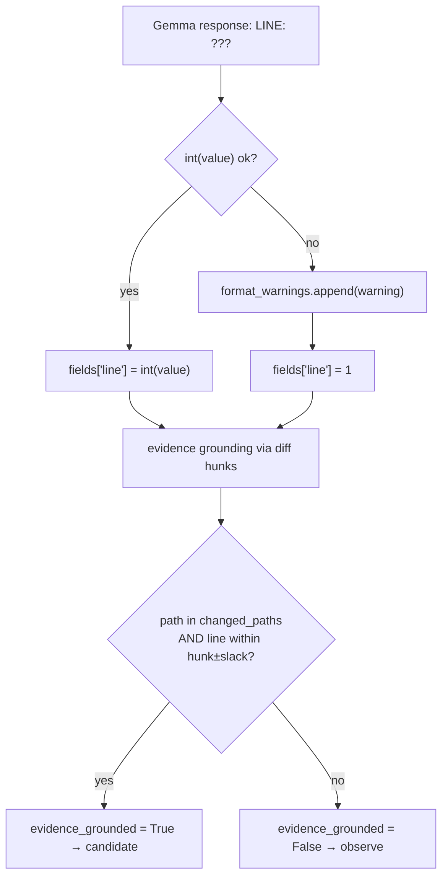

# B-07 — push-review parser_rejection: `LINE must be an integer`

> Surfaced on 2026-06-25 during live monitoring of push-review run `28200576352`
> (SHA `d2c2102`). The fix for `before == after` (B-06) was confirmed working —
> diff was 3855 chars, `changed_paths` correct — but Gemma's response was blocked
> by the parser because the `LINE` field contained a non-integer value.

- **Task ID:** B-07
- **Status:** Done — implemented 2026-06-25
- **Effort:** S
- **Complexity:** Low
- **RRI:** ~15 → Low (0–25)
- **Recommended model:** Local Gemma via Ollama (primary agent is orchestrator of record)

## Objective

Ensure that when Gemma returns a non-integer value for the `LINE` field in a
push-audit finding block, the push-review produces a usable result (PASS or
FINDINGS) instead of a `parser_rejection` BLOCKED artifact.

## Context

The push-audit parser (`parse_push_audit_response` in `scripts/gemma-push-review.py`)
requires `LINE` to be a positive integer:

```python
try:
    fields["line"] = int(fields["line"])
except ValueError as exc:
    raise RuntimeError("invalid push-audit response: LINE must be an integer") from exc
```

The system prompt shows `LINE: 123` as an example but does not explicitly state
that `LINE` must be a positive integer or provide a fallback instruction for when
the exact line is unknown. When Gemma cannot determine the exact line number it
defaults to `LINE: N/A` (or similar), which the parser rejects as a RuntimeError,
triggering `parser_rejection` and writing a `blocked.json` artifact.

Evidence from run `28200576352` (SHA `d2c2102`, 2026-06-25):
- `blocked_reason`: `parser_rejection`
- `blocked_message`: `invalid push-audit response: LINE must be an integer`
- Gemma generated 178 tokens before the block — it processed the diff successfully
- The fix for `before == after` was confirmed: `before=90d2494 ≠ after=d2c2102`, `diff_len=3855`

## Root cause

Two contributing factors, both fixable independently:

1. **System prompt gap:** `LINE: 123` is shown as example but there is no explicit
   constraint telling Gemma that `LINE` must be a positive integer and what to do
   when the exact line is unknown.

2. **Parser intolerance:** `int(fields["line"])` raises `ValueError` on any
   non-numeric string, immediately classifying the entire response as
   `parser_rejection`. A lenient fallback would degrade gracefully.

## Fix options

### Option A — Harden system prompt (primary fix)

Add an explicit constraint to `build_push_audit_system_prompt()`:

```
LINE must be a positive integer (the line number in the file where the issue
begins). If you cannot determine the exact line number, use 1.
```

This directs Gemma to always produce a valid integer, eliminating the root cause.

### Option B — Lenient parser fallback (safety net)

In `_parse_push_finding_block`, after extracting `LINE`, normalize non-integer
values instead of raising immediately:

```python
try:
    fields["line"] = int(fields["line"])
except ValueError:
    # Gemma returned a non-integer (e.g. N/A); normalize to 1 and record warning
    format_warnings.append(f"non-integer LINE value {fields['line']!r} normalized to 1")
    fields["line"] = 1
```

This prevents a full `parser_rejection` when a single LINE is malformed and the
rest of the response is valid. The finding still gets evidence-grounding via the
diff hunks, so `routing` is unaffected.

### Recommended: A + B

Apply Option A to fix the source behavior, and Option B as a safety net so a
future regression (or edge case in a different Gemma version) degrades to a
warning rather than a full block.

## RRI estimate

| Variable | Score | Rationale |
|---|---|---|
| C cyclomatic | 1 | simple try/except + string append |
| F files | 0 | 1 file (`scripts/gemma-push-review.py`) |
| D domain | 0 | advisory scripts, no governance boundary |
| T coverage | 1 | `scripts/gemma_push_review_test.py` has parser tests |
| A ambiguity | 0 | both options are mechanical |
| K coupling | 1 | system prompt and parser are co-owned in the same file |
| P impact | 1 | advisory only; no production data path |
| X context | 0 | fully isolated to push-review script |

**Estimated RRI:** ~15 → Low (0–25) → eligible for local Gemma delegation with primary-agent review.

## Related documents

- `scripts/gemma-push-review.py` — `build_push_audit_system_prompt()`, `_parse_push_finding_block()`
- `scripts/gemma_push_review_test.py` — existing parser tests
- `docs/plan/gemma-push-review-hardening.md` — parent plan
- `docs/daily/2026-06-25.md` — issue ledger entry B-07
- Blocked artifact: `push-review-d2c2102...-28200576352` (GitHub Actions run `28200576352`)

## Inputs

- `scripts/gemma-push-review.py`: `build_push_audit_system_prompt()` (system prompt string)
- `scripts/gemma-push-review.py`: `_parse_push_finding_block()` (LINE parsing, ~line 640)
- `scripts/gemma_push_review_test.py`: existing `parse_push_audit_response` tests

## Outputs

- Updated system prompt with explicit `LINE` constraint
- Updated `_parse_push_finding_block` with lenient fallback for non-integer LINE
- New unit test: `parse_push_audit_response` with `LINE: N/A` produces a finding with `line=1` and a format warning (not a RuntimeError)

## Acceptance criteria

- [x] `build_push_audit_system_prompt()` includes explicit wording: `LINE` must be a positive integer; if exact line is unknown, use `1`.
- [x] `_parse_push_finding_block` does not raise `RuntimeError` when `LINE` is `N/A`, `-`, or any non-integer string — it normalizes to `1` and appends a format warning.
- [x] New unit test passes: response with `LINE: N/A` parses to `line=1` with a format warning in `format_warnings`.
- [x] Existing parser tests still pass (`python3 -m unittest scripts/gemma_push_review_test.py`): 121/121.
- [x] `python3 -m py_compile scripts/gemma-push-review.py` passes.

## Execution summary

1. Edit `build_push_audit_system_prompt` to add the LINE integer constraint.
2. In `_parse_push_finding_block`, wrap `int(fields["line"])` in a try/except; on `ValueError` set `fields["line"] = 1` and append to `format_warnings`.
3. Add a unit test in `gemma_push_review_test.py` covering `LINE: N/A`.
4. Run `python3 -m unittest scripts/gemma_push_review_test.py`.

## Diagram


