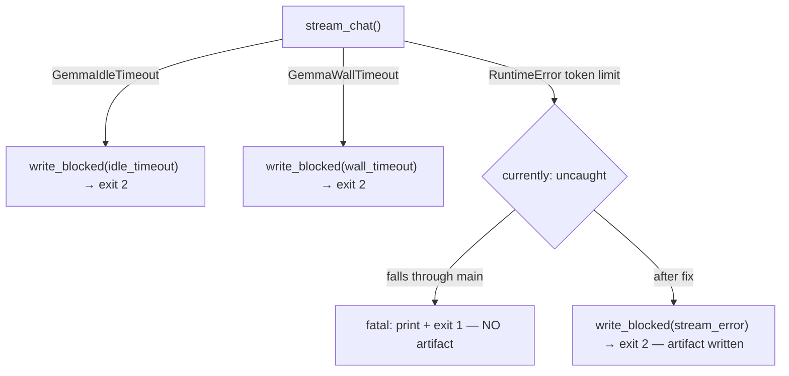

# B-08 — push-review fatal: `response cut by token limit`

> Surfaced on 2026-06-25 during monitoring of push-review run `28202005609`
> (SHA `53a70c1`). The `before != after` fix (B-06) and `LINE: N/A` fix (B-07)
> were both working correctly — packet had `before=a3e2f23 ≠ after=53a70c1`,
> diff 4662 chars, changed_paths correct. Gemma received the packet but its
> response was cut before completion.

- **Task ID:** B-08
- **Status:** Open
- **Effort:** S
- **Complexity:** Low
- **RRI:** ~18 → Low (0–25)
- **Recommended model:** Local Gemma via Ollama (primary agent is orchestrator of record)

## Objective

Ensure that when Gemma's response is truncated by the token limit, the
push-review exits with a `blocked` artifact (exit code 2, non-Gemma agent
fallback) rather than a `fatal` error (exit code 1, no artifact written).

## Context

Run `28202005609` log shows:
```
[push-review] packet written to logs/gemma-push-review/53a70c1.../packet.json
[push-review] fatal: response cut by token limit; output may be truncated
make: *** [qa-gemma-push-review] Error 1
```

The `fatal:` path comes from the `except RuntimeError` block at the bottom of
`main()` in `scripts/gemma-push-review.py`:

```python
if __name__ == "__main__":
    try:
        raise SystemExit(main())
    except RuntimeError as exc:
        print(f"[push-review] fatal: {exc}", file=sys.stderr)
        raise SystemExit(1)
```

`run_push_audit` calls `gemma_local.stream_chat`, which raises a `RuntimeError`
with message `"response cut by token limit; output may be truncated"` when the
model's `done_reason` is `"length"` instead of `"stop"`. That `RuntimeError`
propagates past `run_push_audit`, past `main()`, and is caught by the top-level
handler — which writes no artifact and exits 1.

The correct path for this case already exists: `write_blocked()` + exit 2.
The `GemmaIdleTimeout` and `GemmaWallTimeout` paths in `run_push_audit` already
use it. The token-limit case is missing the same treatment.

## Root cause

In `run_push_audit`, the `stream_chat` call only catches
`GemmaIdleTimeout` and `GemmaWallTimeout`. A token-limit truncation raises a
plain `RuntimeError` from inside `gemma_local`, which is not caught in
`run_push_audit` and falls through to the fatal top-level handler.

## Fix

In `run_push_audit`, add a `except RuntimeError` catch around `stream_chat` that
writes a `blocked` artifact and returns exit code 2, matching the timeout paths:

```python
try:
    stream_result = gemma_local.stream_chat(...)
except gemma_local.GemmaIdleTimeout as exc:
    # existing handler
    ...
except gemma_local.GemmaWallTimeout as exc:
    # existing handler
    ...
except RuntimeError as exc:
    path = write_blocked("stream_error", str(exc), run_info, out_dir, after_sha)
    write_blocked_report(path, _load_json(path), repo_root=repo_root)
    print(f"[push-audit] blocked (stream error): {exc}", file=sys.stderr)
    print(f"[push-audit] non-Gemma agent should review this push manually", file=sys.stderr)
    print(f"[push-audit] blocked artifact: {path}", file=sys.stderr)
    return 2
```

Additionally, consider raising `--num-predict` via `DUBBRIDGE_PUSH_REVIEW_NUM_PREDICT`
in the workflow env to reduce truncation frequency.

## Related documents

- `scripts/gemma-push-review.py` — `run_push_audit()`, top-level `main()` handler
- `scripts/gemma_push_review_test.py` — existing blocked/timeout tests
- `docs/plan/gemma-push-review-hardening.md` — parent plan
- `docs/daily/2026-06-25.md` — issues ledger
- Failed run: GitHub Actions `28202005609` (SHA `53a70c1`)

## Inputs

- `scripts/gemma-push-review.py`: `run_push_audit()` (~line 750), `main()` top-level handler (~line 1664)
- `scripts/gemma_push_review_test.py`: existing `GemmaWallTimeout` / `GemmaIdleTimeout` blocked tests

## Outputs

- `run_push_audit` catches `RuntimeError` from `stream_chat` → `write_blocked("stream_error", ...)` → exit 2
- New unit test: `stream_chat` raising `RuntimeError` produces a `blocked` artifact, not a `fatal`
- Optionally: `DUBBRIDGE_PUSH_REVIEW_NUM_PREDICT` set in `.github/workflows/push-review.yml`

## Acceptance criteria

- [ ] `run_push_audit` catches `RuntimeError` from `stream_chat` and writes a `blocked` artifact (exit 2), not a `fatal` (exit 1).
- [ ] New unit test passes: mocked `stream_chat` raising `RuntimeError("response cut by token limit")` produces `blocked.json` with `blocked_reason="stream_error"`.
- [ ] Existing timeout tests still pass.
- [ ] `python3 -m unittest scripts/gemma_push_review_test.py` → all green.
- [ ] `python3 -m py_compile scripts/gemma-push-review.py` passes.

## Execution summary

1. In `run_push_audit`, add `except RuntimeError as exc` after the two existing timeout handlers, calling `write_blocked("stream_error", ...)` and returning 2.
2. Add unit test mocking `gemma_local.stream_chat` to raise `RuntimeError`.
3. Run full test suite.

## Diagram


