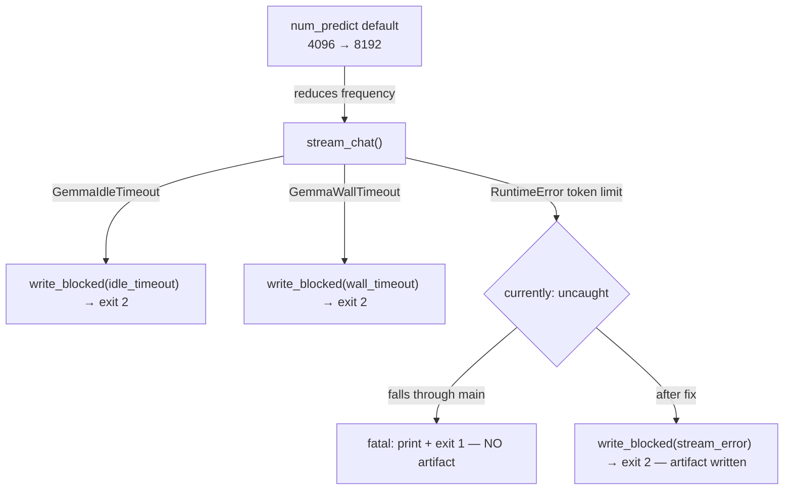

# B-08 — push-review fatal: `response cut by token limit`

> Surfaced on 2026-06-25 during monitoring of push-review run `28202005609`
> (SHA `53a70c1`). The `before != after` fix (B-06) and `LINE: N/A` fix (B-07)
> were both working correctly — packet had `before=a3e2f23 ≠ after=53a70c1`,
> diff 4662 chars, changed_paths correct. Gemma received the packet but its
> response was cut before completion.

- **Task ID:** B-08
- **Status:** Done — implemented 2026-06-26
- **Effort:** S
- **Complexity:** Low
- **RRI:** ~18 → Low (0–25)
- **Recommended model:** Local Gemma via Ollama (primary agent is orchestrator of record)

## Objective

Ensure that when Gemma's response is truncated by the token limit, the
push-review writes a `blocked` artifact (exit code 2) so the non-Gemma agent
or human reviewer has full run context to process the push manually — instead
of a `fatal` exit 1 that leaves no artifact and no fallback path.

## Context

Run `28202005609` log shows:
```
[push-review] packet written to logs/gemma-push-review/53a70c1.../packet.json
[push-review] fatal: response cut by token limit; output may be truncated
make: *** [qa-gemma-push-review] Error 1
```

The `fatal:` path comes from the `except RuntimeError` block at the bottom of
`main()` in `scripts/gemma-push-review.py`:

```python
if __name__ == "__main__":
    try:
        raise SystemExit(main())
    except RuntimeError as exc:
        print(f"[push-review] fatal: {exc}", file=sys.stderr)
        raise SystemExit(1)
```

`run_push_audit` calls `gemma_local.stream_chat`, which raises a `RuntimeError`
with message `"response cut by token limit; output may be truncated"` when the
model's `done_reason` is `"length"` instead of `"stop"`. That `RuntimeError`
propagates past `run_push_audit`, past `main()`, and is caught by the top-level
handler — which writes no artifact and exits 1.

The correct path for this case already exists: `write_blocked()` + exit 2.
The `GemmaIdleTimeout` and `GemmaWallTimeout` paths in `run_push_audit` already
use it. The token-limit case is missing the same treatment.

## Root cause

In `run_push_audit`, the `stream_chat` call only catches
`GemmaIdleTimeout` and `GemmaWallTimeout`. A token-limit truncation raises a
plain `RuntimeError` from inside `gemma_local`, which is not caught in
`run_push_audit` and falls through to the fatal top-level handler.

## Fix

In `run_push_audit`, add a `except RuntimeError` catch around `stream_chat` that
writes a `blocked` artifact and returns exit code 2, matching the timeout paths:

```python
try:
    stream_result = gemma_local.stream_chat(...)
except gemma_local.GemmaIdleTimeout as exc:
    # existing handler
    ...
except gemma_local.GemmaWallTimeout as exc:
    # existing handler
    ...
except RuntimeError as exc:
    path = write_blocked("stream_error", str(exc), run_info, out_dir, after_sha)
    write_blocked_report(path, _load_json(path), repo_root=repo_root)
    print(f"[push-audit] blocked (stream error): {exc}", file=sys.stderr)
    print(f"[push-audit] non-Gemma agent should review this push manually", file=sys.stderr)
    print(f"[push-audit] blocked artifact: {path}", file=sys.stderr)
    return 2
```

The `blocked_message` in the artifact must include an operational hint so the
non-Gemma agent or human reviewer knows what happened and what to do:
`"response truncated by token limit — increase DUBBRIDGE_PUSH_REVIEW_NUM_PREDICT or review packet manually"`.

## Related documents

- `scripts/gemma-push-review.py` — `run_push_audit()`, top-level `main()` handler
- `scripts/gemma_push_review_test.py` — existing blocked/timeout tests
- `docs/plan/gemma-push-review-hardening.md` — parent plan
- `docs/daily/2026-06-25.md` — issues ledger
- Failed run: GitHub Actions `28202005609` (SHA `53a70c1`)

## Inputs

- `scripts/gemma-push-review.py`: `run_push_audit()` (~line 750), `main()` top-level handler (~line 1664)
- `scripts/gemma_push_review_test.py`: existing `GemmaWallTimeout` / `GemmaIdleTimeout` blocked tests

## Outputs

- `run_push_audit` catches `RuntimeError` from `stream_chat` → `write_blocked("stream_error", ...)` → exit 2
- New unit test: `stream_chat` raising `RuntimeError` produces a `blocked` artifact, not a `fatal`
- `blocked_message` includes operational hint: increase `DUBBRIDGE_PUSH_REVIEW_NUM_PREDICT` or review packet manually
- `DEFAULT_NUM_PREDICT` for push-review raised from 4096 → 8192 to reduce truncation frequency on larger packets

## Configuration context

`done_reason="length"` fires when the model exhausts `num_predict` tokens on the *output* side — not when the context window fills.
The B-08 run had a diff of only 4662 chars, so the pressure was on generation length, not context.

| Param | Env var | Default | Controls |
|---|---|---|---|
| `num_predict` | `DUBBRIDGE_PUSH_REVIEW_NUM_PREDICT` | 4096 → **8192** (after fix) | max tokens generated |
| `num_ctx` | `DUBBRIDGE_PUSH_REVIEW_NUM_CTX` | 32768 | total context window (prompt + response) |

Raising `num_predict` to 8192 roughly doubles the headroom for Gemma's response on packets with long CI logs.
The `except RuntimeError` handler remains as a hard safety net for cases that still exceed even 8192 tokens.

To test locally without changing code:
```bash
DUBBRIDGE_PUSH_REVIEW_NUM_PREDICT=8192 python3 scripts/gemma-push-review.py --run-id <run_id>
```

## Acceptance criteria

- [x] `run_push_audit` catches `RuntimeError` from `stream_chat` and writes a `blocked` artifact (exit 2), not a `fatal` (exit 1).
- [x] New unit test passes: mocked `stream_chat` raising `RuntimeError("response cut by token limit")` produces `blocked.json` with `blocked_reason="stream_error"`.
- [x] Existing timeout tests still pass.
- [x] Default `num_predict` for push-review raised to 8192 (`scripts/gemma-push-review.py` argparse default).
- [x] `python3 -m unittest scripts/gemma_push_review_test.py` → 122/122 green.
- [x] `python3 -m py_compile scripts/gemma-push-review.py` passes.

## Execution summary

1. In `run_push_audit`, add `except RuntimeError as exc` after the two existing timeout handlers, calling `write_blocked("stream_error", ...)` and returning 2.
2. Raise the `--num-predict` argparse default (line ~124) from `gemma_local.DEFAULT_NUM_PREDICT` (4096) to `8192`.
3. Add unit test mocking `gemma_local.stream_chat` to raise `RuntimeError`.
4. Run full test suite.

## Diagram


