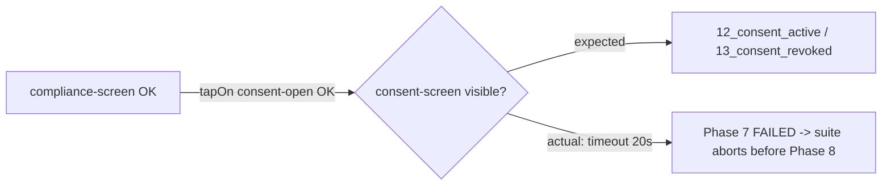

# BUG-S110-01 — Maestro compliance Phase 7: `consent-screen` not reachable

> Surfaced during a local environment bring-up on 2026-06-22 (MacBook M5).
> Updated 2026-06-23 after targeted validation and Low-RRI local Gemma review/delegation.

- **Task ID:** BUG-S110-01
- **Status:** Open — root cause corrected and manual phase verification complete; full `npm run screenshots` copy-out still needs one clean end-to-end confirmation
- **Effort:** S
- **Complexity:** Low
- **RRI:** 24 → Low (0–25)
- **Recommended model:** Local Gemma via Ollama (`gemma4:26b-a4b-it-qat`) with primary-agent review

## Objective

Make the Maestro screenshot suite (`npm run screenshots`) complete Phase 7
(`compliance.yaml`) end-to-end — capturing `12_consent_active` and
`13_consent_revoked` — or fix the underlying app/flow/seed defect that prevents
the consent sub-screen from rendering.

## Context

First full run of the Android screenshot suite on a freshly provisioned machine.
Phases 1-6 pass and the **first half of Phase 7 passes** (compliance center
renders, audit + rights entries assert OK, `11_compliance_center` captured). The
suite then taps `consent-open` and the consent screen never appears, so the suite
aborts (`set -e`) before Phase 8. This isolates the defect to the consent
sub-screen: the whole Android stack (emulator, APK, mock-gateway, Metro, adb,
Maestro) is otherwise proven working.

## Reproduction

1. Android emulator booted (AVD `dubbridge`, API 36 arm64); debug APK installed.
2. From `mobile/`: `START_MOCK_SERVERS=1 npm run screenshots`.
3. Suite reaches Phase 7 → fails.

## Evidence (verbatim from the run)

```
Tap on id: asset-open-compliance... COMPLETED
Assert that id: compliance-screen is visible... COMPLETED
Assert that id: audit-event-audit-seed-1 is visible... COMPLETED
Assert that id: rights-entry-rights-seed-1 is visible... COMPLETED
Take screenshot 11_compliance_center... COMPLETED
Tap on id: consent-open... COMPLETED
Assert that id: consent-screen is visible... FAILED
Assertion is false: id: consent-screen is visible
```

- Failing step: `compliance.yaml` → `extendedWaitUntil { visible: id: consent-screen, timeout: 20000 }` immediately after `tapOn: consent-open`.
- Maestro debug artifacts (UI hierarchy + failure PNG): `/tmp/dubbridge-maestro-compliance-54913/2026-06-22_131318/` (ephemeral).
- Phases 1-6 PNGs captured under `/tmp/dubbridge-maestro-*` (11 distinct screenshots). NOTE: `seed-and-run.sh` copies to `mobile/artifacts/screenshots/` only after Phase 8, so the abort left the committed screenshots untouched.

## Environment

- macOS 26.4, Apple M5, 32 GB.
- Emulator: `system-images;android-36;google_apis;arm64-v8a`, headless `-gpu swiftshader_indirect`.
- App: Expo SDK 56 / RN 0.85, debug APK patched with a fresh release Hermes bundle.
- Maestro 2.6.1, JDK 17, `START_MOCK_SERVERS=1` (mock-gateway on :8081), Metro :8082.

## Root cause (corrected 2026-06-23)

**Validated cause:** the flow needed UI-stability waiting after `tapOn: consent-open`, but the recorded workaround was implemented with an invalid Maestro command.

- H2 ruled out: `testID="consent-screen"` is present on `ConsentScreen.tsx:110`.
- H3 ruled out: the mock server responds to `/api/assets/{id}/consents` without needing a prior `/e2e/seed` call; consent data is in-memory from server start.
- H4 ruled out: the suite passed consistently on the previous machine (different hardware).

The underlying behavior remains environment-sensitive: the `ComplianceScreen → ConsentScreen` transition is a full native stack push with animation, and on the M5/swiftshader setup the flow benefits from explicit stabilization before asserting the next screen. However, the documented workaround from 2026-06-22 used:

```yaml
- pause:
    milliseconds: 2000
```

That command is **not valid in Maestro 2.6.1**. A direct run of `maestro test mobile/maestro/compliance.yaml` failed immediately with:

```text
Invalid Command: pause at /Users/matias/dubbridge/mobile/maestro/compliance.yaml:54:8
```

The final fix is to replace the invalid sleep with Maestro's supported UI-stability command:

```yaml
- waitForAnimationToEnd:
    timeout: 5000
```

This matches Maestro's official wait guidance for post-transition stabilization.

## Acceptance criteria

- [x] Root cause identified and corrected in this record.
- [x] Fix applied in `mobile/maestro/compliance.yaml`: invalid `pause` replaced with `waitForAnimationToEnd`.
- [x] `compliance.yaml` Phase 7 passes; `12_consent_active` + `13_consent_revoked` captured in a targeted manual run.
- [x] Phase 8 (`review.yaml`) runs successfully in a targeted manual run.
- [ ] Full `npm run screenshots` exits `0` and copies the full PNG set to `mobile/artifacts/screenshots/` in a single clean end-to-end rerun.
- [x] Fix is flow/harness-side (not app code).

## Verification (2026-06-23)

- Gemma Reviewer retry packet verdict: `PASS` — no concrete issue found in the narrow wait-strategy change.
- Gemma Developer patch applied to `mobile/maestro/compliance.yaml` under Low-RRI delegation with the primary agent reviewing the generated diff.
- Targeted manual validation commands:
  - `maestro test mobile/maestro/compliance.yaml --test-output-dir /tmp/dubbridge-maestro-compliance-manual-2` → passed
  - `maestro test mobile/maestro/review.yaml --test-output-dir /tmp/dubbridge-maestro-review-manual-3` → passed
- Manual compliance run evidence:
  - `Wait for animation to end within 5000 ms... COMPLETED`
  - `Assert that id: consent-screen is visible... COMPLETED`
  - `Take screenshot 12_consent_active... COMPLETED`
  - `Take screenshot 13_consent_revoked... COMPLETED`
- Manual review/publication run evidence:
  - `Take screenshot 14_review_inbox... COMPLETED`
  - `Take screenshot 15_review_detail... COMPLETED`
  - `Take screenshot 16_review_approved... COMPLETED`
  - `Take screenshot 17_review_published... COMPLETED`
- Full-suite note:
  - A later `START_MOCK_SERVERS=1 SKIP_METRO=1 npm run screenshots` rerun no longer reproduced the Phase 7 consent bug. It passed Phase 1, then failed earlier in Phase 2 (`authenticated-audit.yaml`) with Maestro/ADB transport instability: `io.grpc.StatusRuntimeException: UNAVAILABLE` caused by `java.io.IOException: Command failed (tcp:51463): closed`. The remaining open item is therefore runner-level end-to-end stability and artifact copy-out, not the consent-flow fix itself.

## Related documents

- `mobile/maestro/compliance.yaml` — failing flow
- `mobile/maestro/seed-and-run.sh` — suite runner (no `/e2e/seed` before Phase 7)
- `mobile/maestro/README.md` — suite docs + testID convention
- `docs/playbooks/AGENT_WORKFLOW_GUIDE.md` — workflow authority

## Diagram



Execution started on 2026-06-23. This bug record now captures the corrected root cause, the delegated fix, and the current verification boundary.
