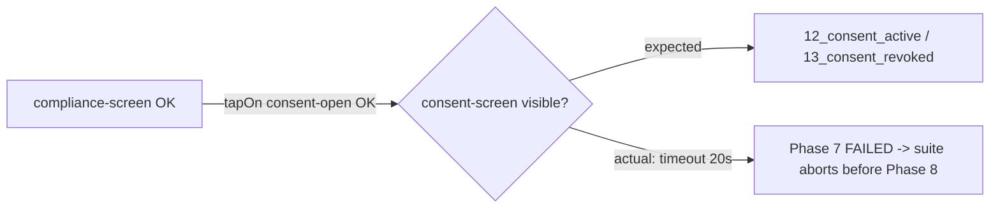

# BUG-S110-01 — Maestro compliance Phase 7: `consent-screen` not reachable

> Surfaced during a local environment bring-up on 2026-06-22 (MacBook M5).
> **For later analysis** — root cause not yet determined; this file captures
> reproducible evidence only, per the request to "generate a bug task, analyze later".

- **Task ID:** BUG-S110-01
- **Status:** Open — needs analysis (HITL)
- **Effort:** M
- **Complexity:** Medium (no RRI computed)
- **Recommended model:** Codex `GPT-5.2-Codex` · Claude Code `Claude Sonnet 4`

## Objective

Make the Maestro screenshot suite (`npm run screenshots`) complete Phase 7
(`compliance.yaml`) end-to-end — capturing `12_consent_active` and
`13_consent_revoked` — or fix the underlying app/flow/seed defect that prevents
the consent sub-screen from rendering.

## Context

First full run of the Android screenshot suite on a freshly provisioned machine.
Phases 1-6 pass and the **first half of Phase 7 passes** (compliance center
renders, audit + rights entries assert OK, `11_compliance_center` captured). The
suite then taps `consent-open` and the consent screen never appears, so the suite
aborts (`set -e`) before Phase 8. This isolates the defect to the consent
sub-screen: the whole Android stack (emulator, APK, mock-gateway, Metro, adb,
Maestro) is otherwise proven working.

## Reproduction

1. Android emulator booted (AVD `dubbridge`, API 36 arm64); debug APK installed.
2. From `mobile/`: `START_MOCK_SERVERS=1 npm run screenshots`.
3. Suite reaches Phase 7 → fails.

## Evidence (verbatim from the run)

```
Tap on id: asset-open-compliance... COMPLETED
Assert that id: compliance-screen is visible... COMPLETED
Assert that id: audit-event-audit-seed-1 is visible... COMPLETED
Assert that id: rights-entry-rights-seed-1 is visible... COMPLETED
Take screenshot 11_compliance_center... COMPLETED
Tap on id: consent-open... COMPLETED
Assert that id: consent-screen is visible... FAILED
Assertion is false: id: consent-screen is visible
```

- Failing step: `compliance.yaml` → `extendedWaitUntil { visible: id: consent-screen, timeout: 20000 }` immediately after `tapOn: consent-open`.
- Maestro debug artifacts (UI hierarchy + failure PNG): `/tmp/dubbridge-maestro-compliance-54913/2026-06-22_131318/` (ephemeral).
- Phases 1-6 PNGs captured under `/tmp/dubbridge-maestro-*` (11 distinct screenshots). NOTE: `seed-and-run.sh` copies to `mobile/artifacts/screenshots/` only after Phase 8, so the abort left the committed screenshots untouched.

## Environment

- macOS 26.4, Apple M5, 32 GB.
- Emulator: `system-images;android-36;google_apis;arm64-v8a`, headless `-gpu swiftshader_indirect`.
- App: Expo SDK 56 / RN 0.85, debug APK patched with a fresh release Hermes bundle.
- Maestro 2.6.1, JDK 17, `START_MOCK_SERVERS=1` (mock-gateway on :8081), Metro :8082.

## Root cause (resolved 2026-06-22)

**H1 confirmed — swiftshader navigation timing.**

- H2 ruled out: `testID="consent-screen"` is present on `ConsentScreen.tsx:110`.
- H3 ruled out: the mock server responds to `/api/assets/{id}/consents` without needing a prior `/e2e/seed` call; consent data is in-memory from server start.
- H4 ruled out: the suite passed consistently on the previous machine (different hardware).

The defect is environment-specific. The `ComplianceScreen → ConsentScreen` transition is a full native stack push with animation. On real ARM64 hardware this completes in milliseconds. Under `swiftshader_indirect` headless GPU emulation on the M5, the render thread is delayed long enough that Maestro's `extendedWaitUntil` starts polling before the screen has finished mounting. The tap on `consent-open` completes successfully but the navigation animation has not finished when the wait begins.

**Fix applied:** added `pause: 2000ms` between `tapOn: consent-open` and `extendedWaitUntil` in `compliance.yaml` to absorb the swiftshader animation delay.

## Acceptance criteria

- [x] Root cause identified (one of the hypotheses or another) and documented here.
- [x] Fix applied: `pause: 2000ms` added to `compliance.yaml` before `extendedWaitUntil consent-screen`.
- [ ] `compliance.yaml` Phase 7 passes; `12_consent_active` + `13_consent_revoked` captured.
- [ ] Phase 8 (review/publication) runs; suite exits 0 and copies the full set of PNGs to `mobile/artifacts/screenshots/`.
- [x] Fix is flow/harness-side (not app code) — swiftshader timing workaround on the M5 emulator.

## Related documents

- `mobile/maestro/compliance.yaml` — failing flow
- `mobile/maestro/seed-and-run.sh` — suite runner (no `/e2e/seed` before Phase 7)
- `mobile/maestro/README.md` — suite docs + testID convention
- `docs/playbooks/AGENT_WORKFLOW_GUIDE.md` — workflow authority

## Diagram



Execution has not started. This is a bug record for later analysis.
