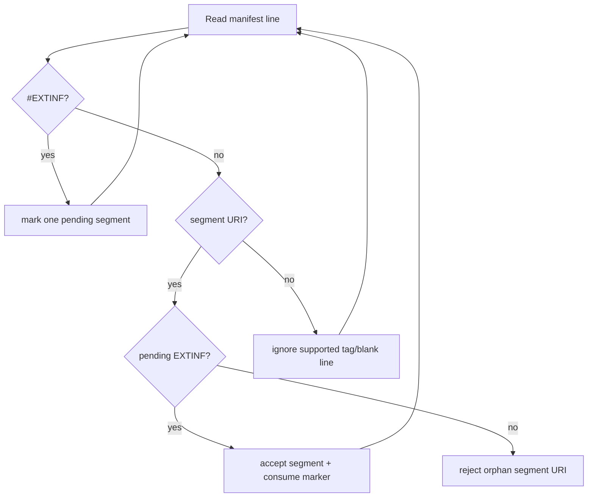

# BUG-S125-01 - HLS manifest validation accepts orphan segment URIs

> Surfaced during local bug scouting on 2026-06-22 while looking for a small
> Low-RRI code patch suitable for local Ollama/Gemma delegation.

- **Task ID:** BUG-S125-01
- **Status:** Done - implemented via local Gemma delegation on 2026-06-22
- **Effort:** S
- **Complexity:** Low
- **RRI:** 25 -> Low (0-25)
- **Recommended model:** Local Gemma via Ollama (`DUBBRIDGE_LOW_RRI_MODEL`, default
  `gemma4:26b-a4b-it-qat`). The primary agent remains orchestrator/reviewer of record.

## Objective

Make `crates/media::validate_hls_outputs` reject HLS manifests where a segment URI
line is not immediately authorized by a preceding `#EXTINF` tag.

## Context

`S-120` produces prepared HLS packages and `S-125` serves them through the
playback boundary. The media validator is part of the fail-closed check that the
stored manifest and segment files form a valid package before playback can rely
on those artifacts.

Today the validator tracks only whether it has seen **any** `#EXTINF` tag. Once
that flag is true, every later non-comment `.ts` line can be accepted as a
segment as long as the final set of segment names matches the provided files.
That means a malformed manifest with an orphan segment URI can pass validation.

## Suspected failing input

```text
#EXTM3U
#EXT-X-VERSION:3
#EXTINF:6.0,
segment_00000.ts
segment_00001.ts
#EXT-X-ENDLIST
```

With provided segment files:

```text
segment_00000.ts
segment_00001.ts
```

Expected: reject because `segment_00001.ts` is not preceded by its own `#EXTINF`.
Current likely behavior: accept because one `#EXTINF` was seen and the segment
set matches the provided files.

## RRI

```md
**Platform:** dubbridge

| Variable | Score | Evidence | Confidence |
|---|---|---|---|
| C cyclomatic | 1 | agent-supplied score | High |
| F files | 0 | --touches -> 1 files | High |
| D domain | 2 | anchor rubric: crates/media (—) -> floor 2; raised from 1 | High |
| T coverage | 1 | agent-supplied | High |
| A ambiguity | 1 | agent-supplied | High |
| K coupling | 2 | anchor rubric: crates/media (—) -> floor 2; raised from 1 | High |
| P impact | 2 | anchor rubric: crates/media (—) -> floor 2; raised from 1 | High |
| X context | 1 | agent-supplied | High |

**Base value:** 100 x (weighted / 5) = 25
**Penalties applied:** none
**Final RRI:** 25 -> band Low (0-25) -> Effort S . Codex Local Gemma via Ollama . Claude Local Gemma via Ollama . thinking Off
**Gates for this band:** Local delegation: delegate to local Gemma via Ollama; validate and apply only an in-scope diff; review against requirements; verify; report.
**Decomposition:** not triggered
```

## Related documents

- Source task file: `docs/tasks/bug-s125-hls-extinf-validation.md`
- Linked plan: `docs/plan/s-125-hls-playback-delivery.md`
- Governing ADR: `docs/adr/ADR-032-hls-playback-delivery-boundary.md`
- Workflow: `docs/playbooks/AGENT_WORKFLOW_GUIDE.md`
- Policy: `docs/policies/RRI_POLICY.md`

## Inputs

- `crates/media/src/lib.rs::validate_hls_outputs`
- Existing HLS validator tests in `crates/media/src/lib.rs`
- The malformed manifest fixture above

## Outputs

- Updated validator logic in `crates/media/src/lib.rs`
- New unit test proving an orphan segment URI is rejected
- Verification evidence for `cargo test -p dubbridge-media`

## Acceptance criteria

- [x] Add a unit test that fails on the current behavior: a manifest with two
      segment URI lines but only one `#EXTINF` must be rejected.
- [x] `validate_hls_outputs` requires each segment URI line to be immediately
      preceded by an unconsumed `#EXTINF` tag.
- [x] Valid manifests with one `#EXTINF` per segment still pass.
- [x] Existing validations remain intact: missing `#EXTM3U`, empty segment files,
      non-file-name segment references, non-`.ts` references, and manifest/provided
      segment mismatches still fail.
- [x] `cargo test -p dubbridge-media` passes.

## Happy paths considered

- **HP-1:** valid VOD manifest with two `#EXTINF` tags and two `.ts` segment lines
  still returns the ordered segment list.

## Edge cases considered

- **EC-1:** a second segment URI appears without a fresh preceding `#EXTINF` ->
  validator rejects the manifest.
- **EC-2:** `#EXTINF` appears without a following segment URI -> validator still
  rejects because no segment reference is collected for that tag.
- **EC-3:** extra tags between `#EXTINF` and the segment URI should not consume the
  pending segment duration marker unless the implementation chooses to reject that
  structure explicitly and the test documents it.

## Execution summary

1. Add the orphan-segment unit test to `crates/media/src/lib.rs`.
2. Update `validate_hls_outputs` to track a pending `#EXTINF` marker rather than a
   global `saw_extinf` flag.
3. Keep the returned segment order unchanged.
4. Run `cargo test -p dubbridge-media`.

## Delegation evidence

- **Delegation path:** `scripts/delegate-low-rri.py --mode before-after`
- **Model:** `gemma4:26b-a4b-it-qat`
- **Patch 1:** Gemma added
  `validate_hls_outputs_rejects_orphan_segment_without_extinf`.
- **Patch 2:** Gemma updated `validate_hls_outputs` to require one pending
  `#EXTINF` before each segment URI and consume that marker after accepting the
  segment.
- **Primary-agent review:** accepted after inspecting the generated diffs and
  running verification.

## Verification

- `cargo fmt --check` -> pass
- `cargo test -p dubbridge-media` -> pass, 18 tests
- `python3 -m unittest scripts/delegate_low_rri_test.py` -> pass, 65 tests

## Diagram



Execution completed on 2026-06-22 via Low-RRI local Gemma delegation, with the
primary agent reviewing and verifying the applied patch.
