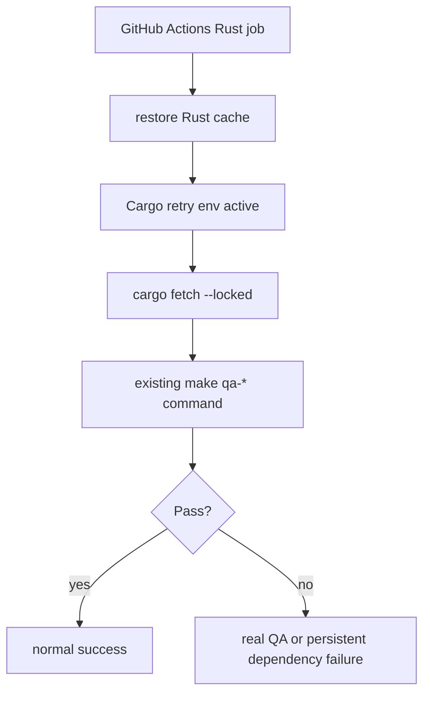

# Tasks: CI Network Hardening

Governing plan: `docs/plan/ci-network-hardening.md`
Governing guides: `docs/playbooks/AGENT_WORKFLOW_GUIDE.md`,
`docs/policies/RRI_POLICY.md`, `docs/policies/HITL_AUTONOMY_POLICY.md`

## Status Legend

- [ ] Not started
- [x] Done
- [~] In progress
- [!] Blocked

## RRI

```md
**Platform:** dubbridge

| Variable | Score | Evidence | Confidence |
|---|---|---|---|
| C cyclomatic | 1 | raw CC 6 -> score 1 (policy CC table) | High |
| F files | 2 | --touches -> 3 files | High |
| D domain | 3 | agent-supplied (no rubric match) | High |
| T coverage | 3 | agent-supplied | High |
| A ambiguity | 0 | agent-supplied | High |
| K coupling | 3 | agent-supplied (no rubric match) | High |
| P impact | 1 | agent-supplied (no rubric match) | High |
| X context | 2 | agent-supplied | High |

**Base value:** 100 x (weighted / 5) = 38
**Penalties applied:** none
**Final RRI:** 38 -> band Moderate (26-40) -> Effort M . Codex Balanced . Claude Balanced . thinking Off
**Gates for this band:** Confirm tests exist in the affected area.
**Decomposition:** not triggered
**Advisory:** .github/workflows/ci.yml: no anchor-rubric match — agent judgment governs D/P/K
```

## Task CIH-T1 — Harden Rust dependency handling in GitHub Actions

**Status:** [x] Done
**Effort:** M
**Complexity:** Moderate
**Depends on:** none
**Recommended model:** Codex `GPT-5.2-Codex` / Claude Code `Claude Sonnet 4`

### Objective

Reduce transient network-driven CI failures in the Rust GitHub Actions jobs by
adding cache/reuse and conservative dependency-fetch hardening without changing
the QA contract.

### Context

This task belongs to the CI Network Hardening plan. It exists because the latest
`ci` workflow failure was caused by `crates.io` dependency download instability,
not by a code regression. The task hardens the workflow mechanics while keeping
the repo's lint, test, coverage, and policy gates exactly as strict as they are
today.

### Related documents

- Source task file: `docs/tasks/ci-network-hardening.md`
- Linked plan: `docs/plan/ci-network-hardening.md`
- Workflow: `.github/workflows/ci.yml`
- Workflow guide: `docs/playbooks/AGENT_WORKFLOW_GUIDE.md`
- RRI policy: `docs/policies/RRI_POLICY.md`
- HITL policy: `docs/policies/HITL_AUTONOMY_POLICY.md`

### Inputs

- Existing `ci` workflow in `.github/workflows/ci.yml`
- Failure evidence from GitHub Actions run `27814184328`
- Current Rust QA jobs: `clippy`, `test`, `cargo-check`, `deny`, `coverage`,
  `release-build`

### Outputs

- Updated `.github/workflows/ci.yml` with:
  - Rust cache/reuse in the affected jobs
  - conservative Cargo retry configuration
  - explicit dependency prefetch before workspace tests
- Updated task/plan docs with completion evidence after implementation

### Acceptance criteria

- [x] The `test` job prefetches dependencies before `make qa-test`.
- [x] Rust compile/test/tool-install jobs reuse Cargo artifacts through workflow
      caching instead of always starting cold.
- [x] Conservative Cargo retry configuration is added without suppressing real
      failures.
- [x] Existing QA commands (`make qa-test`, `make qa-check`, `make qa-lint`,
      `make qa-deny`, `make qa-coverage`, `make qa-build-release`) remain
      unchanged.
- [x] No CI gate is removed, weakened, or converted into best-effort behavior.
- [x] Workflow/documentation verification commands run clean locally.

### Happy path examples

- HP-1: a normal push with reachable `crates.io` reuses cached Cargo state and
  still runs the same QA commands as before.
- HP-2: a fresh runner with no cache can prefetch dependencies, then execute
  `make qa-test` without changing test semantics.

### Edge case examples

- EC-1: a short-lived registry/network reset during dependency resolution is
  absorbed by Cargo retry settings instead of failing the workflow immediately.
- EC-2: a cache miss or stale cache does not skip validation; the workflow falls
  back to a cold but still correct execution path.

### Execution summary

1. Update `.github/workflows/ci.yml` with workflow-level Cargo retry settings.
2. Add Rust cache/reuse to the Rust jobs that compile or install Cargo tools.
3. Add `cargo fetch --locked` before `make qa-test`.
4. Verify the workflow file and run docs consistency checks.
5. Record evidence and final verification in this task ledger.

### Happy paths considered

- Cached runners keep the workflow behavior identical while reducing dependency
  download frequency.
- Cold runners still execute a deterministic dependency prefetch before tests.

### Edge cases considered

- Transient upstream resets should retry without masking persistent failures.
- Cache restore/save issues must not convert hard failures into false greens.

### Reflection strategy

Required passes: 2 (`38` -> `Moderate`)

- Pass 1: wire cache/retry/fetch steps, then critique whether every existing QA
  command and job boundary remains intact.
- Pass 2: review the workflow as a failure analyst, then critique fallback
  behavior for cache misses and persistent network failures before certifying the
  change.

### Diagram



### Reflection log

Required passes: 2 (`38` -> `Moderate`)

#### Pass 1

- **Draft verdict:** Added workflow-level Cargo retry env, `rust-cache` to the
  Rust jobs, and `cargo fetch --locked` before `make qa-test`.
- **Critique findings:** Needed to ensure the change did not alter any existing
  `make qa-*` command or job name, only the dependency-handling mechanics around
  them.
- **Revisions applied:** Kept all QA commands unchanged and scoped the prefetch
  step to `test`, where it improves failure signal the most.

#### Pass 2

- **Draft verdict:** The workflow diff was minimal and the YAML parsed cleanly.
- **Critique findings:** The verification path needed to prove docs status stayed
  consistent and that the workflow file itself remained syntactically valid.
- **Revisions applied:** Ran YAML parsing and `make qa-docs`, then updated the
  plan/task ledger statuses and evidence in the same workflow pass.

### Evidence

- `.github/workflows/ci.yml` now sets `CARGO_NET_RETRY: 5` at workflow scope.
- Added `Swatinem/rust-cache@v2` to the Rust jobs that compile, test, or install
  Cargo tooling: `clippy`, `test`, `cargo-check`, `deny`, `coverage`,
  `release-build`.
- Added `Prefetch workspace dependencies` with `cargo fetch --locked` before
  `make qa-test` in the `test` job.
- Preserved all existing QA commands exactly as-is:
  `make qa-lint`, `make qa-test`, `make qa-check`, `make qa-deny`,
  `make qa-coverage`, `make qa-build-release`.

### Owner final verification

- Owner: `Codex`
- Date: `2026-06-19`
- Statement: I verified the CI hardening change preserves the existing QA
  contract while adding workflow-level retry/caching/prefetch behavior and keeps
  the repository status documents in sync.
- Commands run: `ruby -e 'require "yaml"; YAML.load_file(".github/workflows/ci.yml"); puts "workflow yaml ok"'`; `make qa-docs`; `git diff -- .github/workflows/ci.yml docs/plan/ci-network-hardening.md docs/tasks/ci-network-hardening.md`
