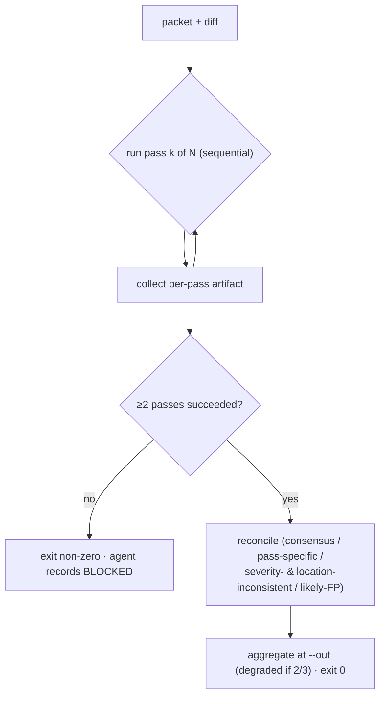
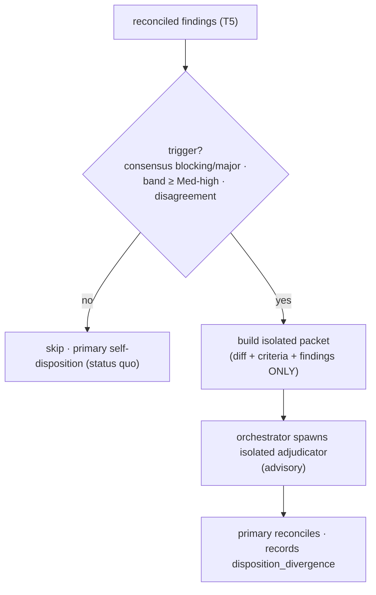

# Tasks: Gemma Process Audit + Reviewer Triple-Pass

## Objective

Add auditable telemetry to both local-Gemma roles (Developer, Reviewer) and
upgrade the Reviewer to a three-pass reconciliation that surfaces disagreement —
without changing the advisory/read-only authority of either role.

## Governing Documents

- `docs/plan/gemma-audit-and-triple-pass.md`
- `docs/adr/ADR-034-gemma-process-audit-and-reviewer-reconciliation.md`
- `docs/playbooks/AGENT_WORKFLOW_GUIDE.md`
- `docs/policies/RRI_POLICY.md`
- `docs/policies/HITL_AUTONOMY_POLICY.md`
- `docs/playbooks/LOW_RRI_LOCAL_MODEL_HANDOFF.md`
- `docs/gemma-local-improve.md`
- `docs/evaluations/large-file-delegation-2026-06-21.md` (truncation defense)

## Slice RRI

The slice bundles a new telemetry subsystem and a reviewer-contract change; an
architecture decision is required, so the slice is presented at **Med-high**.

**Score: 52 → Med-high (41–55) → Effort L → thinking On → Gate: plan + explicit
acceptance criteria + human approval before code.**

| Variable | Score | Evidence | Confidence |
|---|---|---|---|
| C cyclomatic | 3 | N-pass loop + reconciliation classification (dominant: T5) | Medium |
| F files | 1 | per-task ≤2 files; slice spans 15 across 8 tasks | High |
| D domain | 2 | local Ollama tooling / agent pipeline (Python) | High |
| T coverage | 2 | new report + reconciliation logic need new tests | High |
| A ambiguity | 0 | this ledger + plan define scope and criteria | High |
| K coupling | 3 | shared helper, both wrappers, make, governance docs | High |
| P impact | 2 | reviewer advisory contract that agents depend on | High |
| X context | 3 | wrappers, schema, evidence format, quorum/HITL interplay | High |

Penalty: `arch_decision` (+12) — introduces an audit subsystem and changes the
reviewer pass/reconciliation contract. Per-task scores below are computed without
the slice-level penalty (each task executes a pre-decided design).

## Behavioral coverage contract: unit-v1

Tests are Python (`scripts/*_test.py`), not Rust. The Rust-only
`.rs::test_name` certification enforced by `scripts/check-task-unit-coverage.sh`
does not apply; completion evidence is the `python3 -m unittest` runs plus the
synthetic fixtures named in T8. Sections below omit a Rust certification table by
design (same exception as the prior Gemma Reviewer slice).

## Execution strategy (scoped to building this slice)

See `docs/plan/gemma-audit-and-triple-pass.md § Execution strategy`. In short, for
implementing **these** tasks only (not a product/governance change):

- Low-band tasks (T1, T2, T3, T8) are done by the **primary agent directly** — not
  delegated to Gemma Developer.
- Code review of every task is done by a **clean-room subagent uncontaminated by
  the parent** (diff + acceptance criteria only) — not by Gemma Reviewer.
- Existing Gemma scripts, policies, and the closed Gemma slice are left untouched.

The `### Gemma Reviewer evidence` blocks these tasks would normally produce are
replaced, for this slice's execution, by clean-room subagent review evidence.

## Task order and dependencies

```text
                    ┌──────────────► T2 ──────────────────┐
T0b ──► T1 ─────────┼──────────────► T4 ──────────────────┼──► T7 ──► T8
(ADR)   (found.)    └──► T3 ──► T5 ──┬─► T6 ───────────────┤
                                    └─► T6b (adjudicator) ─┘
```

T0b ratifies ADR-034 (decision gate) before any code. T1 is the foundation.
T2/T3/T4 branch off it (T2, T4 parallel; T3 starts the reviewer chain). T5 needs
T3 (same file + reviewer instrumentation) and T1. T6 and T6b both follow T5 and
run in parallel (different files). T7 syncs governance once T2/T4/T6/T6b are done.
T8 closes out.

**Same-file serialization:** `gemma-code-review.py` → T3 → T5 → T6 in order. T6b
adds a **new** file (`scripts/adjudicator-packet.py`), so it does not contend with
that chain and parallelizes with T6.

---

## T0b — Ratify ADR-034 (decision gate)

- **Status:** [x] Done
- **Effort:** S
- **RRI:** n/a (decision-ratification gate, not a code task)
- **Scope:** `docs/adr/ADR-034-gemma-process-audit-and-reviewer-reconciliation.md`,
  `docs/adr/README.md`
- **Depends on:** none (must complete before T1)

### Goal

On slice approval, flip ADR-034 from `Proposed` to `Accepted` and apply the
`AGENT_WORKFLOW_GUIDE.md` "ADR change propagation" contract for an accepted ADR.
The ADR is the decision record for the audit schema, quorum/HITL semantics, and
the reviewer reconciliation contract that the rest of the slice implements.

### Acceptance Criteria

- ADR-034 frontmatter `status:` and the prose `- **Status:**` token both read
  `Accepted`; the `docs/adr/README.md` index status column matches.
- The ADR's scope still names the `gemma-audit-and-triple-pass` slice.
- No code is changed in this task; it is the decision gate only.
- `make qa-docs` passes (index parity + status tokens).

### Completion evidence

- ADR-034 `status: Accepted` in frontmatter and prose; `docs/adr/README.md` index row updated.
- `make qa-docs` passed.

### Handoff Prompt

T0b — ratify ADR-034 to `Accepted` and propagate per the workflow guide's "ADR
change propagation" (index row, frontmatter/prose status parity). Governing docs:
this ledger and the plan. Do not change scripts. Stop after `make qa-docs`.

---

## T1 — Audit foundation in the shared helper

- **Status:** [x] Done
- **Effort:** S
- **RRI:** 24 → Low
- **Scope:** `scripts/gemma_local.py`, `scripts/gemma_local_test.py`, `.gitignore`
- **Depends on:** T0b (ADR-034 ratified)

### RRI (C1 F1 D2 T1 A0 K2 P1 X2)

Low (24). Shared helper used by both roles → K2; no penalty (design pre-decided).

### Goal

Add `append_audit_log()` to `scripts/gemma_local.py` and call it from the same
path as `write_result`, so every Developer and Reviewer invocation appends one
JSONL record to `logs/gemma-audit/YYYY-MM.jsonl`. Define the base schema (D3) with
always-present automatic fields and optional orchestrator fields defaulting to
`null`. Ignore `logs/gemma-audit/` in `.gitignore`.

### Acceptance Criteria

- `append_audit_log(record, *, now=...)` writes exactly one line of JSON to the
  current-month file; the directory is created if absent.
- Writes are append-only and atomic per line (no interleave corruption).
- Automatic fields (`ts`, `role`, `outcome`, `done_reason`, `mode`, `elapsed_s`,
  `escalated`) are always present; orchestrator fields default to `null`.
- Secret/credential redaction is applied to any free-text field per
  `HITL_AUTONOMY_POLICY.md`; no file contents or packet bodies are written.
- `.gitignore` ignores `logs/gemma-audit/`.
- Unit tests cover schema defaults, append semantics, month rollover by `now`,
  redaction, and directory auto-creation.

### Happy Paths Considered

- **HP-1:** a record with only automatic fields → valid line, null orchestrator
  fields.
- **HP-2:** a record with `task_id`/`attempt` supplied → those fields populated.

### Edge Cases Considered

- **EC-1:** `logs/gemma-audit/` does not exist → created before write.
- **EC-2:** a field contains a secret-shaped token → redacted before write.
- **EC-3:** two records appended in sequence → two valid independent lines.

### Completion evidence

- `append_audit_log(record, *, now=...)` implemented in `scripts/gemma_local.py`.
- Schema: automatic fields always present; orchestrator fields default to `null`.
- Secret redaction via `_redact()` applied; `logs/gemma-audit/` added to `.gitignore`.
- `python3 -m unittest scripts.gemma_local_test` — all tests pass.

### Handoff Prompt

T1 — add `append_audit_log` to `scripts/gemma_local.py` and ignore
`logs/gemma-audit/`. Governing docs: this ledger and
`docs/plan/gemma-audit-and-triple-pass.md` (D1–D3). Files: `scripts/gemma_local.py`,
`scripts/gemma_local_test.py`, `.gitignore`. Do not change either wrapper yet.
Stop after `python3 -m unittest scripts.gemma_local_test`.

---

## T2 — Developer audit emission

- **Status:** [x] Done
- **Effort:** S
- **RRI:** 22 → Low
- **Scope:** `scripts/delegate-low-rri.py`, `scripts/delegate_low_rri_test.py`
- **Depends on:** T1

### RRI (C1 F1 D2 T1 A0 K1 P1 X2)

Low (22). Single wrapper path → K1.

### Goal

Populate the developer-specific audit fields (`mode`, `file_lines`,
`file_tokens_est`, `packet_tokens_est`, `response_tokens`, `done_reason`,
`diff_added`, `diff_removed`, `scope_violations`, `apply_result`, `verify_ok`,
`elapsed_s`, `escalated`) and emit one audit record per delegation via the T1
helper. No change to delegation behavior or the patch contract.

### Acceptance Criteria

- One audit record is appended per `delegate-low-rri.py` invocation with `role:
  "developer"`.
- `done_reason` from the stream is recorded (so `length` truncation is auditable).
- `diff_added`/`diff_removed` and `scope_violations` reflect the built diff and
  scope check; `apply_result` ∈ `clean|fail|skipped`.
- Optional `task_id`/`attempt` are passed through CLI flags when supplied, else
  `null`.
- Existing delegation tests still pass; new tests assert the emitted record shape.

### Edge Cases Considered

- **EC-1:** `NO_PATCH`/`BLOCKED`/`REJECT` outcome → record still emitted with the
  correct `outcome` and `apply_result: "skipped"`.
- **EC-2:** dry-run → record emitted (or explicitly skipped) per a documented flag,
  not silently dropped.

### Completion evidence

- Developer audit fields wired: `mode`, `diff_added/removed`, `scope_violations`, `apply_result`, `verify_ok`, `done_reason`, `elapsed_s`, `escalated`.
- One audit record per delegation; `task_id`/`attempt` passed through CLI flags.
- `python3 -m unittest scripts/delegate_low_rri_test.py` — all tests pass.

### Handoff Prompt

T2 — wire developer audit emission into `scripts/delegate-low-rri.py` using the
T1 helper. Governing docs: this ledger and the plan. Files:
`scripts/delegate-low-rri.py`, `scripts/delegate_low_rri_test.py`. Do not change
the patch contract. Stop after `python3 -m unittest scripts/delegate_low_rri_test.py`.

---

## T3 — Reviewer audit emission (single-pass)

- **Status:** [x] Done
- **Effort:** S
- **RRI:** 22 → Low
- **Scope:** `scripts/gemma-code-review.py`, `scripts/gemma_code_review_test.py`
- **Depends on:** T1

### RRI (C1 F1 D2 T1 A0 K1 P1 X2)

Low (22). First edit in the reviewer same-file chain (T3 → T5 → T6).

### Goal

Populate reviewer-specific audit fields (`outcome`, `findings_count`,
`findings_by_severity`, `out_of_scope`, `done_reason`, `elapsed_s`) and emit one
audit record per current single-pass review via the T1 helper. `dispositions`
remains `null` until the orchestrator supplies it.

### Acceptance Criteria

- One audit record per review invocation with `role: "reviewer"`.
- `findings_by_severity` counts `{blocking, major, minor, nit}`; `out_of_scope`
  counts findings whose path is outside the reviewed diff's changed-set.
- `done_reason` recorded; truncated reviews are auditable.
- Existing reviewer tests pass; new tests assert the emitted record shape for
  `PASS` and `FINDINGS`.

### Edge Cases Considered

- **EC-1:** `BLOCKED` (operational) → record emitted with `outcome: "BLOCKED"`.
- **EC-2:** out-of-scope finding present → counted, not dropped.

### Completion evidence

- Reviewer audit fields wired: `findings_count`, `findings_by_severity`, `out_of_scope`, `done_reason`, `elapsed_s`.
- `role: "reviewer"` record appended per single-pass invocation.
- `python3 -m unittest scripts.gemma_code_review_test` — all tests pass.

### Handoff Prompt

T3 — wire reviewer audit emission into `scripts/gemma-code-review.py` (current
single-pass) using the T1 helper. Governing docs: this ledger and the plan. Files:
`scripts/gemma-code-review.py`, `scripts/gemma_code_review_test.py`. Do not add
multi-pass yet (that is T5). Stop after
`python3 -m unittest scripts.gemma_code_review_test`.

---

## T4 — Audit report tool

- **Status:** [x] Done
- **Effort:** M
- **RRI:** 31 → Moderate
- **Scope:** `scripts/gemma-audit-report.py` (new),
  `scripts/gemma_audit_report_test.py` (new)
- **Depends on:** T1

### RRI (C2 F2 D2 T2 A0 K1 P1 X2)

Moderate (31). New aggregation logic + thresholds → T2; new file → F2.

### Goal

Add a read-only tool that consumes `logs/gemma-audit/*.jsonl` and emits per-role
process metrics and the D4 calibration signals (truncation rate, escalation rate,
destructive-diff detection, out-of-scope rate, dismissed-major rate, inter-pass
disagreement). Add `make qa-gemma-audit`.

### Acceptance Criteria

- Tool reads one or more monthly JSONL files and never writes to them.
- Reports, per role: counts, success/escalation/truncation rates, mode
  distribution, latency summary; reviewer adds finding-quality + disagreement.
- Each D4 threshold breach is flagged in the output (signal, not a failing gate).
- Tolerates records with `null` optional fields without crashing.
- `python3 scripts/gemma-audit-report.py` runs against the local log directory (exit 0, "no records found" when empty).
- Unit tests cover metric math, threshold flagging, and null-field tolerance.

### Happy Paths Considered

- **HP-1:** a log with mixed developer+reviewer records → both sections rendered.
- **HP-2:** an empty/missing log → clean "no records" output, exit 0.

### Edge Cases Considered

- **EC-1:** a malformed line → skipped with a count of skipped lines, not a crash.
- **EC-2:** records missing optional fields → treated as `null`, excluded from
  rate denominators where appropriate.

### Completion evidence

- `scripts/gemma-audit-report.py` (new) reads JSONL; never writes to logs.
- Per-role metrics: counts, rates, finding-quality, disagreement. D4 thresholds flagged as signals.
- Tolerates `null` optional fields and malformed lines (skipped with count).
- `python3 -m unittest scripts/gemma_audit_report_test.py` — all tests pass. `make qa-docs` passed.

### Handoff Prompt

T4 — add `scripts/gemma-audit-report.py` + test + `make qa-gemma-audit`.
Governing docs: this ledger and the plan (D4). Read-only; tolerate null/malformed
records. Stop after `python3 -m unittest scripts/gemma_audit_report_test.py` and
`make qa-docs`.

---

## T5 — Triple-pass execution + reconciliation

- **Status:** [x] Done
- **Effort:** M
- **RRI:** 40 → Moderate
- **Scope:** `scripts/gemma-code-review.py`, `scripts/gemma_code_review_test.py`
- **Depends on:** T1, T3

### RRI (C3 F1 D2 T2 A0 K3 P2 X3)

Moderate (40), top of band. Dominant-complexity task of the slice. (With the
slice `arch_decision` penalty this task alone scores 52 / Med-high — see slice
RRI; the penalty is counted once at slice level.)

### Goal

Run N passes (default 3, `--passes`, `DUBBRIDGE_REVIEW_PASSES`) sequentially over
the same packet, persist per-pass artifacts (`result.passK.json`) and one
aggregate at the base `--out` path, apply the quorum rule (D6), and run the
deterministic reconciliation (D8) producing the aggregate schema (D7/D12).
`--passes 1` reproduces today's behavior exactly.

### Acceptance Criteria

- `--passes N` runs N sequential passes; `--passes 1` is byte-for-byte the current
  single-pass contract (no reconciliation block emitted).
- Per-pass artifacts derive from `--out`; the aggregate is written at `--out`.
- Quorum (D6): ≥2/3 success → aggregate (exactly 2/3 → `degraded: true`); <2 →
  exit non-zero, no aggregate, agent records `BLOCKED`.
- A pass with `done_reason == "length"` is failed (truncation defense) and counts
  against quorum.
- Reconciliation classifies findings as `consensus` / `pass-specific` /
  `severity-inconsistent` / `location-inconsistent` / `likely-false-positive`
  using the D8 rules (`±3`, `≥2 = consensus`); disagreements are surfaced, never
  silently collapsed.
- Exit codes follow D7.
- Unit tests cover: N-pass loop, quorum boundaries (3/3, 2/3 degraded, 1/3 fail),
  each reconciliation class, truncation-fails-pass, and `--passes 1` backward
  compatibility.

### Happy Paths Considered

- **HP-1:** 3/3 PASS → aggregate `PASS`, no findings, `degraded: false`, exit 0.
- **HP-2:** 3/3 FINDINGS with one consensus + one pass-specific finding →
  aggregate marks both classes correctly.
- **HP-3:** `--passes 1` → identical to current single-pass output.

### Edge Cases Considered

- **EC-1:** 2/3 succeed, 1 BLOCKED → `degraded: true` aggregate, exit 0.
- **EC-2:** 1/3 succeed → exit non-zero, no aggregate (quorum fails).
- **EC-3:** same issue reported at line 142 and 145 across passes →
  `location-inconsistent`, clustered as candidate-same.
- **EC-4:** same `(path,line)` with `major` vs `minor` → `severity-inconsistent`.
- **EC-5:** single-pass-only out-of-scope finding → `likely-false-positive`.
- **EC-6:** a pass truncates (`done_reason == length`) → that pass fails; if the
  other two succeed, aggregate is `degraded`.

### Diagram



### Completion evidence

- N-pass loop (`--passes N`, `DUBBRIDGE_REVIEW_PASSES`) with per-pass artifacts (`result.passK.json`).
- Quorum D6: ≥2/3 → aggregate (`degraded: true` if exactly 2/3); <2 → exit 3.
- `done_reason == "length"` fails the pass (truncation defense).
- Reconciliation D8: `consensus` / `pass-specific` / `severity-inconsistent` / `location-inconsistent` / `likely-false-positive`.
- `--passes 1` byte-for-byte identical to prior single-pass contract.
- `python3 -m unittest scripts.gemma_code_review_test` — all tests pass.

### Handoff Prompt

T5 — add N-pass execution + deterministic reconciliation to
`scripts/gemma-code-review.py`. Governing docs: this ledger and the plan
(D5–D10). Files: `scripts/gemma-code-review.py`,
`scripts/gemma_code_review_test.py`. Keep read-only/advisory; `--passes 1` must
match current behavior exactly. Honor the truncation defense from
`docs/evaluations/large-file-delegation-2026-06-21.md`. Stop after
`python3 -m unittest scripts.gemma_code_review_test`.

---

## T6 — Multi-pass audit emission + Makefile

- **Status:** [x] Done
- **Effort:** M
- **RRI:** 27 → Moderate
- **Scope:** `scripts/gemma-code-review.py`, `scripts/gemma_code_review_test.py`,
  `Makefile`
- **Depends on:** T5

### RRI (C1 F2 D2 T1 A0 K2 P1 X2)

Moderate (27). Extends T3 emission with the D12 pass-level fields.

### Goal

Emit one aggregate reviewer audit record carrying the D12 pass-level fields
(`passes_run`, `passes_succeeded`, `degraded`, `consensus_count`,
`pass_specific_count`, `severity_inconsistent_count`, `likely_false_positive_count`)
and update `make qa-gemma-review` for the multi-artifact output.

### Acceptance Criteria

- A multi-pass review appends one aggregate audit record with the D12 fields.
- `--passes 1` still emits the single-pass record from T3 (no pass-level inflation).
- `make qa-gemma-review` reflects per-pass + aggregate artifact paths and remains
  local-only (not added to `qa-ci`); `DUBBRIDGE_SKIP_GEMMA_REVIEW=1` still skips.
- Tests assert the aggregate audit record shape for a 3-pass run and a degraded run.

### Edge Cases Considered

- **EC-1:** quorum fails (<2) → no aggregate audit record (consistent with the
  non-zero exit / BLOCKED path).
- **EC-2:** docs-only diff → reviewer skips; no audit record, per existing scope.

### Completion evidence

- Aggregate audit record carries D12 fields: `passes_run`, `passes_succeeded`, `degraded`, `consensus_count`, `pass_specific_count`, `severity_inconsistent_count`, `likely_false_positive_count`.
- `--passes 1` still emits the T3 single-pass record (no inflation).
- `make qa-gemma-review` updated for per-pass + aggregate artifact paths.
- `python3 -m unittest scripts.gemma_code_review_test` — all tests pass. `make qa-docs` passed.

### Handoff Prompt

T6 — emit the D12 aggregate audit record and update `make qa-gemma-review`.
Governing docs: this ledger and the plan (D11–D12). Files:
`scripts/gemma-code-review.py`, `scripts/gemma_code_review_test.py`, `Makefile`.
Stop after `python3 -m unittest scripts.gemma_code_review_test` and `make qa-docs`.

---

## T6b — Clean-room adjudicator gate, packet builder, divergence

- **Status:** [x] Done
- **Effort:** M
- **RRI:** 34 → Moderate
- **Scope:** `scripts/adjudicator-packet.py` (new),
  `scripts/adjudicator_packet_test.py` (new)
- **Depends on:** T1, T5

### RRI (C2 F1 D2 T2 A0 K2 P2 X3)

Moderate (34). New isolation/trigger logic that consumes reconciled findings (T5)
and feeds the audit schema (T1). Below T5; does not raise the slice band.

### Goal

Implement the deterministic half of D14: a trigger gate that decides when isolated
adjudication is required, and a packet builder that assembles the adjudicator's
input from *only* the final diff, the acceptance criteria, and the reconciled
findings — provably excluding any development transcript. Define the
`disposition_divergence` audit field (orchestrator-supplied). The act of spawning
the isolated reviewer is an orchestrator-runtime action; this task delivers the
inspectable, testable scaffolding it runs on.

### Acceptance Criteria

- Trigger gate fires only on: consensus `blocking`/`major` findings, slice band
  ≥ Med-high, or inter-pass disagreement; it does **not** fire for Low / 3-of-3
  `PASS` / no-consensus inputs.
- The packet builder output contains the diff, acceptance criteria, and reconciled
  findings, and **provably contains no development-transcript content** (asserted
  by an allowlist-of-sections test, not a denylist).
- `disposition_divergence` is defined as an optional audit field (defaults to
  `null`, like `dispositions`) capturing primary-vs-adjudicator disagreement.
- The adjudicator role is documented as **advisory**: it never closes the task;
  the primary agent reconciles and owns the close (authority unchanged).
- Unit tests cover: each trigger condition (fire / no-fire), packet isolation
  (no dev context leaks), and divergence-field shape.

### Happy Paths Considered

- **HP-1:** consensus blocking finding on a Med-high task → trigger fires; packet
  built with diff + criteria + findings only.
- **HP-2:** Low task, 3/3 `PASS`, no findings → trigger does not fire; no packet,
  no spawn.

### Edge Cases Considered

- **EC-1:** findings exist but all `nit`/`minor`, band below Med-high, no
  disagreement → trigger does not fire.
- **EC-2:** a caller tries to pass development-transcript text into the packet →
  builder excludes it; isolation test fails closed if it ever appears.
- **EC-3:** adjudicator disposition matches the primary's →
  `disposition_divergence` records "none", still logged.

### Diagram



### Completion evidence

- `scripts/adjudicator-packet.py` (new): `should_adjudicate(aggregate, band, *, gemma_blocked=False)` and `build_adjudicator_packet(diff, criteria, reconciled_findings)`.
- `gemma_blocked=True` always returns True — mandatory fallback when Gemma unavailable or quorum fails.
- D14 trigger conditions: consensus blocking/major, band ≥ Med-high, inter-pass disagreement.
- Packet isolation enforced by `ALLOWED_PACKET_SECTIONS` allowlist; `_assert_packet_isolation()` fails closed.
- `DISPOSITION_DIVERGENCE_VALUES = {"none", "partial", "full"}` documented.
- Adjudicator authority documented as advisory; primary agent owns close.
- `python3 -m unittest scripts/adjudicator_packet_test.py` — 46 tests pass.
- Fixtures: `docs/fixtures/adjudicator-trigger-fires.json`, `docs/fixtures/adjudicator-trigger-no-fire.json`.

### Handoff Prompt

T6b — implement the D14 adjudicator trigger gate + isolation packet builder in
`scripts/adjudicator-packet.py` and define `disposition_divergence`. Governing
docs: this ledger, the plan (D14), and ADR-034 §7. Keep the adjudicator advisory;
the primary agent owns the close. Isolation must be enforced by an allowlist of
packet sections, asserted by tests. Stop after
`python3 -m unittest scripts/adjudicator_packet_test.py`.

---

## T7 — Governance docs sync

- **Status:** [x] Done
- **Effort:** M
- **RRI:** 29 → Moderate
- **Scope:** `docs/playbooks/AGENT_WORKFLOW_GUIDE.md`,
  `docs/policies/HITL_AUTONOMY_POLICY.md`, `docs/policies/RRI_POLICY.md`,
  `docs/playbooks/LOW_RRI_LOCAL_MODEL_HANDOFF.md`, `docs/gemma-local-improve.md`,
  `docs/plan/gemma-reviewer-triple-pass.md`
- **Depends on:** T2, T4, T6, T6b

### RRI (C0 F3 D2 T1 A0 K2 P2 X3)

Moderate (29). Cross-document policy consistency → X3, K2.

### Goal

Sync governance docs to the implemented contracts: the multi-pass evidence block
(D11), the quorum/partial-availability rule (D6) in HITL, the evidence-block
reference in RRI policy, the audit + review-split note in the Low-RRI handoff, the
active-contract summary in local docs, the **context-isolated adjudicator** (D14)
in the `§ Reflection` / `§ Gemma Reviewer` sections and HITL authority model, and
a superseded banner on the old triple-pass plan.

### Acceptance Criteria

- `AGENT_WORKFLOW_GUIDE.md § Gemma Reviewer` documents N-pass behavior, the quorum
  rule, and the redefined `### Gemma Reviewer evidence` block (passes, quorum,
  consensus/disagreement, degraded, artifacts); `--passes 1` form documented as
  backward compatible.
- `HITL_AUTONOMY_POLICY.md` states quorum failure (<2 passes) is the existing
  "absence never blocks" path — `BLOCKED` evidence, normal Reflection, no new gate.
- `AGENT_WORKFLOW_GUIDE.md § Reflection` / `§ Gemma Reviewer` document the D14
  isolated adjudicator: trigger conditions, advisory authority, the primary's
  obligation to reconcile and record `disposition_divergence`, and that simulated
  self-review remains only below the trigger threshold. `HITL_AUTONOMY_POLICY.md`
  confirms the adjudicator is advisory and the primary remains orchestrator of
  record.
- `RRI_POLICY.md` references the updated evidence block.
- `LOW_RRI_LOCAL_MODEL_HANDOFF.md` notes the audit log and the developer-vs-reviewer
  audit fields.
- `docs/gemma-local-improve.md` summarizes the audit log + multi-pass contract.
- `docs/plan/gemma-reviewer-triple-pass.md` carries a "Superseded by
  docs/plan/gemma-audit-and-triple-pass.md" banner.
- `make qa-docs` passes.

### Completion evidence

- `AGENT_WORKFLOW_GUIDE.md § Gemma Reviewer`: N-pass behavior, quorum rule, multi-pass evidence block, D14 adjudicator (trigger table, advisory authority, `disposition_divergence`), mandatory fallback policy.
- `HITL_AUTONOMY_POLICY.md`: review mandatory; isolated subagent as required fallback; no new human gate.
- `RRI_POLICY.md`: evidence block reference updated; mandatory fallback note added.
- `LOW_RRI_LOCAL_MODEL_HANDOFF.md`: "Audit log" section with developer vs. reviewer field distinction.
- `docs/gemma-local-improve.md`: audit log + multi-pass contract + mandatory fallback summary.
- `docs/plan/gemma-reviewer-triple-pass.md`: superseded banner already present — no change needed.
- ADR-034 §4 amended: "absence never blocks" → "review mandatory; isolated subagent is the required fallback".
- `make qa-docs` passed.

### Handoff Prompt

T7 — sync governance docs to the implemented audit + triple-pass contracts.
Governing docs: this ledger and the plan (D6, D11, D12). Update only the named
docs; add the superseded banner. Do not change scripts. Stop after `make qa-docs`.

---

## T8 — Close-out evidence and status sync

- **Status:** [x] Done
- **Effort:** S
- **RRI:** 21 → Low
- **Scope:** this ledger, the plan, local evidence/fixtures
- **Depends on:** T7

### RRI (C0 F2 D2 T1 A0 K1 P1 X2)

Low (21). Evidence recording, no behavior change.

### Goal

Record end-to-end evidence and synthetic fixtures proving the slice works.

### Acceptance Criteria

- This ledger records completion evidence for T0b and T1–T7 (incl. T6b).
- Synthetic reviewer fixtures demonstrate: `PASS` aggregate (3/3), `FINDINGS`
  aggregate with surfaced disagreement, `degraded` aggregate (2/3), and quorum
  failure (<2 → BLOCKED).
- Adjudicator fixtures demonstrate: trigger fires on a consensus blocking finding
  (isolated packet built, no dev context) and does not fire on a Low 3/3 `PASS`
  case; one `disposition_divergence` record is captured.
- A sample `gemma-audit-report.py` run over a fixture log is captured.
- All script unit tests pass; `make qa-docs` passes.

### Completion evidence

- Ledger: T0b–T7 (incl. T6b) marked `[x] Done` with inline completion evidence.
- Fixtures added to `docs/fixtures/`:
  - `gemma-review-pass.json` — 3/3 PASS aggregate
  - `gemma-review-findings.json` — FINDINGS aggregate with consensus major + pass-specific surfaced
  - `gemma-review-degraded.json` — degraded aggregate (2/3)
  - `gemma-review-blocked.json` — quorum failure BLOCKED + mandatory fallback action
  - `adjudicator-trigger-fires.json` — consensus blocking finding; isolated packet built; `disposition_divergence: "none"`
  - `adjudicator-trigger-no-fire.json` — Low band, 3/3 PASS; trigger does not fire
  - `gemma-audit-report-sample.txt` — `gemma-audit-report.py` run over fixture log (5 records, 2 developer + 3 reviewer)
- All slice tests: `python3 -m unittest scripts.gemma_local_test scripts.gemma_code_review_test scripts.delegate_low_rri_test scripts.gemma_audit_report_test scripts/adjudicator_packet_test.py` → **217 tests, OK**.
- `make qa-docs` passed.
- Plan `docs/plan/gemma-audit-and-triple-pass.md` marked `status: done`.

### Handoff Prompt

T8 — close out the slice. Governing docs: this ledger and the plan. Record
evidence for T1–T7, add the named fixtures, run the documented checks. Stop after
status docs are synced; do not start unrelated work.

---

## Slice complete

All tasks T0b–T8 are done. The slice delivered:
- Append-only audit log for both Gemma roles via `scripts/gemma_local.py`.
- N-pass triple-pass reviewer with deterministic reconciliation in `scripts/gemma-code-review.py`.
- Audit report tool `scripts/gemma-audit-report.py`.
- Context-isolated adjudicator gate + packet builder in `scripts/adjudicator-packet.py`.
- Mandatory review policy: Gemma preferred, isolated subagent as required fallback.
- Governance docs synced: `AGENT_WORKFLOW_GUIDE.md`, `HITL_AUTONOMY_POLICY.md`, `RRI_POLICY.md`, `LOW_RRI_LOCAL_MODEL_HANDOFF.md`, `docs/gemma-local-improve.md`, ADR-034 §4.
